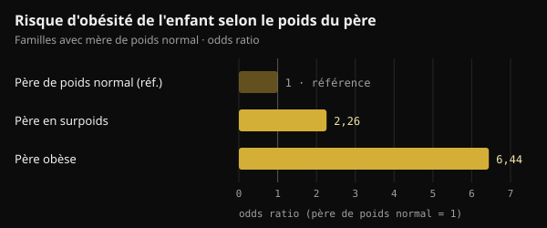
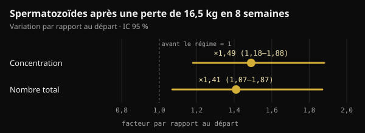

# Poids du père à la conception : ce qui passe vraiment à l'enfant

Quand on parle de santé avant la grossesse, on pense presque toujours à la mère. Une étude publiée dans Nature en 2024 a aussi braqué les projecteurs sur le père. Voici ce qu'elle a vraiment montré, ce qui a été ajouté en route, et ce qu'il est utile de faire dans les mois qui précèdent un projet de bébé.

## En bref

- Chez la souris, deux semaines d'alimentation très grasse avant l'accouplement ont suffi à rendre intolérants au glucose environ 30 % des descendants mâles, sans changer leur poids.
- L'effet disparaissait si le père revenait à une alimentation normale pendant 4 semaines avant de concevoir : chez la souris, le signal est réversible.
- Chez l'humain, ce sont des associations : dans deux cohortes de Leipzig, avec une mère de poids normal, un père en surpoids était lié à un risque d'obésité de l'enfant environ doublé.
- Certains chiffres qui circulent sur les réseaux (un fragment « multiplié par 3,8 » qui bloque l'enzyme hexokinase 2) ne figurent pas dans l'étude originale.
- Dans les mois avant la conception, comptent le poids, l'alimentation et le mode de vie. Un complément d'acide folique et de zinc pour l'homme, testé sur 2 370 couples, n'a pas augmenté les naissances.

## Ce qu'a réellement fait l'étude publiée dans Nature

L'étude est signée Anika Tomar et ses collègues du Helmholtz Munich, sous la direction de Raffaele Teperino, et a paru dans Nature en juin 2024. La question était précise : si l'alimentation du père modifie quelque chose dans ses spermatozoïdes, cela se passe-t-il pendant leur fabrication dans le testicule ou ensuite, pendant leur maturation dans l'épididyme ?

L'épididyme est le canal accolé au testicule où les spermatozoïdes terminent leur maturation. Les chercheurs ont donné à de jeunes souris mâles un régime apportant 60 % des calories sous forme de graisses pendant 2 semaines seulement. Un groupe s'accouplait aussitôt avec des femelles jamais exposées. L'autre revenait d'abord à une alimentation normale pendant 4 semaines : ses petits naissaient donc de spermatozoïdes qui n'avaient jamais connu le régime gras.

- **Le poids des descendants ne changeait pas**, mais environ 30 % des mâles du premier groupe devenaient intolérants au glucose (ils géraient moins bien le sucre sanguin) et moins sensibles à l'insuline.
- **Les descendants du second groupe étaient normaux** : le signal venait des spermatozoïdes exposés au régime pendant leur maturation, et il disparaissait après un mois d'alimentation normale.
- **Les spermatozoïdes contenaient davantage de petits ARN mitochondriaux**, les ARN de transfert mitochondriaux (mt-ARNt) et leurs fragments (mt-tsARN). Sur des embryons à deux cellules, les auteurs ont montré que les mt-ARNt paternels passent à l'embryon lors de la fécondation.

C'est une voie de transmission qui ne passe pas par l'ADN : pas une mutation, mais un signal lié à l'état métabolique du père à ce moment-là.

## Et chez l'être humain ?

Le même travail contient deux types de données humaines. Le premier concerne les spermatozoïdes : chez 18 jeunes volontaires finlandais, les mt-tsARN étaient le seul type de petit ARN qui augmentait avec l'indice de masse corporelle (IMC). Les auteurs parlent eux-mêmes d'un petit échantillon.

Le second concerne les enfants. Dans deux études pédiatriques de Leipzig (Leipzig Childhood Obesity Cohort et LIFE Child), l'IMC du père était associé à celui de l'enfant, même en tenant compte de celui de la mère. Dans les familles où la mère avait un poids normal, un père en surpoids était associé à un risque d'obésité de l'enfant environ doublé, et un père obèse à un risque plus de six fois supérieur.

*Source : Tomar et al., Nature 2024, cohortes de Leipzig. Odds ratios rapportés dans le texte de l'étude ; père de poids normal = référence. Graphique Nurvan.*

Pour donner un ordre de grandeur, le poids de la mère expliquait 18 % des différences d'IMC entre enfants, celui du père 6 % de plus. Les auteurs ont corrigé pour la parenté et un risque génétique estimé, mais une étude observationnelle ne peut pas séparer complètement biologie et habitudes familiales : un foyer qui mange mal le fait généralement ensemble.

## Toutes les études ne vont pas dans le même sens

Toujours en 2024, une équipe de Barcelone a publié dans Heliyon une expérience proche, avec une différence : les souris mâles devenaient vraiment obèses avec un régime de type occidental. Les spermatozoïdes des pères obèses présentaient 450 régions de l'ADN à l'accessibilité modifiée (plus ou moins « ouvertes » à la lecture). Pourtant, les descendants, mâles et femelles, n'avaient que de légères modifications métaboliques en début de vie, ensuite disparues. Aucune prédisposition durable à l'obésité ou au diabète.

Les auteurs parlent de résilience des descendants : un changement mesuré dans les spermatozoïdes ne signifie pas automatiquement un effet sur l'enfant.

Deux mots à ne pas confondre : un effet **intergénérationnel** concerne les enfants (F1) conçus avec des spermatozoïdes exposés ; un effet **transgénérationnel** atteint les petits-enfants et au-delà (F2, F3) sans nouvelle exposition. L'étude de Nature ne concerne que les enfants.

## Ce qui circule et ce que dit l'étude

Sur les réseaux, cette étude est souvent racontée avec des détails très précis : un fragment d'ARN multiplié par 3,8 qui entre dans l'embryon et bloque l'ARNm de l'hexokinase 2 (une enzyme clé pour utiliser le glucose), des descendants intolérants obtenus par fécondation in vitro, et des fragments 2,3 fois plus élevés chez les hommes avec un IMC supérieur à 30.

Ces chiffres ne figurent pas dans le texte intégral de l'étude sur PubMed Central. On les retrouve, attribués à Tomar et ses collègues, dans une revue parue dans Clinical Epigenetics en 2026. Dans l'étude originale, en revanche :

- les descendants intolérants au glucose sont issus d'un **accouplement naturel** ; la fécondation in vitro servait uniquement à produire des embryons à deux cellules pour l'analyse ;
- les auteurs écrivent que leurs données montrent le passage des mt-ARNt entiers, **pas** celui des fragments, qu'ils jugent probable mais non prouvé ;
- l'analyse des spermatozoïdes humains traite l'IMC comme une variable continue chez 18 jeunes hommes, sans comparer ceux au-dessus et au-dessous de 30.

Le mécanisme raconté avec tant d'assurance reste donc, pour l'instant, une hypothèse plausible.

## Le poids du père peut changer, et les spermatozoïdes réagissent

Un spermatozoïde humain met environ deux mois à se former et à arriver dans l'éjaculat : dans une étude à l'eau marquée chez 11 hommes, les premiers spermatozoïdes « nouveaux » sont apparus en moyenne après 64 jours (de 42 à 76). D'où la fenêtre souvent citée de 2 à 3 mois avant la conception. Chez la souris, ce sont toutefois surtout les dernières semaines de maturation qui comptaient.

Et le sperme s'améliore quand un homme obèse perd du poids. Dans un essai randomisé danois, 56 hommes avec un IMC de 32 à 43 ont suivi pendant 8 semaines un régime à 800 kcal par jour sous surveillance médicale et perdu en moyenne 16,5 kg. La concentration et le nombre de spermatozoïdes ont été multipliés par environ une fois et demie. Le gain se maintenait à un an chez ceux qui gardaient leur nouveau poids, pas chez ceux qui le reprenaient.

*Source : Andersen et al., Hum Reprod 2022 (n = 56). Variation après 8 semaines de régime hypocalorique par rapport au départ, avec intervalle de confiance à 95 %. Graphique Nurvan.*

Chez des hommes atteints d'obésité sévère, la méthylation de l'ADN des spermatozoïdes changeait aussi nettement après une chirurgie bariatrique, y compris dans des zones liées au contrôle de l'appétit.

Il manque toutefois une pièce : aucune étude chez l'humain n'a encore montré que la perte de poids du père avant la conception améliore la santé métabolique de l'enfant. On sait que le poids paternel est associé à la santé de l'enfant et que le sperme réagit à l'amaigrissement ; le lien direct n'a pas été testé.

## Et les compléments pour « préparer » le sperme ?

Ce type d'étude sert souvent à vendre des compléments pour la fertilité masculine. Le test le plus solide disponible va dans le sens inverse.

Dans l'essai FAZST (JAMA, 2020), 2 370 couples sur le point de commencer un parcours de procréation médicalement assistée ont été tirés au sort : les hommes ont pris pendant 6 mois de l'acide folique (5 mg) et du zinc (30 mg) ou un placebo. Les naissances ont été pratiquement identiques, 34 % contre 35 %, et presque tous les paramètres du sperme sont restés inchangés. La fragmentation de l'ADN des spermatozoïdes était même un peu plus élevée avec le complément (29,7 % contre 27,2 %).

L'essai n'a pas mesuré la santé métabolique des enfants, mais le message est clair : aucun complément ne remplace aujourd'hui le poids et le mode de vie, et aucune étude humaine ne justifie un protocole « pré-conception » pour l'homme à partir de ces données.

## Ce que dit vraiment la recherche

Cet article part d'une publication de Marco Guercioni (@the___doc), qui présente l'étude avec prudence et en liste les limites. Voici ses principales affirmations confrontées aux sources originales.

- **Confirmé** — « Tomar et ses collègues, Nature, juin 2024 : ce sont les spermatozoïdes matures qui réagissent à l'alimentation, et 30 % des descendants mâles deviennent intolérants au glucose. » Valable chez la souris.
- **Contredit par l'étude originale** — « Par fécondation in vitro, sans contribution maternelle. » Les descendants étudiés étaient nés d'un accouplement naturel avec des femelles non exposées. La fécondation in vitro servait seulement à analyser des embryons à deux cellules.
- **Non vérifiable** — « Un fragment augmente de 3,8 fois et bloque l'ARNm de l'hexokinase 2 ; chez les hommes avec un IMC supérieur à 30, il est 2,3 fois plus élevé. » Ces chiffres figurent dans une revue de 2026, pas dans l'étude, dont les auteurs écrivent que le passage des fragments à l'embryon n'est pas démontré.
- **À nuancer** — « Dans deux cohortes, l'IMC du père pèse sur la santé métabolique de l'enfant indépendamment de celui de la mère. » L'association existe, mais elle est observationnelle et le père explique une part plus faible que la mère (6 % contre 18 %).
- **Confirmé** — « C'est intergénérationnel, pas transgénérationnel ; chez la souris il y a une chaîne causale, chez l'humain une association. » De même pour le résultat publié dans Heliyon (450 régions, aucune prédisposition durable), obtenu chez la souris.
- **Non vérifiable** — « La moitié du phénomène est l'environnement partagé après la naissance. » L'environnement familial compte, bien sûr, mais nous n'avons trouvé aucune estimation de 50 % dans les sources consultées.
- **Confirmé** — « Aucune donnée humaine ne justifie un protocole de compléments. » L'essai FAZST va dans le même sens.
- **À nuancer** — « Les trois derniers mois sont la fenêtre. » Les spermatozoïdes se forment en environ 2 mois : 3 mois sont une fenêtre prudente.

## Comment l'appliquer

Si tu envisages d'avoir un enfant, voici comment transformer ces données en étapes concrètes. Ce sont de bonnes habitudes générales, pas un traitement.

1. **Commence 2 à 3 mois avant.** C'est le temps nécessaire à une « nouvelle génération » de spermatozoïdes, mais les dernières semaines comptent aussi.
2. **Surveille ton poids et ton tour de taille.** En cas de surpoids, même une perte modérée et durable va dans le bon sens. Les régimes très hypocaloriques, comme celui à 800 kcal de l'étude danoise, uniquement sous surveillance médicale.
3. **Soigne la qualité de ton alimentation.** Plus d'aliments peu transformés, de légumes, de légumineuses et de protéines maigres ; moins d'ultra-transformés et de boissons sucrées.
4. **Entraîne-toi régulièrement**, en combinant force et cardio. Dans l'essai danois, l'exercice était l'une des stratégies pour maintenir le poids perdu.
5. **Tabac, alcool et sommeil.** Arrêter de fumer, réduire l'alcool et dormir suffisamment font partie de la même préparation.
6. **N'achète pas de compléments « pour le sperme » sur la base de ces études.** Si tu as des doutes sur ta fertilité ou si vous essayez depuis longtemps, parles-en à ton médecin ou à un andrologue, qui pourra prescrire un spermogramme.

Il ne s'agit pas de culpabiliser qui que ce soit : c'est un levier de plus. Une revue publiée en 2025 par la même équipe munichoise plaide d'ailleurs pour une préparation à la conception qui implique les deux parents, pas seulement la mère.

<h3>Prépare les trois prochains mois avec des chiffres</h3>

Dans Nurvan, tu enregistres ton poids et tes mensurations, tu suis ton alimentation dans le journal et tu notes chaque séance, pour voir semaine après semaine si tu vas dans la bonne direction. Si tu travailles avec un coach, il voit les mêmes données et peut t'attribuer un plan alimentaire et un programme d'entraînement.

<a href="https://nurvan.app">Essayer Nurvan</a>

## Questions fréquentes

### J'étais en surpoids quand nous avons conçu notre enfant : sera-t-il obèse ?

Non, ce n'est pas une fatalité. Les données décrivent un risque moyen sur de nombreuses familles, pas un destin individuel. Beaucoup de facteurs comptent, à commencer par la façon dont on mange et dont on bouge à la maison, et cela peut changer à tout moment.

### Combien de temps avant la conception le poids du père compte-t-il ?

Les spermatozoïdes humains se forment en environ deux mois, d'où la fenêtre de 2 à 3 mois la plus citée. Chez la souris, 2 semaines de régime suffisaient à provoquer l'effet et 4 semaines d'alimentation normale à l'annuler. Chez l'humain, le délai exact n'a pas été mesuré.

### Existe-t-il des compléments pour « nettoyer » le sperme avant la conception ?

Il n'existe pas de preuve chez l'humain. Dans le plus grand essai, l'acide folique et le zinc pendant 6 mois n'ont augmenté ni les naissances ni la qualité du sperme. En cas de carence ou de problème de fertilité, l'évaluation revient au médecin.

### Est-ce que cela vaut aussi pour la mère ?

Oui, et même davantage : dans les données de Leipzig, le poids de la mère expliquait une plus grande part des différences entre enfants. La nouveauté n'est pas que le père compte plus que la mère, mais qu'il compte aussi.

## Sources

1. Tomar A, Gomez-Velazquez M, Gerlini R et al., 2024. Epigenetic inheritance of diet-induced and sperm-borne mitochondrial RNAs. *Nature* 630(8017):720–727. [PMID 38839949](https://pubmed.ncbi.nlm.nih.gov/38839949/) · [DOI 10.1038/s41586-024-07472-3](https://doi.org/10.1038/s41586-024-07472-3)
2. Tahiri I, Llana SR, Fos-Domènech J et al., 2024. Paternal obesity induces changes in sperm chromatin accessibility and has a mild effect on offspring metabolic health. *Heliyon* 10(14):e34043. [PMID 39100496](https://pubmed.ncbi.nlm.nih.gov/39100496/) · [DOI 10.1016/j.heliyon.2024.e34043](https://doi.org/10.1016/j.heliyon.2024.e34043)
3. Song S, Zhang B, Xiong F et al., 2026. Sperm tRNA-derived fragments: molecular mechanisms and clinical implications for paternal epigenetic inheritance. *Clin Epigenetics* 18(1). [PMID 42135772](https://pubmed.ncbi.nlm.nih.gov/42135772/) · [DOI 10.1186/s13148-026-02155-4](https://doi.org/10.1186/s13148-026-02155-4)
4. Andersen E, Juhl CR, Kjøller ET et al., 2022. Sperm count is increased by diet-induced weight loss and maintained by exercise or GLP-1 analogue treatment: a randomized controlled trial. *Hum Reprod* 37(7):1414–1422. [PMID 35580859](https://pubmed.ncbi.nlm.nih.gov/35580859/) · [DOI 10.1093/humrep/deac096](https://doi.org/10.1093/humrep/deac096)
5. Donkin I, Versteyhe S, Ingerslev LR et al., 2016. Obesity and bariatric surgery drive epigenetic variation of spermatozoa in humans. *Cell Metab* 23(2):369–378. [PMID 26669700](https://pubmed.ncbi.nlm.nih.gov/26669700/) · [DOI 10.1016/j.cmet.2015.11.004](https://doi.org/10.1016/j.cmet.2015.11.004)
6. Misell LM, Holochwost D, Boban D et al., 2006. A stable isotope-mass spectrometric method for measuring human spermatogenesis kinetics in vivo. *J Urol* 175(1):242–246. [PMID 16406920](https://pubmed.ncbi.nlm.nih.gov/16406920/) · [DOI 10.1016/S0022-5347(05)00053-4](https://doi.org/10.1016/S0022-5347(05)00053-4)
7. Schisterman EF, Sjaarda LA, Clemons T et al., 2020. Effect of folic acid and zinc supplementation in men on semen quality and live birth among couples undergoing infertility treatment: a randomized clinical trial. *JAMA* 323(1):35–48. [PMID 31910279](https://pubmed.ncbi.nlm.nih.gov/31910279/) · [DOI 10.1001/jama.2019.18714](https://doi.org/10.1001/jama.2019.18714)
8. Skerrett-Byrne DA, Pepin AS, Laurent K et al., 2025. Dad's diet shapes the future: how paternal nutrition impacts placental development and childhood metabolic health. *Mol Nutr Food Res* 69(22):e70261. [PMID 40913545](https://pubmed.ncbi.nlm.nih.gov/40913545/) · [DOI 10.1002/mnfr.70261](https://doi.org/10.1002/mnfr.70261)

Article inspiré d'une publication de [Marco Guercioni (@the___doc)](https://www.instagram.com/p/DdokwJDiH92/). Sources consultées via PubMed.

> Note : contenu informatif, qui ne remplace pas l'avis d'un médecin ou d'un professionnel qualifié.
