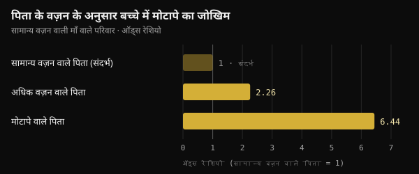
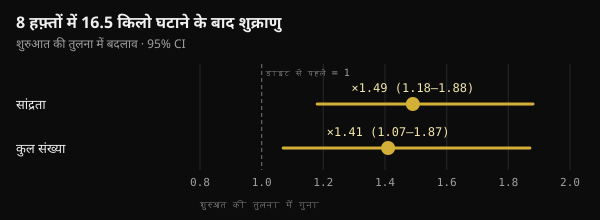

# गर्भधारण के समय पिता का वज़न: बच्चे तक असल में क्या पहुँचता है

गर्भावस्था से पहले की सेहत की बात होती है तो ज़्यादातर लोग सिर्फ़ माँ के बारे में सोचते हैं। 2024 में Nature में छपी एक स्टडी ने पिता की ओर भी ध्यान खींचा। यहाँ जानिए कि उसने असल में क्या साबित किया, रास्ते में उसमें क्या जोड़ दिया गया, और बच्चे की योजना से पहले के महीनों में क्या करना समझदारी है।

## संक्षेप में

- चूहों में संभोग से पहले दो हफ़्ते की बहुत ज़्यादा वसा वाली डाइट से लगभग 30% नर संतानों में ग्लूकोज़ सहनशीलता बिगड़ गई, जबकि उनका वज़न नहीं बदला।
- अगर पिता गर्भधारण से पहले 4 हफ़्ते सामान्य खाने पर लौट आता, तो यह असर ग़ायब हो जाता था: चूहों में यह संकेत पलटा जा सकता है।
- इंसानों में आँकड़े सिर्फ़ जुड़ाव दिखाते हैं: लाइपज़िग (जर्मनी) के दो समूहों में, सामान्य वज़न वाली माँ के साथ अधिक वज़न वाले पिता का संबंध बच्चे में मोटापे की लगभग दोगुनी संभावना से था।
- सोशल मीडिया पर घूम रहे कुछ आँकड़े (एक टुकड़ा जो "3.8 गुना बढ़कर" हेक्सोकाइनेज़ 2 एंज़ाइम को रोक देता है) मूल स्टडी में नहीं हैं।
- गर्भधारण से पहले के महीनों में वज़न, खानपान और जीवनशैली मायने रखते हैं। पुरुषों के लिए फ़ोलिक एसिड और ज़िंक का सप्लीमेंट, जिसे 2,370 जोड़ों पर परखा गया, जन्म की दर नहीं बढ़ा पाया।

## Nature वाली स्टडी ने असल में क्या किया

यह स्टडी हेल्महोल्ट्ज़ म्यूनिख (Helmholtz Munich) की अनिका तोमर और उनके साथियों ने राफ़ाएले तेपेरीनो के नेतृत्व में की थी और जून 2024 में Nature में छपी। सवाल साफ़ था: अगर पिता का खानपान शुक्राणुओं में कुछ बदलता है, तो यह अंडकोष में उनके बनने के दौरान होता है या बाद में, जब वे एपिडिडिमिस में परिपक्व होते हैं?

एपिडिडिमिस अंडकोष से जुड़ी वह नली है जहाँ शुक्राणु पूरी तरह परिपक्व होते हैं। शोधकर्ताओं ने युवा नर चूहों को सिर्फ़ 2 हफ़्ते ऐसी डाइट दी जिसकी 60% कैलोरी वसा से आती थी। एक समूह ने तुरंत उन मादाओं के साथ संभोग किया जिन्हें यह डाइट कभी नहीं मिली थी। दूसरा समूह पहले 4 हफ़्ते सामान्य खाने पर लौटा, ताकि उसकी संतानें ऐसे शुक्राणुओं से जन्मीं जिन्होंने वसा वाली डाइट कभी नहीं देखी थी।

- **संतानों का वज़न नहीं बदला**, लेकिन पहले समूह के लगभग 30% नर ग्लूकोज़ को ठीक से नहीं संभाल पाए (खून की शुगर बिगड़ी) और इंसुलिन के प्रति कम संवेदनशील हो गए।
- **दूसरे समूह की संतानें सामान्य थीं**: संकेत उन शुक्राणुओं से आया जो परिपक्व होते समय डाइट के संपर्क में थे, और एक महीने के सामान्य खाने के बाद ग़ायब हो गया।
- **शुक्राणुओं में माइटोकॉन्ड्रिया के छोटे RNA बढ़ गए**, यानी माइटोकॉन्ड्रियल ट्रांसफ़र RNA (mt-tRNA) और उनके टुकड़े (mt-tsRNA)। दो कोशिका वाले भ्रूणों में लेखकों ने दिखाया कि पिता के mt-tRNA निषेचन के समय भ्रूण तक पहुँचते हैं।

यह संचरण का ऐसा रास्ता है जो DNA से होकर नहीं जाता: कोई म्यूटेशन नहीं, बल्कि उस समय पिता की मेटाबॉलिक स्थिति से जुड़ा एक संकेत।

## और इंसानों में?

उसी शोध में इंसानों के दो तरह के आँकड़े हैं। पहला शुक्राणुओं के बारे में है: फ़िनलैंड के 18 युवा स्वयंसेवकों में mt-tsRNA ही छोटे RNA का अकेला प्रकार था जो बॉडी मास इंडेक्स (BMI) के साथ बढ़ता था। लेखक ख़ुद इसे छोटा नमूना मानते हैं।

दूसरा बच्चों के बारे में है। लाइपज़िग के दो बाल-अध्ययनों (Leipzig Childhood Obesity Cohort और LIFE Child) में पिता का BMI बच्चे के BMI से जुड़ा था, माँ के BMI को ध्यान में रखने के बाद भी। जिन परिवारों में माँ का वज़न सामान्य था, वहाँ अधिक वज़न वाले पिता का संबंध बच्चे में मोटापे की लगभग दोगुनी संभावना से था, और मोटापे वाले पिता का छह गुना से ज़्यादा से।

*स्रोत: Tomar et al., Nature 2024, लाइपज़िग समूह। स्टडी के मुख्य पाठ में दिए ऑड्स रेशियो; सामान्य वज़न वाले पिता = संदर्भ। Nurvan चार्ट।*

अंदाज़े के लिए: बच्चों के BMI के अंतर का 18% माँ के वज़न से समझ में आता था, और पिता के वज़न से अतिरिक्त 6%। लेखकों ने रिश्तेदारी और अनुमानित आनुवंशिक जोखिम के लिए सुधार किया, पर एक ऑब्ज़र्वेशनल स्टडी जीवविज्ञान और परिवार की आदतों को पूरी तरह अलग नहीं कर सकती: जिस घर में ख़राब खाना खाया जाता है, वहाँ आम तौर पर सब वैसा ही खाते हैं।

## हर स्टडी एक ही दिशा में इशारा नहीं करती

2024 में ही बार्सिलोना के एक समूह ने Heliyon में मिलता-जुलता प्रयोग छापा, एक फ़र्क़ के साथ: पश्चिमी तरह की डाइट से नर चूहे सच में मोटे हो गए। मोटे पिताओं के शुक्राणुओं में DNA के 450 हिस्सों की पहुँच (accessibility) बदली हुई थी, यानी वे पढ़े जाने के लिए कम या ज़्यादा "खुले" थे। फिर भी संतानों में, नर और मादा दोनों, जीवन की शुरुआत में सिर्फ़ हल्के मेटाबॉलिक बदलाव दिखे जो बाद में ख़त्म हो गए। मोटापे या डायबिटीज़ की कोई स्थायी प्रवृत्ति नहीं।

लेखक संतानों की लचीलापन (resilience) की बात करते हैं: शुक्राणुओं में मापा गया बदलाव अपने आप बच्चे पर असर नहीं बन जाता।

दो शब्द जिन्हें मिलाना नहीं चाहिए: **इंटरजेनरेशनल** असर उन बच्चों (F1) पर होता है जो प्रभावित शुक्राणुओं से बने; **ट्रांसजेनरेशनल** असर बिना नए संपर्क के पोते-पोतियों और आगे (F2, F3) तक पहुँचता है। Nature वाली स्टडी सिर्फ़ बच्चों के बारे में है।

## जो फैल रहा है और जो स्टडी में है

सोशल मीडिया पर यह स्टडी अक्सर बहुत सटीक ब्योरों के साथ बताई जाती है: RNA का एक टुकड़ा 3.8 गुना बढ़कर भ्रूण में जाता है और हेक्सोकाइनेज़ 2 (ग्लूकोज़ इस्तेमाल करने वाला अहम एंज़ाइम) का mRNA रोक देता है; ग्लूकोज़ न सह पाने वाली संतानें IVF से पैदा हुईं; और 30 से ऊपर BMI वाले पुरुषों में ये टुकड़े 2.3 गुना ज़्यादा थे।

PubMed Central पर स्टडी के पूरे पाठ में ये आँकड़े नहीं हैं। ये 2026 में Clinical Epigenetics में छपी एक रिव्यू में तोमर और साथियों के नाम से दिखते हैं। जबकि मूल स्टडी में:

- ग्लूकोज़ न सह पाने वाली संतानें **प्राकृतिक संभोग** से पैदा हुईं; IVF सिर्फ़ विश्लेषण के लिए दो कोशिका वाले भ्रूण बनाने में इस्तेमाल हुआ;
- लेखक लिखते हैं कि उनके आँकड़े पूरे mt-tRNA के पहुँचने को दिखाते हैं, टुकड़ों के **नहीं**, जिसे वे संभावित मानते हैं पर साबित नहीं;
- इंसानी शुक्राणुओं के विश्लेषण में BMI को 18 युवकों में एक लगातार बदलने वाले मान की तरह देखा गया, 30 से ऊपर और नीचे वालों की तुलना नहीं की गई।

यानी जिस तंत्र को इतने भरोसे से बताया जाता है, वह अभी एक तर्कसंगत परिकल्पना भर है।

## पिता का वज़न बदला जा सकता है, और शुक्राणु जवाब देते हैं

इंसानी शुक्राणु को बनने और वीर्य तक पहुँचने में लगभग दो महीने लगते हैं: 11 पुरुषों पर लेबल किए गए पानी वाली स्टडी में पहले "नए" शुक्राणु औसतन 64 दिन बाद दिखे (42 से 76 दिन)। इसीलिए गर्भधारण से 2–3 महीने पहले की खिड़की की बात होती है। हालाँकि चूहों में सबसे ज़्यादा परिपक्वता के आख़िरी हफ़्ते मायने रखते थे।

और जब मोटापे वाला पुरुष वज़न घटाता है तो वीर्य की गुणवत्ता सुधरती है। डेनमार्क के एक रैंडमाइज़्ड ट्रायल में 32 से 43 BMI वाले 56 पुरुषों ने डॉक्टर की निगरानी में 8 हफ़्ते रोज़ 800 kcal की डाइट ली और औसतन 16.5 किलो वज़न घटाया। शुक्राणुओं की सांद्रता और संख्या लगभग डेढ़ गुना हो गई। एक साल बाद भी यह सुधार उनमें बना रहा जिन्होंने वज़न बनाए रखा, उनमें नहीं जिनका वज़न लौट आया।

*स्रोत: Andersen et al., Hum Reprod 2022 (n = 56)। 8 हफ़्ते की कम कैलोरी डाइट के बाद शुरुआत की तुलना में बदलाव, 95% विश्वास अंतराल के साथ। Nurvan चार्ट।*

गंभीर मोटापे वाले पुरुषों में बैरियाट्रिक सर्जरी के बाद शुक्राणुओं के DNA मेथिलेशन में भी साफ़ बदलाव दिखा, भूख नियंत्रण से जुड़े हिस्सों में भी।

फिर भी एक कड़ी ग़ायब है: अब तक किसी इंसानी स्टडी ने यह नहीं दिखाया कि गर्भधारण से पहले पिता का वज़न घटाना बच्चे की मेटाबॉलिक सेहत सुधारता है। हम जानते हैं कि पिता का वज़न बच्चे की सेहत से जुड़ा है और शुक्राणु वज़न घटने पर प्रतिक्रिया देते हैं; सीधा संबंध अभी परखा नहीं गया।

## और शुक्राणु को "तैयार" करने वाले सप्लीमेंट?

ऐसी स्टडीज़ अक्सर पुरुष प्रजनन क्षमता के सप्लीमेंट बेचने में इस्तेमाल होती हैं। उपलब्ध सबसे मज़बूत परीक्षण उल्टी दिशा में इशारा करता है।

FAZST ट्रायल (JAMA, 2020) में प्रजनन उपचार शुरू करने वाले 2,370 जोड़ों को रैंडम तरीके से बाँटा गया: पुरुषों ने 6 महीने फ़ोलिक एसिड (5 mg) और ज़िंक (30 mg) या प्लेसीबो लिया। जन्म की दर लगभग बराबर रही, 34% बनाम 35%, और वीर्य के लगभग सभी मानक नहीं बदले। सप्लीमेंट के साथ शुक्राणु DNA का विखंडन तो थोड़ा ज़्यादा था (29.7% बनाम 27.2%)।

ट्रायल ने बच्चों की मेटाबॉलिक सेहत नहीं मापी, पर संदेश साफ़ है: आज कोई सप्लीमेंट वज़न और जीवनशैली की जगह नहीं ले सकता, और कोई इंसानी स्टडी इन आँकड़ों के आधार पर पुरुषों के लिए "गर्भधारण-पूर्व" सप्लीमेंट प्रोटोकॉल को सही नहीं ठहराती।

## रिसर्च असल में क्या कहती है

यह लेख मार्को ग्वेरचोनी (@the___doc) की एक पोस्ट से प्रेरित है, जो स्टडी को सावधानी से पेश करते हैं और उसकी सीमाएँ गिनाते हैं। यहाँ उनके मुख्य दावे मूल स्रोतों से मिलाकर दिए गए हैं।

- **पुष्ट** — "तोमर और साथी, Nature, जून 2024: डाइट पर पहले से परिपक्व शुक्राणु प्रतिक्रिया देते हैं, और 30% नर संतानों में ग्लूकोज़ सहनशीलता बिगड़ती है।" चूहों में सही।
- **मूल स्टडी इसका खंडन करती है** — "IVF से, माँ के किसी योगदान के बिना।" जिन संतानों को परखा गया वे बिना डाइट वाली मादाओं के साथ प्राकृतिक संभोग से पैदा हुईं। IVF सिर्फ़ दो कोशिका वाले भ्रूणों के विश्लेषण के लिए था।
- **सत्यापित नहीं** — "एक टुकड़ा 3.8 गुना बढ़कर हेक्सोकाइनेज़ 2 का mRNA रोकता है; 30 से ऊपर BMI वाले पुरुषों में यह 2.3 गुना ज़्यादा है।" ये आँकड़े 2026 की एक रिव्यू में हैं, स्टडी में नहीं, जिसके लेखक लिखते हैं कि टुकड़ों का भ्रूण तक पहुँचना साबित नहीं हुआ।
- **स्पष्टीकरण ज़रूरी** — "दो समूहों में पिता का BMI माँ से स्वतंत्र रूप से बच्चे की मेटाबॉलिक सेहत पर असर डालता है।" संबंध है, पर ऑब्ज़र्वेशनल है, और पिता माँ से कम हिस्सा समझाते हैं (6% बनाम 18%)।
- **पुष्ट** — "यह इंटरजेनरेशनल है, ट्रांसजेनरेशनल नहीं; चूहों में कारण की कड़ी है, इंसानों में जुड़ाव।" Heliyon वाला नतीजा भी (450 हिस्से, कोई स्थायी प्रवृत्ति नहीं), जो चूहों से आया है।
- **सत्यापित नहीं** — "आधा असर जन्म के बाद का साझा माहौल है।" परिवार का माहौल ज़रूर मायने रखता है, पर देखे गए स्रोतों में 50% का कोई अनुमान नहीं मिला।
- **पुष्ट** — "कोई इंसानी आँकड़ा सप्लीमेंट प्रोटोकॉल को सही नहीं ठहराता।" FAZST ट्रायल भी यही दिखाता है।
- **स्पष्टीकरण ज़रूरी** — "आख़िरी तीन महीने ही खिड़की हैं।" शुक्राणु लगभग 2 महीने में बनते हैं: 3 महीने एक सतर्क खिड़की है।

## इसे कैसे लागू करें

अगर आप बच्चे के बारे में सोच रहे हैं, तो इन आँकड़ों को ठोस क़दमों में ऐसे बदलें। ये अच्छी सामान्य आदतें हैं, कोई इलाज नहीं।

1. **2–3 महीने पहले शुरू करें।** शुक्राणुओं की "नई पीढ़ी" बनने में इतना समय लगता है, पर आख़िरी हफ़्ते भी मायने रखते हैं।
2. **वज़न और कमर पर नज़र रखें।** अगर आपका वज़न ज़्यादा है, तो थोड़ा और टिकाऊ वज़न घटाना भी सही दिशा में है। डेनमार्क की स्टडी जैसी बहुत कम कैलोरी वाली (800 kcal) डाइट सिर्फ़ डॉक्टर की निगरानी में।
3. **खाने की गुणवत्ता सुधारें।** कम प्रोसेस्ड खाना, सब्ज़ियाँ, दालें और कम वसा वाला प्रोटीन ज़्यादा; अल्ट्रा-प्रोसेस्ड चीज़ें और मीठे पेय कम।
4. **नियमित ट्रेनिंग करें**, ताक़त और एरोबिक व्यायाम दोनों। डेनमार्क के ट्रायल में व्यायाम घटाया हुआ वज़न बनाए रखने की रणनीतियों में से एक था।
5. **धूम्रपान, शराब और नींद।** धूम्रपान छोड़ना, शराब कम करना और पूरी नींद लेना उसी तैयारी का हिस्सा है।
6. **इन स्टडीज़ के भरोसे "शुक्राणु वाले" सप्लीमेंट न ख़रीदें।** अगर प्रजनन क्षमता को लेकर सवाल हैं या आप लंबे समय से कोशिश कर रहे हैं, तो अपने डॉक्टर या एंड्रोलॉजिस्ट से बात करें, जो वीर्य जाँच (सीमेन एनालिसिस) करवा सकते हैं।

बात किसी पर दोष डालने की नहीं है: यह असर डालने का एक और ज़रिया है। म्यूनिख के उसी समूह की 2025 की एक रिव्यू ऐसी गर्भधारण-पूर्व तैयारी की वकालत करती है जिसमें सिर्फ़ माँ नहीं, माता-पिता दोनों शामिल हों।

<h3>अगले तीन महीने आँकड़ों के साथ प्लान करें</h3>

Nurvan में आप वज़न और शरीर के माप दर्ज करते हैं, फ़ूड डायरी में खानपान ट्रैक करते हैं और हर वर्कआउट लिखते हैं, ताकि हफ़्ते-दर-हफ़्ते देख सकें कि आप सही दिशा में जा रहे हैं या नहीं। अगर आप किसी कोच के साथ काम करते हैं, तो वह यही आँकड़े देखता है और आपको डाइट प्लान और ट्रेनिंग प्रोग्राम दे सकता है।

<a href="https://nurvan.app">Nurvan आज़माएँ</a>

## अक्सर पूछे जाने वाले सवाल

### गर्भधारण के समय मेरा वज़न ज़्यादा था। क्या मेरे बच्चे को मोटापा होगा?

नहीं, यह तय नहीं है। आँकड़े बहुत से परिवारों का औसत जोखिम बताते हैं, किसी एक बच्चे का भविष्य नहीं। बहुत सी बातें मायने रखती हैं, ख़ासकर घर में कैसे खाया और चला-फिरा जाता है, और ये कभी भी बदली जा सकती हैं।

### गर्भधारण से कितने समय पहले पिता का वज़न मायने रखता है?

इंसानी शुक्राणु लगभग दो महीने में बनते हैं, इसलिए 2–3 महीने पहले की खिड़की सबसे ज़्यादा बताई जाती है। चूहों में असर पैदा करने के लिए 2 हफ़्ते की डाइट काफ़ी थी और उसे मिटाने के लिए 4 हफ़्ते का सामान्य खाना। इंसानों में सटीक समय नहीं मापा गया।

### क्या ऐसे सप्लीमेंट हैं जो गर्भधारण से पहले शुक्राणु को "साफ़" कर दें?

इंसानों में इसका कोई सबूत नहीं है। सबसे बड़े ट्रायल में 6 महीने फ़ोलिक एसिड और ज़िंक लेने से न जन्म बढ़े, न वीर्य की गुणवत्ता सुधरी। अगर कोई कमी या प्रजनन से जुड़ी समस्या है, तो उसका आकलन डॉक्टर करेंगे।

### क्या यह माँ पर भी लागू होता है?

हाँ, और ज़्यादा: लाइपज़िग के आँकड़ों में बच्चों के बीच अंतर का बड़ा हिस्सा माँ के वज़न से समझ में आता था। नई बात यह नहीं है कि पिता माँ से ज़्यादा मायने रखते हैं, बल्कि यह कि वे भी मायने रखते हैं।

## स्रोत

1. Tomar A, Gomez-Velazquez M, Gerlini R et al., 2024. Epigenetic inheritance of diet-induced and sperm-borne mitochondrial RNAs. *Nature* 630(8017):720–727. [PMID 38839949](https://pubmed.ncbi.nlm.nih.gov/38839949/) · [DOI 10.1038/s41586-024-07472-3](https://doi.org/10.1038/s41586-024-07472-3)
2. Tahiri I, Llana SR, Fos-Domènech J et al., 2024. Paternal obesity induces changes in sperm chromatin accessibility and has a mild effect on offspring metabolic health. *Heliyon* 10(14):e34043. [PMID 39100496](https://pubmed.ncbi.nlm.nih.gov/39100496/) · [DOI 10.1016/j.heliyon.2024.e34043](https://doi.org/10.1016/j.heliyon.2024.e34043)
3. Song S, Zhang B, Xiong F et al., 2026. Sperm tRNA-derived fragments: molecular mechanisms and clinical implications for paternal epigenetic inheritance. *Clin Epigenetics* 18(1). [PMID 42135772](https://pubmed.ncbi.nlm.nih.gov/42135772/) · [DOI 10.1186/s13148-026-02155-4](https://doi.org/10.1186/s13148-026-02155-4)
4. Andersen E, Juhl CR, Kjøller ET et al., 2022. Sperm count is increased by diet-induced weight loss and maintained by exercise or GLP-1 analogue treatment: a randomized controlled trial. *Hum Reprod* 37(7):1414–1422. [PMID 35580859](https://pubmed.ncbi.nlm.nih.gov/35580859/) · [DOI 10.1093/humrep/deac096](https://doi.org/10.1093/humrep/deac096)
5. Donkin I, Versteyhe S, Ingerslev LR et al., 2016. Obesity and bariatric surgery drive epigenetic variation of spermatozoa in humans. *Cell Metab* 23(2):369–378. [PMID 26669700](https://pubmed.ncbi.nlm.nih.gov/26669700/) · [DOI 10.1016/j.cmet.2015.11.004](https://doi.org/10.1016/j.cmet.2015.11.004)
6. Misell LM, Holochwost D, Boban D et al., 2006. A stable isotope-mass spectrometric method for measuring human spermatogenesis kinetics in vivo. *J Urol* 175(1):242–246. [PMID 16406920](https://pubmed.ncbi.nlm.nih.gov/16406920/) · [DOI 10.1016/S0022-5347(05)00053-4](https://doi.org/10.1016/S0022-5347(05)00053-4)
7. Schisterman EF, Sjaarda LA, Clemons T et al., 2020. Effect of folic acid and zinc supplementation in men on semen quality and live birth among couples undergoing infertility treatment: a randomized clinical trial. *JAMA* 323(1):35–48. [PMID 31910279](https://pubmed.ncbi.nlm.nih.gov/31910279/) · [DOI 10.1001/jama.2019.18714](https://doi.org/10.1001/jama.2019.18714)
8. Skerrett-Byrne DA, Pepin AS, Laurent K et al., 2025. Dad's diet shapes the future: how paternal nutrition impacts placental development and childhood metabolic health. *Mol Nutr Food Res* 69(22):e70261. [PMID 40913545](https://pubmed.ncbi.nlm.nih.gov/40913545/) · [DOI 10.1002/mnfr.70261](https://doi.org/10.1002/mnfr.70261)

[Marco Guercioni (@the___doc)](https://www.instagram.com/p/DdokwJDiH92/) की एक पोस्ट से प्रेरित लेख। स्रोत PubMed के ज़रिए देखे गए।

> नोट: यह जानकारी के लिए है, डॉक्टर या योग्य विशेषज्ञ की सलाह का विकल्प नहीं है।
