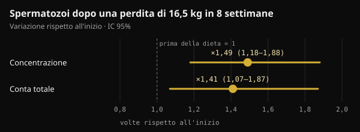

# Peso del padre al concepimento: cosa arriva davvero al figlio

Quando si parla di salute prima del concepimento si pensa quasi sempre alla madre. Uno studio pubblicato su Nature nel 2024 ha spostato l'attenzione anche sul padre. Qui trovi cosa ha dimostrato davvero, cosa è stato aggiunto strada facendo e cosa ha senso fare nei mesi prima di cercare un figlio.

## In breve

- Nei topi, due settimane di dieta molto grassa prima dell'accoppiamento sono bastate a rendere intollerante al glucosio circa il 30% dei figli maschi, senza cambiarne il peso.
- Lo stesso effetto spariva se il padre tornava a una dieta normale per 4 settimane prima di concepire: nel topo il segnale è reversibile.
- Nell'uomo i dati sono associazioni: nelle coorti di Lipsia, con madre normopeso, un padre in sovrappeso si associa a un rischio di obesità del figlio circa doppio.
- Alcuni numeri che circolano sui social (il frammento "aumentato di 3,8 volte" che blocca l'enzima esochinasi 2) non compaiono nello studio originale.
- Nei mesi prima del concepimento contano peso, alimentazione e stile di vita. Un integratore di acido folico e zinco per l'uomo, testato su 2.370 coppie, non ha aumentato le nascite.

## Cosa ha fatto lo studio pubblicato su Nature

Lo studio è di Anika Tomar e colleghi dell'Helmholtz Munich, guidati da Raffaele Teperino, ed è uscito su Nature a giugno 2024. La domanda era precisa: se la dieta del padre cambia qualcosa negli spermatozoi, succede mentre si formano nel testicolo o dopo, quando maturano nell'epididimo?

L'epididimo è il tubulo, attaccato al testicolo, in cui gli spermatozoi finiscono di maturare. I ricercatori hanno dato a topi maschi giovani una dieta con il 60% delle calorie dai grassi per sole 2 settimane. Un gruppo si accoppiava subito con femmine mai esposte; un altro tornava prima alla dieta normale per 4 settimane, così i suoi figli nascevano da spermatozoi che non avevano mai incontrato la dieta grassa.

- **Il peso dei figli non cambiava**, ma circa il 30% dei maschi del primo gruppo diventava intollerante al glucosio (gestiva peggio lo zucchero nel sangue) e meno sensibile all'insulina.
- **I figli del secondo gruppo erano normali**: il segnale veniva dagli spermatozoi esposti alla dieta mentre maturavano, e spariva con un mese di alimentazione normale.
- **Negli spermatozoi aumentavano piccoli RNA dei mitocondri**, gli mt-tRNA e i loro frammenti (mt-tsRNA). Su embrioni di due cellule gli autori hanno visto che gli mt-tRNA paterni passano all'embrione alla fecondazione.

È una via di trasmissione che non passa per il DNA: non una mutazione, ma un segnale legato allo stato metabolico del padre in quel momento.

## E negli esseri umani?

Lo stesso lavoro contiene due tipi di dati umani. Il primo riguarda gli spermatozoi: in 18 giovani volontari finlandesi, gli mt-tsRNA erano l'unico tipo di piccolo RNA che cresceva insieme all'indice di massa corporea (BMI). Gli autori stessi parlano di un campione piccolo.

Il secondo riguarda i figli. In due studi pediatrici di Lipsia (Leipzig Childhood Obesity Cohort e LIFE Child) il BMI del padre si associava a quello del figlio anche tenendo conto della madre. Nelle famiglie con madre normopeso, avere un padre in sovrappeso si associava a un rischio di obesità del figlio circa doppio, e avere un padre obeso a un rischio oltre sei volte maggiore.

*Fonte: Tomar et al., Nature 2024, coorti di Lipsia. Odds ratio riportati nel testo dello studio; padre normopeso = riferimento. Grafico Nurvan.*

Per proporzione, il peso della madre spiegava il 18% delle differenze di BMI tra i bambini, quello del padre un ulteriore 6%. Gli autori hanno corretto per parentela e rischio genetico stimato, ma uno studio osservazionale non può separare del tutto biologia e abitudini di famiglia: una casa in cui si mangia male tende a farlo per tutti.

## Non tutti gli studi vanno nella stessa direzione

Sempre nel 2024 un gruppo di Barcellona ha pubblicato su Heliyon un esperimento simile, con una differenza: i topi maschi diventavano davvero obesi con una dieta di tipo occidentale. Negli spermatozoi dei padri obesi c'erano 450 regioni del DNA con un'accessibilità diversa (cioè più o meno "aperte" alla lettura). Eppure i figli, maschi e femmine, avevano solo lievi alterazioni metaboliche nei primi periodi di vita, poi scomparse. Nessuna predisposizione duratura a obesità o diabete.

Gli autori parlano di resilienza dei figli: un cambiamento negli spermatozoi non equivale automaticamente a un effetto sul figlio.

Due parole da non confondere: un effetto **intergenerazionale** riguarda i figli (F1) concepiti con spermatozoi esposti; uno **transgenerazionale** arriva ai nipoti e oltre (F2, F3) senza nuova esposizione. Lo studio su Nature riguarda solo i figli.

## Il dato che circola e quello che c'è nello studio

Sui social questo studio circola con dettagli molto precisi: un frammento di RNA aumentato di 3,8 volte che entra nell'embrione e blocca l'mRNA dell'esochinasi 2 (un enzima chiave per usare il glucosio), figli intolleranti ottenuti con fecondazione in vitro, frammenti 2,3 volte più alti negli uomini con BMI sopra 30.

Nel testo completo dello studio su PubMed Central questi dati non ci sono. Compaiono, attribuiti a Tomar e colleghi, in una review uscita su Clinical Epigenetics nel 2026. Nello studio originale invece:

- i figli intolleranti nascono da **accoppiamento naturale**; la fecondazione in vitro serviva solo a produrre embrioni di due cellule da analizzare;
- gli autori scrivono che i dati mostrano il passaggio degli mt-tRNA interi, **non** quello dei frammenti, che ritengono probabile ma non provato;
- l'analisi sugli spermatozoi umani tratta il BMI come variabile continua in 18 ragazzi, senza confrontare chi sta sopra e sotto 30.

Il meccanismo raccontato con tanta sicurezza, oggi, è un'ipotesi plausibile.

## Il peso del padre si può cambiare, e lo sperma risponde

Uno spermatozoo umano impiega circa due mesi per formarsi e arrivare all'eiaculato: in uno studio con acqua marcata su 11 uomini, i primi spermatozoi "nuovi" sono comparsi in media dopo 64 giorni (da 42 a 76). Da qui la finestra dei 2–3 mesi prima del concepimento. Nel topo, però, contavano soprattutto le ultime settimane di maturazione.

E il seme migliora quando un uomo con obesità perde peso. In uno studio danese randomizzato, 56 uomini con BMI tra 32 e 43 hanno seguito per 8 settimane una dieta da 800 kcal al giorno sotto controllo medico, perdendo in media 16,5 kg. Concentrazione e conta degli spermatozoi sono aumentate di circa una volta e mezza. Il miglioramento restava a un anno in chi manteneva il peso, non in chi lo riprendeva.

*Fonte: Andersen et al., Hum Reprod 2022 (n = 56). Variazione dopo 8 settimane di dieta ipocalorica rispetto all'inizio, con intervallo di confidenza al 95%. Grafico Nurvan.*

In uomini con obesità grave, inoltre, dopo la chirurgia bariatrica la metilazione del DNA degli spermatozoi cambiava in modo marcato, anche in zone legate al controllo dell'appetito.

Manca però un pezzo: nessuno studio sull'uomo ha ancora dimostrato che il dimagrimento del padre prima del concepimento migliori la salute metabolica del figlio. Sappiamo che il peso paterno si associa alla salute del figlio e che lo sperma risponde al dimagrimento; il collegamento diretto non è stato testato.

## E gli integratori per "preparare" lo sperma?

Studi come questo vengono spesso usati per vendere integratori per la fertilità maschile. Il test più solido disponibile va nella direzione opposta.

Nel trial FAZST (JAMA, 2020), 2.370 coppie in procinto di iniziare un percorso di procreazione assistita sono state divise a caso: gli uomini hanno preso per 6 mesi acido folico (5 mg) e zinco (30 mg) oppure un placebo. Le nascite sono state praticamente identiche, 34% contro 35%, e quasi tutti i parametri del seme non sono cambiati. La frammentazione del DNA degli spermatozoi era anzi un po' più alta con l'integratore (29,7% contro 27,2%).

Il trial non misura la salute metabolica dei figli, ma il messaggio è chiaro: oggi nessun integratore sostituisce peso e stile di vita, e nessuno studio umano giustifica un protocollo "pre-concepimento" per l'uomo basato su questi dati.

## Cosa dice davvero la ricerca

Lo spunto è un post di Marco Guercioni (@the___doc), che presenta lo studio con prudenza e ne elenca i limiti. Ecco le sue affermazioni principali confrontate con le fonti originali.

- **Confermato** — "Studio di Tomar e colleghi su Nature, giugno 2024: sono gli spermatozoi già maturi a rispondere alla dieta, e il 30% dei figli maschi diventa intollerante al glucosio." Vale nel topo.
- **Smentito dallo studio originale** — "Con fecondazione in vitro, senza contributo materno." I figli valutati nascevano da accoppiamento naturale con femmine non esposte. La fecondazione in vitro serviva solo per analizzare embrioni di due cellule.
- **Non verificabile** — "Un frammento aumenta di 3,8 volte e blocca l'mRNA dell'esochinasi 2; negli uomini con BMI sopra 30 è 2,3 volte più alto." Numeri presenti in una review del 2026, non nello studio, i cui autori scrivono che il passaggio dei frammenti all'embrione non è dimostrato.
- **Da precisare** — "In due coorti il BMI paterno pesa sulla salute metabolica del figlio, indipendentemente da quello materno." L'associazione c'è, ma è osservazionale e il padre spiega una quota minore della madre (6% contro 18%).
- **Confermato** — "È intergenerazionale, non transgenerazionale; nel topo c'è una catena causale, nell'uomo un'associazione." E anche il dato su Heliyon (450 regioni, nessuna predisposizione duratura), che riguarda i topi.
- **Non verificabile** — "Metà del fenomeno è l'ambiente condiviso dopo la nascita." L'ambiente di famiglia pesa di sicuro, ma nelle fonti consultate non abbiamo trovato una stima del 50%.
- **Confermato** — "Nessun dato umano giustifica un protocollo di integratori." Il trial FAZST va nella stessa direzione.
- **Da precisare** — "Gli ultimi tre mesi sono la finestra." Gli spermatozoi si formano in circa 2 mesi: 3 mesi sono una finestra prudente.

## Come applicarlo

Se stai pensando di avere un figlio, ecco come trasformare questi dati in passi concreti. Sono buone abitudini generali, non una terapia.

1. **Parti 2–3 mesi prima.** È il tempo in cui si forma la "nuova generazione" di spermatozoi, ma anche le ultime settimane contano.
2. **Guarda peso e girovita.** Se sei in sovrappeso, anche una perdita moderata e sostenibile va nella direzione giusta. Diete molto ipocaloriche, come quella da 800 kcal dello studio danese, solo sotto controllo medico.
3. **Cura la qualità della dieta.** Più alimenti poco processati, verdure, legumi e proteine magre; meno ultra-processati e bevande zuccherate.
4. **Allenati con regolarità**, combinando forza e attività aerobica. Nel trial danese l'esercizio è stato una delle strategie per mantenere il peso perso.
5. **Fumo, alcol e sonno.** Smettere di fumare, ridurre l'alcol e dormire abbastanza fanno parte della stessa preparazione.
6. **Non comprare integratori "per lo sperma" sulla base di questi studi.** Se hai dubbi sulla fertilità o provate da tempo, parlane con il medico o con un andrologo, che può prescrivere uno spermiogramma.

Non è una colpa da attribuire a qualcuno: è una leva in più. Una review del 2025 dello stesso gruppo di Monaco propone infatti una preparazione al concepimento che coinvolga entrambi i genitori, non solo la madre.

<h3>Prepara i prossimi tre mesi con dei numeri</h3>

In Nurvan registri peso e misure, segui l'alimentazione nel diario e annoti ogni allenamento, così vedi se il percorso sta andando nella direzione giusta settimana dopo settimana. Se lavori con un coach, vede gli stessi dati e può assegnarti piano alimentare e scheda.

<a href="https://nurvan.app">Prova Nurvan</a>

## Domande frequenti

### Ero in sovrappeso quando abbiamo concepito: mio figlio sarà obeso?

No, non è un destino. I dati descrivono un rischio medio su molte famiglie, non un esito individuale. Contano molti fattori, a partire da come si mangia e ci si muove in casa, che si possono cambiare in qualsiasi momento.

### Quanto tempo prima del concepimento conta il peso del padre?

Gli spermatozoi umani si formano in circa due mesi, quindi i 2–3 mesi prima sono la finestra più citata. Nel topo bastavano 2 settimane di dieta per l'effetto e 4 settimane di dieta normale per annullarlo. Nell'uomo i tempi esatti non sono stati misurati.

### Esistono integratori che "ripuliscono" lo sperma prima del concepimento?

Non ci sono prove sull'uomo. Nel trial più grande, acido folico e zinco per 6 mesi non hanno aumentato le nascite né migliorato la qualità del seme. Se hai una carenza o un problema di fertilità, la valutazione spetta al medico.

### Vale anche per la madre?

Sì, e di più: nei dati di Lipsia il peso della madre spiegava una quota maggiore delle differenze tra i figli. La novità non è che il padre conti più della madre, ma che conti anche lui.

## Fonti

1. Tomar A, Gomez-Velazquez M, Gerlini R et al., 2024. Epigenetic inheritance of diet-induced and sperm-borne mitochondrial RNAs. *Nature* 630(8017):720–727. [PMID 38839949](https://pubmed.ncbi.nlm.nih.gov/38839949/) · [DOI 10.1038/s41586-024-07472-3](https://doi.org/10.1038/s41586-024-07472-3)
2. Tahiri I, Llana SR, Fos-Domènech J et al., 2024. Paternal obesity induces changes in sperm chromatin accessibility and has a mild effect on offspring metabolic health. *Heliyon* 10(14):e34043. [PMID 39100496](https://pubmed.ncbi.nlm.nih.gov/39100496/) · [DOI 10.1016/j.heliyon.2024.e34043](https://doi.org/10.1016/j.heliyon.2024.e34043)
3. Song S, Zhang B, Xiong F et al., 2026. Sperm tRNA-derived fragments: molecular mechanisms and clinical implications for paternal epigenetic inheritance. *Clin Epigenetics* 18(1). [PMID 42135772](https://pubmed.ncbi.nlm.nih.gov/42135772/) · [DOI 10.1186/s13148-026-02155-4](https://doi.org/10.1186/s13148-026-02155-4)
4. Andersen E, Juhl CR, Kjøller ET et al., 2022. Sperm count is increased by diet-induced weight loss and maintained by exercise or GLP-1 analogue treatment: a randomized controlled trial. *Hum Reprod* 37(7):1414–1422. [PMID 35580859](https://pubmed.ncbi.nlm.nih.gov/35580859/) · [DOI 10.1093/humrep/deac096](https://doi.org/10.1093/humrep/deac096)
5. Donkin I, Versteyhe S, Ingerslev LR et al., 2016. Obesity and bariatric surgery drive epigenetic variation of spermatozoa in humans. *Cell Metab* 23(2):369–378. [PMID 26669700](https://pubmed.ncbi.nlm.nih.gov/26669700/) · [DOI 10.1016/j.cmet.2015.11.004](https://doi.org/10.1016/j.cmet.2015.11.004)
6. Misell LM, Holochwost D, Boban D et al., 2006. A stable isotope-mass spectrometric method for measuring human spermatogenesis kinetics in vivo. *J Urol* 175(1):242–246. [PMID 16406920](https://pubmed.ncbi.nlm.nih.gov/16406920/) · [DOI 10.1016/S0022-5347(05)00053-4](https://doi.org/10.1016/S0022-5347(05)00053-4)
7. Schisterman EF, Sjaarda LA, Clemons T et al., 2020. Effect of folic acid and zinc supplementation in men on semen quality and live birth among couples undergoing infertility treatment: a randomized clinical trial. *JAMA* 323(1):35–48. [PMID 31910279](https://pubmed.ncbi.nlm.nih.gov/31910279/) · [DOI 10.1001/jama.2019.18714](https://doi.org/10.1001/jama.2019.18714)
8. Skerrett-Byrne DA, Pepin AS, Laurent K et al., 2025. Dad's diet shapes the future: how paternal nutrition impacts placental development and childhood metabolic health. *Mol Nutr Food Res* 69(22):e70261. [PMID 40913545](https://pubmed.ncbi.nlm.nih.gov/40913545/) · [DOI 10.1002/mnfr.70261](https://doi.org/10.1002/mnfr.70261)

Articolo ispirato a un post di [Marco Guercioni (@the___doc)](https://www.instagram.com/p/DdokwJDiH92/). Fonti consultate tramite PubMed.

> Nota: contenuto informativo, non sostituisce il parere di un medico o di un professionista qualificato.
