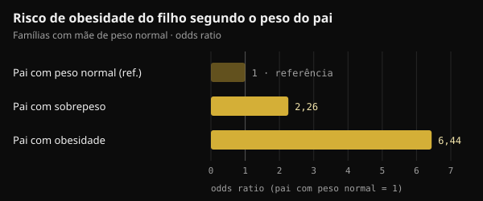
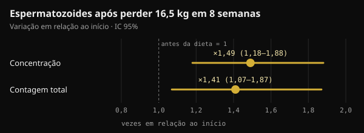

# Peso do pai na concepção: o que realmente chega ao filho

Quando se fala de saúde antes da gravidez, quase sempre se pensa na mãe. Um estudo publicado na Nature em 2024 colocou o pai também no centro da conversa. Aqui você encontra o que ele realmente demonstrou, o que foi acrescentado pelo caminho e o que faz sentido fazer nos meses antes de tentar ter um filho.

## Resumindo

- Em camundongos, duas semanas de dieta muito gordurosa antes do acasalamento bastaram para deixar cerca de 30% dos filhotes machos intolerantes à glicose, sem mudar o peso deles.
- O efeito desaparecia se o pai voltasse a uma dieta normal por 4 semanas antes de conceber: no camundongo, o sinal é reversível.
- Em humanos, os dados são associações: em duas coortes de Leipzig, com mãe de peso normal, um pai com sobrepeso estava ligado a um risco de obesidade do filho cerca de duas vezes maior.
- Alguns números que circulam nas redes (um fragmento "aumentado 3,8 vezes" que bloqueia a enzima hexoquinase 2) não aparecem no estudo original.
- Nos meses antes da concepção contam peso, alimentação e estilo de vida. Um suplemento de ácido fólico e zinco para o homem, testado em 2.370 casais, não aumentou os nascimentos.

## O que o estudo da Nature realmente fez

O estudo é de Anika Tomar e colegas do Helmholtz Munich, liderados por Raffaele Teperino, e saiu na Nature em junho de 2024. A pergunta era precisa: se a dieta do pai muda algo nos espermatozoides, isso acontece enquanto eles se formam no testículo ou depois, enquanto amadurecem no epidídimo?

O epidídimo é o tubo, colado ao testículo, onde os espermatozoides terminam de amadurecer. Os pesquisadores deram a camundongos machos jovens uma dieta com 60% das calorias vindas de gordura por apenas 2 semanas. Um grupo acasalava logo em seguida com fêmeas nunca expostas. Outro voltava antes à dieta normal por 4 semanas, de modo que seus filhotes nasciam de espermatozoides que nunca tinham encontrado a dieta gordurosa.

- **O peso dos filhotes não mudava**, mas cerca de 30% dos machos do primeiro grupo ficavam intolerantes à glicose (lidavam pior com o açúcar no sangue) e menos sensíveis à insulina.
- **Os filhotes do segundo grupo eram normais**: o sinal vinha dos espermatozoides expostos à dieta durante a maturação e sumia com um mês de alimentação normal.
- **Nos espermatozoides aumentavam pequenos RNAs mitocondriais**, os RNAs transportadores mitocondriais (mt-tRNA) e seus fragmentos (mt-tsRNA). Em embriões de duas células, os autores mostraram que os mt-tRNA paternos passam para o embrião na fecundação.

É uma via de transmissão que não passa pelo DNA: não é uma mutação, e sim um sinal ligado ao estado metabólico do pai naquele momento.

## E em humanos?

O mesmo trabalho traz dois tipos de dados humanos. O primeiro é sobre espermatozoides: em 18 jovens voluntários finlandeses, os mt-tsRNA eram o único tipo de RNA pequeno que aumentava junto com o índice de massa corporal (IMC). Os próprios autores falam em amostra pequena.

O segundo é sobre os filhos. Em dois estudos pediátricos de Leipzig (Leipzig Childhood Obesity Cohort e LIFE Child), o IMC do pai estava associado ao do filho mesmo levando em conta o da mãe. Nas famílias com mãe de peso normal, ter um pai com sobrepeso estava ligado a um risco de obesidade do filho cerca de duas vezes maior, e um pai com obesidade a um risco mais de seis vezes maior.

*Fonte: Tomar et al., Nature 2024, coortes de Leipzig. Odds ratios relatados no texto do estudo; pai com peso normal = referência. Gráfico Nurvan.*

Para ter uma ideia, o peso da mãe explicava 18% das diferenças de IMC entre as crianças, e o do pai mais 6%. Os autores corrigiram para parentesco e risco genético estimado, mas um estudo observacional não consegue separar totalmente biologia e hábitos da família: uma casa onde se come mal costuma fazer isso junta.

## Nem todos os estudos vão na mesma direção

Também em 2024, um grupo de Barcelona publicou na Heliyon um experimento parecido, com uma diferença: os camundongos machos ficavam realmente obesos com uma dieta de estilo ocidental. Nos espermatozoides dos pais obesos havia 450 regiões do DNA com acessibilidade diferente (mais ou menos "abertas" à leitura). Mesmo assim, os filhotes, machos e fêmeas, tiveram só alterações metabólicas leves no início da vida, que depois sumiram. Nenhuma predisposição duradoura à obesidade ou ao diabetes.

Os autores falam em resiliência dos filhotes: uma mudança medida nos espermatozoides não significa automaticamente um efeito no filho.

Duas palavras que não convém confundir: um efeito **intergeracional** atinge os filhos (F1) concebidos com espermatozoides expostos; um **transgeracional** chega aos netos e além (F2, F3) sem nova exposição. O estudo da Nature trata apenas dos filhos.

## O que circula e o que está no estudo

Nas redes, esse estudo costuma ser contado com detalhes muito precisos: um fragmento de RNA aumentado 3,8 vezes que entra no embrião e bloqueia o mRNA da hexoquinase 2 (uma enzima-chave para usar a glicose), filhotes intolerantes obtidos por fertilização in vitro e fragmentos 2,3 vezes mais altos em homens com IMC acima de 30.

Esses números não estão no texto completo do estudo no PubMed Central. Aparecem, atribuídos a Tomar e colegas, em uma revisão publicada na Clinical Epigenetics em 2026. Já no estudo original:

- os filhotes intolerantes à glicose nasceram de **acasalamento natural**; a fertilização in vitro serviu apenas para produzir embriões de duas células para análise;
- os autores escrevem que os dados mostram a passagem dos mt-tRNA inteiros, **não** a dos fragmentos, que consideram provável mas não comprovada;
- a análise dos espermatozoides humanos trata o IMC como variável contínua em 18 rapazes, sem comparar quem está acima e abaixo de 30.

O mecanismo contado com tanta segurança é, por enquanto, uma hipótese plausível.

## O peso do pai pode mudar, e o esperma responde

Um espermatozoide humano leva cerca de dois meses para se formar e chegar ao ejaculado: em um estudo com água marcada em 11 homens, os primeiros espermatozoides "novos" apareceram em média após 64 dias (de 42 a 76). Daí a janela de 2 a 3 meses antes da concepção, tão citada. No camundongo, porém, o que mais contava eram as últimas semanas de maturação.

E o sêmen melhora quando um homem com obesidade perde peso. Em um ensaio randomizado dinamarquês, 56 homens com IMC entre 32 e 43 seguiram por 8 semanas uma dieta de 800 kcal por dia sob supervisão médica e perderam em média 16,5 kg. A concentração e a contagem de espermatozoides aumentaram cerca de uma vez e meia. A melhora se mantinha após um ano em quem manteve o peso, não em quem o recuperou.

*Fonte: Andersen et al., Hum Reprod 2022 (n = 56). Variação após 8 semanas de dieta hipocalórica em relação ao início, com intervalo de confiança de 95%. Gráfico Nurvan.*

Em homens com obesidade grave, além disso, a metilação do DNA dos espermatozoides mudava bastante após a cirurgia bariátrica, inclusive em regiões ligadas ao controle do apetite.

Falta, porém, uma peça: nenhum estudo em humanos demonstrou ainda que o emagrecimento do pai antes da concepção melhore a saúde metabólica do filho. Sabemos que o peso paterno está associado à saúde do filho e que o esperma responde à perda de peso; a ligação direta não foi testada.

## E os suplementos para "preparar" o esperma?

Estudos como este costumam ser usados para vender suplementos de fertilidade masculina. O teste mais sólido disponível aponta na direção oposta.

No ensaio FAZST (JAMA, 2020), 2.370 casais prestes a iniciar um tratamento de reprodução assistida foram sorteados: os homens tomaram por 6 meses ácido fólico (5 mg) e zinco (30 mg) ou placebo. Os nascimentos foram praticamente iguais, 34% contra 35%, e quase todos os parâmetros do sêmen não mudaram. A fragmentação do DNA dos espermatozoides foi até um pouco maior com o suplemento (29,7% contra 27,2%).

O ensaio não mediu a saúde metabólica dos filhos, mas a mensagem é clara: hoje nenhum suplemento substitui peso e estilo de vida, e nenhum estudo em humanos justifica um protocolo "pré-concepção" para o homem com base nesses dados.

## O que a pesquisa realmente diz

Este artigo partiu de uma publicação de Marco Guercioni (@the___doc), que apresenta o estudo com cautela e lista seus limites. Estas são as principais afirmações comparadas com as fontes originais.

- **Confirmado** — "Tomar e colegas, Nature, junho de 2024: são os espermatozoides já maduros que respondem à dieta, e 30% dos filhotes machos ficam intolerantes à glicose." Vale para camundongos.
- **Desmentido pelo estudo original** — "Com fertilização in vitro, sem contribuição materna." Os filhotes avaliados nasceram de acasalamento natural com fêmeas não expostas. A fertilização in vitro serviu só para analisar embriões de duas células.
- **Não verificável** — "Um fragmento aumenta 3,8 vezes e bloqueia o mRNA da hexoquinase 2; em homens com IMC acima de 30 é 2,3 vezes mais alto." Esses números aparecem em uma revisão de 2026, não no estudo, cujos autores escrevem que a passagem dos fragmentos ao embrião não foi demonstrada.
- **A esclarecer** — "Em duas coortes, o IMC do pai pesa na saúde metabólica do filho, independentemente do da mãe." A associação existe, mas é observacional, e o pai explica uma parcela menor que a mãe (6% contra 18%).
- **Confirmado** — "É intergeracional, não transgeracional; no camundongo há uma cadeia causal, em humanos uma associação." Também o dado da Heliyon (450 regiões, sem predisposição duradoura), que vem de camundongos.
- **Não verificável** — "Metade do fenômeno é o ambiente compartilhado depois do nascimento." O ambiente familiar pesa, sem dúvida, mas não encontramos uma estimativa de 50% nas fontes consultadas.
- **Confirmado** — "Nenhum dado humano justifica um protocolo de suplementos." O ensaio FAZST vai na mesma direção.
- **A esclarecer** — "Os últimos três meses são a janela." Os espermatozoides se formam em cerca de 2 meses: 3 meses são uma janela prudente.

## Como aplicar

Se você está pensando em ter um filho, veja como transformar esses dados em passos concretos. São bons hábitos gerais, não um tratamento.

1. **Comece 2 a 3 meses antes.** É o tempo para formar uma "nova geração" de espermatozoides, mas as últimas semanas também contam.
2. **Observe peso e circunferência da cintura.** Se você está acima do peso, até uma perda moderada e sustentável vai na direção certa. Dietas muito hipocalóricas, como a de 800 kcal do estudo dinamarquês, só com acompanhamento médico.
3. **Cuide da qualidade da alimentação.** Mais alimentos pouco processados, verduras, leguminosas e proteínas magras; menos ultraprocessados e bebidas açucaradas.
4. **Treine com regularidade**, combinando força e exercício aeróbico. No ensaio dinamarquês, o exercício foi uma das estratégias para manter o peso perdido.
5. **Cigarro, álcool e sono.** Parar de fumar, reduzir o álcool e dormir o suficiente fazem parte da mesma preparação.
6. **Não compre suplementos "para o esperma" com base nesses estudos.** Se você tem dúvidas sobre fertilidade ou vocês tentam há algum tempo, converse com seu médico ou com um andrologista, que pode pedir um espermograma.

Não é uma questão de culpa: é uma alavanca a mais. Uma revisão de 2025 do mesmo grupo de Munique defende uma preparação para a concepção que envolva os dois pais, não só a mãe.

<h3>Planeje os próximos três meses com números</h3>

No Nurvan você registra peso e medidas, acompanha a alimentação no diário e anota cada treino, para ver semana a semana se está indo na direção certa. Se você trabalha com um coach, ele vê os mesmos dados e pode atribuir seu plano alimentar e seu programa de treino.

<a href="https://nurvan.app">Experimente o Nurvan</a>

## Perguntas frequentes

### Eu estava com sobrepeso quando concebemos: meu filho vai ser obeso?

Não, não é destino. Os dados descrevem um risco médio em muitas famílias, não um resultado individual. Muitos fatores contam, a começar por como a família come e se movimenta em casa, e isso pode mudar a qualquer momento.

### Com quanto tempo de antecedência o peso do pai conta?

Os espermatozoides humanos se formam em cerca de dois meses, por isso os 2 a 3 meses anteriores são a janela mais citada. Em camundongos, 2 semanas de dieta bastaram para causar o efeito e 4 semanas de alimentação normal para desfazê-lo. Em humanos, o prazo exato não foi medido.

### Existem suplementos que "limpam" o esperma antes da concepção?

Não há provas em humanos. No maior ensaio, ácido fólico e zinco por 6 meses não aumentaram os nascimentos nem melhoraram a qualidade do sêmen. Se você tem uma deficiência ou um problema de fertilidade, a avaliação cabe ao médico.

### Isso vale também para a mãe?

Sim, e ainda mais: nos dados de Leipzig, o peso da mãe explicava uma parte maior das diferenças entre as crianças. A novidade não é que o pai conte mais que a mãe, e sim que ele também conta.

## Fontes

1. Tomar A, Gomez-Velazquez M, Gerlini R et al., 2024. Epigenetic inheritance of diet-induced and sperm-borne mitochondrial RNAs. *Nature* 630(8017):720–727. [PMID 38839949](https://pubmed.ncbi.nlm.nih.gov/38839949/) · [DOI 10.1038/s41586-024-07472-3](https://doi.org/10.1038/s41586-024-07472-3)
2. Tahiri I, Llana SR, Fos-Domènech J et al., 2024. Paternal obesity induces changes in sperm chromatin accessibility and has a mild effect on offspring metabolic health. *Heliyon* 10(14):e34043. [PMID 39100496](https://pubmed.ncbi.nlm.nih.gov/39100496/) · [DOI 10.1016/j.heliyon.2024.e34043](https://doi.org/10.1016/j.heliyon.2024.e34043)
3. Song S, Zhang B, Xiong F et al., 2026. Sperm tRNA-derived fragments: molecular mechanisms and clinical implications for paternal epigenetic inheritance. *Clin Epigenetics* 18(1). [PMID 42135772](https://pubmed.ncbi.nlm.nih.gov/42135772/) · [DOI 10.1186/s13148-026-02155-4](https://doi.org/10.1186/s13148-026-02155-4)
4. Andersen E, Juhl CR, Kjøller ET et al., 2022. Sperm count is increased by diet-induced weight loss and maintained by exercise or GLP-1 analogue treatment: a randomized controlled trial. *Hum Reprod* 37(7):1414–1422. [PMID 35580859](https://pubmed.ncbi.nlm.nih.gov/35580859/) · [DOI 10.1093/humrep/deac096](https://doi.org/10.1093/humrep/deac096)
5. Donkin I, Versteyhe S, Ingerslev LR et al., 2016. Obesity and bariatric surgery drive epigenetic variation of spermatozoa in humans. *Cell Metab* 23(2):369–378. [PMID 26669700](https://pubmed.ncbi.nlm.nih.gov/26669700/) · [DOI 10.1016/j.cmet.2015.11.004](https://doi.org/10.1016/j.cmet.2015.11.004)
6. Misell LM, Holochwost D, Boban D et al., 2006. A stable isotope-mass spectrometric method for measuring human spermatogenesis kinetics in vivo. *J Urol* 175(1):242–246. [PMID 16406920](https://pubmed.ncbi.nlm.nih.gov/16406920/) · [DOI 10.1016/S0022-5347(05)00053-4](https://doi.org/10.1016/S0022-5347(05)00053-4)
7. Schisterman EF, Sjaarda LA, Clemons T et al., 2020. Effect of folic acid and zinc supplementation in men on semen quality and live birth among couples undergoing infertility treatment: a randomized clinical trial. *JAMA* 323(1):35–48. [PMID 31910279](https://pubmed.ncbi.nlm.nih.gov/31910279/) · [DOI 10.1001/jama.2019.18714](https://doi.org/10.1001/jama.2019.18714)
8. Skerrett-Byrne DA, Pepin AS, Laurent K et al., 2025. Dad's diet shapes the future: how paternal nutrition impacts placental development and childhood metabolic health. *Mol Nutr Food Res* 69(22):e70261. [PMID 40913545](https://pubmed.ncbi.nlm.nih.gov/40913545/) · [DOI 10.1002/mnfr.70261](https://doi.org/10.1002/mnfr.70261)

Artigo inspirado em uma publicação de [Marco Guercioni (@the___doc)](https://www.instagram.com/p/DdokwJDiH92/). Fontes consultadas via PubMed.

> Nota: conteúdo informativo, não substitui a orientação de um médico ou de um profissional qualificado.
