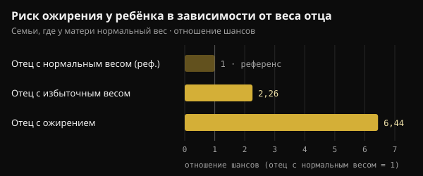
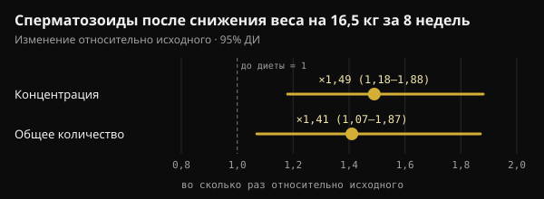

# Вес отца при зачатии: что на самом деле передаётся ребёнку

Когда говорят о здоровье перед беременностью, почти всегда имеют в виду мать. Исследование, опубликованное в Nature в 2024 году, обратило внимание и на отца. Здесь разберём, что оно действительно показало, что к нему добавили по дороге и что имеет смысл делать в месяцы перед планированием ребёнка.

## Коротко

- У мышей двух недель очень жирной диеты перед спариванием хватило, чтобы около 30% потомков-самцов стали хуже переносить глюкозу, при этом их вес не изменился.
- Эффект исчезал, если отец за 4 недели до зачатия возвращался к обычному корму: у мышей этот сигнал обратим.
- У людей данные показывают связь, а не причину: в двух когортах из Лейпцига при матери с нормальным весом избыточный вес отца был связан примерно с двукратным риском ожирения у ребёнка.
- Некоторые цифры из соцсетей (фрагмент, «выросший в 3,8 раза» и блокирующий фермент гексокиназу 2) в оригинальном исследовании не встречаются.
- В месяцы перед зачатием важны вес, питание и образ жизни. Добавка фолиевой кислоты и цинка для мужчин, проверенная на 2370 парах, не увеличила число рождений.

## Что на самом деле сделало исследование в Nature

Работа Аники Томар и коллег из Helmholtz Munich под руководством Раффаэле Теперино вышла в Nature в июне 2024 года. Вопрос был точным: если питание отца что-то меняет в сперматозоидах, происходит ли это во время их образования в яичке или позже, когда они созревают в придатке яичка?

Придаток яичка (эпидидимис) — это проток, прилегающий к яичку, где сперматозоиды завершают созревание. Исследователи давали молодым самцам мышей корм, в котором 60% калорий приходилось на жиры, всего 2 недели. Одна группа сразу спаривалась с самками, которые эту диету не получали. Другая сначала 4 недели питалась обычным кормом, так что её потомство появлялось из сперматозоидов, никогда не «видевших» жирную диету.

- **Вес потомства не менялся**, но около 30% самцов первой группы становились непереносимыми к глюкозе (хуже справлялись с сахаром в крови) и менее чувствительными к инсулину.
- **Потомство второй группы было в норме**: сигнал шёл от сперматозоидов, которые подверглись действию диеты во время созревания, и исчезал после месяца обычного питания.
- **В сперматозоидах становилось больше малых митохондриальных РНК** — митохондриальных транспортных РНК (мт-тРНК) и их фрагментов (мт-тсРНК). На двухклеточных эмбрионах авторы показали, что отцовские мт-тРНК попадают в эмбрион при оплодотворении.

Это путь передачи, который не проходит через ДНК: не мутация, а сигнал, связанный с обменом веществ отца в конкретный момент.

## А у людей?

В той же работе есть два типа данных о людях. Первый касается сперматозоидов: у 18 молодых добровольцев из Финляндии мт-тсРНК были единственным типом малых РНК, который рос вместе с индексом массы тела (ИМТ). Сами авторы называют выборку маленькой.

Второй касается детей. В двух педиатрических исследованиях из Лейпцига (Leipzig Childhood Obesity Cohort и LIFE Child) ИМТ отца был связан с ИМТ ребёнка даже с учётом ИМТ матери. В семьях, где у матери нормальный вес, избыточный вес отца был связан примерно с двукратным шансом ожирения у ребёнка, а ожирение отца — более чем с шестикратным.

*Источник: Tomar et al., Nature 2024, лейпцигские когорты. Отношения шансов из основного текста; отец с нормальным весом — референс. График Nurvan.*

Для масштаба: вес матери объяснял 18% различий в ИМТ детей, вес отца — ещё 6%. Авторы учли родство и оценку генетического риска, но наблюдательное исследование не может полностью отделить биологию от семейных привычек: если в доме едят плохо, обычно так едят все.

## Не все исследования указывают в одну сторону

В том же 2024 году группа из Барселоны опубликовала в Heliyon похожий эксперимент с одним отличием: самцы мышей на западном типе питания действительно становились тучными. В сперматозоидах тучных отцов нашли 450 участков ДНК с изменённой доступностью (более или менее «открытых» для считывания). И всё же у потомства, самцов и самок, были лишь лёгкие нарушения обмена веществ в раннем возрасте, которые потом прошли. Никакой стойкой предрасположенности к ожирению или диабету.

Авторы говорят об устойчивости потомства: изменение, найденное в сперматозоидах, не означает автоматически последствия для ребёнка.

Два слова, которые не стоит путать: **межпоколенческий** эффект касается детей (F1), зачатых от сперматозоидов, подвергшихся воздействию; **трансгенерационный** доходит до внуков и дальше (F2, F3) без нового воздействия. Исследование в Nature касается только детей.

## Что пишут в соцсетях и что есть в исследовании

В соцсетях это исследование часто пересказывают с очень точными деталями: фрагмент РНК, выросший в 3,8 раза, попадает в эмбрион и блокирует мРНК гексокиназы 2 (ключевого фермента для использования глюкозы); потомство с нарушенной толерантностью к глюкозе получено с помощью ЭКО; у мужчин с ИМТ выше 30 таких фрагментов в 2,3 раза больше.

В полном тексте исследования на PubMed Central этих цифр нет. Они встречаются, с приписыванием Томар и коллегам, в обзоре, опубликованном в Clinical Epigenetics в 2026 году. А в оригинальной работе:

- потомство с нарушенной толерантностью к глюкозе родилось при **естественном спаривании**; ЭКО использовали только для получения двухклеточных эмбрионов для анализа;
- авторы пишут, что их данные показывают передачу целых мт-тРНК, но **не** фрагментов — это они считают вероятным, но не доказанным;
- анализ сперматозоидов людей рассматривает ИМТ как непрерывную величину у 18 молодых мужчин, без сравнения тех, у кого он выше и ниже 30.

Так что механизм, о котором рассказывают так уверенно, пока остаётся правдоподобной гипотезой.

## Вес отца можно изменить, и сперматозоиды на это отвечают

Сперматозоиду человека нужно около двух месяцев, чтобы образоваться и попасть в эякулят: в исследовании с мечёной водой у 11 мужчин первые «новые» сперматозоиды появлялись в среднем через 64 дня (от 42 до 76). Отсюда часто упоминаемое окно в 2–3 месяца до зачатия. У мышей, впрочем, важнее всего были последние недели созревания.

И качество спермы улучшается, когда мужчина с ожирением худеет. В датском рандомизированном исследовании 56 мужчин с ИМТ от 32 до 43 восемь недель соблюдали диету 800 ккал в день под медицинским контролем и сбросили в среднем 16,5 кг. Концентрация и количество сперматозоидов выросли примерно в полтора раза. Через год эффект сохранялся у тех, кто удержал вес, и не сохранялся у тех, кто набрал его снова.

*Источник: Andersen et al., Hum Reprod 2022 (n = 56). Изменение после 8 недель низкокалорийной диеты относительно исходного уровня, с 95% доверительным интервалом. График Nurvan.*

У мужчин с тяжёлым ожирением после бариатрической операции также заметно менялось метилирование ДНК сперматозоидов, в том числе в участках, связанных с регуляцией аппетита.

Но одного звена всё ещё нет: ни одно исследование на людях пока не показало, что похудение отца перед зачатием улучшает обмен веществ у ребёнка. Мы знаем, что вес отца связан со здоровьем ребёнка и что сперма реагирует на снижение веса; прямую связь пока не проверяли.

## А добавки, чтобы «подготовить» сперму?

Такие исследования часто используют, чтобы продавать добавки для мужской фертильности. Самая надёжная проверка говорит об обратном.

В исследовании FAZST (JAMA, 2020) 2370 пар перед началом лечения бесплодия случайным образом разделили на группы: мужчины 6 месяцев принимали фолиевую кислоту (5 мг) и цинк (30 мг) или плацебо. Доля рождений оказалась практически одинаковой, 34% против 35%, и почти все показатели спермы не изменились. Фрагментация ДНК сперматозоидов с добавкой была даже немного выше (29,7% против 27,2%).

Обмен веществ у детей в этом исследовании не измеряли, но вывод ясен: сегодня никакая добавка не заменяет вес и образ жизни, и ни одно исследование на людях не оправдывает «предзачаточный» протокол добавок для мужчин на основе этих данных.

## Что на самом деле говорят исследования

Поводом для статьи стал пост Марко Гверчони (@the___doc), который подаёт исследование осторожно и перечисляет его ограничения. Вот его основные утверждения в сравнении с первоисточниками.

- **Подтверждено** — «Томар и коллеги, Nature, июнь 2024: на диету реагируют уже зрелые сперматозоиды, и 30% потомков-самцов становятся непереносимыми к глюкозе». Справедливо для мышей.
- **Опровергнуто оригинальным исследованием** — «С помощью ЭКО, без вклада матери». Изученное потомство родилось при естественном спаривании с самками, не получавшими диету. ЭКО использовали только для анализа двухклеточных эмбрионов.
- **Не поддаётся проверке** — «Один фрагмент вырастает в 3,8 раза и блокирует мРНК гексокиназы 2; у мужчин с ИМТ выше 30 его в 2,3 раза больше». Эти цифры есть в обзоре 2026 года, но не в исследовании, авторы которого пишут, что передача фрагментов эмбриону не доказана.
- **Требует уточнения** — «В двух когортах ИМТ отца влияет на обмен веществ ребёнка независимо от ИМТ матери». Связь есть, но она наблюдательная, и отец объясняет меньшую долю, чем мать (6% против 18%).
- **Подтверждено** — «Это межпоколенческий, а не трансгенерационный эффект; у мышей есть причинная цепочка, у людей — связь». Как и данные Heliyon (450 участков, без стойкой предрасположенности), полученные на мышах.
- **Не поддаётся проверке** — «Половина эффекта — это общая среда после рождения». Семейная среда, безусловно, важна, но оценки в 50% в изученных источниках мы не нашли.
- **Подтверждено** — «Нет данных на людях, которые оправдывали бы протокол добавок». Исследование FAZST указывает в ту же сторону.
- **Требует уточнения** — «Последние три месяца — это окно». Сперматозоиды образуются примерно за 2 месяца: 3 месяца — осторожная оценка окна.

## Как это применить

Если вы планируете ребёнка, вот как превратить эти данные в конкретные шаги. Это хорошие общие привычки, а не лечение.

1. **Начни за 2–3 месяца.** Столько времени нужно «новому поколению» сперматозоидов, но и последние недели тоже важны.
2. **Следи за весом и талией.** Если у тебя лишний вес, даже умеренное и устойчивое снижение идёт в правильном направлении. Очень низкокалорийные диеты, как 800 ккал в датском исследовании, — только под контролем врача.
3. **Улучши качество питания.** Больше минимально обработанных продуктов, овощей, бобовых и нежирного белка; меньше ультрапереработанной еды и сладких напитков.
4. **Тренируйся регулярно**, сочетая силовые и аэробные нагрузки. В датском исследовании упражнения были одной из стратегий удержания сброшенного веса.
5. **Курение, алкоголь и сон.** Отказ от курения, меньше алкоголя и достаточный сон — часть той же подготовки.
6. **Не покупай добавки «для спермы» на основании этих исследований.** Если есть вопросы о фертильности или беременность долго не наступает, обратись к врачу или андрологу — он может назначить спермограмму.

Речь не о вине, а о ещё одном рычаге. Обзор той же мюнхенской группы 2025 года предлагает подготовку к зачатию, в которой участвуют оба родителя, а не только мать.

<h3>Спланируй ближайшие три месяца с цифрами</h3>

В Nurvan ты записываешь вес и замеры тела, ведёшь дневник питания и отмечаешь каждую тренировку, чтобы неделя за неделей видеть, движешься ли ты в нужную сторону. Если ты работаешь с тренером, он видит те же данные и может назначить тебе план питания и программу тренировок.

<a href="https://nurvan.app">Попробовать Nurvan</a>

## Частые вопросы

### У меня был лишний вес, когда мы зачали ребёнка. Он будет страдать ожирением?

Нет, это не приговор. Данные описывают средний риск по многим семьям, а не судьбу конкретного ребёнка. Важно многое, начиная с того, как семья ест и двигается дома, а это можно изменить в любой момент.

### За сколько до зачатия важен вес отца?

Сперматозоиды человека образуются примерно за два месяца, поэтому чаще всего упоминают окно в 2–3 месяца. У мышей 2 недель диеты хватало, чтобы вызвать эффект, а 4 недель обычного питания — чтобы его отменить. Точные сроки для людей не измерены.

### Есть ли добавки, которые «очищают» сперму перед зачатием?

Доказательств на людях нет. В крупнейшем исследовании фолиевая кислота и цинк в течение 6 месяцев не увеличили число рождений и не улучшили качество спермы. Если есть дефицит или проблема с фертильностью, оценивать это должен врач.

### Это относится и к матери?

Да, и даже в большей степени: в лейпцигских данных вес матери объяснял большую часть различий между детьми. Новость не в том, что отец важнее матери, а в том, что он тоже важен.

## Источники

1. Tomar A, Gomez-Velazquez M, Gerlini R et al., 2024. Epigenetic inheritance of diet-induced and sperm-borne mitochondrial RNAs. *Nature* 630(8017):720–727. [PMID 38839949](https://pubmed.ncbi.nlm.nih.gov/38839949/) · [DOI 10.1038/s41586-024-07472-3](https://doi.org/10.1038/s41586-024-07472-3)
2. Tahiri I, Llana SR, Fos-Domènech J et al., 2024. Paternal obesity induces changes in sperm chromatin accessibility and has a mild effect on offspring metabolic health. *Heliyon* 10(14):e34043. [PMID 39100496](https://pubmed.ncbi.nlm.nih.gov/39100496/) · [DOI 10.1016/j.heliyon.2024.e34043](https://doi.org/10.1016/j.heliyon.2024.e34043)
3. Song S, Zhang B, Xiong F et al., 2026. Sperm tRNA-derived fragments: molecular mechanisms and clinical implications for paternal epigenetic inheritance. *Clin Epigenetics* 18(1). [PMID 42135772](https://pubmed.ncbi.nlm.nih.gov/42135772/) · [DOI 10.1186/s13148-026-02155-4](https://doi.org/10.1186/s13148-026-02155-4)
4. Andersen E, Juhl CR, Kjøller ET et al., 2022. Sperm count is increased by diet-induced weight loss and maintained by exercise or GLP-1 analogue treatment: a randomized controlled trial. *Hum Reprod* 37(7):1414–1422. [PMID 35580859](https://pubmed.ncbi.nlm.nih.gov/35580859/) · [DOI 10.1093/humrep/deac096](https://doi.org/10.1093/humrep/deac096)
5. Donkin I, Versteyhe S, Ingerslev LR et al., 2016. Obesity and bariatric surgery drive epigenetic variation of spermatozoa in humans. *Cell Metab* 23(2):369–378. [PMID 26669700](https://pubmed.ncbi.nlm.nih.gov/26669700/) · [DOI 10.1016/j.cmet.2015.11.004](https://doi.org/10.1016/j.cmet.2015.11.004)
6. Misell LM, Holochwost D, Boban D et al., 2006. A stable isotope-mass spectrometric method for measuring human spermatogenesis kinetics in vivo. *J Urol* 175(1):242–246. [PMID 16406920](https://pubmed.ncbi.nlm.nih.gov/16406920/) · [DOI 10.1016/S0022-5347(05)00053-4](https://doi.org/10.1016/S0022-5347(05)00053-4)
7. Schisterman EF, Sjaarda LA, Clemons T et al., 2020. Effect of folic acid and zinc supplementation in men on semen quality and live birth among couples undergoing infertility treatment: a randomized clinical trial. *JAMA* 323(1):35–48. [PMID 31910279](https://pubmed.ncbi.nlm.nih.gov/31910279/) · [DOI 10.1001/jama.2019.18714](https://doi.org/10.1001/jama.2019.18714)
8. Skerrett-Byrne DA, Pepin AS, Laurent K et al., 2025. Dad's diet shapes the future: how paternal nutrition impacts placental development and childhood metabolic health. *Mol Nutr Food Res* 69(22):e70261. [PMID 40913545](https://pubmed.ncbi.nlm.nih.gov/40913545/) · [DOI 10.1002/mnfr.70261](https://doi.org/10.1002/mnfr.70261)

Статья написана по мотивам поста [Марко Гверчони (@the___doc)](https://www.instagram.com/p/DdokwJDiH92/). Источники найдены через PubMed.

> Примечание: материал носит информационный характер и не заменяет консультацию врача или квалифицированного специалиста.
