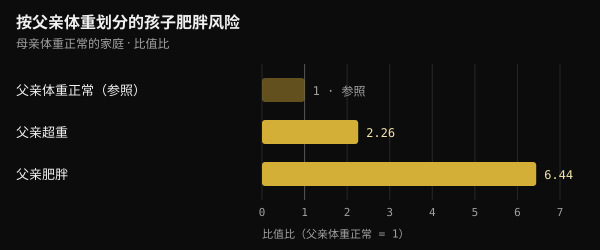
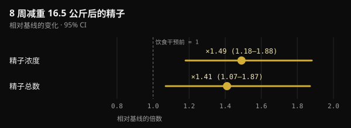

# 受孕时父亲的体重：究竟会传给孩子什么

说到孕前健康，大多数人想到的只有母亲。2024 年发表在《自然》（Nature）上的一项研究，把目光也投向了父亲。本文告诉你这项研究真正证明了什么、在传播中被添加了什么，以及在准备要孩子前的几个月里，做什么才有意义。

## 要点速览

- 在小鼠中，交配前两周的高脂饮食就足以让约 30% 的雄性后代出现葡萄糖耐量受损，而它们的体重并没有变化。
- 如果父亲在受孕前恢复正常饮食 4 周，这种效应就消失了：在小鼠身上，这个信号是可逆的。
- 在人类中，数据只是相关性：在莱比锡的两个队列中，母亲体重正常时，父亲超重与孩子肥胖几率约翻倍相关。
- 社交媒体上流传的一些数字（某个片段"升高 3.8 倍"并阻断己糖激酶 2）并没有出现在原始研究中。
- 受孕前几个月，体重、饮食和生活方式才是关键。一项在 2370 对夫妇中测试的男性叶酸加锌补充剂，并没有提高活产率。

## Nature 这项研究到底做了什么

这项研究由德国亥姆霍兹慕尼黑研究中心（Helmholtz Munich）的 Anika Tomar 等人完成，负责人是 Raffaele Teperino，于 2024 年 6 月发表在 Nature 上。研究问题很明确：如果父亲的饮食改变了精子里的某些东西，这种改变发生在睾丸里精子生成的时候，还是之后精子在附睾中成熟的时候？

附睾是贴附在睾丸上的管道，精子在这里完成最后的成熟。研究人员让年轻雄性小鼠吃了仅仅 2 周的高脂饲料，其中 60% 的热量来自脂肪。一组随即与从未接触这种饲料的雌鼠交配；另一组先恢复普通饲料 4 周，因此它们的后代来自从未"见过"高脂饮食的精子。

- **后代体重没有变化**，但第一组约 30% 的雄性后代出现葡萄糖耐量受损（处理血糖的能力变差），胰岛素敏感性也下降。
- **第二组后代一切正常**：信号来自成熟过程中接触到饮食的精子，恢复一个月正常饮食后就消失了。
- **精子中的线粒体小 RNA 增多**，即线粒体转运 RNA（mt-tRNA）及其片段（mt-tsRNA）。在二细胞期胚胎中，作者证明父源 mt-tRNA 在受精时会进入胚胎。

这是一条不经过 DNA 的传递途径：不是基因突变，而是与父亲当时代谢状态相关的信号。

## 人类的情况呢？

同一篇论文包含两类人类数据。第一类关于精子：在 18 名芬兰年轻志愿者中，mt-tsRNA 是唯一随身体质量指数（BMI）升高而增加的小 RNA 类型。作者自己也承认样本很小。

第二类关于孩子。在莱比锡的两项儿科研究（Leipzig Childhood Obesity Cohort 和 LIFE Child）中，即使考虑了母亲的 BMI，父亲的 BMI 仍与孩子的 BMI 相关。在母亲体重正常的家庭中，父亲超重与孩子肥胖的几率约增加一倍相关，父亲肥胖则与超过六倍的几率相关。

*来源：Tomar et al., Nature 2024，莱比锡队列。比值比取自研究正文；父亲体重正常 = 参照。Nurvan 图表。*

换个角度看，母亲的体重能解释孩子之间 BMI 差异的 18%，父亲的体重再解释 6%。作者校正了亲缘关系和估算的遗传风险，但观察性研究无法完全区分生物学因素和家庭习惯：一个家里饮食不健康，往往是全家一起不健康。

## 并非所有研究都指向同一个方向

同样在 2024 年，巴塞罗那的一个团队在 Heliyon 上发表了类似的实验，区别在于：雄性小鼠吃西式饮食后真正变得肥胖。肥胖父亲的精子中有 450 个 DNA 区域的可及性发生了改变（更容易或更难被"读取"）。然而，无论雄性还是雌性后代，只在生命早期出现了轻微的代谢变化，之后就消失了，没有持久的肥胖或糖尿病倾向。

作者称之为后代的"韧性"：精子中测到的变化，并不自动等于对孩子的影响。

有两个词不要混淆：**代际**效应指由受影响精子孕育的子代（F1）；**跨代**效应则是在没有新暴露的情况下延续到孙辈及以后（F2、F3）。Nature 这项研究只涉及子代。

## 流传的说法与论文里的内容

在社交媒体上，这项研究常被讲得非常具体：某个 RNA 片段升高 3.8 倍，进入胚胎并阻断己糖激酶 2（利用葡萄糖的关键酶）的 mRNA；葡萄糖不耐受的后代是通过体外受精获得的；BMI 超过 30 的男性体内这些片段高出 2.3 倍。

这些数字并不在 PubMed Central 上该研究的全文中。它们出现在 2026 年发表于 Clinical Epigenetics 的一篇综述里，并被归于 Tomar 等人。而在原始研究中：

- 葡萄糖不耐受的后代来自**自然交配**；体外受精只用于制备供分析的二细胞期胚胎；
- 作者写道，他们的数据显示的是完整 mt-tRNA 的传递，**而不是**片段的传递——后者他们认为很可能，但尚未证实；
- 人类精子分析把 BMI 当作 18 名年轻男性中的连续变量，并没有比较 BMI 高于和低于 30 的人。

所以，被说得如此确定的机制，目前只是一个合理的假说。

## 父亲的体重可以改变，精子也会响应

人类精子从生成到出现在精液中大约需要两个月：在一项针对 11 名男性的标记水研究中，第一批"新"精子平均在 64 天后出现（范围 42 至 76 天）。这就是常说的受孕前 2–3 个月窗口期。不过在小鼠中，最关键的是成熟的最后几周。

而且，肥胖男性减重后，精液质量会改善。在一项丹麦随机试验中，56 名 BMI 为 32 至 43 的男性在医生监督下进行了 8 周每天 800 千卡的饮食，平均减重 16.5 公斤。精子浓度和精子总数提高到约 1.5 倍。一年后，保持住体重的人改善仍在，体重反弹的人则没有。

*来源：Andersen et al., Hum Reprod 2022（n = 56）。8 周低热量饮食后相对基线的变化，含 95% 置信区间。Nurvan 图表。*

此外，在重度肥胖男性中，减重手术后精子的 DNA 甲基化也发生了明显变化，包括与食欲调控相关的区域。

但仍缺一环：目前还没有人类研究证明，父亲在受孕前减重能改善孩子的代谢健康。我们知道父亲的体重与孩子的健康相关，也知道精子会对减重作出反应；但两者之间的直接联系尚未被检验。

## 那用补充剂来"调理"精子呢？

这类研究常被用来推销男性生育补充剂。现有最有力的检验却指向相反的方向。

在 FAZST 试验（JAMA，2020）中，2370 对即将开始辅助生殖治疗的夫妇被随机分组：男方连续 6 个月服用叶酸（5 毫克）加锌（30 毫克）或安慰剂。两组活产率几乎相同，34% 对 35%，几乎所有精液指标都没有变化。补充剂组的精子 DNA 碎片率甚至略高（29.7% 对 27.2%）。

该试验没有测量孩子的代谢健康，但结论很清楚：目前没有任何补充剂能替代体重管理和生活方式，也没有人类研究支持基于这些数据为男性制定"孕前"补充方案。

## 研究到底怎么说

本文的灵感来自 Marco Guercioni（@the___doc）的一篇帖子，他谨慎地介绍了这项研究，并列出了其局限。以下是其主要说法与原始文献的对照。

- **已证实** — "Tomar 等人，Nature，2024 年 6 月：对饮食作出反应的是已成熟的精子，30% 的雄性后代出现葡萄糖不耐受。" 在小鼠中成立。
- **被原始研究否定** — "通过体外受精，没有母体的贡献。" 被评估的后代是与未暴露雌鼠自然交配所生。体外受精只用于分析二细胞期胚胎。
- **无法核实** — "某个片段升高 3.8 倍并阻断己糖激酶 2 的 mRNA；BMI 超过 30 的男性体内高出 2.3 倍。" 这些数字出现在 2026 年的一篇综述里，而不在原研究中；原研究作者写明，片段进入胚胎尚未得到证明。
- **需要补充说明** — "在两个队列中，父亲的 BMI 独立于母亲影响孩子的代谢健康。" 相关性确实存在，但属于观察性数据，而且父亲解释的比例小于母亲（6% 对 18%）。
- **已证实** — "这是代际效应，不是跨代效应；在小鼠中有因果链，在人类中只是相关。" Heliyon 的结果（450 个区域、无持久倾向）同样成立，且来自小鼠。
- **无法核实** — "一半的效应来自出生后共同的家庭环境。" 家庭环境当然重要，但我们在查阅的文献中没有找到 50% 这一估计。
- **已证实** — "没有人类数据支持补充剂方案。" FAZST 试验得出的方向一致。
- **需要补充说明** — "最后三个月是关键窗口。" 精子约需 2 个月生成：3 个月是一个稳妥的窗口。

## 如何应用

如果你在考虑要孩子，可以这样把这些数据变成具体行动。这些是一般性的健康习惯，不是治疗。

1. **提前 2–3 个月开始。** 这是"新一代"精子生成所需的时间，但最后几周同样重要。
2. **关注体重和腰围。** 如果你超重，即使是适度、可持续的减重也是朝着正确方向。像丹麦研究中那样每天 800 千卡的极低热量饮食，只能在医生监督下进行。
3. **提高饮食质量。** 多吃加工程度低的食物、蔬菜、豆类和瘦肉蛋白；少吃超加工食品和含糖饮料。
4. **规律训练**，结合力量训练和有氧运动。在丹麦试验中，运动是维持减重成果的策略之一。
5. **吸烟、饮酒和睡眠。** 戒烟、少喝酒、睡够觉，都是同一份准备的一部分。
6. **不要因为这些研究就去买"养精"补充剂。** 如果你对生育力有疑问，或者已经尝试了一段时间，请咨询医生或男科医生，他们可以安排精液检查。

这不是要归咎于谁，而是多了一个可以发力的地方。慕尼黑同一团队在 2025 年发表的综述就主张：孕前准备应该让父母双方共同参与，而不只是母亲。

<h3>用数据规划接下来的三个月</h3>

在 Nurvan 中，你可以记录体重和身体围度，用饮食日记追踪饮食，并记下每一次训练，一周一周地看清自己是否走在正确的方向上。如果你和教练合作，教练能看到同样的数据，并为你安排饮食计划和训练计划。

<a href="https://nurvan.app">试用 Nurvan</a>

## 常见问题

### 我们怀孕时我超重，孩子会肥胖吗？

不会是注定的。数据描述的是众多家庭的平均风险，而不是某个孩子的命运。影响因素很多，首先是全家怎么吃、怎么动，而这些随时都可以改变。

### 受孕前多久，父亲的体重开始起作用？

人类精子大约需要两个月生成，所以最常提到的是受孕前 2–3 个月。在小鼠中，2 周的饮食就足以引起效应，4 周的正常饮食就能将其消除。人类的确切时间尚未被测量。

### 有没有能在受孕前"净化"精子的补充剂？

没有人类证据。在规模最大的试验中，连续 6 个月补充叶酸和锌，既没有提高活产率，也没有改善精液质量。如果你存在营养缺乏或生育问题，应由医生评估。

### 这对母亲同样适用吗？

是的，而且影响更大：在莱比锡的数据中，母亲的体重解释了孩子之间更大比例的差异。新发现并不是父亲比母亲更重要，而是父亲同样重要。

## 参考文献

1. Tomar A, Gomez-Velazquez M, Gerlini R et al., 2024. Epigenetic inheritance of diet-induced and sperm-borne mitochondrial RNAs. *Nature* 630(8017):720–727. [PMID 38839949](https://pubmed.ncbi.nlm.nih.gov/38839949/) · [DOI 10.1038/s41586-024-07472-3](https://doi.org/10.1038/s41586-024-07472-3)
2. Tahiri I, Llana SR, Fos-Domènech J et al., 2024. Paternal obesity induces changes in sperm chromatin accessibility and has a mild effect on offspring metabolic health. *Heliyon* 10(14):e34043. [PMID 39100496](https://pubmed.ncbi.nlm.nih.gov/39100496/) · [DOI 10.1016/j.heliyon.2024.e34043](https://doi.org/10.1016/j.heliyon.2024.e34043)
3. Song S, Zhang B, Xiong F et al., 2026. Sperm tRNA-derived fragments: molecular mechanisms and clinical implications for paternal epigenetic inheritance. *Clin Epigenetics* 18(1). [PMID 42135772](https://pubmed.ncbi.nlm.nih.gov/42135772/) · [DOI 10.1186/s13148-026-02155-4](https://doi.org/10.1186/s13148-026-02155-4)
4. Andersen E, Juhl CR, Kjøller ET et al., 2022. Sperm count is increased by diet-induced weight loss and maintained by exercise or GLP-1 analogue treatment: a randomized controlled trial. *Hum Reprod* 37(7):1414–1422. [PMID 35580859](https://pubmed.ncbi.nlm.nih.gov/35580859/) · [DOI 10.1093/humrep/deac096](https://doi.org/10.1093/humrep/deac096)
5. Donkin I, Versteyhe S, Ingerslev LR et al., 2016. Obesity and bariatric surgery drive epigenetic variation of spermatozoa in humans. *Cell Metab* 23(2):369–378. [PMID 26669700](https://pubmed.ncbi.nlm.nih.gov/26669700/) · [DOI 10.1016/j.cmet.2015.11.004](https://doi.org/10.1016/j.cmet.2015.11.004)
6. Misell LM, Holochwost D, Boban D et al., 2006. A stable isotope-mass spectrometric method for measuring human spermatogenesis kinetics in vivo. *J Urol* 175(1):242–246. [PMID 16406920](https://pubmed.ncbi.nlm.nih.gov/16406920/) · [DOI 10.1016/S0022-5347(05)00053-4](https://doi.org/10.1016/S0022-5347(05)00053-4)
7. Schisterman EF, Sjaarda LA, Clemons T et al., 2020. Effect of folic acid and zinc supplementation in men on semen quality and live birth among couples undergoing infertility treatment: a randomized clinical trial. *JAMA* 323(1):35–48. [PMID 31910279](https://pubmed.ncbi.nlm.nih.gov/31910279/) · [DOI 10.1001/jama.2019.18714](https://doi.org/10.1001/jama.2019.18714)
8. Skerrett-Byrne DA, Pepin AS, Laurent K et al., 2025. Dad's diet shapes the future: how paternal nutrition impacts placental development and childhood metabolic health. *Mol Nutr Food Res* 69(22):e70261. [PMID 40913545](https://pubmed.ncbi.nlm.nih.gov/40913545/) · [DOI 10.1002/mnfr.70261](https://doi.org/10.1002/mnfr.70261)

本文灵感来自 [Marco Guercioni（@the___doc）](https://www.instagram.com/p/DdokwJDiH92/) 的一篇帖子。文献通过 PubMed 查阅。

> 注：本文仅供参考，不能替代医生或合格专业人士的意见。
