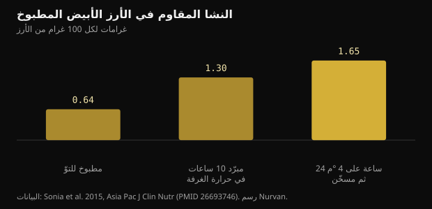
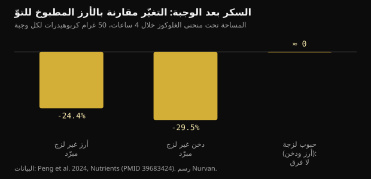

# الأرز المبرّد والنشا المقاوم: ما الذي يتغيّر فعلًا

طبخ الأرز ووضعه في الثلاجة وتسخينه في اليوم التالي صار نصيحة مدرسية لضبط سكر الدم. الآلية موجودة فعلًا، لكن الأرقام أصغر من تلك المتداولة، ونوع الحبّة يهمّ أكثر من الثلاجة.

## باختصار

- تبريد الأرز الأبيض المطبوخ يرفع النشا المقاوم: من 0.64 إلى 1.65 غرام لكل 100 غرام بعد 24 ساعة على 4 °م وإعادة تسخين. الزيادة حقيقية، لكنها بالقيمة المطلقة نحو غرام واحد.
- في الدراسة نفسها انخفضت الاستجابة السكّرية نحو 18% مقارنة بالأرز المطبوخ للتوّ، لدى 15 مشاركًا.
- لا ينجح الأمر إلا مع الحبوب الغنيّة بالأميلوز: في تجربة من 2024 خفّض الأرز والدخن غير اللزجين بعد التبريد سكرَ الدم بنسبة 24 إلى 30%، بينما لم تُظهر الأصناف اللزجة أي فرق.
- تفوّق الدخن المطبوخ للتوّ على نسخته المبرّدة في الوجبة التالية (-39% مقارنة بالأرز الطازج)، والفضل كان للنشا بطيء الهضم لا لمرور الطعام بالثلاجة.
- فكرة أن التبريد يخفض السعرات إلى النصف تعود إلى مداخلة في مؤتمر عام 2015 لم تُنشر قط كدراسة: لا شيء يمكن التحقّق منه.

## ماذا يحدث فعلًا حين يبرد الأرز

نشا الحبوب مكوّن من جزيئين. الأميلوز سلسلة خطية، والأميلوبكتين متفرّع. وبالطهي في الماء تنتفخ الحبيبات وتنفرد السلاسل: هذه هي الجلتنة، وهي ما يجعل النشا سهل المنال لإنزيمات الهضم.

وحين يبرد الطبق يعيد جزء من تلك السلاسل ترتيب نفسه في بنى بلّورية أكثر إحكامًا. تُسمّى هذه العملية الارتجاع، وتنتج نشا مقاومًا من النوع الثالث: مقاوم لأن إنزيمات الأمعاء الدقيقة لم تعد قادرة على تفكيكه بالكامل، فيصل إلى القولون حيث تخمّره البكتيريا إلى أحماض دهنية قصيرة السلسلة مثل الزبدات.

الأميلوز هو الجزء الأفضل في إعادة الترتيب، لأن السلاسل الخطية تصطفّ بسهولة. لذلك تنجح الحيلة مع البسمتي وغيره من الأرز الطويل الحبّة الغنيّ بالأميلوز، ولا تنجح مع الأرز اللزج والأصناف شديدة الالتصاق حيث يسود الأميلوبكتين المتفرّع.

قاست دراسة على بالغين أصحّاء المقدار بدقّة. في الأرز الأبيض المطبوخ للتوّ كان النشا المقاوم 0.64 غرام لكل 100 غرام؛ وبعد 10 ساعات في حرارة الغرفة ارتفع إلى 1.30؛ وبعد 24 ساعة في الثلاجة على 4 °م ثم إعادة تسخين بلغ 1.65.

*النشا المقاوم في الأرز الأبيض المطبوخ — البيانات: Sonia et al. 2015, Asia Pac J Clin Nutr (PMID 26693746). رسم Nurvan.*

أمران يلفتان النظر. إعادة التسخين لا تلغي الأثر: القيمة الأعلى هي بالضبط قيمة الأرز المبرّد ثم المسخّن. والزيادة، رغم أنها تقارب ثلاثة أضعاف نسبيًا، تساوي نحو غرام واحد لكل 100 غرام من الأرز.

## كم ينخفض السكر، بالأرقام

في الدراسة نفسها تناول خمسة عشر بالغًا سليمًا، بترتيب عشوائي، أرزًا مطبوخًا للتوّ وأرزًا مبرّدًا ثم مسخّنًا. بلغت المساحة تحت منحنى الغلوكوز 125 مقابل 152 مليمول·دقيقة/لتر: أي أقل بنحو 18%، بفارق دالّ إحصائيًا لكن بالكاد.

قدّمت تجربة من 2024 على ثماني عشرة امرأة سليمة مقارنة أنفع، لأنها شملت أصنافًا مختلفة. احتوت كل وجبة اختبار على 50 غرامًا من الكربوهيدرات، وقُدّمت الحبوب إمّا مطبوخة للتوّ وإمّا بعد 24 ساعة على 4 °م.

*السكر بعد الوجبة: التغيّر مقارنة بالأرز المطبوخ للتوّ — البيانات: Peng et al. 2024, Nutrients (PMID 39683424). رسم Nurvan.*

خفّض الأرز غير اللزج المبرّد مساحة السكر في الساعات الأربع الأولى بنسبة 24.4% مقارنة بالأرز الطازج، وخفّضها الدخن غير اللزج المبرّد بنسبة 29.5%. أما النسخ اللزجة فلم يظهر فيها فرق دالّ لا في الغلوكوز ولا في الإنسولين: تبريدها لم يُجدِ شيئًا.

النتيجة الأطرف تأتي بعد ذلك. فعند قياس السكر بعد غداء موحّد، أعطى الدخن غير اللزج المطبوخ للتوّ مساحة سكر أقل بنسبة 39.1% من الأرز الطازج، والفضل لم يكن للنشا المقاوم بل للنشا بطيء الهضم الذي شكّل 64.8% من المجموع في تلك العيّنة. أما النسخة المبرّدة من الدخن نفسه فلم تُحدث ذلك الأثر.

بعبارة أخرى: اختيار الحبّ المناسب قد يكون أهمّ من ضبط حرارة الحبّ غير المناسب.

## أسطورة نصف السعرات

تقول النسخة المنتشرة شيئًا آخر: إن طهي الأرز بملعقة صغيرة من زيت جوز الهند ثم تبريده يقلّل السعرات الممتصّة بنسبة تصل إلى 60%. ولهذا الرقم تاريخ محدّد. ففي 2015 أعلنه فريق بحثي من سريلانكا في مداخلة أمام الجمعية الكيميائية الأمريكية، فتناقلته الصحافة على نطاق واسع.

لم يُنشر ذلك العمل قطّ كدراسة محكّمة، ولم يُتَح أي قياس لامتصاص السعرات لدى البشر. ورقم أُعلن في مؤتمر ولم يُنشر ليس نتيجة يمكن لأحد التحقّق منها.

ثمّ هناك مشكلة في رتبة المقدار. فإذا كان التبريد يمنحك نحو غرام من النشا المقاوم لكل 100 غرام أرز مطبوخ، وكان النشا المقاوم يعطي طاقة أقل من النشا القابل للهضم لأنه يُخمَّر بدل أن يُمتصّ، فإن ما تُوفّره حصّة عادية يبقى في حدود سعرات قليلة. لا نصف الطبق.

## الجرعات التي تهمّ في أبحاث النشا المقاوم

يُستحسن فصل مسألتين. الأولى هي الأثر الحادّ على السكر بعد وجبة واحدة، والثانية هي الأثر على ضبط السكر مع الوقت.

وجدت مراجعة تحليلية لتسع عشرة تجربة عشوائية أن النشا المقاوم يخفض سكر الصيام بمقدار محدود (-0.09 مليمول/لتر)، وأن الأثر يصبح أوضح فوق 28 غرامًا يوميًا من النشا المقاوم أو بعد أكثر من 8 أسابيع من التناول. كما تحسّنت مقاومة الإنسولين المقدّرة بمؤشر HOMA.

ثمانية وعشرون غرامًا يوميًا ليست مما يبلغه الأرز المبرّد وحده: فذلك يتطلّب نحو كيلوغرامين من الأرز المطبوخ. ومن يبلغ تلك الجرعات يفعل ذلك بنشويات مقاومة معزولة أو بالبقول والشوفان والحبوب الكاملة، لا بتسخين البقايا.

وقارنت مراجعة منهجية أخرى، لدى أشخاص مصابين بالسكري من النوع الثاني أو بما قبل السكري، أنواع النشا المقاوم فوجدت آثارًا واضحة للنوع الأول (المحبوس داخل جدران خلايا البقول والحبوب الكاملة) وللنوع الثاني (الغني بالأميلوز)، وخلصت إلى أن النوع الثالث تحديدًا، أي الذي يتكوّن بالتبريد، ما زال قليل الدراسة ويحتاج إلى مزيد من البحث. وهو بالضبط النوع الذي تتحدّث عنه المنشورات المنتشرة.

## الحفظ: الجزء العملي الذي تقفز عنه المنشورات

الأرز المطبوخ المتروك في حرارة الغرفة من أكثر الأطعمة التي تشدّد عليها الجهات الصحية، لأنه قد يشجّع نموّ البكتيريا وسمومها. والمكسب السكّري الذي نتحدّث عنه بضع نقاط مئوية: لا يستحقّ أن تناله بترك قِدر في الخارج طوال اليوم.

الممارسة المعقولة هي المعتادة: تبريد سريع في وعاء منخفض، ووضعه في الثلاجة فورًا، وتناوله خلال أيام قليلة، وتسخينه جيدًا حتى يسخن في كامل كتلته. والنشا المقاوم الذي تكوّن يتحمّل التسخين، فلا تخسر شيئًا بتسخينه جيدًا.

## ما تقوله الأبحاث فعلًا

**مؤكّد** — تبريد الأرز المطبوخ يرفع النشا المقاوم.

من 0.64 غرام لكل 100 غرام في الأرز المطبوخ للتوّ إلى 1.30 بعد 10 ساعات في حرارة الغرفة و1.65 بعد 24 ساعة في الثلاجة مع إعادة تسخين. نسبيًا يقارب ثلاثة أضعاف، ومطلقًا نحو غرام واحد.

**مؤكّد** — الأرز المبرّد ثم المسخّن يخفض الاستجابة السكّرية.

أقل بنحو 18% في المساحة تحت المنحنى من الأرز الطازج لدى خمسة عشر بالغًا سليمًا، وأقل بنسبة 24.4% في الساعات الأربع الأولى في تجربة لاحقة على ثماني عشرة امرأة. أثر حقيقي ومتواضع.

**مؤكّد** — لا ينجح إلا مع الحبوب المناسبة.

في تجربة 2024 لم يخفض التبريد السكر إلا في الحبوب غير اللزجة الغنيّة بالأميلوز. أما الأرز والدخن اللزجان فلم يُظهرا فرقًا دالًّا في الغلوكوز ولا في الإنسولين.

**غير صحيح** — تبريد الأرز يخفض سعراته إلى النصف.

رقم «حتى 60%» مصدره مداخلة عام 2015 في مؤتمر للجمعية الكيميائية الأمريكية لم تُنشر قطّ كدراسة محكّمة. والزيادة المقاسة في النشا المقاوم، نحو غرام لكل 100 غرام، لا يمكن أن تزحزح سعرات حصّة بهذا القدر.

**يحتاج توضيحًا** — النشا المقاوم يحسّن ضبط السكر.

نعم، بالجرعات المستعملة في الدراسات. تجد المراجعة التحليلية لتسع عشرة تجربة أثرًا محدودًا على سكر الصيام، أوضح فوق 28 غرامًا يوميًا أو بعد أكثر من 8 أسابيع. والأرز المبرّد وحده لا يقترب من تلك الكميات.

**يحتاج توضيحًا** — أرز الأمس أفضل من الطازج.

يعتمد على المقارنة. ففي الوجبة التالية تفوّق الدخن غير اللزج المطبوخ للتوّ على نسخته المبرّدة بفضل النشا بطيء الهضم. والصنف الذي تختاره يزن قدر الحرارة، وأحيانًا أكثر.

## كيف تطبّق ذلك

1. إن أردت استعمال الحيلة فاستعملها مع البسمتي أو الأرز الطويل الحبّة أو المعكرونة: هذه أطعمة غنيّة بالأميلوز ينجح فيها الارتجاع. أما الأرز اللزج والأصناف شديدة الالتصاق فلا يتغيّر معها شيء.
2. برّد بسرعة في وعاء منخفض، وضَع في الثلاجة فورًا، وسخّن جيدًا قبل الأكل: النشا المقاوم يتحمّل الحرارة، والبكتيريا لا.
3. لا تعوّل على الثلاجة لخفض السعرات. التوفير الحقيقي بضعة غرامات من النشا في الحصّة، لا نصف الطبق.
4. إن كان الهدف سكر الدم فحرّك الروافع الكبيرة أولًا: حجم الحصّة، والألياف والبروتين والدهون في الوجبة نفسها، ومشي بعد الأكل.
5. للوصول إلى كميات من النشا المقاوم تقارب كميات الدراسات، انظر إلى البقول والشوفان والشعير والحبوب الكاملة، لا إلى البقايا المسخّنة.
6. جرّب على نفسك: إن كنت تستعمل جهاز قياس السكر لأسبابك الخاصة فقارن الوجبة نفسها طازجة ومبرّدة في أيام مختلفة. أما أي مسألة سريرية فمكانها الطبيب.

> **انظر إلى ما تفعله وجباتك فعلًا، لا إلى النظرية وحدها**  
> في Nurvan تحتفظ بمفكّرة الطعام مع الحصص والمغذّيات الكبرى وتضعها إلى جانب التمارين والقياسات وتقارير التحاليل. وإن كنت تعمل مع مدرّب فهو يرى البيانات نفسها ويستطيع ضبط الخطة على الوجبات التي تأكلها فعلًا لا على الوجبات المثالية. — **جرّب Nurvan** (https://nurvan.app)

## أسئلة شائعة

### هل ينطبق ذلك على المعكرونة والبطاطا؟

الآلية نفسها وتشمل أي نشا غنيّ بالأميلوز، فالمعكرونة والبطاطا المتماسكة داخلة. أما الدراسات البشرية المذكورة هنا فقاست الأرز والدخن: المبدأ معقول لأطعمة أخرى لكن الأرقام الدقيقة ليست هذه.

### هل يدمّر التسخين النشا المقاوم؟

لا. ففي دراسة 2015 كانت أعلى قيمة للنشا المقاوم هي قيمة الأرز المبرّد 24 ساعة ثم المسخّن. والتسخين الجيّد أيضًا هو الخيار الأأمن من ناحية سلامة الغذاء.

### كم يلزم من الأرز المبرّد للحصول على 28 غرامًا من النشا المقاوم؟

بنحو 1.65 غرام لكل 100 غرام من الأرز المطبوخ المبرّد والمسخّن، يلزم نحو كيلوغرامين من الأرز المطبوخ. ولهذا تأتي جرعات الدراسات طويلة الأمد من نشويات مقاومة معزولة أو من البقول والحبوب الكاملة، لا من البقايا.

### هل يلزم زيت جوز الهند أثناء الطهي؟

هذا مكوّن النسخة المنتشرة من النصيحة، وقد وُلدت من مداخلة مؤتمر عام 2015 لم تُنشر قطّ كدراسة. وفي الدراسات المحكّمة المذكورة هنا طُبخ الأرز بالطريقة المعتادة من دون دهن مضاف.

## المصادر

- Sonia S, Witjaksono F, Ridwan R, 2015. Effect of cooling of cooked white rice on resistant starch content and glycemic response. Asia Pac J Clin Nutr 24(4):620-625. [PMID 26693746](https://pubmed.ncbi.nlm.nih.gov/26693746/) · [DOI 10.6133/apjcn.2015.24.4.13](https://doi.org/10.6133/apjcn.2015.24.4.13)
- Peng X, Fan Z, Wei J et al., 2024. Fresh-cooked but not cold-stored millet exhibited remarkable second meal effect independent of resistant starch: a randomized crossover trial. Nutrients 16(23):4030. [PMID 39683424](https://pubmed.ncbi.nlm.nih.gov/39683424/) · [DOI 10.3390/nu16234030](https://doi.org/10.3390/nu16234030)
- Pugh JE, Cai M, Altieri N, Frost G, 2023. A comparison of the effects of resistant starch types on glycemic response in individuals with type 2 diabetes or prediabetes: a systematic review and meta-analysis. Front Nutr 10:1118229. [PMID 37051127](https://pubmed.ncbi.nlm.nih.gov/37051127/) · [DOI 10.3389/fnut.2023.1118229](https://doi.org/10.3389/fnut.2023.1118229)
- Xiong K, Wang J, Kang T, Xu F, Ma A, 2020. Effects of resistant starch on glycaemic control: a systematic review and meta-analysis. Br J Nutr 125(11):1260-1269. [PMID 32959735](https://pubmed.ncbi.nlm.nih.gov/32959735/) · [DOI 10.1017/S0007114520003700](https://doi.org/10.1017/S0007114520003700)
- Chen Z, Liang N, Zhang H et al., 2024. Resistant starch and the gut microbiome: exploring beneficial interactions and dietary impacts. Food Chem X 21:101118. [PMID 38282825](https://pubmed.ncbi.nlm.nih.gov/38282825/) · [DOI 10.1016/j.fochx.2024.101118](https://doi.org/10.1016/j.fochx.2024.101118)
- Smithsonian Magazine, 2015. *Why would cooling rice make it less caloric?* تغطية لمداخلة Sudhair James أمام الجمعية الكيميائية الأمريكية: خفض للسعرات يصل إلى 60% أُعلن في مؤتمر ولم يُنشر قطّ كدراسة محكّمة. https://www.smithsonianmag.com/smart-news/why-would-cooling-rice-make-it-less-caloric-1-180954765/

هذا المقال مستوحى من منشور لـ [Dr William Wallace (@dr.williamwallace)](https://www.instagram.com/p/DdG7bRRkSUN/). المصادر عبر PubMed.

> ملاحظة: محتوى تثقيفي لا يغني عن رأي طبيب أو مختصّ مؤهّل.
