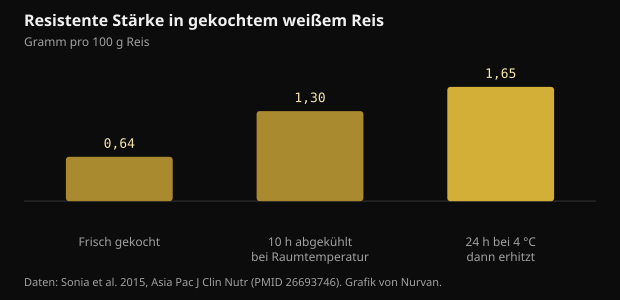
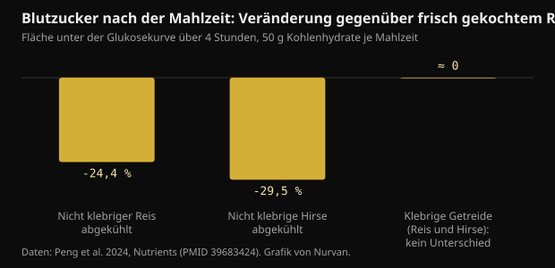

# Abgekühlter Reis und resistente Stärke: was sich wirklich ändert

Reis kochen, in den Kühlschrank stellen und am nächsten Tag aufwärmen gilt inzwischen als Standardrat für den Blutzucker. Den Mechanismus gibt es wirklich, doch die Zahlen sind kleiner als die kursierenden, und die Sorte zählt mehr als der Kühlschrank.

## Kurz gefasst

- Abgekühlter gekochter weißer Reis enthält mehr resistente Stärke: von 0,64 auf 1,65 g pro 100 g nach 24 Stunden bei 4 °C und erneutem Erhitzen. Der Anstieg ist echt, absolut gesehen aber rund ein Gramm.
- In derselben Studie sank die Blutzuckerantwort gegenüber frisch gekochtem Reis um etwa 18 Prozent, bei 15 Teilnehmenden.
- Es funktioniert nur mit amylosereichen Körnern: In einer Studie von 2024 senkten abgekühlter nicht klebriger Reis und Hirse den Blutzucker um 24 bis 30 Prozent, während klebrige Sorten gar keinen Unterschied zeigten.
- Frisch gekochte Hirse schlug ihre abgekühlte Version bei der nächsten Mahlzeit (-39 Prozent gegenüber frischem Reis), und zwar dank langsam verdaulicher Stärke, nicht wegen des Kühlschranks.
- Die Vorstellung, Abkühlen halbiere die Kalorien, stammt aus einem Kongressvortrag von 2015, der nie als Studie erschienen ist: Es gibt nichts zu überprüfen.

## Was beim Abkühlen wirklich passiert

Stärke in Getreide besteht aus zwei Molekülen. Amylose ist eine lineare Kette, Amylopektin ist verzweigt. Beim Kochen in Wasser quellen die Körnchen und die Ketten entrollen sich: Das ist die Verkleisterung, und sie macht Stärke für Verdauungsenzyme leicht angreifbar.

Kühlt das Gericht ab, ordnet sich ein Teil dieser Ketten in dichtere kristalline Strukturen um. Dieser Vorgang heißt Retrogradation und erzeugt resistente Stärke vom Typ 3: resistent, weil die Enzyme im Dünndarm sie nicht mehr vollständig zerlegen können, sodass sie in den Dickdarm gelangt, wo Bakterien sie zu kurzkettigen Fettsäuren wie Butyrat vergären.

Amylose ordnet sich am besten um, weil sich lineare Ketten leicht ausrichten. Deshalb funktioniert der Trick mit Basmati und anderem Langkornreis, die reich an Amylose sind, und nicht mit Klebreis oder sehr klebrigen Sorten, in denen verzweigtes Amylopektin überwiegt.

Eine Studie an gesunden Erwachsenen hat genau gemessen, wie viel. In frisch gekochtem weißem Reis lag die resistente Stärke bei 0,64 g pro 100 g; nach 10 Stunden bei Raumtemperatur stieg sie auf 1,30; nach 24 Stunden im Kühlschrank bei 4 °C und erneutem Erhitzen auf 1,65.

*Resistente Stärke in gekochtem weißem Reis — Daten: Sonia et al. 2015, Asia Pac J Clin Nutr (PMID 26693746). Grafik von Nurvan.*

Zwei Dinge fallen auf. Erhitzen hebt den Effekt nicht auf: Der höchste Wert gehört gerade dem gekühlten und dann aufgewärmten Reis. Und der Anstieg, relativ fast das Dreifache, entspricht etwa einem Gramm pro 100 g Reis.

## Wie stark der Blutzucker tatsächlich sinkt

In derselben Studie aßen fünfzehn gesunde Erwachsene in zufälliger Reihenfolge frisch gekochten und gekühlt-wieder-erhitzten Reis. Die Fläche unter der Glukosekurve betrug 125 gegenüber 152 mmol·min/L: etwa 18 Prozent weniger, statistisch signifikant, aber knapp.

Eine Studie von 2024 an achtzehn gesunden Frauen bot den nützlicheren Vergleich, weil sie verschiedene Sorten einbezog. Jede Testmahlzeit enthielt 50 g Kohlenhydrate, das Getreide wurde frisch gekocht oder nach 24 Stunden bei 4 °C serviert.

*Blutzucker nach der Mahlzeit: Veränderung gegenüber frisch gekochtem Reis — Daten: Peng et al. 2024, Nutrients (PMID 39683424). Grafik von Nurvan.*

Abgekühlter nicht klebriger Reis senkte die Glukosefläche der ersten vier Stunden um 24,4 Prozent gegenüber frischem Reis, abgekühlte nicht klebrige Hirse um 29,5 Prozent. Bei den klebrigen Varianten gab es weder beim Glukose- noch beim Insulinverlauf einen signifikanten Unterschied: Abkühlen brachte dort nichts.

Das interessanteste Ergebnis kommt danach. Bei der Messung nach einem standardisierten Mittagessen lag die Glukosefläche nach frisch gekochter nicht klebriger Hirse 39,1 Prozent unter der von frischem Reis, und verantwortlich war nicht resistente Stärke, sondern langsam verdauliche Stärke, die in dieser Probe 64,8 Prozent ausmachte. Die abgekühlte Version derselben Hirse zeigte diesen Effekt nicht.

Übersetzt: Das richtige Getreide zu wählen kann mehr bringen, als beim falschen die Temperatur zu steuern.

## Der Mythos von den halbierten Kalorien

Die virale Fassung des Rats sagt etwas anderes: Reis mit einem Teelöffel Kokosöl zu kochen und abzukühlen senke die aufgenommenen Kalorien um bis zu 60 Prozent. Diese Zahl hat eine klare Geschichte. 2015 kündigte eine Forschungsgruppe aus Sri Lanka sie in einem Vortrag bei der American Chemical Society an, und die Presse griff sie breit auf.

Diese Arbeit wurde nie als begutachtete Studie veröffentlicht, und keine Messung der Kalorienaufnahme beim Menschen wurde zugänglich gemacht. Eine auf einer Tagung angekündigte und nie publizierte Zahl ist kein überprüfbares Ergebnis.

Dazu kommt ein Größenordnungsproblem. Wenn das Abkühlen etwa ein Gramm resistente Stärke pro 100 g gekochten Reis bringt und resistente Stärke weniger Energie liefert als verdauliche, weil sie vergoren statt aufgenommen wird, bleibt die Ersparnis bei einer normalen Portion im Bereich weniger Kalorien. Nicht beim halben Teller.

## Die Dosen, die in der Forschung zählen

Zwei Fragen gehören getrennt. Die eine ist die akute Wirkung auf den Blutzucker nach einer einzelnen Mahlzeit, die andere die Wirkung auf die Blutzuckereinstellung über die Zeit.

Eine Metaanalyse von neunzehn randomisierten Studien fand, dass resistente Stärke den Nüchternblutzucker moderat senkt (-0,09 mmol/L) und dass der Effekt oberhalb von 28 g pro Tag resistenter Stärke oder jenseits von 8 Wochen Einnahme deutlicher wird. Auch die mit dem HOMA-Index geschätzte Insulinresistenz verbesserte sich.

Achtundzwanzig Gramm täglich erreicht abgekühlter Reis allein nicht: Dafür bräuchte es fast zwei Kilogramm gekochten Reis. Wer solche Dosen erreicht, tut das mit isolierter resistenter Stärke oder mit Hülsenfrüchten, Hafer und Vollkorn, nicht mit aufgewärmten Resten.

Eine weitere systematische Übersicht bei Menschen mit Typ-2-Diabetes oder Prädiabetes verglich die Typen resistenter Stärke und fand klare Effekte für Typ 1 (eingeschlossen in den Zellwänden von Hülsenfrüchten und ganzen Körnern) und Typ 2 (amylosereich); sie schloss, dass gerade Typ 3, der beim Abkühlen entsteht, noch wenig untersucht ist und weitere Forschung braucht. Genau um diesen Typ geht es in den viralen Beiträgen.

## Aufbewahrung: der praktische Teil, den die Beiträge auslassen

Gekochter Reis bei Raumtemperatur ist eines der Lebensmittel, auf die Gesundheitsbehörden am nachdrücklichsten hinweisen, weil er das Wachstum von Bakterien und ihrer Toxine begünstigen kann. Der hier besprochene Blutzuckergewinn beträgt wenige Prozentpunkte: Es lohnt nicht, ihn zu holen, indem ein Topf den ganzen Tag draußen steht.

Die vernünftige Praxis ist die übliche: schnell in einem flachen Gefäß abkühlen, sofort in den Kühlschrank, innerhalb weniger Tage essen und gründlich durcherhitzen. Die entstandene resistente Stärke übersteht das Erhitzen, gutes Durchwärmen kostet also nichts.

## Was die Forschung wirklich sagt

**Bestätigt** — Abkühlen erhöht die resistente Stärke im gekochten Reis.

Von 0,64 g pro 100 g im frisch gekochten Reis auf 1,30 nach 10 Stunden bei Raumtemperatur und 1,65 nach 24 Stunden im Kühlschrank plus Erhitzen. Relativ fast das Dreifache, absolut etwa ein Gramm.

**Bestätigt** — Gekühlter und aufgewärmter Reis senkt die Blutzuckerantwort.

Rund 18 Prozent weniger Fläche unter der Kurve als frischer Reis bei fünfzehn gesunden Erwachsenen und 24,4 Prozent weniger über die ersten vier Stunden in einer späteren Studie an achtzehn Frauen. Ein echter und bescheidener Effekt.

**Bestätigt** — Es funktioniert nur mit den richtigen Körnern.

In der Studie von 2024 senkte das Abkühlen den Blutzucker nur bei nicht klebrigen, amylosereichen Getreiden. Bei klebrigem Reis und klebriger Hirse gab es weder beim Glukose- noch beim Insulinwert einen signifikanten Unterschied.

**Widerlegt** — Abkühlen halbiert die Kalorien des Reises.

Die Zahl von bis zu 60 Prozent stammt aus einem Vortrag von 2015 bei einer Tagung der American Chemical Society, der nie als begutachtete Studie erschien. Der gemessene Anstieg resistenter Stärke von etwa einem Gramm pro 100 g kann die Kalorien einer Portion nicht in dieser Größenordnung verschieben.

**Einordnen** — Resistente Stärke verbessert die Blutzuckereinstellung.

Ja, in den Dosen der Studien. Die Metaanalyse über neunzehn Studien findet einen moderaten Effekt auf den Nüchternblutzucker, deutlicher oberhalb von 28 g täglich oder jenseits von 8 Wochen. Abgekühlter Reis allein kommt diesen Mengen nicht nahe.

**Einordnen** — Reis vom Vortag ist besser als frischer.

Das hängt vom Vergleich ab. Bei der folgenden Mahlzeit schnitt frisch gekochte nicht klebrige Hirse besser ab als ihre gekühlte Version, dank langsam verdaulicher Stärke. Die Sorte wiegt so schwer wie die Temperatur, manchmal schwerer.

## So wendest du es an

1. Wenn du den Trick nutzen willst, nutze ihn mit Basmati, Langkornreis oder Pasta: Das sind die amylosereichen Lebensmittel, bei denen Retrogradation wirkt. Bei Klebreis oder sehr klebrigen Sorten ändert sich nichts.
2. Schnell in einem flachen Gefäß abkühlen, sofort in den Kühlschrank und vor dem Essen gründlich durcherhitzen: Die resistente Stärke übersteht Hitze, Bakterien nicht.
3. Verlass dich beim Kaloriensparen nicht auf den Kühlschrank. Die echte Ersparnis sind wenige Gramm Stärke pro Portion, nicht der halbe Teller.
4. Wenn es um den Blutzucker geht, ziehe zuerst die großen Hebel: Portionsgröße, Ballaststoffe, Eiweiß und Fett in derselben Mahlzeit und ein Spaziergang danach.
5. Für Mengen resistenter Stärke wie in den Studien schaust du auf Hülsenfrüchte, Hafer, Gerste und Vollkorn, nicht auf aufgewärmte Reste.
6. Teste es an dir: Wer aus eigenen Gründen ohnehin ein Blutzuckermessgerät nutzt, vergleicht dieselbe Mahlzeit frisch und gekühlt an verschiedenen Tagen. Jede klinische Frage gehört aber zur Ärztin oder zum Arzt.

> **Sieh, was deine Mahlzeiten tun, nicht nur die Theorie**  
> In Nurvan führst du das Ernährungstagebuch mit Portionen und Makros und stellst es neben Training, Maße und Laborbefunde. Arbeitest du mit einem Coach, sieht er dieselben Daten und kann den Plan an den Mahlzeiten ausrichten, die du wirklich isst, nicht an den idealen. — **Nurvan testen** (https://nurvan.app)

## Häufige Fragen

### Gilt das auch für Pasta und Kartoffeln?

Der Mechanismus ist derselbe und betrifft jede amylosereiche Stärke, also auch Pasta und festkochende Kartoffeln. Die hier zitierten Humanstudien haben Reis und Hirse gemessen: Für andere Lebensmittel ist das Prinzip plausibel, die genauen Zahlen sind es nicht.

### Zerstört Aufwärmen die resistente Stärke?

Nein. In der Studie von 2015 gehörte der höchste Wert gerade dem 24 Stunden gekühlten und dann aufgewärmten Reis. Gründliches Erhitzen ist zudem hygienisch die sicherere Wahl.

### Wie viel gekühlter Reis wären 28 g resistente Stärke?

Bei etwa 1,65 g pro 100 g gekühltem und wieder erhitztem gekochtem Reis bräuchte es fast zwei Kilogramm gekochten Reis. Deshalb stammen die Dosen der Langzeitstudien aus isolierter resistenter Stärke oder aus Hülsenfrüchten und Vollkorn, nicht aus Resten.

### Braucht es Kokosöl beim Kochen?

Das ist die Zutat aus der viralen Fassung des Rats, die aus einem Kongressvortrag von 2015 stammt und nie als Studie erschien. In den hier zitierten begutachteten Studien wurde der Reis normal gekocht, ohne zugesetztes Fett.

## Quellen

- Sonia S, Witjaksono F, Ridwan R, 2015. Effect of cooling of cooked white rice on resistant starch content and glycemic response. Asia Pac J Clin Nutr 24(4):620-625. [PMID 26693746](https://pubmed.ncbi.nlm.nih.gov/26693746/) · [DOI 10.6133/apjcn.2015.24.4.13](https://doi.org/10.6133/apjcn.2015.24.4.13)
- Peng X, Fan Z, Wei J et al., 2024. Fresh-cooked but not cold-stored millet exhibited remarkable second meal effect independent of resistant starch: a randomized crossover trial. Nutrients 16(23):4030. [PMID 39683424](https://pubmed.ncbi.nlm.nih.gov/39683424/) · [DOI 10.3390/nu16234030](https://doi.org/10.3390/nu16234030)
- Pugh JE, Cai M, Altieri N, Frost G, 2023. A comparison of the effects of resistant starch types on glycemic response in individuals with type 2 diabetes or prediabetes: a systematic review and meta-analysis. Front Nutr 10:1118229. [PMID 37051127](https://pubmed.ncbi.nlm.nih.gov/37051127/) · [DOI 10.3389/fnut.2023.1118229](https://doi.org/10.3389/fnut.2023.1118229)
- Xiong K, Wang J, Kang T, Xu F, Ma A, 2020. Effects of resistant starch on glycaemic control: a systematic review and meta-analysis. Br J Nutr 125(11):1260-1269. [PMID 32959735](https://pubmed.ncbi.nlm.nih.gov/32959735/) · [DOI 10.1017/S0007114520003700](https://doi.org/10.1017/S0007114520003700)
- Chen Z, Liang N, Zhang H et al., 2024. Resistant starch and the gut microbiome: exploring beneficial interactions and dietary impacts. Food Chem X 21:101118. [PMID 38282825](https://pubmed.ncbi.nlm.nih.gov/38282825/) · [DOI 10.1016/j.fochx.2024.101118](https://doi.org/10.1016/j.fochx.2024.101118)
- Smithsonian Magazine, 2015. *Why would cooling rice make it less caloric?* Bericht über den Vortrag von Sudhair James bei der American Chemical Society: eine Kalorienreduktion von bis zu 60 Prozent, auf einer Tagung angekündigt und nie als begutachtete Studie veröffentlicht. https://www.smithsonianmag.com/smart-news/why-would-cooling-rice-make-it-less-caloric-1-180954765/

Dieser Artikel wurde durch einen Beitrag von [Dr William Wallace (@dr.williamwallace)](https://www.instagram.com/p/DdG7bRRkSUN/) angeregt. Quellen über PubMed recherchiert.

> Hinweis: informativer Inhalt. Er ersetzt nicht die Einschätzung einer Ärztin, eines Arztes oder einer qualifizierten Fachperson.
