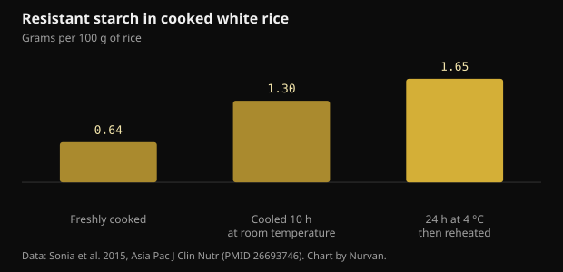
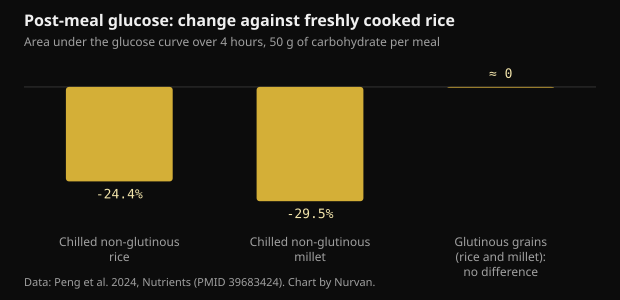

# Cooled rice and resistant starch: how much actually changes

Cook rice, chill it, reheat it the next day: it has become standard advice for blood sugar. The mechanism is real, but the numbers are smaller than the ones going around, and the grain you choose matters more than the fridge.

## The short version

- Cooling cooked white rice raises resistant starch from 0.64 to 1.65 g per 100 g after 24 hours at 4 °C and reheating. The rise is real, but in absolute terms it is about one gram.
- In the same study the glycemic response fell by roughly 18% against freshly cooked rice, in 15 participants.
- It only works with high-amylose grains: in a 2024 trial, chilled non-glutinous rice and millet cut blood glucose by 24-30%, while glutinous varieties showed no difference at all.
- Freshly cooked millet beat its chilled version at the next meal (-39% against fresh rice), and the credit went to slowly digestible starch, not to the trip through the fridge.
- The idea that cooling halves the calories comes from a 2015 conference presentation that was never published as a study, so there is nothing to verify.

## What actually happens as rice cools

Starch in grains is made of two molecules. Amylose is a straight chain; amylopectin is branched. Cooking in water swells the granules and unwinds the chains: that is gelatinisation, and it is what makes starch easy for digestive enzymes to attack.

As the dish cools, some of those chains reorganise into tighter crystalline structures. The process is called retrogradation, and it produces type 3 resistant starch: resistant because enzymes in the small intestine can no longer take it apart completely, so it reaches the colon, where bacteria ferment it into short-chain fatty acids such as butyrate.

Amylose is the part that reorganises best, because straight chains line up easily. That is why the trick works with basmati and other long-grain rice, which are rich in amylose, and not with glutinous rice or very sticky varieties, where branched amylopectin dominates.

A study in healthy adults measured exactly how much. In freshly cooked white rice, resistant starch was 0.64 g per 100 g; after 10 hours at room temperature it rose to 1.30; after 24 hours in the fridge at 4 °C and reheating it reached 1.65.

*Resistant starch in cooked white rice — Data: Sonia et al. 2015, Asia Pac J Clin Nutr (PMID 26693746). Chart by Nurvan.*

Two things to notice. Reheating does not undo the effect: the highest value belongs to the rice that was chilled and then reheated. And the increase, while nearly threefold in relative terms, amounts to about one gram per 100 g of rice.

## How far blood sugar actually drops

In the same study, fifteen healthy adults ate freshly cooked rice and chilled-then-reheated rice in random order. The area under the glucose curve was 125 versus 152 mmol·min/L: about 18% lower, statistically significant but only just.

A 2024 trial in eighteen healthy women made a more useful comparison, because it included different varieties. Each test meal contained 50 g of carbohydrate, and the grains were served either freshly cooked or after 24 hours at 4 °C.

*Post-meal glucose: change against freshly cooked rice — Data: Peng et al. 2024, Nutrients (PMID 39683424). Chart by Nurvan.*

Chilled non-glutinous rice cut the four-hour glucose area by 24.4% against fresh rice, and chilled non-glutinous millet by 29.5%. For the glutinous versions there was no significant difference in either glucose or insulin: chilling them achieved nothing.

The most interesting result comes later. Measuring blood glucose after a standard lunch, freshly cooked non-glutinous millet produced a glucose area 39.1% lower than fresh rice, and the credit went not to resistant starch but to slowly digestible starch, which made up 64.8% of that sample. The chilled version of the same millet did not produce that effect.

In plain terms: choosing the right grain can matter more than managing the temperature of the wrong one.

## The halved-calories myth

The viral version of the advice says something else: that cooking rice with a teaspoon of coconut oil and chilling it cuts up to 60% of the calories you absorb. That number has a specific history. In 2015 a research group in Sri Lanka announced it in a presentation to the American Chemical Society, and the press picked it up widely.

That work was never published as a peer-reviewed study, and no measurement of calorie absorption in humans was made available. A figure announced at a meeting and never published is not a result anyone can check.

There is also an order-of-magnitude problem. If chilling buys you about one gram of resistant starch per 100 g of cooked rice, and resistant starch yields less energy than digestible starch because it is fermented rather than absorbed, the saving on a normal portion stays in the range of a few calories. Not half the plate.

## The doses that matter in resistant starch research

It helps to separate two questions. One is the acute effect on blood glucose after a single meal; the other is the effect on glycemic control over time.

A meta-analysis of nineteen randomised trials found that resistant starch lowers fasting blood glucose modestly (-0.09 mmol/L), and that the effect becomes clearer above 28 g a day of resistant starch or beyond 8 weeks of intake. There was also an improvement in insulin resistance estimated with the HOMA index.

Twenty-eight grams a day is not something cooled rice reaches on its own: you would need almost two kilograms of cooked rice. People who hit those doses do it with isolated resistant starches or with legumes, oats and whole grains, not by reheating leftovers.

Another systematic review, in people with type 2 diabetes or prediabetes, compared resistant starch types and found clear effects for type 1 (locked inside the cell walls of legumes and intact grains) and type 2 (high-amylose), concluding that type 3, the kind that forms on cooling, is still understudied and needs more research. That is exactly the type the viral posts are about.

## Storage: the practical part the posts skip

Cooked rice left at room temperature is one of the foods health authorities are most insistent about, because it can favour the growth of bacteria and their toxins. The glycemic gain here is a few percentage points: not worth earning by leaving a pot out all day.

The sensible practice is the usual one: cool quickly in a shallow container, refrigerate straight away, eat within a few days, and reheat thoroughly until the dish is hot all the way through. The resistant starch that formed survives reheating, so you lose nothing by heating it properly.

## What the research actually says

**Confirmed** — Cooling cooked rice raises resistant starch.

From 0.64 g per 100 g in freshly cooked rice to 1.30 after 10 hours at room temperature and 1.65 after 24 hours in the fridge plus reheating. Nearly threefold in relative terms; about one gram in absolute terms.

**Confirmed** — Chilled and reheated rice lowers the glycemic response.

About 18% less area under the curve than fresh rice in fifteen healthy adults, and 24.4% less over the first four hours in a later trial in eighteen women. A real and modest effect.

**Confirmed** — It only works with the right grains.

In the 2024 trial, chilling lowered blood glucose only in non-glutinous, high-amylose grains. For glutinous rice and millet there was no significant difference in glucose or insulin.

**Not supported** — Cooling rice halves the calories.

The up-to-60% figure comes from a 2015 presentation at an American Chemical Society meeting that was never published as a peer-reviewed study. The measured rise in resistant starch, about one gram per 100 g, cannot shift the calories of a portion on that scale.

**Needs context** — Resistant starch improves glycemic control.

Yes, at the doses used in the studies. The meta-analysis of nineteen trials finds a modest effect on fasting glucose, clearer above 28 g a day or beyond 8 weeks. Cooled rice alone does not come close to those amounts.

**Needs context** — Yesterday's rice beats fresh rice.

It depends on the comparison. At the following meal, freshly cooked non-glutinous millet outperformed its chilled version thanks to slowly digestible starch. The variety you choose weighs as much as the temperature, and sometimes more.

## How to use this

1. If you want to use the trick, use it with basmati, long-grain rice or pasta: these are the high-amylose foods where retrogradation works. With glutinous rice or very sticky varieties nothing changes.
2. Cool quickly in a shallow container, refrigerate straight away, and reheat thoroughly before eating: the resistant starch survives the heat, bacteria do not.
3. Do not count on the fridge to cut calories. The real saving is a few grams of starch per portion, not half a plate.
4. If blood sugar is the goal, pull the big levers first: portion size, fibre, protein and fat in the same meal, and a walk afterwards.
5. To reach resistant starch amounts comparable to the studies, look to legumes, oats, barley and whole grains, not reheated leftovers.
6. Test it on yourself: if you already use a glucose meter for your own reasons, compare the same meal fresh and chilled on different days. Any clinical question, though, belongs with your doctor.

> **See what your meals actually do, not just the theory**  
> In Nurvan you keep a food diary with portions and macros and set it alongside your training, measurements and lab reports. If you work with a coach, they see the same data and can adjust the plan around the meals you really eat rather than the ideal ones. — **Try Nurvan** (https://nurvan.app)

## Frequently asked questions

### Does it work for pasta and potatoes too?

The mechanism is the same and applies to any high-amylose starch, so pasta and firm potatoes are included. The human studies cited here measured rice and millet, so for other foods the principle is plausible but the exact numbers are not these.

### Does reheating destroy the resistant starch?

No. In the 2015 study the highest resistant starch value belonged to the rice chilled for 24 hours and then reheated. Reheating thoroughly is also the safer choice from a food hygiene standpoint.

### How much cooled rice would 28 g of resistant starch take?

At about 1.65 g per 100 g of cooked rice chilled and reheated, you would need almost two kilograms of cooked rice. That is why the doses in long-term studies come from isolated resistant starches or from legumes and whole grains, not from leftovers.

### Do I need coconut oil while cooking?

That is the ingredient from the viral version of the advice, which came from a 2015 conference presentation that was never published as a study. In the peer-reviewed studies cited here, the rice was cooked normally, with no added fat.

## Sources

- Sonia S, Witjaksono F, Ridwan R, 2015. Effect of cooling of cooked white rice on resistant starch content and glycemic response. Asia Pac J Clin Nutr 24(4):620-625. [PMID 26693746](https://pubmed.ncbi.nlm.nih.gov/26693746/) · [DOI 10.6133/apjcn.2015.24.4.13](https://doi.org/10.6133/apjcn.2015.24.4.13)
- Peng X, Fan Z, Wei J et al., 2024. Fresh-cooked but not cold-stored millet exhibited remarkable second meal effect independent of resistant starch: a randomized crossover trial. Nutrients 16(23):4030. [PMID 39683424](https://pubmed.ncbi.nlm.nih.gov/39683424/) · [DOI 10.3390/nu16234030](https://doi.org/10.3390/nu16234030)
- Pugh JE, Cai M, Altieri N, Frost G, 2023. A comparison of the effects of resistant starch types on glycemic response in individuals with type 2 diabetes or prediabetes: a systematic review and meta-analysis. Front Nutr 10:1118229. [PMID 37051127](https://pubmed.ncbi.nlm.nih.gov/37051127/) · [DOI 10.3389/fnut.2023.1118229](https://doi.org/10.3389/fnut.2023.1118229)
- Xiong K, Wang J, Kang T, Xu F, Ma A, 2020. Effects of resistant starch on glycaemic control: a systematic review and meta-analysis. Br J Nutr 125(11):1260-1269. [PMID 32959735](https://pubmed.ncbi.nlm.nih.gov/32959735/) · [DOI 10.1017/S0007114520003700](https://doi.org/10.1017/S0007114520003700)
- Chen Z, Liang N, Zhang H et al., 2024. Resistant starch and the gut microbiome: exploring beneficial interactions and dietary impacts. Food Chem X 21:101118. [PMID 38282825](https://pubmed.ncbi.nlm.nih.gov/38282825/) · [DOI 10.1016/j.fochx.2024.101118](https://doi.org/10.1016/j.fochx.2024.101118)
- Smithsonian Magazine, 2015. *Why would cooling rice make it less caloric?* Report on Sudhair James's presentation to the American Chemical Society: a claimed calorie reduction of up to 60%, announced at a meeting and never published as a peer-reviewed study. https://www.smithsonianmag.com/smart-news/why-would-cooling-rice-make-it-less-caloric-1-180954765/

This article was inspired by a post from [Dr William Wallace (@dr.williamwallace)](https://www.instagram.com/p/DdG7bRRkSUN/). Sources retrieved through PubMed.

> Note: educational content. It does not replace advice from a doctor or qualified professional.
