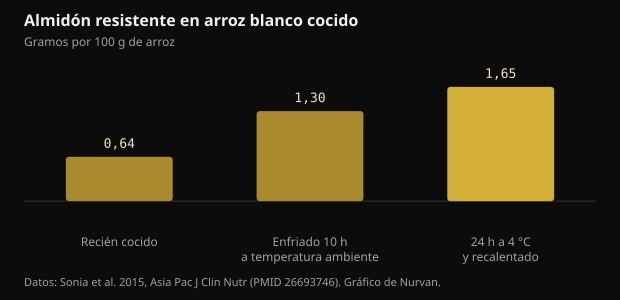
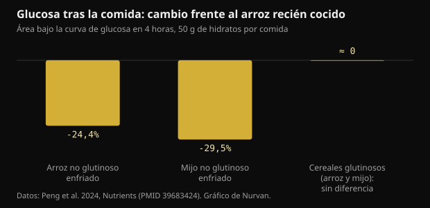

# Arroz enfriado y almidón resistente: cuánto cambia de verdad

Cocer el arroz, meterlo en la nevera y recalentarlo al día siguiente se ha vuelto un consejo de manual para la glucosa. El mecanismo existe, pero las cifras son más pequeñas de lo que circula, y el tipo de grano importa más que el frigorífico.

## En resumen

- Enfriar el arroz blanco cocido aumenta el almidón resistente: de 0,64 a 1,65 g por 100 g tras 24 horas a 4 °C y un recalentado. El aumento es real, pero en términos absolutos es alrededor de un gramo.
- En ese mismo estudio la respuesta glucémica bajó cerca de un 18% frente al arroz recién hecho, con 15 participantes.
- Solo funciona con granos ricos en amilosa: en un ensayo de 2024, el arroz y el mijo no glutinosos enfriados bajaron la glucosa un 24-30%, mientras que las variedades glutinosas no mostraron ninguna diferencia.
- El mijo recién cocido superó a su versión enfriada en la comida siguiente (-39% frente al arroz fresco), y el mérito fue del almidón de digestión lenta, no del paso por la nevera.
- La idea de que enfriar reduce las calorías a la mitad viene de una presentación en un congreso de 2015 que nunca se publicó como estudio: no hay nada que verificar.

## Qué ocurre realmente cuando el arroz se enfría

El almidón de los cereales está hecho de dos moléculas. La amilosa es una cadena lineal; la amilopectina es ramificada. Al cocer en agua los gránulos se hinchan y las cadenas se desenrollan: eso es la gelatinización, y es lo que vuelve al almidón fácil de atacar por las enzimas digestivas.

Cuando el plato se enfría, parte de esas cadenas se reorganiza en estructuras cristalinas más compactas. El proceso se llama retrogradación y produce almidón resistente de tipo 3: resistente porque las enzimas del intestino delgado ya no pueden desmontarlo del todo, así que llega al colon, donde las bacterias lo fermentan y producen ácidos grasos de cadena corta como el butirato.

La amilosa es la parte que mejor se reorganiza, porque las cadenas lineales se alinean con facilidad. Por eso el truco funciona con basmati y otros arroces de grano largo, ricos en amilosa, y no con arroz glutinoso o variedades muy pegajosas, donde domina la amilopectina ramificada.

Un estudio en adultos sanos midió exactamente cuánto. En el arroz blanco recién cocido el almidón resistente era de 0,64 g por 100 g; tras 10 horas a temperatura ambiente subía a 1,30; tras 24 horas en la nevera a 4 °C y un recalentado llegaba a 1,65.

*Almidón resistente en arroz blanco cocido — Datos: Sonia et al. 2015, Asia Pac J Clin Nutr (PMID 26693746). Gráfico de Nurvan.*

Dos cosas que notar. Recalentar no anula el efecto: el valor más alto es justamente el del arroz enfriado y luego recalentado. Y el aumento, casi el triple en términos relativos, equivale a cerca de un gramo por cada 100 g de arroz.

## Cuánto baja la glucosa, en cifras

En ese mismo estudio, quince adultos sanos comieron en orden aleatorio arroz recién hecho y arroz enfriado y recalentado. El área bajo la curva de glucosa fue de 125 frente a 152 mmol·min/L: alrededor de un 18% menos, con una diferencia significativa pero justa.

Un ensayo de 2024 en dieciocho mujeres sanas hizo una comparación más útil, porque incluyó variedades distintas. Cada comida de prueba contenía 50 g de hidratos y los cereales se servían recién cocidos o tras 24 horas a 4 °C.

*Glucosa tras la comida: cambio frente al arroz recién cocido — Datos: Peng et al. 2024, Nutrients (PMID 39683424). Gráfico de Nurvan.*

El arroz no glutinoso enfriado redujo el área glucémica de las primeras cuatro horas un 24,4% frente al arroz fresco, y el mijo no glutinoso enfriado un 29,5%. En las versiones glutinosas no hubo diferencia significativa ni en glucosa ni en insulina: enfriarlas no sirvió de nada.

El resultado más interesante llega después. Al medir la glucosa tras una comida estándar, el mijo no glutinoso recién cocido dio un área glucémica un 39,1% más baja que el arroz fresco, y el mérito no fue del almidón resistente sino del almidón de digestión lenta, que en esa muestra suponía el 64,8% del total. La versión enfriada del mismo mijo no producía ese efecto.

Traducido: elegir el cereal adecuado puede importar más que gestionar la temperatura del equivocado.

## El mito de las calorías a la mitad

La versión viral del consejo dice otra cosa: que cocer el arroz con una cucharadita de aceite de coco y enfriarlo recorta hasta el 60% de las calorías que absorbes. Esa cifra tiene una historia concreta. En 2015 un grupo de Sri Lanka la anunció en una presentación a la American Chemical Society, y la prensa la recogió ampliamente.

Ese trabajo nunca se publicó como estudio con revisión por pares, y no se puso a disposición ninguna medición de la absorción calórica en humanos. Una cifra anunciada en un congreso y nunca publicada no es un resultado que se pueda comprobar.

Hay además un problema de órdenes de magnitud. Si al enfriar ganas alrededor de un gramo de almidón resistente por cada 100 g de arroz cocido, y el almidón resistente aporta menos energía que el digerible porque se fermenta en vez de absorberse, el ahorro en una ración normal se queda en unas pocas calorías. No en medio plato.

## Las dosis que cuentan en los estudios sobre almidón resistente

Conviene separar dos cosas. Una es el efecto agudo sobre la glucosa de una sola comida; otra es el efecto sobre el control glucémico a lo largo del tiempo.

Un metaanálisis de diecinueve ensayos aleatorizados halló que el almidón resistente reduce la glucosa en ayunas de forma contenida (-0,09 mmol/L), y que el efecto se vuelve más claro por encima de 28 g diarios de almidón resistente o más allá de 8 semanas de consumo. También mejoró la resistencia a la insulina estimada con el índice HOMA.

Veintiocho gramos al día no es algo que el arroz enfriado alcance por sí solo: harían falta casi dos kilos de arroz cocido. Quien llega a esas dosis lo hace con almidones resistentes aislados o con legumbres, avena y cereales integrales, no recalentando sobras.

Otra revisión sistemática, en personas con diabetes tipo 2 o prediabetes, comparó los tipos de almidón resistente y encontró efectos claros para el tipo 1 (encerrado en las paredes celulares de legumbres y granos enteros) y el tipo 2 (alto en amilosa), concluyendo que el tipo 3, el que se forma al enfriar, sigue poco estudiado y necesita más investigación. Es justo el tipo del que hablan los posts virales.

## Conservación: la parte práctica que los posts se saltan

El arroz cocido dejado a temperatura ambiente es uno de los alimentos sobre los que más insisten las autoridades sanitarias, porque puede favorecer el crecimiento de bacterias y de sus toxinas. La ganancia glucémica de la que hablamos es de unos pocos puntos porcentuales: no vale la pena conseguirla dejando una olla fuera todo el día.

La práctica sensata es la de siempre: enfriar rápido en un recipiente bajo, meter en la nevera enseguida, consumir en pocos días y recalentar bien hasta que el plato esté caliente en toda su masa. El almidón resistente formado aguanta el recalentado, así que no pierdes nada por calentarlo bien.

## Qué dice realmente la investigación

**Confirmado** — Enfriar el arroz cocido aumenta el almidón resistente.

De 0,64 g por 100 g en el arroz recién hecho a 1,30 tras 10 horas a temperatura ambiente y 1,65 tras 24 horas en la nevera más recalentado. Casi el triple en términos relativos; alrededor de un gramo en términos absolutos.

**Confirmado** — El arroz enfriado y recalentado baja la respuesta glucémica.

Un 18% menos de área bajo la curva que el arroz fresco en quince adultos sanos, y un 24,4% menos en las primeras cuatro horas en un ensayo posterior con dieciocho mujeres. Un efecto real y modesto.

**Confirmado** — Solo funciona con los granos adecuados.

En el ensayo de 2024 el enfriado bajó la glucosa solo en cereales no glutinosos, ricos en amilosa. En arroz y mijo glutinosos no hubo diferencia significativa en glucosa ni en insulina.

**Desmentido** — Enfriar el arroz reduce las calorías a la mitad.

La cifra de hasta el 60% viene de una presentación de 2015 en un congreso de la American Chemical Society que nunca se publicó como estudio revisado por pares. El aumento medido de almidón resistente, alrededor de un gramo por 100 g, no puede mover las calorías de una ración en ese orden.

**Con matices** — El almidón resistente mejora el control glucémico.

Sí, a las dosis de los estudios. El metaanálisis de diecinueve ensayos encuentra un efecto contenido sobre la glucosa en ayunas, más claro por encima de 28 g diarios o más allá de 8 semanas. El arroz enfriado por sí solo no se acerca a esas cantidades.

**Con matices** — El arroz del día anterior es mejor que el fresco.

Depende de la comparación. En la comida siguiente, el mijo no glutinoso recién cocido superó a su versión enfriada gracias al almidón de digestión lenta. La variedad que eliges pesa tanto como la temperatura, y a veces más.

## Cómo aplicarlo

1. Si quieres usar el truco, úsalo con basmati, arroz de grano largo o pasta: son los alimentos ricos en amilosa, donde la retrogradación funciona. Con arroz glutinoso o variedades muy pegajosas no cambia nada.
2. Enfría rápido en un recipiente bajo, mete en la nevera enseguida y recalienta bien antes de comer: el almidón resistente aguanta el calor, las bacterias no.
3. No cuentes con la nevera para recortar calorías. El ahorro real son unos gramos de almidón por ración, no medio plato.
4. Si el objetivo es la glucosa, mueve primero las palancas grandes: tamaño de la ración, fibra, proteína y grasa en la misma comida, y un paseo después.
5. Para llegar a cantidades de almidón resistente comparables a las de los estudios, mira a legumbres, avena, cebada y cereales integrales, no a las sobras recalentadas.
6. Pruébalo contigo: si ya usas un medidor de glucosa por motivos propios, compara la misma comida fresca y enfriada en días distintos. Cualquier cuestión clínica, eso sí, es del médico.

> **Mira qué hacen tus comidas, no solo la teoría**  
> En Nurvan llevas el diario de comidas con raciones y macros y lo pones junto a entrenamientos, medidas e informes de análisis. Si trabajas con un entrenador, ve los mismos datos y puede ajustar el plan sobre las comidas que haces de verdad, no sobre las ideales. — **Prueba Nurvan** (https://nurvan.app)

## Preguntas frecuentes

### ¿Vale también para la pasta y las patatas?

El mecanismo es el mismo y afecta a cualquier almidón rico en amilosa, así que pasta y patatas firmes entran. Los estudios en humanos citados aquí midieron arroz y mijo: para otros alimentos el principio es plausible pero las cifras exactas no son estas.

### ¿Recalentar destruye el almidón resistente?

No. En el estudio de 2015 el valor más alto de almidón resistente era el del arroz enfriado 24 horas y luego recalentado. Recalentar bien es además lo más seguro desde el punto de vista higiénico.

### ¿Cuánto arroz enfriado harían falta para 28 g de almidón resistente?

A unos 1,65 g por 100 g de arroz cocido enfriado y recalentado, harían falta casi dos kilos de arroz cocido. Por eso las dosis de los estudios a largo plazo salen de almidones resistentes aislados o de legumbres y cereales integrales, no de las sobras.

### ¿Hace falta aceite de coco al cocer?

Es el ingrediente de la versión viral del consejo, nacida de una presentación en un congreso de 2015 que nunca se publicó como estudio. En los estudios revisados por pares citados aquí el arroz se coció de forma normal, sin grasa añadida.

## Fuentes

- Sonia S, Witjaksono F, Ridwan R, 2015. Effect of cooling of cooked white rice on resistant starch content and glycemic response. Asia Pac J Clin Nutr 24(4):620-625. [PMID 26693746](https://pubmed.ncbi.nlm.nih.gov/26693746/) · [DOI 10.6133/apjcn.2015.24.4.13](https://doi.org/10.6133/apjcn.2015.24.4.13)
- Peng X, Fan Z, Wei J et al., 2024. Fresh-cooked but not cold-stored millet exhibited remarkable second meal effect independent of resistant starch: a randomized crossover trial. Nutrients 16(23):4030. [PMID 39683424](https://pubmed.ncbi.nlm.nih.gov/39683424/) · [DOI 10.3390/nu16234030](https://doi.org/10.3390/nu16234030)
- Pugh JE, Cai M, Altieri N, Frost G, 2023. A comparison of the effects of resistant starch types on glycemic response in individuals with type 2 diabetes or prediabetes: a systematic review and meta-analysis. Front Nutr 10:1118229. [PMID 37051127](https://pubmed.ncbi.nlm.nih.gov/37051127/) · [DOI 10.3389/fnut.2023.1118229](https://doi.org/10.3389/fnut.2023.1118229)
- Xiong K, Wang J, Kang T, Xu F, Ma A, 2020. Effects of resistant starch on glycaemic control: a systematic review and meta-analysis. Br J Nutr 125(11):1260-1269. [PMID 32959735](https://pubmed.ncbi.nlm.nih.gov/32959735/) · [DOI 10.1017/S0007114520003700](https://doi.org/10.1017/S0007114520003700)
- Chen Z, Liang N, Zhang H et al., 2024. Resistant starch and the gut microbiome: exploring beneficial interactions and dietary impacts. Food Chem X 21:101118. [PMID 38282825](https://pubmed.ncbi.nlm.nih.gov/38282825/) · [DOI 10.1016/j.fochx.2024.101118](https://doi.org/10.1016/j.fochx.2024.101118)
- Smithsonian Magazine, 2015. *Why would cooling rice make it less caloric?* Crónica de la presentación de Sudhair James en la American Chemical Society: una reducción calórica de hasta el 60% anunciada en un congreso y nunca publicada como estudio revisado por pares. https://www.smithsonianmag.com/smart-news/why-would-cooling-rice-make-it-less-caloric-1-180954765/

Artículo inspirado en una publicación de [Dr William Wallace (@dr.williamwallace)](https://www.instagram.com/p/DdG7bRRkSUN/). Fuentes consultadas a través de PubMed.

> Nota: contenido informativo. No sustituye la opinión de un médico o profesional cualificado.
