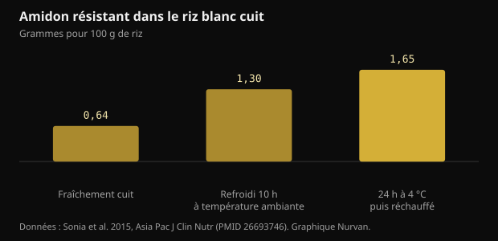
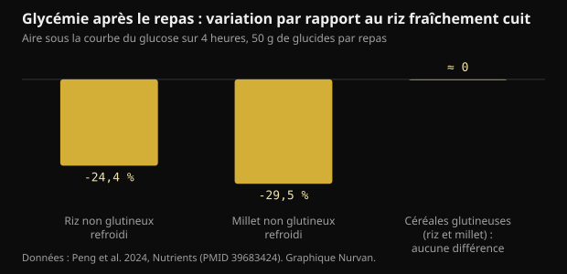

# Riz refroidi et amidon résistant : ce qui change vraiment

Cuire le riz, le mettre au frigo et le réchauffer le lendemain est devenu un conseil de manuel pour la glycémie. Le mécanisme existe, mais les chiffres sont plus petits que ceux qui circulent, et le type de grain compte plus que le réfrigérateur.

## L'essentiel

- Refroidir le riz blanc cuit augmente l'amidon résistant : de 0,64 à 1,65 g pour 100 g après 24 heures à 4 °C et un réchauffage. La hausse est réelle, mais en valeur absolue elle vaut environ un gramme.
- Dans la même étude, la réponse glycémique a baissé d'environ 18 % par rapport au riz fraîchement cuit, chez 15 participants.
- Cela ne marche qu'avec des grains riches en amylose : dans un essai de 2024, le riz et le millet non glutineux refroidis ont abaissé la glycémie de 24 à 30 %, tandis que les variétés glutineuses n'ont montré aucune différence.
- Le millet fraîchement cuit a battu sa version refroidie au repas suivant (-39 % par rapport au riz frais), et le mérite revenait à l'amidon à digestion lente, pas au passage au frigo.
- L'idée que refroidir divise les calories par deux vient d'une communication de congrès de 2015 jamais publiée comme étude : il n'y a rien à vérifier.

## Ce qui se passe vraiment quand le riz refroidit

L'amidon des céréales est fait de deux molécules. L'amylose est une chaîne linéaire, l'amylopectine est ramifiée. À la cuisson dans l'eau, les granules gonflent et les chaînes se déroulent : c'est la gélatinisation, et c'est ce qui rend l'amidon facilement attaquable par les enzymes digestives.

Quand le plat refroidit, une partie de ces chaînes se réorganise en structures cristallines plus compactes. Ce processus s'appelle la rétrogradation et produit de l'amidon résistant de type 3 : résistant parce que les enzymes de l'intestin grêle ne parviennent plus à le démonter entièrement, si bien qu'il atteint le côlon, où les bactéries le fermentent en acides gras à chaîne courte comme le butyrate.

L'amylose est la partie qui se réorganise le mieux, car les chaînes linéaires s'alignent facilement. D'où le fait que l'astuce fonctionne avec le basmati et les autres riz à grain long, riches en amylose, et pas avec le riz gluant ou les variétés très collantes, où domine l'amylopectine ramifiée.

Une étude chez des adultes sains a mesuré précisément combien. Dans le riz blanc fraîchement cuit, l'amidon résistant était de 0,64 g pour 100 g ; après 10 heures à température ambiante il montait à 1,30 ; après 24 heures au réfrigérateur à 4 °C puis réchauffage, il atteignait 1,65.

*Amidon résistant dans le riz blanc cuit — Données : Sonia et al. 2015, Asia Pac J Clin Nutr (PMID 26693746). Graphique Nurvan.*

Deux choses à noter. Le réchauffage n'annule pas l'effet : la valeur la plus haute est justement celle du riz refroidi puis réchauffé. Et l'augmentation, presque triple en relatif, représente environ un gramme pour 100 g de riz.

## De combien la glycémie baisse, en chiffres

Dans la même étude, quinze adultes sains ont mangé dans un ordre aléatoire du riz fraîchement cuit et du riz refroidi puis réchauffé. L'aire sous la courbe de glucose était de 125 contre 152 mmol·min/L : environ 18 % de moins, avec une différence significative mais de justesse.

Un essai de 2024 chez dix-huit femmes en bonne santé a proposé une comparaison plus utile, car il incluait différentes variétés. Chaque repas test contenait 50 g de glucides et les céréales étaient servies fraîchement cuites ou après 24 heures à 4 °C.

*Glycémie après le repas : variation par rapport au riz fraîchement cuit — Données : Peng et al. 2024, Nutrients (PMID 39683424). Graphique Nurvan.*

Le riz non glutineux refroidi a réduit l'aire glycémique des quatre premières heures de 24,4 % par rapport au riz frais, et le millet non glutineux refroidi de 29,5 %. Pour les versions glutineuses, aucune différence significative, ni sur le glucose ni sur l'insuline : les refroidir n'a servi à rien.

Le résultat le plus intéressant vient ensuite. En mesurant la glycémie après un déjeuner standard, le millet non glutineux fraîchement cuit a donné une aire glycémique inférieure de 39,1 % à celle du riz frais, et le mérite revenait non pas à l'amidon résistant mais à l'amidon à digestion lente, qui représentait 64,8 % du total dans cet échantillon. La version refroidie du même millet ne produisait pas cet effet.

Autrement dit : choisir la bonne céréale peut compter davantage que gérer la température de la mauvaise.

## Le mythe des calories divisées par deux

La version virale du conseil dit autre chose : que cuire le riz avec une cuillère à café d'huile de coco et le refroidir supprime jusqu'à 60 % des calories absorbées. Ce chiffre a une histoire précise. En 2015, une équipe du Sri Lanka l'a annoncé lors d'une communication à l'American Chemical Society, largement reprise par la presse.

Ce travail n'a jamais été publié comme étude évaluée par les pairs, et aucune mesure de l'absorption calorique chez l'humain n'a été rendue disponible. Un chiffre annoncé en congrès et jamais publié n'est pas un résultat vérifiable.

Il y a aussi un problème d'ordre de grandeur. Si le refroidissement vous apporte environ un gramme d'amidon résistant pour 100 g de riz cuit, et que l'amidon résistant fournit moins d'énergie que l'amidon digestible parce qu'il est fermenté au lieu d'être absorbé, l'économie sur une portion normale reste de quelques calories. Pas de la moitié de l'assiette.

## Les doses qui comptent dans les études sur l'amidon résistant

Il faut séparer deux questions. L'une est l'effet aigu sur la glycémie d'un seul repas ; l'autre est l'effet sur le contrôle glycémique dans la durée.

Une méta-analyse de dix-neuf essais randomisés a trouvé que l'amidon résistant abaisse modestement la glycémie à jeun (-0,09 mmol/L), et que l'effet devient plus net au-delà de 28 g par jour d'amidon résistant ou au-delà de 8 semaines de prise. Il y avait aussi une amélioration de l'insulinorésistance estimée par l'indice HOMA.

Vingt-huit grammes par jour, le riz refroidi n'y arrive pas seul : il faudrait près de deux kilos de riz cuit. Ceux qui atteignent ces doses le font avec des amidons résistants isolés ou avec des légumineuses, de l'avoine et des céréales complètes, pas en réchauffant des restes.

Une autre revue systématique, chez des personnes avec un diabète de type 2 ou un prédiabète, a comparé les types d'amidon résistant et trouvé des effets nets pour le type 1 (enfermé dans les parois cellulaires des légumineuses et des grains entiers) et le type 2 (riche en amylose), en concluant que le type 3, celui qui se forme au refroidissement, reste peu étudié et demande d'autres travaux. C'est exactement le type dont parlent les publications virales.

## Conservation : la partie pratique que les posts sautent

Le riz cuit laissé à température ambiante est l'un des aliments sur lesquels les autorités sanitaires insistent le plus, car il peut favoriser la croissance de bactéries et de leurs toxines. Le gain glycémique dont on parle est de quelques points de pourcentage : il ne vaut pas la peine de l'obtenir en laissant une casserole dehors toute la journée.

La pratique raisonnable est la même que d'habitude : refroidir vite dans un récipient bas, mettre au réfrigérateur tout de suite, consommer en quelques jours et réchauffer à cœur. L'amidon résistant formé résiste au réchauffage, vous ne perdez donc rien à bien chauffer.

## Ce que dit vraiment la recherche

**Confirmé** — Refroidir le riz cuit augmente l'amidon résistant.

De 0,64 g pour 100 g dans le riz fraîchement cuit à 1,30 après 10 heures à température ambiante et 1,65 après 24 heures au réfrigérateur puis réchauffage. Presque le triple en relatif ; environ un gramme en absolu.

**Confirmé** — Le riz refroidi puis réchauffé abaisse la réponse glycémique.

Environ 18 % d'aire sous la courbe en moins par rapport au riz frais chez quinze adultes sains, et 24,4 % de moins sur les quatre premières heures dans un essai ultérieur chez dix-huit femmes. Un effet réel et modeste.

**Confirmé** — Cela ne marche qu'avec les bons grains.

Dans l'essai de 2024, le refroidissement n'a abaissé la glycémie que pour les céréales non glutineuses, riches en amylose. Pour le riz et le millet glutineux, aucune différence significative, ni sur le glucose ni sur l'insuline.

**Démenti** — Refroidir le riz divise les calories par deux.

Le chiffre allant jusqu'à 60 % vient d'une communication de 2015 à un congrès de l'American Chemical Society, jamais publiée comme étude évaluée par les pairs. La hausse mesurée d'amidon résistant, environ un gramme pour 100 g, ne peut pas déplacer les calories d'une portion à cette échelle.

**À nuancer** — L'amidon résistant améliore le contrôle glycémique.

Oui, aux doses des études. La méta-analyse de dix-neuf essais trouve un effet modeste sur la glycémie à jeun, plus net au-delà de 28 g par jour ou de 8 semaines. Le riz refroidi seul est très loin de ces quantités.

**À nuancer** — Le riz de la veille vaut mieux que le riz frais.

Cela dépend de la comparaison. Au repas suivant, le millet non glutineux fraîchement cuit a fait mieux que sa version refroidie, grâce à l'amidon à digestion lente. La variété choisie pèse autant que la température, parfois plus.

## Comment l'appliquer

1. Si vous voulez utiliser l'astuce, utilisez-la avec du basmati, du riz à grain long ou des pâtes : ce sont les aliments riches en amylose, ceux où la rétrogradation fonctionne. Avec du riz gluant ou des variétés très collantes, rien ne change.
2. Refroidissez vite dans un récipient bas, mettez au réfrigérateur tout de suite et réchauffez à cœur avant de manger : l'amidon résistant supporte la chaleur, les bactéries non.
3. Ne comptez pas sur le réfrigérateur pour réduire les calories. L'économie réelle, c'est quelques grammes d'amidon par portion, pas la moitié de l'assiette.
4. Si l'objectif est la glycémie, actionnez d'abord les grands leviers : taille de la portion, fibres, protéines et lipides au même repas, et une marche après.
5. Pour atteindre des quantités d'amidon résistant comparables à celles des études, regardez du côté des légumineuses, de l'avoine, de l'orge et des céréales complètes, pas des restes réchauffés.
6. Testez sur vous : si vous utilisez déjà un lecteur de glycémie pour vos propres raisons, comparez le même repas frais et refroidi à des jours différents. Toute question clinique, en revanche, relève du médecin.

> **Voyez ce que vos repas font vraiment, pas seulement la théorie**  
> Dans Nurvan, vous tenez le journal alimentaire avec portions et macros et vous le mettez à côté de vos entraînements, de vos mensurations et de vos analyses. Si vous suivez un accompagnement, votre coach voit les mêmes données et peut ajuster le plan sur les repas que vous faites vraiment, pas sur les repas idéaux. — **Essayer Nurvan** (https://nurvan.app)

## Questions fréquentes

### Est-ce que cela vaut aussi pour les pâtes et les pommes de terre ?

Le mécanisme est le même et concerne tout amidon riche en amylose, donc les pâtes et les pommes de terre à chair ferme en font partie. Les études humaines citées ici ont mesuré le riz et le millet : pour les autres aliments, le principe est plausible mais les chiffres exacts ne sont pas ceux-là.

### Réchauffer détruit-il l'amidon résistant ?

Non. Dans l'étude de 2015, la valeur la plus élevée d'amidon résistant était celle du riz refroidi 24 heures puis réchauffé. Bien réchauffer est aussi le choix le plus sûr sur le plan de l'hygiène.

### Combien de riz refroidi pour 28 g d'amidon résistant ?

À environ 1,65 g pour 100 g de riz cuit refroidi puis réchauffé, il faudrait près de deux kilos de riz cuit. C'est pourquoi les doses des études de longue durée viennent d'amidons résistants isolés ou de légumineuses et de céréales complètes, pas des restes.

### Faut-il de l'huile de coco à la cuisson ?

C'est l'ingrédient de la version virale du conseil, née d'une communication de congrès de 2015 jamais publiée comme étude. Dans les études évaluées par les pairs citées ici, le riz a été cuit normalement, sans matière grasse ajoutée.

## Sources

- Sonia S, Witjaksono F, Ridwan R, 2015. Effect of cooling of cooked white rice on resistant starch content and glycemic response. Asia Pac J Clin Nutr 24(4):620-625. [PMID 26693746](https://pubmed.ncbi.nlm.nih.gov/26693746/) · [DOI 10.6133/apjcn.2015.24.4.13](https://doi.org/10.6133/apjcn.2015.24.4.13)
- Peng X, Fan Z, Wei J et al., 2024. Fresh-cooked but not cold-stored millet exhibited remarkable second meal effect independent of resistant starch: a randomized crossover trial. Nutrients 16(23):4030. [PMID 39683424](https://pubmed.ncbi.nlm.nih.gov/39683424/) · [DOI 10.3390/nu16234030](https://doi.org/10.3390/nu16234030)
- Pugh JE, Cai M, Altieri N, Frost G, 2023. A comparison of the effects of resistant starch types on glycemic response in individuals with type 2 diabetes or prediabetes: a systematic review and meta-analysis. Front Nutr 10:1118229. [PMID 37051127](https://pubmed.ncbi.nlm.nih.gov/37051127/) · [DOI 10.3389/fnut.2023.1118229](https://doi.org/10.3389/fnut.2023.1118229)
- Xiong K, Wang J, Kang T, Xu F, Ma A, 2020. Effects of resistant starch on glycaemic control: a systematic review and meta-analysis. Br J Nutr 125(11):1260-1269. [PMID 32959735](https://pubmed.ncbi.nlm.nih.gov/32959735/) · [DOI 10.1017/S0007114520003700](https://doi.org/10.1017/S0007114520003700)
- Chen Z, Liang N, Zhang H et al., 2024. Resistant starch and the gut microbiome: exploring beneficial interactions and dietary impacts. Food Chem X 21:101118. [PMID 38282825](https://pubmed.ncbi.nlm.nih.gov/38282825/) · [DOI 10.1016/j.fochx.2024.101118](https://doi.org/10.1016/j.fochx.2024.101118)
- Smithsonian Magazine, 2015. *Why would cooling rice make it less caloric?* Compte rendu de la communication de Sudhair James à l'American Chemical Society : une réduction calorique allant jusqu'à 60 % annoncée en congrès et jamais publiée comme étude évaluée par les pairs. https://www.smithsonianmag.com/smart-news/why-would-cooling-rice-make-it-less-caloric-1-180954765/

Article inspiré d'une publication de [Dr William Wallace (@dr.williamwallace)](https://www.instagram.com/p/DdG7bRRkSUN/). Sources consultées via PubMed.

> Note : contenu informatif. Il ne remplace pas l'avis d'un médecin ou d'un professionnel qualifié.
