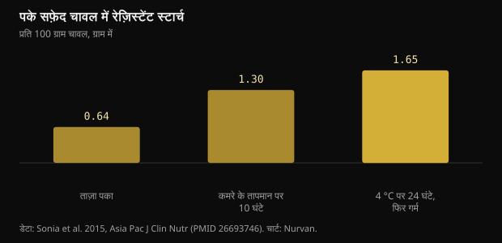
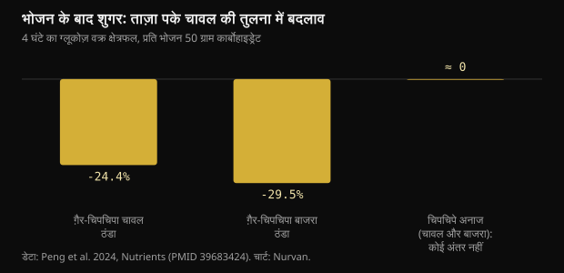

# ठंडा किया चावल और रेज़िस्टेंट स्टार्च: असल में कितना बदलता है

चावल पकाइए, फ्रिज में रखिए, अगले दिन गर्म कीजिए — यह अब ब्लड शुगर की किताबी सलाह बन चुकी है। तंत्र सचमुच मौजूद है, पर आँकड़े उन से छोटे हैं जो घूम रहे हैं, और कौन सा दाना चुनते हैं यह फ्रिज से ज़्यादा मायने रखता है।

## संक्षेप में

- पके सफ़ेद चावल को ठंडा करने से रेज़िस्टेंट स्टार्च बढ़ता है: 4 °C पर 24 घंटे रखने और दोबारा गर्म करने के बाद प्रति 100 ग्राम 0.64 से 1.65 ग्राम। बढ़ोतरी असली है, पर पूर्ण रूप में लगभग एक ग्राम।
- उसी अध्ययन में, ताज़ा पके चावल की तुलना में ग्लाइसेमिक प्रतिक्रिया लगभग 18% घटी, 15 प्रतिभागियों में।
- यह सिर्फ़ उन्हीं दानों में काम करता है जिनमें एमाइलोज़ ज़्यादा हो: 2024 के एक परीक्षण में ठंडे किए ग़ैर-चिपचिपे चावल और बाजरे ने शुगर 24 से 30% घटाई, जबकि चिपचिपी किस्मों में कोई फ़र्क नहीं दिखा।
- अगले भोजन पर ताज़ा पका बाजरा अपनी ठंडी की हुई शक्ल से बेहतर निकला (ताज़े चावल की तुलना में -39%), और श्रेय धीमे पचने वाले स्टार्च को गया, फ्रिज को नहीं।
- ठंडा करने से कैलोरी आधी होने की बात 2015 के एक सम्मेलन व्याख्यान से आई है जो कभी अध्ययन के रूप में प्रकाशित ही नहीं हुआ: जाँचने को कुछ है ही नहीं।

## चावल ठंडा होने पर असल में क्या होता है

अनाज का स्टार्च दो अणुओं से बनता है। एमाइलोज़ सीधी शृंखला है, एमाइलोपेक्टिन शाखादार। पानी में पकाने पर कण फूलते हैं और शृंखलाएँ खुल जाती हैं: यही जिलेटिनीकरण है, और यही स्टार्च को पाचक एंज़ाइमों के लिए आसान बनाता है।

जब व्यंजन ठंडा होता है, उन शृंखलाओं का एक हिस्सा फिर से सघन क्रिस्टलीय ढाँचों में जुड़ जाता है। इस प्रक्रिया को रेट्रोग्रेडेशन कहते हैं और इससे टाइप 3 रेज़िस्टेंट स्टार्च बनता है: प्रतिरोधी इसलिए कि छोटी आँत के एंज़ाइम अब उसे पूरी तरह नहीं तोड़ पाते, सो वह बड़ी आँत तक पहुँचता है जहाँ बैक्टीरिया उसे किण्वित करके ब्यूटिरेट जैसे शॉर्ट-चेन फ़ैटी एसिड बनाते हैं।

एमाइलोज़ वह हिस्सा है जो सबसे अच्छी तरह दोबारा जमता है, क्योंकि सीधी शृंखलाएँ आसानी से पंक्तिबद्ध हो जाती हैं। इसीलिए यह तरकीब बासमती और दूसरे लंबे दाने वाले चावल में काम करती है, जिनमें एमाइलोज़ ज़्यादा है, और चिपचिपे चावल या बहुत लसदार किस्मों में नहीं, जहाँ शाखादार एमाइलोपेक्टिन हावी है।

स्वस्थ वयस्कों पर हुए एक अध्ययन ने ठीक-ठीक मापा। ताज़ा पके सफ़ेद चावल में रेज़िस्टेंट स्टार्च प्रति 100 ग्राम 0.64 ग्राम था; कमरे के तापमान पर 10 घंटे बाद 1.30 हुआ; फ्रिज में 4 °C पर 24 घंटे और दोबारा गर्म करने के बाद 1.65 तक पहुँचा।

*पके सफ़ेद चावल में रेज़िस्टेंट स्टार्च — डेटा: Sonia et al. 2015, Asia Pac J Clin Nutr (PMID 26693746). चार्ट: Nurvan.*

दो बातें ध्यान देने लायक़ हैं। दोबारा गर्म करने से असर ख़त्म नहीं होता: सबसे ऊँचा मान ठंडा करके फिर गर्म किए चावल का ही है। और यह बढ़ोतरी, सापेक्ष रूप में लगभग तिगुनी होने के बावजूद, प्रति 100 ग्राम चावल लगभग एक ग्राम के बराबर है।

## शुगर असल में कितनी गिरती है

उसी अध्ययन में पंद्रह स्वस्थ वयस्कों ने यादृच्छिक क्रम में ताज़ा पका चावल और ठंडा करके गर्म किया चावल खाया। ग्लूकोज़ वक्र के नीचे का क्षेत्रफल 125 बनाम 152 mmol·min/L रहा: लगभग 18% कम, अंतर सांख्यिकीय रूप से सार्थक पर मुश्किल से।

2024 के एक परीक्षण ने अठारह स्वस्थ महिलाओं पर अधिक उपयोगी तुलना की, क्योंकि उसमें अलग-अलग किस्में शामिल थीं। हर परीक्षण भोजन में 50 ग्राम कार्बोहाइड्रेट था, और अनाज या तो ताज़ा पका परोसा गया या 4 °C पर 24 घंटे रखने के बाद।

*भोजन के बाद शुगर: ताज़ा पके चावल की तुलना में बदलाव — डेटा: Peng et al. 2024, Nutrients (PMID 39683424). चार्ट: Nurvan.*

ठंडे किए ग़ैर-चिपचिपे चावल ने पहले चार घंटों का ग्लाइसेमिक क्षेत्रफल ताज़े चावल की तुलना में 24.4% घटाया, और ठंडे किए ग़ैर-चिपचिपे बाजरे ने 29.5%। चिपचिपे संस्करणों में न ग्लूकोज़ में सार्थक अंतर आया न इंसुलिन में: उन्हें ठंडा करना बेकार रहा।

सबसे दिलचस्प नतीजा उसके बाद आता है। एक मानक दोपहर के भोजन के बाद शुगर मापने पर, ताज़ा पके ग़ैर-चिपचिपे बाजरे ने ताज़े चावल से 39.1% कम ग्लाइसेमिक क्षेत्रफल दिया, और श्रेय रेज़िस्टेंट स्टार्च को नहीं बल्कि धीमे पचने वाले स्टार्च को गया, जो उस नमूने में कुल का 64.8% था। उसी बाजरे के ठंडे संस्करण में यह असर नहीं था।

सीधी बात: सही अनाज चुनना, ग़लत अनाज के तापमान को साधने से ज़्यादा मायने रख सकता है।

## आधी कैलोरी वाला मिथक

इस सलाह का वायरल संस्करण कुछ और कहता है: कि एक चम्मच नारियल तेल के साथ चावल पकाकर ठंडा करने से अवशोषित कैलोरी 60% तक घट जाती है। उस आँकड़े का इतिहास तय है। 2015 में श्रीलंका के एक शोध दल ने अमेरिकन केमिकल सोसाइटी के सामने एक व्याख्यान में इसकी घोषणा की थी, और प्रेस ने उसे ख़ूब उठाया।

वह काम कभी समकक्ष-समीक्षित अध्ययन के रूप में प्रकाशित नहीं हुआ, और मनुष्यों में कैलोरी अवशोषण का कोई माप सार्वजनिक नहीं किया गया। सम्मेलन में घोषित और कभी प्रकाशित न हुआ आँकड़ा ऐसा नतीजा नहीं है जिसे कोई जाँच सके।

परिमाण की भी समस्या है। अगर ठंडा करने से आपको प्रति 100 ग्राम पके चावल लगभग एक ग्राम रेज़िस्टेंट स्टार्च मिलता है, और रेज़िस्टेंट स्टार्च पचने वाले स्टार्च से कम ऊर्जा देता है क्योंकि वह अवशोषित होने के बजाय किण्वित होता है, तो एक सामान्य हिस्से पर बचत कुछ कैलोरी के दायरे में ही रहती है। आधी थाली की नहीं।

## रेज़िस्टेंट स्टार्च के शोध में जो मात्राएँ मायने रखती हैं

यहाँ दो बातें अलग रखना ठीक है। एक है एक भोजन के बाद शुगर पर तात्कालिक असर; दूसरी है समय के साथ शुगर नियंत्रण पर असर।

उन्नीस यादृच्छिक परीक्षणों के एक मेटा-विश्लेषण ने पाया कि रेज़िस्टेंट स्टार्च खाली पेट की शुगर को सीमित रूप से घटाता है (-0.09 mmol/L), और असर रोज़ 28 ग्राम से ऊपर या 8 हफ़्ते से लंबे सेवन पर अधिक स्पष्ट होता है। HOMA सूचकांक से आँकी गई इंसुलिन प्रतिरोधकता में भी सुधार दिखा।

रोज़ अट्ठाईस ग्राम तक ठंडा चावल अकेले नहीं पहुँचता: इसके लिए लगभग दो किलो पका चावल चाहिए। जो लोग उन मात्राओं तक पहुँचते हैं वे अलग किए गए रेज़िस्टेंट स्टार्च या दालों, जई और साबुत अनाज से पहुँचते हैं, बचे हुए चावल गर्म करके नहीं।

टाइप 2 मधुमेह या प्री-डायबिटीज़ वाले लोगों पर एक अन्य व्यवस्थित समीक्षा ने रेज़िस्टेंट स्टार्च के प्रकारों की तुलना की और टाइप 1 (दालों और साबुत दानों की कोशिका भित्तियों में बंद) तथा टाइप 2 (उच्च एमाइलोज़) के लिए स्पष्ट असर पाया, यह निष्कर्ष देते हुए कि ठंडा करने पर बनने वाला टाइप 3 अब भी कम अध्ययनित है और और शोध माँगता है। वायरल पोस्ट ठीक इसी प्रकार की बात करती हैं।

## भंडारण: व्यावहारिक हिस्सा जिसे पोस्ट छोड़ देती हैं

कमरे के तापमान पर छोड़ा गया पका चावल उन खाद्य पदार्थों में है जिन पर स्वास्थ्य अधिकारी सबसे ज़्यादा ज़ोर देते हैं, क्योंकि वह बैक्टीरिया और उनके विषों की वृद्धि को बढ़ावा दे सकता है। यहाँ जिस ग्लाइसेमिक लाभ की बात है वह कुछ प्रतिशत अंकों का है: उसे पूरे दिन भगोना बाहर रखकर कमाना ठीक नहीं।

समझदारी भरा तरीक़ा वही पुराना है: चौड़े बर्तन में जल्दी ठंडा करें, तुरंत फ्रिज में रखें, कुछ दिनों में खा लें और अच्छी तरह, पूरे भीतर तक गर्म करें। बना हुआ रेज़िस्टेंट स्टार्च गर्मी झेल लेता है, इसलिए अच्छी तरह गर्म करने में कुछ नहीं जाता।

## शोध वास्तव में क्या कहता है

**पुष्ट** — पके चावल को ठंडा करने से रेज़िस्टेंट स्टार्च बढ़ता है।

ताज़ा पके चावल में प्रति 100 ग्राम 0.64 ग्राम से, कमरे के तापमान पर 10 घंटे बाद 1.30 और फ्रिज में 24 घंटे तथा दोबारा गर्म करने के बाद 1.65। सापेक्ष रूप में लगभग तिगुना; पूर्ण रूप में लगभग एक ग्राम।

**पुष्ट** — ठंडा करके गर्म किया चावल ग्लाइसेमिक प्रतिक्रिया घटाता है।

पंद्रह स्वस्थ वयस्कों में ताज़े चावल से लगभग 18% कम वक्र-क्षेत्रफल, और अठारह महिलाओं पर बाद के परीक्षण में पहले चार घंटों में 24.4% कम। असर असली और मामूली है।

**पुष्ट** — यह सिर्फ़ सही दानों के साथ काम करता है।

2024 के परीक्षण में ठंडा करने से शुगर सिर्फ़ ग़ैर-चिपचिपे, उच्च-एमाइलोज़ अनाजों में घटी। चिपचिपे चावल और बाजरे में ग्लूकोज़ या इंसुलिन में कोई सार्थक अंतर नहीं था।

**ग़लत** — चावल ठंडा करने से कैलोरी आधी हो जाती है।

60% तक का आँकड़ा अमेरिकन केमिकल सोसाइटी की 2015 की एक बैठक के व्याख्यान से आता है, जो कभी समकक्ष-समीक्षित अध्ययन के रूप में प्रकाशित नहीं हुआ। मापी गई वृद्धि, प्रति 100 ग्राम लगभग एक ग्राम, एक हिस्से की कैलोरी को उस पैमाने पर नहीं बदल सकती।

**संदर्भ चाहिए** — रेज़िस्टेंट स्टार्च शुगर नियंत्रण सुधारता है।

हाँ, अध्ययनों की मात्राओं पर। उन्नीस परीक्षणों का मेटा-विश्लेषण खाली पेट की शुगर पर सीमित असर पाता है, जो रोज़ 28 ग्राम से ऊपर या 8 हफ़्ते से आगे अधिक स्पष्ट है। अकेला ठंडा चावल उन मात्राओं के पास भी नहीं पहुँचता।

**संदर्भ चाहिए** — कल का चावल ताज़े से बेहतर है।

यह तुलना पर निर्भर है। अगले भोजन पर ताज़ा पका ग़ैर-चिपचिपा बाजरा धीमे पचने वाले स्टार्च के कारण अपनी ठंडी शक्ल से बेहतर रहा। आप जो किस्म चुनते हैं वह तापमान जितनी, और कभी-कभी उससे ज़्यादा, भारी पड़ती है।

## इसे कैसे अपनाएँ

1. तरकीब आज़मानी है तो बासमती, लंबे दाने वाले चावल या पास्ता पर आज़माइए: ये उच्च-एमाइलोज़ खाद्य हैं जहाँ रेट्रोग्रेडेशन काम करता है। चिपचिपे चावल या बहुत लसदार किस्मों में कुछ नहीं बदलता।
2. चौड़े बर्तन में जल्दी ठंडा कीजिए, तुरंत फ्रिज में रखिए और खाने से पहले अच्छी तरह गर्म कीजिए: रेज़िस्टेंट स्टार्च गर्मी झेल लेता है, बैक्टीरिया नहीं।
3. कैलोरी घटाने के लिए फ्रिज पर भरोसा मत कीजिए। असली बचत एक हिस्से में कुछ ग्राम स्टार्च की है, आधी थाली की नहीं।
4. अगर लक्ष्य ब्लड शुगर है तो पहले बड़े लीवर खींचिए: हिस्से का आकार, उसी भोजन में फ़ाइबर, प्रोटीन और वसा, और खाने के बाद टहलना।
5. अध्ययनों जैसी रेज़िस्टेंट स्टार्च मात्रा तक पहुँचना है तो दालों, जई, जौ और साबुत अनाज की तरफ़ देखिए, गर्म किए बचे खाने की तरफ़ नहीं।
6. अपने ऊपर परखिए: अगर आप अपनी वजहों से पहले से ग्लूकोज़ मीटर इस्तेमाल करते हैं तो अलग-अलग दिनों में वही भोजन ताज़ा और ठंडा करके तुलना कीजिए। कोई भी नैदानिक सवाल, हालाँकि, डॉक्टर का है।

> **देखिए आपका खाना सच में क्या करता है, सिर्फ़ सिद्धांत नहीं**  
> Nurvan में आप हिस्सों और मैक्रो के साथ भोजन डायरी रखते हैं और उसे ट्रेनिंग, माप और जाँच रिपोर्ट के साथ रखते हैं। अगर आप किसी कोच के साथ काम करते हैं तो वह वही आँकड़े देखता है और योजना को उन भोजनों पर ढाल सकता है जो आप सचमुच खाते हैं, आदर्श वाले नहीं। — **Nurvan आज़माएँ** (https://nurvan.app)

## अक्सर पूछे जाने वाले प्रश्न

### क्या यह पास्ता और आलू पर भी लागू होता है?

तंत्र वही है और हर उच्च-एमाइलोज़ स्टार्च पर लागू होता है, सो पास्ता और कसे हुए आलू शामिल हैं। यहाँ उद्धृत मानव अध्ययनों ने चावल और बाजरा मापा: दूसरे खाद्यों के लिए सिद्धांत मान्य लगता है पर सटीक आँकड़े ये नहीं हैं।

### दोबारा गर्म करने से रेज़िस्टेंट स्टार्च नष्ट हो जाता है?

नहीं। 2015 के अध्ययन में रेज़िस्टेंट स्टार्च का सबसे ऊँचा मान 24 घंटे ठंडे किए और फिर गर्म किए चावल का ही था। अच्छी तरह गर्म करना खाद्य सुरक्षा की दृष्टि से भी सुरक्षित विकल्प है।

### 28 ग्राम रेज़िस्टेंट स्टार्च के लिए कितना ठंडा चावल चाहिए?

ठंडे और दोबारा गर्म किए पके चावल में लगभग 1.65 ग्राम प्रति 100 ग्राम के हिसाब से लगभग दो किलो पका चावल चाहिए। इसीलिए दीर्घकालिक अध्ययनों की मात्राएँ अलग किए गए रेज़िस्टेंट स्टार्च या दालों और साबुत अनाज से आती हैं, बचे खाने से नहीं।

### पकाते समय नारियल तेल ज़रूरी है?

यह सलाह के वायरल संस्करण की सामग्री है, जो 2015 के एक सम्मेलन व्याख्यान से निकली और कभी अध्ययन के रूप में प्रकाशित नहीं हुई। यहाँ उद्धृत समकक्ष-समीक्षित अध्ययनों में चावल सामान्य ढंग से पकाया गया, बिना अतिरिक्त वसा के।

## स्रोत

- Sonia S, Witjaksono F, Ridwan R, 2015. Effect of cooling of cooked white rice on resistant starch content and glycemic response. Asia Pac J Clin Nutr 24(4):620-625. [PMID 26693746](https://pubmed.ncbi.nlm.nih.gov/26693746/) · [DOI 10.6133/apjcn.2015.24.4.13](https://doi.org/10.6133/apjcn.2015.24.4.13)
- Peng X, Fan Z, Wei J et al., 2024. Fresh-cooked but not cold-stored millet exhibited remarkable second meal effect independent of resistant starch: a randomized crossover trial. Nutrients 16(23):4030. [PMID 39683424](https://pubmed.ncbi.nlm.nih.gov/39683424/) · [DOI 10.3390/nu16234030](https://doi.org/10.3390/nu16234030)
- Pugh JE, Cai M, Altieri N, Frost G, 2023. A comparison of the effects of resistant starch types on glycemic response in individuals with type 2 diabetes or prediabetes: a systematic review and meta-analysis. Front Nutr 10:1118229. [PMID 37051127](https://pubmed.ncbi.nlm.nih.gov/37051127/) · [DOI 10.3389/fnut.2023.1118229](https://doi.org/10.3389/fnut.2023.1118229)
- Xiong K, Wang J, Kang T, Xu F, Ma A, 2020. Effects of resistant starch on glycaemic control: a systematic review and meta-analysis. Br J Nutr 125(11):1260-1269. [PMID 32959735](https://pubmed.ncbi.nlm.nih.gov/32959735/) · [DOI 10.1017/S0007114520003700](https://doi.org/10.1017/S0007114520003700)
- Chen Z, Liang N, Zhang H et al., 2024. Resistant starch and the gut microbiome: exploring beneficial interactions and dietary impacts. Food Chem X 21:101118. [PMID 38282825](https://pubmed.ncbi.nlm.nih.gov/38282825/) · [DOI 10.1016/j.fochx.2024.101118](https://doi.org/10.1016/j.fochx.2024.101118)
- Smithsonian Magazine, 2015. *Why would cooling rice make it less caloric?* अमेरिकन केमिकल सोसाइटी में Sudhair James के व्याख्यान की रिपोर्ट: 60% तक कैलोरी घटने का दावा, जो एक सम्मेलन में घोषित हुआ और कभी समकक्ष-समीक्षित अध्ययन के रूप में प्रकाशित नहीं हुआ। https://www.smithsonianmag.com/smart-news/why-would-cooling-rice-make-it-less-caloric-1-180954765/

यह लेख [Dr William Wallace (@dr.williamwallace)](https://www.instagram.com/p/DdG7bRRkSUN/) की एक पोस्ट से प्रेरित है। स्रोत PubMed से लिए गए।

> नोट: यह जानकारीपरक सामग्री है। यह डॉक्टर या योग्य पेशेवर की सलाह का विकल्प नहीं है।
