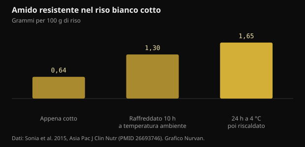
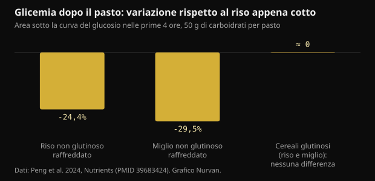

# Riso raffreddato e amido resistente: quanto cambia davvero

Cuocere il riso, metterlo in frigo e riscaldarlo il giorno dopo è diventato un consiglio da manuale per la glicemia. Il meccanismo esiste davvero, ma i numeri sono più piccoli di come circolano, e il tipo di chicco conta più del frigorifero.

## In breve

- Raffreddare il riso bianco cotto aumenta l'amido resistente: da 0,64 a 1,65 g per 100 g dopo 24 ore a 4 °C e un riscaldamento. È un aumento reale, ma in valore assoluto resta circa un grammo.
- Nello stesso studio la risposta glicemica è scesa di circa il 18% rispetto al riso appena cotto, con 15 partecipanti.
- Funziona solo con i chicchi ricchi di amilosio: in un trial del 2024 riso e miglio non glutinosi raffreddati hanno abbassato la glicemia del 24-30%, mentre per le varietà glutinose non c'era alcuna differenza.
- Il miglio appena cotto ha battuto quello raffreddato sul pasto successivo (-39% rispetto al riso fresco): il merito era dell'amido a digestione lenta, non del passaggio in frigo.
- L'idea che raffreddare dimezzi le calorie nasce da una presentazione a un congresso del 2015 mai pubblicata come studio: non è un risultato verificabile.

## Cosa succede davvero quando il riso si raffredda

L'amido dei cereali è fatto di due molecole. L'amilosio è una catena lineare, l'amilopectina è ramificata. Con la cottura in acqua i granuli si gonfiano e le catene si srotolano: è la gelatinizzazione, ed è ciò che rende l'amido facilmente attaccabile dagli enzimi digestivi.

Quando il piatto si raffredda, una parte di quelle catene si riorganizza in strutture cristalline più compatte. Questo processo si chiama retrogradazione e produce l'amido resistente di tipo 3: resistente perché gli enzimi dell'intestino tenue non riescono più a smontarlo del tutto, così arriva al colon, dove i batteri lo fermentano producendo acidi grassi a catena corta come il butirrato.

L'amilosio è la parte che si riorganizza meglio, perché le catene lineari si allineano con facilità. Ecco perché la cosa funziona con basmati e altri chicchi lunghi, ricchi di amilosio, e non con riso glutinoso o varietà molto collose, dove prevale l'amilopectina ramificata.

Uno studio su adulti sani ha misurato esattamente quanto. Nel riso bianco appena cotto l'amido resistente era 0,64 g per 100 g; dopo 10 ore a temperatura ambiente saliva a 1,30; dopo 24 ore in frigorifero a 4 °C e un riscaldamento arrivava a 1,65.

*Amido resistente nel riso bianco cotto — Dati: Sonia et al. 2015, Asia Pac J Clin Nutr (PMID 26693746). Grafico Nurvan.*

Due cose da notare. Il riscaldamento non annulla l'effetto: il valore più alto è proprio quello del riso raffreddato e poi riscaldato. E l'aumento, pur essendo quasi triplo in termini relativi, vale circa un grammo ogni 100 g di riso.

## Quanto scende la glicemia, in numeri

Nello stesso studio, quindici adulti sani hanno mangiato in ordine casuale il riso appena cotto e quello raffreddato e riscaldato. L'area sotto la curva glicemica è stata di 125 contro 152 mmol·min/L: circa il 18% in meno, con una differenza statisticamente significativa ma al limite.

Un trial del 2024 su diciotto donne sane ha fatto un confronto più utile, perché ha incluso varietà diverse. Ogni pasto di prova conteneva 50 g di carboidrati, i cereali venivano serviti appena cotti oppure dopo 24 ore a 4 °C.

*Glicemia dopo il pasto: variazione rispetto al riso appena cotto — Dati: Peng et al. 2024, Nutrients (PMID 39683424). Grafico Nurvan.*

Il riso non glutinoso raffreddato ha ridotto l'area glicemica delle prime quattro ore del 24,4% rispetto al riso fresco, e il miglio non glutinoso raffreddato del 29,5%. Per le versioni glutinose, invece, nessuna differenza significativa né sulla glicemia né sull'insulina: raffreddarle non è servito a niente.

Il risultato più interessante arriva dopo. Misurando la glicemia dopo un pranzo standard, il miglio non glutinoso appena cotto ha dato un'area glicemica più bassa del 39,1% rispetto al riso fresco, e il merito non era dell'amido resistente ma dell'amido a digestione lenta, che in quel campione rappresentava il 64,8% del totale. La versione raffreddata dello stesso miglio quell'effetto non ce l'aveva.

Tradotto: scegliere il cereale giusto può contare più che gestire la temperatura di quello sbagliato.

## Il mito delle calorie dimezzate

La versione virale del consiglio dice un'altra cosa: che cuocere il riso con un cucchiaino di olio di cocco e raffreddarlo tagli fino al 60% delle calorie assorbite. Quel numero ha una storia precisa. Nel 2015 un gruppo di ricerca dello Sri Lanka lo ha annunciato in una presentazione all'American Chemical Society, ripresa da molte testate.

Quella ricerca non è mai stata pubblicata come studio sottoposto a revisione tra pari, e nessuna misurazione dell'assorbimento calorico nell'uomo è stata resa disponibile. Un dato annunciato in conferenza e mai pubblicato non è un risultato che si possa verificare.

C'è anche un problema di ordini di grandezza. Se raffreddando guadagni circa un grammo di amido resistente ogni 100 g di riso cotto, e l'amido resistente fornisce meno energia dell'amido digeribile perché viene fermentato invece che assorbito, il risparmio su una porzione normale resta nell'ordine di poche calorie. Non di metà piatto.

## Le dosi che contano negli studi sull'amido resistente

Qui conviene separare due discorsi. Un conto è l'effetto acuto sulla glicemia di un singolo pasto, un conto è l'effetto sul controllo glicemico nel tempo.

Una meta-analisi su diciannove studi randomizzati ha trovato che l'amido resistente riduce la glicemia a digiuno in misura contenuta (-0,09 mmol/L), e che l'effetto diventa più chiaro sopra i 28 g al giorno di amido resistente o oltre le 8 settimane di assunzione. C'era anche un miglioramento della resistenza insulinica stimata con l'indice HOMA.

Ventotto grammi al giorno sono una quantità che il riso raffreddato, da solo, non raggiunge: servirebbero quasi due chili di riso cotto. Chi vuole arrivare a quelle dosi lo fa con amidi resistenti isolati o con legumi, avena e cereali integrali, non riscaldando gli avanzi.

Un'altra revisione sistematica, su persone con diabete di tipo 2 o prediabete, ha confrontato i diversi tipi di amido resistente e ha trovato effetti chiari per il tipo 1 (racchiuso nelle pareti cellulari di legumi e chicchi interi) e per il tipo 2 (ad alto amilosio), concludendo che proprio il tipo 3, quello che si forma raffreddando, è ancora poco studiato e richiede altra ricerca. È esattamente il tipo di cui parlano i post virali.

## Conservazione: la parte pratica che i post saltano

Il riso cotto lasciato a temperatura ambiente è uno degli alimenti su cui le autorità sanitarie insistono di più, perché può favorire la crescita di batteri e delle loro tossine. Il guadagno glicemico di cui parliamo è di pochi punti percentuali: non vale la pena ottenerlo lasciando una pentola fuori tutto il giorno.

La pratica sensata è quella di sempre: raffreddare in fretta in un contenitore basso, mettere subito in frigorifero, consumare entro pochi giorni e riscaldare bene fino a quando il piatto è caldo in tutta la massa. L'amido resistente che si è formato resiste al riscaldamento, quindi non perdi nulla a scaldare bene.

## Cosa dice davvero la ricerca

**Confermato** — Raffreddare il riso cotto aumenta l'amido resistente.

Da 0,64 g per 100 g nel riso appena cotto a 1,30 dopo 10 ore a temperatura ambiente e 1,65 dopo 24 ore in frigorifero più riscaldamento. In termini relativi è quasi il triplo; in termini assoluti è circa un grammo.

**Confermato** — Il riso raffreddato e riscaldato abbassa la risposta glicemica.

Circa il 18% in meno nell'area sotto la curva rispetto al riso fresco in quindici adulti sani, e il 24,4% in meno nelle prime quattro ore in un trial successivo su diciotto donne. È un effetto reale e modesto.

**Confermato** — Funziona solo con i chicchi giusti.

Nel trial del 2024 il raffreddamento ha ridotto la glicemia solo nei cereali non glutinosi, ricchi di amilosio. Per riso e miglio glutinosi non c'è stata alcuna differenza significativa, né sulla glicemia né sull'insulina.

**Smentito** — Raffreddare il riso dimezza le calorie.

La cifra fino al 60% viene da una presentazione del 2015 a un congresso dell'American Chemical Society, mai pubblicata come studio con revisione tra pari. L'aumento misurato di amido resistente, circa un grammo ogni 100 g, non può spostare le calorie di una porzione in quell'ordine di grandezza.

**Da precisare** — L'amido resistente migliora il controllo della glicemia.

Sì, ma alle dosi degli studi. La meta-analisi su diciannove trial trova un effetto contenuto sulla glicemia a digiuno, più chiaro sopra i 28 g al giorno o oltre le 8 settimane. Il riso raffreddato da solo non arriva neanche vicino a quelle quantità.

**Da precisare** — Il riso del giorno prima è meglio di quello fresco.

Dipende dal confronto. Sul pasto successivo, il miglio non glutinoso appena cotto ha fatto meglio della sua versione raffreddata, grazie all'amido a digestione lenta. La varietà che scegli pesa quanto, e a volte più, della temperatura.

## Come applicarlo

1. Se vuoi usare il trucco, usalo con basmati, riso a chicco lungo o pasta: sono gli alimenti con più amilosio, quelli in cui la retrogradazione funziona. Con riso glutinoso o varietà molto collose non cambia nulla.
2. Raffredda in fretta in un contenitore basso, metti in frigorifero subito e riscalda bene prima di mangiare: l'amido resistente formato resiste al calore, i batteri no.
3. Non contare sul frigorifero per tagliare le calorie. Il risparmio reale è di pochi grammi di amido su una porzione, non di metà piatto.
4. Se l'obiettivo è la glicemia, lavora prima sulle leve grandi: quantità della porzione, presenza di fibre, proteine e grassi nello stesso pasto, e una camminata dopo mangiato.
5. Per arrivare a quantità di amido resistente paragonabili a quelle degli studi, guarda a legumi, avena, orzo e cereali integrali, non agli avanzi riscaldati.
6. Prova su di te: se usi un misuratore di glicemia per motivi tuoi, confronta lo stesso pasto fresco e raffreddato in giorni diversi. Qualunque questione clinica, però, va discussa con il medico.

> **Vedi l'effetto dei tuoi pasti, non solo le teorie**  
> In Nurvan tieni il diario alimentare con porzioni e macronutrienti e lo affianchi ad allenamenti, misure e referti. Se segui un percorso con un coach, vede gli stessi dati e può sistemare il piano sui pasti che mangi davvero, non su quelli ideali. — **Prova Nurvan** (https://nurvan.app)

## Domande frequenti

### Vale anche per la pasta e le patate?

Il meccanismo è lo stesso e riguarda tutti gli amidi ricchi di amilosio, quindi anche pasta e patate a pasta soda. Gli studi sull'uomo citati qui hanno misurato riso e miglio: per gli altri alimenti il principio è plausibile ma i numeri precisi non sono quelli.

### Riscaldare il riso annulla l'amido resistente?

No. Nello studio del 2015 il valore più alto di amido resistente era proprio quello del riso raffreddato 24 ore e poi riscaldato. Riscaldare bene è anche la scelta più sicura dal punto di vista igienico.

### Quanto riso raffreddato servirebbe per 28 g di amido resistente?

Con circa 1,65 g per 100 g di riso cotto raffreddato e riscaldato, servirebbero quasi due chili di riso cotto. È il motivo per cui le dosi degli studi a lungo termine si ottengono con amidi resistenti isolati o con legumi e cereali integrali, non con gli avanzi.

### Serve l'olio di cocco in cottura?

È l'ingrediente della versione virale del consiglio, nata da una presentazione a un congresso del 2015 mai pubblicata come studio. Negli studi sottoposti a revisione tra pari che abbiamo citato il riso è stato cotto in modo normale, senza aggiunta di grassi.

## Fonti

- Sonia S, Witjaksono F, Ridwan R, 2015. Effect of cooling of cooked white rice on resistant starch content and glycemic response. Asia Pac J Clin Nutr 24(4):620-625. [PMID 26693746](https://pubmed.ncbi.nlm.nih.gov/26693746/) · [DOI 10.6133/apjcn.2015.24.4.13](https://doi.org/10.6133/apjcn.2015.24.4.13)
- Peng X, Fan Z, Wei J et al., 2024. Fresh-cooked but not cold-stored millet exhibited remarkable second meal effect independent of resistant starch: a randomized crossover trial. Nutrients 16(23):4030. [PMID 39683424](https://pubmed.ncbi.nlm.nih.gov/39683424/) · [DOI 10.3390/nu16234030](https://doi.org/10.3390/nu16234030)
- Pugh JE, Cai M, Altieri N, Frost G, 2023. A comparison of the effects of resistant starch types on glycemic response in individuals with type 2 diabetes or prediabetes: a systematic review and meta-analysis. Front Nutr 10:1118229. [PMID 37051127](https://pubmed.ncbi.nlm.nih.gov/37051127/) · [DOI 10.3389/fnut.2023.1118229](https://doi.org/10.3389/fnut.2023.1118229)
- Xiong K, Wang J, Kang T, Xu F, Ma A, 2020. Effects of resistant starch on glycaemic control: a systematic review and meta-analysis. Br J Nutr 125(11):1260-1269. [PMID 32959735](https://pubmed.ncbi.nlm.nih.gov/32959735/) · [DOI 10.1017/S0007114520003700](https://doi.org/10.1017/S0007114520003700)
- Chen Z, Liang N, Zhang H et al., 2024. Resistant starch and the gut microbiome: exploring beneficial interactions and dietary impacts. Food Chem X 21:101118. [PMID 38282825](https://pubmed.ncbi.nlm.nih.gov/38282825/) · [DOI 10.1016/j.fochx.2024.101118](https://doi.org/10.1016/j.fochx.2024.101118)
- Smithsonian Magazine, 2015. *Why would cooling rice make it less caloric?* Resoconto della presentazione di Sudhair James all'American Chemical Society: riduzione calorica fino al 60% annunciata in conferenza e mai pubblicata come studio sottoposto a revisione tra pari. https://www.smithsonianmag.com/smart-news/why-would-cooling-rice-make-it-less-caloric-1-180954765/

Articolo ispirato a un post di [Dr William Wallace (@dr.williamwallace)](https://www.instagram.com/p/DdG7bRRkSUN/). Fonti consultate tramite PubMed.

> Nota: contenuto informativo, non sostituisce il parere di un medico o di un professionista qualificato.
