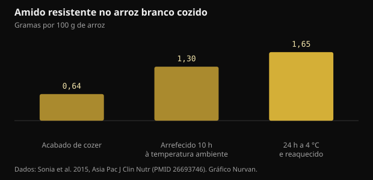
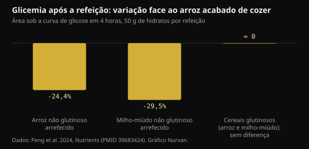

# Arroz arrefecido e amido resistente: o que muda de facto

Cozer o arroz, pô-lo no frigorífico e aquecê-lo no dia seguinte tornou-se conselho de manual para a glicemia. O mecanismo existe, mas os números são mais pequenos do que os que circulam, e o tipo de grão conta mais do que o frigorífico.

## Em resumo

- Arrefecer o arroz branco cozido aumenta o amido resistente: de 0,64 para 1,65 g por 100 g após 24 horas a 4 °C e um reaquecimento. O aumento é real, mas em valor absoluto é cerca de um grama.
- No mesmo estudo a resposta glicémica desceu cerca de 18% face ao arroz acabado de cozer, com 15 participantes.
- Só funciona com grãos ricos em amilose: num ensaio de 2024, arroz e milho-miúdo não glutinosos arrefecidos baixaram a glicemia em 24 a 30%, enquanto as variedades glutinosas não mostraram diferença nenhuma.
- O milho-miúdo acabado de cozer superou a sua versão arrefecida na refeição seguinte (-39% face ao arroz fresco), e o mérito foi do amido de digestão lenta, não da passagem pelo frigorífico.
- A ideia de que arrefecer corta as calorias para metade vem de uma apresentação num congresso de 2015 que nunca foi publicada como estudo: não há nada para verificar.

## O que acontece mesmo quando o arroz arrefece

O amido dos cereais é feito de duas moléculas. A amilose é uma cadeia linear, a amilopectina é ramificada. Ao cozer em água os grânulos incham e as cadeias desenrolam-se: é a gelatinização, e é o que torna o amido fácil de atacar pelas enzimas digestivas.

Quando o prato arrefece, parte dessas cadeias reorganiza-se em estruturas cristalinas mais compactas. O processo chama-se retrogradação e produz amido resistente do tipo 3: resistente porque as enzimas do intestino delgado já não conseguem desmontá-lo por completo, pelo que chega ao cólon, onde as bactérias o fermentam produzindo ácidos gordos de cadeia curta como o butirato.

A amilose é a parte que melhor se reorganiza, porque as cadeias lineares alinham-se com facilidade. Daí o truque funcionar com basmati e outros arroces de grão longo, ricos em amilose, e não com arroz glutinoso ou variedades muito pegajosas, onde domina a amilopectina ramificada.

Um estudo em adultos saudáveis mediu exatamente quanto. No arroz branco acabado de cozer o amido resistente era de 0,64 g por 100 g; após 10 horas à temperatura ambiente subia para 1,30; após 24 horas no frigorífico a 4 °C e um reaquecimento chegava a 1,65.

*Amido resistente no arroz branco cozido — Dados: Sonia et al. 2015, Asia Pac J Clin Nutr (PMID 26693746). Gráfico Nurvan.*

Duas coisas a reter. O reaquecimento não anula o efeito: o valor mais alto é precisamente o do arroz arrefecido e depois aquecido. E o aumento, quase o triplo em termos relativos, vale cerca de um grama por cada 100 g de arroz.

## Quanto desce a glicemia, em números

No mesmo estudo, quinze adultos saudáveis comeram por ordem aleatória arroz acabado de cozer e arroz arrefecido e reaquecido. A área sob a curva de glicose foi de 125 contra 152 mmol·min/L: cerca de 18% menos, com diferença significativa mas por pouco.

Um ensaio de 2024 com dezoito mulheres saudáveis fez uma comparação mais útil, porque incluiu variedades diferentes. Cada refeição de teste tinha 50 g de hidratos e os cereais eram servidos acabados de cozer ou após 24 horas a 4 °C.

*Glicemia após a refeição: variação face ao arroz acabado de cozer — Dados: Peng et al. 2024, Nutrients (PMID 39683424). Gráfico Nurvan.*

O arroz não glutinoso arrefecido reduziu a área glicémica das primeiras quatro horas em 24,4% face ao arroz fresco, e o milho-miúdo não glutinoso arrefecido em 29,5%. Nas versões glutinosas não houve diferença significativa nem na glicose nem na insulina: arrefecê-las não serviu de nada.

O resultado mais interessante vem depois. Ao medir a glicemia após um almoço padrão, o milho-miúdo não glutinoso acabado de cozer deu uma área glicémica 39,1% mais baixa do que o arroz fresco, e o mérito não foi do amido resistente mas do amido de digestão lenta, que naquela amostra representava 64,8% do total. A versão arrefecida do mesmo cereal não produzia esse efeito.

Traduzido: escolher o cereal certo pode contar mais do que gerir a temperatura do errado.

## O mito das calorias a metade

A versão viral do conselho diz outra coisa: que cozer o arroz com uma colher de chá de óleo de coco e arrefecê-lo corta até 60% das calorias absorvidas. Esse número tem uma história concreta. Em 2015 um grupo do Sri Lanka anunciou-o numa apresentação à American Chemical Society, e a imprensa pegou nele por todo o lado.

Esse trabalho nunca foi publicado como estudo com revisão por pares, e nenhuma medição da absorção calórica em humanos foi disponibilizada. Um número anunciado num congresso e nunca publicado não é um resultado que se possa verificar.

Há ainda um problema de ordens de grandeza. Se ao arrefecer ganhas cerca de um grama de amido resistente por cada 100 g de arroz cozido, e o amido resistente fornece menos energia do que o digerível porque é fermentado em vez de absorvido, a poupança numa dose normal fica na ordem de poucas calorias. Não de meio prato.

## As doses que contam nos estudos sobre amido resistente

Convém separar duas coisas. Uma é o efeito agudo na glicemia de uma única refeição; outra é o efeito no controlo glicémico ao longo do tempo.

Uma meta-análise de dezanove ensaios aleatorizados concluiu que o amido resistente reduz a glicemia em jejum de forma contida (-0,09 mmol/L), e que o efeito fica mais claro acima de 28 g por dia de amido resistente ou para lá de 8 semanas de consumo. Também houve melhoria da resistência à insulina estimada pelo índice HOMA.

Vinte e oito gramas por dia não é algo que o arroz arrefecido alcance sozinho: seriam precisos quase dois quilos de arroz cozido. Quem chega a essas doses fá-lo com amidos resistentes isolados ou com leguminosas, aveia e cereais integrais, não a aquecer sobras.

Outra revisão sistemática, em pessoas com diabetes tipo 2 ou pré-diabetes, comparou os tipos de amido resistente e encontrou efeitos claros para o tipo 1 (fechado nas paredes celulares de leguminosas e grãos inteiros) e o tipo 2 (rico em amilose), concluindo que o tipo 3, o que se forma ao arrefecer, continua pouco estudado e precisa de mais investigação. É exatamente o tipo de que falam as publicações virais.

## Conservação: a parte prática que as publicações saltam

O arroz cozido deixado à temperatura ambiente é um dos alimentos em que as autoridades de saúde mais insistem, porque pode favorecer o crescimento de bactérias e das suas toxinas. O ganho glicémico de que falamos é de poucos pontos percentuais: não vale a pena obtê-lo deixando uma panela de fora o dia todo.

A prática sensata é a de sempre: arrefecer depressa num recipiente baixo, pôr no frigorífico de imediato, consumir em poucos dias e aquecer bem até o prato estar quente em toda a massa. O amido resistente formado aguenta o aquecimento, por isso não perdes nada em aquecer bem.

## O que a investigação diz mesmo

**Confirmado** — Arrefecer o arroz cozido aumenta o amido resistente.

De 0,64 g por 100 g no arroz acabado de cozer para 1,30 após 10 horas à temperatura ambiente e 1,65 após 24 horas no frigorífico mais reaquecimento. Quase o triplo em termos relativos; cerca de um grama em termos absolutos.

**Confirmado** — O arroz arrefecido e reaquecido baixa a resposta glicémica.

Cerca de 18% menos área sob a curva do que o arroz fresco em quinze adultos saudáveis, e 24,4% menos nas primeiras quatro horas num ensaio posterior com dezoito mulheres. Um efeito real e modesto.

**Confirmado** — Só funciona com os grãos certos.

No ensaio de 2024 o arrefecimento baixou a glicemia apenas nos cereais não glutinosos, ricos em amilose. No arroz e no milho-miúdo glutinosos não houve diferença significativa na glicose nem na insulina.

**Desmentido** — Arrefecer o arroz corta as calorias para metade.

O número de até 60% vem de uma apresentação de 2015 num congresso da American Chemical Society que nunca foi publicada como estudo revisto por pares. O aumento medido de amido resistente, cerca de um grama por 100 g, não consegue mover as calorias de uma dose nessa ordem de grandeza.

**A precisar** — O amido resistente melhora o controlo glicémico.

Sim, nas doses dos estudos. A meta-análise de dezanove ensaios encontra um efeito contido na glicemia em jejum, mais claro acima de 28 g por dia ou para lá de 8 semanas. O arroz arrefecido sozinho nem se aproxima dessas quantidades.

**A precisar** — O arroz do dia anterior é melhor do que o fresco.

Depende da comparação. Na refeição seguinte, o milho-miúdo não glutinoso acabado de cozer foi melhor do que a sua versão arrefecida, graças ao amido de digestão lenta. A variedade que escolhes pesa tanto como a temperatura, e às vezes mais.

## Como aplicar

1. Se queres usar o truque, usa-o com basmati, arroz de grão longo ou massa: são os alimentos ricos em amilose, aqueles em que a retrogradação funciona. Com arroz glutinoso ou variedades muito pegajosas não muda nada.
2. Arrefece depressa num recipiente baixo, põe no frigorífico de imediato e aquece bem antes de comer: o amido resistente aguenta o calor, as bactérias não.
3. Não contes com o frigorífico para cortar calorias. A poupança real são uns gramas de amido por dose, não meio prato.
4. Se o objetivo é a glicemia, mexe primeiro nas alavancas grandes: tamanho da dose, fibra, proteína e gordura na mesma refeição, e uma caminhada a seguir.
5. Para chegar a quantidades de amido resistente comparáveis às dos estudos, olha para leguminosas, aveia, cevada e cereais integrais, não para as sobras aquecidas.
6. Testa em ti: se já usas um medidor de glicose por razões tuas, compara a mesma refeição fresca e arrefecida em dias diferentes. Qualquer questão clínica, essa, é para o médico.

> **Vê o que as tuas refeições fazem, não só a teoria**  
> No Nurvan manténs o diário alimentar com doses e macronutrientes e colocas tudo ao lado dos treinos, das medidas e dos relatórios de análises. Se trabalhas com um treinador, ele vê os mesmos dados e pode ajustar o plano às refeições que fazes mesmo, não às ideais. — **Experimentar o Nurvan** (https://nurvan.app)

## Perguntas frequentes

### Também vale para a massa e as batatas?

O mecanismo é o mesmo e abrange qualquer amido rico em amilose, por isso massa e batatas de polpa firme entram. Os estudos em humanos aqui citados mediram arroz e milho-miúdo: para outros alimentos o princípio é plausível mas os números exatos não são estes.

### Aquecer destrói o amido resistente?

Não. No estudo de 2015 o valor mais alto de amido resistente era o do arroz arrefecido 24 horas e depois aquecido. Aquecer bem é também a escolha mais segura do ponto de vista higiénico.

### Quanto arroz arrefecido daria 28 g de amido resistente?

A cerca de 1,65 g por 100 g de arroz cozido arrefecido e reaquecido, seriam precisos quase dois quilos de arroz cozido. É por isso que as doses dos estudos de longo prazo vêm de amidos resistentes isolados ou de leguminosas e cereais integrais, não das sobras.

### É preciso óleo de coco na cozedura?

É o ingrediente da versão viral do conselho, nascida de uma apresentação num congresso de 2015 que nunca foi publicada como estudo. Nos estudos revistos por pares aqui citados o arroz foi cozido de forma normal, sem gordura adicionada.

## Fontes

- Sonia S, Witjaksono F, Ridwan R, 2015. Effect of cooling of cooked white rice on resistant starch content and glycemic response. Asia Pac J Clin Nutr 24(4):620-625. [PMID 26693746](https://pubmed.ncbi.nlm.nih.gov/26693746/) · [DOI 10.6133/apjcn.2015.24.4.13](https://doi.org/10.6133/apjcn.2015.24.4.13)
- Peng X, Fan Z, Wei J et al., 2024. Fresh-cooked but not cold-stored millet exhibited remarkable second meal effect independent of resistant starch: a randomized crossover trial. Nutrients 16(23):4030. [PMID 39683424](https://pubmed.ncbi.nlm.nih.gov/39683424/) · [DOI 10.3390/nu16234030](https://doi.org/10.3390/nu16234030)
- Pugh JE, Cai M, Altieri N, Frost G, 2023. A comparison of the effects of resistant starch types on glycemic response in individuals with type 2 diabetes or prediabetes: a systematic review and meta-analysis. Front Nutr 10:1118229. [PMID 37051127](https://pubmed.ncbi.nlm.nih.gov/37051127/) · [DOI 10.3389/fnut.2023.1118229](https://doi.org/10.3389/fnut.2023.1118229)
- Xiong K, Wang J, Kang T, Xu F, Ma A, 2020. Effects of resistant starch on glycaemic control: a systematic review and meta-analysis. Br J Nutr 125(11):1260-1269. [PMID 32959735](https://pubmed.ncbi.nlm.nih.gov/32959735/) · [DOI 10.1017/S0007114520003700](https://doi.org/10.1017/S0007114520003700)
- Chen Z, Liang N, Zhang H et al., 2024. Resistant starch and the gut microbiome: exploring beneficial interactions and dietary impacts. Food Chem X 21:101118. [PMID 38282825](https://pubmed.ncbi.nlm.nih.gov/38282825/) · [DOI 10.1016/j.fochx.2024.101118](https://doi.org/10.1016/j.fochx.2024.101118)
- Smithsonian Magazine, 2015. *Why would cooling rice make it less caloric?* Relato da apresentação de Sudhair James na American Chemical Society: uma redução calórica de até 60% anunciada num congresso e nunca publicada como estudo revisto por pares. https://www.smithsonianmag.com/smart-news/why-would-cooling-rice-make-it-less-caloric-1-180954765/

Artigo inspirado numa publicação de [Dr William Wallace (@dr.williamwallace)](https://www.instagram.com/p/DdG7bRRkSUN/). Fontes consultadas através da PubMed.

> Nota: conteúdo informativo. Não substitui a opinião de um médico ou profissional qualificado.
