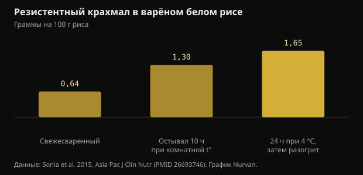
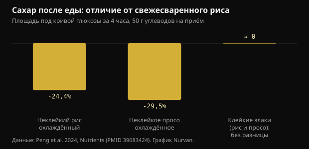

# Охлаждённый рис и резистентный крахмал: что меняется на самом деле

Сварить рис, убрать в холодильник и разогреть на следующий день стало стандартным советом про сахар крови. Механизм действительно существует, но цифры меньше тех, что гуляют по сети, а сорт зерна важнее холодильника.

## Коротко

- Охлаждение варёного белого риса повышает резистентный крахмал: с 0,64 до 1,65 г на 100 г после 24 часов при 4 °C и разогрева. Прирост реальный, но в абсолютных цифрах это около грамма.
- В том же исследовании гликемический ответ оказался примерно на 18% ниже, чем у свежесваренного риса, у 15 участников.
- Работает только с зерном, богатым амилозой: в исследовании 2024 года охлаждённые неклейкие рис и просо снизили сахар крови на 24-30%, а клейкие сорта не дали никакой разницы.
- Свежесваренное просо обошло охлаждённое на следующем приёме пищи (-39% по сравнению со свежим рисом), и заслуга была у медленно перевариваемого крахмала, а не у холодильника.
- Мысль, что охлаждение вдвое снижает калорийность, идёт от доклада на конференции 2015 года, который так и не был опубликован как исследование: проверять нечего.

## Что на самом деле происходит при остывании

Крахмал злаков состоит из двух молекул. Амилоза — линейная цепь, амилопектин — разветвлённая. При варке в воде гранулы набухают, а цепи разворачиваются: это клейстеризация, и именно она делает крахмал лёгкой добычей для пищеварительных ферментов.

Когда блюдо остывает, часть этих цепей перестраивается в более плотные кристаллические структуры. Процесс называется ретроградацией и даёт резистентный крахмал третьего типа: резистентный потому, что ферменты тонкой кишки уже не могут разобрать его полностью, и он доходит до толстой кишки, где бактерии сбраживают его до короткоцепочечных жирных кислот, в том числе бутирата.

Лучше всего перестраивается амилоза, потому что линейные цепи легко выстраиваются в ряд. Поэтому приём работает с басмати и другим длиннозёрным рисом, богатым амилозой, и не работает с клейким рисом и очень липкими сортами, где преобладает разветвлённый амилопектин.

Исследование на здоровых взрослых измерило, насколько именно. В свежесваренном белом рисе резистентного крахмала было 0,64 г на 100 г; через 10 часов при комнатной температуре — 1,30; после 24 часов в холодильнике при 4 °C и разогрева — 1,65.

*Резистентный крахмал в варёном белом рисе — Данные: Sonia et al. 2015, Asia Pac J Clin Nutr (PMID 26693746). График Nurvan.*

Два наблюдения. Разогрев не отменяет эффект: самое высокое значение как раз у охлаждённого, а затем разогретого риса. И прирост, относительно почти тройной, равен примерно грамму на 100 г риса.

## Насколько ниже сахар, в цифрах

В том же исследовании пятнадцать здоровых взрослых в случайном порядке ели свежесваренный рис и охлаждённый с разогревом. Площадь под кривой глюкозы составила 125 против 152 ммоль·мин/л: примерно на 18% меньше, разница статистически значима, но на грани.

Исследование 2024 года на восемнадцати здоровых женщинах дало более полезное сравнение, потому что включало разные сорта. Каждый тестовый приём пищи содержал 50 г углеводов, зерно подавали свежесваренным или после 24 часов при 4 °C.

*Сахар после еды: отличие от свежесваренного риса — Данные: Peng et al. 2024, Nutrients (PMID 39683424). График Nurvan.*

Охлаждённый неклейкий рис снизил гликемическую площадь первых четырёх часов на 24,4% по сравнению со свежим рисом, а охлаждённое неклейкое просо — на 29,5%. У клейких вариантов значимой разницы не было ни по глюкозе, ни по инсулину: охлаждать их оказалось бесполезно.

Самое интересное дальше. При измерении сахара после стандартного обеда свежесваренное неклейкое просо дало гликемическую площадь на 39,1% ниже, чем свежий рис, и заслуга была не у резистентного крахмала, а у медленно перевариваемого, который в этом образце составлял 64,8% от общего. Охлаждённая версия того же проса такого эффекта не давала.

Иначе говоря: выбрать правильную крупу может быть важнее, чем управлять температурой неправильной.

## Миф о половине калорий

Вирусная версия совета говорит другое: что если сварить рис с чайной ложкой кокосового масла и охладить, усвоится до 60% меньше калорий. У этой цифры есть конкретная история. В 2015 году исследовательская группа из Шри-Ланки объявила её в докладе на съезде Американского химического общества, и пресса разнесла её широко.

Эта работа так и не была опубликована как рецензируемое исследование, и никаких измерений усвоения калорий у людей не было представлено. Цифра, объявленная на конференции и не опубликованная, не является результатом, который можно проверить.

Есть и проблема порядка величин. Если охлаждение даёт примерно грамм резистентного крахмала на 100 г варёного риса, а резистентный крахмал несёт меньше энергии, чем перевариваемый, потому что сбраживается, а не всасывается, то экономия на обычной порции остаётся в пределах нескольких килокалорий. Не половины тарелки.

## Какие дозы важны в исследованиях резистентного крахмала

Здесь стоит разделить два вопроса. Один — острый эффект на сахар после одного приёма пищи. Другой — влияние на гликемический контроль со временем.

Метаанализ девятнадцати рандомизированных исследований показал, что резистентный крахмал снижает глюкозу натощак умеренно (-0,09 ммоль/л) и что эффект становится яснее при более чем 28 г в день резистентного крахмала или при приёме дольше 8 недель. Улучшалась и инсулинорезистентность, оценённая индексом HOMA.

Двадцать восемь граммов в день охлаждённый рис сам по себе не даёт: понадобилось бы почти два килограмма варёного риса. Те, кто выходит на такие дозы, делают это изолированными резистентными крахмалами либо бобовыми, овсом и цельными злаками, а не разогретыми остатками.

Другой систематический обзор, у людей с диабетом 2 типа или предиабетом, сравнил типы резистентного крахмала и нашёл ясные эффекты для типа 1 (заключённого в клеточных стенках бобовых и цельного зерна) и типа 2 (с высоким содержанием амилозы), заключив, что именно тип 3, который образуется при охлаждении, изучен пока слабо и требует новых работ. Это ровно тот тип, о котором говорят вирусные посты.

## Хранение: практическая часть, которую посты пропускают

Варёный рис, оставленный при комнатной температуре, — один из продуктов, о которых санитарные службы напоминают чаще всего, потому что он может способствовать росту бактерий и их токсинов. Гликемический выигрыш здесь — несколько процентных пунктов: не стоит добывать его, оставляя кастрюлю на весь день.

Разумная практика обычная: быстро остудить в невысокой посуде, сразу убрать в холодильник, съесть за несколько дней и хорошо прогреть до горячего во всей толще. Образовавшийся резистентный крахмал разогрев переносит, так что от хорошего прогрева вы ничего не теряете.

## Что говорят исследования на самом деле

**Подтверждено** — Охлаждение варёного риса повышает резистентный крахмал.

С 0,64 г на 100 г в свежесваренном рисе до 1,30 после 10 часов при комнатной температуре и 1,65 после 24 часов в холодильнике и разогрева. Относительно это почти втрое, абсолютно — около грамма.

**Подтверждено** — Охлаждённый и разогретый рис снижает гликемический ответ.

Примерно на 18% меньше площадь под кривой, чем у свежего риса, у пятнадцати здоровых взрослых, и на 24,4% меньше за первые четыре часа в более позднем исследовании у восемнадцати женщин. Эффект реальный и скромный.

**Подтверждено** — Работает только с подходящим зерном.

В исследовании 2024 года охлаждение снижало сахар только у неклейких злаков, богатых амилозой. У клейких риса и проса значимой разницы не было ни по глюкозе, ни по инсулину.

**Опровергнуто** — Охлаждение риса вдвое снижает калорийность.

Цифра «до 60%» идёт из доклада 2015 года на съезде Американского химического общества, который никогда не был опубликован как рецензируемое исследование. Измеренный прирост резистентного крахмала, около грамма на 100 г, не может сдвинуть калорийность порции в таком масштабе.

**С оговорками** — Резистентный крахмал улучшает гликемический контроль.

Да, в дозах, которые использовались в исследованиях. Метаанализ девятнадцати работ находит умеренный эффект на глюкозу натощак, заметнее при более чем 28 г в день или дольше 8 недель. Охлаждённый рис сам по себе и близко не даёт таких количеств.

**С оговорками** — Вчерашний рис лучше свежего.

Зависит от сравнения. На следующем приёме пищи свежесваренное неклейкое просо обошло свою охлаждённую версию благодаря медленно перевариваемому крахмалу. Выбор сорта весит столько же, сколько температура, а иногда больше.

## Как это применить

1. Если хотите пользоваться приёмом, применяйте его к басмати, длиннозёрному рису или пасте: это продукты с высоким содержанием амилозы, где ретроградация работает. С клейким рисом и очень липкими сортами не изменится ничего.
2. Остужайте быстро в невысокой посуде, сразу убирайте в холодильник и хорошо прогревайте перед едой: резистентный крахмал жар переносит, бактерии — нет.
3. Не рассчитывайте на холодильник ради калорий. Реальная экономия — несколько граммов крахмала на порцию, а не половина тарелки.
4. Если цель — сахар крови, сначала используйте большие рычаги: размер порции, клетчатка, белок и жир в том же приёме пищи и прогулка после еды.
5. Чтобы выйти на количества резистентного крахмала, сопоставимые с исследованиями, смотрите на бобовые, овёс, ячмень и цельные злаки, а не на разогретые остатки.
6. Проверьте на себе: если вы по своим причинам уже пользуетесь глюкометром, сравните одно и то же блюдо свежим и охлаждённым в разные дни. Любой клинический вопрос при этом — к врачу.

> **Смотрите, что делают ваши приёмы пищи, а не только теорию**  
> В Nurvan вы ведёте дневник питания с порциями и макронутриентами и держите его рядом с тренировками, замерами и результатами анализов. Если вы работаете с тренером, он видит те же данные и может подстроить план под те приёмы пищи, которые вы действительно едите, а не под идеальные. — **Попробовать Nurvan** (https://nurvan.app)

## Частые вопросы

### Это работает и для пасты с картофелем?

Механизм тот же и касается любого крахмала, богатого амилозой, так что паста и плотный картофель входят. Приведённые здесь исследования на людях измеряли рис и просо: для других продуктов принцип правдоподобен, но точные цифры уже не эти.

### Разогрев разрушает резистентный крахмал?

Нет. В исследовании 2015 года самое высокое значение резистентного крахмала было как раз у риса, охлаждённого 24 часа и затем разогретого. Хороший прогрев к тому же безопаснее с гигиенической точки зрения.

### Сколько охлаждённого риса нужно для 28 г резистентного крахмала?

При примерно 1,65 г на 100 г варёного охлаждённого и разогретого риса понадобилось бы почти два килограмма варёного риса. Поэтому дозы долгосрочных исследований набирают изолированными резистентными крахмалами либо бобовыми и цельными злаками, а не остатками.

### Нужно ли кокосовое масло при варке?

Это ингредиент из вирусной версии совета, выросшей из доклада на конференции 2015 года, который так и не стал исследованием. В приведённых здесь рецензируемых работах рис варили обычным способом, без добавления жира.

## Источники

- Sonia S, Witjaksono F, Ridwan R, 2015. Effect of cooling of cooked white rice on resistant starch content and glycemic response. Asia Pac J Clin Nutr 24(4):620-625. [PMID 26693746](https://pubmed.ncbi.nlm.nih.gov/26693746/) · [DOI 10.6133/apjcn.2015.24.4.13](https://doi.org/10.6133/apjcn.2015.24.4.13)
- Peng X, Fan Z, Wei J et al., 2024. Fresh-cooked but not cold-stored millet exhibited remarkable second meal effect independent of resistant starch: a randomized crossover trial. Nutrients 16(23):4030. [PMID 39683424](https://pubmed.ncbi.nlm.nih.gov/39683424/) · [DOI 10.3390/nu16234030](https://doi.org/10.3390/nu16234030)
- Pugh JE, Cai M, Altieri N, Frost G, 2023. A comparison of the effects of resistant starch types on glycemic response in individuals with type 2 diabetes or prediabetes: a systematic review and meta-analysis. Front Nutr 10:1118229. [PMID 37051127](https://pubmed.ncbi.nlm.nih.gov/37051127/) · [DOI 10.3389/fnut.2023.1118229](https://doi.org/10.3389/fnut.2023.1118229)
- Xiong K, Wang J, Kang T, Xu F, Ma A, 2020. Effects of resistant starch on glycaemic control: a systematic review and meta-analysis. Br J Nutr 125(11):1260-1269. [PMID 32959735](https://pubmed.ncbi.nlm.nih.gov/32959735/) · [DOI 10.1017/S0007114520003700](https://doi.org/10.1017/S0007114520003700)
- Chen Z, Liang N, Zhang H et al., 2024. Resistant starch and the gut microbiome: exploring beneficial interactions and dietary impacts. Food Chem X 21:101118. [PMID 38282825](https://pubmed.ncbi.nlm.nih.gov/38282825/) · [DOI 10.1016/j.fochx.2024.101118](https://doi.org/10.1016/j.fochx.2024.101118)
- Smithsonian Magazine, 2015. *Why would cooling rice make it less caloric?* Изложение доклада Судхаира Джеймса в Американском химическом обществе: снижение калорийности до 60%, объявленное на конференции и никогда не опубликованное как рецензируемое исследование. https://www.smithsonianmag.com/smart-news/why-would-cooling-rice-make-it-less-caloric-1-180954765/

Статья написана под впечатлением от публикации [Dr William Wallace (@dr.williamwallace)](https://www.instagram.com/p/DdG7bRRkSUN/). Источники найдены через PubMed.

> Примечание: информационный материал. Он не заменяет консультацию врача или квалифицированного специалиста.
