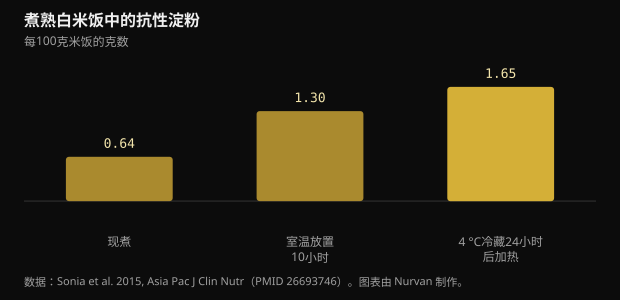
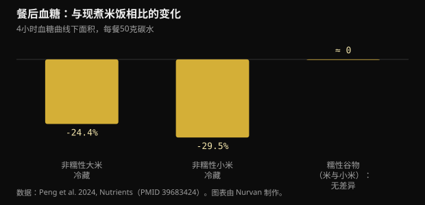

# 冷藏米饭与抗性淀粉：到底改变了多少

把米饭煮好、放冰箱、第二天加热，已经成了控血糖的标准建议。这个机制确实存在，但数字比流传的小得多，而且选哪种米比放不放冰箱更重要。

## 速览

- 把煮熟的白米饭放凉会提高抗性淀粉：在4 °C下冷藏24小时并重新加热后，从每100克0.64克升到1.65克。增幅是真的，但绝对量只有大约1克。
- 同一项研究中，与现煮米饭相比，血糖反应下降约18%，受试者15人。
- 只有直链淀粉含量高的谷物才有效：2024年的一项试验中，冷藏的非糯性大米和小米把血糖降低了24%至30%，而糯性品种完全没有差别。
- 在下一餐上，现煮小米反而胜过它的冷藏版本（比现煮大米低39%），功劳属于慢消化淀粉，而不是冰箱。
- “放凉能把热量减半”的说法来自2015年一场会议报告，从未作为研究发表：没有可核查的东西。

## 米饭变凉时究竟发生了什么

谷物中的淀粉由两种分子组成。直链淀粉是线性链，支链淀粉是分枝状的。在水中加热时颗粒膨胀、链条展开，这就是糊化，也正是它让淀粉容易被消化酶攻击。

当这盘饭冷下来，一部分链条会重新排列成更紧密的结晶结构。这个过程叫回生，产生的是3型抗性淀粉：之所以“抗性”，是因为小肠里的酶再也无法把它完全拆解，于是它进入结肠，被细菌发酵成丁酸等短链脂肪酸。

重新排列得最好的是直链淀粉，因为线性链容易彼此对齐。这就是为什么这个办法对巴斯马蒂和其他直链淀粉多的长粒米有效，而对糯米或很黏的品种无效，因为那里占主导的是分枝的支链淀粉。

一项针对健康成年人的研究测出了具体数值。现煮白米饭的抗性淀粉是每100克0.64克；室温放置10小时后升到1.30；在4 °C冰箱放24小时再加热后达到1.65。

*煮熟白米饭中的抗性淀粉 — 数据：Sonia et al. 2015, Asia Pac J Clin Nutr（PMID 26693746）。图表由 Nurvan 制作。*

有两点值得注意。加热并不会抵消这个效果：最高值恰恰属于冷藏后又加热的米饭。而这个增幅虽然相对接近三倍，折算下来大约是每100克米饭多出1克。

## 血糖到底降了多少

同一项研究中，十五名健康成年人以随机顺序吃了现煮米饭和冷藏后加热的米饭。血糖曲线下面积为125对152 mmol·min/L：低了约18%，统计上显著，但只是刚刚够。

2024年针对十八名健康女性的试验做了更有价值的比较，因为它纳入了不同品种。每份测试餐含50克碳水，谷物或者现煮，或者在4 °C下放置24小时后供应。

*餐后血糖：与现煮米饭相比的变化 — 数据：Peng et al. 2024, Nutrients（PMID 39683424）。图表由 Nurvan 制作。*

冷藏的非糯性大米使前四小时的血糖面积比现煮大米低24.4%，冷藏的非糯性小米低29.5%。而糯性版本无论血糖还是胰岛素都没有显著差异：把它们放凉毫无作用。

最有意思的结果在后面。吃过一顿标准午餐后再测血糖，现煮的非糯性小米给出的血糖面积比现煮大米低39.1%，功劳不在抗性淀粉，而在慢消化淀粉，它在该样品中占总量的64.8%。同一种小米的冷藏版本则没有这种效果。

换句话说：选对谷物，可能比摆弄错误谷物的温度更重要。

## 热量减半的谣言

流传版本说的是另一回事：用一茶匙椰子油煮米饭再放凉，能减少多达60%被吸收的热量。这个数字有明确的来历。2015年，斯里兰卡的一个研究小组在美国化学会的一场报告中宣布了它，媒体广泛转载。

那项工作从未作为同行评议研究发表，也没有公开任何关于人体热量吸收的测量。一个在会议上宣布、从未发表的数字，不是任何人能够核查的结果。

还有一个数量级问题。如果放凉让你每100克熟米饭多得到约1克抗性淀粉，而抗性淀粉因为被发酵而非吸收，提供的能量低于可消化淀粉，那么一份正常米饭上节省的热量只有几千卡的量级，而不是半盘饭。

## 抗性淀粉研究里真正起作用的剂量

这里要分开两件事。一是单餐之后对血糖的急性影响，二是对长期血糖控制的影响。

一项纳入十九项随机试验的荟萃分析发现，抗性淀粉让空腹血糖有限度地下降（-0.09 mmol/L），而且在每天超过28克或摄入超过8周时效果更清晰。用HOMA指数估计的胰岛素抵抗也有改善。

每天28克不是冷藏米饭靠自己能达到的：那需要接近两公斤熟米饭。真正达到这种剂量的人用的是分离提取的抗性淀粉，或者豆类、燕麦和全谷物，而不是加热剩饭。

另一篇针对2型糖尿病或糖尿病前期人群的系统综述比较了不同类型的抗性淀粉，发现1型（封存在豆类和完整谷粒细胞壁里的）和2型（高直链淀粉）效果明确，并指出正是冷却形成的3型仍然研究不足，需要更多工作。而那恰恰就是那些爆款帖子谈论的类型。

## 保存：帖子跳过的实际部分

煮熟后留在室温下的米饭，是卫生部门反复强调的食品之一，因为它可能促进细菌及其毒素的生长。我们谈的血糖收益只有几个百分点：不值得用一整天把锅放在外面去换。

合理的做法还是老一套：用浅容器快速冷却，立刻放进冰箱，几天内吃完，重新加热时要热透。已经形成的抗性淀粉经得起加热，所以把饭热透不会损失什么。

## 研究真正说了什么

**已证实** — 把煮熟的米饭放凉会增加抗性淀粉。

从现煮米饭每100克0.64克，到室温放置10小时后的1.30克，再到冷藏24小时并加热后的1.65克。相对看接近三倍；绝对看约为1克。

**已证实** — 冷藏后加热的米饭能降低血糖反应。

在十五名健康成年人中，曲线下面积比现煮米饭低约18%；在后来一项十八名女性的试验中，前四小时低24.4%。效果真实而温和。

**已证实** — 只有选对谷物才有用。

在2024年的试验里，冷藏只在非糯性、高直链淀粉的谷物上降低了血糖。糯性大米和糯性小米在血糖和胰岛素上都没有显著差异。

**不成立** — 把米饭放凉能把热量减半。

“最高60%”这个数字来自2015年美国化学会会议上的一场报告，从未作为同行评议研究发表。实测的抗性淀粉增量约为每100克1克，不可能把一份米饭的热量改变到那个程度。

**需补充说明** — 抗性淀粉能改善血糖控制。

是的，但要在研究使用的剂量下。十九项试验的荟萃分析发现对空腹血糖有有限的影响，在每天超过28克或超过8周时更清晰。单靠冷藏米饭远达不到那个量。

**需补充说明** — 隔夜饭比现煮的好。

取决于比较对象。在下一餐上，现煮的非糯性小米凭借慢消化淀粉胜过了它的冷藏版本。你选的品种和温度一样重要，有时更重要。

## 怎么用

1. 如果想用这个办法，就用在巴斯马蒂、长粒米或意面上：这些是直链淀粉高、回生有效的食物。换成糯米或很黏的品种，什么都不会变。
2. 用浅容器快速冷却，立刻放冰箱，吃之前彻底加热：抗性淀粉经得起热，细菌经不起。
3. 别指望靠冰箱减热量。真正省下的是一份里几克淀粉，而不是半盘饭。
4. 如果目标是血糖，先拉动大杠杆：分量大小、同一餐里的膳食纤维、蛋白质和脂肪，以及饭后散步。
5. 想达到研究中那样的抗性淀粉摄入量，请看向豆类、燕麦、大麦和全谷物，而不是加热的剩饭。
6. 在自己身上试：如果你出于自身原因本来就在用血糖仪，可以在不同日子比较同一餐的现煮版和冷藏版。不过任何临床问题都该交给医生。

> **看你的饮食实际做了什么，而不只是理论**  
> 在 Nurvan 里，你用饮食日记记录分量和宏量营养素，并把它和训练、围度、化验报告放在一起。如果你有教练，他看到的是同一份数据，可以按你真正吃的那些饭来调整计划，而不是理想中的饭。 — **试用 Nurvan** (https://nurvan.app)

## 常见问题

### 意面和土豆也适用吗？

机制相同，适用于任何直链淀粉含量高的淀粉，所以意面和质地紧实的土豆都算。这里引用的人体研究测的是大米和小米：对其他食物原理说得通，但具体数字不是这些。

### 重新加热会破坏抗性淀粉吗？

不会。在2015年的研究中，抗性淀粉的最高值正属于冷藏24小时后又加热的米饭。彻底加热从卫生角度看也更安全。

### 要吃多少冷藏米饭才有28克抗性淀粉？

按冷藏后加热的熟米饭每100克约1.65克计算，需要接近两公斤熟米饭。这正是长期研究的剂量来自分离的抗性淀粉或豆类和全谷物，而不是剩饭的原因。

### 煮的时候需要加椰子油吗？

那是流传版本里的配料，来自2015年一场从未作为研究发表的会议报告。本文引用的同行评议研究中，米饭是正常煮的，没有额外加油。

## 参考文献

- Sonia S, Witjaksono F, Ridwan R, 2015. Effect of cooling of cooked white rice on resistant starch content and glycemic response. Asia Pac J Clin Nutr 24(4):620-625. [PMID 26693746](https://pubmed.ncbi.nlm.nih.gov/26693746/) · [DOI 10.6133/apjcn.2015.24.4.13](https://doi.org/10.6133/apjcn.2015.24.4.13)
- Peng X, Fan Z, Wei J et al., 2024. Fresh-cooked but not cold-stored millet exhibited remarkable second meal effect independent of resistant starch: a randomized crossover trial. Nutrients 16(23):4030. [PMID 39683424](https://pubmed.ncbi.nlm.nih.gov/39683424/) · [DOI 10.3390/nu16234030](https://doi.org/10.3390/nu16234030)
- Pugh JE, Cai M, Altieri N, Frost G, 2023. A comparison of the effects of resistant starch types on glycemic response in individuals with type 2 diabetes or prediabetes: a systematic review and meta-analysis. Front Nutr 10:1118229. [PMID 37051127](https://pubmed.ncbi.nlm.nih.gov/37051127/) · [DOI 10.3389/fnut.2023.1118229](https://doi.org/10.3389/fnut.2023.1118229)
- Xiong K, Wang J, Kang T, Xu F, Ma A, 2020. Effects of resistant starch on glycaemic control: a systematic review and meta-analysis. Br J Nutr 125(11):1260-1269. [PMID 32959735](https://pubmed.ncbi.nlm.nih.gov/32959735/) · [DOI 10.1017/S0007114520003700](https://doi.org/10.1017/S0007114520003700)
- Chen Z, Liang N, Zhang H et al., 2024. Resistant starch and the gut microbiome: exploring beneficial interactions and dietary impacts. Food Chem X 21:101118. [PMID 38282825](https://pubmed.ncbi.nlm.nih.gov/38282825/) · [DOI 10.1016/j.fochx.2024.101118](https://doi.org/10.1016/j.fochx.2024.101118)
- Smithsonian Magazine, 2015. *Why would cooling rice make it less caloric?* 关于 Sudhair James 在美国化学会报告的报道：所称最高60%的热量下降，在会议上宣布，从未作为同行评议研究发表。https://www.smithsonianmag.com/smart-news/why-would-cooling-rice-make-it-less-caloric-1-180954765/

本文受 [Dr William Wallace（@dr.williamwallace）](https://www.instagram.com/p/DdG7bRRkSUN/) 的一则帖子启发。文献通过 PubMed 检索。

> 提示：本文为科普内容，不能替代医生或合格专业人士的意见。
