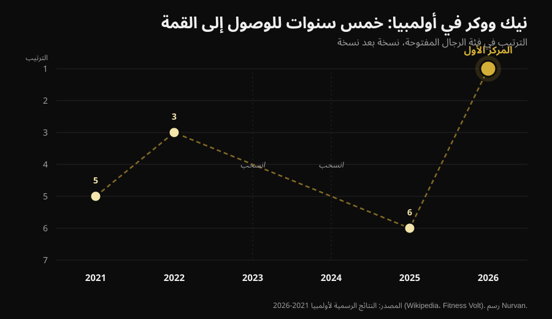
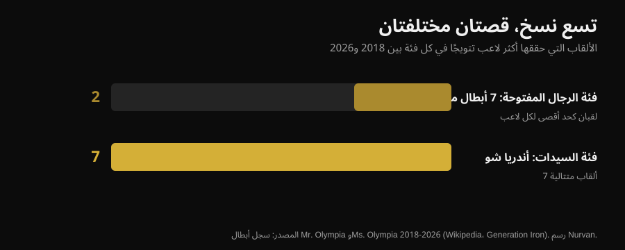

# مستر أولمبيا 2026: فاز نيك ووكر، وقصته تقول أكثر من المنصة

في 27 سبتمبر 2026، في لاس فيغاس، فاز نيك ووكر (Nick Walker) بأول لقب مستر أولمبيا في مسيرته. ستجد هنا النتائج الموثّقة لكل الفئات، وقبل ذلك الجزء الذي يهمّك إن كنت تتدرّب: ما الذي احتاجه فعلًا للوصول إلى هناك، وأيٌّ من ذلك ينطبق عليك أنت.

بقلم [Giammaria Loi](/autore/giammaria-loi) · حُدِّث في 3 أكتوبر 2026

## باختصار

- فاز نيك ووكر بالنسخة 62 من مستر أولمبيا في فئة **Men's Open** (الفئة المفتوحة للرجال) في 27 سبتمبر 2026 في لاس فيغاس، بجائزة قدرها 600.000 دولار. حلّ سامسون داودا (Samson Dauda) ثانيًا وديريك لانسفورد (Derek Lunsford) ثالثًا.
- فاز ووكر رغم خسارته ليلة النهائيات: نقاط التحكيم الأولي (prejudging)، التي مُنحت في اليوم السابق، هي ما أعطاه الفارق الحاسم.
- كانت هذه مشاركته السادسة في أولمبيا في ست سنوات: المركز 5 في 2021، و3 في 2022، ونسختان غائبتان بسبب إصابة وقرار فني، والمركز 6 في 2025. الثبات على مدى سنوات، لا تحضير استثنائي واحد، هو المتغيّر الذي يميّزه.
- في النسخ التسع الأخيرة شهدت فئة Men's Open سبعة أبطال مختلفين، في حين أنهت أندريا شو (Andrea Shaw) لقبها السابع المتتالي في Ms. Olympia (فئة السيدات): الاستقرار ليس قاعدة في هذه الرياضة، بل صفة لأفراد بعينهم.
- ما تراه على المنصة غير قابل للتكرار في بيتك، لكن ثلاثة أمور قابلة للتطبيق: زيادة الحجم التدريبي بتدرّج، إنهاء المجموعات قريبًا من الفشل العضلي، ورفع البروتين عند التقليل من السعرات. على هذه الثلاثة تتفق الأدبيات العلمية.

*منصة تكريم في مسابقة كمال أجسام. الصورة: Rikard Strömmer, Wikimedia Commons, CC BY-SA 4.0.*

## من فاز: النتائج الموثّقة

أُقيمت النسخة 62 من Joe Weider's Olympia من 24 إلى 27 سبتمبر 2026 في لاس فيغاس: التحكيم الأولي والمعرض في Las Vegas Convention Center، ونهائيات مساء الجمعة والسبت في Orleans Arena. اثنتا عشرة فئة على البرنامج.

في **Men's Open**، الفئة الأهم:

| المركز | اللاعب | البلد |
|---|---|---|
| 1 | Nick Walker | الولايات المتحدة |
| 2 | Samson Dauda | المملكة المتحدة |
| 3 | Derek Lunsford | الولايات المتحدة |
| 4 | Andrew Jacked | الإمارات العربية المتحدة |
| 5 | Tonio Burton | الولايات المتحدة |

تبلغ الجائزة الأولى 600.000 دولار. شارك الإيطالي أندريا بريستي (Andrea Presti) في المسابقة وأنهاها في المركز 16 بالتساوي.

*مقارنات التحكيم الأولي تحسم المسابقة أكثر من ليلة النهائي. الصورة: Joey Berzowska, Wikimedia Commons, CC BY 2.0.*

أبطال الفئات الرئيسية الأخرى: **Classic Physique** (القوام الكلاسيكي) نيال داروين (Niall Darwen)، في لقبه الأول؛ **212** (فئة وزن 212 رطلًا) كيوني بيرسون (Keone Pearson)، في لقبه الرابع على التوالي؛ **Men's Physique** (قوام الرجال) رايان تيري (Ryan Terry)؛ **Ms. Olympia** أندريا شو؛ **Bikini** (البيكيني) جازمين غونزاليس (Jasmine Gonzalez)؛ **Wellness** (الويلنس) إدواردا بيزيرا (Eduarda Bezerra)؛ **Figure** (الفيغر) لولا مونتيز (Lola Montez)؛ **Women's Physique** (قوام السيدات) ناتاليا أبراهام كويلو (Natalia Abraham Coelho)؛ **Fitness** (الفتنس) ميشيل فريدوا-منساه (Michelle Fredua-Mensah)؛ **Wheelchair** (الكراسي المتحركة) بليك كوليتون (Blake Colleton).

### التفصيل الذي لم يروِه أحد تقريبًا

نظام النقاط يعمل بالمقلوب: يفوز من يجمع أقل عدد من النقاط، بجمع التحكيم الأولي والنهائي. أنهى ووكر بـ 8 نقاط في التحكيم الأولي و10 في النهائي، أي 18 في المجموع. وسجّل داودا 15 و5، أي 20 في المجموع.

بعبارة أخرى: **داودا فاز بليلة النهائي وخسر المسابقة.** الفارق تكوّن في التحكيم الأولي، حين تكون الأضواء مسطّحة ولا جمهور هناك ويراقب الحكّام المقارنات لعدة دقائق. والأمر ينطبق خارج كمال الأجسام أيضًا: الأداء الذي يُحتسب ليس غالبًا أداء اللحظة الكبيرة.

## خمس سنوات للوصول إلى المركز الأول

مسار ووكر في أولمبيا ليس خطًا صاعدًا نظيفًا.

*مراكز نيك ووكر في أولمبيا من 2021 إلى 2026 — البيانات: النتائج الرسمية للنسخ الست. رسم Nurvan.*

ظهر أول مرة في 2021 بالمركز الخامس، في العام نفسه الذي فاز فيه بـ Arnold Classic. ثالثًا في 2022. في 2023 انسحب قبل المسابقة بقليل بسبب تمزّق في أوتار الفخذ الخلفية أثناء التحضير. في 2024 تأهّل بفوزه في New York Pro ثم تنازل عن المشاركة. سادسًا في 2025. وفي 2026 حلّ ثانيًا في Arnold Classic في مارس، وفاز بـ Tampa Pro في أغسطس وبأولمبيا في سبتمبر.

في سنتين من ست لم يصعد إلى المنصة أصلًا، وفي عام اللقب كان قد خسر أهم مسابقة في الربيع. **المسيرة التي أنتجت ذلك الفوز ليست سلسلة من الأداءات المثالية: إنها سلسلة طويلة.** هذه ليست تفصيلة رومانسية، بل هي الآلية نفسها. تضخّم العضلات يستجيب للحمل المتراكم عبر الزمن، والوقت الذي لا تتدرّب فيه لا يُحتسب.

## تسع نسخ، قصتان متعاكستان

من 2018 إلى 2026 شهدت فئة Men's Open سبعة أبطال مختلفين في تسع نسخ: شون رودن (Shawn Rhoden)، براندون كوري (Brandon Curry)، ممدوح الصبيعي (Mamdouh Elssbiay) مرتين، هادي شوبان (Hadi Choopan)، ديريك لانسفورد مرتين، سامسون داودا، والآن نيك ووكر. لا هيمنة لأحد. ولتدرك كم هذا غير مألوف: الرقم التاريخي هو ثمانية ألقاب، لـ Lee Haney (1984-1991) و Ronnie Coleman (1998-2005)، وفاز Phil Heath بسبعة ألقاب متتالية من 2011 إلى 2017.

في الفترة نفسها، وفي Ms. Olympia، أنهت أندريا شو لقبها السابع المتتالي، متجاوزةً Cory Everson ومحتلةً المركز الثالث تاريخيًا خلف Iris Kyle (10) و Lenda Murray (8).

*الألقاب التي فاز بها من 2018 إلى 2026 أكثر اللاعبين تتويجًا في كل فئة — البيانات: سجل أبطال Mr. Olympia و Ms. Olympia. رسم Nurvan.*

فئتان، الفترة نفسها، الاتحاد نفسه، ونتيجتان متعاكستان. السبب ليس غامضًا: التحكيم ذاتي، و"أفضل قوام" يتغيّر بتغيّر أذواق لجنة التحكيم وبحسب من يتقدّم للمشاركة ذلك العام. من يسعى خلف حكم بشري يسعى خلف هدف متحرّك.

لذلك، إن كنت تتدرّب ولا تنافس، فمن الأفضل أن تختار أهدافًا قابلة للقياس: الأوزان، التكرارات، المحيطات، وزن الجسم. على هذه الأهداف يبقى الهدف ثابتًا. وإن كنت تتساءل كم من استجابتك للتدريب يعتمد على الجينات، فقد تحدّثنا عن ذلك في مقال [المستجيبون الضعفاء](/blog/genetics-high-low-responders).

## ماذا تقول الأبحاث فعلًا

كمال الأجسام الاحترافي يعيش على مقولات تتكرّر حتى تبدو صحيحة. هذه أكثرها شيوعًا، معروضة على الأدبيات العلمية.

**"تحتاج إلى أكبر حجم تدريبي ممكن."** → **يحتاج إلى تدقيق.** علاقة الجرعة بالاستجابة موجودة فعلًا: قدّرت مراجعة تحليلية لـ Schoenfeld وزملائه شملت 15 دراسة أن كل مجموعة أسبوعية إضافية تضيف نحو 0,37% من الزيادة في الكتلة العضلية، بفارق 3,9% بين مجموعات الحجم المرتفع ومجموعات الحجم المنخفض داخل الدراسة نفسها. وتؤكد مراجعة انحدارية من 2025 شملت 67 دراسة و2.058 مشاركًا هذا النمو، لكن مع **عائد متناقص**: كلما ارتفعت، قلّ مردود المجموعات الإضافية. وفي الرياضيين المتدرّبين أصلًا تتناقض النتائج، إلى حد أننا لا نعرف أين تقع نقطة التشبّع.

**"يجب الوصول إلى الفشل العضلي دائمًا."** → **يحتاج إلى تدقيق.** حلّلت مراجعة انحدارية من 2024 المسافة عن الفشل مقاسةً بالتكرارات الاحتياطية (RIR: عدد التكرارات التي كان بإمكانك أداؤها بعد). بالنسبة إلى **تضخّم العضلات** تزداد المكاسب بقدر ما تنتهي المجموعات قريبًا من الفشل. وبالنسبة إلى **القوة** تكون المكاسب متشابهة على مدى واسع من قيم RIR: لا حاجة للوصول إلى الإنهاك. ويدعو الباحثون إلى الحذر، لأن قيم RIR قُدِّرت لاحقًا من أوصاف البروتوكولات.

**"التكرار الأسبوعي العالي أساسي للنمو."** → **غير صحيح، بالنسبة إلى التضخّم.** في المراجعة الانحدارية نفسها من 2025، وبتساوي الحجم الأسبوعي، كان تأثير عدد الحصص الأسبوعية على التضخّم متوافقًا مع الصفر. أما على القوة فعدد الحصص يُحدث فرقًا، دائمًا مع عائد متناقص. توزيع المجموعات نفسها على حصص أكثر يساعدك على البار، لا على محيط عضلة الذراع.

**"في التجفيف يُخفَّض البروتين مع السعرات."** → **غير صحيح.** إرشادات رياضيي القوام تسير في الاتجاه المعاكس: 1,8-2,7 غ لكل كغ من وزن الجسم حسب مراجعة Roberts وزملائه، و2,3-3,1 غ لكل كغ من الكتلة الخالية من الدهون في توصيات Helms و Aragon و Fitschen لكمال الأجسام الطبيعي. فعندما يكبر العجز في السعرات، تخدم حصة البروتين حماية العضلات. وقد كتبنا عن ذلك بتفصيل في مقال [البروتين أثناء التجفيف](/blog/protein-intake-cutting).

**"فقدان الوزن بسرعة قبل مسابقة أو مناسبة ينجح."** → **غير صحيح.** تشير التوصيات نفسها إلى فقدان وزن بنحو 0,5-1% أسبوعيًا، وينزل العمل الأحدث إلى ≤0,5% للحد من فقدان الكتلة الخالية من الدهون.

**"أسبوع الذروة بتحميل الكربوهيدرات والسوائل يُحدث الفرق."** → **غير قابل للتحقق، وخطر جزئيًا.** وجدت مراجعة من 2024 أن هذه الممارسات شديدة الانتشار بين رياضيي القوام، لكن **تنقص الأدلة التجريبية على أنها تحسّن النتيجة في المسابقة**. والتلاعب بالماء والشوارد في الساعات الأخيرة يقوم على آليات مفترضة وقد يكون خطيرًا: ليس شيئًا تجرّبه على عجل من أجل "تجفيف" نفسك قبل مناسبة.

**"التحضير لمسابقة مفيد للصحة."** → **غير صحيح.** وثّقت مراجعة منهجية لـ 11 دراسة حالة على 15 رياضيًا يعرّفون أنفسهم كطبيعيين تغيّرات ملحوظة في تكوين الجسم والأداء العصبي العضلي والهرمونات والمزاج خلال التحضير، مع تفاوت فردي كبير. وتحذّر إرشادات كمال الأجسام الطبيعي من ارتفاع خطر اضطرابات الأكل وصورة الجسم في الرياضات الجمالية، وتوصي بإتاحة الوصول إلى مختصّي الصحة النفسية.

*العمل الذي ينتج نتائج هو العمل المتكرّر على مدى سنوات. الصورة: Nenad Stojkovic, Wikimedia Commons, CC BY 2.0.*

## كيف تطبّق ذلك

لا شيء مما رأيته على منصة لاس فيغاس قابل للتكرار بغير أدوية وجينات وحياة مبنية حول التدريب. أما هذه الأمور الأربعة فنعم.

1. **ارفع الحجم التدريبي بالتدريج.** إن كنت تؤدّي اليوم 8 مجموعات أسبوعيًا لكل مجموعة عضلية، جرّب 10-12 لبضعة أسابيع وراقب ما يحدث للأوزان وللاستشفاء. المنحنى يصعد لكنه يتسطّح: مضاعفة الحجم لا تضاعف النتائج، وترفع التعب والمخاطر.
2. **اقترب من الفشل في المجموعات التي تهمّ.** من أجل التضخّم أبقِ المجموعات الأخيرة من كل تمرين على 1-2 RIR. من أجل القوة لا حاجة لذلك: يمكنك العمل على 3-4 RIR وتكسب المثل، بكلفة استشفاء أقل بكثير.
3. **استخدم عدد الحصص من أجل الأداء الفني، لا من أجل النمو.** توزيع الحجم على حصص أكثر يجعل كل حصة أكثر نشاطًا والحركة أنظف. لكن إن لم يتغيّر المجموع الأسبوعي، فلا تتوقّع تضخّمًا أكبر.
4. **لا تقلّل البروتين عندما تقلّل السعرات.** 1,8-2,7 غ لكل كغ من وزن الجسم هو النطاق المذكور في الدراسات على رياضيي القوام. ولا تتعجّل: 0,5-1% من الوزن أسبوعيًا هو الإيقاع الذي يحافظ على الكتلة الخالية من الدهون بشكل أفضل.

الأرقام أعلاه نطاقات مرصودة في الدراسات، لا وصفة طبية. إن كانت لديك أمراض، أو تتناول أدوية، أو تتبع نظامًا غذائيًا بإشارة طبية، فتحدّث مع طبيبك قبل تغيير أي شيء.

> ### Nurvan — التقدّم لا يظهر إلا إذا سجّلته
>
> الفرق بين عام 2021 وعام 2026 لدى لاعب لا يظهر في حصة واحدة: يظهر في السلسلة الزمنية. يسجّل Nurvan الأوزان والتكرارات وRIR في كل حصة، ويقترح عليك مجموعات الإحماء تلقائيًا، ويعرض تطوّر كل تمرين عبر الزمن، لتعرف إن كنت تتقدّم فعلًا أم تكرّر التدريب نفسه.
>
> **[جرّب Nurvan](https://nurvan.app)**

## الأسئلة الشائعة

**من فاز بمستر أولمبيا 2026؟**
نيك ووكر، الأمريكي، فاز بفئة Men's Open في النسخة 62 في 27 سبتمبر 2026 في لاس فيغاس. إنه لقبه الأول في أولمبيا. حلّ سامسون داودا ثانيًا وديريك لانسفورد ثالثًا.

**متى وأين أُقيم مستر أولمبيا 2026؟**
من 24 إلى 27 سبتمبر 2026 في لاس فيغاس بولاية نيفادا. التحكيم الأولي والمعرض في Las Vegas Convention Center، ونهائيات الجمعة والسبت في Orleans Arena.

**كم بلغت الجائزة المالية التي حصل عليها نيك ووكر؟**
الجائزة الأولى في Men's Open هي 600.000 دولار. حصل ووكر أيضًا على People's Champion Award، للمرة الثانية في مسيرته.

**هل شارك لاعبون إيطاليون في مستر أولمبيا 2026؟**
نعم، شارك أندريا بريستي في فئة Men's Open وأنهى المسابقة في المركز 16 بالتساوي.

**هل يمكن الوصول إلى مثل هذا الجسم بالتدريب الجيد وحده؟**
لا. أجساد Men's Open نتيجة جينات استثنائية وسنوات من التدريب بدوام كامل وبروتوكولات دوائية. التدريب والتغذية الجيدان يعطيان نتائج حقيقية، لكن من رتبة مختلفة تمامًا.

## اقرأ أيضًا

- [المستجيبون الضعفاء: ما مدى تأثير الجينات في العضلات؟](/blog/genetics-high-low-responders) — لماذا لا يحصل شخصان يتّبعان البرنامج نفسه على النتيجة نفسها.
- [البروتين أثناء التجفيف: كم تحتاج منه فعلًا؟](/blog/protein-intake-cutting) — النطاق الذي يحمي الكتلة الخالية من الدهون عندما تقلّل السعرات.

## المصادر

1. Pelland JC, Remmert JF, Robinson ZP, Hinson SR, Zourdos MC, 2025. *The Resistance Training Dose Response: Meta-Regressions Exploring the Effects of Weekly Volume and Frequency on Muscle Hypertrophy and Strength Gains.* Sports Medicine 56(2):481-505. PMID 41343037 — [DOI](https://doi.org/10.1007/s40279-025-02344-w)
2. Schoenfeld BJ, Ogborn D, Krieger JW, 2017. *Dose-response relationship between weekly resistance training volume and increases in muscle mass: A systematic review and meta-analysis.* Journal of Sports Sciences 35(11):1073-1082. PMID 27433992 — [DOI](https://doi.org/10.1080/02640414.2016.1210197)
3. Robinson ZP, Pelland JC, Remmert JF, Refalo MC, Jukic I, Steele J, Zourdos MC, 2024. *Exploring the Dose-Response Relationship Between Estimated Resistance Training Proximity to Failure, Strength Gain, and Muscle Hypertrophy: A Series of Meta-Regressions.* Sports Medicine 54(9):2209-2231. PMID 38970765 — [DOI](https://doi.org/10.1007/s40279-024-02069-2)
4. Camargo JBB, Bittencourt D, Silva DG, Bergamasco JGA, Michel JM, Roberts MD, Libardi CA, 2025. *Is there a volume saturation point for muscle hypertrophy in resistance-trained individuals? A narrative review.* European Journal of Applied Physiology 125(11):3065-3081. PMID 40883636 — [DOI](https://doi.org/10.1007/s00421-025-05959-z)
5. Roberts BM, Helms ER, Trexler ET, Fitschen PJ, 2020. *Nutritional Recommendations for Physique Athletes.* Journal of Human Kinetics 71:79-108. PMID 32148575 — [DOI](https://doi.org/10.2478/hukin-2019-0096)
6. Helms ER, Aragon AA, Fitschen PJ, 2014. *Evidence-based recommendations for natural bodybuilding contest preparation: nutrition and supplementation.* Journal of the International Society of Sports Nutrition 11:20. PMID 24864135 — [DOI](https://doi.org/10.1186/1550-2783-11-20)
7. Homer KA, Cross MR, Helms ER, 2024. *Peak Week Carbohydrate Manipulation Practices in Physique Athletes: A Narrative Review.* Sports Medicine - Open 10(1):8. PMID 38218750 — [DOI](https://doi.org/10.1186/s40798-024-00674-z)
8. Schoenfeld BJ, Androulakis-Korakakis P, Piñero A, Burke R, Coleman M, Mohan AE, Escalante G, Rukstela A, Campbell B, Helms E, 2023. *Alterations in Measures of Body Composition, Neuromuscular Performance, Hormonal Levels, Physiological Adaptations, and Psychometric Outcomes during Preparation for Physique Competition: A Systematic Review of Case Studies.* Journal of Functional Morphology and Kinesiology 8(2):59. PMID 37218855 — [DOI](https://doi.org/10.3390/jfmk8020059)

المصادر العلمية مستخرجة من PubMed. النتائج والتواريخ والمكان وسجل الأبطال موثّقة من [Wikipedia — 2026 Mr. Olympia](https://en.wikipedia.org/wiki/2026_Mr._Olympia) و [Fitness Volt](https://fitnessvolt.com/2026-mr-olympia-results/) و [Generation Iron](https://generationiron.com/2026-mr-olympia-results-all-divisions/)، بتاريخ الاطلاع 3 أكتوبر 2026.

---

**Giammaria Loi** هو مؤسس Nurvan. يتدرّب بالأثقال منذ 2012، ويعمل مدرّبًا شخصيًا وكوتشًا معتمدًا من FIPE منذ 2013، وينافس في رفع الأثقال القوي (powerlifting) على المستوى الوطني منذ 2018. كل مقال يحمل اسمه يبدأ من الدراسات العلمية ويصل إلى ما ينجح فعلًا في الصالة.

> ملاحظة: هذا محتوى معلوماتي، ولا يُغني عن رأي طبيب أو مختص.
