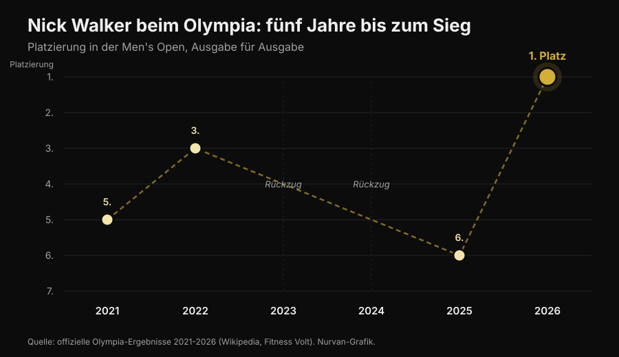
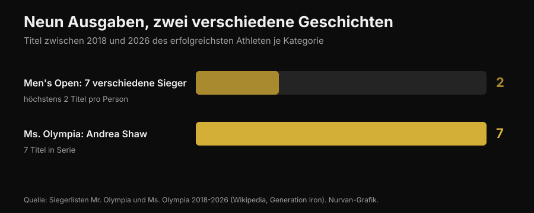

# Mr. Olympia 2026: Nick Walker hat gewonnen — und sein Weg sagt mehr als das Podium

Am 27. September 2026 hat Nick Walker in Las Vegas seinen ersten Mr. Olympia gewonnen. Hier findest du die geprüften Ergebnisse aller Kategorien, vor allem aber den Teil, der dich beim Training betrifft: was es wirklich gebraucht hat und welche dieser Dinge auch für dich gelten.

Von [Giammaria Loi](/autore/giammaria-loi) · aktualisiert am 3. Oktober 2026

## Kurz gefasst

- Nick Walker hat am 27. September 2026 in Las Vegas die 62. Ausgabe des Mr. Olympia Men's Open gewonnen, mit einem Preisgeld von 600.000 Dollar. Zweiter wurde Samson Dauda, Dritter Derek Lunsford.
- Walker hat gewonnen, obwohl er den Finalabend verloren hat: die Punkte aus dem Prejudging vom Tag davor haben ihm den entscheidenden Vorsprung gegeben.
- Es war sein sechster Olympia in sechs Jahren: 5. 2021, 3. 2022, zwei Ausgaben verpasst wegen Verletzung und sportlicher Entscheidung, 6. 2025. Nicht eine außergewöhnliche Vorbereitung unterscheidet ihn, sondern die Konstanz über mehrere Jahre.
- In den letzten neun Ausgaben hatte das Men's Open sieben verschiedene Sieger, während Andrea Shaw ihren siebten Ms. Olympia in Folge geholt hat: Stabilität ist keine Regel dieses Sports, sie ist ein Merkmal einzelner Athleten.
- Was du auf der Bühne siehst, ist zu Hause nicht reproduzierbar. Drei Dinge aber schon: das Volumen mit Augenmaß erhöhen, die Sätze nahe ans Muskelversagen bringen und das Protein hochhalten, wenn du Kalorien kürzt. Bei diesen drei ist die Literatur einig.

*Podium eines Bodybuilding-Wettkampfs. Foto: Rikard Strömmer, Wikimedia Commons, CC BY-SA 4.0.*

## Wer gewonnen hat: die geprüften Ergebnisse

Die 62. Ausgabe von Joe Weider's Olympia lief vom 24. bis 27. September 2026 in Las Vegas: Prejudging und Expo im Las Vegas Convention Center, die Finals am Freitag- und Samstagabend in der Orleans Arena. Zwölf Kategorien standen im Programm.

Im **Men's Open**, der Königskategorie:

| Platz | Athlet | Land |
|---|---|---|
| 1 | Nick Walker | Vereinigte Staaten |
| 2 | Samson Dauda | Vereinigtes Königreich |
| 3 | Derek Lunsford | Vereinigte Staaten |
| 4 | Andrew Jacked | Vereinigte Arabische Emirate |
| 5 | Tonio Burton | Vereinigte Staaten |

Der erste Platz ist mit 600.000 Dollar dotiert. Der Italiener Andrea Presti war am Start und belegte punktgleich den 16. Platz.

*Die Vergleiche im Prejudging entscheiden den Wettkampf stärker als der Finalabend. Foto: Joey Berzowska, Wikimedia Commons, CC BY 2.0.*

Die übrigen Sieger der Hauptkategorien: **Classic Physique** Niall Darwen, sein erster Titel; **212** Keone Pearson, sein vierter in Folge; **Men's Physique** Ryan Terry; **Ms. Olympia** Andrea Shaw; **Bikini** Jasmine Gonzalez; **Wellness** Eduarda Bezerra; **Figure** Lola Montez; **Women's Physique** Natalia Abraham Coelho; **Fitness** Michelle Fredua-Mensah; **Wheelchair** Blake Colleton.

### Das Detail, über das fast niemand gesprochen hat

Die Wertung läuft umgekehrt: Es gewinnt, wer die wenigsten Punkte sammelt, aus Prejudging und Finale zusammen. Walker kam auf 8 im Prejudging und 10 im Finale, Gesamtwertung 18. Dauda hatte 15 und 5, Gesamtwertung 20.

Übersetzt: **Dauda hat den Finalabend gewonnen und den Wettkampf verloren.** Den Abstand hatte er sich im Prejudging eingefangen, wenn das Licht flach ist, kein Publikum da ist und die Jury die Vergleiche mehrere Minuten lang beobachtet. Das gilt auch außerhalb des Bodybuildings: Die Leistung, die zählt, ist oft nicht die im großen Moment.

## Fünf Jahre bis zum ersten Platz

Walkers Geschichte beim Olympia ist keine saubere Kurve nach oben.

*Die Platzierungen von Nick Walker beim Olympia von 2021 bis 2026 — Daten: offizielle Ergebnisse der sechs Ausgaben. Grafik: Nurvan.*

Debüt 2021 mit einem fünften Platz, im selben Jahr, in dem er den Arnold Classic gewonnen hatte. Dritter 2022. 2023 zog er sich kurz vor dem Wettkampf zurück, wegen eines Muskelfaserrisses im hinteren Oberschenkel während der Vorbereitung. 2024 qualifizierte er sich mit dem Sieg beim New York Pro und verzichtete dann. Sechster 2025. 2026 wurde er im März Zweiter beim Arnold Classic, gewann im August den Tampa Pro und im September den Olympia.

In zwei von sechs Jahren stand er nicht einmal auf der Bühne, und im Titeljahr hatte er den wichtigsten Wettkampf des Frühjahrs verloren. **Die Karriere, die diesen Sieg hervorgebracht hat, ist keine Reihe perfekter Leistungen: Sie ist eine lange Reihe.** Das ist kein romantisches Detail, das ist der Mechanismus. Hypertrophie reagiert auf die über die Zeit angesammelte Belastung, und die Zeit, in der du nicht trainierst, zählt nicht.

## Neun Ausgaben, zwei gegensätzliche Geschichten

Von 2018 bis 2026 hatte das Men's Open sieben verschiedene Sieger in neun Ausgaben: Shawn Rhoden, Brandon Curry, Mamdouh Elssbiay (zweimal), Hadi Choopan, Derek Lunsford (zweimal), Samson Dauda und jetzt Nick Walker. Keine Vorherrschaft. Um einzuordnen, wie ungewöhnlich das ist: Der historische Rekord liegt bei acht Titeln, gehalten von Lee Haney (1984-1991) und Ronnie Coleman (1998-2005), und Phil Heath hat von 2011 bis 2017 sieben in Folge gewonnen.

Im gleichen Zeitraum hat Andrea Shaw bei der Ms. Olympia gerade ihren siebten Titel in Folge geholt, hat damit Cory Everson überholt und liegt auf Platz drei aller Zeiten hinter Iris Kyle (10) und Lenda Murray (8).

*Titel von 2018 bis 2026, jeweils vom erfolgreichsten Athleten der Kategorie — Daten: Siegerlisten Mr. Olympia und Ms. Olympia. Grafik: Nurvan.*

Zwei Kategorien, gleicher Zeitraum, gleicher Verband, gegensätzliche Ergebnisse. Der Grund ist kein Geheimnis: Die Bewertung ist subjektiv, und der "beste Körper" verschiebt sich mit dem Geschmack der Jury und mit dem Starterfeld des jeweiligen Jahres. Wer einem Urteil nachjagt, jagt einem Ziel nach, das sich bewegt.

Deshalb lohnt es sich, wenn du trainierst und nicht antritst, Ziele zu wählen, die messbar sind: Lasten, Wiederholungen, Umfänge, Gewicht. Da bleibt das Ziel stehen. Und wenn du dich fragst, wie viel deiner Trainingsreaktion von der Genetik abhängt: darüber haben wir im Artikel zu [High und Low Respondern](/blog/genetik-high-low-responder) geschrieben.

## Was die Forschung wirklich sagt

Profi-Bodybuilding lebt von Behauptungen, die so oft wiederholt werden, dass sie wahr klingen. Hier die häufigsten, durch die Literatur geprüft.

**"Es braucht so viel Volumen wie möglich."** → **Zu präzisieren.** Die Dosis-Wirkungs-Beziehung existiert: Eine Meta-Analyse von Schoenfeld und Kollegen über 15 Studien hat geschätzt, dass jeder zusätzliche Satz pro Woche etwa 0,37 % mehr Massezuwachs bringt, mit einem Unterschied von 3,9 % zwischen den Gruppen mit hohem und niedrigem Volumen innerhalb derselben Studie. Eine Meta-Regression von 2025 über 67 Studien und 2.058 Teilnehmer bestätigt das Wachstum, aber mit **abnehmendem Ertrag**: je höher du gehst, desto weniger bringen zusätzliche Sätze. Und bei bereits trainierten Athleten sind die Ergebnisse widersprüchlich, so stark, dass wir nicht wissen, wo der Sättigungspunkt liegt.

**"Man muss immer bis zum Muskelversagen gehen."** → **Zu präzisieren.** Eine Meta-Regression von 2024 hat den Abstand zum Muskelversagen in Reserve-Wiederholungen untersucht (RIR: wie viele Wiederholungen du noch hättest machen können). Für die **Hypertrophie** steigen die Zuwächse, je näher die Sätze am Muskelversagen enden. Für die **Kraft** sind sie über einen weiten RIR-Bereich ähnlich: Du musst nicht bis zur Erschöpfung gehen. Die Autoren mahnen zur Vorsicht, weil die RIR nachträglich aus den Protokollbeschreibungen geschätzt wurden.

**"Hohe Frequenz ist entscheidend für den Aufbau."** → **Widerlegt, für die Hypertrophie.** In derselben Meta-Regression von 2025 hat die Frequenz bei gleichem Wochenvolumen einen Effekt auf die Hypertrophie, der mit Null vereinbar ist. Bei der Kraft zählt die Frequenz dagegen, immer mit abnehmendem Ertrag. Dieselben Sätze auf mehr Einheiten zu verteilen hilft dir an der Stange, nicht am Armumfang.

**"In der Diät sinkt das Protein zusammen mit den Kalorien."** → **Widerlegt.** Die Leitlinien für Physique-Athleten gehen in die Gegenrichtung: 1,8-2,7 g pro kg Körpergewicht laut dem Review von Roberts und Kollegen, 2,3-3,1 g pro kg Magermasse in den Empfehlungen von Helms, Aragon und Fitschen für natural Bodybuilding. Wenn das Kaloriendefizit größer wird, schützt der Proteinanteil den Muskel. Im Detail haben wir das im Artikel über [Protein in der Diät](/blog/protein-in-der-diaet) behandelt.

**"Schnell abnehmen vor einem Wettkampf oder Event funktioniert."** → **Widerlegt.** Dieselben Empfehlungen nennen einen Gewichtsverlust von etwa 0,5-1 % pro Woche, und die neuere Arbeit geht auf ≤ 0,5 % herunter, um den Verlust an Magermasse zu begrenzen.

**"Die Peak Week mit Kohlenhydrat- und Flüssigkeitsladen macht den Unterschied."** → **Nicht überprüfbar und teils riskant.** Ein Review von 2024 hat gezeigt, dass diese Praktiken unter Physique-Athleten weit verbreitet sind, dass aber **experimentelle Belege fehlen, dass sie das Wettkampfergebnis verbessern**. Die Manipulation von Wasser und Elektrolyten in den letzten Stunden beruht auf vermuteten Mechanismen und kann gefährlich sein: Das ist nichts, was man improvisiert, um vor einem Event "trocken" zu werden.

**"Eine Wettkampfvorbereitung ist gut für die Gesundheit."** → **Widerlegt.** Eine systematische Übersicht über 11 Fallstudien mit 15 erklärt natural antretenden Athleten hat deutliche Veränderungen in Körperzusammensetzung, neuromuskulärer Leistung, Hormonen und Stimmung während der Vorbereitung dokumentiert, mit starker individueller Streuung. Die Leitlinien zum natural Bodybuilding warnen vor dem erhöhten Risiko für Essstörungen und Körperbildstörungen in den Ästhetiksportarten und empfehlen den Zugang zu psychologischen Fachleuten.

*Die Arbeit, die Ergebnisse bringt, ist die über Jahre wiederholte. Foto: Nenad Stojkovic, Wikimedia Commons, CC BY 2.0.*

## So setzt du es um

Nichts von dem, was auf der Bühne in Las Vegas zu sehen war, ist ohne Pharmakologie, Genetik und ein ganz um das Training gebautes Leben reproduzierbar. Diese vier Dinge dagegen schon.

1. **Erhöhe das Volumen in Schritten.** Wenn du heute 8 Sätze pro Woche und Muskelgruppe machst, probiere für einige Wochen 10-12 und schau, was mit Lasten und Erholung passiert. Die Kurve steigt, flacht aber ab: Doppeltes Volumen bringt nicht doppelte Ergebnisse, aber mehr Ermüdung und mehr Risiko.
2. **Gehe auf den Sätzen, die zählen, näher ans Muskelversagen.** Für die Hypertrophie halte die letzten Sätze jeder Übung bei 1-2 RIR. Für die Kraft ist das nicht nötig: Du kannst mit 3-4 RIR arbeiten und genauso zulegen, bei deutlich geringeren Erholungskosten.
3. **Nutze die Frequenz für die Technik, nicht für den Aufbau.** Das Volumen auf mehr Einheiten zu verteilen macht jede Session frischer und die Ausführung sauberer. Wenn die Wochensumme aber gleich bleibt, erwarte keine zusätzliche Hypertrophie.
4. **Kürze das Protein nicht, wenn du die Kalorien kürzt.** 1,8-2,7 g pro kg Körpergewicht ist der Bereich, der in den Studien an Physique-Athleten berichtet wird. Und lass dir Zeit: 0,5-1 % Gewicht pro Woche ist das Tempo, das die Magermasse am besten erhält.

Die Zahlen hier oben sind in Studien beobachtete Bereiche, keine Verordnung. Wenn du Erkrankungen hast, Medikamente nimmst oder auf ärztliche Anweisung eine Diät einhältst, sprich mit deinem Arzt, bevor du etwas änderst.

> ### Nurvan — Fortschritt siehst du nur, wenn du ihn aufzeichnest
>
> Der Unterschied zwischen dem 2021 und dem 2026 eines Athleten zeigt sich nicht in einer Einheit, sondern in der Zeitreihe. Nurvan erfasst Lasten, Wiederholungen und RIR Satz für Satz, schlägt dir die Aufwärmsätze automatisch vor und zeigt den Verlauf jeder Übung über die Zeit — so erkennst du, ob du wirklich Fortschritte machst oder nur dasselbe Training wiederholst.
>
> **[Nurvan testen](https://nurvan.app)**

## Häufige Fragen

**Wer hat den Mr. Olympia 2026 gewonnen?**
Nick Walker aus den Vereinigten Staaten hat am 27. September 2026 in Las Vegas das Men's Open der 62. Ausgabe gewonnen. Es ist sein erster Olympia-Titel. Zweiter wurde Samson Dauda, Dritter Derek Lunsford.

**Wann und wo fand der Mr. Olympia 2026 statt?**
Vom 24. bis 27. September 2026 in Las Vegas, Nevada. Prejudging und Expo im Las Vegas Convention Center, die Finals am Freitag und Samstag in der Orleans Arena.

**Wie viel Preisgeld hat Nick Walker bekommen?**
Der erste Preis im Men's Open liegt bei 600.000 Dollar. Walker hat außerdem den People's Champion Award erhalten, zum zweiten Mal in seiner Karriere.

**Wie hat Andrea Presti beim Mr. Olympia 2026 abgeschnitten?**
Der Italiener Andrea Presti war im Men's Open am Start und belegte punktgleich den 16. Platz.

**Kann man so einen Körper mit gutem Training erreichen?**
Nein. Die Körper im Men's Open sind das Ergebnis extremer Genetik, vieler Jahre Vollzeit-Training und pharmakologischer Protokolle. Gutes Training und gute Ernährung bringen echte Ergebnisse, aber in einer anderen Größenordnung.

## Lies auch

- [Low Responder: Wie viel Genetik steckt im Muskelaufbau?](/blog/genetik-high-low-responder) — warum zwei Menschen mit demselben Programm nicht dasselbe Ergebnis bekommen.
- [Protein in der Diät: Wie viel du wirklich brauchst](/blog/protein-in-der-diaet) — der Bereich, der die Magermasse schützt, wenn du Kalorien kürzt.

## Quellen

1. Pelland JC, Remmert JF, Robinson ZP, Hinson SR, Zourdos MC, 2025. *The Resistance Training Dose Response: Meta-Regressions Exploring the Effects of Weekly Volume and Frequency on Muscle Hypertrophy and Strength Gains.* Sports Medicine 56(2):481-505. PMID 41343037 — [DOI](https://doi.org/10.1007/s40279-025-02344-w)
2. Schoenfeld BJ, Ogborn D, Krieger JW, 2017. *Dose-response relationship between weekly resistance training volume and increases in muscle mass: A systematic review and meta-analysis.* Journal of Sports Sciences 35(11):1073-1082. PMID 27433992 — [DOI](https://doi.org/10.1080/02640414.2016.1210197)
3. Robinson ZP, Pelland JC, Remmert JF, Refalo MC, Jukic I, Steele J, Zourdos MC, 2024. *Exploring the Dose-Response Relationship Between Estimated Resistance Training Proximity to Failure, Strength Gain, and Muscle Hypertrophy: A Series of Meta-Regressions.* Sports Medicine 54(9):2209-2231. PMID 38970765 — [DOI](https://doi.org/10.1007/s40279-024-02069-2)
4. Camargo JBB, Bittencourt D, Silva DG, Bergamasco JGA, Michel JM, Roberts MD, Libardi CA, 2025. *Is there a volume saturation point for muscle hypertrophy in resistance-trained individuals? A narrative review.* European Journal of Applied Physiology 125(11):3065-3081. PMID 40883636 — [DOI](https://doi.org/10.1007/s00421-025-05959-z)
5. Roberts BM, Helms ER, Trexler ET, Fitschen PJ, 2020. *Nutritional Recommendations for Physique Athletes.* Journal of Human Kinetics 71:79-108. PMID 32148575 — [DOI](https://doi.org/10.2478/hukin-2019-0096)
6. Helms ER, Aragon AA, Fitschen PJ, 2014. *Evidence-based recommendations for natural bodybuilding contest preparation: nutrition and supplementation.* Journal of the International Society of Sports Nutrition 11:20. PMID 24864135 — [DOI](https://doi.org/10.1186/1550-2783-11-20)
7. Homer KA, Cross MR, Helms ER, 2024. *Peak Week Carbohydrate Manipulation Practices in Physique Athletes: A Narrative Review.* Sports Medicine - Open 10(1):8. PMID 38218750 — [DOI](https://doi.org/10.1186/s40798-024-00674-z)
8. Schoenfeld BJ, Androulakis-Korakakis P, Piñero A, Burke R, Coleman M, Mohan AE, Escalante G, Rukstela A, Campbell B, Helms E, 2023. *Alterations in Measures of Body Composition, Neuromuscular Performance, Hormonal Levels, Physiological Adaptations, and Psychometric Outcomes during Preparation for Physique Competition: A Systematic Review of Case Studies.* Journal of Functional Morphology and Kinesiology 8(2):59. PMID 37218855 — [DOI](https://doi.org/10.3390/jfmk8020059)

Wissenschaftliche Quellen über PubMed recherchiert. Ergebnisse, Daten, Austragungsort und Siegerlisten geprüft auf [Wikipedia — 2026 Mr. Olympia](https://en.wikipedia.org/wiki/2026_Mr._Olympia), [Fitness Volt](https://fitnessvolt.com/2026-mr-olympia-results/) und [Generation Iron](https://generationiron.com/2026-mr-olympia-results-all-divisions/), abgerufen am 3. Oktober 2026.

---

**Giammaria Loi** ist der Gründer von Nurvan. Er trainiert seit 2012 mit Gewichten, arbeitet seit 2013 als FIPE-zertifizierter Personal Trainer und Coach und startet seit 2018 im Powerlifting auf nationalem Niveau. Jeder Artikel, den er schreibt, beginnt bei den Studien und endet bei dem, was im Gym wirklich funktioniert.

> Hinweis: informativer Inhalt, ersetzt nicht den Rat eines Arztes oder einer Fachperson.
