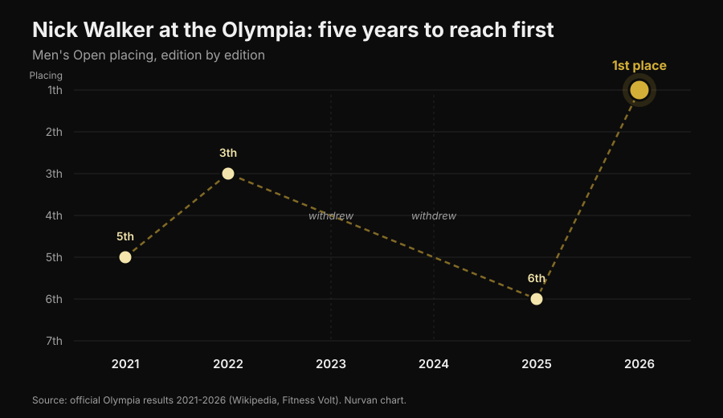
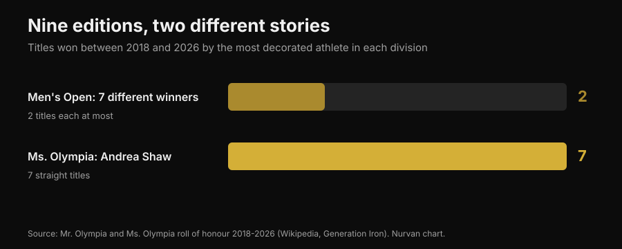

# Mr. Olympia 2026: Nick Walker won, and his story says more than the podium

On 27 September 2026, in Las Vegas, Nick Walker won his first Mr. Olympia. Below you get the verified results for every division. More to the point, you get the part that matters if you train: what it actually took to get there, and which of those things apply to you too.

By [Giammaria Loi](/autore/giammaria-loi) · updated 3 October 2026

## In short

- Nick Walker won the Men's Open at the 62nd Mr. Olympia on 27 September 2026 in Las Vegas, taking a 600,000 dollar prize. Samson Dauda placed second, Derek Lunsford third.
- Walker won despite losing finals night: the prejudging score, handed out the day before, gave him the decisive margin.
- It was his sixth Olympia in six years: 5th in 2021, 3rd in 2022, two editions missed through injury and a tactical call, 6th in 2025. Consistency across years, not one exceptional prep, is what sets him apart.
- Across the last nine editions the Men's Open has had seven different winners, while Andrea Shaw just closed her seventh straight Ms. Olympia: stability is not a rule of the sport, it is a trait of individual athletes.
- What you see on stage is not reproducible at home, but three things are: raising volume sensibly, taking sets close to failure, and keeping protein high while cutting. On those three the literature agrees.

*Podium at a bodybuilding contest. Photo: Rikard Strömmer, Wikimedia Commons, CC BY-SA 4.0.*

## Who won: the verified results

The 62nd edition of Joe Weider's Olympia ran from 24 to 27 September 2026 in Las Vegas: prejudging and the Expo at the Las Vegas Convention Center, the Friday and Saturday night finals at the Orleans Arena. Twelve divisions on the schedule.

In the **Men's Open**, the flagship division:

| Place | Athlete | Country |
|---|---|---|
| 1 | Nick Walker | United States |
| 2 | Samson Dauda | United Kingdom |
| 3 | Derek Lunsford | United States |
| 4 | Andrew Jacked | United Arab Emirates |
| 5 | Tonio Burton | United States |

First place is worth 600,000 dollars. Italy's Andrea Presti competed and finished tied for 16th.

*The prejudging callouts decide the contest more than finals night does. Photo: Joey Berzowska, Wikimedia Commons, CC BY 2.0.*

The other winners in the main divisions: **Classic Physique** Niall Darwen, his first title; **212** Keone Pearson, his fourth in a row; **Men's Physique** Ryan Terry; **Ms. Olympia** Andrea Shaw; **Bikini** Jasmine Gonzalez; **Wellness** Eduarda Bezerra; **Figure** Lola Montez; **Women's Physique** Natalia Abraham Coelho; **Fitness** Michelle Fredua-Mensah; **Wheelchair** Blake Colleton.

### The detail almost nobody covered

Scoring runs backwards: the lowest total wins, adding prejudging and finals together. Walker finished with 8 at prejudging and 10 in the finals, for a total of 18. Dauda scored 15 and 5, for a total of 20.

Translated: **Dauda won finals night and lost the contest.** The gap had opened at prejudging, when the lights are flat, there is no crowd, and the judges study the callouts for several minutes. It holds outside bodybuilding too: the performance that counts is often not the one under the spotlight.

## Five years to reach the top

Walker's Olympia record is not a clean upward curve.

*Nick Walker's Olympia placings from 2021 to 2026 — Data: official results of the six editions. Nurvan chart.*

He debuted in 2021 with a fifth place, the same year he won the Arnold Classic. Third in 2022. In 2023 he withdrew shortly before the contest after tearing a hamstring in prep. In 2024 he qualified by winning the New York Pro, then pulled out. Sixth in 2025. In 2026 he placed second at the Arnold Classic in March, won the Tampa Pro in August, and won the Olympia in September.

In two of those six years he did not even step on stage, and in his title year he had lost the biggest contest of the spring. **The career that produced that win is not a run of perfect performances: it is a long run.** That is not a romantic detail, it is the mechanism. Hypertrophy responds to load accumulated over time, and the time you spend not training does not count.

## Nine editions, two opposite stories

From 2018 to 2026 the Men's Open had seven different winners in nine editions: Shawn Rhoden, Brandon Curry, Mamdouh Elssbiay (twice), Hadi Choopan, Derek Lunsford (twice), Samson Dauda, and now Nick Walker. No dynasty. For a sense of how unusual that is: the all-time record is eight titles, held by Lee Haney (1984-1991) and Ronnie Coleman (1998-2005), and Phil Heath won seven in a row from 2011 to 2017.

Over the same span, in the Ms. Olympia, Andrea Shaw has just closed her seventh consecutive title, passing Cory Everson and moving into third all time behind Iris Kyle (10) and Lenda Murray (8).

*Titles won from 2018 to 2026 by the most decorated athlete in each division — Data: Mr. Olympia and Ms. Olympia title records. Nurvan chart.*

Two divisions, same period, same federation, opposite outcomes. The reason is no mystery: judging is subjective, and the "best physique" shifts with the panel's taste and with who shows up that year. Chase a judgement and you are chasing a moving target.

So if you train and do not compete, pick goals you can measure: loads, reps, circumferences, body weight. On those the target stays still. And if you wonder how much of your response to training comes down to genetics, we covered that in the article on [high and low responders](/blog/genetics-high-low-responders).

## What the research actually says

Pro bodybuilding runs on claims repeated until they sound true. Here are the most common ones, checked against the literature.

**"You need as much volume as possible."** → **Needs nuance.** The dose-response relationship is real: a meta-analysis by Schoenfeld and colleagues across 15 studies estimated that each extra weekly set adds roughly 0.37% more gain in muscle mass, with a 3.9% difference between higher-volume and lower-volume groups within the same study. A 2025 meta-regression across 67 studies and 2,058 participants confirms the growth, but with **diminishing returns**: the higher you go, the less each extra set gives back. And in already-trained athletes the findings are contradictory, to the point that we do not know where the saturation point sits.

**"You should always train to failure."** → **Needs nuance.** A 2024 meta-regression analysed proximity to failure in reps in reserve (RIR: how many more reps you could still have done). For **hypertrophy**, gains increase the closer sets finish to failure. For **strength** they are similar across a wide range of RIR: you do not need to grind yourself out. The authors urge caution, because RIR values were estimated after the fact from the protocol descriptions.

**"High frequency is essential for growth."** → **Busted, for hypertrophy.** In the same 2025 meta-regression, with weekly volume held equal, frequency had an effect on hypertrophy compatible with zero. For strength, frequency does matter, again with diminishing returns. Spreading the same sets across more sessions helps your barbell numbers, not your arm circumference.

**"When you cut, protein comes down with the calories."** → **Busted.** Guidelines for physique athletes point the other way: 1.8-2.7 g per kg of body weight in the review by Roberts and colleagues, 2.3-3.1 g per kg of lean mass in the recommendations by Helms, Aragon and Fitschen for natural bodybuilding. As the calorie deficit grows, protein is what protects muscle. We went into detail in the article on [protein when cutting](/blog/protein-intake-cutting).

**"Losing weight fast before a contest or an event works."** → **Busted.** The same recommendations point to weight losses of around 0.5-1% per week, and the most recent work comes down to ≤0.5% to limit lean mass loss.

**"Peak week with carb and water loading makes the difference."** → **Not verifiable, and partly risky.** A 2024 review found these practices are extremely common among physique athletes, but **there is no experimental evidence that they improve contest outcome**. Manipulating water and electrolytes in the final hours rests on hypothesised mechanisms and can be dangerous: it is not something to improvise to "dry out" before an event.

**"Prepping for a contest is good for your health."** → **Busted.** A systematic review of 11 case studies covering 15 self-declared natural athletes documented marked changes in body composition, neuromuscular performance, hormones and mood during prep, with wide individual variability. Natural bodybuilding guidelines warn of the raised risk of eating disorders and body image disorders in aesthetic sports, and recommend access to mental health professionals.

*The work that produces results is the work repeated for years. Photo: Nenad Stojkovic, Wikimedia Commons, CC BY 2.0.*

## How to apply it

Nothing seen on that Las Vegas stage is reproducible without pharmacology, genetics and a life built around training. These four things, on the other hand, are.

1. **Raise volume in steps.** If you currently do 8 weekly sets per muscle group, try 10-12 for a few weeks and watch what happens to your loads and your recovery. The curve rises but flattens: doubling volume does not double results, and it does add fatigue and risk.
2. **Get close to failure on the sets that count.** For hypertrophy, keep the last sets of each exercise at 1-2 RIR. For strength you do not need to: you can work at 3-4 RIR and gain just as much, at a much lower recovery cost.
3. **Use frequency for technique, not for growth.** Splitting volume across more sessions makes each session fresher and each lift cleaner. But if the weekly total does not change, do not expect more hypertrophy.
4. **Do not cut protein when you cut calories.** 1.8-2.7 g per kg of body weight is the range reported in studies on physique athletes. And do not rush: 0.5-1% of body weight per week is the pace that best preserves lean mass.

The numbers above are ranges observed in studies, not a prescription. If you have a medical condition, take medication or follow a diet on medical advice, talk to your doctor before changing anything.

> ### Nurvan — progression only shows up if you record it
>
> The difference between an athlete's 2021 and their 2026 does not show up in a single session: it shows up in the time series. Nurvan logs loads, reps and RIR session by session, sets up your warm-up sets automatically, and shows each exercise's trend over time, so you can tell whether you are actually progressing or just repeating the same workout.
>
> **[Try Nurvan](https://nurvan.app)**

## Frequently asked questions

**Who won Mr. Olympia 2026?**
Nick Walker, of the United States, won the Men's Open at the 62nd edition on 27 September 2026 in Las Vegas. It is his first Olympia title. Samson Dauda placed second, Derek Lunsford third.

**When and where was Mr. Olympia 2026 held?**
From 24 to 27 September 2026 in Las Vegas, Nevada. Prejudging and the Expo at the Las Vegas Convention Center, the Friday and Saturday finals at the Orleans Arena.

**How much prize money did Nick Walker win?**
First place in the Men's Open is worth 600,000 dollars. Walker also received the People's Champion Award, for the second time in his career.

**Where did Andrea Presti place at Mr. Olympia 2026?**
Italy's Andrea Presti competed in the Men's Open and finished tied for 16th.

**Can you build a physique like that just by training well?**
No. Men's Open physiques are the product of extreme genetics, years of full-time training and pharmacological protocols. Good training and good nutrition give real results, but of a different order of magnitude.

## Read next

- [Low responders: how much do genetics limit muscle?](/blog/genetics-high-low-responders) — why two people running the same program do not get the same result.
- [Protein intake when cutting: how much do you need?](/blog/protein-intake-cutting) — the range that protects lean mass while you cut calories.
- [Does creatine cause hair loss?](/blog/creatine-hair-loss) — what the studies say about the most used supplement in the gym.

## Sources

1. Pelland JC, Remmert JF, Robinson ZP, Hinson SR, Zourdos MC, 2025. *The Resistance Training Dose Response: Meta-Regressions Exploring the Effects of Weekly Volume and Frequency on Muscle Hypertrophy and Strength Gains.* Sports Medicine 56(2):481-505. PMID 41343037 — [DOI](https://doi.org/10.1007/s40279-025-02344-w)
2. Schoenfeld BJ, Ogborn D, Krieger JW, 2017. *Dose-response relationship between weekly resistance training volume and increases in muscle mass: A systematic review and meta-analysis.* Journal of Sports Sciences 35(11):1073-1082. PMID 27433992 — [DOI](https://doi.org/10.1080/02640414.2016.1210197)
3. Robinson ZP, Pelland JC, Remmert JF, Refalo MC, Jukic I, Steele J, Zourdos MC, 2024. *Exploring the Dose-Response Relationship Between Estimated Resistance Training Proximity to Failure, Strength Gain, and Muscle Hypertrophy: A Series of Meta-Regressions.* Sports Medicine 54(9):2209-2231. PMID 38970765 — [DOI](https://doi.org/10.1007/s40279-024-02069-2)
4. Camargo JBB, Bittencourt D, Silva DG, Bergamasco JGA, Michel JM, Roberts MD, Libardi CA, 2025. *Is there a volume saturation point for muscle hypertrophy in resistance-trained individuals? A narrative review.* European Journal of Applied Physiology 125(11):3065-3081. PMID 40883636 — [DOI](https://doi.org/10.1007/s00421-025-05959-z)
5. Roberts BM, Helms ER, Trexler ET, Fitschen PJ, 2020. *Nutritional Recommendations for Physique Athletes.* Journal of Human Kinetics 71:79-108. PMID 32148575 — [DOI](https://doi.org/10.2478/hukin-2019-0096)
6. Helms ER, Aragon AA, Fitschen PJ, 2014. *Evidence-based recommendations for natural bodybuilding contest preparation: nutrition and supplementation.* Journal of the International Society of Sports Nutrition 11:20. PMID 24864135 — [DOI](https://doi.org/10.1186/1550-2783-11-20)
7. Homer KA, Cross MR, Helms ER, 2024. *Peak Week Carbohydrate Manipulation Practices in Physique Athletes: A Narrative Review.* Sports Medicine - Open 10(1):8. PMID 38218750 — [DOI](https://doi.org/10.1186/s40798-024-00674-z)
8. Schoenfeld BJ, Androulakis-Korakakis P, Piñero A, Burke R, Coleman M, Mohan AE, Escalante G, Rukstela A, Campbell B, Helms E, 2023. *Alterations in Measures of Body Composition, Neuromuscular Performance, Hormonal Levels, Physiological Adaptations, and Psychometric Outcomes during Preparation for Physique Competition: A Systematic Review of Case Studies.* Journal of Functional Morphology and Kinesiology 8(2):59. PMID 37218855 — [DOI](https://doi.org/10.3390/jfmk8020059)

Scientific sources retrieved from PubMed. Results, dates, venue and title records verified against [Wikipedia — 2026 Mr. Olympia](https://en.wikipedia.org/wiki/2026_Mr._Olympia), [Fitness Volt](https://fitnessvolt.com/2026-mr-olympia-results/) and [Generation Iron](https://generationiron.com/2026-mr-olympia-results-all-divisions/), accessed on 3 October 2026.

---

**Giammaria Loi** is the founder of Nurvan. He has been lifting since 2012, has worked as a FIPE-certified personal trainer and coach since 2013, and has competed in powerlifting at national level since 2018. Every article he writes starts from the research and ends with what actually works in the gym.

> Note: this is educational content and does not replace advice from a doctor or qualified professional.
