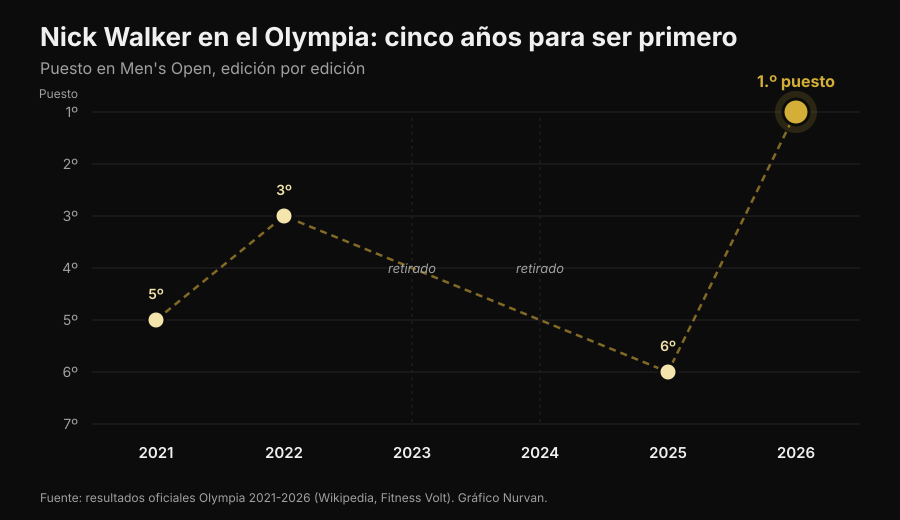
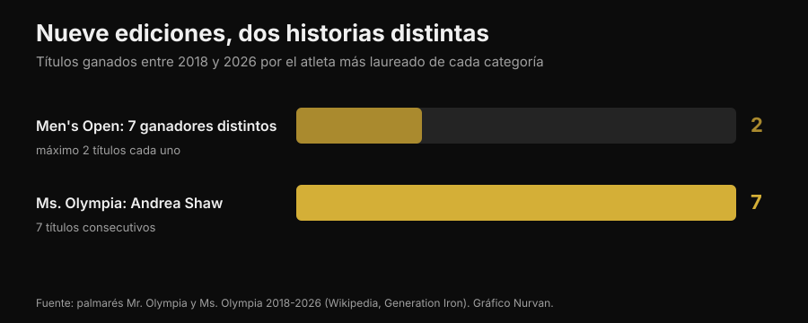

# Mr. Olympia 2026: ganó Nick Walker, y su historia dice más que el podio

El 27 de septiembre de 2026, en Las Vegas, Nick Walker ganó su primer Mr. Olympia. Aquí tienes los resultados verificados de todas las categorías, pero sobre todo la parte que importa a quien entrena: qué hizo falta de verdad para llegar ahí y cuáles de esas cosas valen también para ti.

Por [Giammaria Loi](/autore/giammaria-loi) · actualizado el 3 de octubre de 2026

## En resumen

- Nick Walker ganó la 62.ª edición del Mr. Olympia Men's Open el 27 de septiembre de 2026 en Las Vegas, con un premio de 600.000 dólares. Segundo Samson Dauda, tercero Derek Lunsford.
- Walker ganó aunque perdió la noche de la final: la puntuación del prejudging, del día anterior, le dio el margen decisivo.
- Era su sexto Olympia en seis años: 5.º en 2021, 3.º en 2022, dos ediciones sin competir por lesión y por decisión técnica, 6.º en 2025. La constancia a lo largo de varios años, y no una preparación excepcional, es la variable que lo distingue.
- En las últimas nueve ediciones el Men's Open ha tenido siete ganadores distintos, mientras Andrea Shaw ha cerrado su séptimo Ms. Olympia consecutivo: la estabilidad no es una regla del deporte, es una característica de atletas concretos.
- Lo que ves en el escenario no se puede replicar en casa, pero tres cosas sí: subir el volumen con criterio, llevar las series cerca del fallo y mantener las proteínas altas cuando estás en déficit. En esas tres la literatura coincide.

*Podio de una competición de culturismo. Foto: Rikard Strömmer, Wikimedia Commons, CC BY-SA 4.0.*

## Quién ganó: los resultados verificados

La 62.ª edición del Joe Weider's Olympia se celebró del 24 al 27 de septiembre de 2026 en Las Vegas: prejudging y Expo en el Las Vegas Convention Center, finales del viernes y del sábado por la noche en el Orleans Arena. Doce categorías en programa.

En el **Men's Open**, la categoría reina:

| Posición | Atleta | País |
|---|---|---|
| 1 | Nick Walker | Estados Unidos |
| 2 | Samson Dauda | Reino Unido |
| 3 | Derek Lunsford | Estados Unidos |
| 4 | Andrew Jacked | Emiratos Árabes Unidos |
| 5 | Tonio Burton | Estados Unidos |

El primer premio son 600.000 dólares. El italiano Andrea Presti estaba en competición y acabó empatado en el puesto 16.º.

*Las comparaciones del prejudging deciden la competición más que la noche final. Foto: Joey Berzowska, Wikimedia Commons, CC BY 2.0.*

Los demás ganadores de las categorías principales: **Classic Physique** Niall Darwen, en su primer título; **212** Keone Pearson, en el cuarto consecutivo; **Men's Physique** Ryan Terry; **Ms. Olympia** Andrea Shaw; **Bikini** Jasmine Gonzalez; **Wellness** Eduarda Bezerra; **Figure** Lola Montez; **Women's Physique** Natalia Abraham Coelho; **Fitness** Michelle Fredua-Mensah; **Wheelchair** Blake Colleton.

### El detalle que casi nadie ha contado

La puntuación funciona al revés: gana quien suma menos puntos, sumando prejudging y final. Walker cerró con 8 en el prejudging y 10 en la final, total 18. Dauda hizo 15 y 5, total 20.

Traducido: **Dauda ganó la noche de la final y perdió la competición.** La diferencia se la había llevado en el prejudging, cuando las luces son planas, no hay público y los jueces observan las comparaciones durante varios minutos. Vale también fuera del culturismo: la actuación que cuenta a menudo no es la del momento estelar.

## Cinco años para llegar al primer puesto

La historia de Walker en el Olympia no es una curva limpia.

*Los puestos de Nick Walker en el Olympia de 2021 a 2026 — Datos: resultados oficiales de las seis ediciones. Gráfico Nurvan.*

Debutó en 2021 con un quinto puesto, el mismo año en que había ganado el Arnold Classic. Tercero en 2022. En 2023 se retiró poco antes de la competición por una rotura en el bíceps femoral durante la preparación. En 2024 se clasificó ganando el New York Pro y luego renunció. Sexto en 2025. En 2026 llegó segundo en el Arnold Classic en marzo, ganó el Tampa Pro en agosto y el Olympia en septiembre.

Dos años de seis no llegó ni a subirse al escenario, y en el año del título había perdido la competición más importante de la primavera. **La carrera que produjo esa victoria no es una serie de actuaciones perfectas: es una serie larga.** No es un detalle romántico, es el mecanismo. La hipertrofia responde a la carga acumulada en el tiempo, y el tiempo en el que no entrenas no cuenta.

## Nueve ediciones, dos historias opuestas

De 2018 a 2026 el Men's Open ha tenido siete ganadores distintos en nueve ediciones: Shawn Rhoden, Brandon Curry, Mamdouh Elssbiay (dos veces), Hadi Choopan, Derek Lunsford (dos veces), Samson Dauda y ahora Nick Walker. Ninguna hegemonía. Para entender lo insólito que es: el récord histórico son ocho títulos, de Lee Haney (1984-1991) y Ronnie Coleman (1998-2005), y Phil Heath ganó siete seguidos de 2011 a 2017.

En el mismo periodo, en el Ms. Olympia, Andrea Shaw acaba de cerrar el séptimo título consecutivo, superando a Cory Everson y colocándose tercera de todos los tiempos detrás de Iris Kyle (10) y Lenda Murray (8).

*Títulos ganados de 2018 a 2026 por la atleta y el atleta más laureados de cada categoría — Datos: palmarés del Mr. Olympia y del Ms. Olympia. Gráfico Nurvan.*

Dos categorías, mismo periodo, misma federación, resultados opuestos. El motivo no es ningún misterio: el juicio es subjetivo, y el "mejor físico" cambia con los gustos del panel y con quién se presenta ese año. Quien persigue un juicio persigue un blanco que se mueve.

Por eso, si entrenas y no compites, conviene elegir objetivos que se midan: cargas, repeticiones, perímetros, peso. En esos el blanco se queda quieto. Y si te preguntas cuánto de tu respuesta al entrenamiento depende de la genética, lo hablamos en el artículo sobre [high y low responders](/blog/genetica-high-low-responders).

## Qué dice de verdad la investigación

El culturismo profesional vive de afirmaciones repetidas hasta parecer ciertas. Estas son las más comunes, pasadas por la literatura.

**"Hace falta el máximo volumen posible."** → **Matizable.** La relación dosis-respuesta existe: un metaanálisis de Schoenfeld y colegas sobre 15 estudios estimó que cada serie semanal añadida suma alrededor del 0,37% de ganancia de masa, con una diferencia del 3,9% entre los grupos de volumen alto y los de volumen bajo dentro del mismo estudio. Una metarregresión de 2025 sobre 67 estudios y 2.058 participantes confirma el crecimiento, pero con **rendimientos decrecientes**: cuanto más subes, menos aportan las series añadidas. Y en atletas ya entrenados los resultados son contradictorios, hasta el punto de que no sabemos dónde está el punto de saturación.

**"Hay que llegar siempre al fallo."** → **Matizable.** Una metarregresión de 2024 analizó la distancia al fallo en repeticiones en reserva (RIR: cuántas repeticiones habrías podido hacer todavía). Para la **hipertrofia** las ganancias aumentan a medida que las series terminan cerca del fallo. Para la **fuerza** son similares en un rango amplio de RIR: no hace falta llegar al agotamiento. Los autores piden prudencia, porque los RIR se estimaron a posteriori a partir de las descripciones de los protocolos.

**"La frecuencia alta es fundamental para crecer."** → **Desmentido, para la hipertrofia.** En la misma metarregresión de 2025, a igual volumen semanal la frecuencia tiene un efecto compatible con cero sobre la hipertrofia. En la fuerza, en cambio, la frecuencia sí cuenta, siempre con rendimientos decrecientes. Repartir las mismas series en más sesiones te ayuda en la barra, no en el perímetro del brazo.

**"En definición las proteínas bajan junto con las calorías."** → **Desmentido.** Las guías para atletas de physique van en la dirección opuesta: 1,8-2,7 g por kg de peso corporal según la revisión de Roberts y colegas, 2,3-3,1 g por kg de masa magra en las recomendaciones de Helms, Aragon y Fitschen para el culturismo natural. Cuando el déficit calórico crece, la cuota proteica sirve para proteger el músculo. Lo contamos en detalle en el artículo sobre [proteínas en definición](/blog/proteinas-en-definicion).

**"Perder peso rápido antes de una competición o de un evento funciona."** → **Desmentido.** Las mismas recomendaciones indican pérdidas de peso de alrededor del 0,5-1% a la semana, y el trabajo más reciente baja a ≤0,5% para limitar la pérdida de masa magra.

**"La peak week con carga de carbohidratos y líquidos marca la diferencia."** → **No verificable, y en parte arriesgada.** Una revisión de 2024 encontró que estas prácticas están extendidísimas entre los atletas de physique, pero **faltan pruebas experimentales de que mejoren el resultado en competición**. La manipulación de agua y electrolitos en las últimas horas se basa en mecanismos hipotéticos y puede ser peligrosa: no es algo para improvisar y "secarse" antes de un evento.

**"Preparar una competición es bueno para la salud."** → **Desmentido.** Una revisión sistemática de 11 casos clínicos sobre 15 atletas declaradamente natural documentó alteraciones marcadas en composición corporal, rendimiento neuromuscular, hormonas y estado de ánimo durante la preparación, con fuerte variabilidad individual. Las guías sobre culturismo natural advierten del riesgo aumentado de trastornos alimentarios y de la imagen corporal en los deportes estéticos, y recomiendan el acceso a profesionales de la salud mental.

*El trabajo que produce resultados es el que se repite durante años. Foto: Nenad Stojkovic, Wikimedia Commons, CC BY 2.0.*

## Cómo aplicarlo

Nada de lo que se vio en el escenario de Las Vegas se puede replicar sin farmacología, genética y una vida construida alrededor del entrenamiento. Estas cuatro cosas, en cambio, sí.

1. **Sube el volumen por etapas.** Si hoy haces 8 series semanales por grupo muscular, prueba 10-12 durante algunas semanas y mira qué pasa con las cargas y la recuperación. La curva sube pero se aplana: doblar el volumen no dobla los resultados, y aumenta la fatiga y el riesgo.
2. **Acércate al fallo en las series que cuentan.** Para la hipertrofia deja las últimas series de cada ejercicio a 1-2 RIR. Para la fuerza no hace falta: puedes trabajar con 3-4 RIR y ganar lo mismo, con mucho menos coste de recuperación.
3. **Usa la frecuencia para la técnica, no para crecer.** Repartir el volumen en más sesiones hace cada sesión más fresca y el gesto más limpio. Pero si el total semanal no cambia, no esperes más hipertrofia.
4. **No recortes las proteínas cuando recortas las calorías.** 1,8-2,7 g por kg de peso corporal es el rango recogido en los estudios sobre atletas de physique. Y no tengas prisa: 0,5-1% de peso a la semana es el ritmo que mejor preserva la masa magra.

Los números de arriba son rangos observados en los estudios, no una prescripción. Si tienes patologías, tomas medicación o sigues una dieta por indicación médica, háblalo con tu médico antes de cambiar algo.

> ### Nurvan — la progresión solo se ve si la registras
>
> La diferencia entre el 2021 y el 2026 de un atleta no se ve en una sesión: se ve en la serie histórica. Nurvan registra cargas, repeticiones y RIR sesión a sesión, te propone las series de calentamiento en automático y muestra la evolución de cada ejercicio en el tiempo, así entiendes si estás progresando de verdad o solo repitiendo el mismo entrenamiento.
>
> **[Prueba Nurvan](https://nurvan.app)**

## Preguntas frecuentes

**¿Quién ganó el Mr. Olympia 2026?**
Nick Walker, estadounidense, ganó el Men's Open de la 62.ª edición el 27 de septiembre de 2026 en Las Vegas. Es su primer título Olympia. Segundo Samson Dauda, tercero Derek Lunsford.

**¿Cuándo y dónde se celebró el Mr. Olympia 2026?**
Del 24 al 27 de septiembre de 2026 en Las Vegas, Nevada. Prejudging y Expo en el Las Vegas Convention Center, finales del viernes y del sábado en el Orleans Arena.

**¿Cuánto dinero ganó Nick Walker?**
El primer premio del Men's Open son 600.000 dólares. Walker recibió además el People's Champion Award, por segunda vez en su carrera.

**¿En qué puesto quedó Andrea Presti en el Mr. Olympia 2026?**
El italiano Andrea Presti competía en el Men's Open y acabó empatado en el puesto 16.º.

**¿Se puede conseguir un físico así entrenando bien?**
No. Los físicos del Men's Open son el resultado de una genética extrema, años de entrenamiento a tiempo completo y protocolos farmacológicos. Un entrenamiento y una dieta bien hechos dan resultados reales, pero de otro orden de magnitud.

## Lee también

- [Low responder: cuánto pesa la genética en tus músculos](/blog/genetica-high-low-responders) — por qué dos personas que siguen el mismo programa no obtienen el mismo resultado.
- [Proteínas en definición: cuántas necesitas de verdad](/blog/proteinas-en-definicion) — el rango que protege la masa magra cuando recortas las calorías.

## Fuentes

1. Pelland JC, Remmert JF, Robinson ZP, Hinson SR, Zourdos MC, 2025. *The Resistance Training Dose Response: Meta-Regressions Exploring the Effects of Weekly Volume and Frequency on Muscle Hypertrophy and Strength Gains.* Sports Medicine 56(2):481-505. PMID 41343037 — [DOI](https://doi.org/10.1007/s40279-025-02344-w)
2. Schoenfeld BJ, Ogborn D, Krieger JW, 2017. *Dose-response relationship between weekly resistance training volume and increases in muscle mass: A systematic review and meta-analysis.* Journal of Sports Sciences 35(11):1073-1082. PMID 27433992 — [DOI](https://doi.org/10.1080/02640414.2016.1210197)
3. Robinson ZP, Pelland JC, Remmert JF, Refalo MC, Jukic I, Steele J, Zourdos MC, 2024. *Exploring the Dose-Response Relationship Between Estimated Resistance Training Proximity to Failure, Strength Gain, and Muscle Hypertrophy: A Series of Meta-Regressions.* Sports Medicine 54(9):2209-2231. PMID 38970765 — [DOI](https://doi.org/10.1007/s40279-024-02069-2)
4. Camargo JBB, Bittencourt D, Silva DG, Bergamasco JGA, Michel JM, Roberts MD, Libardi CA, 2025. *Is there a volume saturation point for muscle hypertrophy in resistance-trained individuals? A narrative review.* European Journal of Applied Physiology 125(11):3065-3081. PMID 40883636 — [DOI](https://doi.org/10.1007/s00421-025-05959-z)
5. Roberts BM, Helms ER, Trexler ET, Fitschen PJ, 2020. *Nutritional Recommendations for Physique Athletes.* Journal of Human Kinetics 71:79-108. PMID 32148575 — [DOI](https://doi.org/10.2478/hukin-2019-0096)
6. Helms ER, Aragon AA, Fitschen PJ, 2014. *Evidence-based recommendations for natural bodybuilding contest preparation: nutrition and supplementation.* Journal of the International Society of Sports Nutrition 11:20. PMID 24864135 — [DOI](https://doi.org/10.1186/1550-2783-11-20)
7. Homer KA, Cross MR, Helms ER, 2024. *Peak Week Carbohydrate Manipulation Practices in Physique Athletes: A Narrative Review.* Sports Medicine - Open 10(1):8. PMID 38218750 — [DOI](https://doi.org/10.1186/s40798-024-00674-z)
8. Schoenfeld BJ, Androulakis-Korakakis P, Piñero A, Burke R, Coleman M, Mohan AE, Escalante G, Rukstela A, Campbell B, Helms E, 2023. *Alterations in Measures of Body Composition, Neuromuscular Performance, Hormonal Levels, Physiological Adaptations, and Psychometric Outcomes during Preparation for Physique Competition: A Systematic Review of Case Studies.* Journal of Functional Morphology and Kinesiology 8(2):59. PMID 37218855 — [DOI](https://doi.org/10.3390/jfmk8020059)

Fuentes científicas recuperadas de PubMed. Resultados, fechas, sede y palmarés verificados en [Wikipedia — 2026 Mr. Olympia](https://en.wikipedia.org/wiki/2026_Mr._Olympia), [Fitness Volt](https://fitnessvolt.com/2026-mr-olympia-results/) y [Generation Iron](https://generationiron.com/2026-mr-olympia-results-all-divisions/), consultados el 3 de octubre de 2026.

---

**Giammaria Loi** es el fundador de Nurvan. Entrena con pesas desde 2012, trabaja como personal trainer y coach certificado por la FIPE desde 2013 y compite en powerlifting a nivel nacional desde 2018. Cada artículo que firma parte de los estudios científicos y llega a lo que funciona de verdad en el gimnasio.

> Nota: contenido informativo, no sustituye la opinión de un médico o profesional.
