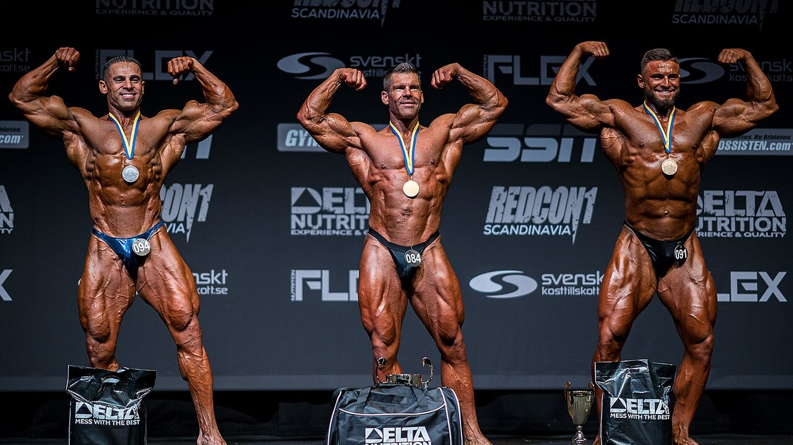
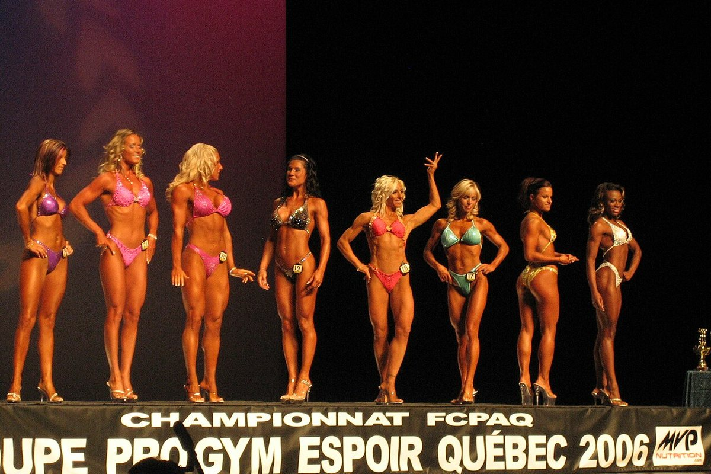
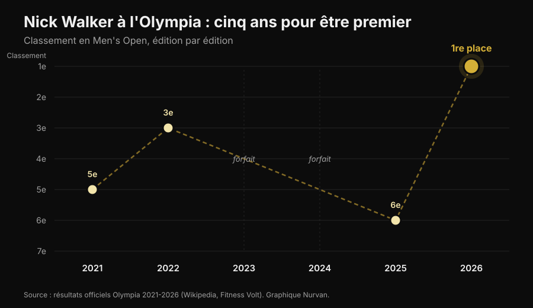
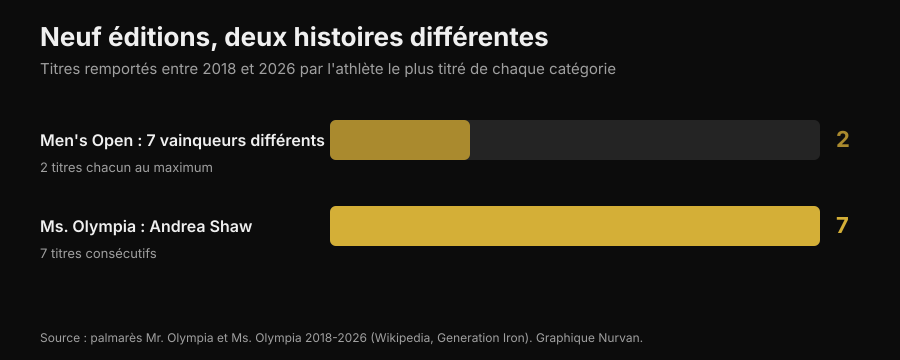
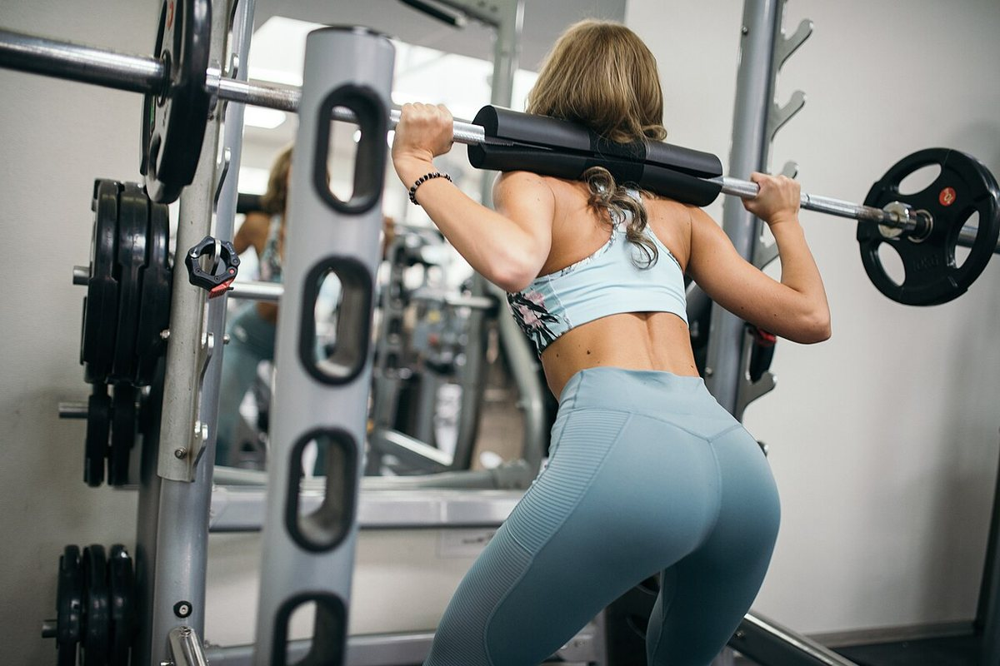

# Mr. Olympia 2026 : Nick Walker a gagné, et son parcours dit plus que le podium

Le 27 septembre 2026, à Las Vegas, Nick Walker a remporté son premier Mr. Olympia. Tu trouveras ici les résultats vérifiés de toutes les catégories. Mais surtout la partie qui intéresse celui qui s'entraîne : ce qu'il a vraiment fallu pour y arriver, et ce qui, dans tout ça, vaut aussi pour toi.

Par [Giammaria Loi](/autore/giammaria-loi) · mis à jour le 3 octobre 2026

## En bref

- Nick Walker a gagné la 62e édition du Mr. Olympia Men's Open le 27 septembre 2026 à Las Vegas, avec un prix de 600 000 dollars. Samson Dauda termine deuxième, Derek Lunsford troisième.
- Walker a gagné tout en perdant la soirée des finales : le score du prejudging, attribué la veille, lui a donné la marge décisive.
- C'était son sixième Olympia en six ans : 5e en 2021, 3e en 2022, deux éditions manquées pour blessure et choix technique, 6e en 2025. La régularité sur plusieurs années, et non une préparation exceptionnelle, est la variable qui le distingue.
- Sur les neuf dernières éditions, le Men's Open a eu sept vainqueurs différents, alors qu'Andrea Shaw vient de boucler son septième Ms. Olympia d'affilée : la stabilité n'est pas une règle de ce sport, c'est une caractéristique de certains athlètes.
- Ce que tu vois sur scène n'est pas reproductible chez toi. Mais trois choses le sont : augmenter le volume avec méthode, emmener les séries près de l'échec et garder les protéines hautes quand tu coupes. Sur ces trois points, la littérature est d'accord.

*Podium d'une compétition de bodybuilding. Photo : Rikard Strömmer, Wikimedia Commons, CC BY-SA 4.0.*

## Qui a gagné : les résultats vérifiés

La 62e édition du Joe Weider's Olympia s'est tenue du 24 au 27 septembre 2026 à Las Vegas : prejudging et Expo au Las Vegas Convention Center, finales du vendredi et du samedi soir à la Orleans Arena. Douze catégories au programme.

Dans le **Men's Open**, la catégorie reine :

| Place | Athlète | Pays |
|---|---|---|
| 1 | Nick Walker | États-Unis |
| 2 | Samson Dauda | Royaume-Uni |
| 3 | Derek Lunsford | États-Unis |
| 4 | Andrew Jacked | Émirats arabes unis |
| 5 | Tonio Burton | États-Unis |

Le premier prix vaut 600 000 dollars. L'Italien Andrea Presti était en lice et a terminé ex æquo à la 16e place.

*Les comparaisons du prejudging décident la compétition plus que la soirée finale. Photo : Joey Berzowska, Wikimedia Commons, CC BY 2.0.*

Les autres vainqueurs des catégories principales : **Classic Physique** Niall Darwen, premier titre ; **212** Keone Pearson, quatrième d'affilée ; **Men's Physique** Ryan Terry ; **Ms. Olympia** Andrea Shaw ; **Bikini** Jasmine Gonzalez ; **Wellness** Eduarda Bezerra ; **Figure** Lola Montez ; **Women's Physique** Natalia Abraham Coelho ; **Fitness** Michelle Fredua-Mensah ; **Wheelchair** Blake Colleton.

### Le détail que presque personne n'a raconté

Le classement fonctionne à l'envers : gagne celui qui totalise le moins de points, en additionnant prejudging et finale. Walker a fait 8 au prejudging et 10 en finale, soit 18. Dauda a fait 15 et 5, soit 20.

Traduction : **Dauda a gagné la soirée de la finale et a perdu la compétition.** L'écart s'était creusé au prejudging, quand les lumières sont plates, qu'il n'y a pas de public et que les juges observent les comparaisons pendant plusieurs minutes. Ça vaut aussi en dehors du bodybuilding : la performance qui compte n'est souvent pas celle du grand soir.

## Cinq ans pour arriver premier

Le parcours de Walker à l'Olympia n'est pas une courbe propre.

*Les classements de Nick Walker à l'Olympia de 2021 à 2026 — Données : résultats officiels des six éditions. Graphique Nurvan.*

Débuts en 2021 avec une cinquième place, la même année où il avait gagné l'Arnold Classic. Troisième en 2022. En 2023, il se retire peu avant la compétition après une déchirure à l'ischio-jambier en préparation. En 2024, il se qualifie en gagnant le New York Pro, puis renonce. Sixième en 2025. En 2026, il finit deuxième à l'Arnold Classic en mars, gagne le Tampa Pro en août, puis l'Olympia en septembre.

Deux années sur six, il n'est même pas monté sur scène, et l'année du titre il avait perdu la compétition la plus importante du printemps. **La carrière qui a produit cette victoire n'est pas une série de performances parfaites : c'est une série longue.** Ce n'est pas un détail romantique, c'est le mécanisme. L'hypertrophie répond à la charge accumulée dans le temps, et le temps où tu ne t'entraînes pas ne compte pas.

## Neuf éditions, deux histoires opposées

De 2018 à 2026, le Men's Open a eu sept vainqueurs différents en neuf éditions : Shawn Rhoden, Brandon Curry, Mamdouh Elssbiay (deux fois), Hadi Choopan, Derek Lunsford (deux fois), Samson Dauda et maintenant Nick Walker. Aucune hégémonie. Pour mesurer à quel point c'est inhabituel : le record historique est de huit titres, détenu par Lee Haney (1984-1991) et Ronnie Coleman (1998-2005), et Phil Heath en a gagné sept de suite de 2011 à 2017.

Sur la même période, en Ms. Olympia, Andrea Shaw vient de décrocher un septième titre consécutif, dépassant Cory Everson et se plaçant troisième de tous les temps derrière Iris Kyle (10) et Lenda Murray (8).

*Titres gagnés de 2018 à 2026 par l'athlète le plus titré de chaque catégorie — Données : palmarès Mr. Olympia et Ms. Olympia. Graphique Nurvan.*

Deux catégories, même période, même fédération, résultats opposés. La raison n'a rien de mystérieux : le jugement est subjectif, et le « meilleur physique » change avec les goûts du panel et avec les athlètes présents cette année-là. Qui poursuit un jugement poursuit une cible qui bouge.

C'est pour ça que, si tu t'entraînes sans compétir, mieux vaut choisir des objectifs qui se mesurent : charges, répétitions, circonférences, poids. Sur ceux-là, la cible reste immobile. Et si tu te demandes quelle part de ta réponse à l'entraînement dépend de la génétique, on en a parlé dans l'article sur les [faibles et forts répondeurs](/blog/genetique-faibles-repondeurs).

## Ce que dit vraiment la recherche

Le bodybuilding professionnel vit d'affirmations répétées jusqu'à paraître vraies. Voici les plus courantes, passées au filtre de la littérature.

**« Il faut le plus de volume possible. »** → **À nuancer.** La relation dose-réponse existe : une méta-analyse de Schoenfeld et ses collègues sur 15 études a estimé que chaque série hebdomadaire supplémentaire ajoute environ 0,37 % de gain de masse, avec une différence de 3,9 % entre les groupes à volume élevé et ceux à volume bas au sein d'une même étude. Une méta-régression de 2025 sur 67 études et 2 058 participants confirme la croissance, mais avec des **rendements décroissants** : plus tu montes, moins les séries en plus rapportent. Et chez les athlètes déjà entraînés, les résultats sont contradictoires, au point qu'on ne sait pas où se situe le point de saturation.

**« Il faut toujours aller à l'échec. »** → **À nuancer.** Une méta-régression de 2024 a analysé la distance à l'échec en répétitions en réserve (RIR : combien de répétitions tu aurais encore pu faire). Pour l'**hypertrophie**, les gains augmentent à mesure que les séries finissent près de l'échec. Pour la **force**, ils sont similaires sur un large intervalle de RIR : pas besoin d'aller à l'épuisement. Les auteurs invitent à la prudence, car les RIR ont été estimés après coup à partir des descriptions des protocoles.

**« La fréquence élevée est indispensable pour grossir. »** → **Faux, pour l'hypertrophie.** Dans la même méta-régression de 2025, à volume hebdomadaire égal, la fréquence a un effet compatible avec zéro sur l'hypertrophie. Sur la force, en revanche, la fréquence compte, toujours avec des rendements décroissants. Étaler les mêmes séries sur plus de séances t'aide sur la barre, pas sur le tour de bras.

**« En sèche, on baisse les protéines en même temps que les calories. »** → **Faux.** Les recommandations pour les athlètes de physique vont dans le sens inverse : 1,8-2,7 g par kg de poids corporel selon la revue de Roberts et ses collègues, 2,3-3,1 g par kg de masse maigre dans les recommandations de Helms, Aragon et Fitschen pour le bodybuilding naturel. Quand le déficit calorique augmente, la part protéique sert à protéger le muscle. On en a écrit le détail dans l'article sur les [protéines en sèche](/blog/proteines-en-seche).

**« Maigrir vite avant une compétition ou un événement, ça marche. »** → **Faux.** Les mêmes recommandations indiquent des pertes de poids d'environ 0,5-1 % par semaine, et les travaux les plus récents descendent à ≤0,5 % pour limiter la perte de masse maigre.

**« La peak week avec surcharge en glucides et en liquides fait la différence. »** → **Non vérifiable, et en partie risqué.** Une revue de 2024 a constaté que ces pratiques sont très répandues chez les athlètes de physique, mais qu'**il manque des preuves expérimentales qu'elles améliorent le résultat en compétition**. La manipulation de l'eau et des électrolytes dans les dernières heures repose sur des mécanismes supposés et peut être dangereuse : ce n'est pas quelque chose à improviser pour « sécher » avant un événement.

**« Se préparer pour une compétition, c'est bon pour la santé. »** → **Faux.** Une revue systématique de 11 études de cas portant sur 15 athlètes se déclarant naturels a documenté des altérations marquées de la composition corporelle, de la performance neuromusculaire, des hormones et de l'humeur pendant la préparation, avec une forte variabilité individuelle. Les recommandations sur le bodybuilding naturel alertent sur le risque accru de troubles du comportement alimentaire et de l'image du corps dans les sports esthétiques, et recommandent l'accès à des professionnels de la santé mentale.

*Le travail qui produit des résultats est celui qu'on répète pendant des années. Photo : Nenad Stojkovic, Wikimedia Commons, CC BY 2.0.*

## Comment l'appliquer

Rien de ce qu'on a vu sur la scène de Las Vegas n'est reproductible sans pharmacologie, génétique et une vie construite autour de l'entraînement. Ces quatre choses, en revanche, le sont.

1. **Monte le volume par paliers.** Si tu fais aujourd'hui 8 séries hebdomadaires par groupe musculaire, essaie 10-12 pendant quelques semaines et regarde ce qui arrive aux charges et à la récupération. La courbe monte mais s'aplatit : doubler le volume ne double pas les résultats, et augmente la fatigue et le risque.
2. **Approche-toi de l'échec sur les séries qui comptent.** Pour l'hypertrophie, garde les dernières séries de chaque exercice à 1-2 RIR. Pour la force, inutile : tu peux travailler à 3-4 RIR et gagner autant, avec beaucoup moins de coût en récupération.
3. **Utilise la fréquence pour la technique, pas pour grossir.** Répartir le volume sur plus de séances rend chaque séance plus fraîche et le mouvement plus propre. Mais si le total hebdomadaire ne change pas, n'attends pas plus d'hypertrophie.
4. **Ne coupe pas les protéines quand tu coupes les calories.** 1,8-2,7 g par kg de poids corporel est l'intervalle rapporté dans les études sur les athlètes de physique. Et ne sois pas pressé : 0,5-1 % du poids par semaine est le rythme qui préserve le mieux la masse maigre.

Les chiffres ci-dessus sont des intervalles observés dans les études, pas une prescription. Si tu as des pathologies, prends des médicaments ou suis un régime sur indication médicale, parles-en à ton médecin avant de changer quoi que ce soit.

> ### Nurvan — la progression ne se voit que si tu l'enregistres
>
> L'écart entre le 2021 et le 2026 d'un athlète ne se voit pas sur une séance : il se voit sur la série historique. Nurvan enregistre charges, répétitions et RIR séance après séance, te propose automatiquement les séries d'échauffement et montre l'évolution de chaque exercice dans le temps, pour que tu saches si tu progresses vraiment ou si tu répètes le même entraînement.
>
> **[Essaie Nurvan](https://nurvan.app)**

## Questions fréquentes

**Qui a gagné le Mr. Olympia 2026 ?**
Nick Walker, américain, a gagné le Men's Open de la 62e édition le 27 septembre 2026 à Las Vegas. C'est son premier titre Olympia. Samson Dauda est deuxième, Derek Lunsford troisième.

**Quand et où a eu lieu le Mr. Olympia 2026 ?**
Du 24 au 27 septembre 2026 à Las Vegas, dans le Nevada. Prejudging et Expo au Las Vegas Convention Center, finales du vendredi et du samedi à la Orleans Arena.

**Combien Nick Walker a-t-il gagné ?**
Le premier prix du Men's Open est de 600 000 dollars. Walker a aussi reçu le People's Champion Award, pour la deuxième fois de sa carrière.

**L'Italien Andrea Presti a-t-il participé au Mr. Olympia 2026 ?**
Oui, Andrea Presti était en lice dans le Men's Open et a terminé ex æquo à la 16e place.

**Peut-on obtenir un physique comme ça en s'entraînant bien ?**
Non. Les physiques du Men's Open sont le résultat d'une génétique extrême, d'années d'entraînement à plein temps et de protocoles pharmacologiques. Un entraînement et une alimentation bien faits donnent des résultats réels, mais d'un autre ordre de grandeur.

## À lire aussi

- [Faible répondeur : le poids de la génétique dans le muscle](/blog/genetique-faibles-repondeurs) — pourquoi deux personnes qui suivent le même programme n'obtiennent pas le même résultat.
- [Protéines en sèche : combien en faut-il vraiment](/blog/proteines-en-seche) — l'intervalle qui protège la masse maigre quand tu coupes les calories.

## Sources

1. Pelland JC, Remmert JF, Robinson ZP, Hinson SR, Zourdos MC, 2025. *The Resistance Training Dose Response: Meta-Regressions Exploring the Effects of Weekly Volume and Frequency on Muscle Hypertrophy and Strength Gains.* Sports Medicine 56(2):481-505. PMID 41343037 — [DOI](https://doi.org/10.1007/s40279-025-02344-w)
2. Schoenfeld BJ, Ogborn D, Krieger JW, 2017. *Dose-response relationship between weekly resistance training volume and increases in muscle mass: A systematic review and meta-analysis.* Journal of Sports Sciences 35(11):1073-1082. PMID 27433992 — [DOI](https://doi.org/10.1080/02640414.2016.1210197)
3. Robinson ZP, Pelland JC, Remmert JF, Refalo MC, Jukic I, Steele J, Zourdos MC, 2024. *Exploring the Dose-Response Relationship Between Estimated Resistance Training Proximity to Failure, Strength Gain, and Muscle Hypertrophy: A Series of Meta-Regressions.* Sports Medicine 54(9):2209-2231. PMID 38970765 — [DOI](https://doi.org/10.1007/s40279-024-02069-2)
4. Camargo JBB, Bittencourt D, Silva DG, Bergamasco JGA, Michel JM, Roberts MD, Libardi CA, 2025. *Is there a volume saturation point for muscle hypertrophy in resistance-trained individuals? A narrative review.* European Journal of Applied Physiology 125(11):3065-3081. PMID 40883636 — [DOI](https://doi.org/10.1007/s00421-025-05959-z)
5. Roberts BM, Helms ER, Trexler ET, Fitschen PJ, 2020. *Nutritional Recommendations for Physique Athletes.* Journal of Human Kinetics 71:79-108. PMID 32148575 — [DOI](https://doi.org/10.2478/hukin-2019-0096)
6. Helms ER, Aragon AA, Fitschen PJ, 2014. *Evidence-based recommendations for natural bodybuilding contest preparation: nutrition and supplementation.* Journal of the International Society of Sports Nutrition 11:20. PMID 24864135 — [DOI](https://doi.org/10.1186/1550-2783-11-20)
7. Homer KA, Cross MR, Helms ER, 2024. *Peak Week Carbohydrate Manipulation Practices in Physique Athletes: A Narrative Review.* Sports Medicine - Open 10(1):8. PMID 38218750 — [DOI](https://doi.org/10.1186/s40798-024-00674-z)
8. Schoenfeld BJ, Androulakis-Korakakis P, Piñero A, Burke R, Coleman M, Mohan AE, Escalante G, Rukstela A, Campbell B, Helms E, 2023. *Alterations in Measures of Body Composition, Neuromuscular Performance, Hormonal Levels, Physiological Adaptations, and Psychometric Outcomes during Preparation for Physique Competition: A Systematic Review of Case Studies.* Journal of Functional Morphology and Kinesiology 8(2):59. PMID 37218855 — [DOI](https://doi.org/10.3390/jfmk8020059)

Sources scientifiques récupérées sur PubMed. Résultats, dates, lieu et palmarès vérifiés sur [Wikipedia — 2026 Mr. Olympia](https://en.wikipedia.org/wiki/2026_Mr._Olympia), [Fitness Volt](https://fitnessvolt.com/2026-mr-olympia-results/) et [Generation Iron](https://generationiron.com/2026-mr-olympia-results-all-divisions/), consultés le 3 octobre 2026.

---

**Giammaria Loi** est le fondateur de Nurvan. Il s'entraîne avec les poids depuis 2012, travaille comme personal trainer et coach certifié FIPE depuis 2013 et compétit en powerlifting au niveau national depuis 2018. Chaque article qu'il signe part de la recherche scientifique et arrive à ce qui fonctionne vraiment en salle.

> Note : contenu informatif, il ne remplace pas l'avis d'un médecin ou d'un professionnel.
