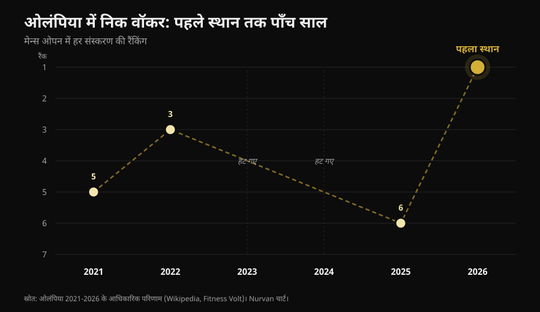
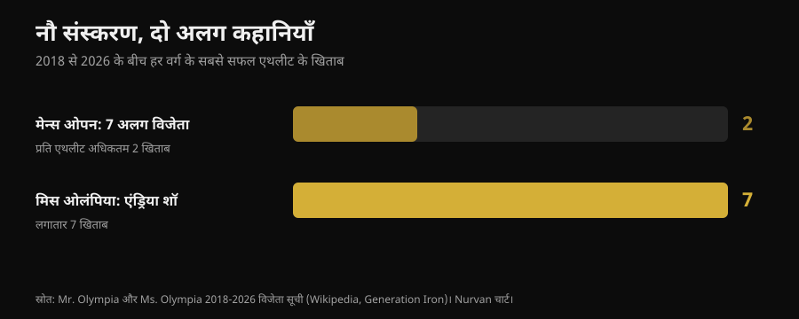

# मिस्टर ओलंपिया 2026: जीते निक वॉकर, और उनकी कहानी पोडियम से ज्यादा बताती है

27 सितंबर 2026 को लास वेगास में निक वॉकर (Nick Walker) ने अपना पहला मिस्टर ओलंपिया जीता। यहाँ आपको हर डिविजन के वेरिफाइड रिजल्ट मिलेंगे, लेकिन असली काम की बात वह है जो ट्रेनिंग करने वाले के लिए मायने रखती है: वहाँ तक पहुँचने में असल में क्या लगा, और उसमें से कौन सी चीजें आप पर भी लागू होती हैं।

लेखक: [Giammaria Loi](/autore/giammaria-loi) · 3 अक्टूबर 2026 को अपडेट किया गया

## संक्षेप में

- निक वॉकर ने 27 सितंबर 2026 को लास वेगास में 62वें मिस्टर ओलंपिया का Men's Open जीता, प्राइज मनी 600,000 डॉलर। दूसरे स्थान पर सैमसन दाउदा (Samson Dauda), तीसरे पर डेरेक लंसफोर्ड (Derek Lunsford)।
- वॉकर फाइनल की शाम हार गए थे, फिर भी जीते: एक दिन पहले हुए prejudging का स्कोर उन्हें निर्णायक मार्जिन दे गया।
- यह छह साल में उनका छठा ओलंपिया था: 2021 में 5वां, 2022 में 3रा, दो एडिशन चोट और तकनीकी फैसले के कारण छोड़े, 2025 में 6ठा। उन्हें अलग करने वाली चीज कोई असाधारण प्रिपरेशन नहीं, बल्कि कई सालों तक बनी रही निरंतरता है।
- पिछले नौ एडिशन में Men's Open को सात अलग-अलग विजेता मिले, जबकि एंड्रिया शॉ (Andrea Shaw) ने लगातार सातवां Ms. Olympia जीत लिया: स्थिरता इस खेल का नियम नहीं है, यह कुछ खास एथलीटों की खासियत है।
- स्टेज पर जो दिखता है वह घर पर दोहराया नहीं जा सकता, लेकिन तीन चीजें दोहराई जा सकती हैं: volume को समझदारी से बढ़ाना, sets को failure के करीब ले जाना, और कैलोरी काटते समय प्रोटीन ऊँचा रखना। इन तीन पर रिसर्च एकमत है।

*एक बॉडीबिल्डिंग मुकाबले का पोडियम। फोटो: Rikard Strömmer, Wikimedia Commons, CC BY-SA 4.0.*

## किसने जीता: वेरिफाइड रिजल्ट

Joe Weider's Olympia का 62वां एडिशन 24 से 27 सितंबर 2026 तक लास वेगास में हुआ: prejudging और Expo लास वेगास कन्वेंशन सेंटर में, शुक्रवार और शनिवार रात के फाइनल ऑर्लियन्स एरीना में। कार्यक्रम में बारह डिविजन थे।

**Men's Open** में, यानी सबसे बड़ी कैटेगरी में:

| स्थान | एथलीट | देश |
|---|---|---|
| 1 | Nick Walker | अमेरिका |
| 2 | Samson Dauda | यूनाइटेड किंगडम |
| 3 | Derek Lunsford | अमेरिका |
| 4 | Andrew Jacked | संयुक्त अरब अमीरात |
| 5 | Tonio Burton | अमेरिका |

पहले इनाम की राशि 600,000 डॉलर है। इटली के आंद्रेया प्रेस्ती (Andrea Presti) भी मुकाबले में थे और संयुक्त रूप से 16वें स्थान पर रहे।

*prejudging के कंपैरिजन फाइनल की शाम से ज्यादा तय करते हैं। फोटो: Joey Berzowska, Wikimedia Commons, CC BY 2.0.*

बाकी मुख्य डिविजन के विजेता: **Classic Physique** नायल डारवेन (Niall Darwen), पहला खिताब; **212** कियोन पियरसन (Keone Pearson), लगातार चौथा; **Men's Physique** रायन टेरी (Ryan Terry); **Ms. Olympia** एंड्रिया शॉ; **Bikini** जैस्मीन गोंजालेज (Jasmine Gonzalez); **Wellness** एडुआर्डा बेजेरा (Eduarda Bezerra); **Figure** लोला मोंटेज (Lola Montez); **Women's Physique** नताल्या अब्राहम कोएल्हो (Natalia Abraham Coelho); **Fitness** मिशेल फ्रेदुआ-मेंसा (Michelle Fredua-Mensah); **Wheelchair** ब्लेक कोलटन (Blake Colleton)।

### वह डिटेल जो लगभग किसी ने नहीं बताई

स्कोरिंग उल्टी चलती है: जीतता वह है जिसके कम पॉइंट बनते हैं, prejudging और फाइनल जोड़कर। वॉकर ने prejudging में 8 और फाइनल में 10 किया, कुल 18। दाउदा ने 15 और 5 किया, कुल 20।

मतलब साफ है: **दाउदा ने फाइनल की शाम जीती और मुकाबला हार गए।** फासला prejudging में बन गया था, जब लाइटें सपाट होती हैं, दर्शक नहीं होते और जज कई मिनट तक कंपैरिजन देखते हैं। यह बात बॉडीबिल्डिंग के बाहर भी लागू होती है: जो परफॉर्मेंस मायने रखती है, वह अक्सर बड़े मौके वाली परफॉर्मेंस नहीं होती।

## पहले स्थान तक पहुँचने में पाँच साल

ओलंपिया में वॉकर की कहानी कोई सीधी, साफ चढ़ाई नहीं है।

*2021 से 2026 तक ओलंपिया में निक वॉकर के स्थान — डेटा: छह एडिशन के ऑफिशियल रिजल्ट। चार्ट Nurvan.*

डेब्यू 2021 में पाँचवें स्थान के साथ, उसी साल जब उन्होंने Arnold Classic जीता था। 2022 में तीसरे। 2023 में प्रिपरेशन के दौरान हैमस्ट्रिंग में खिंचाव आने से मुकाबले से कुछ पहले नाम वापस ले लिया। 2024 में New York Pro जीतकर क्वालिफाई किया और फिर हिस्सा नहीं लिया। 2025 में छठे। 2026 में मार्च में Arnold Classic में दूसरे रहे, अगस्त में Tampa Pro जीता और सितंबर में ओलंपिया।

छह में से दो साल वे स्टेज पर चढ़े ही नहीं, और जिस साल खिताब मिला उसी साल वसंत का सबसे बड़ा मुकाबला हार चुके थे। **जिस करियर ने यह जीत दी, वह परफेक्ट परफॉर्मेंस की सीरीज नहीं है: वह एक लंबी सीरीज है।** यह कोई भावुक डिटेल नहीं, यही मैकेनिज्म है। hypertrophy समय के साथ जमा हुए लोड पर प्रतिक्रिया देती है, और जिस समय में आप ट्रेनिंग नहीं करते वह गिनती में नहीं आता।

## नौ एडिशन, दो उलटी कहानियाँ

2018 से 2026 तक नौ एडिशन में Men's Open को सात अलग-अलग विजेता मिले: शॉन रोडेन (Shawn Rhoden), ब्रैंडन करी (Brandon Curry), ममदौह एल्सबिए (Mamdouh Elssbiay) (दो बार), हादी चूपान (Hadi Choopan), डेरेक लंसफोर्ड (दो बार), सैमसन दाउदा और अब निक वॉकर। कोई दबदबा नहीं। यह कितना असामान्य है, यह समझने के लिए: ऐतिहासिक रिकॉर्ड आठ खिताब का है, ली हेनी (Lee Haney) (1984-1991) और रॉनी कोलमैन (Ronnie Coleman) (1998-2005) के नाम, और फिल हीथ (Phil Heath) ने 2011 से 2017 तक लगातार सात जीते।

इसी दौर में Ms. Olympia में एंड्रिया शॉ ने अभी लगातार सातवां खिताब पूरा किया है, कोरी एवरसन (Cory Everson) को पीछे छोड़कर और आइरिस काइल (Iris Kyle) (10) तथा लेंडा मरे (Lenda Murray) (8) के बाद हर समय की तीसरी जगह लेकर।

*2018 से 2026 तक हर डिविजन के सबसे ज्यादा खिताब वाले एथलीट द्वारा जीते गए खिताब — डेटा: मिस्टर ओलंपिया और Ms. Olympia की विजेता सूची। चार्ट Nurvan.*

दो डिविजन, एक ही दौर, एक ही फेडरेशन, नतीजे उलटे। वजह कोई रहस्य नहीं है: जजिंग सब्जेक्टिव है, और "सबसे अच्छी बॉडी" पैनल की पसंद के साथ और उस साल कौन आया है उसके साथ बदलती रहती है। जो किसी के जजमेंट के पीछे भागता है, वह हिलते हुए निशाने के पीछे भागता है।

इसीलिए, अगर आप ट्रेनिंग करते हैं और कॉम्पिटिशन नहीं करते, तो ऐसे लक्ष्य चुनना बेहतर है जो नापे जा सकें: वजन, reps, नाप और बॉडीवेट। उन पर निशाना स्थिर रहता है। और अगर आप सोचते हैं कि ट्रेनिंग के प्रति आपकी प्रतिक्रिया में जेनेटिक्स का कितना हाथ है, तो इस पर हमने [लो रेस्पॉन्डर: मांसपेशियों के विकास में जेनेटिक्स की कितनी भूमिका है](/blog/genetics-muscle-low-responders) में लिखा है।

## रिसर्च असल में क्या कहती है

प्रोफेशनल बॉडीबिल्डिंग ऐसे दावों पर चलती है जो इतनी बार दोहराए जाते हैं कि सच लगने लगते हैं। यहाँ सबसे आम दावे हैं, रिसर्च की कसौटी पर।

**"volume जितना ज्यादा हो सके, उतना चाहिए।"** → **स्पष्ट करने की जरूरत।** dose-response संबंध मौजूद है: Schoenfeld और सहयोगियों की 15 स्टडीज पर मेटा-एनालिसिस का अनुमान है कि हफ्ते में हर एक अतिरिक्त set मसल मास में लगभग 0.37% बढ़त जोड़ता है, और एक ही स्टडी के भीतर हाई-volume और लो-volume ग्रुप के बीच 3.9% का अंतर रहा। 2025 की एक मेटा-रिग्रेशन, 67 स्टडीज और 2,058 प्रतिभागियों पर, इस बढ़त की पुष्टि करती है, लेकिन **घटते रिटर्न** के साथ: जितना ऊपर जाते हैं, अतिरिक्त sets उतना ही कम देते हैं। और पहले से ट्रेन्ड एथलीटों में नतीजे आपस में उलझे हुए हैं, इतने कि saturation point कहाँ है यह हमें नहीं पता।

**"हमेशा failure तक जाना चाहिए।"** → **स्पष्ट करने की जरूरत।** 2024 की एक मेटा-रिग्रेशन ने failure से दूरी को reps in reserve में देखा (RIR: आप और कितने reps कर सकते थे)। **hypertrophy** के लिए फायदे तब बढ़ते हैं जब sets failure के करीब खत्म होते हैं। **strength** के लिए नतीजे RIR की एक बड़ी रेंज में एक जैसे हैं: थकान की हद तक जाना जरूरी नहीं। लेखक सावधानी की सलाह देते हैं, क्योंकि RIR का अनुमान बाद में प्रोटोकॉल के विवरण से लगाया गया था।

**"बढ़ने के लिए हाई frequency जरूरी है।"** → **गलत, hypertrophy के लिए।** उसी 2025 की मेटा-रिग्रेशन में, साप्ताहिक volume एक समान रखने पर frequency का असर hypertrophy पर शून्य के अनुरूप निकला। strength पर frequency मायने रखती है, पर वहाँ भी घटते रिटर्न के साथ। उतने ही sets को ज्यादा सेशन में बाँटना आपको बारबेल पर मदद करता है, बाँह की नाप पर नहीं।

**"कटिंग में प्रोटीन कैलोरी के साथ ही घटा देना चाहिए।"** → **गलत।** physique एथलीटों के लिए गाइडलाइन उलटी दिशा में जाती हैं: Roberts और सहयोगियों की रिव्यू के अनुसार 1.8-2.7 ग्राम प्रति किलो बॉडीवेट, और नैचुरल बॉडीबिल्डिंग के लिए Helms, Aragon और Fitschen की सिफारिशों में 2.3-3.1 ग्राम प्रति किलो लीन मास। जब कैलोरी डेफिसिट बढ़ता है, तो प्रोटीन का हिस्सा मसल बचाने का काम करता है। इस पर हमने विस्तार से [कटिंग में प्रोटीन: असल में कितना चाहिए](/blog/protein-for-fat-loss-phase) में लिखा है।

**"किसी मुकाबले या इवेंट से पहले तेजी से वजन घटाना काम करता है।"** → **गलत।** वही सिफारिशें हफ्ते में लगभग 0.5-1% वजन घटाने की बात करती हैं, और सबसे नई रिसर्च लीन मास का नुकसान सीमित रखने के लिए इसे ≤0.5% तक ले आती है।

**"कार्ब और पानी की लोडिंग वाली peak week फर्क डालती है।"** → **जाँचा नहीं जा सकता, और कुछ हद तक जोखिम भरा।** 2024 की एक रिव्यू में पाया गया कि ये तरीके physique एथलीटों में बहुत आम हैं, लेकिन **इस बात के प्रयोगात्मक सबूत नहीं हैं कि ये मुकाबले का नतीजा सुधारते हैं।** आखिरी घंटों में पानी और इलेक्ट्रोलाइट्स की हेराफेरी अनुमानित मैकेनिज्म पर टिकी है और खतरनाक हो सकती है: किसी इवेंट से पहले "सूखने" के लिए इसे अपने मन से आजमाने वाली चीज नहीं है।

**"मुकाबले की तैयारी सेहत के लिए अच्छी होती है।"** → **गलत।** खुद को नैचुरल बताने वाले 15 एथलीटों पर 11 केस स्टडी की एक सिस्टेमैटिक रिव्यू ने प्रिपरेशन के दौरान बॉडी कंपोजिशन, न्यूरोमस्कुलर परफॉर्मेंस, हॉर्मोन और मूड में बड़े बदलाव दर्ज किए, जिनमें व्यक्ति-दर-व्यक्ति बहुत भिन्नता थी। नैचुरल बॉडीबिल्डिंग की गाइडलाइन एस्थेटिक खेलों में ईटिंग और बॉडी-इमेज से जुड़ी समस्याओं के बढ़े जोखिम की चेतावनी देती हैं, और मानसिक स्वास्थ्य पेशेवरों तक पहुँच की सलाह देती हैं।

*नतीजे देने वाला काम वही है जो सालों तक दोहराया जाता है। फोटो: Nenad Stojkovic, Wikimedia Commons, CC BY 2.0.*

## इसे कैसे लागू करें

लास वेगास के स्टेज पर जो दिखा, उसमें से कुछ भी फार्माकोलॉजी, जेनेटिक्स और ट्रेनिंग के इर्द-गिर्द बनी पूरी जिंदगी के बिना दोहराया नहीं जा सकता। ये चार चीजें दोहराई जा सकती हैं।

1. **volume धीरे-धीरे बढ़ाएँ।** अगर आप आज हर मसल ग्रुप के लिए हफ्ते में 8 sets करते हैं, तो कुछ हफ्तों के लिए 10-12 आजमाएँ और देखें कि वजन और रिकवरी पर क्या असर पड़ता है। कर्व ऊपर जाता है पर सपाट होने लगता है: volume दोगुना करने से नतीजे दोगुने नहीं होते, और थकान तथा जोखिम बढ़ जाते हैं।
2. **जो sets मायने रखते हैं, उनमें failure के करीब जाएँ।** hypertrophy के लिए हर exercise के आखिरी sets 1-2 RIR पर रखें। strength के लिए इसकी जरूरत नहीं: आप 3-4 RIR पर काम करके भी उतना ही पा सकते हैं, और रिकवरी की कीमत बहुत कम चुकानी पड़ती है।
3. **frequency का इस्तेमाल तकनीक के लिए करें, बढ़ने के लिए नहीं।** volume को ज्यादा सेशन में बाँटने से हर सेशन ताजा रहता है और मूवमेंट साफ होता है। लेकिन अगर हफ्ते का कुल नहीं बदलता, तो ज्यादा hypertrophy की उम्मीद न रखें।
4. **कैलोरी काटते समय प्रोटीन न काटें।** physique एथलीटों पर हुई स्टडीज में 1.8-2.7 ग्राम प्रति किलो बॉडीवेट की रेंज बताई गई है। और जल्दबाजी न करें: हफ्ते में 0.5-1% वजन वह रफ्तार है जो लीन मास को सबसे बेहतर बचाती है।

ऊपर दिए नंबर स्टडीज में देखी गई रेंज हैं, कोई प्रिस्क्रिप्शन नहीं। अगर आपको कोई बीमारी है, आप दवाएँ लेते हैं या डॉक्टर की सलाह पर कोई डाइट लेते हैं, तो कुछ भी बदलने से पहले अपने डॉक्टर से बात करें।

> ### Nurvan — प्रोग्रेस तभी दिखती है जब आप उसे रिकॉर्ड करें
>
> किसी एथलीट के 2021 और 2026 के बीच का फर्क एक सेशन में नहीं दिखता: वह सालों की सीरीज में दिखता है। Nurvan हर सेशन में weight, reps और RIR रिकॉर्ड करता है, warm-up sets अपने आप सुझाता है और हर exercise की लंबी अवधि की प्रोग्रेस दिखाता है, जिससे आप समझ पाते हैं कि आप सच में आगे बढ़ रहे हैं या वही ट्रेनिंग दोहरा रहे हैं।
>
> **[Nurvan आज़माएँ](https://nurvan.app)**

## अक्सर पूछे जाने वाले सवाल

**मिस्टर ओलंपिया 2026 कौन जीता?**
अमेरिका के निक वॉकर ने 27 सितंबर 2026 को लास वेगास में 62वें एडिशन का Men's Open जीता। यह उनका पहला ओलंपिया खिताब है। दूसरे स्थान पर सैमसन दाउदा, तीसरे पर डेरेक लंसफोर्ड।

**मिस्टर ओलंपिया 2026 कब और कहाँ हुआ?**
24 से 27 सितंबर 2026 तक लास वेगास, नेवाडा में। prejudging और Expo लास वेगास कन्वेंशन सेंटर में, शुक्रवार और शनिवार के फाइनल ऑर्लियन्स एरीना में।

**निक वॉकर को प्राइज मनी में कितना मिला?**
Men's Open का पहला इनाम 600,000 डॉलर का है। वॉकर को People's Champion Award भी मिला, करियर में दूसरी बार।

**मिस्टर ओलंपिया 2026 में कोई भारतीय या इटैलियन एथलीट था?**
इटली के आंद्रेया प्रेस्ती Men's Open में मुकाबला कर रहे थे और संयुक्त रूप से 16वें स्थान पर रहे।

**क्या सिर्फ अच्छी ट्रेनिंग से ऐसी बॉडी बन सकती है?**
नहीं। Men's Open की बॉडीज बेहद खास जेनेटिक्स, सालों की फुल-टाइम ट्रेनिंग और फार्माकोलॉजिकल प्रोटोकॉल का नतीजा हैं। अच्छी ट्रेनिंग और डाइट असली नतीजे देती हैं, पर पैमाना बिल्कुल अलग होता है।

## यह भी पढ़ें

- [लो रेस्पॉन्डर: मांसपेशियों के विकास में जेनेटिक्स की कितनी भूमिका है](/blog/genetics-muscle-low-responders) — एक ही प्रोग्राम करने वाले दो लोगों को एक जैसा नतीजा क्यों नहीं मिलता।
- [कटिंग में प्रोटीन: असल में कितना चाहिए](/blog/protein-for-fat-loss-phase) — कैलोरी काटते समय लीन मास बचाने वाली रेंज।

## स्रोत

1. Pelland JC, Remmert JF, Robinson ZP, Hinson SR, Zourdos MC, 2025. *The Resistance Training Dose Response: Meta-Regressions Exploring the Effects of Weekly Volume and Frequency on Muscle Hypertrophy and Strength Gains.* Sports Medicine 56(2):481-505. PMID 41343037 — [DOI](https://doi.org/10.1007/s40279-025-02344-w)
2. Schoenfeld BJ, Ogborn D, Krieger JW, 2017. *Dose-response relationship between weekly resistance training volume and increases in muscle mass: A systematic review and meta-analysis.* Journal of Sports Sciences 35(11):1073-1082. PMID 27433992 — [DOI](https://doi.org/10.1080/02640414.2016.1210197)
3. Robinson ZP, Pelland JC, Remmert JF, Refalo MC, Jukic I, Steele J, Zourdos MC, 2024. *Exploring the Dose-Response Relationship Between Estimated Resistance Training Proximity to Failure, Strength Gain, and Muscle Hypertrophy: A Series of Meta-Regressions.* Sports Medicine 54(9):2209-2231. PMID 38970765 — [DOI](https://doi.org/10.1007/s40279-024-02069-2)
4. Camargo JBB, Bittencourt D, Silva DG, Bergamasco JGA, Michel JM, Roberts MD, Libardi CA, 2025. *Is there a volume saturation point for muscle hypertrophy in resistance-trained individuals? A narrative review.* European Journal of Applied Physiology 125(11):3065-3081. PMID 40883636 — [DOI](https://doi.org/10.1007/s00421-025-05959-z)
5. Roberts BM, Helms ER, Trexler ET, Fitschen PJ, 2020. *Nutritional Recommendations for Physique Athletes.* Journal of Human Kinetics 71:79-108. PMID 32148575 — [DOI](https://doi.org/10.2478/hukin-2019-0096)
6. Helms ER, Aragon AA, Fitschen PJ, 2014. *Evidence-based recommendations for natural bodybuilding contest preparation: nutrition and supplementation.* Journal of the International Society of Sports Nutrition 11:20. PMID 24864135 — [DOI](https://doi.org/10.1186/1550-2783-11-20)
7. Homer KA, Cross MR, Helms ER, 2024. *Peak Week Carbohydrate Manipulation Practices in Physique Athletes: A Narrative Review.* Sports Medicine - Open 10(1):8. PMID 38218750 — [DOI](https://doi.org/10.1186/s40798-024-00674-z)
8. Schoenfeld BJ, Androulakis-Korakakis P, Piñero A, Burke R, Coleman M, Mohan AE, Escalante G, Rukstela A, Campbell B, Helms E, 2023. *Alterations in Measures of Body Composition, Neuromuscular Performance, Hormonal Levels, Physiological Adaptations, and Psychometric Outcomes during Preparation for Physique Competition: A Systematic Review of Case Studies.* Journal of Functional Morphology and Kinesiology 8(2):59. PMID 37218855 — [DOI](https://doi.org/10.3390/jfmk8020059)

वैज्ञानिक स्रोत PubMed से लिए गए। रिजल्ट, तारीखें, आयोजन स्थल और विजेता सूची [Wikipedia — 2026 Mr. Olympia](https://en.wikipedia.org/wiki/2026_Mr._Olympia), [Fitness Volt](https://fitnessvolt.com/2026-mr-olympia-results/) और [Generation Iron](https://generationiron.com/2026-mr-olympia-results-all-divisions/) पर वेरिफाई किए गए, 3 अक्टूबर 2026 को देखा गया।

---

**Giammaria Loi** Nurvan के फाउंडर हैं। वे 2012 से वेट ट्रेनिंग कर रहे हैं, 2013 से FIPE-सर्टिफाइड पर्सनल ट्रेनर और कोच के रूप में काम करते हैं, और 2018 से नैशनल लेवल पर पावरलिफ्टिंग में मुकाबला करते हैं। उनका हर आर्टिकल रिसर्च से शुरू होता है और वहाँ खत्म होता है जो जिम में असल में काम करता है।

> नोट: यह जानकारी देने वाला कंटेंट है, यह किसी डॉक्टर या पेशेवर की सलाह की जगह नहीं लेता।
