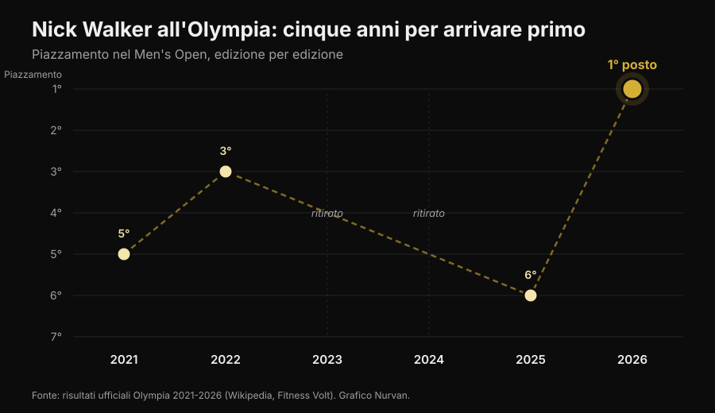
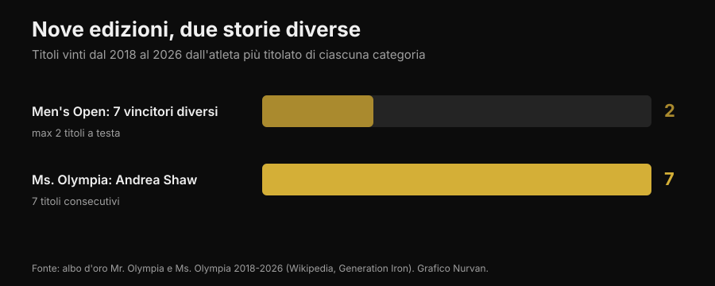

# Mr. Olympia 2026: ha vinto Nick Walker, e la sua storia dice più del podio

Il 27 settembre 2026, a Las Vegas, Nick Walker ha vinto il suo primo Mr. Olympia. Qui trovi i risultati verificati di tutte le categorie, ma soprattutto la parte che interessa chi si allena: cosa è servito davvero per arrivarci e quali di quelle cose valgono anche per te.

Di [Giammaria Loi](/autore/giammaria-loi) · aggiornato il 3 ottobre 2026

## In breve

- Nick Walker ha vinto la 62ª edizione del Mr. Olympia Men's Open il 27 settembre 2026 a Las Vegas, con un premio di 600.000 dollari. Secondo Samson Dauda, terzo Derek Lunsford.
- Walker ha vinto pur perdendo la serata delle finali: il punteggio del prejudging, dato il giorno prima, gli ha dato il margine decisivo.
- Era il suo sesto Olympia in sei anni: 5° nel 2021, 3° nel 2022, due edizioni saltate per infortunio e scelta tecnica, 6° nel 2025. La costanza su più anni, non una preparazione eccezionale, è la variabile che lo distingue.
- Nelle ultime nove edizioni il Men's Open ha avuto sette vincitori diversi, mentre Andrea Shaw ha chiuso il suo settimo Ms. Olympia consecutivo: la stabilità non è una regola dello sport, è una caratteristica di singoli atleti.
- Quello che vedi sul palco non è replicabile a casa, ma tre cose lo sono: aumentare il volume con criterio, portare le serie vicino al cedimento e tenere le proteine alte quando si taglia. Su queste tre la letteratura è concorde.

*Podio di una gara di bodybuilding. Foto: Rikard Strömmer, Wikimedia Commons, CC BY-SA 4.0.*

## Chi ha vinto: i risultati verificati

La 62ª edizione del Joe Weider's Olympia si è tenuta dal 24 al 27 settembre 2026 a Las Vegas: prejudging ed Expo al Las Vegas Convention Center, finali del venerdì e del sabato sera alla Orleans Arena. Dodici categorie in programma.

Nel **Men's Open**, la categoria regina:

| Posizione | Atleta | Paese |
|---|---|---|
| 1 | Nick Walker | Stati Uniti |
| 2 | Samson Dauda | Regno Unito |
| 3 | Derek Lunsford | Stati Uniti |
| 4 | Andrew Jacked | Emirati Arabi Uniti |
| 5 | Tonio Burton | Stati Uniti |

Il primo premio vale 600.000 dollari. L'italiano Andrea Presti era in gara e ha chiuso a pari merito in 16ª posizione.

*I confronti del prejudging decidono la gara più della serata finale. Foto: Joey Berzowska, Wikimedia Commons, CC BY 2.0.*

Gli altri vincitori delle categorie principali: **Classic Physique** Niall Darwen, al primo titolo; **212** Keone Pearson, al quarto consecutivo; **Men's Physique** Ryan Terry; **Ms. Olympia** Andrea Shaw; **Bikini** Jasmine Gonzalez; **Wellness** Eduarda Bezerra; **Figure** Lola Montez; **Women's Physique** Natalia Abraham Coelho; **Fitness** Michelle Fredua-Mensah; **Wheelchair** Blake Colleton.

### Il dettaglio che quasi nessuno ha raccontato

Il punteggio funziona al contrario: vince chi totalizza meno punti, sommando prejudging e finale. Walker ha chiuso con 8 al prejudging e 10 in finale, totale 18. Dauda ha fatto 15 e 5, totale 20.

Tradotto: **Dauda ha vinto la serata della finale e ha perso la gara.** Il distacco se l'era preso al prejudging, quando le luci sono piatte, non c'è pubblico e i giudici osservano i confronti per diversi minuti. Vale anche fuori dal bodybuilding: la prestazione che conta spesso non è quella del momento clou.

## Cinque anni per arrivare primo

La storia di Walker all'Olympia non è una parabola pulita.

*I piazzamenti di Nick Walker all'Olympia dal 2021 al 2026 — Dati: risultati ufficiali delle sei edizioni. Grafico Nurvan.*

Esordio nel 2021 con un quinto posto, nello stesso anno in cui aveva vinto l'Arnold Classic. Terzo nel 2022. Nel 2023 si è ritirato poco prima della gara per uno strappo al bicipite femorale in preparazione. Nel 2024 si è qualificato vincendo il New York Pro e poi ha rinunciato. Sesto nel 2025. Nel 2026 è arrivato secondo all'Arnold Classic a marzo, ha vinto il Tampa Pro ad agosto e l'Olympia a settembre.

Due anni su sei non è nemmeno salito sul palco, e nell'anno del titolo aveva perso la gara più importante della primavera. **La carriera che ha prodotto quella vittoria non è una serie di prestazioni perfette: è una serie lunga.** Non è un dettaglio romantico, è il meccanismo. L'ipertrofia risponde al carico accumulato nel tempo, e il tempo in cui non ti alleni non conta.

## Nove edizioni, due storie opposte

Dal 2018 al 2026 il Men's Open ha avuto sette vincitori diversi in nove edizioni: Shawn Rhoden, Brandon Curry, Mamdouh Elssbiay (due volte), Hadi Choopan, Derek Lunsford (due volte), Samson Dauda e ora Nick Walker. Nessuna egemonia. Per capire quanto sia insolito: il record storico è di otto titoli, di Lee Haney (1984-1991) e Ronnie Coleman (1998-2005), e Phil Heath ne ha vinti sette di fila dal 2011 al 2017.

Nello stesso periodo, nel Ms. Olympia, Andrea Shaw ha appena chiuso il settimo titolo consecutivo, superando Cory Everson e piazzandosi terza di sempre dietro Iris Kyle (10) e Lenda Murray (8).

*Titoli vinti dal 2018 al 2026 dall'atleta più titolato di ciascuna categoria — Dati: albo d'oro Mr. Olympia e Ms. Olympia. Grafico Nurvan.*

Due categorie, stesso periodo, stessa federazione, esiti opposti. Il motivo non è misterioso: il giudizio è soggettivo, e il "fisico migliore" cambia con i gusti del panel e con chi si presenta quell'anno. Chi insegue un giudizio insegue un bersaglio che si muove.

Per questo, se ti alleni e non gareggi, conviene scegliere obiettivi che si misurano: carichi, ripetizioni, circonferenze, peso. Su quelli il bersaglio sta fermo. E se ti chiedi quanto della tua risposta all'allenamento dipenda dalla genetica, ne abbiamo parlato nell'articolo su [high e low responder](/blog/genetica-high-low-responder).

## Cosa dice davvero la ricerca

Il bodybuilding professionistico vive di affermazioni ripetute fino a sembrare vere. Ecco le più comuni, passate dalla letteratura.

**"Serve più volume possibile."** → **Da precisare.** La relazione dose-risposta esiste: una meta-analisi di Schoenfeld e colleghi su 15 studi ha stimato che ogni serie settimanale in più aggiunge circa lo 0,37% di guadagno in massa, con una differenza del 3,9% tra i gruppi a volume alto e quelli a volume basso dentro lo stesso studio. Una meta-regressione del 2025 su 67 studi e 2.058 partecipanti conferma la crescita, ma con **rendimenti decrescenti**: più sali, meno rendono le serie in più. E negli atleti già allenati i risultati sono contraddittori, al punto che non sappiamo dove sia il punto di saturazione.

**"Bisogna sempre andare a cedimento."** → **Da precisare.** Una meta-regressione del 2024 ha analizzato la distanza dal cedimento in ripetizioni di riserva (RIR: quante ripetizioni avresti ancora potuto fare). Per l'**ipertrofia** i guadagni aumentano man mano che le serie finiscono vicino al cedimento. Per la **forza** sono simili su un ampio intervallo di RIR: non serve arrivare a sfinimento. Gli autori invitano alla prudenza, perché i RIR sono stati stimati a posteriori dalle descrizioni dei protocolli.

**"La frequenza alta è fondamentale per crescere."** → **Smentito, per l'ipertrofia.** Nella stessa meta-regressione del 2025, a parità di volume settimanale la frequenza ha un effetto compatibile con zero sull'ipertrofia. Sulla forza invece la frequenza conta, sempre con rendimenti decrescenti. Spalmare le stesse serie su più sedute ti aiuta sul bilanciere, non sul girovita del braccio.

**"In definizione le proteine si abbassano insieme alle calorie."** → **Smentito.** Le linee guida per gli atleti di physique vanno nella direzione opposta: 1,8-2,7 g per kg di peso corporeo secondo la review di Roberts e colleghi, 2,3-3,1 g per kg di massa magra nelle raccomandazioni di Helms, Aragon e Fitschen per il bodybuilding natural. Quando il deficit calorico cresce, la quota proteica serve a proteggere il muscolo. Ne abbiamo scritto in dettaglio nell'articolo sulle [proteine in definizione](/blog/proteine-in-definizione).

**"Dimagrire in fretta prima di una gara o di un evento funziona."** → **Smentito.** Le stesse raccomandazioni indicano perdite di peso di circa lo 0,5-1% a settimana, e il lavoro più recente scende a ≤0,5% per limitare la perdita di massa magra.

**"La peak week con carico di carboidrati e liquidi fa la differenza."** → **Non verificabile, e in parte rischiosa.** Una review del 2024 ha trovato che queste pratiche sono diffusissime tra gli atleti di physique, ma **mancano prove sperimentali che migliorino il risultato in gara**. La manipolazione di acqua ed elettroliti nelle ultime ore si basa su meccanismi ipotizzati e può essere pericolosa: non è qualcosa da improvvisare per "asciugarsi" prima di un evento.

**"Prepararsi per una gara fa bene alla salute."** → **Smentito.** Una revisione sistematica di 11 case study su 15 atleti dichiaratamente natural ha documentato alterazioni marcate in composizione corporea, prestazione neuromuscolare, ormoni e umore durante la preparazione, con forte variabilità individuale. Le linee guida sul bodybuilding natural avvertono del rischio aumentato di disturbi alimentari e dell'immagine corporea negli sport estetici, e raccomandano l'accesso a professionisti della salute mentale.

*Il lavoro che produce risultati è quello ripetuto per anni. Foto: Nenad Stojkovic, Wikimedia Commons, CC BY 2.0.*

## Come applicarlo

Niente di quello che si è visto sul palco di Las Vegas è replicabile senza farmacologia, genetica e una vita costruita intorno all'allenamento. Queste quattro cose invece sì.

1. **Alza il volume per gradi.** Se oggi fai 8 serie settimanali per gruppo muscolare, prova 10-12 per qualche settimana e guarda cosa succede a carichi e recupero. La curva sale ma si appiattisce: raddoppiare il volume non raddoppia i risultati, e aumenta fatica e rischio.
2. **Avvicinati al cedimento sulle serie che contano.** Per l'ipertrofia tieni le ultime serie di ogni esercizio a 1-2 RIR. Per la forza non serve: puoi lavorare con 3-4 RIR e guadagnare lo stesso, con molto meno costo di recupero.
3. **Usa la frequenza per la tecnica, non per crescere.** Dividere il volume su più sedute rende ogni sessione più fresca e il gesto più pulito. Se però il totale settimanale non cambia, non aspettarti più ipertrofia.
4. **Non tagliare le proteine quando tagli le calorie.** 1,8-2,7 g per kg di peso corporeo è l'intervallo riportato negli studi su atleti di physique. E non avere fretta: 0,5-1% di peso a settimana è il ritmo che preserva meglio la massa magra.

I numeri qui sopra sono intervalli osservati negli studi, non una prescrizione. Se hai patologie, assumi farmaci o segui una dieta per indicazione medica, parlane con il tuo medico prima di cambiare qualcosa.

> ### Nurvan — la progressione si vede solo se la registri
>
> La differenza tra il 2021 e il 2026 di un atleta non si vede in una seduta: si vede nella serie storica. Nurvan registra carichi, ripetizioni e RIR seduta per seduta, ti propone le serie di riscaldamento in automatico e mostra l'andamento di ogni esercizio nel tempo, così capisci se stai davvero progredendo o se stai solo ripetendo lo stesso allenamento.
>
> **[Prova Nurvan](https://nurvan.app)**

## Domande frequenti

**Chi ha vinto il Mr. Olympia 2026?**
Nick Walker, statunitense, ha vinto il Men's Open della 62ª edizione il 27 settembre 2026 a Las Vegas. È il suo primo titolo Olympia. Secondo Samson Dauda, terzo Derek Lunsford.

**Quando e dove si è svolto il Mr. Olympia 2026?**
Dal 24 al 27 settembre 2026 a Las Vegas, in Nevada. Prejudging ed Expo al Las Vegas Convention Center, finali del venerdì e del sabato alla Orleans Arena.

**Quanto ha vinto Nick Walker?**
Il primo premio del Men's Open è di 600.000 dollari. Walker ha ricevuto anche il People's Champion Award, per la seconda volta in carriera.

**C'erano italiani al Mr. Olympia 2026?**
Sì, Andrea Presti era in gara nel Men's Open e ha chiuso a pari merito in 16ª posizione.

**Un fisico così si può ottenere allenandosi bene?**
No. I fisici del Men's Open sono il risultato di genetica estrema, anni di allenamento a tempo pieno e protocolli farmacologici. Allenamento e dieta ben fatti danno risultati reali, ma di un altro ordine di grandezza.

## Leggi anche

- [Low responder: quanto conta la genetica nei muscoli](/blog/genetica-high-low-responder) — perché due persone che fanno lo stesso programma non ottengono lo stesso risultato.
- [Proteine in definizione: quante ne servono davvero](/blog/proteine-in-definizione) — l'intervallo che protegge la massa magra quando tagli le calorie.
- [La creatina fa cadere i capelli?](/blog/creatina-caduta-capelli) — cosa dicono gli studi sull'integratore più usato in palestra.

## Fonti

1. Pelland JC, Remmert JF, Robinson ZP, Hinson SR, Zourdos MC, 2025. *The Resistance Training Dose Response: Meta-Regressions Exploring the Effects of Weekly Volume and Frequency on Muscle Hypertrophy and Strength Gains.* Sports Medicine 56(2):481-505. PMID 41343037 — [DOI](https://doi.org/10.1007/s40279-025-02344-w)
2. Schoenfeld BJ, Ogborn D, Krieger JW, 2017. *Dose-response relationship between weekly resistance training volume and increases in muscle mass: A systematic review and meta-analysis.* Journal of Sports Sciences 35(11):1073-1082. PMID 27433992 — [DOI](https://doi.org/10.1080/02640414.2016.1210197)
3. Robinson ZP, Pelland JC, Remmert JF, Refalo MC, Jukic I, Steele J, Zourdos MC, 2024. *Exploring the Dose-Response Relationship Between Estimated Resistance Training Proximity to Failure, Strength Gain, and Muscle Hypertrophy: A Series of Meta-Regressions.* Sports Medicine 54(9):2209-2231. PMID 38970765 — [DOI](https://doi.org/10.1007/s40279-024-02069-2)
4. Camargo JBB, Bittencourt D, Silva DG, Bergamasco JGA, Michel JM, Roberts MD, Libardi CA, 2025. *Is there a volume saturation point for muscle hypertrophy in resistance-trained individuals? A narrative review.* European Journal of Applied Physiology 125(11):3065-3081. PMID 40883636 — [DOI](https://doi.org/10.1007/s00421-025-05959-z)
5. Roberts BM, Helms ER, Trexler ET, Fitschen PJ, 2020. *Nutritional Recommendations for Physique Athletes.* Journal of Human Kinetics 71:79-108. PMID 32148575 — [DOI](https://doi.org/10.2478/hukin-2019-0096)
6. Helms ER, Aragon AA, Fitschen PJ, 2014. *Evidence-based recommendations for natural bodybuilding contest preparation: nutrition and supplementation.* Journal of the International Society of Sports Nutrition 11:20. PMID 24864135 — [DOI](https://doi.org/10.1186/1550-2783-11-20)
7. Homer KA, Cross MR, Helms ER, 2024. *Peak Week Carbohydrate Manipulation Practices in Physique Athletes: A Narrative Review.* Sports Medicine - Open 10(1):8. PMID 38218750 — [DOI](https://doi.org/10.1186/s40798-024-00674-z)
8. Schoenfeld BJ, Androulakis-Korakakis P, Piñero A, Burke R, Coleman M, Mohan AE, Escalante G, Rukstela A, Campbell B, Helms E, 2023. *Alterations in Measures of Body Composition, Neuromuscular Performance, Hormonal Levels, Physiological Adaptations, and Psychometric Outcomes during Preparation for Physique Competition: A Systematic Review of Case Studies.* Journal of Functional Morphology and Kinesiology 8(2):59. PMID 37218855 — [DOI](https://doi.org/10.3390/jfmk8020059)

Fonti scientifiche recuperate da PubMed. Risultati, date, sede e albo d'oro verificati su [Wikipedia — 2026 Mr. Olympia](https://en.wikipedia.org/wiki/2026_Mr._Olympia), [Fitness Volt](https://fitnessvolt.com/2026-mr-olympia-results/) e [Generation Iron](https://generationiron.com/2026-mr-olympia-results-all-divisions/), consultati il 3 ottobre 2026.

---

**Giammaria Loi** è il fondatore di Nurvan. Si allena con i pesi dal 2012, lavora come personal trainer e coach certificato FIPE dal 2013 e gareggia nel powerlifting a livello nazionale dal 2018. Ogni articolo che firma parte dagli studi scientifici e arriva a ciò che funziona davvero in palestra.

> Nota: contenuto informativo, non sostituisce il parere di un medico o professionista.
