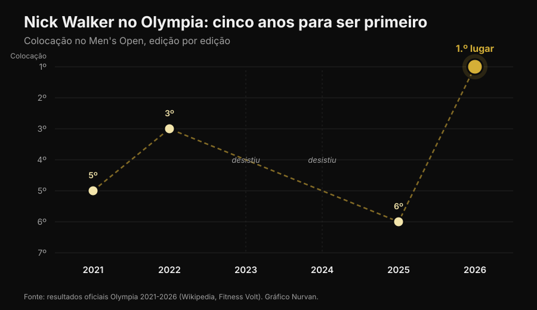
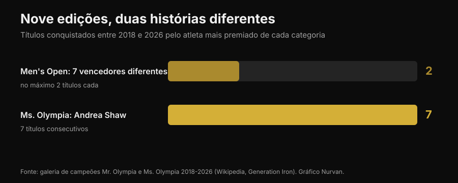

# Mr. Olympia 2026: quem ganhou foi Nick Walker, e a história dele diz mais que o pódio

No dia 27 de setembro de 2026, em Las Vegas, Nick Walker ganhou o seu primeiro Mr. Olympia. Aqui você encontra os resultados verificados de todas as categorias, mas principalmente a parte que interessa a quem treina: o que de fato foi preciso para chegar lá e quais dessas coisas valem para você também.

Por [Giammaria Loi](/autore/giammaria-loi) · atualizado em 3 de outubro de 2026

## Em resumo

- Nick Walker ganhou a 62ª edição do Mr. Olympia Men's Open no dia 27 de setembro de 2026, em Las Vegas, com um prêmio de 600.000 dólares. Samson Dauda ficou em segundo e Derek Lunsford em terceiro.
- Walker venceu mesmo perdendo a noite das finais: a pontuação do prejudging, dada no dia anterior, deu a ele a margem decisiva.
- Era o seu sexto Olympia em seis anos: 5º em 2021, 3º em 2022, duas edições fora por lesão e escolha técnica, 6º em 2025. A constância ao longo de vários anos, e não uma preparação excepcional, é a variável que o diferencia.
- Nas últimas nove edições o Men's Open teve sete campeões diferentes, enquanto Andrea Shaw fechou o seu sétimo Ms. Olympia consecutivo: a estabilidade não é uma regra do esporte, é uma característica de atletas específicos.
- O que você vê no palco não é replicável em casa, mas três coisas são: aumentar o volume com critério, levar as séries para perto da falha e manter a proteína alta quando você corta calorias. Nesses três pontos a literatura é concordante.

*Pódio de uma competição de fisiculturismo. Foto: Rikard Strömmer, Wikimedia Commons, CC BY-SA 4.0.*

## Quem ganhou: os resultados verificados

A 62ª edição do Joe Weider's Olympia aconteceu de 24 a 27 de setembro de 2026 em Las Vegas: prejudging e Expo no Las Vegas Convention Center, finais de sexta e de sábado à noite na Orleans Arena. Doze categorias no programa.

No **Men's Open**, a categoria principal:

| Posição | Atleta | País |
|---|---|---|
| 1 | Nick Walker | Estados Unidos |
| 2 | Samson Dauda | Reino Unido |
| 3 | Derek Lunsford | Estados Unidos |
| 4 | Andrew Jacked | Emirados Árabes Unidos |
| 5 | Tonio Burton | Estados Unidos |

O primeiro prêmio vale 600.000 dólares. O italiano Andrea Presti estava na competição e terminou empatado na 16ª posição.

*Os comparativos do prejudging decidem a competição mais do que a noite final. Foto: Joey Berzowska, Wikimedia Commons, CC BY 2.0.*

Os outros campeões das principais categorias: **Classic Physique** Niall Darwen, no primeiro título; **212** Keone Pearson, no quarto consecutivo; **Men's Physique** Ryan Terry; **Ms. Olympia** Andrea Shaw; **Bikini** Jasmine Gonzalez; **Wellness** Eduarda Bezerra; **Figure** Lola Montez; **Women's Physique** Natalia Abraham Coelho; **Fitness** Michelle Fredua-Mensah; **Wheelchair** Blake Colleton.

### O detalhe que quase ninguém contou

A pontuação funciona ao contrário: ganha quem soma menos pontos, juntando prejudging e final. Walker fechou com 8 no prejudging e 10 na final, total 18. Dauda fez 15 e 5, total 20.

Traduzindo: **Dauda ganhou a noite da final e perdeu a competição.** A diferença ele tomou no prejudging, quando as luzes são planas, não há público e os jurados observam os comparativos por vários minutos. Vale fora do fisiculturismo também: a performance que conta muitas vezes não é a do momento mais badalado.

## Cinco anos para chegar em primeiro

A história de Walker no Olympia não é uma curva limpa.

*As colocações de Nick Walker no Olympia de 2021 a 2026 — Dados: resultados oficiais das seis edições. Gráfico Nurvan.*

Estreia em 2021 com um quinto lugar, no mesmo ano em que havia ganhado o Arnold Classic. Terceiro em 2022. Em 2023 desistiu pouco antes da competição por uma lesão no bíceps femoral durante a preparação. Em 2024 se classificou vencendo o New York Pro e depois abriu mão. Sexto em 2025. Em 2026 ficou em segundo no Arnold Classic em março, ganhou o Tampa Pro em agosto e o Olympia em setembro.

Em dois dos seis anos ele nem sequer subiu ao palco e, no ano do título, havia perdido a competição mais importante da primavera. **A carreira que produziu aquela vitória não é uma sequência de performances perfeitas: é uma sequência longa.** Não é um detalhe romântico, é o mecanismo. A hipertrofia responde à carga acumulada ao longo do tempo, e o tempo em que você não treina não conta.

## Nove edições, duas histórias opostas

De 2018 a 2026 o Men's Open teve sete campeões diferentes em nove edições: Shawn Rhoden, Brandon Curry, Mamdouh Elssbiay (duas vezes), Hadi Choopan, Derek Lunsford (duas vezes), Samson Dauda e agora Nick Walker. Nenhuma hegemonia. Para entender o quanto isso é incomum: o recorde histórico é de oito títulos, de Lee Haney (1984-1991) e Ronnie Coleman (1998-2005), e Phil Heath ganhou sete seguidos de 2011 a 2017.

No mesmo período, no Ms. Olympia, Andrea Shaw acaba de fechar o sétimo título consecutivo, superando Cory Everson e ficando como terceira de todos os tempos, atrás de Iris Kyle (10) e Lenda Murray (8).

*Títulos conquistados de 2018 a 2026 pelo atleta mais titulado de cada categoria — Dados: galeria de campeões do Mr. Olympia e do Ms. Olympia. Gráfico Nurvan.*

Duas categorias, mesmo período, mesma federação, resultados opostos. O motivo não é misterioso: o julgamento é subjetivo, e o "melhor físico" muda com o gosto do painel de jurados e com quem aparece naquele ano. Quem persegue um julgamento persegue um alvo que se move.

Por isso, se você treina e não compete, vale escolher objetivos que se medem: cargas, repetições, circunferências, peso. Nesses o alvo fica parado. E se você se pergunta quanto da sua resposta ao treino depende da genética, falamos sobre isso no artigo sobre [high e low responder](/blog/genetica-high-low-responder).

## O que a pesquisa diz de verdade

O fisiculturismo profissional vive de afirmações repetidas até parecerem verdade. Aqui estão as mais comuns, passadas pela literatura.

**"Precisa do máximo de volume possível."** → **Precisa de contexto.** A relação dose-resposta existe: uma meta-análise de Schoenfeld e colegas com 15 estudos estimou que cada série semanal a mais acrescenta cerca de 0,37% de ganho em massa, com uma diferença de 3,9% entre os grupos de volume alto e os de volume baixo dentro do mesmo estudo. Uma meta-regressão de 2025 com 67 estudos e 2.058 participantes confirma o crescimento, mas com **retornos decrescentes**: quanto mais você sobe, menos rendem as séries adicionais. E em atletas já treinados os resultados são contraditórios, a ponto de não sabermos onde está o ponto de saturação.

**"É preciso ir sempre até a falha."** → **Precisa de contexto.** Uma meta-regressão de 2024 analisou a distância da falha em repetições de reserva (RIR: quantas repetições você ainda conseguiria fazer). Para a **hipertrofia** os ganhos aumentam conforme as séries terminam perto da falha. Para a **força** são parecidos em um intervalo amplo de RIR: não é preciso chegar à exaustão. Os autores pedem cautela, porque os RIR foram estimados depois, a partir das descrições dos protocolos.

**"Frequência alta é fundamental para crescer."** → **Desmentido, para a hipertrofia.** Na mesma meta-regressão de 2025, com o mesmo volume semanal a frequência tem um efeito compatível com zero sobre a hipertrofia. Na força, por outro lado, a frequência conta, sempre com retornos decrescentes. Espalhar as mesmas séries por mais sessões ajuda você na barra, não na circunferência do braço.

**"Na definição a proteína cai junto com as calorias."** → **Desmentido.** As diretrizes para atletas de physique vão na direção oposta: 1,8-2,7 g por kg de peso corporal segundo a review de Roberts e colegas, 2,3-3,1 g por kg de massa magra nas recomendações de Helms, Aragon e Fitschen para o fisiculturismo natural. Quando o déficit calórico cresce, a cota de proteína serve para proteger o músculo. Escrevemos sobre isso em detalhe no artigo sobre [proteína na definição](/blog/proteina-na-definicao).

**"Emagrecer rápido antes de uma competição ou de um evento funciona."** → **Desmentido.** As mesmas recomendações indicam perdas de peso de cerca de 0,5-1% por semana, e o trabalho mais recente desce para ≤0,5% para limitar a perda de massa magra.

**"A peak week com carga de carboidratos e líquidos faz a diferença."** → **Não verificável e, em parte, arriscada.** Uma review de 2024 encontrou que essas práticas são muito difundidas entre os atletas de physique, mas **faltam provas experimentais de que melhorem o resultado na competição**. A manipulação de água e eletrólitos nas últimas horas se baseia em mecanismos hipotéticos e pode ser perigosa: não é algo para improvisar para "secar" antes de um evento.

**"Preparar-se para uma competição faz bem à saúde."** → **Desmentido.** Uma revisão sistemática de 11 estudos de caso com 15 atletas declaradamente naturais documentou alterações marcantes em composição corporal, performance neuromuscular, hormônios e humor durante a preparação, com forte variabilidade individual. As diretrizes sobre fisiculturismo natural alertam para o risco aumentado de transtornos alimentares e de imagem corporal nos esportes estéticos, e recomendam acesso a profissionais de saúde mental.

*O trabalho que produz resultado é o repetido por anos. Foto: Nenad Stojkovic, Wikimedia Commons, CC BY 2.0.*

## Como aplicar

Nada do que se viu no palco de Las Vegas é replicável sem farmacologia, genética e uma vida construída em torno do treino. Estas quatro coisas, sim.

1. **Aumente o volume por etapas.** Se hoje você faz 8 séries semanais por grupo muscular, teste 10-12 por algumas semanas e veja o que acontece com as cargas e a recuperação. A curva sobe, mas achata: dobrar o volume não dobra os resultados, e aumenta a fadiga e o risco.
2. **Chegue perto da falha nas séries que contam.** Para a hipertrofia, deixe as últimas séries de cada exercício a 1-2 RIR. Para a força não é preciso: você pode trabalhar com 3-4 RIR e ganhar o mesmo, com um custo de recuperação muito menor.
3. **Use a frequência para a técnica, não para crescer.** Dividir o volume em mais sessões deixa cada treino mais fresco e o movimento mais limpo. Mas se o total semanal não muda, não espere mais hipertrofia.
4. **Não corte a proteína quando você corta as calorias.** 1,8-2,7 g por kg de peso corporal é o intervalo relatado nos estudos com atletas de physique. E não tenha pressa: 0,5-1% do peso por semana é o ritmo que preserva melhor a massa magra.

Os números acima são intervalos observados nos estudos, não uma prescrição. Se você tem alguma doença, usa medicamentos ou segue uma dieta por indicação médica, converse com o seu médico antes de mudar qualquer coisa.

> ### Nurvan — a progressão só aparece se você registrar
>
> A diferença entre o 2021 e o 2026 de um atleta não aparece em um treino: aparece na série histórica. O Nurvan registra cargas, repetições e RIR sessão a sessão, sugere as séries de aquecimento automaticamente e mostra o histórico de progressão de cada exercício ao longo do tempo, então você entende se está realmente progredindo ou só repetindo o mesmo treino.
>
> **[Experimente o Nurvan](https://nurvan.app)**

## Perguntas frequentes

**Quem ganhou o Mr. Olympia 2026?**
Nick Walker, dos Estados Unidos, ganhou o Men's Open da 62ª edição no dia 27 de setembro de 2026, em Las Vegas. É o seu primeiro título Olympia. Samson Dauda ficou em segundo e Derek Lunsford em terceiro.

**Quando e onde aconteceu o Mr. Olympia 2026?**
De 24 a 27 de setembro de 2026 em Las Vegas, Nevada. Prejudging e Expo no Las Vegas Convention Center, finais de sexta e de sábado na Orleans Arena.

**Quanto Nick Walker ganhou de prêmio?**
O primeiro prêmio do Men's Open é de 600.000 dólares. Walker também recebeu o People's Champion Award, pela segunda vez na carreira.

**Andrea Presti competiu no Mr. Olympia 2026?**
Sim, o italiano Andrea Presti estava na competição no Men's Open e terminou empatado na 16ª posição.

**Dá para conseguir um físico assim só treinando bem?**
Não. Os físicos do Men's Open são o resultado de genética extrema, anos de treino em tempo integral e protocolos farmacológicos. Treino e dieta bem feitos dão resultados reais, mas de outra ordem de grandeza.

## Leia também

- [Low responder: quanto a genética pesa nos músculos](/blog/genetica-high-low-responder) — por que duas pessoas que fazem o mesmo programa não obtêm o mesmo resultado.
- [Proteína na definição: quanto você realmente precisa](/blog/proteina-na-definicao) — o intervalo que protege a massa magra quando você corta calorias.

## Fontes

1. Pelland JC, Remmert JF, Robinson ZP, Hinson SR, Zourdos MC, 2025. *The Resistance Training Dose Response: Meta-Regressions Exploring the Effects of Weekly Volume and Frequency on Muscle Hypertrophy and Strength Gains.* Sports Medicine 56(2):481-505. PMID 41343037 — [DOI](https://doi.org/10.1007/s40279-025-02344-w)
2. Schoenfeld BJ, Ogborn D, Krieger JW, 2017. *Dose-response relationship between weekly resistance training volume and increases in muscle mass: A systematic review and meta-analysis.* Journal of Sports Sciences 35(11):1073-1082. PMID 27433992 — [DOI](https://doi.org/10.1080/02640414.2016.1210197)
3. Robinson ZP, Pelland JC, Remmert JF, Refalo MC, Jukic I, Steele J, Zourdos MC, 2024. *Exploring the Dose-Response Relationship Between Estimated Resistance Training Proximity to Failure, Strength Gain, and Muscle Hypertrophy: A Series of Meta-Regressions.* Sports Medicine 54(9):2209-2231. PMID 38970765 — [DOI](https://doi.org/10.1007/s40279-024-02069-2)
4. Camargo JBB, Bittencourt D, Silva DG, Bergamasco JGA, Michel JM, Roberts MD, Libardi CA, 2025. *Is there a volume saturation point for muscle hypertrophy in resistance-trained individuals? A narrative review.* European Journal of Applied Physiology 125(11):3065-3081. PMID 40883636 — [DOI](https://doi.org/10.1007/s00421-025-05959-z)
5. Roberts BM, Helms ER, Trexler ET, Fitschen PJ, 2020. *Nutritional Recommendations for Physique Athletes.* Journal of Human Kinetics 71:79-108. PMID 32148575 — [DOI](https://doi.org/10.2478/hukin-2019-0096)
6. Helms ER, Aragon AA, Fitschen PJ, 2014. *Evidence-based recommendations for natural bodybuilding contest preparation: nutrition and supplementation.* Journal of the International Society of Sports Nutrition 11:20. PMID 24864135 — [DOI](https://doi.org/10.1186/1550-2783-11-20)
7. Homer KA, Cross MR, Helms ER, 2024. *Peak Week Carbohydrate Manipulation Practices in Physique Athletes: A Narrative Review.* Sports Medicine - Open 10(1):8. PMID 38218750 — [DOI](https://doi.org/10.1186/s40798-024-00674-z)
8. Schoenfeld BJ, Androulakis-Korakakis P, Piñero A, Burke R, Coleman M, Mohan AE, Escalante G, Rukstela A, Campbell B, Helms E, 2023. *Alterations in Measures of Body Composition, Neuromuscular Performance, Hormonal Levels, Physiological Adaptations, and Psychometric Outcomes during Preparation for Physique Competition: A Systematic Review of Case Studies.* Journal of Functional Morphology and Kinesiology 8(2):59. PMID 37218855 — [DOI](https://doi.org/10.3390/jfmk8020059)

Fontes científicas recuperadas no PubMed. Resultados, datas, local e galeria de campeões verificados na [Wikipedia — 2026 Mr. Olympia](https://en.wikipedia.org/wiki/2026_Mr._Olympia), no [Fitness Volt](https://fitnessvolt.com/2026-mr-olympia-results/) e no [Generation Iron](https://generationiron.com/2026-mr-olympia-results-all-divisions/), consultados em 3 de outubro de 2026.

---

**Giammaria Loi** é o fundador do Nurvan. Treina com pesos desde 2012, trabalha como personal trainer e coach certificado pela FIPE desde 2013 e compete no powerlifting em nível nacional desde 2018. Cada artigo que ele assina parte dos estudos científicos e chega ao que funciona de verdade na academia.

> Nota: conteúdo informativo, não substitui o parecer de um médico ou profissional.
