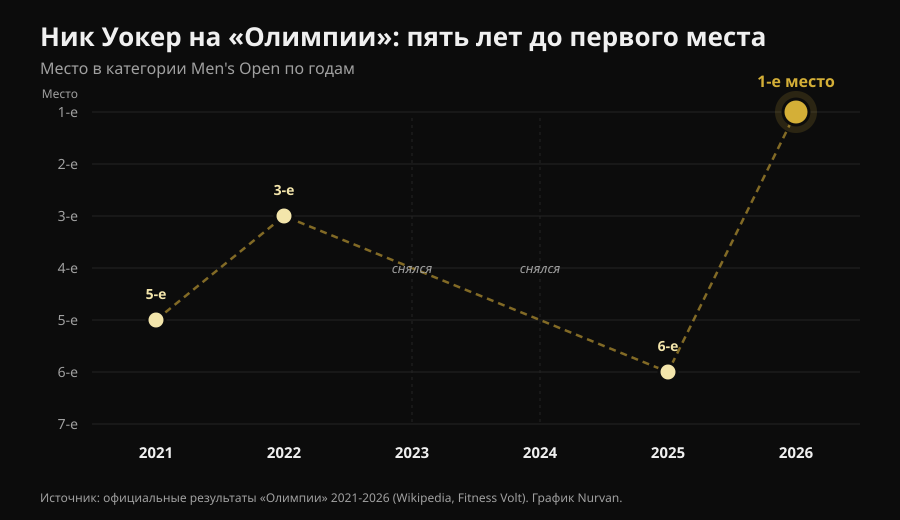
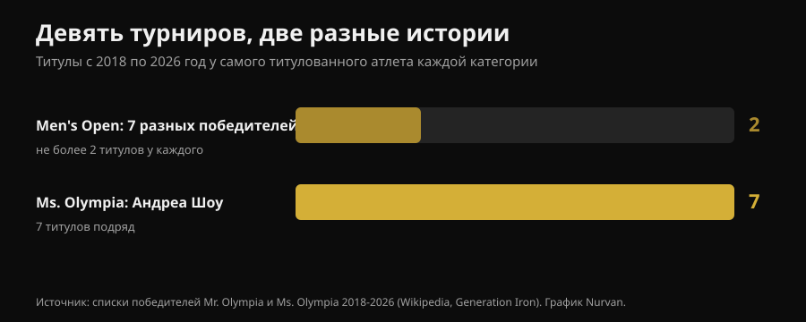

# Мистер Олимпия 2026: победил Ник Уокер, и его история говорит больше, чем подиум

27 сентября 2026 года в Лас-Вегасе Ник Уокер (Nick Walker) впервые выиграл «Мистер Олимпия». Ниже — проверенные результаты всех категорий. Но главное для тех, кто тренируется, в другом: что на самом деле понадобилось, чтобы туда дойти, и какие из этих вещей работают и для тебя.

Автор: [Giammaria Loi](/autore/giammaria-loi) · обновлено 3 октября 2026

## Коротко

- Ник Уокер выиграл Men's Open на 62-й «Мистер Олимпия» 27 сентября 2026 года в Лас-Вегасе. Приз — 600 000 долларов. Второй — Самсон Дауда (Samson Dauda), третий — Дерек Лансфорд (Derek Lunsford).
- Уокер победил, хотя проиграл вечер финала: решающий отрыв ему дали баллы предварительного судейства (prejudging) днём раньше.
- Это была его шестая «Олимпия» за шесть лет: 5-е место в 2021, 3-е в 2022, два пропуска из-за травмы и тактического решения, 6-е в 2025. Его отличает не одна выдающаяся подготовка, а постоянство на протяжении лет.
- За последние девять выпусков в Men's Open было семь разных победителей, а Андреа Шоу (Andrea Shaw) взяла седьмой Ms. Olympia подряд. Стабильность — не правило этого спорта, а черта отдельных атлетов.
- То, что ты видишь на сцене, дома не повторить. Но три вещи повторить можно: наращивать объём с умом, доводить подходы близко к отказу и держать белок высоким на дефиците. По этим трём пунктам литература сходится.

*Подиум соревнований по бодибилдингу. Фото: Rikard Strömmer, Wikimedia Commons, CC BY-SA 4.0.*

## Кто победил: проверенные результаты

62-я Joe Weider's Olympia прошла с 24 по 27 сентября 2026 года в Лас-Вегасе: предварительное судейство и Expo в Las Vegas Convention Center, финалы в пятницу и в субботу вечером в Orleans Arena. В программе было двенадцать категорий.

В **Men's Open**, главной категории:

| Место | Атлет | Страна |
|---|---|---|
| 1 | Ник Уокер | США |
| 2 | Самсон Дауда | Великобритания |
| 3 | Дерек Лансфорд | США |
| 4 | Эндрю Джекд (Andrew Jacked) | ОАЭ |
| 5 | Тонио Бёртон (Tonio Burton) | США |

Первый приз — 600 000 долларов. Итальянец Андреа Прести (Andrea Presti) тоже выступал и разделил 16-е место.

*Сравнения на предварительном судействе решают исход больше, чем финальный вечер. Фото: Joey Berzowska, Wikimedia Commons, CC BY 2.0.*

Победители остальных основных категорий: **Classic Physique** — Найл Дарвен (Niall Darwen), первый титул; **212** — Кеоне Пирсон (Keone Pearson), четвёртый подряд; **Men's Physique** — Райан Терри (Ryan Terry); **Ms. Olympia** — Андреа Шоу; **Bikini** — Джасмин Гонсалес (Jasmine Gonzalez); **Wellness** — Эдуарда Безерра (Eduarda Bezerra); **Figure** — Лола Монтез (Lola Montez); **Women's Physique** — Наталия Абрахам Коэльо (Natalia Abraham Coelho); **Fitness** — Мишель Фредуа-Менса (Michelle Fredua-Mensah); **Wheelchair** — Блейк Коллетон (Blake Colleton).

### Деталь, о которой почти никто не рассказал

Счёт работает наоборот: выигрывает тот, кто набрал меньше баллов за предварительное судейство и финал вместе. Уокер закрыл с 8 на предварительном судействе и 10 в финале — всего 18. Дауда получил 15 и 5 — всего 20.

Проще говоря: **Дауда выиграл финальный вечер и проиграл соревнование.** Отрыв он отдал на предварительном судействе, когда свет плоский, зрителей нет, а судьи разглядывают сравнения несколько минут. Это работает и вне бодибилдинга: решающее выступление часто не то, которое приходится на главный момент.

## Пять лет до первого места

История Уокера на «Олимпии» — не ровная кривая вверх.

*Места Ника Уокера на «Олимпии» с 2021 по 2026 год — данные: официальные результаты шести турниров. График Nurvan.*

Дебют в 2021 году — пятое место, в тот же год он выиграл Arnold Classic. Третий в 2022. В 2023 снялся незадолго до старта из-за надрыва двуглавой мышцы бедра на подготовке. В 2024 квалифицировался, выиграв New York Pro, а потом отказался от выступления. Шестой в 2025. В 2026 он стал вторым на Arnold Classic в марте, выиграл Tampa Pro в августе и «Олимпию» в сентябре.

Два года из шести он вообще не выходил на сцену, а в год титула проиграл главный весенний турнир. **Карьера, которая привела к этой победе, — не череда идеальных выступлений, а длинная череда.** Это не красивая деталь, а механизм. Гипертрофия отвечает на нагрузку, накопленную за годы, и время, когда ты не тренируешься, в зачёт не идёт.

## Девять турниров, две противоположные истории

С 2018 по 2026 год в Men's Open было семь разных победителей на девять турниров: Шон Роден (Shawn Rhoden), Брэндон Карри (Brandon Curry), Мамдух Эльссбиай (Mamdouh Elssbiay) — дважды, Хади Чупан (Hadi Choopan), Дерек Лансфорд — дважды, Самсон Дауда и теперь Ник Уокер. Никакого доминирования. Чтобы понять, насколько это необычно: исторический рекорд — восемь титулов у Ли Хейни (Lee Haney, 1984-1991) и Ронни Коулмана (Ronnie Coleman, 1998-2005), а Фил Хит (Phil Heath) взял семь подряд с 2011 по 2017 год.

В тот же период в Ms. Olympia Андреа Шоу только что закрыла седьмой титул подряд, обойдя Кори Эверсон (Cory Everson) и выйдя на третье место в истории — позади Айрис Кайл (Iris Kyle, 10) и Ленды Мюррей (Lenda Murray, 8).

*Титулы, выигранные с 2018 по 2026 год самым титулованным атлетом каждой категории — данные: список победителей Mr. Olympia и Ms. Olympia. График Nurvan.*

Две категории, один период, одна федерация — противоположные исходы. Причина не загадочна: судейство субъективно, и «лучшее телосложение» меняется вместе со вкусами судейской коллегии и составом участников в конкретный год. Кто гонится за оценкой, гонится за мишенью, которая движется.

Поэтому, если ты тренируешься и не соревнуешься, выбирай цели, которые можно измерить: веса, повторения, обхваты, вес тела. На них мишень стоит на месте. А если тебе интересно, насколько твой отклик на тренировки зависит от генетики, мы разбирали это в статье про [high и low responder](/blog/genetika-high-low-responder).

## Что на самом деле говорит наука

Профессиональный бодибилдинг живёт утверждениями, которые повторяли так часто, что они стали казаться правдой. Вот самые частые — через призму литературы.

**«Нужно как можно больше объёма».** → **Требует уточнения.** Зависимость доза-отклик существует: метаанализ Schoenfeld и коллег по 15 исследованиям оценил, что каждый дополнительный подход в неделю даёт примерно 0,37% прироста массы, а разница между группами с высоким и низким объёмом внутри одного исследования составила 3,9%. Метарегрессия 2025 года по 67 исследованиям и 2058 участникам подтверждает рост, но с **убывающей отдачей**: чем выше поднимаешься, тем меньше дают дополнительные подходы. А у уже тренированных атлетов результаты противоречивы — настолько, что мы не знаем, где находится точка насыщения.

**«К отказу надо идти всегда».** → **Требует уточнения.** Метарегрессия 2024 года проанализировала удалённость от отказа в повторениях в запасе (RIR: сколько повторений ты ещё мог бы сделать). Для **гипертрофии** прирост растёт по мере того, как подходы заканчиваются ближе к отказу. Для **силы** результаты похожи в широком диапазоне RIR: доходить до изнеможения не нужно. Авторы призывают к осторожности, потому что RIR оценивали постфактум по описаниям протоколов.

**«Высокая частота критична для роста».** → **Опровергнуто, если речь о гипертрофии.** В той же метарегрессии 2025 года при равном недельном объёме эффект частоты на гипертрофию совместим с нулём. На силу частота, наоборот, влияет — опять же с убывающей отдачей. Размазать те же подходы по большему числу тренировок помогает штанге, а не обхвату руки.

**«На сушке белок снижают вместе с калориями».** → **Опровергнуто.** Рекомендации для physique-атлетов идут в обратную сторону: 1,8-2,7 г на кг массы тела по обзору Roberts и коллег и 2,3-3,1 г на кг сухой массы в рекомендациях Helms, Aragon и Fitschen для натурального бодибилдинга. Когда дефицит калорий растёт, доля белка защищает мышцы. Подробно мы писали об этом в статье про [белок на сушке](/blog/belok-na-sushke).

**«Быстро похудеть перед соревнованием или событием — работает».** → **Опровергнуто.** Те же рекомендации называют темп примерно 0,5-1% веса в неделю, а более свежая работа снижает его до ≤0,5%, чтобы ограничить потерю сухой массы.

**«Peak week с загрузкой углеводов и жидкости решает всё».** → **Непроверяемо и отчасти рискованно.** Обзор 2024 года показал, что такие практики крайне распространены среди physique-атлетов, но **экспериментальных доказательств, что они улучшают результат на сцене, нет**. Манипуляции водой и электролитами в последние часы опираются на предполагаемые механизмы и могут быть опасны: это не то, что стоит импровизировать, чтобы «подсушиться» перед событием.

**«Подготовка к соревнованиям полезна для здоровья».** → **Опровергнуто.** Систематический обзор 11 case study по 15 атлетам, заявлявшим о натуральном статусе, зафиксировал выраженные изменения состава тела, нервно-мышечной работоспособности, гормонов и настроения во время подготовки, с сильной индивидуальной вариативностью. Рекомендации по натуральному бодибилдингу предупреждают о повышенном риске расстройств пищевого поведения и образа тела в эстетических видах спорта и советуют обеспечить доступ к специалистам по психическому здоровью.

*Результат дают не разовые усилия, а работа, повторяемая годами. Фото: Nenad Stojkovic, Wikimedia Commons, CC BY 2.0.*

## Как это применить

Ничего из того, что показали на сцене в Лас-Вегасе, не повторить без фармакологии, генетики и жизни, выстроенной вокруг тренировок. А вот эти четыре вещи — повторить можно.

1. **Поднимай объём постепенно.** Если сейчас делаешь 8 подходов в неделю на мышечную группу, попробуй 10-12 на несколько недель и посмотри, что будет с весами и восстановлением. Кривая идёт вверх, но выходит на плато: удвоение объёма не удваивает результат, зато добавляет утомление и риск.
2. **Подходи близко к отказу там, где это важно.** Для гипертрофии держи последние подходы каждого упражнения на 1-2 RIR. Для силы это не нужно: можно работать с 3-4 RIR и прибавлять так же, но гораздо дешевле по восстановлению.
3. **Используй частоту для техники, а не для роста.** Распределение объёма по большему числу тренировок делает каждую сессию свежее, а движение чище. Но если недельная сумма не изменилась, большей гипертрофии не жди.
4. **Не урезай белок, когда урезаешь калории.** 1,8-2,7 г на кг массы тела — диапазон, который приводят исследования на physique-атлетах. И не спеши: 0,5-1% веса в неделю — темп, который лучше сохраняет сухую массу.

Цифры выше — это диапазоны, наблюдавшиеся в исследованиях, а не назначение. Если у тебя есть заболевания, ты принимаешь лекарства или соблюдаешь диету по назначению врача, обсуди изменения с врачом.

> ### Nurvan — прогресс виден только если его записывать
>
> Разница между Уокером 2021 года и Уокером 2026 года не видна за одну тренировку: она видна в длинном ряду данных. Nurvan записывает веса, повторения и RIR от тренировки к тренировке, автоматически предлагает разминочные подходы и показывает историю прогресса по каждому упражнению, так что ты видишь, действительно ли прибавляешь или просто повторяешь одну и ту же тренировку.
>
> **[Попробовать Nurvan](https://nurvan.app)**

## Частые вопросы

**Кто выиграл «Мистер Олимпия» 2026?**
Американец Ник Уокер выиграл Men's Open на 62-м турнире 27 сентября 2026 года в Лас-Вегасе. Это его первый титул «Олимпии». Второй — Самсон Дауда, третий — Дерек Лансфорд.

**Когда и где проходила «Мистер Олимпия» 2026?**
С 24 по 27 сентября 2026 года в Лас-Вегасе, штат Невада. Предварительное судейство и Expo — в Las Vegas Convention Center, финалы в пятницу и субботу — в Orleans Arena.

**Сколько денег получил Ник Уокер за победу?**
Первый приз в Men's Open — 600 000 долларов. Уокер также получил People's Champion Award, второй раз в карьере.

**Были ли итальянцы на «Мистер Олимпия» 2026?**
Да, Андреа Прести выступал в Men's Open и разделил 16-е место.

**Можно ли построить такое тело просто грамотными тренировками?**
Нет. Телосложение атлетов Men's Open — результат экстремальной генетики, лет тренировок на полную занятость и фармакологических протоколов. Грамотные тренировки и питание дают реальный результат, но другого порядка.

## Читайте также

- [Low responder: насколько генетика определяет рост мышц](/blog/genetika-high-low-responder) — почему двое людей на одной программе получают разный результат.
- [Белок на сушке: сколько нужно на самом деле](/blog/belok-na-sushke) — диапазон, который защищает сухую массу, когда ты урезаешь калории.

## Источники

1. Pelland JC, Remmert JF, Robinson ZP, Hinson SR, Zourdos MC, 2025. *The Resistance Training Dose Response: Meta-Regressions Exploring the Effects of Weekly Volume and Frequency on Muscle Hypertrophy and Strength Gains.* Sports Medicine 56(2):481-505. PMID 41343037 — [DOI](https://doi.org/10.1007/s40279-025-02344-w)
2. Schoenfeld BJ, Ogborn D, Krieger JW, 2017. *Dose-response relationship between weekly resistance training volume and increases in muscle mass: A systematic review and meta-analysis.* Journal of Sports Sciences 35(11):1073-1082. PMID 27433992 — [DOI](https://doi.org/10.1080/02640414.2016.1210197)
3. Robinson ZP, Pelland JC, Remmert JF, Refalo MC, Jukic I, Steele J, Zourdos MC, 2024. *Exploring the Dose-Response Relationship Between Estimated Resistance Training Proximity to Failure, Strength Gain, and Muscle Hypertrophy: A Series of Meta-Regressions.* Sports Medicine 54(9):2209-2231. PMID 38970765 — [DOI](https://doi.org/10.1007/s40279-024-02069-2)
4. Camargo JBB, Bittencourt D, Silva DG, Bergamasco JGA, Michel JM, Roberts MD, Libardi CA, 2025. *Is there a volume saturation point for muscle hypertrophy in resistance-trained individuals? A narrative review.* European Journal of Applied Physiology 125(11):3065-3081. PMID 40883636 — [DOI](https://doi.org/10.1007/s00421-025-05959-z)
5. Roberts BM, Helms ER, Trexler ET, Fitschen PJ, 2020. *Nutritional Recommendations for Physique Athletes.* Journal of Human Kinetics 71:79-108. PMID 32148575 — [DOI](https://doi.org/10.2478/hukin-2019-0096)
6. Helms ER, Aragon AA, Fitschen PJ, 2014. *Evidence-based recommendations for natural bodybuilding contest preparation: nutrition and supplementation.* Journal of the International Society of Sports Nutrition 11:20. PMID 24864135 — [DOI](https://doi.org/10.1186/1550-2783-11-20)
7. Homer KA, Cross MR, Helms ER, 2024. *Peak Week Carbohydrate Manipulation Practices in Physique Athletes: A Narrative Review.* Sports Medicine - Open 10(1):8. PMID 38218750 — [DOI](https://doi.org/10.1186/s40798-024-00674-z)
8. Schoenfeld BJ, Androulakis-Korakakis P, Piñero A, Burke R, Coleman M, Mohan AE, Escalante G, Rukstela A, Campbell B, Helms E, 2023. *Alterations in Measures of Body Composition, Neuromuscular Performance, Hormonal Levels, Physiological Adaptations, and Psychometric Outcomes during Preparation for Physique Competition: A Systematic Review of Case Studies.* Journal of Functional Morphology and Kinesiology 8(2):59. PMID 37218855 — [DOI](https://doi.org/10.3390/jfmk8020059)

Научные источники получены из PubMed. Результаты, даты, место проведения и список победителей проверены по [Wikipedia — 2026 Mr. Olympia](https://en.wikipedia.org/wiki/2026_Mr._Olympia), [Fitness Volt](https://fitnessvolt.com/2026-mr-olympia-results/) и [Generation Iron](https://generationiron.com/2026-mr-olympia-results-all-divisions/), просмотрено 3 октября 2026 года.

---

**Giammaria Loi** — основатель Nurvan. Тренируется с отягощениями с 2012 года, работает персональным тренером и коучем с сертификацией FIPE с 2013 года, с 2018 года выступает в пауэрлифтинге на национальном уровне. Каждая его статья начинается с научных исследований и заканчивается тем, что действительно работает в зале.

> Примечание: информационный материал, не заменяет консультацию врача или профессионала.
