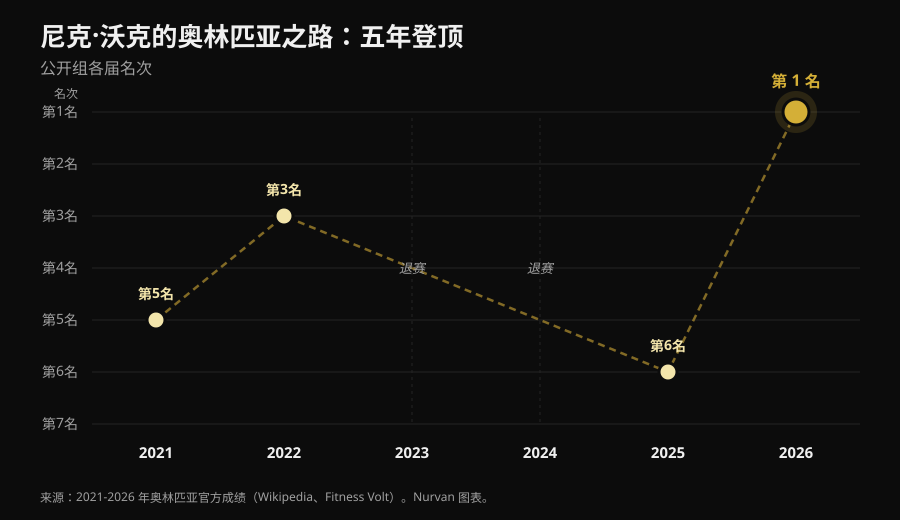
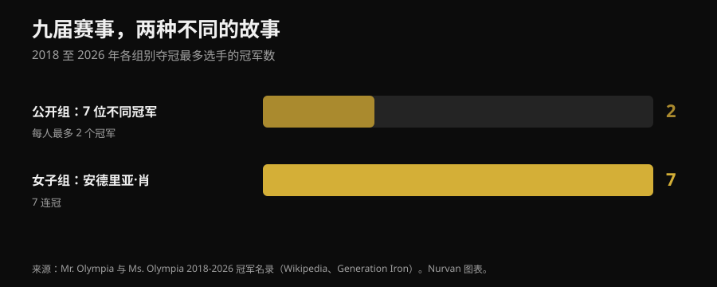

# 奥林匹亚先生 2026：冠军是尼克·沃克，但他的经历比名次更有意思

2026 年 9 月 27 日，在拉斯维加斯，尼克·沃克（Nick Walker）拿到了他的第一个奥林匹亚先生冠军。这篇文章给你所有级别已核实的成绩，更重要的是训练者真正关心的部分：他到底靠什么走到这一步，其中哪些对你也成立。

作者：[Giammaria Loi](/autore/giammaria-loi) · 更新于 2026 年 10 月 3 日

## 速览

- 尼克·沃克在 2026 年 9 月 27 日于拉斯维加斯举行的第 62 届奥林匹亚先生 Men's Open（公开级，最高级别）夺冠，奖金 600,000 美元。第二名萨姆森·达乌达（Samson Dauda），第三名德里克·伦斯福德（Derek Lunsford）。
- 沃克输掉了决赛之夜，却赢了比赛：前一天的预审（prejudging）分数给了他决定性的优势。
- 这是他六年里的第六次奥赛：2021 年第 5，2022 年第 3，中间两届因伤和技术考虑缺席，2025 年第 6。真正让他与众不同的变量是多年的持续性，而不是某一次特别出色的备赛。
- 最近九届 Men's Open 出了七位不同的冠军，而安德莉亚·肖（Andrea Shaw）刚刚拿下第七个 Ms. Olympia（女子公开级）连冠：稳定不是这项运动的规律，而是个别选手的特质。
- 舞台上看到的东西你在家复制不了，但有三件事可以：有分寸地增加训练容量、把组练到接近力竭、减脂时把蛋白质保持在高位。这三点上，研究文献的结论是一致的。

*一场健美比赛的领奖台。照片：Rikard Strömmer, Wikimedia Commons, CC BY-SA 4.0。*

## 谁赢了：已核实的成绩

第 62 届 Joe Weider's Olympia 于 2026 年 9 月 24 日至 27 日在拉斯维加斯举行：预审和 Expo 在 Las Vegas Convention Center，周五和周六晚的决赛在 Orleans Arena。共设十二个级别。

**Men's Open**（公开级，最高级别）的结果：

| 名次 | 选手 | 国家 |
|---|---|---|
| 1 | Nick Walker | 美国 |
| 2 | Samson Dauda | 英国 |
| 3 | Derek Lunsford | 美国 |
| 4 | Andrew Jacked | 阿联酋 |
| 5 | Tonio Burton | 美国 |

冠军奖金为 600,000 美元。意大利选手安德烈亚·普雷斯蒂（Andrea Presti）参加了比赛，并列第 16 名。

*预审的对比环节比决赛之夜更能决定比赛结果。照片：Joey Berzowska, Wikimedia Commons, CC BY 2.0。*

其他主要级别的冠军：**Classic Physique**（古典健体）Niall Darwen，首个冠军；**212** Keone Pearson，四连冠；**Men's Physique**（男子健体）Ryan Terry；**Ms. Olympia**（女子公开级）Andrea Shaw；**Bikini**（比基尼）Jasmine Gonzalez；**Wellness**（健体康美）Eduarda Bezerra；**Figure**（形体）Lola Montez；**Women's Physique**（女子健体）Natalia Abraham Coelho；**Fitness**（健身）Michelle Fredua-Mensah；**Wheelchair**（轮椅）Blake Colleton。

### 几乎没人讲的那个细节

计分方式是反着来的：把预审和决赛的分数相加，总分越低越好。沃克预审 8 分、决赛 10 分，总分 18。达乌达是 15 分和 5 分，总分 20。

翻译过来就是：**达乌达赢了决赛之夜，输了整场比赛。**差距是在预审那天被拉开的——那时灯光平淡，没有观众，裁判会盯着对比环节看好几分钟。这件事在健美之外同样成立：真正起作用的表现，往往不是高光时刻那一次。

## 五年才走到第一

沃克在奥赛的经历不是一条干净的上升曲线。

*尼克·沃克 2021 至 2026 年在奥赛的名次 —— 数据：六届赛事官方成绩。图表由 Nurvan 制作。*

2021 年首次参赛拿到第五，同一年他赢下了阿诺德经典赛。2022 年第三。2023 年备赛期间股后肌群撕裂，临赛前退出。2024 年他靠赢下纽约职业赛拿到资格，随后放弃参赛。2025 年第六。2026 年他在三月的阿诺德经典赛拿到第二，八月赢下坦帕职业赛，九月拿下奥赛。

六年里有两年他根本没上台，而在夺冠那一年，他还输掉了春季最重要的一场比赛。**成就那次夺冠的职业生涯，不是一连串完美的表现，而是一条足够长的时间线。**这不是浪漫化的细节，而是机制本身：肌肉增长回应的是长期累积的负荷，而你不训练的那段时间不计入其中。

## 九届赛事，两种相反的故事

从 2018 到 2026 年，Men's Open 九届出了七位不同的冠军：Shawn Rhoden、Brandon Curry、Mamdouh Elssbiay（两次）、Hadi Choopan、Derek Lunsford（两次）、Samson Dauda，以及现在的 Nick Walker。没有任何人形成统治。要理解这有多反常：历史最高纪录是八个冠军，由李·海尼（Lee Haney，1984-1991）和罗尼·库尔曼（Ronnie Coleman，1998-2005）保持，菲尔·希斯（Phil Heath）从 2011 到 2017 年拿过七连冠。

同一时期，在 Ms. Olympia，安德莉亚·肖刚刚完成第七个连冠，超过 Cory Everson，成为历史第三，仅次于 Iris Kyle（10 个）和 Lenda Murray（8 个）。

*2018 至 2026 年各级别头衔最多的选手所获冠军数 —— 数据：奥林匹亚先生与 Ms. Olympia 冠军名录。图表由 Nurvan 制作。*

两个级别，同一时期，同一个联盟，结果完全相反。原因并不神秘：评判是主观的，而「最好的身材」会随着裁判组的口味、以及那一年谁来参赛而改变。追逐一个评判结果，就是在追一个会移动的靶子。

所以，如果你只是训练、不参加比赛，更划算的是选择能被测量的目标：重量、次数、围度、体重。这些靶子不会动。如果你想知道自己对训练的反应有多少取决于基因，我们在[高反应者与低反应者](/blog/genetics-high-low-responders-zh)那篇文章里讲过。

## 研究到底怎么说

职业健美圈里有不少说法，重复得多了就像真的一样。下面是最常见的几条，以及它们在文献面前的样子。

**「容量越大越好。」** → **需要修正。**剂量-反应关系确实存在：Schoenfeld 及同事对 15 项研究做的一篇 meta 分析估计，每周每多做一组，肌肉量增益大约多 0.37%，同一研究内高容量组与低容量组之间的差异为 3.9%。2025 年一项覆盖 67 项研究、2,058 名受试者的 meta 回归证实了这种增长，但伴随**收益递减**：容量越高，多加的组收益越小。而在已经有训练经验的运动员身上，结果相互矛盾，以至于我们并不知道饱和点在哪里。

**「每组都必须练到力竭。」** → **需要修正。**2024 年的一项 meta 回归分析了距离力竭的程度，用储备次数表示（RIR：你本来还能再做几次）。对**肌肉增长**来说，组越接近力竭，增益越大。对**力量**来说，在较宽的 RIR 区间里结果接近：不需要把自己练到精疲力尽。作者提醒要谨慎看待，因为 RIR 是从各研究方案的描述中事后估算出来的。

**「高频率是增肌的关键。」** → **对肌肉增长而言，不成立。**在同一篇 2025 年的 meta 回归里，在每周容量相同的前提下，频率对肌肉增长的效应与零相容。对力量来说频率确实有用，同样伴随收益递减。把相同的组数分散到更多次训练中，帮到的是你在杠铃上的表现，而不是手臂的围度。

**「减脂期蛋白质要跟着热量一起降。」** → **不成立。**面向健体类运动员的指南给出的是相反的方向：Roberts 及同事的综述给出每公斤体重 1.8-2.7 g，Helms、Aragon 和 Fitschen 对自然健美的建议是每公斤去脂体重 2.3-3.1 g。热量缺口越大，蛋白质摄入越是用来保护肌肉的。我们在[减脂期的蛋白质](/blog/protein-intake-cutting-zh)那篇文章里写得更详细。

**「比赛或活动前快速减重有效。」** → **不成立。**同样这些建议给出的减重速度约为每周 0.5-1%，而更新的研究把它降到 ≤0.5%，以减少去脂体重的流失。

**「碳水和水分调控的赛前一周（peak week）能决定成败。」** → **无法验证，且部分做法有风险。**2024 年的一篇综述发现，这些做法在健体类运动员中极为普遍，但**缺乏实验证据表明它们能改善比赛结果**。最后几小时对水和电解质的操作建立在假设的机制上，而且可能很危险：这不是为了在某个活动前「脱水变干」就能临时上手的东西。

**「为比赛备赛对健康有好处。」** → **不成立。**一篇针对 11 项个案研究、共 15 名自称自然选手的系统综述记录到，备赛期间身体成分、神经肌肉表现、激素和情绪都出现了明显改变，个体差异很大。自然健美指南提醒，审美类运动中进食障碍和身体意象问题的风险更高，并建议能够接触到心理健康专业人员。

*真正产生结果的，是重复了多年的那部分工作。照片：Nenad Stojkovic, Wikimedia Commons, CC BY 2.0。*

## 怎么用在自己身上

拉斯维加斯舞台上看到的一切，离开药物、基因和一种完全围绕训练搭建的生活，是无法复制的。但下面这四件事可以。

1. **逐步提高容量。**如果你现在每个肌群每周做 8 组，试着做 10-12 组几周，看看重量和恢复会发生什么变化。曲线会上升，但会趋平：把容量翻倍不会让结果翻倍，却会增加疲劳和风险。
2. **在重要的组上接近力竭。**为了肌肉增长，把每个动作的最后几组保持在 1-2 RIR。为了力量则不必：你用 3-4 RIR 也能获得同样的进步，而恢复成本低得多。
3. **把频率用在技术上，不是用在增肌上。**把容量分散到更多次训练，会让每次训练更有精神、动作更干净。但如果每周总量没变，就不要指望更多的肌肉增长。
4. **减热量时不要减蛋白质。**每公斤体重 1.8-2.7 g 是健体类运动员研究中给出的区间。也不要着急：每周减 0.5-1% 的体重，是更能保住去脂体重的节奏。

上面这些数字是研究中观察到的区间，不是处方。如果你有疾病、在服药，或因医嘱而遵循某种饮食，改动之前先和你的医生谈。

> ### Nurvan —— 进步只有被记录下来才看得见
>
> 一名选手 2021 年和 2026 年的差别，在一次训练里是看不出来的，只有在时间序列里才看得见。Nurvan 逐组记录重量、次数和 RIR，自动为你推荐热身组，并显示每个动作在长期的进步曲线，让你知道自己是真的在进步，还是只是在重复同一套训练。
>
> **[试用 Nurvan](https://nurvan.app)**

## 常见问题

**2026 年奥林匹亚先生冠军是谁？**
美国选手尼克·沃克在 2026 年 9 月 27 日于拉斯维加斯赢得了第 62 届 Men's Open 冠军。这是他的第一个奥赛冠军。第二名萨姆森·达乌达，第三名德里克·伦斯福德。

**2026 年奥林匹亚先生什么时候、在哪里举行？**
2026 年 9 月 24 日至 27 日，在美国内华达州拉斯维加斯。预审和 Expo 在 Las Vegas Convention Center，周五和周六的决赛在 Orleans Arena。

**尼克·沃克拿到多少奖金？**
Men's Open 的冠军奖金是 600,000 美元。沃克还获得了 People's Champion Award，这是他职业生涯第二次拿到该奖项。

**2026 年奥林匹亚先生有意大利选手参赛吗？**
有，安德烈亚·普雷斯蒂参加了 Men's Open，并列第 16 名。

**认真训练能练出这样的身材吗？**
不能。Men's Open 的身材是极端基因、多年全职训练和药物方案共同作用的结果。认真的训练和饮食能带来实实在在的效果，但量级完全不同。

## 延伸阅读

- [低反应者：基因对肌肉生长究竟有多大影响](/blog/genetics-high-low-responders-zh) —— 为什么两个人执行同一套计划，结果并不一样。
- [减脂期的蛋白质：究竟需要多少](/blog/protein-intake-cutting-zh) —— 减热量时能保住去脂体重的摄入区间。

## 参考文献

1. Pelland JC, Remmert JF, Robinson ZP, Hinson SR, Zourdos MC, 2025. *The Resistance Training Dose Response: Meta-Regressions Exploring the Effects of Weekly Volume and Frequency on Muscle Hypertrophy and Strength Gains.* Sports Medicine 56(2):481-505. PMID 41343037 — [DOI](https://doi.org/10.1007/s40279-025-02344-w)
2. Schoenfeld BJ, Ogborn D, Krieger JW, 2017. *Dose-response relationship between weekly resistance training volume and increases in muscle mass: A systematic review and meta-analysis.* Journal of Sports Sciences 35(11):1073-1082. PMID 27433992 — [DOI](https://doi.org/10.1080/02640414.2016.1210197)
3. Robinson ZP, Pelland JC, Remmert JF, Refalo MC, Jukic I, Steele J, Zourdos MC, 2024. *Exploring the Dose-Response Relationship Between Estimated Resistance Training Proximity to Failure, Strength Gain, and Muscle Hypertrophy: A Series of Meta-Regressions.* Sports Medicine 54(9):2209-2231. PMID 38970765 — [DOI](https://doi.org/10.1007/s40279-024-02069-2)
4. Camargo JBB, Bittencourt D, Silva DG, Bergamasco JGA, Michel JM, Roberts MD, Libardi CA, 2025. *Is there a volume saturation point for muscle hypertrophy in resistance-trained individuals? A narrative review.* European Journal of Applied Physiology 125(11):3065-3081. PMID 40883636 — [DOI](https://doi.org/10.1007/s00421-025-05959-z)
5. Roberts BM, Helms ER, Trexler ET, Fitschen PJ, 2020. *Nutritional Recommendations for Physique Athletes.* Journal of Human Kinetics 71:79-108. PMID 32148575 — [DOI](https://doi.org/10.2478/hukin-2019-0096)
6. Helms ER, Aragon AA, Fitschen PJ, 2014. *Evidence-based recommendations for natural bodybuilding contest preparation: nutrition and supplementation.* Journal of the International Society of Sports Nutrition 11:20. PMID 24864135 — [DOI](https://doi.org/10.1186/1550-2783-11-20)
7. Homer KA, Cross MR, Helms ER, 2024. *Peak Week Carbohydrate Manipulation Practices in Physique Athletes: A Narrative Review.* Sports Medicine - Open 10(1):8. PMID 38218750 — [DOI](https://doi.org/10.1186/s40798-024-00674-z)
8. Schoenfeld BJ, Androulakis-Korakakis P, Piñero A, Burke R, Coleman M, Mohan AE, Escalante G, Rukstela A, Campbell B, Helms E, 2023. *Alterations in Measures of Body Composition, Neuromuscular Performance, Hormonal Levels, Physiological Adaptations, and Psychometric Outcomes during Preparation for Physique Competition: A Systematic Review of Case Studies.* Journal of Functional Morphology and Kinesiology 8(2):59. PMID 37218855 — [DOI](https://doi.org/10.3390/jfmk8020059)

科学文献来自 PubMed。成绩、日期、举办地和冠军名录在 [Wikipedia — 2026 Mr. Olympia](https://en.wikipedia.org/wiki/2026_Mr._Olympia)、[Fitness Volt](https://fitnessvolt.com/2026-mr-olympia-results/) 和 [Generation Iron](https://generationiron.com/2026-mr-olympia-results-all-divisions/) 上核实，查阅日期为 2026 年 10 月 3 日。

---

**Giammaria Loi** 是 Nurvan 的创始人。他从 2012 年开始练力量，自 2013 年起担任 FIPE 认证的私人教练和教练，并从 2018 年起参加国家级的力量举比赛。他写的每一篇文章都从研究出发，最后落到健身房里真正有效的东西上。

> 注：本文为信息性内容，不能替代医生或专业人士的建议。
