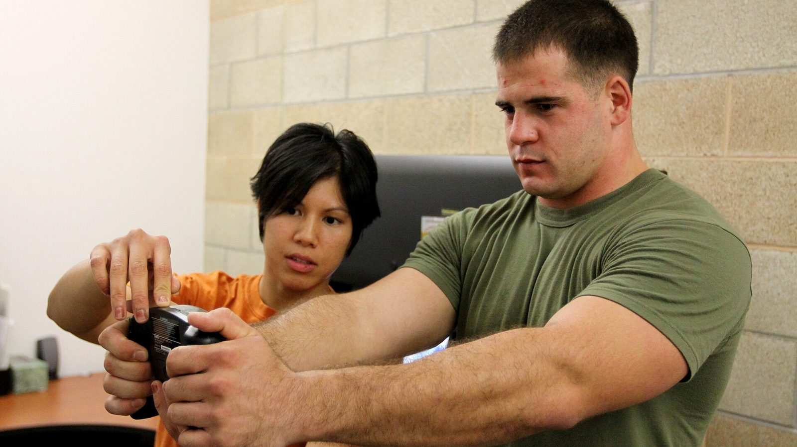
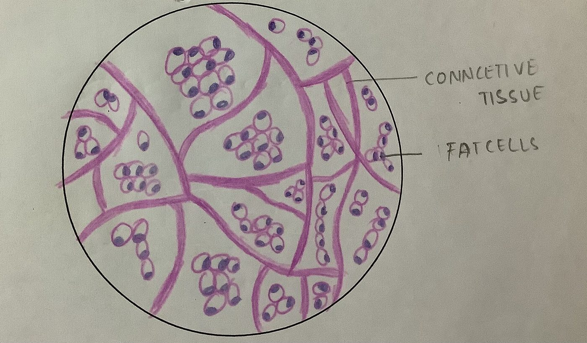
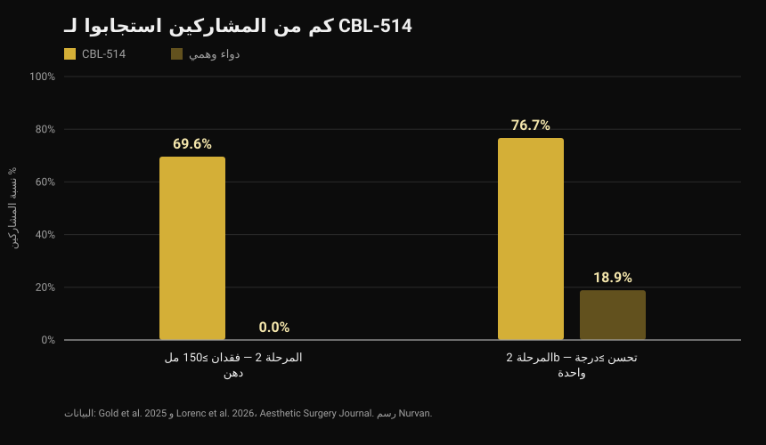
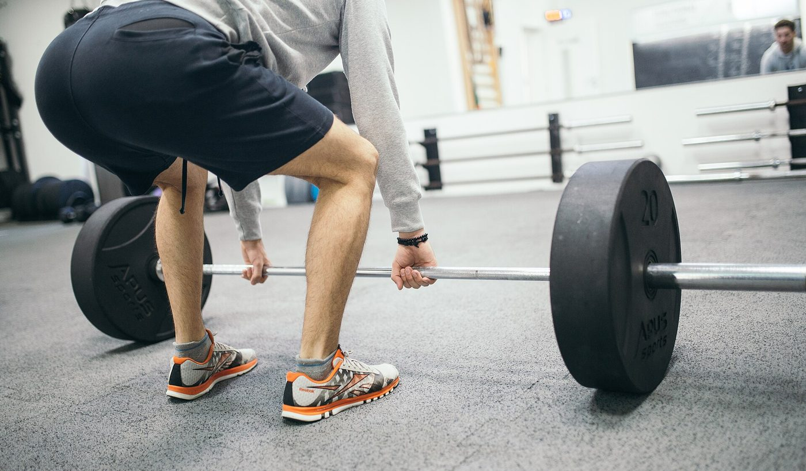
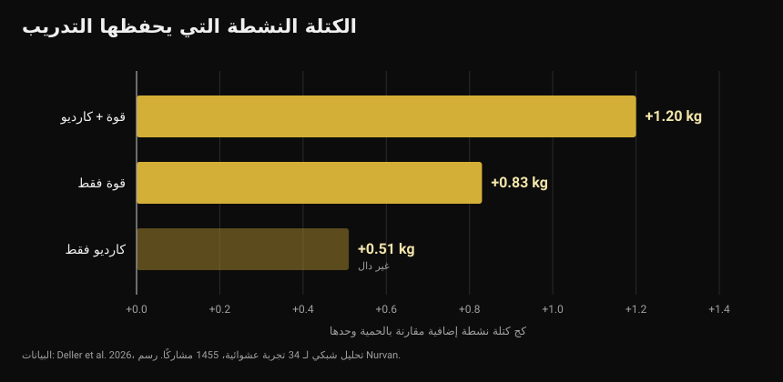

# CBL-514، الدواء الذي يقتل الخلايا الدهنية: ما الثابت وما غير الثابت

في أواخر سبتمبر 2026، عُرض في المؤتمر الأوروبي للسكري دواء تجريبي يقتل الخلايا الدهنية بحقنة. تحدثت العناوين عن «شفط دهون في محقنة» وعن دواء جديد لإنقاص الوزن. التجارب المنشورة تقول شيئًا أدق، وفي بعضه مختلفًا.

بقلم [Giammaria Loi](/autore/giammaria-loi) · حُدِّث في 4 أكتوبر 2026

## باختصار

- يُحقن CBL-514 تحت الجلد فيحفّز الاستماتة، أي الموت المبرمج، في الخلايا الشحمية التي تخزّن الدهون. وهو غير مرخّص في أي بلد: ما زال قيد البحث.
- أرقام التجارب على البشر حقيقية ومنشورة. في المرحلة 2 فقد 69.6% من المعالَجين ما لا يقل عن 150 مل من دهون البطن مقابل 0% في الدواء الوهمي. وفي المرحلة 2b تحسّن 76.7% بدرجة واحدة على الأقل على مقياس الطبيب مقابل 18.9%، مع انخفاض متوسط في حجم الدهون بنسبة 20.3% بالرنين المغناطيسي.
- **ليس دواءً لإنقاص الوزن.** عالجت التجارب البطن لدى أشخاص مؤشر كتلة جسمهم بين 22 و30 غالبًا، وكانت النهايات الأساسية مقاييس تقييم دهون البطن، لا وزن الجسم.
- رقم الدهون الحشوية (−12% مقابل +6% للدواء الوهمي) جاء من عرض في مؤتمر على 40 مشاركًا ولم يخضع بعد لمراجعة الأقران: تعامل معه كنتيجة أولية.
- فكرة أن إزالة الخلايا الدهنية تمنع استعادة الوزن لم تُلاحظ إلا في الفئران. لم تُختبر في البشر، وتظهر مراجعة تحليلية أن ما يحمي الكتلة النشطة فعلًا أثناء العجز هو التمرين: نحو نصف كيلوغرام أو أكثر مقارنة بالحمية وحدها.

*قياس تركيب الجسم. الصورة: U.S. Marine Corps، ملكية عامة.*

## ما هو CBL-514 وكيف يعمل

CBL-514 جزيء صغير طوّرته شركة Caliway Biopharmaceuticals التايوانية. يُحقن مباشرة في الدهون تحت الجلد، أي الطبقة بين الجلد والعضلة.

الآلية المعلنة هي الاستماتة الانتقائية: يدفع الدواء الخلية الدهنية إلى الموت بشكل منظم، دون النخر الذي يضرّ الأنسجة المحيطة. في التجارب المنشورة لم يُلاحظ نخر ولا إصابات عصبية، وكانت أكثر الآثار الجانبية شيوعًا تفاعلات في موضع الحقن — ألم واحمرار وتورم — خفيفة إلى متوسطة ومؤقتة.

*النسيج الدهني تحت المجهر: الخلايا الشحمية هي الخلايا الدائرية الكبيرة. الصورة: Veeresh likhitha، Wikimedia Commons، CC BY-SA 4.0.*

وهناك رقم لا تكاد تذكره العناوين. أظهرت دراسة كلاسيكية نُشرت في *Nature* عام 2008 أن **عدد الخلايا الشحمية لدى البالغ ثابت عمليًا**: يبقى كما هو عند النحيفين والمصابين بالسمنة، حتى بعد فقدان وزن كبير، لأنه يتحدد في الطفولة والمراهقة. ومع ذلك يتجدد نحو 10% من هذه الخلايا سنويًا. لهذا اقتُرح تدميرها كهدف دوائي — ولهذا أيضًا فإن الأثر ليس دائمًا تلقائيًا: التجدد السنوي بنسبة 10% مستمر.

## أرقام التجارب على البشر

تجربتان عشوائيتان، نُشرتا كلتاهما في *Aesthetic Surgery Journal*، اختبرتا الدواء على البطن.

*الاستجابة لـ CBL-514 في تجربتي المرحلة 2 و2b — البيانات: Gold et al. 2025 و Lorenc et al. 2026. رسم Nurvan.*

في تجربة **المرحلة 2** (76 مشاركًا، توزيع عشوائي 2:1، حتى أربع جلسات كل أربعة أسابيع)، وبعد ثمانية أسابيع من الجلسة الأخيرة، فقد 69.6% من مجموعة الدواء ما لا يقل عن 150 مل من الدهون تحت الجلد بقياس الموجات فوق الصوتية، مقابل لا أحد في مجموعة الدواء الوهمي. وتجاوز 60.9% عتبة 200 مل، وبلغ 12 من أصل 28 مستجيبًا الهدف بعد جلسة واحدة.

وفي تجربة **المرحلة 2b** (108 بالغين لديهم دهون بطن متوسطة إلى شديدة، توزيع عشوائي 1:1، حتى أربع جلسات بفاصل ثلاثة أسابيع)، تحسّن 76.7% من مجموعة الدواء بدرجة واحدة على الأقل على المقياس الذي يقيّمه الطبيب، مقابل 18.9% للدواء الوهمي. وقدّر الرنين المغناطيسي انخفاضًا متوسطًا في حجم دهون البطن قدره 152.9 مل، أي 20.3%.

ملاحظتان تغيّران القراءة. الأولى أن التجربتين **مفردتا التعمية**: المشاركون لم يعرفوا ما تلقّوه، لكن الباحثين عرفوا — وهو تصميم أضعف من التعمية المزدوجة حين تكون النتيجة مقياس تقييم بصريًا. والثانية أن عدة مؤلفين موظفون في Caliway، الشركة المطوّرة للدواء والممولة للدراستين. هذه ليست تهمة بل السياق المعتاد لدواء قيد التطوير: يعني أن التأكيد يحتاج دراسات أكبر ومستقلة.

وبخصوص الدراسات الأكبر: قال خبر أواخر سبتمبر إن المرحلة 3 «قيد التصميم». **لقد بدأت بالفعل.** في 23 سبتمبر 2026 أعلنت Caliway عن أول مريض عولج في SUPREME-01، وهي تجربة محورية عالمية عشوائية مزدوجة التعمية على نحو 320 مشاركًا في الولايات المتحدة وكندا. لا نتائج بعد.

## بيانات الدهون الحشوية

ما عُرض في ميلانو بمؤتمر الجمعية الأوروبية لدراسة السكري، بين 28 سبتمبر و2 أكتوبر 2026، دراسة مختلفة: 40 مشاركًا بمؤشر كتلة جسم بين 22 و30، بجرعات حتى 600 ملغ، مع التركيز على الدهون الحشوية — تلك المحيطة بالأعضاء والأوثق ارتباطًا بخطر القلب والأوعية ومقاومة الإنسولين.

بعد شهر، انخفضت الدهون الحشوية بمتوسط 12% في مجموعة الدواء وارتفعت 6% في الدواء الوهمي؛ وفي المتابعة اللاحقة كان الانخفاض نحو 10% مقابل ارتفاع يقارب 12%.

أرقام مثيرة للاهتمام، لكن اقرأها كما هي: **بيانات مؤتمر، على 40 شخصًا، دون مراجعة أقران بعد.** ملخص المؤتمر لم يمرّ بالمرشح نفسه الذي يمرّ به مقال المجلة، وكثيرًا ما تتغير الأرقام في النسخة النهائية. حتى ذلك الحين هي إشارة واعدة، لا نتيجة ثابتة.

## ما تقوله الأبحاث فعلًا

**«إنه دواء لإنقاص الوزن.»** → **غير صحيح.** تستهدف التجارب المنشورة خفض الدهون تحت الجلد في البطن ومقاييس تقييم جمالية، لدى أشخاص مؤشر كتلة جسمهم طبيعي أو مرتفع قليلًا في معظمه. وزن الجسم ليس النتيجة المقاسة. هو دواء للدهون الموضعية، لا للسمنة.

**«نحو 70% يفقدون 150 مل دهون على الأقل مقابل 0% للدواء الوهمي.»** → **مؤكد**، في تجربة المرحلة 2 المنشورة عام 2025.

**«أكثر من 75% يتحسنون بدرجة واحدة على الأقل على مقياس دهون البطن.»** → **مؤكد**، في المرحلة 2b: 76.7% مقابل 18.9%.

**«أثره كشفط الدهون.»** → **يحتاج تدقيقًا.** متوسط انخفاض الحجم بالرنين هو 20.3% في المنطقة المعالجة: حقيقي، لكنه من رتبة مختلفة عن الجراحة، ومحصور في البطن، ويتحقق عبر عدة جلسات. ولم تقارن أي تجربة الدواء بشفط الدهون مباشرة.

**«يخفض الدهون الحشوية أيضًا.»** → **غير قابل للتحقق بعد.** البيانات موجودة لكنها من مؤتمر، على 40 شخصًا، دون نشر خاضع لمراجعة الأقران.

**«يمنع استعادة الوزن بعد التوقف عن أدوية GLP-1.»** → **يحتاج تدقيقًا، وفي الفئران فقط.** لم يُختبر في البشر. وما نعرفه عن البشر يشير إلى العكس: في تجربة SURMOUNT-4 المنشورة في *JAMA*، استعاد من أوقفوا تيرزيباتيد 14% من وزنهم وسطيًا خلال 52 أسبوعًا، بينما فقد المستمرون 5.5% إضافية.

**«المرحلة 3 لم تبدأ بعد.»** → **معلومة قديمة.** بدأت في 23 سبتمبر 2026.

## كيف تطبّق ذلك

CBL-514 غير متاح للشراء وغير مرخّص ولا يخص أي قرار يمكنك اتخاذه اليوم. السؤال المفيد مختلف: في هذه الأثناء، ما الذي ينفع لتركيب الجسم؟

*تدريب القوة هو المتغير الذي يحمي الكتلة النشطة عند خفض السعرات. الصورة: Nenad Stojkovic، Wikimedia Commons، CC BY 2.0.*

1. **تمرّن أثناء خفض السعرات، لا بعده فقط.** قارنت مراجعة تحليلية شبكية لعام 2026 شملت 34 تجربة عشوائية و1455 مشاركًا بين تقييد السعرات وحده وتقييدها مع التمرين: منع التمرين وسطيًا 45.7% من فقدان الكتلة الخالية من الدهون. وكان الأثر الأكبر للتدريب المختلط (قوة مع كارديو، +1.20 كجم مقارنة بالحمية وحدها)، يليه تدريب القوة وحده (+0.83 كجم).

*الكتلة النشطة المحفوظة مقارنة بتقييد السعرات وحده — البيانات: Deller et al. 2026. رسم Nurvan.*

2. **لا تبالغ في العجز.** قدّرت مراجعة انحدارية لتدريب المقاومة تحت تقييد الطاقة أن عجزًا بنحو 500 سعرة يوميًا هو الحد الذي تتوقف بعده زيادة الكتلة النشطة حتى مع التدريب. من يريد بناء العضلة فليتجنب العجز الطويل، ومن يريد الحفاظ عليها فليبقَ تحت هذا الخط.

3. **أبقِ البروتين مرتفعًا.** هو الأداة الغذائية الأقوى دليلًا عند خفض السعرات: تناولناها بالتفصيل في مقال [البروتين أثناء التجفيف](/ar/blog/protein-intake-cutting).

4. **قِس ولا تقدّر بالنظر.** الوزن والمحيطات والأثقال المرفوعة عبر الوقت تخبرك إن كنت تفقد دهونًا أم عضلًا أيضًا. في المرآة يختلط الأمران.

5. **الدهون الموضعية لا تُختار.** لا يوجد تمرين يحرق دهون المنطقة التي يدرّبها. وأين تفقد أولًا يعتمد إلى حد كبير على الجينات والهرمونات — وهو موضوع تناولناه في مقال [المستجيبون الضعفاء والأقوياء](/ar/blog/genetics-high-low-responders).

الأرقام أعلاه نطاقات ومتوسطات رُصدت في الدراسات، وليست وصفة علاجية. إن كانت لديك أمراض أو تتناول أدوية أو تتبع حمية بتعليمات طبية، فاستشر طبيبك قبل أي تغيير.

> ### Nurvan — تركيب الجسم يُقرأ عبر الزمن
>
> نقصان كيلوغرامين قد يكون دهونًا أو ماءً أو عضلًا: لا تعرف إلا بقراءة الوزن والمحيطات والأثقال معًا عبر الوقت. يسجّل Nurvan المحيطات والوزن إلى جانب الحمل والتكرارات وRIR لكل حصة، ويعتمد قسم التغذية على قاعدة بيانات الأغذية الرسمية CREA — فترى إن كان العجز يأخذ منك دهونًا أم قوة أيضًا.
>
> **[جرّب Nurvan](https://nurvan.app)**

## أسئلة شائعة

**هل CBL-514 متاح في الأسواق؟**
لا. غير مرخّص في أي بلد، وما زال في التجارب: دراستا المرحلة 2 و2b منشورتان، وتجربة المرحلة 3 SUPREME-01 عالجت أول مريض في 23 سبتمبر 2026.

**هل ينقص CBL-514 الوزن؟**
ليس هذا غرضه. تقيس التجارب المنشورة انخفاض الدهون تحت الجلد في البطن لدى أشخاص بوزن طبيعي أو مرتفع قليلًا، لا فقدان وزن الجسم.

**ما الفرق بينه وبين أوزمبيك أو مونجارو؟**
تعمل أدوية GLP-1 على الشهية والأيض وتخفّض الوزن في الجسم كله؛ أما CBL-514 فيُحقن في منطقة ويعمل موضعيًا على خلاياها الدهنية. فئتان مختلفتان باستطبابات ومخاطر ومستويات أدلة مختلفة.

**إذا ماتت الخلايا الدهنية، هل النتيجة دائمة؟**
غير معروف. عدد الخلايا الشحمية ثابت لدى البالغين، لكن نحو 10% منها يتجدد سنويًا، ولم تتابع أي دراسة منشورة المرضى مدة كافية للإجابة. وقد أعلنت Caliway عن دراسة مرحلة 3 مخصّصة للمتابعة طويلة الأمد.

**هل يغني عن التغذية والتدريب؟**
لا توجد بيانات تشير إلى ذلك. تغطي التجارب منطقة واحدة من الجسم وبضعة أسابيع، بينما يعتمد الوزن وتركيب الجسم على المدى المتوسط على التغذية وتدريب القوة والاستمرارية.

## اقرأ أيضًا

- [البروتين أثناء التجفيف: كم تحتاج منه فعلًا؟](/ar/blog/protein-intake-cutting) — النطاق الذي يحمي الكتلة النشطة عند خفض السعرات.
- [الأرز المبرّد: كم يساوي النشا المقاوم فعلًا](/ar/blog/aruz-mubarrad-nasha-muqawim) — الأرقام الحقيقية خلف حيلة منتشرة.
- [المستجيبون الضعفاء: ما مدى تأثير الجينات في العضلات؟](/ar/blog/genetics-high-low-responders) — لماذا يعطي البرنامج نفسه نتائج مختلفة لأشخاص مختلفين.

## المصادر

1. Gold M, Schlessinger J, Goodman GJ, Dayan S, DuBois J, Ling YF, Sheu AY, Ho WWS, Chou YC, 2025. *Efficacy and Safety of CBL-514 Injection in Reducing Abdominal Subcutaneous Fat: A Randomized, Single-Blind, Placebo-Controlled Phase II Study.* Aesthetic Surgery Journal 45(6):611-620. PMID 40037659 — [DOI](https://doi.org/10.1093/asj/sjaf032)
2. Lorenc ZP, Gold M, Schlessinger J, Lain ET, Smith S, Downie J, Cox SE, Ling YF, Sheu AY, Lu CY, Chou YC, 2026. *Randomized Phase 2b Trial of CBL-514 Injection for Abdominal Subcutaneous Fat Reduction With Clinician- and Patient-reported Outcomes and MRI Assessment.* Aesthetic Surgery Journal. PMID 42159040 — [DOI](https://doi.org/10.1093/asj/sjag092)
3. Spalding KL, Arner E, Westermark PO, Bernard S, Buchholz BA, Bergmann O, Blomqvist L, Hoffstedt J, Näslund E, Britton T, Concha H, Hassan M, Rydén M, Frisén J, Arner P, 2008. *Dynamics of fat cell turnover in humans.* Nature 453(7196):783-787. PMID 18454136 — [DOI](https://doi.org/10.1038/nature06902)
4. Aronne LJ, Sattar N, Horn DB, Bays HE, Wharton S, Lin WY, Ahmad NN, Zhang S, Liao R, Bunck MC, Jouravskaya I, Murphy MA, 2024. *Continued Treatment With Tirzepatide for Maintenance of Weight Reduction in Adults With Obesity: The SURMOUNT-4 Randomized Clinical Trial.* JAMA 331(1):38-48. PMID 38078870 — [DOI](https://doi.org/10.1001/jama.2023.24945)
5. Deller M, Weiershaus J, Held S, Brinkmann C, 2026. *Effects of Calorie Restriction With and Without Strength, Endurance or Mixed Training on Fat-Free and Skeletal Muscle Mass in Overweight or Obese Individuals — A Systematic Review With Pairwise Meta-Analysis and Network Meta-Analysis of Randomized Controlled Studies.* Diabetes, Obesity and Metabolism 28(8):6810-6823. PMID 42144246 — [DOI](https://doi.org/10.1111/dom.70873)
6. Murphy C, Koehler K, 2022. *Energy deficiency impairs resistance training gains in lean mass but not strength: A meta-analysis and meta-regression.* Scandinavian Journal of Medicine & Science in Sports 32(1):125-137. PMID 34623696 — [DOI](https://doi.org/10.1111/sms.14075)

المصادر العلمية مستخرجة من PubMed. جرى التحقق من حالة تجربة المرحلة 3 SUPREME-01 من [البيان الرسمي لشركة Caliway Biopharmaceuticals بتاريخ 23 سبتمبر 2026](https://www.caliwaybiopharma.com/en/news-detail/-CBL-514-SUPREME-01-FPI-ObesityWeek-2026-ENG/)، تمت المراجعة في 4 أكتوبر 2026. بيانات الدهون الحشوية من عرض في مؤتمر EASD بميلانو (28 سبتمبر – 2 أكتوبر 2026) ولم تُنشر بعد في مجلة خاضعة لمراجعة الأقران.

نقطة الانطلاق: مقال لـ Andrea Centini على [Fanpage](https://www.fanpage.it/innovazione/scienze/nuovo-farmaco-per-perdere-peso-distrugge-il-grasso-sottocutaneo-come-una-liposuzione-ben-tollerato-negli-studi/)، 2 أكتوبر 2026. نص هذا المقال وبنيته وتحققه من الوقائع أصلية.

---

**Giammaria Loi** هو مؤسس Nurvan. يتدرب بالأثقال منذ 2012، ويعمل مدربًا شخصيًا ومدرب أداء معتمدًا من FIPE منذ 2013، ويشارك في منافسات رفع الأثقال القوة على المستوى الوطني منذ 2018. كل مقال يوقّعه ينطلق من الدراسات العلمية وينتهي إلى ما ينفع فعلًا في النادي.

> ملاحظة: محتوى معلوماتي لا يغني عن رأي طبيب أو مختص. CBL-514 دواء تجريبي غير مرخّص: لا شيء في هذا المقال يُفهم كنصيحة علاجية.
