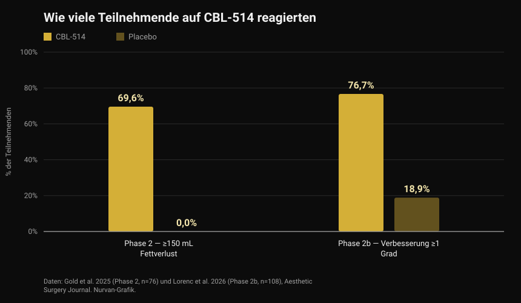
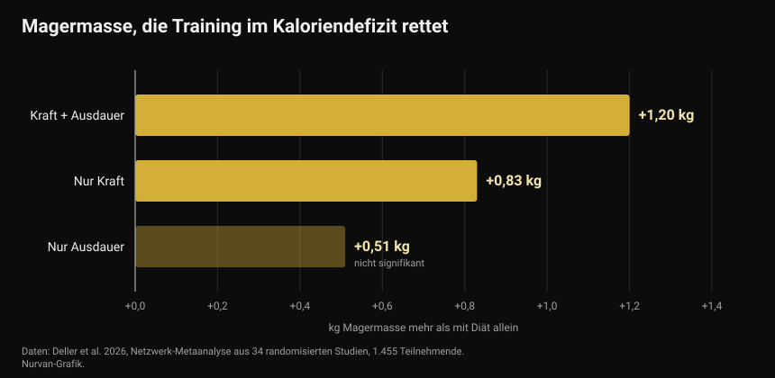

# CBL-514, das Medikament, das Fettzellen zerstört: Was belegt ist und was nicht

Ende September 2026 wurde auf dem europäischen Diabeteskongress ein experimentelles Medikament vorgestellt, das Fettzellen per Injektion abtötet. Die Schlagzeilen sprachen von Fettabsaugung aus der Spritze und von einem neuen Abnehmmedikament. Die veröffentlichten Studien sagen etwas Genaueres — und teilweise etwas anderes.

Von [Giammaria Loi](/autore/giammaria-loi) · aktualisiert am 4. Oktober 2026

## Kurz gefasst

- CBL-514 wird unter die Haut gespritzt und löst Apoptose aus, den programmierten Zelltod der Adipozyten — der Zellen, die Fett speichern. Es ist nirgendwo zugelassen und befindet sich noch in der Erprobung.
- Die Zahlen aus den Studien am Menschen sind real und publiziert. In Phase 2 verloren 69,6 % der Behandelten mindestens 150 mL Bauchfett, in der Placebogruppe niemand. In Phase 2b verbesserten sich 76,7 % um mindestens einen Grad auf der ärztlichen Skala gegenüber 18,9 % unter Placebo, bei einer durchschnittlichen Volumenreduktion von 20,3 % im MRT.
- **Es ist kein Abnehmmedikament.** Behandelt wurde der Bauch, bei Menschen mit einem BMI überwiegend zwischen 22 und 30, und die primären Endpunkte waren Bewertungsskalen für Bauchfett, nicht das Körpergewicht.
- Die Zahl zum viszeralen Fett (−12 % gegenüber +6 % unter Placebo) stammt aus einem Kongressvortrag mit 40 Teilnehmenden und ist noch nicht begutachtet: vorläufig behandeln.
- Dass das Entfernen von Fettzellen eine erneute Gewichtszunahme verhindert, wurde bisher nur bei Mäusen beobachtet. Beim Menschen ist es ungetestet, und eine Metaanalyse zeigt: Was die Magermasse in der Diät wirklich schützt, ist Training — rund ein halbes Kilo Magermasse oder mehr im Vergleich zur reinen Diät.

*Messung der Körperzusammensetzung. Foto: U.S. Marine Corps, gemeinfrei.*

## Was CBL-514 ist und wie es wirkt

CBL-514 ist ein kleines Molekül des taiwanesischen Unternehmens Caliway Biopharmaceuticals. Es wird direkt in das Unterhautfettgewebe gespritzt, die Schicht zwischen Haut und Muskel.

Der angegebene Wirkmechanismus ist selektive Apoptose: Das Medikament bringt die Fettzelle dazu, geordnet abzusterben, ohne die Nekrose, die umliegendes Gewebe schädigen würde. In den publizierten Studien traten weder Nekrosen noch Nervenschäden auf; die häufigsten Nebenwirkungen waren Reaktionen an der Einstichstelle — Schmerz, Rötung, Schwellung — leicht bis mittelschwer und vorübergehend.

*Fettgewebe unter dem Mikroskop: Adipozyten sind die großen runden Zellen. Foto: Veeresh likhitha, Wikimedia Commons, CC BY-SA 4.0.*

Eine Zahl, die kaum eine Schlagzeile mitliefert. Eine mittlerweile klassische Arbeit in *Nature* aus dem Jahr 2008 zeigte, dass **die Zahl der Fettzellen bei Erwachsenen im Grunde feststeht**: Sie bleibt bei schlanken wie bei adipösen Menschen konstant, selbst nach deutlichem Gewichtsverlust, weil sie in Kindheit und Jugend festgelegt wird. Rund 10 % dieser Zellen werden allerdings jedes Jahr erneuert. Genau deshalb wurde ihre Zerstörung als pharmakologisches Ziel vorgeschlagen — und genau deshalb ist der Effekt nicht automatisch dauerhaft: Der jährliche Austausch von 10 % läuft weiter.

## Die Zahlen aus den Studien am Menschen

Zwei randomisierte Studien, beide im *Aesthetic Surgery Journal* veröffentlicht, haben das Medikament am Bauch getestet.

*Ansprechen auf CBL-514 in den Phase-2- und 2b-Studien — Daten: Gold et al. 2025 und Lorenc et al. 2026. Nurvan-Grafik.*

In der **Phase-2-Studie** (76 Teilnehmende, Randomisierung 2:1, bis zu vier Behandlungen alle vier Wochen) hatten acht Wochen nach der letzten Behandlung 69,6 % der Wirkstoffgruppe mindestens 150 mL Unterhautfett verloren, gemessen per Ultraschall — in der Placebogruppe niemand. 60,9 % überschritten zusätzlich die 200-mL-Schwelle, und 12 von 28 Respondern erreichten das Ziel nach einer einzigen Sitzung.

In der **Phase-2b-Studie** (108 Erwachsene mit moderatem bis starkem Bauchfett, Randomisierung 1:1, bis zu vier Behandlungen im Abstand von drei Wochen) verbesserten sich 76,7 % der Wirkstoffgruppe um mindestens einen Grad auf der ärztlich beurteilten Skala, gegenüber 18,9 % unter Placebo. Das MRT schätzte eine durchschnittliche Reduktion des Bauchfettvolumens von 152,9 mL, also 20,3 %.

Zwei Einschränkungen verändern die Lesart. Erstens sind beide Studien **einfach verblindet**: Die Teilnehmenden wussten nicht, was sie bekamen, die Prüfärzte schon — ein schwächeres Design als die Doppelverblindung, wenn der Endpunkt eine visuelle Bewertungsskala ist. Zweitens sind mehrere Autoren Angestellte von Caliway, dem Unternehmen, das das Medikament entwickelt und die Studien finanziert hat. Das ist kein Vorwurf, sondern der übliche Rahmen bei einem Medikament in Entwicklung: Es braucht größere, unabhängige Bestätigung.

Apropos größere Studien: Die Meldung von Ende September sprach davon, die Phase 3 sei „in Planung". **Sie läuft bereits.** Am 23. September 2026 meldete Caliway den ersten behandelten Patienten in SUPREME-01, einer globalen, randomisierten, doppelblinden Zulassungsstudie mit rund 320 Teilnehmenden in den USA und Kanada. Ergebnisse gibt es noch keine.

## Der Befund zum viszeralen Fett

Was vom 28. September bis 2. Oktober 2026 in Mailand auf dem Kongress der European Association for the Study of Diabetes präsentiert wurde, ist eine andere Studie: 40 Teilnehmende mit einem BMI zwischen 22 und 30, Dosierung bis 600 mg, mit Fokus auf das viszerale Fett — jenes, das die Organe umgibt und am stärksten mit kardiovaskulärem Risiko und Insulinresistenz zusammenhängt.

Nach einem Monat war das viszerale Fett in der Wirkstoffgruppe im Mittel um 12 % gesunken und unter Placebo um 6 % gestiegen; bei der späteren Kontrolle betrug die Reduktion rund 10 % gegenüber einem Anstieg von fast 12 %.

Interessante Zahlen, aber sie sind zu lesen, was sie sind: **Kongressdaten, an 40 Personen, noch ohne Peer Review.** Ein Kongressabstract hat nicht denselben Filter durchlaufen wie ein Zeitschriftenartikel, und die Zahlen verschieben sich in der Endfassung regelmäßig. Bis dahin ist das ein vielversprechendes Signal, kein gesichertes Ergebnis.

## Was die Forschung wirklich sagt

**„Es ist ein Medikament zum Abnehmen."** → **Widerlegt.** Die publizierten Studien zielen auf die Reduktion von Unterhautfett am Bauch und auf ästhetische Bewertungsskalen, bei Menschen mit überwiegend normalem oder leicht erhöhtem BMI. Das Körpergewicht ist nicht der gemessene Endpunkt. Es ist ein Medikament gegen lokales Fett, nicht gegen Adipositas.

**„Rund 70 % verlieren mindestens 150 mL Fett gegenüber 0 % unter Placebo."** → **Bestätigt**, in der 2025 publizierten Phase-2-Studie.

**„Über 75 % verbessern sich um mindestens einen Grad auf der Bauchfettskala."** → **Bestätigt**, in Phase 2b: 76,7 % gegenüber 18,9 %.

**„Es wirkt wie eine Fettabsaugung."** → **Zu präzisieren.** Die mittlere Volumenreduktion im MRT liegt bei 20,3 % im behandelten Areal: real, aber in einer anderen Größenordnung als eine Operation, auf den Bauch begrenzt und über mehrere Sitzungen erreicht. Keine Studie hat das Medikament direkt mit einer Liposuktion verglichen.

**„Es senkt auch das viszerale Fett."** → **Noch nicht überprüfbar.** Die Daten existieren, stammen aber von einem Kongress, aus 40 Personen, ohne begutachtete Publikation.

**„Es verhindert die Gewichtszunahme nach dem Absetzen von GLP-1-Medikamenten."** → **Zu präzisieren, und nur bei Mäusen.** Am Menschen ungetestet. Was wir beim Menschen wissen, deutet in die andere Richtung: In der in *JAMA* publizierten Studie SURMOUNT-4 nahmen Personen, die Tirzepatid absetzten, in 52 Wochen im Schnitt 14 % Gewicht wieder zu, während die Weiterbehandelten weitere 5,5 % verloren.

**„Die Phase 3 muss erst noch beginnen."** → **Überholt.** Sie begann am 23. September 2026.

## Wie du das umsetzt

CBL-514 ist nicht käuflich, nicht zugelassen und betrifft keine Entscheidung, die du heute treffen kannst. Die nützliche Frage ist eine andere: Was wirkt in der Zwischenzeit auf die Körperzusammensetzung?

*Krafttraining ist die Variable, die Magermasse schützt, wenn die Kalorien sinken. Foto: Nenad Stojkovic, Wikimedia Commons, CC BY 2.0.*

1. **Trainiere während der Diät, nicht erst danach.** Eine Netzwerk-Metaanalyse von 2026 mit 34 randomisierten Studien und 1.455 Teilnehmenden verglich reine Kalorienrestriktion mit Kalorienrestriktion plus Training: Training verhinderte im Mittel 45,7 % des Verlusts an fettfreier Masse. Den größten Effekt hatte gemischtes Training (Kraft plus Ausdauer, +1,20 kg gegenüber reiner Diät), gefolgt von reinem Krafttraining (+0,83 kg).

*Erhaltene Magermasse im Vergleich zur reinen Kalorienrestriktion — Daten: Deller et al. 2026. Nurvan-Grafik.*

2. **Übertreib es nicht mit dem Defizit.** Eine Metaregression zu Krafttraining unter Energierestriktion schätzte, dass ein Defizit von rund 500 kcal pro Tag die Schwelle ist, ab der du trotz Training keine Magermasse mehr aufbaust. Wer Muskeln aufbauen will, sollte lange Defizite meiden; wer nur erhalten will, bleibt darunter.

3. **Halte das Protein hoch.** Das ist der am besten belegte Ernährungshebel, wenn die Kalorien sinken: ausführlich im Artikel zu [Protein in der Diät](/blog/protein-in-der-diaet).

4. **Miss, schätze nicht.** Gewicht, Umfänge und die bewegten Lasten über die Zeit zeigen, ob du Fett verlierst oder auch Muskeln. Im Spiegel verschwimmt beides.

5. **Lokales Fett lässt sich nicht aussuchen.** Keine Übung verbrennt das Fett über dem Muskel, den sie trainiert. Wo du zuerst abnimmst, hängt stark von Genetik und Hormonen ab — ein Thema aus unserem Artikel über [High und Low Responder](/blog/genetik-high-low-responder).

Die Zahlen oben sind Spannen und Mittelwerte aus Studien, keine Verordnung. Wenn du Vorerkrankungen hast, Medikamente nimmst oder eine Diät auf ärztliche Anweisung befolgst, sprich vor Änderungen mit deiner Ärztin oder deinem Arzt.

> ### Nurvan — Körperzusammensetzung erkennt man in der Zeitreihe
>
> Zwei Kilo weniger können Fett, Wasser oder Muskel sein: Das siehst du nur, wenn du Gewicht, Maße und Lasten über die Zeit zusammen liest. Nurvan erfasst Maße und Körpergewicht neben Last, Wiederholungen und RIR jeder Einheit, und der Ernährungsteil arbeitet mit der offiziellen CREA-Lebensmitteldatenbank — so siehst du, ob dein Defizit Fett kostet oder auch Kraft.
>
> **[Nurvan ausprobieren](https://nurvan.app)**

## Häufige Fragen

**Ist CBL-514 schon erhältlich?**
Nein. Es ist in keinem Land zugelassen. Es befindet sich noch in Studien: Die Phase-2- und 2b-Studien sind publiziert, und die Phase-3-Studie SUPREME-01 behandelte am 23. September 2026 den ersten Patienten.

**Nimmt man mit CBL-514 ab?**
Das ist nicht sein Zweck. Die publizierten Studien messen die Reduktion von Unterhautfett am Bauch bei Menschen mit normalem oder leicht erhöhtem Gewicht, nicht den Gewichtsverlust.

**Was ist der Unterschied zu Ozempic oder Mounjaro?**
GLP-1-Medikamente wirken auf Appetit und Stoffwechsel und senken das Gewicht am ganzen Körper; CBL-514 wird in ein Areal gespritzt und wirkt lokal auf dessen Fettzellen. Unterschiedliche Kategorien mit unterschiedlichen Indikationen, Risiken und Evidenzgraden.

**Wenn die Fettzellen absterben: hält das Ergebnis für immer?**
Unbekannt. Die Zahl der Adipozyten ist bei Erwachsenen stabil, aber etwa 10 % werden jährlich erneuert, und keine publizierte Studie hat die Patienten lange genug begleitet. Caliway hat eine eigene Phase-3-Studie zur Langzeitnachbeobachtung angekündigt.

**Kann es Ernährung und Training ersetzen?**
Dafür gibt es keine Daten. Die Studien decken ein Körperareal über wenige Wochen ab, während Gewicht und Körperzusammensetzung mittelfristig von Ernährung, Krafttraining und Beständigkeit abhängen.

## Lies auch

- [Protein in der Diät: Wie viel du wirklich brauchst](/blog/protein-in-der-diaet) — die Spanne, die Magermasse schützt, wenn du Kalorien kürzt.
- [Abgekühlter Reis: wie viel resistente Stärke bringt](/blog/abgekuehlter-reis-resistente-staerke) — die echten Zahlen hinter einem viralen Trick.
- [Low Responder: Wie viel Genetik steckt im Muskelaufbau?](/blog/genetik-high-low-responder) — warum dasselbe Programm bei verschiedenen Menschen unterschiedlich wirkt.

## Quellen

1. Gold M, Schlessinger J, Goodman GJ, Dayan S, DuBois J, Ling YF, Sheu AY, Ho WWS, Chou YC, 2025. *Efficacy and Safety of CBL-514 Injection in Reducing Abdominal Subcutaneous Fat: A Randomized, Single-Blind, Placebo-Controlled Phase II Study.* Aesthetic Surgery Journal 45(6):611-620. PMID 40037659 — [DOI](https://doi.org/10.1093/asj/sjaf032)
2. Lorenc ZP, Gold M, Schlessinger J, Lain ET, Smith S, Downie J, Cox SE, Ling YF, Sheu AY, Lu CY, Chou YC, 2026. *Randomized Phase 2b Trial of CBL-514 Injection for Abdominal Subcutaneous Fat Reduction With Clinician- and Patient-reported Outcomes and MRI Assessment.* Aesthetic Surgery Journal. PMID 42159040 — [DOI](https://doi.org/10.1093/asj/sjag092)
3. Spalding KL, Arner E, Westermark PO, Bernard S, Buchholz BA, Bergmann O, Blomqvist L, Hoffstedt J, Näslund E, Britton T, Concha H, Hassan M, Rydén M, Frisén J, Arner P, 2008. *Dynamics of fat cell turnover in humans.* Nature 453(7196):783-787. PMID 18454136 — [DOI](https://doi.org/10.1038/nature06902)
4. Aronne LJ, Sattar N, Horn DB, Bays HE, Wharton S, Lin WY, Ahmad NN, Zhang S, Liao R, Bunck MC, Jouravskaya I, Murphy MA, 2024. *Continued Treatment With Tirzepatide for Maintenance of Weight Reduction in Adults With Obesity: The SURMOUNT-4 Randomized Clinical Trial.* JAMA 331(1):38-48. PMID 38078870 — [DOI](https://doi.org/10.1001/jama.2023.24945)
5. Deller M, Weiershaus J, Held S, Brinkmann C, 2026. *Effects of Calorie Restriction With and Without Strength, Endurance or Mixed Training on Fat-Free and Skeletal Muscle Mass in Overweight or Obese Individuals — A Systematic Review With Pairwise Meta-Analysis and Network Meta-Analysis of Randomized Controlled Studies.* Diabetes, Obesity and Metabolism 28(8):6810-6823. PMID 42144246 — [DOI](https://doi.org/10.1111/dom.70873)
6. Murphy C, Koehler K, 2022. *Energy deficiency impairs resistance training gains in lean mass but not strength: A meta-analysis and meta-regression.* Scandinavian Journal of Medicine & Science in Sports 32(1):125-137. PMID 34623696 — [DOI](https://doi.org/10.1111/sms.14075)

Wissenschaftliche Quellen über PubMed recherchiert. Der Status der Phase-3-Studie SUPREME-01 wurde anhand der [offiziellen Mitteilung von Caliway Biopharmaceuticals vom 23. September 2026](https://www.caliwaybiopharma.com/en/news-detail/-CBL-514-SUPREME-01-FPI-ObesityWeek-2026-ENG/) geprüft, abgerufen am 4. Oktober 2026. Die Daten zum viszeralen Fett stammen aus einem Vortrag auf dem EASD-Kongress in Mailand (28. September bis 2. Oktober 2026) und sind noch nicht peer-reviewed publiziert.

Ausgangspunkt: ein Artikel von Andrea Centini auf [Fanpage](https://www.fanpage.it/innovazione/scienze/nuovo-farmaco-per-perdere-peso-distrugge-il-grasso-sottocutaneo-come-una-liposuzione-ben-tollerato-negli-studi/), 2. Oktober 2026. Text, Struktur und Faktenprüfung dieses Artikels sind eigenständig.

---

**Giammaria Loi** ist der Gründer von Nurvan. Er trainiert seit 2012 mit Gewichten, arbeitet seit 2013 als FIPE-zertifizierter Personal Trainer und Coach und startet seit 2018 im Powerlifting auf nationaler Ebene. Jeder Artikel von ihm beginnt bei der Studienlage und endet bei dem, was im Studio wirklich funktioniert.

> Hinweis: informativer Inhalt, der die Einschätzung einer Ärztin, eines Arztes oder einer Fachkraft nicht ersetzt. CBL-514 ist ein nicht zugelassenes Prüfpräparat: Nichts in diesem Artikel ist als Therapieempfehlung zu verstehen.
