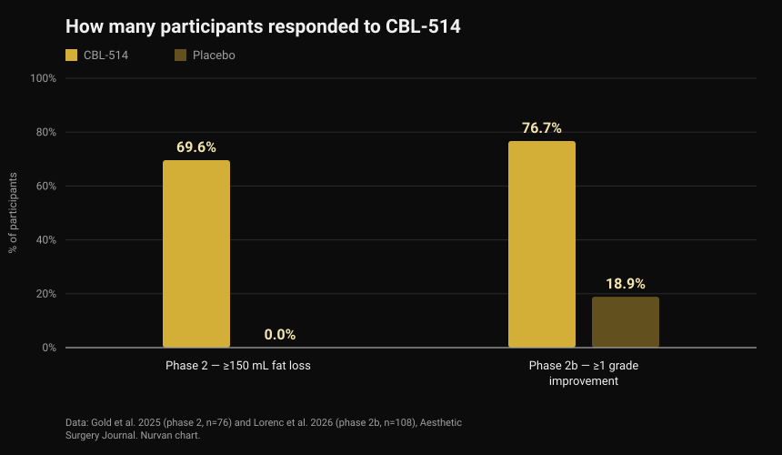
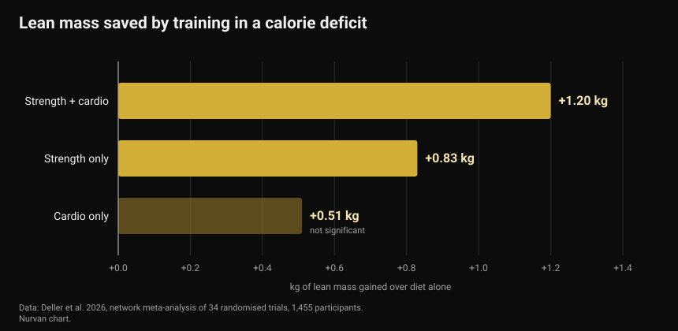

# CBL-514, the drug that kills fat cells: what is proven and what is not

In late September 2026, an experimental drug that destroys fat cells with an injection was presented at Europe's main diabetes congress. Headlines called it liposuction in a syringe and a new weight-loss drug. The published trials say something more specific, and in part something different.

By [Giammaria Loi](/autore/giammaria-loi) · updated 4 October 2026

## In short

- CBL-514 is injected under the skin and triggers apoptosis — programmed death — in adipocytes, the cells that store fat. It is not approved anywhere: it is still experimental.
- The human numbers are real and published. In the phase 2 trial, 69.6% of treated participants lost at least 150 mL of abdominal fat versus 0% on placebo. In phase 2b, 76.7% improved by at least one grade on the clinician scale versus 18.9% on placebo, with a mean 20.3% reduction in fat volume on MRI.
- **It is not a weight-loss drug.** The trials treated the abdomen in people with a BMI mostly between 22 and 30, and the primary endpoints were abdominal fat rating scales, not body weight.
- The visceral fat figure (−12% versus +6% on placebo) comes from a conference presentation in 40 participants and has not been peer reviewed yet. Treat it as preliminary.
- The idea that removing fat cells prevents weight regain has only been seen in mice. In humans it is untested, and a meta-analysis shows what actually protects lean mass during a cut is training — roughly half a kilo or more of lean mass kept compared with dieting alone.

*Body composition measurement. Photo: U.S. Marine Corps, public domain.*

## What CBL-514 is and how it works

CBL-514 is a small molecule developed by the Taiwanese company Caliway Biopharmaceuticals. It is injected straight into subcutaneous fat, the layer between skin and muscle.

The stated mechanism is selective apoptosis: the drug pushes the fat cell to die in an orderly way, without the necrosis that would damage surrounding tissue. Across the published trials no necrosis or nerve injury was observed, and the most common side effects were injection-site reactions — pain, redness, swelling — mild to moderate and temporary.

*Adipose tissue under the microscope: adipocytes are the large round cells. Photo: Veeresh likhitha, Wikimedia Commons, CC BY-SA 4.0.*

One number almost no headline carries. A landmark 2008 *Nature* paper showed that **the number of fat cells in an adult is essentially fixed**: it stays constant in lean and obese people alike, even after major weight loss, because it is set during childhood and adolescence. About 10% of those cells are renewed every year, though. That is why destroying them was proposed as a drug target — and also why the effect is not automatically permanent, since the 10% annual turnover carries on.

## The human trial numbers

Two randomised trials, both published in *Aesthetic Surgery Journal*, tested the drug on the abdomen.

*Response to CBL-514 in the phase 2 and 2b trials — Data: Gold et al. 2025 and Lorenc et al. 2026. Nurvan chart.*

In the **phase 2** trial (76 participants, randomised 2:1, up to four treatments every four weeks), at eight weeks after the final treatment 69.6% of the drug group had lost at least 150 mL of subcutaneous fat on ultrasound, compared with nobody on placebo. Another 60.9% cleared the 200 mL threshold, and 12 of 28 responders got there after a single treatment.

In the **phase 2b** trial (108 adults with moderate to severe abdominal fat, randomised 1:1, up to four treatments three weeks apart), 76.7% of the drug group improved by at least one grade on the clinician-reported scale versus 18.9% on placebo. MRI estimated a mean reduction in abdominal fat volume of 152.9 mL, or 20.3%.

Two caveats change how you read this. First, both trials are **single blind**: participants did not know what they received, but investigators did — a weaker design than double blind when the outcome is a visual rating scale. Second, several authors are employees of Caliway, the company developing the drug, which also sponsored the studies. That is not an accusation, it is the standard setting for a drug in development: it means larger, independent confirmation is still needed.

On larger trials: the late-September news reported that phase 3 was "being designed". **It has already started.** On 23 September 2026 Caliway announced the first patient dosed in SUPREME-01, a global pivotal randomised double-blind trial in roughly 320 participants across the United States and Canada. No results yet.

## The visceral fat finding

What was presented in Milan at the European Association for the Study of Diabetes congress, between 28 September and 2 October 2026, is a different study: 40 participants with a BMI of 22 to 30, dosed up to 600 mg, with the focus on visceral fat — the fat around the organs, the one most tied to cardiovascular risk and insulin resistance.

After a month, visceral fat was down an average 12% in the treated group and up 6% on placebo; at the later check the reduction was around 10% against an increase of almost 12%.

Interesting numbers, but read them for what they are: **conference data, in 40 people, not yet peer reviewed.** A congress abstract has not passed the same filter as a journal article, and figures routinely shift in the final version. Until then it is a promising signal, not an established result.

## What the research actually says

**"It is a weight-loss drug."** → **Busted.** The published trials target abdominal subcutaneous fat reduction and aesthetic rating scales, in people whose BMI is mostly normal or slightly high. Body weight is not the measured outcome. This is a drug for localised fat, not for obesity.

**"Around 70% lost at least 150 mL of fat versus 0% on placebo."** → **Confirmed**, in the phase 2 trial published in 2025.

**"More than 75% improved by at least one grade on the abdominal fat scale."** → **Confirmed**, in phase 2b: 76.7% versus 18.9%.

**"It works like liposuction."** → **Needs nuance.** The mean volume reduction on MRI is 20.3% in the treated area: real, but a different order of magnitude from surgery, confined to the abdomen and spread over several sessions. No trial has compared the drug with liposuction head to head.

**"It also cuts visceral fat."** → **Not verifiable yet.** The data exist but come from a congress, in 40 people, without peer-reviewed publication.

**"It stops weight regain after you quit GLP-1 drugs."** → **Needs nuance, and only in mice.** It has not been tested in humans. What we do know in humans points the other way: in SURMOUNT-4, published in *JAMA*, people who stopped tirzepatide regained an average 14% of body weight over 52 weeks, while those who continued lost a further 5.5%.

**"Phase 3 has yet to begin."** → **Out of date.** It began on 23 September 2026.

## How to apply this

CBL-514 is not on sale, not approved, and not part of any decision you can make today. The useful question is a different one: what works in the meantime for body composition?

*Strength work is the variable that protects lean mass when calories drop. Photo: Nenad Stojkovic, Wikimedia Commons, CC BY 2.0.*

1. **Train while you cut, not just afterwards.** A 2026 network meta-analysis of 34 randomised trials and 1,455 participants compared calorie restriction alone with calorie restriction plus exercise: training prevented an average 45.7% of the fat-free mass that would otherwise be lost. The largest effect came from mixed training (strength plus cardio, +1.20 kg over diet alone), followed by strength alone (+0.83 kg).

*Lean mass kept compared with calorie restriction alone — Data: Deller et al. 2026. Nurvan chart.*

2. **Do not overshoot the deficit.** A meta-regression of resistance training under energy restriction estimated that a deficit of around 500 kcal per day is the point beyond which you stop gaining lean mass even while lifting. If you are building, avoid prolonged deficits; if you are only preserving, stay under that line.

3. **Keep protein high.** It is the nutrition lever with the most support when calories drop — covered in detail in our article on [protein intake while cutting](/blog/protein-intake-cutting).

4. **Measure, do not eyeball.** Weight, girths and the loads you lift over time tell you whether you are losing fat or muscle too. In the mirror the two blur together.

5. **You do not get to choose where the fat goes.** No exercise burns the fat over the muscle it trains. Where you lose first is largely genetics and hormones — a theme we covered in [high and low responders](/blog/genetics-high-low-responders).

The figures above are ranges and averages observed in studies, not a prescription. If you have a medical condition, take medication or follow a diet on medical advice, talk to your doctor before changing anything.

> ### Nurvan — body composition shows up in the time series
>
> Two kilos down can be fat, water or muscle: you only know by reading weight, measurements and loads together over time. Nurvan logs measurements and body weight alongside the load, reps and RIR of every session, and the nutrition side runs on the official CREA food database — so you can see whether your deficit is costing you fat or strength.
>
> **[Try Nurvan](https://nurvan.app)**

## Frequently asked questions

**Is CBL-514 available yet?**
No. It is not approved in any country. It is still in trials: the phase 2 and 2b studies are published, and the phase 3 SUPREME-01 trial dosed its first patient on 23 September 2026.

**Does CBL-514 make you lose weight?**
That is not its purpose. The published trials measure abdominal subcutaneous fat reduction in people of normal or slightly elevated weight, not body weight loss.

**How is it different from Ozempic or Mounjaro?**
GLP-1 drugs act on appetite and metabolism and reduce weight across the whole body; CBL-514 is injected into one area and acts locally on the fat cells there. Different categories, with different indications, risks and levels of evidence.

**If the fat cells die, is the result permanent?**
Nobody knows. Adipocyte numbers are stable in adults, but about 10% are renewed every year, and no published trial has followed patients long enough to answer. Caliway has announced a dedicated long-term follow-up phase 3 study.

**Can it replace diet and training?**
No data suggests so. The trials cover one area of the body over a few weeks, while weight and body composition over the medium term depend on nutrition, strength work and consistency.

## Read next

- [Protein intake while cutting: how much you actually need](/blog/protein-intake-cutting) — the range that protects lean mass when calories drop.
- [Cooled rice and resistant starch: how much it really saves](/blog/cooled-rice-resistant-starch) — the real numbers behind a viral trick.
- [High and low responders: how much genetics decides](/blog/genetics-high-low-responders) — why the same programme gives different people different results.

## Sources

1. Gold M, Schlessinger J, Goodman GJ, Dayan S, DuBois J, Ling YF, Sheu AY, Ho WWS, Chou YC, 2025. *Efficacy and Safety of CBL-514 Injection in Reducing Abdominal Subcutaneous Fat: A Randomized, Single-Blind, Placebo-Controlled Phase II Study.* Aesthetic Surgery Journal 45(6):611-620. PMID 40037659 — [DOI](https://doi.org/10.1093/asj/sjaf032)
2. Lorenc ZP, Gold M, Schlessinger J, Lain ET, Smith S, Downie J, Cox SE, Ling YF, Sheu AY, Lu CY, Chou YC, 2026. *Randomized Phase 2b Trial of CBL-514 Injection for Abdominal Subcutaneous Fat Reduction With Clinician- and Patient-reported Outcomes and MRI Assessment.* Aesthetic Surgery Journal. PMID 42159040 — [DOI](https://doi.org/10.1093/asj/sjag092)
3. Spalding KL, Arner E, Westermark PO, Bernard S, Buchholz BA, Bergmann O, Blomqvist L, Hoffstedt J, Näslund E, Britton T, Concha H, Hassan M, Rydén M, Frisén J, Arner P, 2008. *Dynamics of fat cell turnover in humans.* Nature 453(7196):783-787. PMID 18454136 — [DOI](https://doi.org/10.1038/nature06902)
4. Aronne LJ, Sattar N, Horn DB, Bays HE, Wharton S, Lin WY, Ahmad NN, Zhang S, Liao R, Bunck MC, Jouravskaya I, Murphy MA, 2024. *Continued Treatment With Tirzepatide for Maintenance of Weight Reduction in Adults With Obesity: The SURMOUNT-4 Randomized Clinical Trial.* JAMA 331(1):38-48. PMID 38078870 — [DOI](https://doi.org/10.1001/jama.2023.24945)
5. Deller M, Weiershaus J, Held S, Brinkmann C, 2026. *Effects of Calorie Restriction With and Without Strength, Endurance or Mixed Training on Fat-Free and Skeletal Muscle Mass in Overweight or Obese Individuals — A Systematic Review With Pairwise Meta-Analysis and Network Meta-Analysis of Randomized Controlled Studies.* Diabetes, Obesity and Metabolism 28(8):6810-6823. PMID 42144246 — [DOI](https://doi.org/10.1111/dom.70873)
6. Murphy C, Koehler K, 2022. *Energy deficiency impairs resistance training gains in lean mass but not strength: A meta-analysis and meta-regression.* Scandinavian Journal of Medicine & Science in Sports 32(1):125-137. PMID 34623696 — [DOI](https://doi.org/10.1111/sms.14075)

Scientific sources retrieved from PubMed. The status of the SUPREME-01 phase 3 trial was verified against [Caliway Biopharmaceuticals' official release of 23 September 2026](https://www.caliwaybiopharma.com/en/news-detail/-CBL-514-SUPREME-01-FPI-ObesityWeek-2026-ENG/), accessed 4 October 2026. The visceral fat figures come from a presentation at the EASD congress in Milan (28 September–2 October 2026) and have not yet been published in a peer-reviewed journal.

Starting point: an article by Andrea Centini on [Fanpage](https://www.fanpage.it/innovazione/scienze/nuovo-farmaco-per-perdere-peso-distrugge-il-grasso-sottocutaneo-come-una-liposuzione-ben-tollerato-negli-studi/), 2 October 2026. The text, structure and fact-checking in this article are original.

---

**Giammaria Loi** is the founder of Nurvan. He has been lifting since 2012, has worked as a FIPE-certified personal trainer and coach since 2013, and has competed in powerlifting at national level since 2018. Every article he writes starts from the research and ends with what actually works in the gym.

> Note: this is educational content and does not replace medical advice. CBL-514 is an unapproved experimental drug: nothing here should be read as a treatment recommendation.
