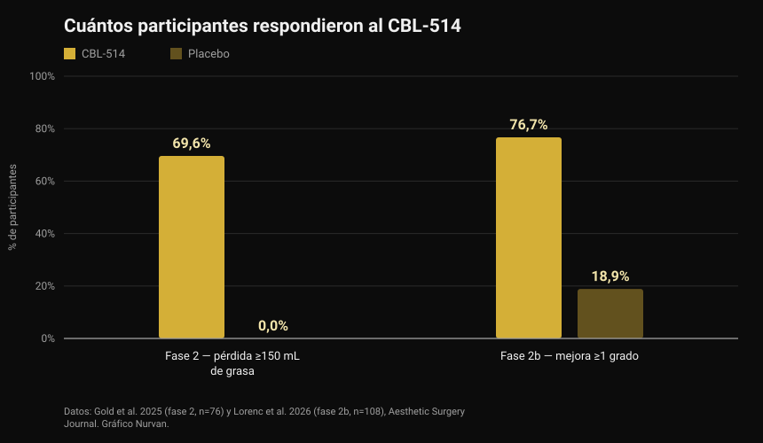
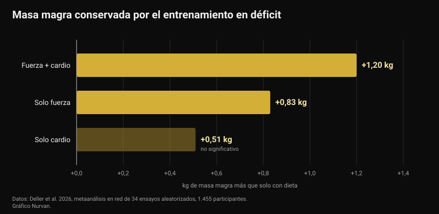

# CBL-514, el fármaco que destruye células de grasa: qué está probado y qué no

A finales de septiembre de 2026, en el congreso europeo sobre diabetes, se presentó un fármaco experimental que mata células de grasa con una inyección. Los titulares hablaron de liposucción en jeringa y de un nuevo fármaco para adelgazar. Los ensayos publicados dicen algo más preciso, y en parte distinto.

Por [Giammaria Loi](/autore/giammaria-loi) · actualizado el 4 de octubre de 2026

## En resumen

- El CBL-514 se inyecta bajo la piel e induce la apoptosis —la muerte programada— de los adipocitos, las células que almacenan grasa. No está aprobado en ningún país: sigue en investigación.
- Las cifras en humanos son reales y están publicadas. En fase 2, el 69,6% de los tratados perdió al menos 150 mL de grasa abdominal frente al 0% del placebo. En fase 2b, el 76,7% mejoró al menos un grado en la escala clínica frente al 18,9% del placebo, con una reducción media del volumen de grasa del 20,3% en resonancia.
- **No es un fármaco para adelgazar.** Los ensayos trataron el abdomen en personas con un IMC en su mayoría entre 22 y 30, y los objetivos principales eran escalas de valoración de la grasa abdominal, no el peso corporal.
- El dato de grasa visceral (−12% frente a +6% del placebo) procede de una presentación en congreso con 40 participantes y aún no ha pasado revisión por pares: trátalo como preliminar.
- La idea de que eliminar células de grasa impide recuperar peso solo se ha visto en ratones. En humanos no se ha probado, y un metaanálisis muestra que lo que de verdad protege la masa magra en déficit es el entrenamiento: medio kilo o más de masa magra conservada frente a la dieta sola.

*Medición de la composición corporal. Foto: U.S. Marine Corps, dominio público.*

## Qué es el CBL-514 y cómo funciona

El CBL-514 es una molécula pequeña desarrollada por la empresa taiwanesa Caliway Biopharmaceuticals. Se inyecta directamente en la grasa subcutánea, la capa que está entre la piel y el músculo.

El mecanismo declarado es la apoptosis selectiva: el fármaco empuja al adipocito a morir de forma ordenada, sin la necrosis que dañaría el tejido de alrededor. En los ensayos publicados no se observaron necrosis ni lesiones nerviosas, y los efectos adversos más frecuentes fueron reacciones en el punto de inyección —dolor, enrojecimiento, hinchazón— leves o moderadas y pasajeras.

*Tejido adiposo al microscopio: los adipocitos son las células grandes y redondas. Foto: Veeresh likhitha, Wikimedia Commons, CC BY-SA 4.0.*

Hay un dato que casi ningún titular recoge. Un trabajo ya clásico publicado en *Nature* en 2008 demostró que **el número de adipocitos de un adulto es prácticamente fijo**: se mantiene constante en personas delgadas y con obesidad, incluso tras una pérdida de peso importante, porque queda definido en la infancia y la adolescencia. Eso sí, cada año se renueva alrededor del 10% de esas células. Por eso destruirlas se propuso como diana farmacológica, y por eso mismo el efecto no es automáticamente permanente: ese recambio del 10% anual sigue.

## Las cifras de los ensayos en humanos

Dos ensayos aleatorizados, ambos publicados en *Aesthetic Surgery Journal*, probaron el fármaco en el abdomen.

*Respuesta al CBL-514 en los ensayos de fase 2 y 2b — Datos: Gold et al. 2025 y Lorenc et al. 2026. Gráfico Nurvan.*

En el ensayo de **fase 2** (76 participantes, aleatorizados 2:1, hasta cuatro tratamientos cada cuatro semanas), ocho semanas después del último tratamiento el 69,6% del grupo con fármaco había perdido al menos 150 mL de grasa subcutánea medida por ecografía, frente a ninguno en placebo. Un 60,9% superó además el umbral de 200 mL, y 12 de 28 respondedores lo lograron tras una sola sesión.

En el ensayo de **fase 2b** (108 adultos con grasa abdominal de moderada a severa, aleatorizados 1:1, hasta cuatro tratamientos separados por tres semanas), el 76,7% del grupo con fármaco mejoró al menos un grado en la escala valorada por el médico, frente al 18,9% del placebo. La resonancia estimó una reducción media del volumen de grasa abdominal de 152,9 mL, es decir, un 20,3%.

Dos matices que cambian la lectura. Primero, ambos ensayos son **de simple ciego**: los participantes no sabían qué recibían, pero los investigadores sí, un diseño más débil que el doble ciego cuando el resultado es una escala visual. Segundo, varios autores son empleados de Caliway, la empresa que desarrolla el fármaco y que además patrocinó los estudios. No es una acusación, es el contexto habitual de un fármaco en desarrollo: significa que hacen falta estudios mayores e independientes.

Y sobre estudios mayores: la noticia de finales de septiembre decía que la fase 3 estaba "en diseño". **Ya ha empezado.** El 23 de septiembre de 2026 Caliway anunció el primer paciente tratado en SUPREME-01, un ensayo pivotal global aleatorizado y a doble ciego con unos 320 participantes en Estados Unidos y Canadá. Todavía no hay resultados.

## El dato de la grasa visceral

Lo que se presentó en Milán, en el congreso de la European Association for the Study of Diabetes, entre el 28 de septiembre y el 2 de octubre de 2026, es un estudio distinto: 40 participantes con IMC entre 22 y 30, tratados hasta 600 mg, centrado en la grasa visceral, la que rodea los órganos y más se asocia al riesgo cardiovascular y a la resistencia a la insulina.

Al mes, la grasa visceral había bajado de media un 12% en el grupo tratado y subido un 6% en el placebo; en el control posterior la reducción era de en torno al 10% frente a un aumento de casi el 12%.

Son cifras interesantes, pero hay que leerlas por lo que son: **datos de congreso, en 40 personas, aún sin revisión por pares.** Un resumen presentado en un congreso no ha pasado el mismo filtro que un artículo de revista, y es habitual que los números cambien en la versión definitiva. Hasta entonces es una señal prometedora, no un resultado consolidado.

## Qué dice de verdad la investigación

**"Es un fármaco para perder peso."** → **Desmentido.** Los ensayos publicados tienen como objetivo la reducción de grasa subcutánea abdominal y escalas de valoración estética, en personas con IMC mayoritariamente normal o ligeramente alto. El peso corporal no es la variable medida. Es un fármaco para grasa localizada, no para la obesidad.

**"Alrededor del 70% pierde al menos 150 mL de grasa frente al 0% del placebo."** → **Confirmado**, en el ensayo de fase 2 publicado en 2025.

**"Más del 75% mejora al menos un grado en la escala de grasa abdominal."** → **Confirmado**, en fase 2b: 76,7% frente a 18,9%.

**"Hace el efecto de una liposucción."** → **Hay que matizar.** La reducción media del volumen en resonancia es del 20,3% en la zona tratada: real, pero de un orden distinto al de una cirugía, limitada al abdomen y repartida en varias sesiones. Ningún ensayo ha comparado el fármaco con la liposucción cara a cara.

**"También reduce la grasa visceral."** → **Aún no verificable.** El dato existe, pero viene de un congreso, con 40 personas y sin publicación revisada por pares.

**"Impide recuperar peso tras dejar los fármacos GLP-1."** → **Hay que matizar, y solo en ratones.** En humanos no se ha probado. Lo que sí sabemos en humanos apunta al revés: en el ensayo SURMOUNT-4, publicado en *JAMA*, quienes dejaron la tirzepatida recuperaron de media un 14% del peso en 52 semanas, mientras que quienes siguieron perdieron otro 5,5%.

**"La fase 3 todavía no ha empezado."** → **Desfasado.** Empezó el 23 de septiembre de 2026.

## Cómo aplicarlo

El CBL-514 no se puede comprar, no está aprobado y no afecta a ninguna decisión que puedas tomar hoy. La pregunta útil es otra: mientras tanto, ¿qué funciona para la composición corporal?

*El trabajo de fuerza es la variable que protege la masa magra cuando bajan las calorías. Foto: Nenad Stojkovic, Wikimedia Commons, CC BY 2.0.*

1. **Entrena mientras defines, no solo después.** Un metaanálisis en red de 2026 sobre 34 ensayos aleatorizados y 1.455 participantes comparó la restricción calórica sola con la restricción más ejercicio: el entrenamiento evitó de media el 45,7% de la pérdida de masa libre de grasa. El mayor efecto fue el del entrenamiento mixto (fuerza más cardio, +1,20 kg respecto a solo dieta), seguido de solo fuerza (+0,83 kg).

*Masa magra conservada frente a la restricción calórica sola — Datos: Deller et al. 2026. Gráfico Nurvan.*

2. **No te pases con el déficit.** Una metarregresión sobre entrenamiento de fuerza en restricción calórica estimó que un déficit de unas 500 kcal al día es el punto a partir del cual dejas de ganar masa magra aunque entrenes. Si quieres construir músculo, evita déficits prolongados; si solo quieres conservarlo, quédate por debajo de esa línea.

3. **Mantén alta la proteína.** Es la palanca nutricional con más respaldo cuando bajan las calorías: lo tratamos en detalle en el artículo sobre [proteínas en definición](/es/blog/proteinas-en-definicion).

4. **Mide, no calcules a ojo.** El peso, los perímetros y las cargas que levantas a lo largo del tiempo te dicen si estás perdiendo grasa o también músculo. En el espejo las dos cosas se confunden.

5. **La grasa localizada no se elige.** Ningún ejercicio quema la grasa de la zona que entrena. Dónde pierdes antes depende en gran parte de la genética y las hormonas, un tema que tratamos al hablar de [high y low responders](/es/blog/genetica-high-low-responders).

Las cifras anteriores son rangos y medias observados en estudios, no una prescripción. Si tienes alguna patología, tomas medicación o sigues una dieta por indicación médica, habla con tu médico antes de cambiar nada.

> ### Nurvan — la composición corporal se lee en la serie histórica
>
> Dos kilos menos pueden ser grasa, agua o músculo: solo lo sabes cruzando peso, medidas y cargas a lo largo del tiempo. Nurvan registra medidas y peso junto a las cargas, repeticiones y RIR de cada sesión, y la parte de nutrición funciona con la base de datos oficial de alimentos CREA: así ves si el déficit te está quitando grasa o también fuerza.
>
> **[Prueba Nurvan](https://nurvan.app)**

## Preguntas frecuentes

**¿El CBL-514 ya está a la venta?**
No. No está aprobado en ningún país. Sigue en ensayos: los estudios de fase 2 y 2b están publicados y el ensayo de fase 3 SUPREME-01 trató a su primer paciente el 23 de septiembre de 2026.

**¿El CBL-514 adelgaza?**
No es su finalidad. Los ensayos publicados miden la reducción de grasa subcutánea abdominal en personas con peso normal o ligeramente alto, no la pérdida de peso corporal.

**¿En qué se diferencia de Ozempic o Mounjaro?**
Los GLP-1 actúan sobre el apetito y el metabolismo y hacen perder peso en todo el cuerpo; el CBL-514 se inyecta en una zona y actúa localmente sobre las células de grasa de esa zona. Son categorías distintas, con indicaciones, riesgos y niveles de evidencia distintos.

**Si mueren las células de grasa, ¿el resultado es para siempre?**
No se sabe. El número de adipocitos en adultos es estable, pero alrededor del 10% se renueva cada año, y ningún ensayo publicado ha seguido a los pacientes el tiempo suficiente. Caliway ha anunciado un estudio de fase 3 dedicado al seguimiento a largo plazo.

**¿Puede sustituir a la dieta y el entrenamiento?**
Ningún dato lo sugiere. Los ensayos cubren una zona del cuerpo y unas pocas semanas, mientras que el peso y la composición corporal a medio plazo dependen de la alimentación, el trabajo de fuerza y la constancia.

## Lee también

- [Proteínas en definición: cuántas necesitas de verdad](/es/blog/proteinas-en-definicion) — el rango que protege la masa magra cuando bajas las calorías.
- [Arroz enfriado: cuánto importa el almidón resistente](/es/blog/arroz-enfriado-almidon-resistente) — los números reales detrás de un truco viral.
- [Low responder: cuánto pesa la genética en tus músculos](/es/blog/genetica-high-low-responders) — por qué el mismo programa da resultados distintos a personas distintas.

## Fuentes

1. Gold M, Schlessinger J, Goodman GJ, Dayan S, DuBois J, Ling YF, Sheu AY, Ho WWS, Chou YC, 2025. *Efficacy and Safety of CBL-514 Injection in Reducing Abdominal Subcutaneous Fat: A Randomized, Single-Blind, Placebo-Controlled Phase II Study.* Aesthetic Surgery Journal 45(6):611-620. PMID 40037659 — [DOI](https://doi.org/10.1093/asj/sjaf032)
2. Lorenc ZP, Gold M, Schlessinger J, Lain ET, Smith S, Downie J, Cox SE, Ling YF, Sheu AY, Lu CY, Chou YC, 2026. *Randomized Phase 2b Trial of CBL-514 Injection for Abdominal Subcutaneous Fat Reduction With Clinician- and Patient-reported Outcomes and MRI Assessment.* Aesthetic Surgery Journal. PMID 42159040 — [DOI](https://doi.org/10.1093/asj/sjag092)
3. Spalding KL, Arner E, Westermark PO, Bernard S, Buchholz BA, Bergmann O, Blomqvist L, Hoffstedt J, Näslund E, Britton T, Concha H, Hassan M, Rydén M, Frisén J, Arner P, 2008. *Dynamics of fat cell turnover in humans.* Nature 453(7196):783-787. PMID 18454136 — [DOI](https://doi.org/10.1038/nature06902)
4. Aronne LJ, Sattar N, Horn DB, Bays HE, Wharton S, Lin WY, Ahmad NN, Zhang S, Liao R, Bunck MC, Jouravskaya I, Murphy MA, 2024. *Continued Treatment With Tirzepatide for Maintenance of Weight Reduction in Adults With Obesity: The SURMOUNT-4 Randomized Clinical Trial.* JAMA 331(1):38-48. PMID 38078870 — [DOI](https://doi.org/10.1001/jama.2023.24945)
5. Deller M, Weiershaus J, Held S, Brinkmann C, 2026. *Effects of Calorie Restriction With and Without Strength, Endurance or Mixed Training on Fat-Free and Skeletal Muscle Mass in Overweight or Obese Individuals — A Systematic Review With Pairwise Meta-Analysis and Network Meta-Analysis of Randomized Controlled Studies.* Diabetes, Obesity and Metabolism 28(8):6810-6823. PMID 42144246 — [DOI](https://doi.org/10.1111/dom.70873)
6. Murphy C, Koehler K, 2022. *Energy deficiency impairs resistance training gains in lean mass but not strength: A meta-analysis and meta-regression.* Scandinavian Journal of Medicine & Science in Sports 32(1):125-137. PMID 34623696 — [DOI](https://doi.org/10.1111/sms.14075)

Fuentes científicas recuperadas de PubMed. El estado del ensayo de fase 3 SUPREME-01 se verificó en el [comunicado oficial de Caliway Biopharmaceuticals del 23 de septiembre de 2026](https://www.caliwaybiopharma.com/en/news-detail/-CBL-514-SUPREME-01-FPI-ObesityWeek-2026-ENG/), consultado el 4 de octubre de 2026. Los datos de grasa visceral proceden de la presentación en el congreso EASD de Milán (28 de septiembre-2 de octubre de 2026) y aún no están publicados en una revista con revisión por pares.

Punto de partida: artículo de Andrea Centini en [Fanpage](https://www.fanpage.it/innovazione/scienze/nuovo-farmaco-per-perdere-peso-distrugge-il-grasso-sottocutaneo-come-una-liposuzione-ben-tollerato-negli-studi/), 2 de octubre de 2026. El texto, la estructura y las verificaciones de este artículo son originales.

---

**Giammaria Loi** es el fundador de Nurvan. Entrena con pesas desde 2012, trabaja como entrenador personal y coach certificado FIPE desde 2013 y compite en powerlifting a nivel nacional desde 2018. Cada artículo que firma parte de los estudios científicos y llega a lo que funciona de verdad en el gimnasio.

> Nota: contenido informativo, no sustituye la opinión de un médico o profesional. El CBL-514 es un fármaco experimental no aprobado: nada de este artículo debe entenderse como consejo terapéutico.
