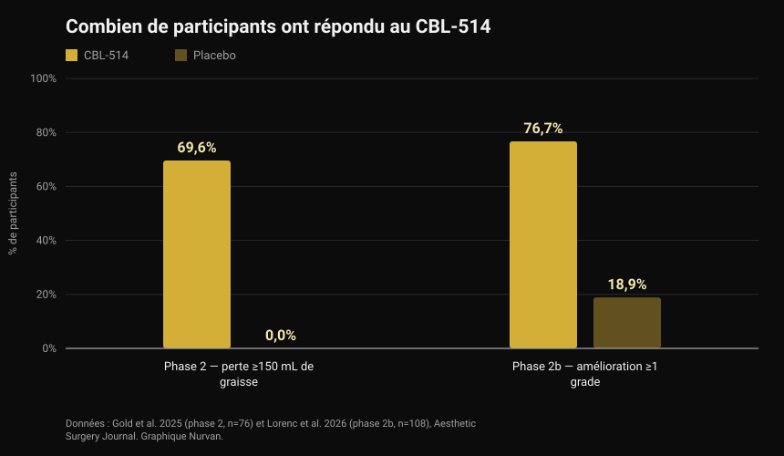
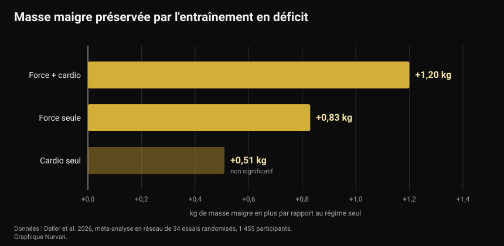

# CBL-514, le médicament qui détruit les cellules graisseuses : ce qui est prouvé et ce qui ne l'est pas

Fin septembre 2026, au congrès européen sur le diabète, un médicament expérimental qui tue les cellules graisseuses par injection a été présenté. Les titres ont parlé de liposuccion en seringue et de nouveau médicament pour maigrir. Les essais publiés disent quelque chose de plus précis, et en partie de différent.

Par [Giammaria Loi](/autore/giammaria-loi) · mis à jour le 4 octobre 2026

## En bref

- Le CBL-514 s'injecte sous la peau et déclenche l'apoptose — la mort programmée — des adipocytes, les cellules qui stockent la graisse. Il n'est approuvé nulle part : il est encore à l'étude.
- Les chiffres chez l'humain sont réels et publiés. En phase 2, 69,6 % des participants traités ont perdu au moins 150 mL de graisse abdominale contre 0 % sous placebo. En phase 2b, 76,7 % se sont améliorés d'au moins un grade sur l'échelle clinique contre 18,9 % sous placebo, avec une réduction moyenne du volume de graisse de 20,3 % à l'IRM.
- **Ce n'est pas un médicament pour maigrir.** Les essais ont traité l'abdomen chez des personnes dont l'IMC se situait surtout entre 22 et 30, et les critères principaux étaient des échelles d'évaluation de la graisse abdominale, pas le poids corporel.
- Le chiffre sur la graisse viscérale (−12 % contre +6 % sous placebo) vient d'une présentation en congrès portant sur 40 participants et n'a pas encore été relu par les pairs : à considérer comme préliminaire.
- L'idée que supprimer des cellules graisseuses empêche de reprendre du poids n'a été observée que chez la souris. Chez l'humain, ce n'est pas testé, et une méta-analyse montre que ce qui protège vraiment la masse maigre pendant une sèche, c'est l'entraînement : environ un demi-kilo de masse maigre conservé, voire plus, par rapport au régime seul.

*Mesure de la composition corporelle. Photo : U.S. Marine Corps, domaine public.*

## Ce qu'est le CBL-514 et comment il agit

Le CBL-514 est une petite molécule développée par l'entreprise taïwanaise Caliway Biopharmaceuticals. Elle s'injecte directement dans la graisse sous-cutanée, la couche située entre la peau et le muscle.

Le mécanisme annoncé est l'apoptose sélective : le médicament pousse l'adipocyte à mourir de façon ordonnée, sans la nécrose qui abîmerait les tissus voisins. Dans les essais publiés, aucune nécrose ni lésion nerveuse n'a été observée, et les effets indésirables les plus fréquents ont été des réactions au point d'injection — douleur, rougeur, gonflement — légères à modérées et passagères.

*Tissu adipeux au microscope : les adipocytes sont les grandes cellules rondes. Photo : Veeresh likhitha, Wikimedia Commons, CC BY-SA 4.0.*

Un chiffre que presque aucun titre ne reprend. Un travail devenu classique, publié dans *Nature* en 2008, a montré que **le nombre d'adipocytes d'un adulte est pour ainsi dire fixe** : il reste constant chez les personnes minces comme chez les personnes obèses, même après une perte de poids importante, parce qu'il se fixe pendant l'enfance et l'adolescence. En revanche, environ 10 % de ces cellules sont renouvelées chaque année. C'est pour cela que les détruire a été proposé comme cible pharmacologique — et c'est aussi pour cela que l'effet n'est pas automatiquement permanent : le renouvellement de 10 % par an se poursuit.

## Les chiffres des essais chez l'humain

Deux essais randomisés, tous deux publiés dans *Aesthetic Surgery Journal*, ont testé le médicament sur l'abdomen.

*Réponse au CBL-514 dans les essais de phase 2 et 2b — Données : Gold et al. 2025 et Lorenc et al. 2026. Graphique Nurvan.*

Dans l'essai de **phase 2** (76 participants, randomisation 2:1, jusqu'à quatre traitements toutes les quatre semaines), huit semaines après le dernier traitement, 69,6 % du groupe traité avait perdu au moins 150 mL de graisse sous-cutanée mesurée par échographie, contre personne sous placebo. 60,9 % ont aussi franchi le seuil des 200 mL, et 12 répondeurs sur 28 y sont arrivés après une seule séance.

Dans l'essai de **phase 2b** (108 adultes avec une graisse abdominale modérée à sévère, randomisation 1:1, jusqu'à quatre traitements espacés de trois semaines), 76,7 % du groupe traité s'est amélioré d'au moins un grade sur l'échelle évaluée par le médecin, contre 18,9 % sous placebo. L'IRM a estimé une réduction moyenne du volume de graisse abdominale de 152,9 mL, soit 20,3 %.

Deux précisions qui changent la lecture. D'abord, les deux essais sont **en simple aveugle** : les participants ignoraient ce qu'ils recevaient, pas les investigateurs — un protocole plus faible que le double aveugle quand le critère est une échelle visuelle. Ensuite, plusieurs auteurs sont salariés de Caliway, l'entreprise qui développe le médicament et qui a financé les études. Ce n'est pas une accusation, c'est le cadre habituel d'un médicament en développement : il faut des études plus larges et indépendantes pour confirmer.

À propos d'études plus larges : la dépêche de fin septembre indiquait que la phase 3 était « en préparation ». **Elle a déjà commencé.** Le 23 septembre 2026, Caliway a annoncé le premier patient traité dans SUPREME-01, un essai pivot mondial randomisé en double aveugle portant sur environ 320 participants aux États-Unis et au Canada. Aucun résultat pour l'instant.

## Le chiffre sur la graisse viscérale

Ce qui a été présenté à Milan au congrès de l'European Association for the Study of Diabetes, du 28 septembre au 2 octobre 2026, est une autre étude : 40 participants avec un IMC entre 22 et 30, traités jusqu'à 600 mg, centrée sur la graisse viscérale — celle qui entoure les organes et qui est la plus liée au risque cardiovasculaire et à l'insulinorésistance.

Au bout d'un mois, la graisse viscérale avait baissé en moyenne de 12 % dans le groupe traité et augmenté de 6 % sous placebo ; au contrôle suivant, la réduction était d'environ 10 % face à une hausse de près de 12 %.

Des chiffres intéressants, mais à lire pour ce qu'ils sont : **des données de congrès, sur 40 personnes, pas encore relues par les pairs.** Un résumé présenté en congrès n'a pas passé le même filtre qu'un article de revue, et les chiffres changent régulièrement dans la version définitive. D'ici là, c'est un signal prometteur, pas un résultat acquis.

## Ce que dit vraiment la recherche

**« C'est un médicament pour perdre du poids. »** → **Faux.** Les essais publiés visent la réduction de la graisse sous-cutanée abdominale et des échelles d'évaluation esthétique, chez des personnes dont l'IMC est en majorité normal ou légèrement élevé. Le poids corporel n'est pas le critère mesuré. C'est un médicament pour la graisse localisée, pas pour l'obésité.

**« Environ 70 % perdent au moins 150 mL de graisse contre 0 % sous placebo. »** → **Confirmé**, dans l'essai de phase 2 publié en 2025.

**« Plus de 75 % s'améliorent d'au moins un grade sur l'échelle de graisse abdominale. »** → **Confirmé**, en phase 2b : 76,7 % contre 18,9 %.

**« Ça fait l'effet d'une liposuccion. »** → **À nuancer.** La réduction moyenne de volume à l'IRM est de 20,3 % sur la zone traitée : réelle, mais d'un autre ordre de grandeur qu'une chirurgie, limitée à l'abdomen et obtenue en plusieurs séances. Aucun essai n'a comparé directement le médicament à la liposuccion.

**« Il réduit aussi la graisse viscérale. »** → **Pas encore vérifiable.** La donnée existe mais vient d'un congrès, sur 40 personnes, sans publication relue par les pairs.

**« Il empêche de reprendre du poids après l'arrêt des GLP-1. »** → **À nuancer, et uniquement chez la souris.** Chez l'humain, ce n'est pas testé. Ce que l'on sait chez l'humain va dans l'autre sens : dans l'essai SURMOUNT-4, publié dans *JAMA*, les personnes ayant arrêté le tirzépatide ont repris en moyenne 14 % de leur poids en 52 semaines, tandis que celles qui ont continué en ont perdu 5,5 % de plus.

**« La phase 3 n'a pas encore commencé. »** → **Dépassé.** Elle a commencé le 23 septembre 2026.

## Comment l'appliquer

Le CBL-514 n'est pas en vente, n'est pas approuvé et ne concerne aucune décision que tu peux prendre aujourd'hui. La vraie question est ailleurs : en attendant, qu'est-ce qui marche pour la composition corporelle ?

*Le travail de force est la variable qui protège la masse maigre quand les calories baissent. Photo : Nenad Stojkovic, Wikimedia Commons, CC BY 2.0.*

1. **Entraîne-toi pendant la sèche, pas seulement après.** Une méta-analyse en réseau de 2026 portant sur 34 essais randomisés et 1 455 participants a comparé la restriction calorique seule à la restriction associée à l'exercice : l'entraînement a évité en moyenne 45,7 % de la perte de masse non grasse. L'effet le plus fort vient de l'entraînement mixte (force plus cardio, +1,20 kg par rapport au régime seul), suivi de la force seule (+0,83 kg).

*Masse maigre conservée par rapport à la restriction calorique seule — Données : Deller et al. 2026. Graphique Nurvan.*

2. **N'exagère pas le déficit.** Une méta-régression sur l'entraînement en restriction énergétique a estimé qu'un déficit d'environ 500 kcal par jour est le seuil au-delà duquel tu cesses de gagner de la masse maigre, même en soulevant. Si tu veux construire du muscle, évite les déficits prolongés ; si tu veux seulement le conserver, reste sous cette limite.

3. **Garde les protéines hautes.** C'est le levier nutritionnel le mieux étayé quand les calories baissent : on en a parlé en détail dans l'article sur les [protéines en sèche](/blog/proteines-en-seche).

4. **Mesure, n'estime pas à l'œil.** Le poids, les circonférences et les charges soulevées dans le temps disent si tu perds de la graisse ou aussi du muscle. Dans le miroir, les deux se confondent.

5. **La graisse localisée ne se choisit pas.** Aucun exercice ne brûle la graisse de la zone qu'il travaille. Là où tu perds d'abord dépend largement de la génétique et des hormones — un sujet abordé dans notre article sur les [faibles et forts répondeurs](/blog/genetique-faibles-repondeurs).

Les chiffres ci-dessus sont des intervalles et des moyennes observés dans les études, pas une prescription. Si tu as une pathologie, prends un traitement ou suis un régime sur avis médical, parles-en à ton médecin avant de changer quoi que ce soit.

> ### Nurvan — la composition corporelle se lit dans la durée
>
> Deux kilos en moins, ça peut être de la graisse, de l'eau ou du muscle : tu ne le sais qu'en croisant poids, mesures et charges dans le temps. Nurvan enregistre les mesures et le poids à côté des charges, répétitions et RIR de chaque séance, et la partie nutrition s'appuie sur la base alimentaire officielle CREA : tu vois ainsi si ton déficit te coûte de la graisse ou aussi de la force.
>
> **[Essayer Nurvan](https://nurvan.app)**

## Questions fréquentes

**Le CBL-514 est-il déjà commercialisé ?**
Non. Il n'est approuvé dans aucun pays. Il est encore à l'essai : les études de phase 2 et 2b sont publiées, et l'essai de phase 3 SUPREME-01 a traité son premier patient le 23 septembre 2026.

**Le CBL-514 fait-il maigrir ?**
Ce n'est pas son but. Les essais publiés mesurent la réduction de la graisse sous-cutanée abdominale chez des personnes de poids normal ou légèrement élevé, pas la perte de poids corporel.

**Quelle différence avec l'Ozempic ou le Mounjaro ?**
Les GLP-1 agissent sur l'appétit et le métabolisme et font perdre du poids sur tout le corps ; le CBL-514 s'injecte dans une zone et agit localement sur les cellules graisseuses de cette zone. Ce sont des catégories différentes, avec des indications, des risques et des niveaux de preuve différents.

**Si les cellules graisseuses meurent, le résultat est-il définitif ?**
On ne sait pas. Le nombre d'adipocytes chez l'adulte est stable, mais environ 10 % sont renouvelés chaque année, et aucun essai publié n'a suivi les patients assez longtemps pour répondre. Caliway a annoncé une étude de phase 3 dédiée au suivi à long terme.

**Peut-il remplacer l'alimentation et l'entraînement ?**
Aucune donnée ne le suggère. Les essais couvrent une zone du corps sur quelques semaines, alors que le poids et la composition corporelle à moyen terme dépendent de l'alimentation, du travail de force et de la régularité.

## À lire aussi

- [Protéines en sèche : combien en faut-il vraiment](/blog/proteines-en-seche) — l'intervalle qui protège la masse maigre quand tu coupes les calories.
- [Riz refroidi : ce que vaut vraiment l'amidon résistant](/blog/riz-refroidi-amidon-resistant) — les vrais chiffres derrière une astuce devenue virale.
- [Faible répondeur : le poids de la génétique dans le muscle](/blog/genetique-faibles-repondeurs) — pourquoi le même programme donne des résultats différents selon les personnes.

## Sources

1. Gold M, Schlessinger J, Goodman GJ, Dayan S, DuBois J, Ling YF, Sheu AY, Ho WWS, Chou YC, 2025. *Efficacy and Safety of CBL-514 Injection in Reducing Abdominal Subcutaneous Fat: A Randomized, Single-Blind, Placebo-Controlled Phase II Study.* Aesthetic Surgery Journal 45(6):611-620. PMID 40037659 — [DOI](https://doi.org/10.1093/asj/sjaf032)
2. Lorenc ZP, Gold M, Schlessinger J, Lain ET, Smith S, Downie J, Cox SE, Ling YF, Sheu AY, Lu CY, Chou YC, 2026. *Randomized Phase 2b Trial of CBL-514 Injection for Abdominal Subcutaneous Fat Reduction With Clinician- and Patient-reported Outcomes and MRI Assessment.* Aesthetic Surgery Journal. PMID 42159040 — [DOI](https://doi.org/10.1093/asj/sjag092)
3. Spalding KL, Arner E, Westermark PO, Bernard S, Buchholz BA, Bergmann O, Blomqvist L, Hoffstedt J, Näslund E, Britton T, Concha H, Hassan M, Rydén M, Frisén J, Arner P, 2008. *Dynamics of fat cell turnover in humans.* Nature 453(7196):783-787. PMID 18454136 — [DOI](https://doi.org/10.1038/nature06902)
4. Aronne LJ, Sattar N, Horn DB, Bays HE, Wharton S, Lin WY, Ahmad NN, Zhang S, Liao R, Bunck MC, Jouravskaya I, Murphy MA, 2024. *Continued Treatment With Tirzepatide for Maintenance of Weight Reduction in Adults With Obesity: The SURMOUNT-4 Randomized Clinical Trial.* JAMA 331(1):38-48. PMID 38078870 — [DOI](https://doi.org/10.1001/jama.2023.24945)
5. Deller M, Weiershaus J, Held S, Brinkmann C, 2026. *Effects of Calorie Restriction With and Without Strength, Endurance or Mixed Training on Fat-Free and Skeletal Muscle Mass in Overweight or Obese Individuals — A Systematic Review With Pairwise Meta-Analysis and Network Meta-Analysis of Randomized Controlled Studies.* Diabetes, Obesity and Metabolism 28(8):6810-6823. PMID 42144246 — [DOI](https://doi.org/10.1111/dom.70873)
6. Murphy C, Koehler K, 2022. *Energy deficiency impairs resistance training gains in lean mass but not strength: A meta-analysis and meta-regression.* Scandinavian Journal of Medicine & Science in Sports 32(1):125-137. PMID 34623696 — [DOI](https://doi.org/10.1111/sms.14075)

Sources scientifiques récupérées sur PubMed. L'état de l'essai de phase 3 SUPREME-01 a été vérifié dans le [communiqué officiel de Caliway Biopharmaceuticals du 23 septembre 2026](https://www.caliwaybiopharma.com/en/news-detail/-CBL-514-SUPREME-01-FPI-ObesityWeek-2026-ENG/), consulté le 4 octobre 2026. Les données sur la graisse viscérale proviennent d'une présentation au congrès EASD de Milan (28 septembre-2 octobre 2026) et ne sont pas encore publiées dans une revue à comité de lecture.

Point de départ : un article d'Andrea Centini sur [Fanpage](https://www.fanpage.it/innovazione/scienze/nuovo-farmaco-per-perdere-peso-distrugge-il-grasso-sottocutaneo-come-una-liposuzione-ben-tollerato-negli-studi/), 2 octobre 2026. Le texte, la structure et les vérifications de cet article sont originaux.

---

**Giammaria Loi** est le fondateur de Nurvan. Il s'entraîne avec des poids depuis 2012, travaille comme entraîneur personnel et coach certifié FIPE depuis 2013 et participe à des compétitions de powerlifting au niveau national depuis 2018. Chaque article qu'il signe part des études scientifiques pour arriver à ce qui fonctionne vraiment en salle.

> Note : contenu informatif, qui ne remplace pas l'avis d'un médecin ou d'un professionnel. Le CBL-514 est un médicament expérimental non approuvé : rien dans cet article ne doit être compris comme un conseil thérapeutique.
