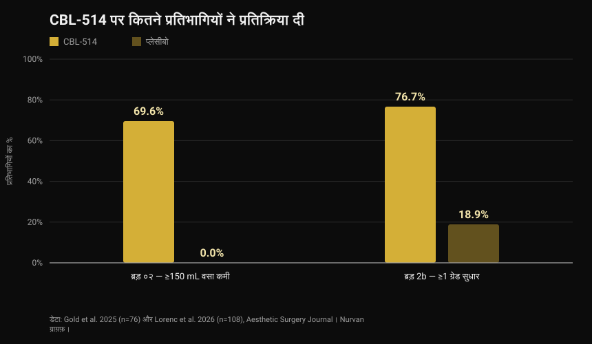
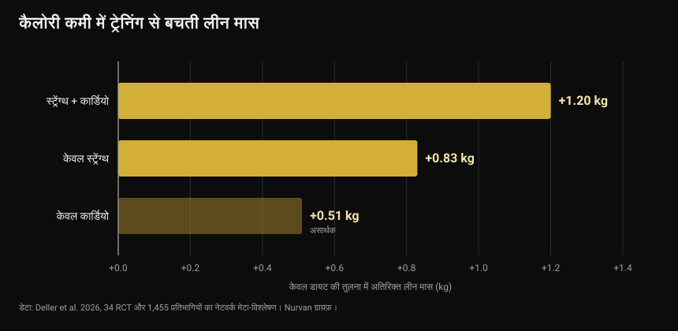

# CBL-514, वह दवा जो फैट सेल्स को मार देती है: क्या साबित है और क्या नहीं

सितंबर 2026 के आख़िर में यूरोप के डायबिटीज़ कॉन्ग्रेस में एक प्रयोगात्मक दवा पेश हुई जो इंजेक्शन से फैट सेल्स को मार देती है। हेडलाइनों ने इसे "सिरिंज में लाइपोसक्शन" और नई वज़न घटाने वाली दवा कहा। प्रकाशित ट्रायल इससे ज़्यादा सटीक और कुछ जगह अलग बात कहते हैं।

लेखक: [Giammaria Loi](/autore/giammaria-loi) · अपडेट 4 अक्टूबर 2026

## संक्षेप में

- CBL-514 त्वचा के नीचे लगाया जाता है और एडिपोसाइट्स — यानी चर्बी जमा करने वाली कोशिकाओं — में एपोप्टोसिस, यानी नियोजित कोशिका मृत्यु, शुरू करता है। यह किसी भी देश में स्वीकृत नहीं है: अभी परीक्षण के चरण में है।
- इंसानों पर मिले आँकड़े असली और प्रकाशित हैं। फेज़ 2 में 69.6% लोगों ने पेट की कम से कम 150 mL चर्बी घटाई, जबकि प्लेसीबो में 0%। फेज़ 2b में 76.7% ने डॉक्टर के स्केल पर कम से कम एक ग्रेड सुधार दिखाया, प्लेसीबो में 18.9%, और MRI पर फैट वॉल्यूम औसतन 20.3% घटा।
- **यह वज़न घटाने की दवा नहीं है।** ट्रायल में पेट का इलाज हुआ, प्रतिभागियों का BMI ज़्यादातर 22 से 30 के बीच था, और मुख्य मापदंड पेट की चर्बी के रेटिंग स्केल थे, शरीर का वज़न नहीं।
- विसरल फैट वाला आँकड़ा (−12% बनाम प्लेसीबो +6%) एक कॉन्फ्रेंस प्रस्तुति से आया है, 40 प्रतिभागियों पर, और अभी पीयर-रिव्यू नहीं हुआ: इसे प्रारंभिक मानें।
- "फैट सेल्स हटा दो तो वज़न वापस नहीं आएगा" यह बात अब तक सिर्फ़ चूहों में देखी गई है। इंसानों में जाँची नहीं गई, और एक मेटा-विश्लेषण बताता है कि कैलोरी घटाते समय लीन मास को असल में ट्रेनिंग बचाती है — सिर्फ़ डाइट की तुलना में लगभग आधा किलो या उससे ज़्यादा लीन मास।

*बॉडी कंपोज़िशन की माप। फोटो: U.S. Marine Corps, सार्वजनिक डोमेन।*

## CBL-514 क्या है और कैसे काम करता है

CBL-514 ताइवान की कंपनी Caliway Biopharmaceuticals द्वारा विकसित एक छोटा अणु है। इसे सीधे सबक्यूटेनियस फैट में लगाया जाता है, यानी त्वचा और मांसपेशी के बीच की परत में।

बताया गया तंत्र चयनात्मक एपोप्टोसिस है: दवा फैट सेल को व्यवस्थित ढंग से मरने के लिए प्रेरित करती है, बिना उस नेक्रोसिस के जो आसपास के ऊतक को नुकसान पहुँचाती। प्रकाशित ट्रायल में न नेक्रोसिस मिला न तंत्रिका क्षति, और सबसे आम दुष्प्रभाव इंजेक्शन वाली जगह की प्रतिक्रियाएँ थीं — दर्द, लाली, सूजन — हल्की से मध्यम और अस्थायी।

*माइक्रोस्कोप के नीचे वसा ऊतक: बड़ी गोल कोशिकाएँ ही एडिपोसाइट्स हैं। फोटो: Veeresh likhitha, Wikimedia Commons, CC BY-SA 4.0।*

एक आँकड़ा ऐसा है जो लगभग किसी हेडलाइन में नहीं आता। *Nature* में 2008 में छपे एक अब क्लासिक अध्ययन ने दिखाया कि **वयस्क में फैट सेल्स की संख्या लगभग तय होती है**: दुबले और मोटे दोनों में स्थिर रहती है, भारी वज़न घटाने के बाद भी, क्योंकि यह बचपन और किशोरावस्था में तय हो जाती है। फिर भी हर साल इनमें से लगभग 10% कोशिकाएँ नई बनती हैं। इसी वजह से इन्हें नष्ट करना दवा का लक्ष्य बनाया गया — और इसी वजह से असर अपने आप स्थायी नहीं होता: 10% सालाना नवीनीकरण चलता रहता है।

## इंसानों पर हुए ट्रायल के आँकड़े

दो रैंडमाइज़्ड ट्रायल, दोनों *Aesthetic Surgery Journal* में प्रकाशित, ने दवा को पेट पर परखा।

*फेज़ 2 और 2b ट्रायल में CBL-514 पर प्रतिक्रिया — डेटा: Gold et al. 2025 और Lorenc et al. 2026। Nurvan ग्राफ़।*

**फेज़ 2** ट्रायल में (76 प्रतिभागी, 2:1 रैंडमाइज़ेशन, हर चार हफ़्ते पर अधिकतम चार सत्र), आख़िरी सत्र के आठ हफ़्ते बाद दवा वाले समूह के 69.6% लोगों ने अल्ट्रासाउंड पर कम से कम 150 mL सबक्यूटेनियस फैट घटाया, जबकि प्लेसीबो में कोई नहीं। 60.9% ने 200 mL की सीमा भी पार की, और 28 में से 12 प्रतिक्रियाशील लोगों ने यह एक ही सत्र के बाद हासिल किया।

**फेज़ 2b** ट्रायल में (मध्यम से गंभीर पेट की चर्बी वाले 108 वयस्क, 1:1 रैंडमाइज़ेशन, तीन हफ़्ते के अंतर पर अधिकतम चार सत्र), दवा वाले समूह के 76.7% ने डॉक्टर द्वारा आँके गए स्केल पर कम से कम एक ग्रेड सुधार दिखाया, बनाम प्लेसीबो के 18.9%। MRI ने पेट की चर्बी के आयतन में औसतन 152.9 mL यानी 20.3% की कमी आँकी।

दो बातें पढ़ने का तरीका बदल देती हैं। पहली: दोनों ट्रायल **सिंगल-ब्लाइंड** हैं — प्रतिभागियों को नहीं पता था कि उन्हें क्या मिल रहा है, पर शोधकर्ताओं को पता था। जब नतीजा एक विज़ुअल रेटिंग स्केल हो, तो यह डबल-ब्लाइंड से कमज़ोर डिज़ाइन है। दूसरी: कई लेखक Caliway के कर्मचारी हैं, यानी उसी कंपनी के जो दवा बना रही है और जिसने अध्ययनों को फंड किया। यह आरोप नहीं, विकासाधीन दवा का सामान्य संदर्भ है: इसका मतलब है कि बड़े और स्वतंत्र अध्ययनों से पुष्टि बाकी है।

बड़े अध्ययनों की बात करें तो: सितंबर के आख़िर की ख़बर कहती थी कि फेज़ 3 "डिज़ाइन हो रहा है"। **वह शुरू हो चुका है।** 23 सितंबर 2026 को Caliway ने SUPREME-01 में पहले मरीज़ को खुराक देने की घोषणा की — यह एक वैश्विक, रैंडमाइज़्ड, डबल-ब्लाइंड पिवोटल ट्रायल है जिसमें अमेरिका और कनाडा में लगभग 320 प्रतिभागी शामिल हैं। नतीजे अभी नहीं आए।

## विसरल फैट वाला आँकड़ा

28 सितंबर से 2 अक्टूबर 2026 के बीच मिलान में European Association for the Study of Diabetes के कॉन्ग्रेस में जो पेश हुआ, वह अलग अध्ययन है: 22 से 30 BMI वाले 40 प्रतिभागी, अधिकतम 600 mg खुराक, और ध्यान विसरल फैट पर — वह चर्बी जो अंगों को घेरती है और हृदय रोग के जोखिम तथा इंसुलिन प्रतिरोध से सबसे ज़्यादा जुड़ी है।

एक महीने बाद दवा वाले समूह में विसरल फैट औसतन 12% घटा और प्लेसीबो में 6% बढ़ा; अगली जाँच में कमी लगभग 10% थी, जबकि प्लेसीबो में बढ़त क़रीब 12%।

आँकड़े दिलचस्प हैं, पर उन्हें जो हैं वही मानकर पढ़ें: **कॉन्फ्रेंस डेटा, 40 लोगों पर, अभी पीयर-रिव्यू नहीं।** कॉन्फ्रेंस का सार जर्नल लेख जैसी जाँच से नहीं गुज़रा होता, और अंतिम संस्करण में आँकड़े अक्सर बदलते हैं। तब तक यह एक आशाजनक संकेत है, स्थापित नतीजा नहीं।

## शोध असल में क्या कहता है

**"यह वज़न घटाने की दवा है।"** → **ग़लत।** प्रकाशित ट्रायल का लक्ष्य पेट की सबक्यूटेनियस चर्बी घटाना और सौंदर्य रेटिंग स्केल हैं, और प्रतिभागियों का BMI ज़्यादातर सामान्य या थोड़ा ज़्यादा था। शरीर का वज़न मापा गया नतीजा नहीं है। यह स्थानीय चर्बी की दवा है, मोटापे की नहीं।

**"लगभग 70% ने कम से कम 150 mL चर्बी घटाई बनाम प्लेसीबो 0%।"** → **पुष्ट**, 2025 में प्रकाशित फेज़ 2 ट्रायल में।

**"75% से ज़्यादा ने पेट की चर्बी के स्केल पर कम से कम एक ग्रेड सुधार दिखाया।"** → **पुष्ट**, फेज़ 2b में: 76.7% बनाम 18.9%।

**"असर लाइपोसक्शन जैसा है।"** → **स्पष्टीकरण ज़रूरी।** MRI पर इलाज वाले हिस्से में औसत आयतन कमी 20.3% है: असली, पर सर्जरी से अलग स्तर की, सिर्फ़ पेट तक सीमित और कई सत्रों में हासिल। किसी ट्रायल ने दवा की सीधी तुलना लाइपोसक्शन से नहीं की।

**"यह विसरल फैट भी घटाता है।"** → **अभी जाँचा नहीं जा सकता।** आँकड़ा मौजूद है पर कॉन्फ्रेंस से, 40 लोगों पर, बिना पीयर-रिव्यू प्रकाशन के।

**"GLP-1 दवाएँ बंद करने के बाद वज़न लौटने से रोकता है।"** → **स्पष्टीकरण ज़रूरी, और सिर्फ़ चूहों में।** इंसानों में जाँचा नहीं गया। इंसानों के बारे में जो हम जानते हैं वह उलटा इशारा करता है: *JAMA* में छपे SURMOUNT-4 ट्रायल में जिन लोगों ने टिरज़ेपेटाइड बंद किया उन्होंने 52 हफ़्तों में औसतन 14% वज़न वापस पाया, जबकि जारी रखने वालों का 5.5% और घटा।

**"फेज़ 3 अभी शुरू होना बाक़ी है।"** → **पुरानी जानकारी।** यह 23 सितंबर 2026 को शुरू हो चुका है।

## इसे कैसे लागू करें

CBL-514 न ख़रीदा जा सकता है, न स्वीकृत है, और न ही आज आपके किसी फ़ैसले से जुड़ा है। काम का सवाल दूसरा है: तब तक बॉडी कंपोज़िशन के लिए क्या काम करता है?

*कैलोरी घटने पर लीन मास की रक्षा करने वाला कारक स्ट्रेंथ ट्रेनिंग है। फोटो: Nenad Stojkovic, Wikimedia Commons, CC BY 2.0।*

1. **कटिंग के दौरान ट्रेन करें, सिर्फ़ बाद में नहीं।** 34 रैंडमाइज़्ड ट्रायल और 1,455 प्रतिभागियों पर 2026 के एक नेटवर्क मेटा-विश्लेषण ने अकेली कैलोरी कटौती की तुलना कैलोरी कटौती प्लस व्यायाम से की: ट्रेनिंग ने औसतन 45.7% फैट-फ्री मास की हानि रोकी। सबसे बड़ा असर मिश्रित ट्रेनिंग का रहा (स्ट्रेंथ प्लस कार्डियो, अकेली डाइट से +1.20 किग्रा), उसके बाद अकेली स्ट्रेंथ (+0.83 किग्रा)।

*अकेली कैलोरी कटौती की तुलना में बची हुई लीन मास — डेटा: Deller et al. 2026। Nurvan ग्राफ़।*

2. **डेफ़िसिट ज़्यादा न रखें।** ऊर्जा कटौती के दौरान रेज़िस्टेंस ट्रेनिंग पर हुए एक मेटा-रिग्रेशन ने आँका कि रोज़ाना लगभग 500 kcal का डेफ़िसिट वह सीमा है जिसके बाद ट्रेनिंग करते हुए भी लीन मास बढ़ना रुक जाता है। मसल बनाना है तो लंबे डेफ़िसिट से बचें; सिर्फ़ बचाना है तो इस रेखा के नीचे रहें।

3. **प्रोटीन ऊँचा रखें।** कैलोरी घटने पर यह सबसे मज़बूत प्रमाण वाला पोषण उपाय है: विस्तार से हमने [कटिंग में प्रोटीन](/hi/blog/protein-for-fat-loss-phase) वाले लेख में लिखा है।

4. **मापें, अंदाज़ा न लगाएँ।** वज़न, घेरे और समय के साथ उठाया गया भार बताते हैं कि आप चर्बी घटा रहे हैं या मांसपेशी भी। आईने में दोनों एक जैसे दिखते हैं।

5. **स्थानीय चर्बी चुनी नहीं जाती।** कोई व्यायाम उस मांसपेशी के ऊपर की चर्बी नहीं जलाता जिसे वह ट्रेन करता है। पहले कहाँ घटेगा यह काफ़ी हद तक जेनेटिक्स और हार्मोन पर निर्भर है — इस विषय पर हमने [हाई और लो रेस्पॉन्डर](/hi/blog/genetics-muscle-low-responders) वाले लेख में बात की है।

ऊपर दिए आँकड़े अध्ययनों में देखी गई रेंज और औसत हैं, कोई नुस्ख़ा नहीं। अगर आपको कोई बीमारी है, आप दवा लेते हैं या डॉक्टर की सलाह पर डाइट कर रहे हैं, तो कुछ भी बदलने से पहले अपने डॉक्टर से बात करें।

> ### Nurvan — बॉडी कंपोज़िशन समय की शृंखला में दिखती है
>
> दो किलो की कमी चर्बी, पानी या मांसपेशी हो सकती है: यह सिर्फ़ तब पता चलता है जब वज़न, माप और भार को समय के साथ साथ पढ़ा जाए। Nurvan हर सत्र के भार, रेप्स और RIR के साथ माप और वज़न दर्ज करता है, और न्यूट्रिशन हिस्सा आधिकारिक CREA खाद्य डेटाबेस पर चलता है — तो आप देख पाते हैं कि डेफ़िसिट चर्बी ले रहा है या ताक़त भी।
>
> **[Nurvan आज़माएँ](https://nurvan.app)**

## अक्सर पूछे जाने वाले सवाल

**क्या CBL-514 बाज़ार में उपलब्ध है?**
नहीं। यह किसी देश में स्वीकृत नहीं है और अभी ट्रायल में है: फेज़ 2 और 2b के अध्ययन प्रकाशित हैं, और फेज़ 3 ट्रायल SUPREME-01 ने 23 सितंबर 2026 को पहले मरीज़ को खुराक दी।

**क्या CBL-514 से वज़न घटता है?**
यह इसका उद्देश्य नहीं है। प्रकाशित ट्रायल सामान्य या थोड़े अधिक वज़न वाले लोगों में पेट की सबक्यूटेनियस चर्बी की कमी मापते हैं, शरीर के वज़न की नहीं।

**Ozempic या Mounjaro से इसका फ़र्क़ क्या है?**
GLP-1 दवाएँ भूख और चयापचय पर असर डालती हैं और पूरे शरीर का वज़न घटाती हैं; CBL-514 एक हिस्से में लगाया जाता है और वहीं की फैट सेल्स पर स्थानीय रूप से काम करता है। ये अलग श्रेणियाँ हैं, जिनके संकेत, जोखिम और प्रमाण-स्तर अलग हैं।

**अगर फैट सेल्स मर जाएँ तो क्या नतीजा हमेशा के लिए है?**
पता नहीं। वयस्कों में एडिपोसाइट्स की संख्या स्थिर रहती है, पर हर साल लगभग 10% नई बनती हैं, और किसी प्रकाशित ट्रायल ने मरीज़ों को इतने लंबे समय तक नहीं देखा कि जवाब मिल सके। Caliway ने दीर्घकालिक फ़ॉलो-अप के लिए एक अलग फेज़ 3 अध्ययन की घोषणा की है।

**क्या यह डाइट और ट्रेनिंग की जगह ले सकता है?**
ऐसा कोई डेटा नहीं है। ट्रायल शरीर के एक हिस्से और कुछ हफ़्तों को कवर करते हैं, जबकि मध्यम अवधि में वज़न और बॉडी कंपोज़िशन खानपान, स्ट्रेंथ ट्रेनिंग और निरंतरता पर निर्भर करते हैं।

## यह भी पढ़ें

- [कटिंग में प्रोटीन: असल में कितना चाहिए](/hi/blog/protein-for-fat-loss-phase) — कैलोरी घटाते समय लीन मास बचाने वाली रेंज।
- [ठंडा किया चावल: रेज़िस्टेंट स्टार्च कितना मायने रखता है](/hi/blog/thanda-chawal-resistant-starch) — एक वायरल तरकीब के पीछे के असली आँकड़े।
- [लो रेस्पॉन्डर: मांसपेशियों के विकास में जेनेटिक्स की कितनी भूमिका है](/hi/blog/genetics-muscle-low-responders) — वही प्रोग्राम अलग लोगों को अलग नतीजे क्यों देता है।

## स्रोत

1. Gold M, Schlessinger J, Goodman GJ, Dayan S, DuBois J, Ling YF, Sheu AY, Ho WWS, Chou YC, 2025. *Efficacy and Safety of CBL-514 Injection in Reducing Abdominal Subcutaneous Fat: A Randomized, Single-Blind, Placebo-Controlled Phase II Study.* Aesthetic Surgery Journal 45(6):611-620. PMID 40037659 — [DOI](https://doi.org/10.1093/asj/sjaf032)
2. Lorenc ZP, Gold M, Schlessinger J, Lain ET, Smith S, Downie J, Cox SE, Ling YF, Sheu AY, Lu CY, Chou YC, 2026. *Randomized Phase 2b Trial of CBL-514 Injection for Abdominal Subcutaneous Fat Reduction With Clinician- and Patient-reported Outcomes and MRI Assessment.* Aesthetic Surgery Journal. PMID 42159040 — [DOI](https://doi.org/10.1093/asj/sjag092)
3. Spalding KL, Arner E, Westermark PO, Bernard S, Buchholz BA, Bergmann O, Blomqvist L, Hoffstedt J, Näslund E, Britton T, Concha H, Hassan M, Rydén M, Frisén J, Arner P, 2008. *Dynamics of fat cell turnover in humans.* Nature 453(7196):783-787. PMID 18454136 — [DOI](https://doi.org/10.1038/nature06902)
4. Aronne LJ, Sattar N, Horn DB, Bays HE, Wharton S, Lin WY, Ahmad NN, Zhang S, Liao R, Bunck MC, Jouravskaya I, Murphy MA, 2024. *Continued Treatment With Tirzepatide for Maintenance of Weight Reduction in Adults With Obesity: The SURMOUNT-4 Randomized Clinical Trial.* JAMA 331(1):38-48. PMID 38078870 — [DOI](https://doi.org/10.1001/jama.2023.24945)
5. Deller M, Weiershaus J, Held S, Brinkmann C, 2026. *Effects of Calorie Restriction With and Without Strength, Endurance or Mixed Training on Fat-Free and Skeletal Muscle Mass in Overweight or Obese Individuals — A Systematic Review With Pairwise Meta-Analysis and Network Meta-Analysis of Randomized Controlled Studies.* Diabetes, Obesity and Metabolism 28(8):6810-6823. PMID 42144246 — [DOI](https://doi.org/10.1111/dom.70873)
6. Murphy C, Koehler K, 2022. *Energy deficiency impairs resistance training gains in lean mass but not strength: A meta-analysis and meta-regression.* Scandinavian Journal of Medicine & Science in Sports 32(1):125-137. PMID 34623696 — [DOI](https://doi.org/10.1111/sms.14075)

वैज्ञानिक स्रोत PubMed से लिए गए। फेज़ 3 ट्रायल SUPREME-01 की स्थिति [Caliway Biopharmaceuticals की 23 सितंबर 2026 की आधिकारिक विज्ञप्ति](https://www.caliwaybiopharma.com/en/news-detail/-CBL-514-SUPREME-01-FPI-ObesityWeek-2026-ENG/) से जाँची गई, 4 अक्टूबर 2026 को देखी गई। विसरल फैट के आँकड़े मिलान के EASD कॉन्ग्रेस (28 सितंबर–2 अक्टूबर 2026) की प्रस्तुति से हैं और अभी किसी पीयर-रिव्यूड जर्नल में प्रकाशित नहीं हुए।

शुरुआती सूत्र: Andrea Centini का [Fanpage](https://www.fanpage.it/innovazione/scienze/nuovo-farmaco-per-perdere-peso-distrugge-il-grasso-sottocutaneo-come-una-liposuzione-ben-tollerato-negli-studi/) पर लेख, 2 अक्टूबर 2026। इस लेख का पाठ, संरचना और तथ्य-जाँच मौलिक हैं।

---

**Giammaria Loi** Nurvan के संस्थापक हैं। वे 2012 से वेट ट्रेनिंग करते हैं, 2013 से FIPE-प्रमाणित पर्सनल ट्रेनर और कोच के रूप में काम करते हैं और 2018 से राष्ट्रीय स्तर पर पावरलिफ्टिंग में प्रतिस्पर्धा करते हैं। उनका हर लेख वैज्ञानिक अध्ययनों से शुरू होकर वहाँ पहुँचता है जो जिम में सचमुच काम करता है।

> नोट: यह जानकारीपरक सामग्री है, किसी डॉक्टर या पेशेवर की सलाह का विकल्प नहीं। CBL-514 एक अस्वीकृत प्रयोगात्मक दवा है: इस लेख की कोई भी बात उपचार संबंधी सलाह नहीं मानी जानी चाहिए।
