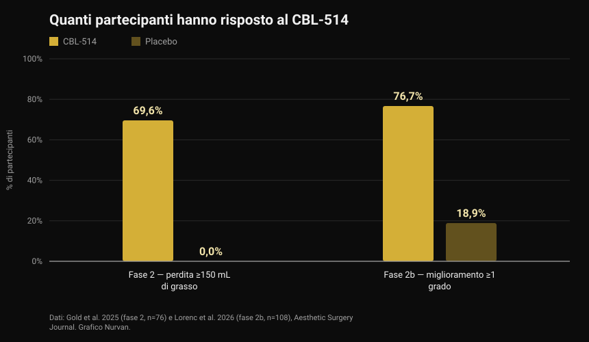
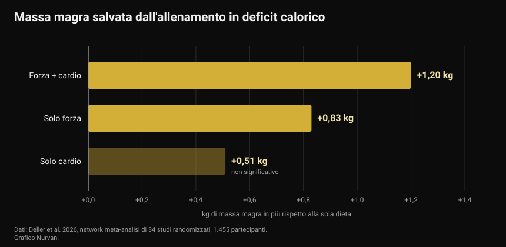

# CBL-514, il farmaco che distrugge le cellule di grasso: cosa è dimostrato e cosa no

A fine settembre 2026, al congresso europeo sul diabete, è stato presentato un farmaco sperimentale che uccide le cellule di grasso con un'iniezione. I titoli hanno parlato di "liposuzione in siringa" e di farmaco per dimagrire. Gli studi pubblicati dicono qualcosa di più preciso, e in parte di diverso.

Di [Giammaria Loi](/autore/giammaria-loi) · aggiornato il 4 ottobre 2026

## In breve

- Il CBL-514 è un farmaco iniettato sotto pelle che induce l'apoptosi (la morte programmata) degli adipociti, cioè delle cellule che immagazzinano il grasso. Non è approvato in nessun paese: è ancora in sperimentazione.
- I numeri degli studi sull'uomo sono reali e pubblicati: nella fase 2, il 69,6% dei trattati ha perso almeno 150 mL di grasso addominale contro lo 0% del placebo. Nella fase 2b, il 76,7% è migliorato di almeno un grado sulla scala clinica contro il 18,9% del placebo, con una riduzione media del volume di grasso del 20,3% alla risonanza.
- **Non è un farmaco per dimagrire.** Gli studi lo hanno testato su addome, in persone con BMI tipicamente tra 22 e 30, e gli obiettivi principali erano scale di valutazione estetica del grasso addominale, non il peso corporeo.
- Il dato sul grasso viscerale (−12% contro +6% del placebo) è stato presentato a un congresso, su 40 partecipanti, e non è ancora pubblicato su rivista con revisione tra pari: va trattato come preliminare.
- L'idea che "togliere le cellule di grasso impedisca di riprendere peso" è stata vista solo nei topi. Nell'uomo non è stata dimostrata, e una meta-analisi mostra che quello che protegge davvero la massa magra quando si taglia è l'allenamento, con un recupero di circa mezzo chilo o più di massa magra rispetto alla sola dieta.

*Misurazione della composizione corporea. Foto: U.S. Marine Corps, pubblico dominio.*

## Che cos'è il CBL-514 e come funziona

Il CBL-514 è una piccola molecola sviluppata dall'azienda taiwanese Caliway Biopharmaceuticals. Si inietta direttamente nel tessuto adiposo sottocutaneo, quello che sta tra la pelle e il muscolo.

Il meccanismo dichiarato è l'apoptosi selettiva: il farmaco spinge l'adipocita a morire in modo "ordinato", senza la necrosi che danneggerebbe i tessuti intorno. Negli studi pubblicati finora non sono state osservate necrosi né lesioni nervose, e gli effetti indesiderati più frequenti sono stati reazioni nel punto di iniezione — dolore, rossore, gonfiore — di entità da lieve a moderata e transitorie.

*Tessuto adiposo al microscopio: gli adipociti sono le grandi cellule tonde. Foto: Veeresh likhitha, Wikimedia Commons, CC BY-SA 4.0.*

Qui serve un dato che quasi nessun titolo riporta. Un lavoro ormai classico pubblicato su *Nature* nel 2008 ha mostrato che **il numero di adipociti di un adulto è sostanzialmente fisso**: resta costante sia nelle persone magre sia in quelle obese, perfino dopo una perdita di peso marcata, perché viene definito durante infanzia e adolescenza. Ogni anno però circa il 10% delle cellule adipose viene rinnovato. È questo il motivo per cui distruggerle è stato proposto come bersaglio farmacologico — ed è anche il motivo per cui l'effetto non è automaticamente permanente: il ricambio del 10% annuo continua.

## I numeri degli studi sull'uomo

Due studi randomizzati, entrambi pubblicati su *Aesthetic Surgery Journal*, hanno testato il farmaco sull'addome.

*Risposta al CBL-514 negli studi di fase 2 e 2b — Dati: Gold et al. 2025 e Lorenc et al. 2026. Grafico Nurvan.*

Nello studio di **fase 2** (76 partecipanti, randomizzati 2:1, fino a 4 trattamenti ogni 4 settimane), a 8 settimane dall'ultimo trattamento il 69,6% di chi aveva ricevuto il farmaco aveva perso almeno 150 mL di grasso sottocutaneo misurato a ultrasuoni, contro nessuno nel gruppo placebo. Il 60,9% aveva superato anche la soglia dei 200 mL, e in 12 casi su 28 il risultato era arrivato dopo una sola seduta.

Nello studio di **fase 2b** (108 adulti con grasso addominale da moderato a severo, randomizzati 1:1, fino a 4 trattamenti a 3 settimane di distanza), il 76,7% dei trattati è migliorato di almeno un grado sulla scala valutata dal medico, contro il 18,9% del placebo. La risonanza magnetica ha stimato una riduzione media del volume di grasso addominale di 152,9 mL, pari al 20,3%.

Due precisazioni che cambiano la lettura. La prima: entrambi gli studi sono **in singolo cieco**, cioè i partecipanti non sapevano cosa ricevevano ma gli sperimentatori sì — un disegno più debole del doppio cieco quando gli esiti sono scale di valutazione visiva. La seconda: diversi autori sono dipendenti di Caliway, l'azienda che sviluppa il farmaco, e lo studio è sponsorizzato da lei. Non è un'accusa, è il contesto standard di un farmaco in sviluppo: significa che serve la conferma di studi più ampi e indipendenti.

A proposito di studi più ampi: la notizia di fine settembre riportava che la fase 3 era "in progettazione". **È già partita.** Il 23 settembre 2026 Caliway ha annunciato il primo paziente trattato nello studio pivotale globale SUPREME-01, randomizzato e in doppio cieco, su circa 320 partecipanti tra Stati Uniti e Canada. I risultati non ci sono ancora.

## Il grasso viscerale: il dato che ha fatto notizia

Quello presentato a Milano al congresso dell'European Association for the Study of Diabetes, tra il 28 settembre e il 2 ottobre 2026, è uno studio diverso: 40 partecipanti con BMI tra 22 e 30, trattati fino a 600 mg, con attenzione al grasso viscerale — quello che circonda gli organi ed è il più legato a rischio cardiovascolare e insulino-resistenza.

Dopo un mese il grasso viscerale risultava sceso in media del 12% nel gruppo trattato e salito del 6% nel placebo; al controllo successivo la riduzione era di circa il 10% contro un aumento di quasi il 12%.

Sono numeri interessanti, ma vanno letti per quello che sono: **dati di congresso, su 40 persone, non ancora pubblicati con revisione tra pari.** Un abstract presentato a un convegno non ha passato lo stesso filtro di un articolo su rivista, e capita regolarmente che i numeri cambino nella versione definitiva. Fino ad allora è un segnale promettente, non un risultato acquisito.

## Cosa dice davvero la ricerca

**"È un farmaco per perdere peso."** → **Smentito.** Gli studi pubblicati hanno come obiettivo primario la riduzione del grasso sottocutaneo addominale e scale di valutazione estetica, su persone con BMI in gran parte normale o lievemente alto. Il peso corporeo non è l'esito misurato. È un farmaco per il grasso localizzato, non per l'obesità.

**"Circa il 70% perde almeno 150 mL di grasso contro lo 0% del placebo."** → **Confermato**, nello studio di fase 2 pubblicato nel 2025.

**"Oltre il 75% migliora di almeno un grado sulla scala del grasso addominale."** → **Confermato**, nello studio di fase 2b: 76,7% contro 18,9% del placebo.

**"Fa l'effetto di una liposuzione."** → **Da precisare.** La riduzione media del volume misurata alla risonanza è del 20,3% nell'area trattata: reale, ma di un ordine diverso da quello di un intervento chirurgico, limitata all'addome e ottenuta in più sedute. Nessuno studio ha confrontato direttamente il farmaco con la liposuzione.

**"Riduce anche il grasso viscerale."** → **Non ancora verificabile.** Il dato esiste ma viene da un congresso, su 40 persone, senza pubblicazione peer-reviewed.

**"Impedisce di riprendere peso dopo aver smesso i farmaci GLP-1."** → **Da precisare, e solo nei topi.** Nell'uomo l'effetto non è stato testato. Quello che sappiamo sull'uomo è il contrario: nello studio SURMOUNT-4, pubblicato su *JAMA*, chi ha sospeso la tirzepatide ha ripreso in media il 14% del peso in 52 settimane, mentre chi ha continuato ne ha perso un altro 5,5%.

**"La fase 3 deve ancora iniziare."** → **Superato.** È iniziata il 23 settembre 2026.

## Come applicarlo

Il CBL-514 non è acquistabile, non è approvato e non riguarda nessuna decisione che puoi prendere oggi. La domanda utile è un'altra: cosa funziona, nel frattempo, per la composizione corporea?

*Il lavoro di forza è la variabile che protegge la massa magra quando le calorie scendono. Foto: Nenad Stojkovic, Wikimedia Commons, CC BY 2.0.*

1. **Allenati mentre tagli, non solo dopo.** Una network meta-analisi del 2026 su 34 studi randomizzati e 1.455 partecipanti ha confrontato dieta ipocalorica da sola e dieta più allenamento: l'allenamento ha evitato in media il 45,7% della perdita di massa magra. L'effetto più grande è dell'allenamento misto (forza più cardio, +1,20 kg rispetto alla sola dieta), seguito dalla sola forza (+0,83 kg).

*Massa magra conservata rispetto alla sola dieta ipocalorica — Dati: Deller et al. 2026. Grafico Nurvan.*

2. **Non esagerare col deficit.** Una meta-regressione su studi di allenamento in restrizione calorica ha stimato che un deficit intorno alle 500 kcal al giorno è il punto oltre il quale smetti di guadagnare massa magra pur allenandoti. Chi vuole costruire muscolo dovrebbe evitare deficit prolungati; chi vuole solo conservarlo dovrebbe restare sotto quella soglia.

3. **Tieni alte le proteine.** È la leva nutrizionale con più supporto quando le calorie scendono: ne abbiamo scritto in dettaglio nell'articolo sulle [proteine in definizione](/blog/proteine-in-definizione).

4. **Misura, non stimare a occhio.** Peso, circonferenze e carichi sollevati nel tempo dicono se stai perdendo grasso o anche muscolo. Allo specchio le due cose si confondono.

5. **Il grasso localizzato non si sceglie.** Nessun esercizio brucia il grasso della zona che allena. Dove perdi prima dipende in gran parte da genetica e ormoni — un tema che abbiamo affrontato parlando di [high e low responder](/blog/genetica-high-low-responder).

I numeri qui sopra sono intervalli e medie osservati negli studi, non una prescrizione. Se hai patologie, assumi farmaci o segui una dieta per indicazione medica, parlane con il tuo medico prima di cambiare qualcosa.

> ### Nurvan — la composizione corporea si legge nella serie storica
>
> Un calo di due chili può essere grasso, acqua o muscolo: lo capisci solo incrociando peso, misure e carichi nel tempo. Nurvan registra le misure e il peso accanto a carichi, ripetizioni e RIR di ogni seduta, e la sezione nutrizione lavora sul database alimentare ufficiale CREA: così vedi se il deficit sta togliendo grasso o anche forza.
>
> **[Prova Nurvan](https://nurvan.app)**

## Domande frequenti

**Il CBL-514 è già in commercio?**
No. Non è approvato in nessun paese. È in sperimentazione: gli studi di fase 2 e 2b sono pubblicati, e lo studio di fase 3 SUPREME-01 ha trattato il primo paziente il 23 settembre 2026.

**Il CBL-514 fa dimagrire?**
Non è questo il suo scopo. Gli studi pubblicati misurano la riduzione del grasso sottocutaneo addominale in persone con peso normale o lievemente in eccesso, non la perdita di peso corporeo.

**Che differenza c'è con i farmaci tipo Ozempic o Mounjaro?**
I GLP-1 agiscono su appetito e metabolismo e fanno perdere peso in tutto il corpo; il CBL-514 si inietta in una zona e agisce localmente sulle cellule di grasso di quell'area. Sono categorie diverse, con indicazioni, rischi e livelli di evidenza diversi.

**Se le cellule di grasso muoiono, il risultato è per sempre?**
Non si sa. Il numero di adipociti negli adulti è stabile, ma circa il 10% viene rinnovato ogni anno, e nessuno studio pubblicato ha seguito i pazienti abbastanza a lungo per rispondere. Caliway ha annunciato uno studio di fase 3 dedicato al follow-up a lungo termine.

**Può sostituire dieta e allenamento?**
Nessun dato lo suggerisce. Gli studi riguardano un'area del corpo e un arco di poche settimane, mentre peso e composizione corporea nel medio periodo dipendono da alimentazione, lavoro di forza e costanza.

## Leggi anche

- [Proteine in definizione: quante ne servono davvero](/blog/proteine-in-definizione) — l'intervallo che protegge la massa magra quando tagli le calorie.
- [Riso raffreddato: quanto conta l'amido resistente](/blog/riso-raffreddato-amido-resistente) — quanto si risparmia davvero con un trucco diventato virale.
- [Low responder: quanto conta la genetica nei muscoli](/blog/genetica-high-low-responder) — perché lo stesso programma dà risultati diversi a persone diverse.

## Fonti

1. Gold M, Schlessinger J, Goodman GJ, Dayan S, DuBois J, Ling YF, Sheu AY, Ho WWS, Chou YC, 2025. *Efficacy and Safety of CBL-514 Injection in Reducing Abdominal Subcutaneous Fat: A Randomized, Single-Blind, Placebo-Controlled Phase II Study.* Aesthetic Surgery Journal 45(6):611-620. PMID 40037659 — [DOI](https://doi.org/10.1093/asj/sjaf032)
2. Lorenc ZP, Gold M, Schlessinger J, Lain ET, Smith S, Downie J, Cox SE, Ling YF, Sheu AY, Lu CY, Chou YC, 2026. *Randomized Phase 2b Trial of CBL-514 Injection for Abdominal Subcutaneous Fat Reduction With Clinician- and Patient-reported Outcomes and MRI Assessment.* Aesthetic Surgery Journal. PMID 42159040 — [DOI](https://doi.org/10.1093/asj/sjag092)
3. Spalding KL, Arner E, Westermark PO, Bernard S, Buchholz BA, Bergmann O, Blomqvist L, Hoffstedt J, Näslund E, Britton T, Concha H, Hassan M, Rydén M, Frisén J, Arner P, 2008. *Dynamics of fat cell turnover in humans.* Nature 453(7196):783-787. PMID 18454136 — [DOI](https://doi.org/10.1038/nature06902)
4. Aronne LJ, Sattar N, Horn DB, Bays HE, Wharton S, Lin WY, Ahmad NN, Zhang S, Liao R, Bunck MC, Jouravskaya I, Murphy MA, 2024. *Continued Treatment With Tirzepatide for Maintenance of Weight Reduction in Adults With Obesity: The SURMOUNT-4 Randomized Clinical Trial.* JAMA 331(1):38-48. PMID 38078870 — [DOI](https://doi.org/10.1001/jama.2023.24945)
5. Deller M, Weiershaus J, Held S, Brinkmann C, 2026. *Effects of Calorie Restriction With and Without Strength, Endurance or Mixed Training on Fat-Free and Skeletal Muscle Mass in Overweight or Obese Individuals — A Systematic Review With Pairwise Meta-Analysis and Network Meta-Analysis of Randomized Controlled Studies.* Diabetes, Obesity and Metabolism 28(8):6810-6823. PMID 42144246 — [DOI](https://doi.org/10.1111/dom.70873)
6. Murphy C, Koehler K, 2022. *Energy deficiency impairs resistance training gains in lean mass but not strength: A meta-analysis and meta-regression.* Scandinavian Journal of Medicine & Science in Sports 32(1):125-137. PMID 34623696 — [DOI](https://doi.org/10.1111/sms.14075)

Fonti scientifiche recuperate da PubMed. Lo stato della fase 3 SUPREME-01 è stato verificato sul [comunicato ufficiale di Caliway Biopharmaceuticals del 23 settembre 2026](https://www.caliwaybiopharma.com/en/news-detail/-CBL-514-SUPREME-01-FPI-ObesityWeek-2026-ENG/), consultato il 4 ottobre 2026. I dati sul grasso viscerale provengono dalla presentazione al congresso EASD di Milano (28 settembre-2 ottobre 2026) e non sono ancora pubblicati su rivista con revisione tra pari.

Spunto iniziale: articolo di Andrea Centini su [Fanpage](https://www.fanpage.it/innovazione/scienze/nuovo-farmaco-per-perdere-peso-distrugge-il-grasso-sottocutaneo-come-una-liposuzione-ben-tollerato-negli-studi/), 2 ottobre 2026. Testo, struttura e verifiche di questo articolo sono originali.

---

**Giammaria Loi** è il fondatore di Nurvan. Si allena con i pesi dal 2012, lavora come personal trainer e coach certificato FIPE dal 2013 e gareggia nel powerlifting a livello nazionale dal 2018. Ogni articolo che firma parte dagli studi scientifici e arriva a ciò che funziona davvero in palestra.

> Nota: contenuto informativo, non sostituisce il parere di un medico o professionista. Il CBL-514 è un farmaco sperimentale non approvato: nessuna indicazione di questo articolo va intesa come consiglio terapeutico.
