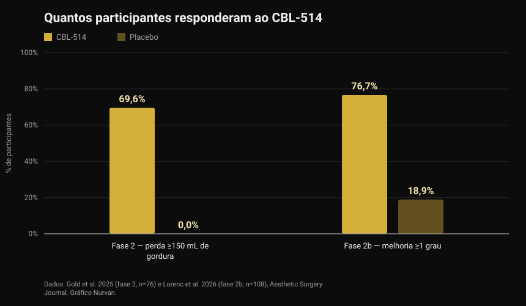
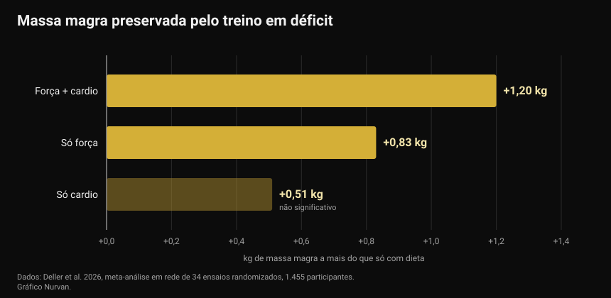

# CBL-514, o medicamento que destrói células de gordura: o que está provado e o que não está

No final de setembro de 2026, no congresso europeu sobre diabetes, foi apresentado um medicamento experimental que mata células de gordura com uma injeção. As manchetes falaram em lipoaspiração na seringa e num novo remédio para emagrecer. Os ensaios publicados dizem algo mais preciso e, em parte, diferente.

Por [Giammaria Loi](/autore/giammaria-loi) · atualizado a 4 de outubro de 2026

## Em resumo

- O CBL-514 é injetado sob a pele e desencadeia a apoptose — a morte programada — dos adipócitos, as células que armazenam gordura. Não está aprovado em nenhum país: continua em investigação.
- Os números em humanos são reais e estão publicados. Na fase 2, 69,6% dos tratados perderam pelo menos 150 mL de gordura abdominal contra 0% do placebo. Na fase 2b, 76,7% melhoraram pelo menos um grau na escala clínica contra 18,9% do placebo, com uma redução média do volume de gordura de 20,3% na ressonância.
- **Não é um medicamento para emagrecer.** Os ensaios trataram o abdómen em pessoas com IMC maioritariamente entre 22 e 30, e os objetivos principais eram escalas de avaliação da gordura abdominal, não o peso corporal.
- O dado sobre gordura visceral (−12% contra +6% do placebo) vem de uma apresentação em congresso com 40 participantes e ainda não passou por revisão por pares: trata-se de um resultado preliminar.
- A ideia de que eliminar células de gordura impede recuperar peso só foi vista em ratos. Em humanos não foi testada, e uma meta-análise mostra que o que realmente protege a massa magra em défice é o treino: cerca de meio quilo de massa magra ou mais face à dieta isolada.

*Medição da composição corporal. Foto: U.S. Marine Corps, domínio público.*

## O que é o CBL-514 e como funciona

O CBL-514 é uma molécula pequena desenvolvida pela empresa taiwanesa Caliway Biopharmaceuticals. É injetada diretamente na gordura subcutânea, a camada entre a pele e o músculo.

O mecanismo declarado é a apoptose seletiva: o fármaco leva o adipócito a morrer de forma ordenada, sem a necrose que danificaria o tecido em redor. Nos ensaios publicados não se observaram necroses nem lesões nervosas, e os efeitos adversos mais frequentes foram reações no local da injeção — dor, vermelhidão, inchaço — ligeiras a moderadas e passageiras.

*Tecido adiposo ao microscópio: os adipócitos são as células grandes e redondas. Foto: Veeresh likhitha, Wikimedia Commons, CC BY-SA 4.0.*

Há um dado que quase nenhuma manchete refere. Um trabalho já clássico publicado na *Nature* em 2008 mostrou que **o número de adipócitos de um adulto é praticamente fixo**: mantém-se constante em pessoas magras e com obesidade, mesmo após uma perda de peso acentuada, porque fica definido na infância e na adolescência. Ainda assim, cerca de 10% dessas células são renovadas todos os anos. Foi por isso que destruí-las passou a ser um alvo farmacológico — e é também por isso que o efeito não é automaticamente permanente: a renovação de 10% ao ano continua.

## Os números dos ensaios em humanos

Dois ensaios aleatorizados, ambos publicados no *Aesthetic Surgery Journal*, testaram o fármaco no abdómen.

*Resposta ao CBL-514 nos ensaios de fase 2 e 2b — Dados: Gold et al. 2025 e Lorenc et al. 2026. Gráfico Nurvan.*

No ensaio de **fase 2** (76 participantes, aleatorização 2:1, até quatro tratamentos a cada quatro semanas), oito semanas após o último tratamento 69,6% do grupo com fármaco tinha perdido pelo menos 150 mL de gordura subcutânea medida por ecografia, contra ninguém no placebo. Além disso, 60,9% ultrapassaram o limiar dos 200 mL, e 12 de 28 respondedores chegaram lá com uma única sessão.

No ensaio de **fase 2b** (108 adultos com gordura abdominal moderada a grave, aleatorização 1:1, até quatro tratamentos com três semanas de intervalo), 76,7% do grupo com fármaco melhorou pelo menos um grau na escala avaliada pelo médico, contra 18,9% do placebo. A ressonância estimou uma redução média do volume de gordura abdominal de 152,9 mL, ou seja, 20,3%.

Duas ressalvas mudam a leitura. Primeiro, ambos os ensaios são **em ocultação simples**: os participantes não sabiam o que recebiam, mas os investigadores sim — um desenho mais fraco do que a dupla ocultação quando o desfecho é uma escala visual. Segundo, vários autores são funcionários da Caliway, a empresa que desenvolve o fármaco e que patrocinou os estudos. Não é uma acusação, é o contexto habitual de um medicamento em desenvolvimento: significa que falta confirmação em estudos maiores e independentes.

A propósito de estudos maiores: a notícia do final de setembro dizia que a fase 3 estava "em preparação". **Já começou.** A 23 de setembro de 2026 a Caliway anunciou o primeiro doente tratado no SUPREME-01, um ensaio pivotal global aleatorizado e em dupla ocultação com cerca de 320 participantes nos Estados Unidos e no Canadá. Ainda não há resultados.

## O dado sobre a gordura visceral

O que foi apresentado em Milão, no congresso da European Association for the Study of Diabetes, entre 28 de setembro e 2 de outubro de 2026, é um estudo diferente: 40 participantes com IMC entre 22 e 30, tratados até 600 mg, centrado na gordura visceral — a que envolve os órgãos e mais se associa ao risco cardiovascular e à resistência à insulina.

Ao fim de um mês, a gordura visceral tinha descido em média 12% no grupo tratado e subido 6% no placebo; no controlo seguinte a redução era de cerca de 10% contra um aumento de quase 12%.

São números interessantes, mas devem ser lidos pelo que são: **dados de congresso, em 40 pessoas, ainda sem revisão por pares.** Um resumo apresentado num congresso não passou pelo mesmo filtro de um artigo de revista, e é comum os números mudarem na versão final. Até lá é um sinal promissor, não um resultado consolidado.

## O que a investigação diz de facto

**"É um medicamento para perder peso."** → **Desmentido.** Os ensaios publicados têm como objetivo a redução da gordura subcutânea abdominal e escalas de avaliação estética, em pessoas com IMC maioritariamente normal ou ligeiramente elevado. O peso corporal não é o desfecho medido. É um fármaco para gordura localizada, não para a obesidade.

**"Cerca de 70% perdem pelo menos 150 mL de gordura contra 0% do placebo."** → **Confirmado**, no ensaio de fase 2 publicado em 2025.

**"Mais de 75% melhoram pelo menos um grau na escala de gordura abdominal."** → **Confirmado**, na fase 2b: 76,7% contra 18,9%.

**"Faz o efeito de uma lipoaspiração."** → **A precisar.** A redução média do volume na ressonância é de 20,3% na área tratada: real, mas de uma ordem diferente da de uma cirurgia, limitada ao abdómen e obtida em várias sessões. Nenhum ensaio comparou diretamente o fármaco com a lipoaspiração.

**"Também reduz a gordura visceral."** → **Ainda não verificável.** O dado existe, mas vem de um congresso, com 40 pessoas e sem publicação revista por pares.

**"Impede recuperar peso depois de parar os GLP-1."** → **A precisar, e só em ratos.** Em humanos não foi testado. O que sabemos em humanos aponta no sentido oposto: no ensaio SURMOUNT-4, publicado na *JAMA*, quem parou a tirzepatida recuperou em média 14% do peso em 52 semanas, enquanto quem continuou perdeu mais 5,5%.

**"A fase 3 ainda não começou."** → **Desatualizado.** Começou a 23 de setembro de 2026.

## Como aplicar

O CBL-514 não se compra, não está aprovado e não interfere em nenhuma decisão que possas tomar hoje. A pergunta útil é outra: entretanto, o que funciona para a composição corporal?

*O trabalho de força é a variável que protege a massa magra quando as calorias baixam. Foto: Nenad Stojkovic, Wikimedia Commons, CC BY 2.0.*

1. **Treina enquanto cortas, não só depois.** Uma meta-análise em rede de 2026 com 34 ensaios aleatorizados e 1.455 participantes comparou a restrição calórica isolada com a restrição mais exercício: o treino evitou em média 45,7% da perda de massa isenta de gordura. O maior efeito foi do treino misto (força mais cardio, +1,20 kg face à dieta isolada), seguido de só força (+0,83 kg).

*Massa magra preservada face à restrição calórica isolada — Dados: Deller et al. 2026. Gráfico Nurvan.*

2. **Não exageres no défice.** Uma meta-regressão sobre treino de força em restrição energética estimou que um défice de cerca de 500 kcal por dia é o ponto a partir do qual deixas de ganhar massa magra mesmo a treinar. Quem quer construir músculo deve evitar défices prolongados; quem só quer preservá-lo deve ficar abaixo dessa linha.

3. **Mantém a proteína alta.** É a alavanca nutricional com mais suporte quando as calorias descem: tratámos o tema em detalhe no artigo sobre [proteína na definição](/blog/proteina-na-definicao).

4. **Mede, não calcules a olho.** O peso, os perímetros e as cargas levantadas ao longo do tempo dizem se estás a perder gordura ou também músculo. Ao espelho as duas coisas confundem-se.

5. **A gordura localizada não se escolhe.** Nenhum exercício queima a gordura da zona que treina. Onde perdes primeiro depende em grande parte da genética e das hormonas — um tema que abordámos ao falar de [high e low responders](/blog/genetica-high-low-responder).

Os números acima são intervalos e médias observados em estudos, não uma prescrição. Se tens patologias, tomas medicação ou segues uma dieta por indicação médica, fala com o teu médico antes de mudar seja o que for.

> ### Nurvan — a composição corporal lê-se na série histórica
>
> Dois quilos a menos podem ser gordura, água ou músculo: só sabes cruzando peso, medidas e cargas ao longo do tempo. A Nurvan regista medidas e peso ao lado das cargas, repetições e RIR de cada sessão, e a parte de nutrição assenta na base de dados alimentar oficial CREA: assim vês se o défice te está a tirar gordura ou também força.
>
> **[Experimenta a Nurvan](https://nurvan.app)**

## Perguntas frequentes

**O CBL-514 já está à venda?**
Não. Não está aprovado em nenhum país. Continua em ensaios: os estudos de fase 2 e 2b estão publicados e o ensaio de fase 3 SUPREME-01 tratou o primeiro doente a 23 de setembro de 2026.

**O CBL-514 faz emagrecer?**
Não é esse o objetivo. Os ensaios publicados medem a redução da gordura subcutânea abdominal em pessoas com peso normal ou ligeiramente elevado, não a perda de peso corporal.

**Qual é a diferença para o Ozempic ou o Mounjaro?**
Os GLP-1 atuam no apetite e no metabolismo e fazem perder peso no corpo todo; o CBL-514 é injetado numa zona e atua localmente sobre as células de gordura dessa zona. São categorias diferentes, com indicações, riscos e níveis de evidência diferentes.

**Se as células de gordura morrem, o resultado é para sempre?**
Não se sabe. O número de adipócitos nos adultos é estável, mas cerca de 10% são renovados todos os anos, e nenhum ensaio publicado acompanhou os doentes tempo suficiente. A Caliway anunciou um estudo de fase 3 dedicado ao seguimento a longo prazo.

**Pode substituir a dieta e o treino?**
Nenhum dado o sugere. Os ensaios cobrem uma zona do corpo e poucas semanas, enquanto o peso e a composição corporal a médio prazo dependem da alimentação, do trabalho de força e da constância.

## Lê também

- [Proteína na definição: quanto você realmente precisa](/blog/proteina-na-definicao) — o intervalo que protege a massa magra quando cortas calorias.
- [Arroz arrefecido: quanto vale o amido resistente](/blog/arroz-arrefecido-amido-resistente) — os números reais por trás de um truque viral.
- [Low responder: quanto a genética pesa nos músculos](/blog/genetica-high-low-responder) — porque o mesmo programa dá resultados diferentes a pessoas diferentes.

## Fontes

1. Gold M, Schlessinger J, Goodman GJ, Dayan S, DuBois J, Ling YF, Sheu AY, Ho WWS, Chou YC, 2025. *Efficacy and Safety of CBL-514 Injection in Reducing Abdominal Subcutaneous Fat: A Randomized, Single-Blind, Placebo-Controlled Phase II Study.* Aesthetic Surgery Journal 45(6):611-620. PMID 40037659 — [DOI](https://doi.org/10.1093/asj/sjaf032)
2. Lorenc ZP, Gold M, Schlessinger J, Lain ET, Smith S, Downie J, Cox SE, Ling YF, Sheu AY, Lu CY, Chou YC, 2026. *Randomized Phase 2b Trial of CBL-514 Injection for Abdominal Subcutaneous Fat Reduction With Clinician- and Patient-reported Outcomes and MRI Assessment.* Aesthetic Surgery Journal. PMID 42159040 — [DOI](https://doi.org/10.1093/asj/sjag092)
3. Spalding KL, Arner E, Westermark PO, Bernard S, Buchholz BA, Bergmann O, Blomqvist L, Hoffstedt J, Näslund E, Britton T, Concha H, Hassan M, Rydén M, Frisén J, Arner P, 2008. *Dynamics of fat cell turnover in humans.* Nature 453(7196):783-787. PMID 18454136 — [DOI](https://doi.org/10.1038/nature06902)
4. Aronne LJ, Sattar N, Horn DB, Bays HE, Wharton S, Lin WY, Ahmad NN, Zhang S, Liao R, Bunck MC, Jouravskaya I, Murphy MA, 2024. *Continued Treatment With Tirzepatide for Maintenance of Weight Reduction in Adults With Obesity: The SURMOUNT-4 Randomized Clinical Trial.* JAMA 331(1):38-48. PMID 38078870 — [DOI](https://doi.org/10.1001/jama.2023.24945)
5. Deller M, Weiershaus J, Held S, Brinkmann C, 2026. *Effects of Calorie Restriction With and Without Strength, Endurance or Mixed Training on Fat-Free and Skeletal Muscle Mass in Overweight or Obese Individuals — A Systematic Review With Pairwise Meta-Analysis and Network Meta-Analysis of Randomized Controlled Studies.* Diabetes, Obesity and Metabolism 28(8):6810-6823. PMID 42144246 — [DOI](https://doi.org/10.1111/dom.70873)
6. Murphy C, Koehler K, 2022. *Energy deficiency impairs resistance training gains in lean mass but not strength: A meta-analysis and meta-regression.* Scandinavian Journal of Medicine & Science in Sports 32(1):125-137. PMID 34623696 — [DOI](https://doi.org/10.1111/sms.14075)

Fontes científicas recuperadas na PubMed. O estado do ensaio de fase 3 SUPREME-01 foi verificado no [comunicado oficial da Caliway Biopharmaceuticals de 23 de setembro de 2026](https://www.caliwaybiopharma.com/en/news-detail/-CBL-514-SUPREME-01-FPI-ObesityWeek-2026-ENG/), consultado a 4 de outubro de 2026. Os dados sobre gordura visceral vêm de uma apresentação no congresso EASD de Milão (28 de setembro a 2 de outubro de 2026) e ainda não estão publicados em revista com revisão por pares.

Ponto de partida: artigo de Andrea Centini na [Fanpage](https://www.fanpage.it/innovazione/scienze/nuovo-farmaco-per-perdere-peso-distrugge-il-grasso-sottocutaneo-come-una-liposuzione-ben-tollerato-negli-studi/), 2 de outubro de 2026. O texto, a estrutura e as verificações deste artigo são originais.

---

**Giammaria Loi** é o fundador da Nurvan. Treina com pesos desde 2012, trabalha como personal trainer e coach certificado FIPE desde 2013 e compete em powerlifting a nível nacional desde 2018. Cada artigo que assina parte dos estudos científicos e chega ao que funciona mesmo no ginásio.

> Nota: conteúdo informativo, não substitui a opinião de um médico ou profissional. O CBL-514 é um fármaco experimental não aprovado: nada neste artigo deve ser entendido como conselho terapêutico.
