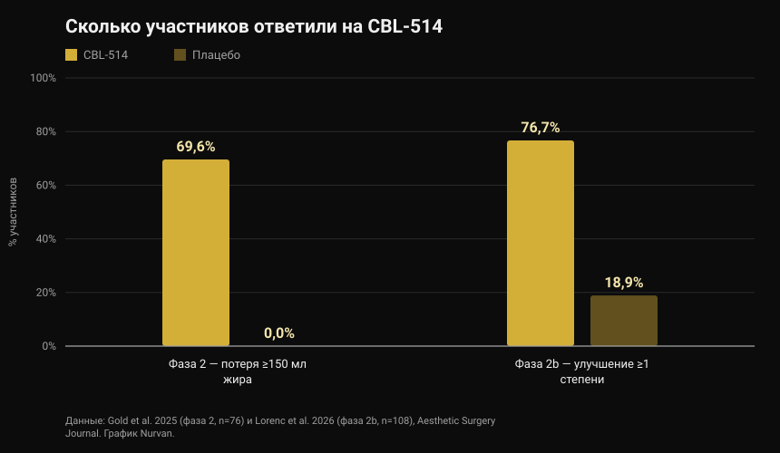
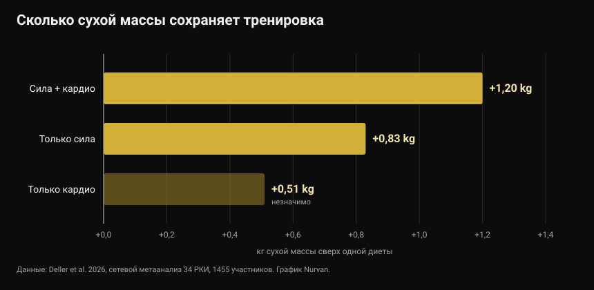

# CBL-514, препарат, который убивает жировые клетки: что доказано, а что нет

В конце сентября 2026 года на европейском конгрессе по диабету представили экспериментальный препарат, который убивает жировые клетки инъекцией. Заголовки заговорили о липосакции в шприце и новом средстве для похудения. Опубликованные исследования говорят точнее — и отчасти другое.

Автор: [Giammaria Loi](/autore/giammaria-loi) · обновлено 4 октября 2026

## Коротко

- CBL-514 вводят под кожу, он запускает апоптоз — запрограммированную гибель адипоцитов, клеток, которые хранят жир. Препарат нигде не одобрен: он всё ещё в разработке.
- Цифры по людям реальны и опубликованы. В фазе 2 69,6% получавших препарат потеряли не менее 150 мл жира на животе против 0% в группе плацебо. В фазе 2b 76,7% улучшились минимум на одну степень по врачебной шкале против 18,9% на плацебо, при среднем снижении объёма жира на 20,3% по МРТ.
- **Это не препарат для похудения.** В исследованиях лечили живот у людей с ИМТ в основном от 22 до 30, а главными конечными точками были шкалы оценки абдоминального жира, а не масса тела.
- Данные по висцеральному жиру (−12% против +6% на плацебо) получены из доклада на конгрессе на 40 участниках и ещё не прошли рецензирование: считайте их предварительными.
- Идею, что удаление жировых клеток мешает вернуть вес, пока видели только у мышей. У людей это не проверено, а метаанализ показывает: на дефиците сухую массу реально защищает тренировка — около полкилограмма сухой массы и больше по сравнению с одной диетой.

*Измерение состава тела. Фото: U.S. Marine Corps, общественное достояние.*

## Что такое CBL-514 и как он работает

CBL-514 — малая молекула, разработанная тайваньской компанией Caliway Biopharmaceuticals. Её вводят прямо в подкожный жир, слой между кожей и мышцей.

Заявленный механизм — избирательный апоптоз: препарат заставляет жировую клетку погибнуть «упорядоченно», без некроза, который повредил бы окружающие ткани. В опубликованных исследованиях не наблюдали ни некроза, ни повреждений нервов, а самыми частыми нежелательными явлениями были реакции в месте укола — боль, покраснение, отёк — лёгкие или умеренные и временные.

*Жировая ткань под микроскопом: адипоциты — это крупные круглые клетки. Фото: Veeresh likhitha, Wikimedia Commons, CC BY-SA 4.0.*

Есть цифра, которую почти не выносят в заголовки. Классическая работа в *Nature* 2008 года показала, что **число адипоцитов у взрослого практически постоянно**: оно одинаково стабильно у худых и у людей с ожирением, даже после заметного похудения, потому что задаётся в детстве и подростковом возрасте. При этом около 10% этих клеток обновляется каждый год. Именно поэтому их разрушение предложили как мишень для препарата — и именно поэтому эффект не обязательно вечен: обновление 10% в год продолжается.

## Цифры исследований на людях

Два рандомизированных исследования, оба опубликованные в *Aesthetic Surgery Journal*, проверяли препарат на животе.

*Ответ на CBL-514 в исследованиях фазы 2 и 2b — Данные: Gold et al. 2025 и Lorenc et al. 2026. График Nurvan.*

В исследовании **фазы 2** (76 участников, рандомизация 2:1, до четырёх процедур каждые четыре недели) через восемь недель после последней процедуры 69,6% группы препарата потеряли не менее 150 мл подкожного жира по УЗИ — в группе плацебо никто. Ещё 60,9% перешли порог в 200 мл, а 12 из 28 ответивших добились результата после одной процедуры.

В исследовании **фазы 2b** (108 взрослых с умеренным и выраженным абдоминальным жиром, рандомизация 1:1, до четырёх процедур с интервалом в три недели) 76,7% группы препарата улучшились минимум на одну степень по шкале, оцениваемой врачом, против 18,9% на плацебо. МРТ оценила среднее снижение объёма абдоминального жира в 152,9 мл, то есть 20,3%.

Две оговорки меняют прочтение. Первая: оба исследования **простые слепые** — участники не знали, что получают, а исследователи знали. Это более слабый дизайн, чем двойное ослепление, когда исход измеряется визуальной шкалой. Вторая: несколько авторов работают в Caliway, компании-разработчике, которая и финансировала исследования. Это не обвинение, а обычный контекст препарата в разработке: нужны более крупные и независимые подтверждения.

Кстати о более крупных исследованиях: новость конца сентября сообщала, что фаза 3 «планируется». **Она уже началась.** 23 сентября 2026 года Caliway объявила о первом пролеченном пациенте в SUPREME-01 — глобальном регистрационном рандомизированном двойном слепом исследовании примерно на 320 участников в США и Канаде. Результатов пока нет.

## Данные по висцеральному жиру

То, что представили в Милане на конгрессе European Association for the Study of Diabetes с 28 сентября по 2 октября 2026 года, — другое исследование: 40 участников с ИМТ от 22 до 30, дозы до 600 мг, фокус на висцеральном жире — том, что окружает органы и сильнее всего связан с сердечно-сосудистым риском и инсулинорезистентностью.

Через месяц висцеральный жир в среднем снизился на 12% в группе препарата и вырос на 6% на плацебо; на более позднем контроле снижение составляло около 10% против роста почти на 12%.

Цифры интересные, но читать их надо как есть: **данные конгресса, на 40 людях, ещё без рецензирования.** Тезисы доклада не прошли тот же фильтр, что статья в журнале, и числа регулярно меняются в финальной версии. До тех пор это многообещающий сигнал, а не установленный результат.

## Что на самом деле говорит наука

**«Это препарат для похудения».** → **Опровергнуто.** Опубликованные исследования нацелены на уменьшение подкожного жира живота и на эстетические шкалы оценки, у людей с преимущественно нормальным или слегка повышенным ИМТ. Масса тела не измеряемый исход. Это препарат для локального жира, а не для ожирения.

**«Около 70% теряют не менее 150 мл жира против 0% на плацебо».** → **Подтверждено** в исследовании фазы 2, опубликованном в 2025 году.

**«Больше 75% улучшаются минимум на одну степень по шкале абдоминального жира».** → **Подтверждено** в фазе 2b: 76,7% против 18,9%.

**«Эффект как от липосакции».** → **Требует уточнения.** Среднее снижение объёма по МРТ — 20,3% в обработанной зоне: реально, но это другой порядок величины по сравнению с операцией, ограничено животом и достигается за несколько процедур. Прямого сравнения препарата с липосакцией не делал никто.

**«Он снижает и висцеральный жир».** → **Пока не проверяемо.** Данные есть, но они с конгресса, на 40 людях, без рецензируемой публикации.

**«Он мешает вернуть вес после отмены GLP-1».** → **Требует уточнения, и только у мышей.** У людей это не проверяли. То, что мы знаем о людях, говорит об обратном: в исследовании SURMOUNT-4, опубликованном в *JAMA*, те, кто прекратил тирзепатид, за 52 недели вернули в среднем 14% массы тела, а продолжившие потеряли ещё 5,5%.

**«Фаза 3 ещё не начата».** → **Устарело.** Она началась 23 сентября 2026 года.

## Как это применить

CBL-514 нельзя купить, он не одобрен и не касается ни одного решения, которое вы можете принять сегодня. Полезный вопрос другой: что работает для состава тела прямо сейчас?

*Силовая работа — та переменная, которая защищает сухую массу при снижении калорий. Фото: Nenad Stojkovic, Wikimedia Commons, CC BY 2.0.*

1. **Тренируйтесь во время дефицита, а не только после.** Сетевой метаанализ 2026 года по 34 рандомизированным исследованиям и 1455 участникам сравнил одну только ограничительную диету с диетой плюс тренировки: тренировки предотвратили в среднем 45,7% потери безжировой массы. Самый большой эффект у смешанных тренировок (сила плюс кардио, +1,20 кг по сравнению с одной диетой), затем только сила (+0,83 кг).

*Сохранённая сухая масса по сравнению с одной ограничительной диетой — Данные: Deller et al. 2026. График Nurvan.*

2. **Не перебарщивайте с дефицитом.** Метарегрессия по силовым тренировкам при ограничении энергии оценила, что дефицит около 500 ккал в день — та граница, за которой сухая масса перестаёт расти даже при тренировках. Хотите набирать мышцы — избегайте длительных дефицитов; хотите только сохранить — держитесь ниже этой линии.

3. **Держите белок высоким.** Это нутритивный рычаг с лучшей доказательной базой при снижении калорий: подробно в статье о [белке на сушке](/blog/belok-na-sushke).

4. **Измеряйте, а не оценивайте на глаз.** Вес, обхваты и поднимаемые веса во времени покажут, теряете ли вы жир или ещё и мышцы. В зеркале эти два процесса сливаются.

5. **Локальный жир не выбирают.** Ни одно упражнение не сжигает жир над мышцей, которую тренирует. Где вы теряете первым, во многом зависит от генетики и гормонов — об этом мы писали в материале о [high и low responder](/blog/genetika-high-low-responder).

Цифры выше — диапазоны и средние из исследований, а не назначение. Если у вас есть заболевания, вы принимаете лекарства или соблюдаете диету по назначению врача, обсудите изменения с врачом.

> ### Nurvan — состав тела виден в динамике
>
> Минус два килограмма — это может быть жир, вода или мышцы: понять можно, только сопоставляя вес, замеры и рабочие веса во времени. Nurvan записывает замеры и вес рядом с нагрузкой, повторениями и RIR каждой тренировки, а раздел питания работает на официальной базе продуктов CREA — так видно, забирает ли дефицит жир или ещё и силу.
>
> **[Попробовать Nurvan](https://nurvan.app)**

## Частые вопросы

**CBL-514 уже продаётся?**
Нет. Он не одобрен ни в одной стране. Он всё ещё в исследованиях: работы фазы 2 и 2b опубликованы, а в исследовании фазы 3 SUPREME-01 первого пациента пролечили 23 сентября 2026 года.

**CBL-514 помогает похудеть?**
Это не его задача. Опубликованные исследования измеряют уменьшение подкожного жира живота у людей с нормальным или слегка повышенным весом, а не потерю массы тела.

**Чем он отличается от «Оземпика» или «Мунджаро»?**
Препараты GLP-1 действуют на аппетит и обмен и снижают вес по всему телу; CBL-514 вводят в одну зону, и он действует локально на жировые клетки этой зоны. Это разные категории с разными показаниями, рисками и уровнем доказательности.

**Если жировые клетки погибли, результат навсегда?**
Неизвестно. Число адипоцитов у взрослых стабильно, но около 10% обновляется каждый год, и ни одно опубликованное исследование не наблюдало пациентов достаточно долго. Caliway объявила об отдельном исследовании фазы 3 для долгосрочного наблюдения.

**Может ли он заменить питание и тренировки?**
Данных об этом нет. Исследования охватывают одну зону тела и несколько недель, тогда как вес и состав тела в среднесрочной перспективе зависят от питания, силовой работы и постоянства.

## Читайте также

- [Белок на сушке: сколько нужно на самом деле](/blog/belok-na-sushke) — диапазон, который защищает сухую массу при снижении калорий.
- [Охлаждённый рис: сколько даёт резистентный крахмал](/blog/ohlazhdennyy-ris-rezistentnyy-krahmal) — реальные цифры за вирусным лайфхаком.
- [Low responder: насколько генетика определяет рост мышц](/blog/genetika-high-low-responder) — почему одна и та же программа даёт разным людям разный результат.

## Источники

1. Gold M, Schlessinger J, Goodman GJ, Dayan S, DuBois J, Ling YF, Sheu AY, Ho WWS, Chou YC, 2025. *Efficacy and Safety of CBL-514 Injection in Reducing Abdominal Subcutaneous Fat: A Randomized, Single-Blind, Placebo-Controlled Phase II Study.* Aesthetic Surgery Journal 45(6):611-620. PMID 40037659 — [DOI](https://doi.org/10.1093/asj/sjaf032)
2. Lorenc ZP, Gold M, Schlessinger J, Lain ET, Smith S, Downie J, Cox SE, Ling YF, Sheu AY, Lu CY, Chou YC, 2026. *Randomized Phase 2b Trial of CBL-514 Injection for Abdominal Subcutaneous Fat Reduction With Clinician- and Patient-reported Outcomes and MRI Assessment.* Aesthetic Surgery Journal. PMID 42159040 — [DOI](https://doi.org/10.1093/asj/sjag092)
3. Spalding KL, Arner E, Westermark PO, Bernard S, Buchholz BA, Bergmann O, Blomqvist L, Hoffstedt J, Näslund E, Britton T, Concha H, Hassan M, Rydén M, Frisén J, Arner P, 2008. *Dynamics of fat cell turnover in humans.* Nature 453(7196):783-787. PMID 18454136 — [DOI](https://doi.org/10.1038/nature06902)
4. Aronne LJ, Sattar N, Horn DB, Bays HE, Wharton S, Lin WY, Ahmad NN, Zhang S, Liao R, Bunck MC, Jouravskaya I, Murphy MA, 2024. *Continued Treatment With Tirzepatide for Maintenance of Weight Reduction in Adults With Obesity: The SURMOUNT-4 Randomized Clinical Trial.* JAMA 331(1):38-48. PMID 38078870 — [DOI](https://doi.org/10.1001/jama.2023.24945)
5. Deller M, Weiershaus J, Held S, Brinkmann C, 2026. *Effects of Calorie Restriction With and Without Strength, Endurance or Mixed Training on Fat-Free and Skeletal Muscle Mass in Overweight or Obese Individuals — A Systematic Review With Pairwise Meta-Analysis and Network Meta-Analysis of Randomized Controlled Studies.* Diabetes, Obesity and Metabolism 28(8):6810-6823. PMID 42144246 — [DOI](https://doi.org/10.1111/dom.70873)
6. Murphy C, Koehler K, 2022. *Energy deficiency impairs resistance training gains in lean mass but not strength: A meta-analysis and meta-regression.* Scandinavian Journal of Medicine & Science in Sports 32(1):125-137. PMID 34623696 — [DOI](https://doi.org/10.1111/sms.14075)

Научные источники найдены в PubMed. Статус исследования фазы 3 SUPREME-01 проверен по [официальному сообщению Caliway Biopharmaceuticals от 23 сентября 2026 года](https://www.caliwaybiopharma.com/en/news-detail/-CBL-514-SUPREME-01-FPI-ObesityWeek-2026-ENG/), просмотрено 4 октября 2026 года. Данные по висцеральному жиру получены из доклада на конгрессе EASD в Милане (28 сентября — 2 октября 2026) и ещё не опубликованы в рецензируемом журнале.

Отправная точка: статья Andrea Centini на [Fanpage](https://www.fanpage.it/innovazione/scienze/nuovo-farmaco-per-perdere-peso-distrugge-il-grasso-sottocutaneo-come-una-liposuzione-ben-tollerato-negli-studi/), 2 октября 2026 года. Текст, структура и проверка фактов в этой статье оригинальные.

---

**Giammaria Loi** — основатель Nurvan. Занимается с отягощениями с 2012 года, работает персональным тренером и коучем с сертификацией FIPE с 2013 года и выступает в пауэрлифтинге на национальном уровне с 2018 года. Каждая его статья начинается с научных работ и заканчивается тем, что действительно работает в зале.

> Примечание: материал носит информационный характер и не заменяет консультацию врача или профильного специалиста. CBL-514 — неодобренный экспериментальный препарат: ничто в этой статье не является рекомендацией по лечению.
