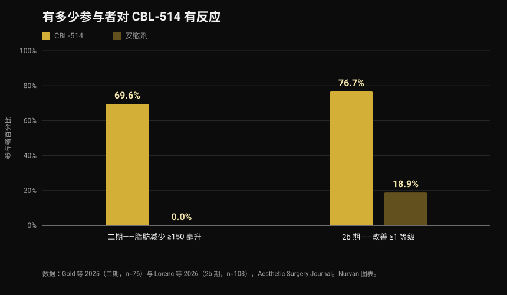
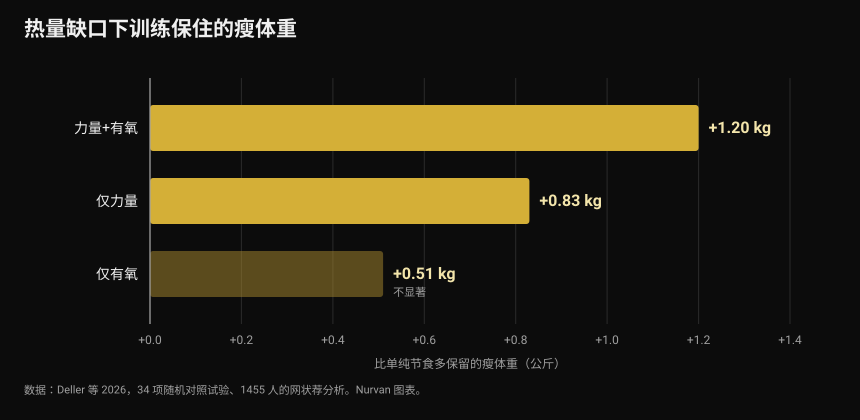

# CBL-514：这种杀死脂肪细胞的药，哪些被证实、哪些还没有

2026 年 9 月底，欧洲糖尿病大会上展示了一种实验性药物：一针下去，脂肪细胞死亡。标题把它叫做「针筒里的抽脂」和新的减肥药。已发表的试验说得更精确，而且有些地方说法并不一样。

作者：[Giammaria Loi](/autore/giammaria-loi) · 更新于 2026 年 10 月 4 日

## 要点速览

- CBL-514 注射到皮下，诱导脂肪细胞（脂肪细胞即储存脂肪的细胞）发生凋亡，也就是程序性死亡。它在任何国家都尚未获批，仍处于试验阶段。
- 人体数据真实且已发表。二期试验中，69.6% 的用药者腹部脂肪减少至少 150 毫升，安慰剂组为 0%。2b 期中，76.7% 在医生评分量表上改善至少一个等级，安慰剂组为 18.9%，核磁显示脂肪体积平均减少 20.3%。
- **它不是减肥药。** 试验治疗的是腹部，受试者 BMI 多在 22 到 30 之间，主要终点是腹部脂肪评分量表，不是体重。
- 内脏脂肪的数字（−12% 对安慰剂 +6%）来自一次会议报告，样本 40 人，尚未通过同行评审：应视为初步结果。
- 「去掉脂肪细胞就不会反弹」这个想法目前只在小鼠身上见到。人体未经验证，而一项荟萃分析显示，减脂期真正保护瘦体重的是训练：比单纯节食多保住约半公斤甚至更多的瘦体重。

*身体成分测量。照片：U.S. Marine Corps，公有领域。*

## CBL-514 是什么，怎么起作用

CBL-514 是台湾公司 Caliway Biopharmaceuticals 开发的小分子药物，直接注射进皮下脂肪，也就是皮肤和肌肉之间的那一层。

官方说明的机制是选择性凋亡：药物让脂肪细胞「有序」死亡，不引发会损伤周围组织的坏死。已发表的试验中没有观察到坏死或神经损伤，最常见的不良反应是注射部位反应——疼痛、发红、肿胀——程度轻到中等，且会自行消退。

*显微镜下的脂肪组织：脂肪细胞就是那些大而圆的细胞。照片：Veeresh likhitha，Wikimedia Commons，CC BY-SA 4.0。*

有一个数字几乎没有标题会提。2008 年发表在《Nature》上的一项经典研究显示，**成年人的脂肪细胞数量基本是固定的**：无论偏瘦还是肥胖，即使大幅减重后也保持不变，因为这个数量在童年和青春期就已经定下来。不过每年大约有 10% 的脂肪细胞会更新。这正是「摧毁脂肪细胞」被提出作为药物靶点的原因——也正是效果不会自动永久的原因：每年 10% 的更新一直在继续。

## 人体试验的数字

两项随机对照试验，都发表在《Aesthetic Surgery Journal》，在腹部测试了这种药物。

*二期与 2b 期试验中对 CBL-514 的应答 — 数据：Gold 等 2025 与 Lorenc 等 2026。Nurvan 图表。*

在**二期**试验中（76 名受试者，2:1 随机分组，每四周一次、最多四次治疗），末次治疗后八周，用药组 69.6% 经超声测得皮下脂肪减少至少 150 毫升，安慰剂组无一人达到。另有 60.9% 越过 200 毫升的门槛，28 名应答者中有 12 人只做了一次治疗就达标。

在 **2b 期**试验中（108 名腹部脂肪中度到重度的成年人，1:1 随机分组，每三周一次、最多四次治疗），用药组 76.7% 在医生评分量表上改善至少一个等级，安慰剂组为 18.9%。核磁估计腹部脂肪体积平均减少 152.9 毫升，即 20.3%。

有两点会改变你的解读。第一，两项试验都是**单盲**：受试者不知道自己用的是什么，但研究者知道——当终点是视觉评分量表时，这比双盲要弱。第二，多位作者是开发该药、同时也是研究资助方 Caliway 的员工。这不是指控，而是在研药物的常规情形：它意味着还需要更大规模的独立验证。

说到更大规模的研究：9 月底的新闻说三期「正在设计中」。**其实已经开始了。** 2026 年 9 月 23 日，Caliway 宣布全球关键性三期试验 SUPREME-01 完成首例患者给药，该试验为随机双盲设计，计划纳入约 320 名受试者，覆盖美国和加拿大。目前还没有结果。

## 内脏脂肪的那组数据

2026 年 9 月 28 日至 10 月 2 日在米兰举行的欧洲糖尿病研究协会（EASD）大会上展示的，是另一项研究：40 名 BMI 在 22 到 30 之间的受试者，最高剂量 600 毫克，重点放在内脏脂肪——包裹内脏、与心血管风险和胰岛素抵抗关系最密切的那部分脂肪。

一个月后，用药组内脏脂肪平均下降 12%，安慰剂组上升 6%；在随后的复查中，下降约为 10%，而安慰剂组上升接近 12%。

数字确实有意思，但要按它本来的性质来读：**会议数据，40 人，尚未通过同行评审。** 会议摘要没有经过期刊文章同样的审查，正式版本里数字经常发生变化。在那之前，这是一个有希望的信号，不是已确立的结论。

## 研究究竟怎么说

**「这是减肥药。」** → **不成立。** 已发表试验的目标是减少腹部皮下脂肪和改善美观评分量表，受试者 BMI 多为正常或轻度偏高。体重不是测量终点。它针对的是局部脂肪，不是肥胖症。

**「约 70% 减少至少 150 毫升脂肪，安慰剂组为 0%。」** → **已确认**，见 2025 年发表的二期试验。

**「超过 75% 在腹部脂肪量表上改善至少一个等级。」** → **已确认**，2b 期：76.7% 对 18.9%。

**「效果相当于抽脂。」** → **需要澄清。** 核磁测得治疗区域的平均体积减少为 20.3%：真实存在，但与手术不是一个量级，仅限腹部，而且需要多次治疗。没有任何试验把这种药与抽脂直接对比过。

**「它也能减少内脏脂肪。」** → **目前无法核实。** 数据存在，但来自会议、40 人样本，没有同行评审的发表。

**「停用 GLP-1 类药物后，它能防止体重反弹。」** → **需要澄清，而且只在小鼠身上。** 人体未经验证。关于人体，我们已知的恰恰相反：发表在《JAMA》上的 SURMOUNT-4 试验中，停用替尔泊肽的人在 52 周内平均回升 14% 的体重，而继续用药的人又减了 5.5%。

**「三期还没开始。」** → **已过时。** 2026 年 9 月 23 日已经开始。

## 实际该怎么做

CBL-514 买不到、未获批，也不涉及你今天能做的任何决定。真正有用的问题是另一个：在此之前，对身体成分有效的是什么？

*热量下降时，力量训练是保护瘦体重的那个变量。照片：Nenad Stojkovic，Wikimedia Commons，CC BY 2.0。*

1. **减脂期间就要练，不要等减完再练。** 2026 年一项纳入 34 项随机对照试验、1455 名受试者的网状荟萃分析比较了「只限制热量」与「限制热量加运动」：训练平均避免了 45.7% 的去脂体重损失。效果最大的是混合训练（力量加有氧，比单纯节食多 1.20 公斤），其次是单纯力量训练（多 0.83 公斤）。

*相比单纯限制热量所保住的瘦体重 — 数据：Deller 等 2026。Nurvan 图表。*

2. **热量缺口别开太大。** 一项关于能量限制下力量训练的元回归估计，每天约 500 千卡的缺口是一个分界点：超过它，即使坚持训练也不再增加瘦体重。想增肌就避免长期大缺口；只想保住肌肉，就待在这条线以下。

3. **把蛋白质吃够。** 这是热量下降时证据最充分的营养手段，详见我们关于[减脂期蛋白质](/blog/protein-intake-cutting-zh)的文章。

4. **要测量，别靠目测。** 体重、围度和一段时间内举起的重量，能告诉你减掉的是脂肪还是连肌肉一起掉。照镜子分不清这两件事。

5. **局部脂肪无法指定。** 没有哪个动作能烧掉它所训练肌肉上方的脂肪。先瘦哪里主要取决于基因和激素——我们在谈[高反应者与低反应者](/blog/genetics-high-low-responders-zh)时讨论过这个话题。

以上数字是研究中观察到的区间和平均值，不是处方。如果你有疾病、正在服药或遵医嘱饮食，改变之前请先和医生沟通。

> ### Nurvan —— 身体成分要看时间序列
>
> 少了两公斤，可能是脂肪、水分，也可能是肌肉：只有把体重、围度和训练重量放在一条时间线上交叉看，才分得清。Nurvan 把围度和体重与每次训练的重量、次数、RIR 记录在一起，营养部分基于官方 CREA 食物数据库——你能看出热量缺口拿走的是脂肪，还是连力量一起。
>
> **[试用 Nurvan](https://nurvan.app)**

## 常见问题

**CBL-514 已经上市了吗？**
没有。它在任何国家都未获批，仍在试验阶段：二期和 2b 期研究已发表，三期试验 SUPREME-01 在 2026 年 9 月 23 日完成首例给药。

**CBL-514 能减肥吗？**
这不是它的目的。已发表的试验测量的是体重正常或轻度偏高人群的腹部皮下脂肪减少量，不是体重下降。

**它和司美格鲁肽（Ozempic）或替尔泊肽（Mounjaro）有什么不同？**
GLP-1 类药物作用于食欲和代谢，让全身减重；CBL-514 注射到某个部位，只在该部位局部作用于脂肪细胞。两者属于不同类别，适应证、风险和证据等级都不同。

**脂肪细胞死掉了，效果就是永久的吗？**
不知道。成年人脂肪细胞数量稳定，但每年约 10% 会更新，而且没有任何已发表试验的随访时间足够长。Caliway 已宣布一项专门做长期随访的三期研究。

**它能取代饮食和训练吗？**
没有数据支持。试验覆盖的是身体的一个部位和几周时间，而中期的体重和身体成分取决于饮食、力量训练和长期坚持。

## 延伸阅读

- [减脂期的蛋白质：究竟需要多少](/blog/protein-intake-cutting-zh) —— 热量下降时保护瘦体重的摄入区间。
- [冷藏米饭：抗性淀粉到底有多大用](/blog/lengcang-mifan-kangxing-dianfen) —— 一个流行说法背后的真实数字。
- [低反应者：基因对肌肉生长究竟有多大影响](/blog/genetics-high-low-responders-zh) —— 为什么同一套计划在不同人身上效果不同。

## 参考文献

1. Gold M, Schlessinger J, Goodman GJ, Dayan S, DuBois J, Ling YF, Sheu AY, Ho WWS, Chou YC, 2025. *Efficacy and Safety of CBL-514 Injection in Reducing Abdominal Subcutaneous Fat: A Randomized, Single-Blind, Placebo-Controlled Phase II Study.* Aesthetic Surgery Journal 45(6):611-620. PMID 40037659 — [DOI](https://doi.org/10.1093/asj/sjaf032)
2. Lorenc ZP, Gold M, Schlessinger J, Lain ET, Smith S, Downie J, Cox SE, Ling YF, Sheu AY, Lu CY, Chou YC, 2026. *Randomized Phase 2b Trial of CBL-514 Injection for Abdominal Subcutaneous Fat Reduction With Clinician- and Patient-reported Outcomes and MRI Assessment.* Aesthetic Surgery Journal. PMID 42159040 — [DOI](https://doi.org/10.1093/asj/sjag092)
3. Spalding KL, Arner E, Westermark PO, Bernard S, Buchholz BA, Bergmann O, Blomqvist L, Hoffstedt J, Näslund E, Britton T, Concha H, Hassan M, Rydén M, Frisén J, Arner P, 2008. *Dynamics of fat cell turnover in humans.* Nature 453(7196):783-787. PMID 18454136 — [DOI](https://doi.org/10.1038/nature06902)
4. Aronne LJ, Sattar N, Horn DB, Bays HE, Wharton S, Lin WY, Ahmad NN, Zhang S, Liao R, Bunck MC, Jouravskaya I, Murphy MA, 2024. *Continued Treatment With Tirzepatide for Maintenance of Weight Reduction in Adults With Obesity: The SURMOUNT-4 Randomized Clinical Trial.* JAMA 331(1):38-48. PMID 38078870 — [DOI](https://doi.org/10.1001/jama.2023.24945)
5. Deller M, Weiershaus J, Held S, Brinkmann C, 2026. *Effects of Calorie Restriction With and Without Strength, Endurance or Mixed Training on Fat-Free and Skeletal Muscle Mass in Overweight or Obese Individuals — A Systematic Review With Pairwise Meta-Analysis and Network Meta-Analysis of Randomized Controlled Studies.* Diabetes, Obesity and Metabolism 28(8):6810-6823. PMID 42144246 — [DOI](https://doi.org/10.1111/dom.70873)
6. Murphy C, Koehler K, 2022. *Energy deficiency impairs resistance training gains in lean mass but not strength: A meta-analysis and meta-regression.* Scandinavian Journal of Medicine & Science in Sports 32(1):125-137. PMID 34623696 — [DOI](https://doi.org/10.1111/sms.14075)

科学文献检索自 PubMed。三期试验 SUPREME-01 的状态依据 [Caliway Biopharmaceuticals 2026 年 9 月 23 日的官方公告](https://www.caliwaybiopharma.com/en/news-detail/-CBL-514-SUPREME-01-FPI-ObesityWeek-2026-ENG/)核实，访问日期 2026 年 10 月 4 日。内脏脂肪数据来自米兰 EASD 大会（2026 年 9 月 28 日至 10 月 2 日）的报告，尚未在同行评审期刊发表。

最初线索：Andrea Centini 发表于 [Fanpage](https://www.fanpage.it/innovazione/scienze/nuovo-farmaco-per-perdere-peso-distrugge-il-grasso-sottocutaneo-come-una-liposuzione-ben-tollerato-negli-studi/) 的文章，2026 年 10 月 2 日。本文的文字、结构与事实核查均为原创。

---

**Giammaria Loi** 是 Nurvan 的创始人。他自 2012 年开始进行力量训练，自 2013 年起担任 FIPE 认证私人教练，并自 2018 年起参加国家级力量举比赛。他署名的每篇文章都从科学研究出发，落到健身房里真正有效的做法。

> 说明：本文为科普内容，不能替代医生或专业人士的意见。CBL-514 是未获批的实验性药物：本文任何内容都不应被当作治疗建议。
