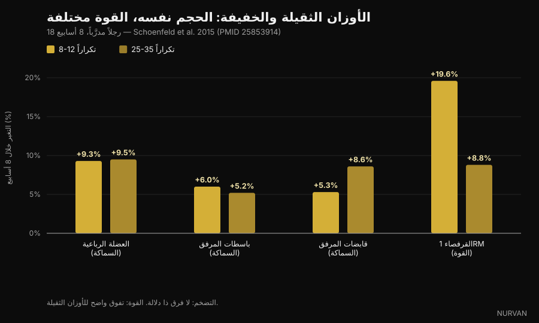
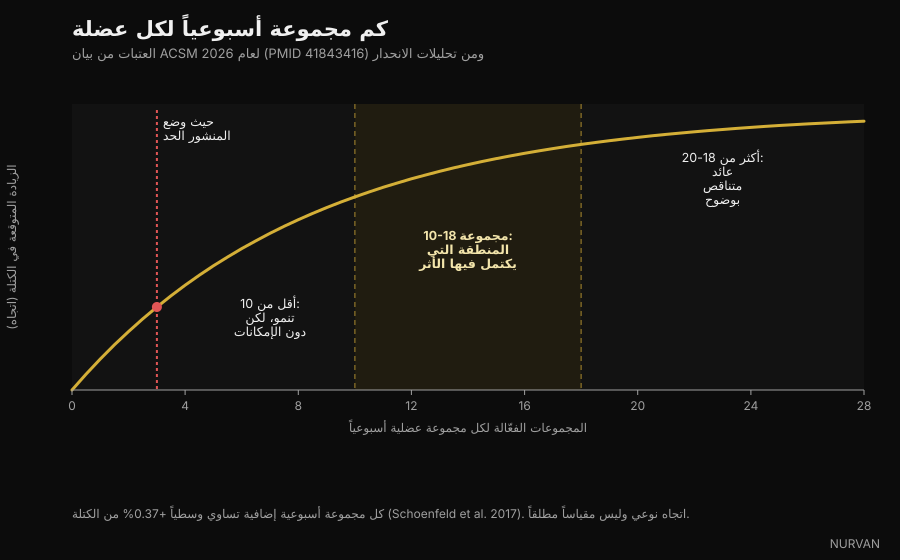

# كم تكرارًا تحتاج فعلًا لبناء العضلات

في الأسابيع الأخيرة قالت أربعة منشورات مختلفة الشيء نفسه: نطاق 8-12 تكرارًا ليس سحريًا، والعضلة تنمو عند 6 تكرارات كما تنمو عند 30. في هذه النقطة هم على حق، وخلفها كمّ هائل من الأبحاث. المشكلة في كل ما أضافوه حولها — عن المجموعات والراحة وحجم التدريب — حيث تنهار ثلاث مزاعم على الأقل عند التحقّق. نفصلها هنا واحدة واحدة.

بقلم [Giammaria Loi](/autore/giammaria-loi) · حُدِّث في 5 أكتوبر 2026

## باختصار

- **نطاق التكرارات أقل أهمية بكثير مما يعتقد المتدرّبون.** البيان الرسمي الجديد للكلية الأمريكية للطب الرياضي (ACSM)، الصادر في مارس 2026 من 137 مراجعة منهجية وأكثر من 30,000 مشارك، لم يجد أي فرق في تضخّم العضلات بين أحمال تمتد من 30% إلى 100% من أقصى تكرار واحد. العضلة لا تعدّ التكرارات، بل تقرأ الشِدّة.
- **أما للقوة القصوى فالحِمل مهم جدًا.** في الدراسة التي جعلت هذا الموضوع مشهورًا، بنت 25-35 تكرارًا في المجموعة العضلات بالقدر نفسه الذي بناه 8-12 تكرارًا، لكن أقصى وزن في السكوات ارتفع 19.6% مع الأحمال الثقيلة مقابل 8.8% مع الأحمال الخفيفة.
- **"بعد ثلاث مجموعات أنت تشتري التعب فقط" كلام خاطئ.** يضع ACSM بداية تراجع المردود للتضخّم عند 18-20 مجموعة أسبوعية لكل عضلة، لا عند ثلاث. وانحدار بَعدي نُشر في 2026 على 67 دراسة يعطي احتمالًا بنسبة 100% أن زيادة الحجم تعني زيادة النمو.
- **لا تحتاج للوصول إلى الفشل العضلي الحقيقي.** البيان صريح: دفع المجموعات إلى الفشل العضلي اللحظي لا يزيد مكاسب القوة ولا التضخّم ولا القدرة. يكفي ترك تكرارين إلى ثلاثة في الاحتياط.
- **مسألة الراحة بين المجموعات بُسِّطت أكثر من اللازم.** تجربة واحدة على متدرّبين مدرّبين تفضّل ثلاث دقائق على دقيقة واحدة، لكن خلاصة ACSM لا تجد فرقًا منهجيًا في القوة بين راحة أقل من دقيقة وأكثر من دقيقة. أما "الحد الأدنى 90 ثانية" فلا يأتي من أي دراسة: رقم اختُرع في تعليق صورة.

*الشِدّة، لا عدد التكرارات، هي المتغيّر الذي تستجيب له العضلة. صورة: Cpl. Kenneth Jasik, U.S. Marine Corps، ملك عام.*

## من أين جاءت قاعدة الـ 8-12

لثلاثة عقود درّست الكتب ما يسمّى "تواصُل التكرارات": أحمال ثقيلة وتكرارات قليلة للقوة، أحمال متوسطة و8-12 تكرارًا للحجم، أحمال خفيفة وتكرارات كثيرة للتحمّل العضلي. كانت نظرية أنيقة، مبنية على المنطق أكثر من كونها مبنية على نمو مقيس.

بدأت المشكلة عندما قاس الباحثون فعلًا سُمك العضلة بالموجات فوق الصوتية. منتصف هذا "التواصُل" لم يظهر في البيانات.

في 2015 أخذ فريق بقيادة Brad Schoenfeld ثمانية عشر رجلًا لديهم خبرة تدريبية وقسّمهم إلى مجموعتين: الأولى تؤدي 8-12 تكرارًا في المجموعة، والثانية 25-35 تكرارًا، على سبعة تمارين، ثلاث مرات أسبوعيًا، لثمانية أسابيع. وكل مجموعة حتى الفشل.

بعد ثمانية أسابيع كانت زيادة سُمك العضلة متطابقة تقريبًا: الفخذ الرباعي +9.3% مقابل +9.5%، باسطات المرفق +6.0% مقابل +5.2%، قابضات المرفق +5.3% مقابل +8.6%، دون فروق ذات دلالة إحصائية. القوة كانت قصة أخرى: أقصى وزن في السكوات ارتفع 19.6% في مجموعة الأحمال الثقيلة و8.8% في مجموعة الأحمال الخفيفة.

*حِمل ثقيل (8-12 تكرارًا) مقابل حِمل خفيف (25-35 تكرارًا)، 8 أسابيع — البيانات: Schoenfeld et al. 2015. مخطّط Nurvan.*

أكّد تحليل بَعدي لاحق على 21 دراسة النمط نفسه: تضخّم متشابه على امتداد طيف الأحمال، وقوة قصوى أفضل بوضوح مع الأحمال الثقيلة. وفي مارس 2026 حسم بيان ACSM — خلاصة 137 مراجعة منهجية — المسألة: التضخّم لم يتأثّر بالأحمال في أي مكان بين 30% و100% من أقصى تكرار واحد.

إذن نعم: **العضلة لا تعدّ**. لكنها تتعرّف على الشِدّة، وهذا بالضبط الجزء الذي تتعامل معه المنشورات بشكل سيّئ.

## الشِدّة مهمّة، الفشل العضلي لا

هذا أنفع تمييز في الموضوع كله، وهو الأسوأ انتقالًا على وسائل التواصل.

أن تكون الشِدّة عالية ليس موضع شك: استخدم وزنًا خفيفًا وتوقّف بعيدًا عن حدّك ولن يكون هناك محفّز. انحدار بَعدي من 2024 على هذا السؤال تحديدًا وجد أن التضخّم يزداد كلما انتهت المجموعة أقرب إلى الفشل، في حين تبقى مكاسب القوة متشابهة على مدى واسع من التكرارات الاحتياطية.

لكن "قريب من الفشل" ليس "حتى الفشل". بيان ACSM واضح: دفع المجموعات إلى الفشل العضلي اللحظي **لا** يزيد مكاسب القوة أو التضخّم أو القدرة، ولبعض الناس — المتدرّبون الأكبر سنًا، وكل من ما زالت تقنيته غير مستقرّة — يضيف خطرًا. المحفّز الكافي يأتي من العمل قريبًا من الفشل، بهدف 2-3 تكرارات احتياطية.

RIR (التكرارات الاحتياطية) هو ببساطة عدد التكرارات الإضافية التي كان بإمكانك أدائها قبل التوقّف. RIR 2 يعني أنك أنهيت المجموعة وفي خزّانك تكرارين.

*التوقّف قبل الفشل بتكرارين يمنح المحفّز نفسه مع تعب متراكم أقل بكثير. صورة: Senior Airman Haiden Morris, U.S. Air Force، ملك عام.*

هذه أكبر فجوة عملية بين نسخة وسائل التواصل والأدبيات العلمية: المنشور يقول ادفع حتى الحد، والبحث يقول ادفع حتى تكرارين من الحد واحفظ الباقي للمجموعة التالية.

## "بعد ثلاث مجموعات أنت تشتري التعب" — أسوأ مزاعم المنشورات

يصيغها أحد المنشورات الأربعة هكذا: *مجموعة صعبة واحدة تؤدّي معظم العمل، الثانية تكاد تضاعفه، وبعد الثالثة أنت تشتري التعب في الغالب.*

النصف الأول صحيح ومعروف: المجموعة الثانية تضيف أكثر مما يوحي الحدس، و ACSM يوصي فعلًا بـ **مجموعتين على الأقل لكل تمرين**. النصف الثاني يخالف كل ما لدينا.

يضع البيان بداية تراجع المردود للتضخّم عند **18-20 مجموعة أسبوعية** لكل مجموعة عضلية — لا عند ثلاث — ويذكر حجم التدريب كأحد المتغيّرات القليلة التي تدفع النمو فعلًا، بأثر إيجابي من **10 مجموعات لكل عضلة أسبوعيًا** وما فوق. والانحدار البَعدي الذي نشره Pelland وزملاؤه في 2026، على 67 دراسة و2,058 مشاركًا، يعطي احتمالًا لاحقًا بنسبة 100% أن زيادة الحجم تنتج تضخّمًا أكبر وقوة أكبر معًا، بمردود متراجع لكنه لا يصل إلى الصفر في المدى المدروس. وانحدار بَعدي أقدم قدّر الزيادة المتوسّطة بـ **+0.37% عضلة لكل مجموعة أسبوعية إضافية**.

*المجموعات الأسبوعية لكل مجموعة عضلية: العتبات من بيان ACSM 2026 ومن الانحدارات البَعدية. مخطّط Nurvan.*

لكن لا تقلب الخطأ إلى الجهة الأخرى. الحجم الأكبر ليس مجانيًا: المردود ينكمش، والتعب يتراكم، ووقت الصالة محدود. غير أن النقطة التي يتوقّف عندها الربح تقع حول 18-20 مجموعة أسبوعية لكل عضلة، لا عند ثلاث مجموعات في الحصة.

## الراحة: حيث بسّطت المنشورات أكثر ما بسّطت

المزعم المطروح للتحقّق: *الراحة الأطول أفضل من القصيرة للحجم والقوة، و90 ثانية هي الحد الأدنى.*

له أساس حقيقي. في 2016 قارنت دراسة على 21 رجلًا مدرّبًا بين دقيقة واحدة وثلاث دقائق من الراحة لثمانية أسابيع مع تثبيت كل شيء آخر: مجموعة الثلاث دقائق كسبت قوة أكبر في السكوات وضغط الصدر، وسُمكًا أكبر في مقدّمة الفخذ. لكن مراجعة من السنة نفسها شملت ست دراسات خلصت إلى أن **النهجين يعملان**، مع ميزة محتملة للراحة الطويلة عند المتدرّبين المدرّبين أصلًا.

أما خلاصة ACSM 2026، التي تنظر في مجموع المراجعات، فهي أكثر تحفّظًا: القوة **لم** تتأثّر بالراحة الأقل من دقيقة مقابل الأكثر من دقيقة، وبيانات التضخّم اعتُبرت غير كافية للخلوص إلى نتيجة.

و"الحد الأدنى 90 ثانية"؟ لا يظهر في أي من الأعمال المذكورة. إنه رقم انتُقي في تعليق صورة.

المبرّر العملي للراحة الأطول قائم على أي حال، ولا يحتاج إلى دراسة تضخّم: إذا استرحت أقل من اللازم ستكون المجموعة التالية أخفّ أو أقصر، فتجمع عملًا نافعًا أقل. الراحة ليست مكوّنًا سحريًا، بل هي ما يسمح لك بأداء المجموعة التالية كما يجب.

## ماذا تقول الأبحاث فعلًا

**"من 6 إلى 30 تكرارًا تبني العضلات بالتساوي، إذا تدرّبت قريبًا من الفشل."** → **صحيح.** Schoenfeld 2015 على 25-35 مقابل 8-12 تكرارًا، والتحليل البَعدي لعام 2017 على 21 دراسة، وبيان ACSM 2026 على أحمال من 30% إلى 100% من أقصى تكرار واحد.

**"تحت 9 تكرارات هو مكان القوة."** → **صحيح.** القوة القصوى تتحسّن أكثر مع الأحمال الثقيلة، و ACSM يذكر علاقة جرعة-استجابة مع الحِمل، مشيرًا إلى أحمال عند 80% من أقصى تكرار واحد أو أعلى.

**"مجموعة صعبة واحدة تؤدّي معظم العمل، وبعد الثالثة تشتري التعب."** → **غير صحيح.** مجموعتان لكل تمرين هي الحد الأدنى الموصى به، وتراجع المردود للتضخّم يصل عند 18-20 مجموعة أسبوعية لكل عضلة، واحتمال أن يُنتج الحجم الأكبر نموًا أكبر يُقدّر بـ 100% في الانحدار البَعدي لعام 2026.

**"الراحة الأطول أفضل من القصيرة للحجم والقوة، و90 ثانية هي الحد الأدنى."** → **يحتاج تفصيلًا.** تجربة معشّاة واحدة على متدرّبين مدرّبين تفضّل ثلاث دقائق، ومراجعة تقول إن النهجين يعملان، وخلاصة ACSM لا تجد فرقًا في القوة بين أقل من دقيقة وأكثر. أما عتبة الـ 90 ثانية فلا مصدر لها.

**"من 10 إلى 20 مجموعة صعبة لكل عضلة أسبوعيًا هو النطاق الذي ينمّيك."** → **يحتاج تفصيلًا.** الحد الأدنى يطابق ACSM (أثر إيجابي من 10 مجموعات وما فوق)، لكن 20 ليست سقفًا: إنها النقطة التي تبدأ عندها المكاسب في التكلفة أكثر بكثير.

**"القُرب من الفشل هو المفتاح."** → **يحتاج تفصيلًا.** التضخّم يتحسّن فعلًا مع الاقتراب من الفشل، لكن الوصول إليه غير ضروري: 2-3 تكرارات احتياطية تعطي النتيجة نفسها بتعب أقل وخطر أقل.

**"NSCA حدّثت إرشاداتها للتضخّم."** → **غير قابل للتحقّق.** لم نجد أي وثيقة أصلية من NSCA تؤكّد الأرقام المنقولة في المنشور. التحديث القابل للتحقّق في 2026 هو بيان ACSM، الذي يحلّ محلّ بيان 2009.

**الاستشهاد بـ "PMID 7928218" كدراسة من 2016 على مجموعات من 4 تكرارات.** → **غير صحيح.** هذا المعرّف يعود إلى ورقة من 1994 عن عوامل التباين بالغادولينيوم في *Investigative Radiology*. لا علاقة له بتدريب المقاومة. وهو أنفع تذكير في هذا المقال: رقم PMID في تعليق صورة ليس تحقّقًا حتى يفتحه أحد.

## كيف تطبّق هذا

عند تحويله إلى برنامج، ما تسنده الأبحاث أبسط مما يبدو.

*اختر الحِمل بحسب الشِدّة التي ينتجها، لا بحسب الرقم المكتوب في البرنامج. صورة: Nenad Stojkovic, Wikimedia Commons, CC BY 2.0.*

1. **اختر نطاق التكرارات بحسب التمرين، لا بحسب العقيدة.** التمارين المركّبة الثقيلة عند 5-10 تكرارات (خطر تقني أقل، قوة أكثر)؛ تمارين العزل عند 10-20 (ضغط أقل على المفاصل، وأسهل للوصول إلى حدّك بأمان). هذا خيار كفاءة، لا خيار فيزيولوجي.
2. **استهدف 2-3 تكرارات احتياطية.** لا الفشل. إن أردت تفريغ الخزّان في المجموعة الأخيرة من تمرين، فافعل ذلك هناك — لا في كل مجموعة من الحصة.
3. **احسب الحجم لكل عضلة، لا لكل تمرين.** ابدأ من 10 مجموعات أسبوعية لكل مجموعة عضلية موزّعة على حصّتين على الأقل، وارتفع تدريجيًا نحو 15-20 فقط إذا صمد التعافي واستمر التقدّم. سرعة استجابتك للحجم الإضافي تتفاوت كثيرًا بين الناس — تناولنا ذلك في مقال [المستجيبون الضعفاء والأقوياء](/ar/blog/genetics-high-low-responders).
4. **استرح بما يكفي لأداء المجموعة التالية جيدًا.** في التمارين المركّبة الثقيلة يعني ذلك عادة 2-3 دقائق؛ وفي تمارين العزل تكفي 60-90 ثانية في كثير من الحالات. إذا انخفضت المجموعة التالية بثلاثة تكرارات، فقد استرحت أقل من اللازم.
5. **تقدّم بالتقدّم المزدوج.** ابقَ في نطاقك، أضف تكرارًا عندما تستطيع، وعندما تبلغ سقف النطاق أضف حِملًا وابدأ من أسفله مجددًا. هذه هي المحرّك، وهذه النقطة أصابتها المنشورات.
6. **سجّل كل شيء.** بدون سجلّ للحِمل والتكرارات وRIR لا تعرف إن كنت تتقدّم أم تكرّر نفسك. معظم الناس يبالغون في تقدير حجمهم الأسبوعي، وعدّ المجموعات لكل مجموعة عضلية يكون مفاجأة في الغالب.

هذه نطاقات مرصودة في دراسات، وليست وصفة فردية. إذا كانت لديك حالة طبية أو إصابة حالية، أو كنت تتبع توجيهًا طبيًا، تحدّث مع طبيبك أو مع مختص مؤهّل قبل تغيير برنامجك.

> ### Nurvan — دع التطبيق يحسب مجموعاتك الأسبوعية بدلًا من ذاكرتك
>
> يسجّل Nurvan الحِمل والتكرارات وRIR لكل مجموعة، ويُظهر كم مجموعة صعبة جمعتها فعلًا لكل مجموعة عضلية هذا الأسبوع، فتعرف إن كنت تحت 10 أو تجاوزت 20. مجموعات التسخين تُقترح تلقائيًا وتبقى خارج عدّ المجموعات الفعّالة، ويبقى تطوّر الأحمال مقروءًا على مدى الوقت بدلًا من الاعتماد على الذاكرة.
>
> **[جرّب Nurvan](https://nurvan.app)**

## أسئلة شائعة

**كم تكرارًا يجب أن أؤدّي لبناء العضلات؟**
أي عدد بين 5 و30 تقريبًا، بشرط أن تنتهي المجموعة قريبًا من حدّك. بيان ACSM 2026 لا يجد فرقًا في التضخّم بين أحمال من 30% إلى 100% من أقصى تكرار واحد. وللتبسيط العملي: 5-10 تكرارات في التمارين المركّبة، و10-20 في تمارين العزل.

**كم مجموعة لكل عضلة في الأسبوع أحتاج فعلًا؟**
الأثر الإيجابي على التضخّم يظهر من نحو 10 مجموعات أسبوعية لكل مجموعة عضلية وما فوق، ويبدأ المردود في الانكماش حول 18-20. المبتدئون يحصلون على الكثير من 4-6 مجموعات أسبوعية مُنفَّذة جيدًا فقط.

**هل يجب أن أتدرّب حتى الفشل في كل مجموعة؟**
لا. بيان ACSM صريح في أن الوصول إلى الفشل العضلي اللحظي لا يزيد مكاسب القوة أو التضخّم أو القدرة. التوقّف بـ 2-3 تكرارات احتياطية كافٍ ويكلّف تعبًا أقل بكثير.

**كم يجب أن أستريح بين المجموعات؟**
بما يكفي لأداء المجموعة التالية جيدًا: عادة 2-3 دقائق في التمارين المركّبة الثقيلة، و60-90 ثانية في تمارين العزل. الدراسات المتاحة لا تُظهر حدًا أدنى عامًا، و"الحد الأدنى 90 ثانية" المنتشر على وسائل التواصل لا مصدر له.

**هل التدريب بأوزان خفيفة وتكرارات عالية مثل رفع الأثقال الثقيلة؟**
لنمو العضلات نعم، إذا اقتربت من حدّك. أما للقوة القصوى فلا: الأحمال الثقيلة تفوز هناك بوضوح، كما أن مجموعات 25-35 تكرارًا أطول بكثير وأكثر إزعاجًا.

## اقرأ أيضًا

- [البروتين أثناء التجفيف: كم تحتاج منه فعلًا؟](/ar/blog/protein-intake-cutting) — الرافعة الغذائية التي تحمي العضلات في العجز السعري.
- [مستر أولمبيا 2026: النتائج وما تعلّمنا إياه](/ar/blog/mr-olympia-2026-nataij) — ما تقوله أكبر منصّة في الرياضة عن الحجم والتعافي.
- [المستجيبون الضعفاء: ما مدى تأثير الجينات في العضلات؟](/ar/blog/genetics-high-low-responders) — لماذا ينتج الحجم نفسه نتائج مختلفة عند أشخاص مختلفين.

## المصادر

1. Currier BS, D'Souza AC, Fiatarone Singh MA, Lowisz CV, Rawson ES, Schoenfeld BJ, Smith-Ryan AE, Steen JP, Thomas GA, Triplett NT, Washington TA, Werner TJ, Phillips SM, 2026. *American College of Sports Medicine Position Stand. Resistance Training Prescription for Muscle Function, Hypertrophy, and Physical Performance in Healthy Adults: An Overview of Reviews.* Medicine & Science in Sports & Exercise 58(4):851-872. PMID 41843416 — [DOI](https://doi.org/10.1249/MSS.0000000000003897)
2. Pelland JC, Remmert JF, Robinson ZP, Hinson SR, Zourdos MC, 2026. *The Resistance Training Dose Response: Meta-Regressions Exploring the Effects of Weekly Volume and Frequency on Muscle Hypertrophy and Strength Gains.* Sports Medicine 56(2):481-505. PMID 41343037 — [DOI](https://doi.org/10.1007/s40279-025-02344-w)
3. Robinson ZP, Pelland JC, Remmert JF, Refalo MC, Jukic I, Steele J, Zourdos MC, 2024. *Exploring the Dose-Response Relationship Between Estimated Resistance Training Proximity to Failure, Strength Gain, and Muscle Hypertrophy: A Series of Meta-Regressions.* Sports Medicine 54(9):2209-2231. PMID 38970765 — [DOI](https://doi.org/10.1007/s40279-024-02069-2)
4. Schoenfeld BJ, Peterson MD, Ogborn D, Contreras B, Sonmez GT, 2015. *Effects of Low- vs. High-Load Resistance Training on Muscle Strength and Hypertrophy in Well-Trained Men.* Journal of Strength and Conditioning Research 29(10):2954-2963. PMID 25853914 — [DOI](https://doi.org/10.1519/JSC.0000000000000958)
5. Schoenfeld BJ, Grgic J, Ogborn D, Krieger JW, 2017. *Strength and Hypertrophy Adaptations Between Low- vs. High-Load Resistance Training: A Systematic Review and Meta-analysis.* Journal of Strength and Conditioning Research 31(12):3508-3523. PMID 28834797 — [DOI](https://doi.org/10.1519/JSC.0000000000002200)
6. Schoenfeld BJ, Ogborn D, Krieger JW, 2017. *Dose-response relationship between weekly resistance training volume and increases in muscle mass: A systematic review and meta-analysis.* Journal of Sports Sciences 35(11):1073-1082. PMID 27433992 — [DOI](https://doi.org/10.1080/02640414.2016.1210197)
7. Schoenfeld BJ, Pope ZK, Benik FM, Hester GM, Sellers J, Nooner JL, Schnaiter JA, Bond-Williams KE, Carter AS, Ross CL, Just BL, Henselmans M, Krieger JW, 2016. *Longer Interset Rest Periods Enhance Muscle Strength and Hypertrophy in Resistance-Trained Men.* Journal of Strength and Conditioning Research 30(7):1805-1812. PMID 26605807 — [DOI](https://doi.org/10.1519/JSC.0000000000001272)
8. Grgic J, Lazinica B, Mikulic P, Krieger JW, Schoenfeld BJ, 2017. *The effects of short versus long inter-set rest intervals in resistance training on measures of muscle hypertrophy: A systematic review.* European Journal of Sport Science 17(8):983-993. PMID 28641044 — [DOI](https://doi.org/10.1080/17461391.2017.1340524)
9. Schoenfeld BJ, Grgic J, Van Every DW, Plotkin DL, 2021. *Loading Recommendations for Muscle Strength, Hypertrophy, and Local Endurance: A Re-Examination of the Repetition Continuum.* Sports (Basel) 9(2):32. PMID 33671664 — [DOI](https://doi.org/10.3390/sports9020032)

المصادر العلمية مستخرجة من PubMed ومُتحقَّق منها في 5 أكتوبر 2026.

نقطة الانطلاق: منشورات [homebodyys](https://www.instagram.com/p/DdL7UjGG2wg/) و[The Movement System](https://www.instagram.com/p/Ddon1AtEWJb/) و[Christian Poulos](https://www.instagram.com/p/DdRXFzGkTrY/) و[iwannaburnfat](https://www.instagram.com/p/Dc6T7q5iJCr/)، المنشورة بين 5 و23 سبتمبر 2026. النص والبنية والتحقّق من الوقائع والمخطّطات في هذا المقال أصلية.

---

**Giammaria Loi** هو مؤسس Nurvan. يتدرّب بالأثقال منذ 2012، ويعمل مدرّبًا شخصيًا وكوتشًا معتمدًا من FIPE منذ 2013، وينافس في الباورليفتينغ على المستوى الوطني منذ 2018.
كل مقال يكتبه يبدأ من الأبحاث وينتهي بما ينجح فعلًا في الصالة.

> ملاحظة: محتوى معرفي للتوعية، لا يُغني عن رأي طبيب أو مختص مؤهّل. النطاقات المذكورة مأخوذة من دراسات على فئات محدّدة وليست برنامجًا شخصيًا.
