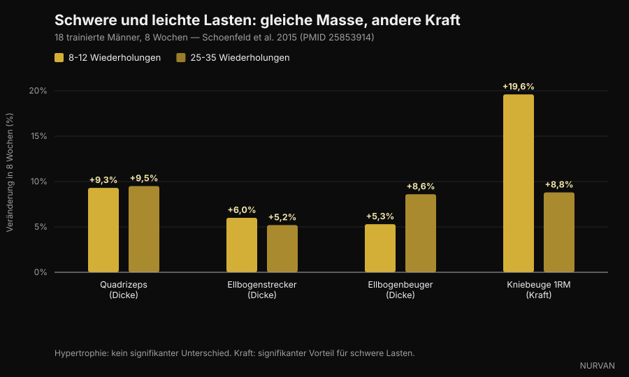
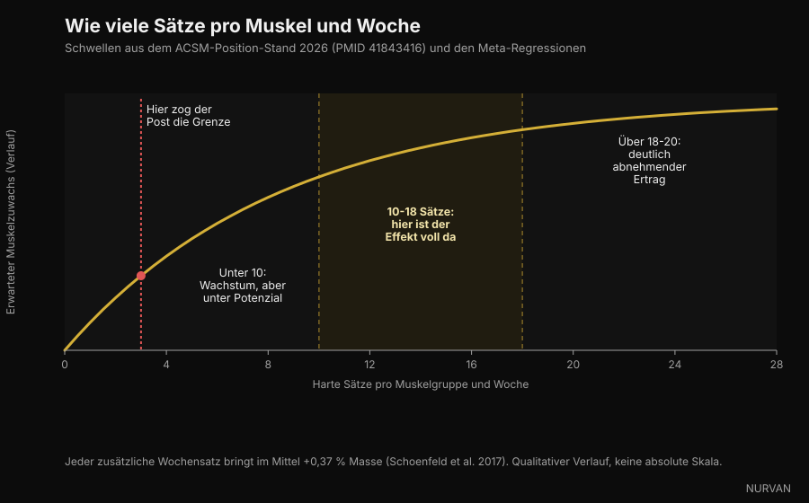

# Wie viele Wiederholungen du wirklich für Muskelaufbau brauchst

Von [Giammaria Loi](/autore/giammaria-loi) · aktualisiert am 5. Oktober 2026

In den letzten Wochen haben vier verschiedene Carousels dasselbe behauptet: Der Bereich von 8-12 Wiederholungen ist nicht magisch, der Muskel wächst bei 6 Wiederholungen genauso wie bei 30. In diesem Punkt haben sie recht, und dahinter steht ein Berg an Forschung. Das Problem ist alles, was sie darum herum gebaut haben — zu Sätzen, Pausen und Volumen. Dort halten mindestens drei Aussagen der Prüfung nicht stand. Wir nehmen sie einzeln auseinander.

## Kurz gefasst

- **Der Wiederholungsbereich zählt viel weniger, als du denkst.** Das neue Positionspapier des American College of Sports Medicine, im März 2026 auf Basis von 137 systematischen Reviews und über 30.000 Teilnehmenden veröffentlicht, findet keinen Unterschied im Muskelaufbau zwischen Lasten von 30 % und 100 % des Maximalgewichts. Der Muskel kann keine Wiederholungen zählen. Er liest Anstrengung.
- **Für die Maximalkraft zählt die Last dagegen sehr.** In der Studie, die das Thema bekannt gemacht hat, bauten 25-35 Wiederholungen pro Satz genauso viel Muskel auf wie 8-12 — aber das Kniebeuge-Maximum stieg mit schweren Lasten um 19,6 % und mit leichten nur um 8,8 %.
- **"Ab dem dritten Satz kaufst du nur Müdigkeit" ist falsch.** Das ACSM setzt die abnehmenden Erträge für Hypertrophie bei etwa 18-20 Sätzen pro Muskel und Woche an, nicht bei drei. Eine Meta-Regression von 2026 über 67 Studien gibt eine Wahrscheinlichkeit von 100 %, dass mehr Volumen mehr Wachstum bedeutet.
- **Du musst nicht bis zum echten Muskelversagen gehen.** Das Positionspapier ist deutlich: Sätze bis zum momentanen Muskelversagen zu führen verbessert die Zuwächse bei Kraft, Hypertrophie oder Schnellkraft nicht. Zwei bis drei Wiederholungen in Reserve genügen.
- **Bei den Pausen haben die Posts zu stark vereinfacht.** Eine einzelne Studie an trainierten Hebern spricht für drei Minuten statt einer, doch die ACSM-Synthese findet keinen systematischen Kraftunterschied zwischen Pausen unter und über einer Minute. Das "Minimum von 90 Sekunden" stammt aus keiner Studie — die Zahl wurde in einer Bildunterschrift erfunden.

*Die Anstrengung, nicht die Zahl der Wiederholungen, ist die Variable, auf die der Muskel reagiert. Foto: Cpl. Kenneth Jasik, U.S. Marine Corps, gemeinfrei.*

## Woher die 8-12-Regel kommt

Drei Jahrzehnte lang haben Lehrbücher das "Wiederholungskontinuum" gelehrt: schwere Lasten und wenige Wiederholungen für Kraft, mittlere Lasten und 8-12 Wiederholungen für Masse, leichte Lasten und viele Wiederholungen für Kraftausdauer. Eine ordentliche Theorie, gebaut mehr auf Logik als auf gemessenem Wachstum.

Die Probleme fingen an, als jemand die Muskeldicke tatsächlich per Ultraschall gemessen hat. Die Mitte des Kontinuums war nicht zu sehen.

2015 nahm eine Gruppe um Brad Schoenfeld 18 Männer mit Trainingserfahrung und teilte sie in zwei Gruppen: eine machte 8-12 Wiederholungen pro Satz, die andere 25-35, über sieben Übungen, dreimal pro Woche, acht Wochen lang. Alle Sätze bis zum Muskelversagen.

Nach acht Wochen war der Zuwachs an Muskeldicke praktisch identisch: Quadrizeps +9,3 % gegenüber +9,5 %, Ellenbogenstrecker +6,0 % gegenüber +5,2 %, Ellenbogenbeuger +5,3 % gegenüber +8,6 %, ohne statistisch signifikante Unterschiede. Bei der Kraft sah es anders aus: Das Kniebeuge-Maximum stieg in der schweren Gruppe um 19,6 % und in der leichten um 8,8 %.

*Schwere Last (8-12 Wiederholungen) gegenüber leichter Last (25-35 Wiederholungen), 8 Wochen — Daten: Schoenfeld et al. 2015. Grafik: Nurvan.*

Eine spätere Meta-Analyse über 21 Studien hat das Bild bestätigt: ähnliche Hypertrophie über das gesamte Lastspektrum, klar bessere Maximalkraft mit schweren Lasten. Und im März 2026 hat das ACSM-Positionspapier — eine Synthese aus 137 systematischen Reviews — die Frage geklärt: Die Hypertrophie wurde von Lasten zwischen 30 % und 100 % des Maximalgewichts nicht beeinflusst.

Also ja: **der Muskel kann nicht rechnen**. Aber er erkennt Anstrengung, und genau diesen Teil behandeln die Carousels schlecht.

## Anstrengung zählt. Muskelversagen nicht

Das ist die nützlichste Unterscheidung im ganzen Thema — und die, die in den sozialen Medien am schlechtesten überlebt.

Dass die Anstrengung hoch sein muss, steht außer Frage: Nimmst du ein leichtes Gewicht und hörst weit vor deiner Grenze auf, gibt es keinen Reiz. Eine Meta-Regression von 2024 zu genau dieser Frage fand, dass die Hypertrophie zunimmt, je näher die Sätze am Muskelversagen enden, während die Kraftzuwächse über eine große Spanne an Wiederholungen in Reserve ähnlich bleiben.

Aber "nah am Muskelversagen" ist nicht "bis zum Muskelversagen". Das ACSM-Positionspapier sagt es explizit: Sätze bis zum momentanen Muskelversagen zu führen steigert die Zuwächse bei Kraft, Hypertrophie oder Schnellkraft **nicht**, und für manche Menschen — ältere Trainierende, alle mit noch wackliger Technik — erhöht es das Risiko. Der ausreichende Reiz entsteht aus der Arbeit nahe am Muskelversagen, mit einem Ziel von 2-3 Wiederholungen in Reserve.

RIR (*reps in reserve*, Wiederholungen in Reserve) ist einfach die Zahl der Wiederholungen, die du vor dem Abbruch noch geschafft hättest. RIR 2 heißt: Du hast abgelegt, obwohl zwei noch drin waren.

*Zwei Wiederholungen vor dem Limit aufzuhören liefert denselben Reiz wie Muskelversagen, bei deutlich weniger angesammelter Ermüdung. Foto: Senior Airman Haiden Morris, U.S. Air Force, gemeinfrei.*

Das ist die größte praktische Lücke zwischen der Social-Version und der Literatur: Das Carousel sagt "geh bis an die Grenze", die Forschung sagt "geh bis zwei Wiederholungen vor der Grenze und spare den Rest für den nächsten Satz".

## "Ab dem dritten Satz kaufst du nur Müdigkeit" — die schwächste Aussage

Einer der vier Posts formuliert es so: *Ein harter Satz macht schon den größten Teil der Arbeit, ein zweiter verdoppelt sie fast, ab dem dritten kaufst du vor allem Müdigkeit.*

Die erste Hälfte stimmt und ist gut bekannt: Der zweite Satz bringt mehr, als die Intuition vermutet, und das ACSM empfiehlt tatsächlich **mindestens zwei Sätze pro Übung**. Die zweite Hälfte widerspricht allem, was wir haben.

Das Positionspapier setzt die abnehmenden Erträge für Hypertrophie bei etwa **18-20 Sätzen pro Woche** und Muskelgruppe an — nicht bei drei — und listet das Volumen als eine der wenigen Variablen, die das Wachstum wirklich treiben, mit einem positiven Effekt ab **10 Sätzen pro Muskel und Woche**. Die 2026 von Pelland und Kollegen veröffentlichte Meta-Regression über 67 Studien und 2.058 Teilnehmende weist eine Posterior-Wahrscheinlichkeit von 100 % zu, dass mehr Volumen sowohl mehr Hypertrophie als auch mehr Kraft bringt, mit abnehmenden, aber im untersuchten Bereich nie erloschenen Erträgen. Eine frühere Meta-Regression bezifferte den mittleren Zuwachs auf **+0,37 % Muskel pro zusätzlichem Satz und Woche**.

*Wochensätze pro Muskelgruppe: Schwellen aus dem ACSM-Positionspapier 2026 und den Meta-Regressionen. Grafik: Nurvan.*

Dreh den Fehler aber nicht in die andere Richtung. Mehr Volumen ist nicht kostenlos: Die Erträge schrumpfen, Ermüdung sammelt sich, und die Zeit im Studio ist begrenzt. Nur liegt der Punkt, ab dem es sich nicht mehr auszahlt, bei etwa 18-20 Wochensätzen pro Muskel — nicht bei drei Sätzen pro Einheit.

## Pausen: hier haben die Posts am meisten vereinfacht

Die geprüfte Aussage: *Lange Pausen schlagen kurze bei Masse und Kraft, und 90 Sekunden sind das Minimum.*

Dafür gibt es eine echte Grundlage. 2016 verglich eine Studie an 21 trainierten Männern eine Minute gegen drei Minuten Pause über acht Wochen, bei sonst gleichen Bedingungen: Die Drei-Minuten-Gruppe gewann mehr Kraft in Kniebeuge und Bankdrücken und mehr Dicke im vorderen Oberschenkel. Ein Review aus demselben Jahr über sechs Studien kam allerdings zum Schluss, dass **beide Ansätze funktionieren**, mit einem möglichen Vorteil langer Pausen bei schon Trainierten.

Die ACSM-Synthese von 2026, die den gesamten Bestand an Reviews betrachtet, ist noch zurückhaltender: Die Kraft wurde von Pausen unter einer Minute gegenüber Pausen über einer Minute **nicht** beeinflusst, und die Datenlage zur Hypertrophie wurde als unzureichend für eine Aussage bewertet.

Und das "Minimum von 90 Sekunden"? Es kommt in keiner der zitierten Arbeiten vor. Es ist eine in einer Bildunterschrift gewählte Zahl.

Der praktische Grund, länger zu pausieren, bleibt trotzdem — und braucht keine Hypertrophie-Studie: Pausierst du zu kurz, wird der nächste Satz leichter oder kürzer, und du sammelst weniger Qualitätsarbeit an. Die Pause ist keine magische Zutat. Sie ist das, was dir den folgenden Satz überhaupt ermöglicht.

## Was die Forschung wirklich sagt

**"6 bis 30 Wiederholungen bauen gleich viel Muskel auf, wenn du nahe am Muskelversagen trainierst."** → **Bestätigt.** Schoenfeld 2015 zu 25-35 gegenüber 8-12 Wiederholungen, die Meta-Analyse von 2017 über 21 Studien und das ACSM-Positionspapier 2026 zu Lasten von 30 % bis 100 % des Maximums.

**"Unter 9 Wiederholungen wohnt die Kraft."** → **Bestätigt.** Die Maximalkraft verbessert sich stärker mit schweren Lasten, und das ACSM berichtet eine Dosis-Wirkung mit der Last, mit Bezug auf Lasten ab 80 % des Maximums.

**"Ein harter Satz macht den größten Teil der Arbeit; ab dem dritten kaufst du Müdigkeit."** → **Widerlegt.** Zwei Sätze pro Übung sind das empfohlene Minimum, die abnehmenden Erträge für Hypertrophie kommen bei etwa 18-20 Wochensätzen pro Muskel, und die Wahrscheinlichkeit, dass mehr Volumen mehr Wachstum bringt, wird in der Meta-Regression von 2026 auf 100 % geschätzt.

**"Lange Pausen schlagen kurze bei Masse und Kraft; 90 Sekunden sind das Minimum."** → **Zu präzisieren.** Ein RCT an Trainierten spricht für drei Minuten, ein Review sagt, beides funktioniert, und die ACSM-Synthese findet keinen Kraftunterschied zwischen unter und über einer Minute. Die 90-Sekunden-Schwelle hat keine Quelle.

**"10 bis 20 harte Sätze pro Muskel und Woche sind der Bereich, der dich wachsen lässt."** → **Zu präzisieren.** Die Untergrenze passt zum ACSM (positiver Effekt ab 10 Sätzen), aber 20 ist keine Decke — dort fangen die Zuwächse nur an, deutlich mehr zu kosten.

**"Nahe am Muskelversagen ist der Schlüssel."** → **Zu präzisieren.** Die Hypertrophie verbessert sich tatsächlich, je näher du dem Muskelversagen kommst, aber es zu erreichen ist nicht nötig: 2-3 Wiederholungen in Reserve liefern dasselbe Ergebnis mit weniger Ermüdung und weniger Risiko.

**"Die NSCA hat ihre Hypertrophie-Leitlinien aktualisiert."** → **Nicht überprüfbar.** Wir haben kein NSCA-Primärdokument gefunden, das die im Post genannten Zahlen bestätigt. Die überprüfbare Aktualisierung von 2026 ist das ACSM-Positionspapier, das jenes von 2009 ersetzt.

**Die Angabe "PMID 7928218" als Studie von 2016 zu Sätzen mit 4 Wiederholungen.** → **Widerlegt.** Diese Kennung gehört zu einer Arbeit von 1994 über Gadolinium-Kontrastmittel in *Investigative Radiology*. Sie hat nichts mit Krafttraining zu tun. Das ist die nützlichste Erinnerung in diesem Artikel: Eine PMID in einer Bildunterschrift ist keine Prüfung, solange sie niemand öffnet.

## So setzt du es um

In ein Programm übersetzt ist das, was die Forschung stützt, einfacher, als es klingt.

*Wähle die Last nach der Anstrengung, die sie erzeugt, nicht nach der Zahl im Plan. Foto: Nenad Stojkovic, Wikimedia Commons, CC BY 2.0.*

1. **Wähle den Wiederholungsbereich nach Übung, nicht nach Dogma.** Schwere Mehrgelenksübungen mit 5-10 Wiederholungen (weniger technisches Risiko, mehr Kraft), Isolationsübungen mit 10-20 (weniger Gelenkbelastung, leichter sicher ans Limit). Das ist eine Entscheidung der Effizienz, keine der Physiologie.
2. **Ziele auf 2-3 Wiederholungen in Reserve.** Nicht auf Muskelversagen. Wenn du im letzten Satz einer Übung den Tank leer machen willst, mach es dort — nicht in jedem Satz der Einheit.
3. **Zähle das Volumen pro Muskel, nicht pro Übung.** Starte mit 10 Wochensätzen pro Muskelgruppe, verteilt auf mindestens zwei Einheiten, und gehe nur dann schrittweise auf 15-20, wenn die Erholung mitkommt und der Fortschritt anhält. Wie schnell du auf mehr Volumen reagierst, unterscheidet sich stark von Person zu Person — darüber haben wir im Beitrag zu [High und Low Respondern](/de/blog/genetik-high-low-responder) geschrieben.
4. **Pausiere so lange, dass der nächste Satz gut läuft.** Bei schweren Mehrgelenksübungen sind das meist 2-3 Minuten, bei Isolationsübungen reichen oft 60-90 Sekunden. Bricht der nächste Satz um drei Wiederholungen ein, war die Pause zu kurz.
5. **Steigere mit doppelter Progression.** Bleib in deinem Bereich, füge eine Wiederholung hinzu, wenn es geht, und wenn du oben im Bereich angekommen bist, erhöhe die Last und starte unten neu. Das ist der Motor, und hier hatten die Posts recht.
6. **Dokumentiere es.** Ohne Protokoll von Last, Wiederholungen und RIR weißt du nicht, ob du Fortschritte machst oder dich wiederholst. Fast alle überschätzen ihr Wochenvolumen — die Sätze pro Muskelgruppe zu zählen ist meist eine Überraschung.

Das sind in Studien beobachtete Spannen, keine individuelle Verordnung. Wenn du eine Erkrankung oder eine akute Verletzung hast oder einer medizinischen Empfehlung folgst, sprich mit deiner Ärztin oder einer qualifizierten Fachperson, bevor du dein Programm änderst.

> ### Nurvan — deine Wochensätze zählt die App, nicht dein Gedächtnis
>
> Nurvan protokolliert Last, Wiederholungen und RIR für jeden Satz und zeigt dir, wie viele harte Sätze du pro Muskelgruppe in dieser Woche tatsächlich gesammelt hast — ob du also unter 10 liegst oder schon über 20. Aufwärmsätze werden automatisch vorgeschlagen und bleiben aus der Zählung der Arbeitssätze heraus, und die Lastprogression ist über die Zeit ablesbar statt aus dem Kopf.
>
> **[Nurvan testen](https://nurvan.app)**

## Häufige Fragen

**Wie viele Wiederholungen soll ich für Muskelaufbau machen?**
Alles zwischen etwa 5 und 30, solange der Satz nahe an deinem Limit endet. Das ACSM-Positionspapier 2026 findet keinen Hypertrophie-Unterschied zwischen Lasten von 30 % und 100 % des Maximums. Praktisch: 5-10 Wiederholungen bei Mehrgelenksübungen, 10-20 bei Isolationsübungen.

**Wie viele Sätze pro Muskel und Woche brauche ich wirklich?**
Der positive Effekt auf die Hypertrophie zeigt sich ab etwa 10 Wochensätzen pro Muskelgruppe, die Erträge beginnen um 18-20 zu schrumpfen. Einsteiger holen schon aus 4-6 gut ausgeführten Wochensätzen viel heraus.

**Muss ich in jedem Satz bis zum Muskelversagen gehen?**
Nein. Das ACSM-Positionspapier sagt ausdrücklich, dass das momentane Muskelversagen die Zuwächse bei Kraft, Hypertrophie oder Schnellkraft nicht erhöht. Mit 2-3 Wiederholungen in Reserve aufzuhören genügt und kostet weit weniger Ermüdung.

**Wie lange soll ich zwischen den Sätzen pausieren?**
Lange genug, um den nächsten Satz gut auszuführen: meist 2-3 Minuten bei schweren Mehrgelenksübungen, 60-90 Sekunden bei Isolationsübungen. Die verfügbaren Studien zeigen kein universelles Minimum, und das in sozialen Medien kursierende "Minimum von 90 Sekunden" hat keine Quelle.

**Ist leichtes Gewicht mit vielen Wiederholungen dasselbe wie schwer heben?**
Für den Muskelaufbau ja, wenn du nah an dein Limit gehst. Für die Maximalkraft nein: Dort gewinnen schwere Lasten klar, und Sätze mit 25-35 Wiederholungen sind außerdem viel länger und deutlich unangenehmer.

## Lies auch

- [Protein in der Diät: Wie viel du wirklich brauchst](/de/blog/protein-in-der-diaet) — der Ernährungshebel, der den Muskel im Defizit schützt.
- [Mr. Olympia 2026: Ergebnisse und was sie uns zeigen](/de/blog/mr-olympia-2026-ergebnisse-nick-walker) — was die größte Bühne des Sports über Volumen und Erholung sagt.
- [Low Responder: Wie viel Genetik steckt im Muskelaufbau?](/de/blog/genetik-high-low-responder) — warum dasselbe Volumen bei verschiedenen Menschen verschiedene Ergebnisse bringt.

## Quellen

1. Currier BS, D'Souza AC, Fiatarone Singh MA, Lowisz CV, Rawson ES, Schoenfeld BJ, Smith-Ryan AE, Steen JP, Thomas GA, Triplett NT, Washington TA, Werner TJ, Phillips SM, 2026. *American College of Sports Medicine Position Stand. Resistance Training Prescription for Muscle Function, Hypertrophy, and Physical Performance in Healthy Adults: An Overview of Reviews.* Medicine & Science in Sports & Exercise 58(4):851-872. PMID 41843416 — [DOI](https://doi.org/10.1249/MSS.0000000000003897)
2. Pelland JC, Remmert JF, Robinson ZP, Hinson SR, Zourdos MC, 2026. *The Resistance Training Dose Response: Meta-Regressions Exploring the Effects of Weekly Volume and Frequency on Muscle Hypertrophy and Strength Gains.* Sports Medicine 56(2):481-505. PMID 41343037 — [DOI](https://doi.org/10.1007/s40279-025-02344-w)
3. Robinson ZP, Pelland JC, Remmert JF, Refalo MC, Jukic I, Steele J, Zourdos MC, 2024. *Exploring the Dose-Response Relationship Between Estimated Resistance Training Proximity to Failure, Strength Gain, and Muscle Hypertrophy: A Series of Meta-Regressions.* Sports Medicine 54(9):2209-2231. PMID 38970765 — [DOI](https://doi.org/10.1007/s40279-024-02069-2)
4. Schoenfeld BJ, Peterson MD, Ogborn D, Contreras B, Sonmez GT, 2015. *Effects of Low- vs. High-Load Resistance Training on Muscle Strength and Hypertrophy in Well-Trained Men.* Journal of Strength and Conditioning Research 29(10):2954-2963. PMID 25853914 — [DOI](https://doi.org/10.1519/JSC.0000000000000958)
5. Schoenfeld BJ, Grgic J, Ogborn D, Krieger JW, 2017. *Strength and Hypertrophy Adaptations Between Low- vs. High-Load Resistance Training: A Systematic Review and Meta-analysis.* Journal of Strength and Conditioning Research 31(12):3508-3523. PMID 28834797 — [DOI](https://doi.org/10.1519/JSC.0000000000002200)
6. Schoenfeld BJ, Ogborn D, Krieger JW, 2017. *Dose-response relationship between weekly resistance training volume and increases in muscle mass: A systematic review and meta-analysis.* Journal of Sports Sciences 35(11):1073-1082. PMID 27433992 — [DOI](https://doi.org/10.1080/02640414.2016.1210197)
7. Schoenfeld BJ, Pope ZK, Benik FM, Hester GM, Sellers J, Nooner JL, Schnaiter JA, Bond-Williams KE, Carter AS, Ross CL, Just BL, Henselmans M, Krieger JW, 2016. *Longer Interset Rest Periods Enhance Muscle Strength and Hypertrophy in Resistance-Trained Men.* Journal of Strength and Conditioning Research 30(7):1805-1812. PMID 26605807 — [DOI](https://doi.org/10.1519/JSC.0000000000001272)
8. Grgic J, Lazinica B, Mikulic P, Krieger JW, Schoenfeld BJ, 2017. *The effects of short versus long inter-set rest intervals in resistance training on measures of muscle hypertrophy: A systematic review.* European Journal of Sport Science 17(8):983-993. PMID 28641044 — [DOI](https://doi.org/10.1080/17461391.2017.1340524)
9. Schoenfeld BJ, Grgic J, Van Every DW, Plotkin DL, 2021. *Loading Recommendations for Muscle Strength, Hypertrophy, and Local Endurance: A Re-Examination of the Repetition Continuum.* Sports (Basel) 9(2):32. PMID 33671664 — [DOI](https://doi.org/10.3390/sports9020032)

Wissenschaftliche Quellen über PubMed abgerufen und am 5. Oktober 2026 geprüft.

Ausgangspunkt: die Carousels von [homebodyys](https://www.instagram.com/p/DdL7UjGG2wg/), [The Movement System](https://www.instagram.com/p/Ddon1AtEWJb/), [Christian Poulos](https://www.instagram.com/p/DdRXFzGkTrY/) und [iwannaburnfat](https://www.instagram.com/p/Dc6T7q5iJCr/), veröffentlicht zwischen dem 5. und dem 23. September 2026. Text, Struktur, Faktencheck und Grafiken dieses Artikels sind original.

---

**Giammaria Loi** ist der Gründer von Nurvan. Er trainiert seit 2012 mit Gewichten, arbeitet seit 2013 als FIPE-zertifizierter Personal Trainer und Coach und tritt seit 2018 im Powerlifting auf nationaler Ebene an.
Jeder Artikel, den er schreibt, beginnt bei der Forschung und endet bei dem, was im Studio tatsächlich funktioniert.

> Hinweis: informativer Inhalt, kein Ersatz für die Beratung durch eine Ärztin, einen Arzt oder eine qualifizierte Fachperson. Die genannten Spannen stammen aus Studien an spezifischen Populationen und sind kein personalisiertes Programm.
