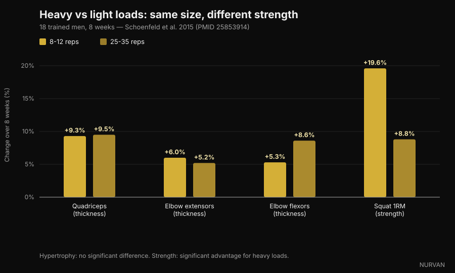
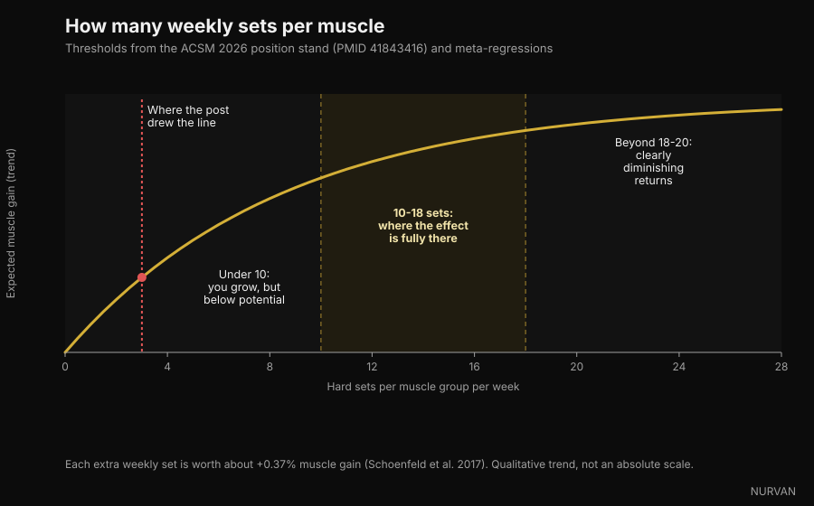

# How many reps you actually need to build muscle

Four different carousels said the same thing in the past few weeks: the 8-12 rep range isn't magic, and muscle grows at 6 reps as well as at 30. On that point they're right, and there's a mountain of research behind it. The problem is everything they stacked around it — about sets, rest and volume — where at least three claims fall apart under checking. Here they are, one at a time.

By [Giammaria Loi](/autore/giammaria-loi) · updated 5 October 2026

## In short

- **Rep range matters far less than lifters think.** The American College of Sports Medicine's new position stand, published in March 2026 from 137 systematic reviews and over 30,000 participants, found no hypertrophy difference across loads from 30% to 100% of one-rep max. Muscle can't count reps. It reads effort.
- **For maximal strength, load matters a lot.** In the study that made this topic famous, 25-35 reps per set built as much muscle as 8-12 — but squat 1RM rose 19.6% with heavy loads versus 8.8% with light ones.
- **"Past three sets you're buying fatigue" is wrong.** The ACSM puts diminishing returns for hypertrophy around 18-20 weekly sets per muscle, not three. A 2026 meta-regression of 67 studies gives a 100% probability that more volume means more growth.
- **You don't need to hit true failure.** The position stand is blunt: taking sets to momentary muscular failure does not enhance gains in strength, hypertrophy or power. Two to three reps in reserve is enough.
- **The rest-period claim was oversimplified.** One trial in trained lifters favours three minutes over one, but the ACSM synthesis finds no systematic strength difference between rest under and over a minute. The "90-second minimum" comes from no study at all — it was invented in a caption.

*Effort, not rep count, is the variable muscle responds to. Photo: Cpl. Kenneth Jasik, U.S. Marine Corps, public domain.*

## Where the 8-12 rule came from

For three decades textbooks taught the "repetition continuum": heavy loads and few reps for strength, moderate loads and 8-12 reps for size, light loads and many reps for muscular endurance. It was a tidy theory, built more on logic than on measured growth.

The trouble started when people actually measured muscle thickness with ultrasound. The middle of the continuum didn't show up.

In 2015 a group led by Brad Schoenfeld took 18 men with training experience and split them in two: one group did 8-12 reps per set, the other 25-35, across seven exercises, three times a week, for eight weeks. Every set to failure.

After eight weeks the increase in muscle thickness was essentially identical: quadriceps +9.3% vs +9.5%, elbow extensors +6.0% vs +5.2%, elbow flexors +5.3% vs +8.6%, with no statistically significant differences. Strength was a different story: squat 1RM rose 19.6% in the heavy group and 8.8% in the light one.

*Heavy load (8-12 reps) vs light load (25-35 reps), 8 weeks — Data: Schoenfeld et al. 2015. Nurvan chart.*

A later meta-analysis of 21 studies confirmed the pattern: similar hypertrophy across the loading spectrum, clearly better maximal strength with heavy loads. And in March 2026 the ACSM position stand — a synthesis of 137 systematic reviews — settled it: hypertrophy was not affected by loads anywhere between 30% and 100% of 1RM.

So yes: **muscle can't count**. But it does recognise effort, and that's the part the carousels handle badly.

## Effort matters. Failure doesn't

This is the most useful distinction in the whole topic, and the one that travels worst on social media.

That effort has to be high isn't in doubt: use a light weight and stop well short of your limit and there's no stimulus. A 2024 meta-regression on this exact question found hypertrophy increases as sets finish closer to failure, while strength gains stay similar across a wide range of reps in reserve.

But "close to failure" isn't "to failure". The ACSM position stand is explicit: taking sets to momentary muscular failure does **not** increase gains in strength, hypertrophy or power, and for some people — older trainees, anyone whose technique is still shaky — it adds risk. Sufficient stimulus comes from working near failure, with a target of 2-3 reps in reserve.

RIR (reps in reserve) is simply how many more reps you could have done before stopping. RIR 2 means you racked it with two left in the tank.

*Stopping two reps short gives the same stimulus as failure, with far less accumulated fatigue. Photo: Senior Airman Haiden Morris, U.S. Air Force, public domain.*

That's the biggest practical gap between the social version and the literature: the carousel says push to the limit, the research says push to two reps from the limit and save the rest for the next set.

## "Past three sets you're buying fatigue" — the worst claim

One of the four posts puts it like this: *one hard set already does most of the work, a second nearly doubles it, past three you're mostly buying fatigue.*

The first half is true and well known: the second set adds more than intuition suggests, and the ACSM does recommend **at least two sets per exercise**. The second half is contradicted by everything we have.

The position stand puts diminishing returns for hypertrophy around **18-20 weekly sets** per muscle group — not three — and lists volume as one of the few variables that genuinely drive growth, with a positive effect from **10 sets per muscle per week** upward. The meta-regression published in 2026 by Pelland and colleagues, covering 67 studies and 2,058 participants, assigns a 100% posterior probability to more volume producing both more hypertrophy and more strength, with diminishing but never-zero returns across the range studied. An earlier meta-regression put the average gain at **+0.37% muscle per additional weekly set**.

*Weekly sets per muscle group: thresholds from the ACSM 2026 position stand and the meta-regressions. Nurvan chart.*

Don't flip the error the other way, though. More volume isn't free: returns shrink, fatigue builds and gym time is finite. But the point where it stops paying sits around 18-20 weekly sets per muscle, not three sets per session.

## Rest: where the posts simplified most

The claim under review: *longer rest beats short rest for both size and strength, and 90 seconds is the floor.*

There's a real basis for it. In 2016 a study of 21 trained men compared one minute against three minutes of rest for eight weeks with everything else held constant: the three-minute group gained more squat and bench strength and more anterior thigh thickness. A review from the same year covering six studies concluded, though, that **both approaches work**, with a possible advantage for long rest in already-trained lifters.

The 2026 ACSM synthesis, which looks at the whole body of reviews, is more cautious still: strength was **not** affected by rest under a minute versus over a minute, and the hypertrophy data were judged insufficient to conclude.

And the "90-second floor"? It appears in none of the cited work. It's a number picked in a caption.

The practical case for resting longer stands anyway, and it needs no hypertrophy study: rest too little and the next set is lighter or shorter, so you accumulate less quality work. Rest isn't a magic ingredient. It's what lets you perform the following set properly.

## What the research actually says

**"6 to 30 reps builds muscle equally, if you train close to failure."** → **Confirmed.** Schoenfeld 2015 on 25-35 vs 8-12 reps, the 2017 meta-analysis of 21 studies, and the ACSM 2026 position stand on loads from 30% to 100% 1RM.

**"Under 9 reps is where strength lives."** → **Confirmed.** Maximal strength improves more with heavy loads, and the ACSM reports a dose-response with load, referencing loads at or above 80% 1RM.

**"One hard set does most of the work; past three you're buying fatigue."** → **Busted.** Two sets per exercise is the recommended minimum, diminishing returns for hypertrophy arrive around 18-20 weekly sets per muscle, and the probability that more volume produces more growth is estimated at 100% in the 2026 meta-regression.

**"Longer rest beats short rest for size and strength; 90 seconds is the floor."** → **Needs nuance.** One RCT in trained lifters favours three minutes, a review says both work, and the ACSM synthesis finds no strength difference between under and over a minute. The 90-second threshold has no source.

**"10 to 20 hard sets per muscle per week is the range that grows you."** → **Needs nuance.** The lower bound matches the ACSM (positive effect from 10 sets upward), but 20 isn't a ceiling — it's where gains start costing much more.

**"Close to failure is the key."** → **Needs nuance.** Hypertrophy does improve as you approach failure, but reaching it isn't necessary: 2-3 reps in reserve delivers the same result with less fatigue and less risk.

**"The NSCA has updated its hypertrophy guidelines."** → **Unverifiable.** We found no primary NSCA document confirming the figures quoted in the post. The verifiable 2026 update is the ACSM position stand, which replaces the 2009 one.

**The citation "PMID 7928218" as a 2016 study on 4-rep sets.** → **Busted.** That identifier belongs to a 1994 paper on gadolinium contrast agents in *Investigative Radiology*. It has nothing to do with resistance training. It's the most useful reminder in this article: a PMID in a caption isn't a check until somebody opens it.

## How to apply it

Translated into a programme, what the research supports is simpler than it sounds.

*Pick the load by the effort it produces, not by the number written on the plan. Photo: Nenad Stojkovic, Wikimedia Commons, CC BY 2.0.*

1. **Pick the rep range by exercise, not by dogma.** Heavy compounds at 5-10 reps (less technical risk, more strength); isolation work at 10-20 (less joint stress, easier to reach your limit safely). That's an efficiency choice, not a physiological one.
2. **Aim for 2-3 reps in reserve.** Not failure. If you want to empty the tank on the last set of an exercise, do it there — not on every set of the session.
3. **Count volume per muscle, not per exercise.** Start at 10 weekly sets per muscle group spread over at least two sessions, and build gradually toward 15-20 only if recovery holds and progress continues. How fast you respond to added volume varies a lot between people — we covered that in the piece on [high and low responders](/en/blog/genetics-high-low-responders).
4. **Rest enough to perform the next set well.** On heavy compounds that usually means 2-3 minutes; on isolation work 60-90 seconds is often plenty. If the next set drops by three reps, you rested too little.
5. **Progress with double progression.** Stay in your range, add a rep when you can, and when you top the range out add load and start again at the bottom. That's the engine, and the posts got this one right.
6. **Track it.** Without a log of load, reps and RIR you don't know whether you're progressing or repeating. Almost everyone overestimates their weekly volume — counting sets per muscle group is usually a surprise.

These are ranges observed in studies, not an individual prescription. If you have a medical condition, a current injury, or you're following medical advice, talk to your doctor or a qualified professional before changing your programme.

> ### Nurvan — let the app count your weekly sets, not your memory
>
> Nurvan logs load, reps and RIR for every set and shows how many hard sets you've actually accumulated per muscle group this week, so you know whether you're under 10 or already past 20. Warm-up sets are suggested automatically and stay out of the working-set count, and load progression is readable over time instead of from memory.
>
> **[Try Nurvan](https://nurvan.app)**

## Frequently asked questions

**How many reps should I do to build muscle?**
Anything between roughly 5 and 30, as long as the set finishes close to your limit. The ACSM 2026 position stand finds no hypertrophy difference across loads from 30% to 100% of 1RM. For practicality: 5-10 reps on compounds, 10-20 on isolation work.

**How many sets per muscle per week do I actually need?**
The positive effect on hypertrophy shows up from about 10 weekly sets per muscle group upward, with returns starting to shrink around 18-20. Beginners get a lot from as few as 4-6 well-executed weekly sets.

**Do I have to train to failure on every set?**
No. The ACSM position stand is explicit that reaching momentary muscular failure doesn't increase gains in strength, hypertrophy or power. Stopping with 2-3 reps in reserve is enough and costs far less fatigue.

**How long should I rest between sets?**
Long enough to perform the next set well: typically 2-3 minutes on heavy compounds, 60-90 seconds on isolation work. The available studies show no universal minimum, and the "90-second floor" circulating on social media has no source.

**Is light-weight, high-rep training the same as lifting heavy?**
For muscle growth, yes, if you go close to your limit. For maximal strength, no: heavy loads win clearly there, and 25-35 rep sets are also much longer and far more unpleasant.

## Read next

- [High and low responders: how much genetics decides](/en/blog/genetics-high-low-responders) — why the same volume produces different results in different people.
- [Mr. Olympia 2026: results and what they teach](/en/blog/mr-olympia-2026-results-nick-walker) — what the sport's biggest stage says about volume and recovery.
- [Protein intake while cutting: how much you actually need](/en/blog/protein-intake-cutting) — the nutrition lever that protects muscle in a deficit.

## Sources

1. Currier BS, D'Souza AC, Fiatarone Singh MA, Lowisz CV, Rawson ES, Schoenfeld BJ, Smith-Ryan AE, Steen JP, Thomas GA, Triplett NT, Washington TA, Werner TJ, Phillips SM, 2026. *American College of Sports Medicine Position Stand. Resistance Training Prescription for Muscle Function, Hypertrophy, and Physical Performance in Healthy Adults: An Overview of Reviews.* Medicine & Science in Sports & Exercise 58(4):851-872. PMID 41843416 — [DOI](https://doi.org/10.1249/MSS.0000000000003897)
2. Pelland JC, Remmert JF, Robinson ZP, Hinson SR, Zourdos MC, 2026. *The Resistance Training Dose Response: Meta-Regressions Exploring the Effects of Weekly Volume and Frequency on Muscle Hypertrophy and Strength Gains.* Sports Medicine 56(2):481-505. PMID 41343037 — [DOI](https://doi.org/10.1007/s40279-025-02344-w)
3. Robinson ZP, Pelland JC, Remmert JF, Refalo MC, Jukic I, Steele J, Zourdos MC, 2024. *Exploring the Dose-Response Relationship Between Estimated Resistance Training Proximity to Failure, Strength Gain, and Muscle Hypertrophy: A Series of Meta-Regressions.* Sports Medicine 54(9):2209-2231. PMID 38970765 — [DOI](https://doi.org/10.1007/s40279-024-02069-2)
4. Schoenfeld BJ, Peterson MD, Ogborn D, Contreras B, Sonmez GT, 2015. *Effects of Low- vs. High-Load Resistance Training on Muscle Strength and Hypertrophy in Well-Trained Men.* Journal of Strength and Conditioning Research 29(10):2954-2963. PMID 25853914 — [DOI](https://doi.org/10.1519/JSC.0000000000000958)
5. Schoenfeld BJ, Grgic J, Ogborn D, Krieger JW, 2017. *Strength and Hypertrophy Adaptations Between Low- vs. High-Load Resistance Training: A Systematic Review and Meta-analysis.* Journal of Strength and Conditioning Research 31(12):3508-3523. PMID 28834797 — [DOI](https://doi.org/10.1519/JSC.0000000000002200)
6. Schoenfeld BJ, Ogborn D, Krieger JW, 2017. *Dose-response relationship between weekly resistance training volume and increases in muscle mass: A systematic review and meta-analysis.* Journal of Sports Sciences 35(11):1073-1082. PMID 27433992 — [DOI](https://doi.org/10.1080/02640414.2016.1210197)
7. Schoenfeld BJ, Pope ZK, Benik FM, Hester GM, Sellers J, Nooner JL, Schnaiter JA, Bond-Williams KE, Carter AS, Ross CL, Just BL, Henselmans M, Krieger JW, 2016. *Longer Interset Rest Periods Enhance Muscle Strength and Hypertrophy in Resistance-Trained Men.* Journal of Strength and Conditioning Research 30(7):1805-1812. PMID 26605807 — [DOI](https://doi.org/10.1519/JSC.0000000000001272)
8. Grgic J, Lazinica B, Mikulic P, Krieger JW, Schoenfeld BJ, 2017. *The effects of short versus long inter-set rest intervals in resistance training on measures of muscle hypertrophy: A systematic review.* European Journal of Sport Science 17(8):983-993. PMID 28641044 — [DOI](https://doi.org/10.1080/17461391.2017.1340524)
9. Schoenfeld BJ, Grgic J, Van Every DW, Plotkin DL, 2021. *Loading Recommendations for Muscle Strength, Hypertrophy, and Local Endurance: A Re-Examination of the Repetition Continuum.* Sports (Basel) 9(2):32. PMID 33671664 — [DOI](https://doi.org/10.3390/sports9020032)

Scientific sources retrieved from PubMed and verified on 5 October 2026.

Starting point: carousels by [homebodyys](https://www.instagram.com/p/DdL7UjGG2wg/), [The Movement System](https://www.instagram.com/p/Ddon1AtEWJb/), [Christian Poulos](https://www.instagram.com/p/DdRXFzGkTrY/) and [iwannaburnfat](https://www.instagram.com/p/Dc6T7q5iJCr/), published between 5 and 23 September 2026. The text, structure, fact-checking and charts in this article are original.

---

**Giammaria Loi** is the founder of Nurvan. He has been lifting since 2012, has worked as a FIPE-certified personal trainer and coach since 2013, and has competed in powerlifting at national level since 2018. Every article he writes starts from the research and ends with what actually works in the gym.

> Note: educational content, not a substitute for advice from a doctor or qualified professional. The ranges reported come from studies on specific populations and are not a personalised programme.
