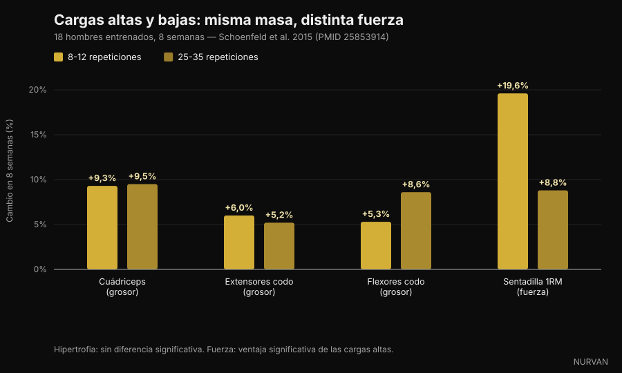
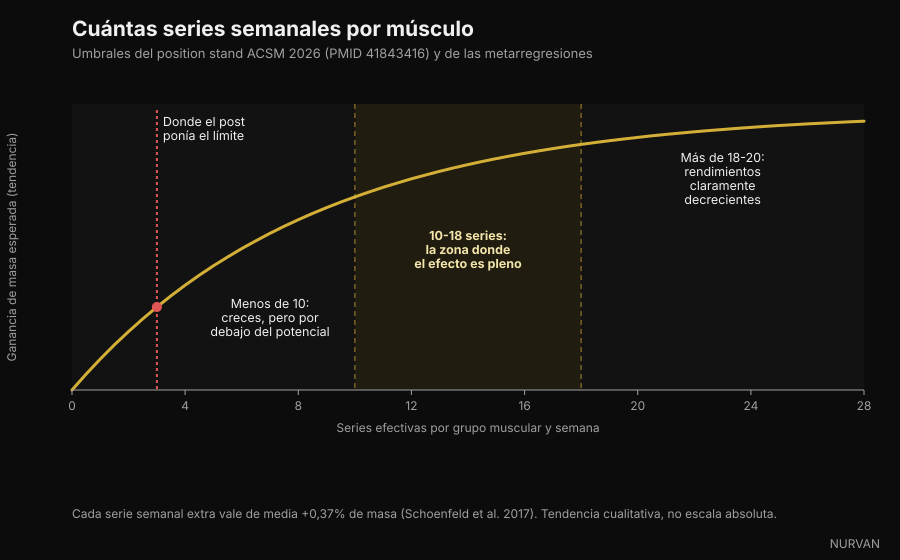

# Cuántas repeticiones necesitas de verdad para ganar masa muscular

En las últimas semanas cuatro carruseles dijeron lo mismo: el rango de 8-12 repeticiones no es mágico y el músculo crece igual a 6 que a 30. En eso tienen razón, y hay una montaña de estudios detrás. El problema es lo que apilaron alrededor — series, descanso y volumen — donde al menos tres afirmaciones no aguantan la verificación. Vamos una por una.

Por [Giammaria Loi](/autore/giammaria-loi) · actualizado el 5 de octubre de 2026

## En resumen

- **El rango de repeticiones importa mucho menos de lo que crees.** El nuevo position stand del American College of Sports Medicine, publicado en marzo de 2026 a partir de 137 revisiones sistemáticas y más de 30.000 participantes, no encuentra diferencias de hipertrofia con cargas del 30% al 100% del máximo. El músculo no sabe contar repeticiones: reconoce el esfuerzo.
- **Para la fuerza máxima la carga sí importa, y mucho.** En el estudio que hizo popular el tema, las series de 25-35 repeticiones produjeron la misma hipertrofia que las de 8-12, pero el máximo en sentadilla subió un 19,6% con cargas altas frente al 8,8% con cargas bajas.
- **"Pasadas tres series solo compras fatiga" es falso.** El ACSM sitúa los rendimientos decrecientes de la hipertrofia en torno a 18-20 series semanales por músculo, no en tres. Una metarregresión de 2026 sobre 67 estudios da una probabilidad del 100% a que más volumen signifique más crecimiento.
- **No hace falta llegar al fallo real.** El position stand es tajante: llevar las series al fallo muscular momentáneo no aumenta las ganancias de fuerza, hipertrofia ni potencia. Bastan 2-3 repeticiones en reserva.
- **Con el descanso los posts simplificaron.** Un ensayo en personas entrenadas favorece los 3 minutos sobre el minuto, pero la síntesis del ACSM no encuentra diferencias sistemáticas de fuerza entre descansos por debajo y por encima del minuto. El "mínimo de 90 segundos" no sale de ningún estudio: es un número inventado en un pie de foto.

*El esfuerzo, y no el número de repeticiones, es la variable a la que responde el músculo. Foto: Cpl. Kenneth Jasik, U.S. Marine Corps, dominio público.*

## De dónde salió la regla del 8-12

Durante tres décadas los manuales enseñaron el "continuo de repeticiones": cargas altas y pocas repeticiones para la fuerza, cargas medias y 8-12 para el tamaño, cargas bajas y muchas para la resistencia muscular. Era una teoría ordenada, construida más sobre la lógica que sobre crecimiento medido.

El problema llegó cuando alguien midió de verdad el grosor muscular con ecografía. La parte central del continuo no apareció.

En 2015 el grupo de Brad Schoenfeld tomó a 18 hombres con experiencia y los dividió en dos: uno hacía 8-12 repeticiones por serie, el otro 25-35, en siete ejercicios, tres veces por semana, durante ocho semanas. Todas las series al fallo.

Al final el aumento de grosor muscular fue prácticamente idéntico: cuádriceps +9,3% frente a +9,5%, extensores del codo +6,0% frente a +5,2%, flexores del codo +5,3% frente a +8,6%, sin diferencias estadísticamente significativas. La fuerza fue otra historia: el máximo en sentadilla subió un 19,6% en el grupo de carga alta y un 8,8% en el de carga baja.

*Carga alta (8-12 repeticiones) frente a carga baja (25-35 repeticiones), 8 semanas — Datos: Schoenfeld et al. 2015. Gráfico de Nurvan.*

Un metaanálisis posterior sobre 21 estudios confirmó el patrón: hipertrofia similar en todo el espectro de cargas, fuerza máxima claramente mejor con cargas altas. Y en marzo de 2026 el position stand del ACSM — síntesis de 137 revisiones sistemáticas — cerró el asunto: la hipertrofia no resultó afectada por cargas entre el 30% y el 100% del máximo.

Así que sí: **el músculo no cuenta**. Pero reconoce el esfuerzo, y esa es la parte que los carruseles tratan mal.

## El esfuerzo cuenta, el fallo no

Esta es la distinción más útil de todo el tema y la que peor viaja por las redes.

Que el esfuerzo tenga que ser alto está fuera de duda: con un peso ligero y una parada lejos del límite no hay estímulo. Una metarregresión de 2024 sobre esta pregunta encontró que la hipertrofia aumenta a medida que las series terminan más cerca del fallo, mientras las ganancias de fuerza se mantienen parecidas en un rango amplio de repeticiones en reserva.

Pero "cerca del fallo" no es "al fallo". El position stand del ACSM es explícito: llevar las series al fallo muscular momentáneo **no** aumenta las ganancias de fuerza, hipertrofia o potencia, y para algunos — mayores, técnica todavía insegura — añade riesgo. El estímulo suficiente se consigue trabajando cerca del fallo, con un objetivo de 2-3 repeticiones en reserva.

El RIR (*repetitions in reserve*, repeticiones en reserva) es cuántas repeticiones más podrías haber hecho antes de parar. RIR 2: dejaste la barra con dos en el depósito.

*Pararse con dos repeticiones en reserva da el mismo estímulo que el fallo, con mucha menos fatiga acumulada. Foto: Senior Airman Haiden Morris, U.S. Air Force, dominio público.*

Esa es la mayor diferencia entre la versión social y la literatura: el carrusel dice "aprieta hasta el límite", la investigación dice "párate dos repeticiones antes y guarda el resto para la serie siguiente".

## "Pasadas tres series solo compras fatiga": el peor error

Uno de los cuatro posts lo escribe así: *una serie dura ya hace casi todo el trabajo, la segunda casi lo duplica, pasada la tercera compras sobre todo fatiga*.

La primera mitad es cierta y conocida: la segunda serie aporta más de lo que sugiere la intuición, y el ACSM recomienda **al menos dos series por ejercicio**. La segunda mitad la contradice todo lo que tenemos.

El position stand sitúa los rendimientos decrecientes de la hipertrofia en torno a **18-20 series semanales** por grupo muscular — no en tres — y señala el volumen como una de las pocas variables que realmente mueven el crecimiento, con efecto positivo a partir de **10 series por músculo y semana**. La metarregresión publicada en 2026 por Pelland y colegas, sobre 67 estudios y 2.058 participantes, asigna una probabilidad posterior del 100% a que más volumen produzca más hipertrofia y más fuerza, con rendimientos decrecientes pero nunca nulos. Una metarregresión anterior cuantificó la ganancia media en **+0,37% de masa por cada serie semanal adicional**.

*Series semanales por grupo muscular: umbrales del position stand ACSM 2026 y de las metarregresiones. Gráfico de Nurvan.*

Ojo con darle la vuelta al error: más volumen no es gratis, los rendimientos bajan y el tiempo de gimnasio es finito. Pero el punto donde deja de compensar está alrededor de 18-20 series semanales por músculo, no en tres series por sesión.

## Descanso: donde más simplificaron los posts

La afirmación a examen: *los descansos largos ganan a los cortos en masa y en fuerza, y 90 segundos es el mínimo*.

Hay una base real. En 2016 un estudio con 21 hombres entrenados comparó un minuto frente a tres minutos de descanso durante ocho semanas, con todo lo demás igual: el grupo de tres minutos ganó más fuerza en sentadilla y press de banca y más grosor en el muslo anterior. Una revisión del mismo año sobre seis estudios concluyó, en cambio, que **los dos enfoques funcionan**, con una posible ventaja del descanso largo en personas ya entrenadas.

La síntesis del ACSM de 2026, que mira el conjunto de las revisiones, es aún más cauta: la fuerza **no** resultó afectada por descansos por debajo frente a por encima del minuto, y los datos de hipertrofia se juzgaron insuficientes para concluir.

¿Y el "mínimo de 90 segundos"? No aparece en ninguno de los trabajos citados. Es un número elegido en un pie de foto.

El motivo práctico para descansar más sigue en pie y no necesita estudios de hipertrofia: si descansas poco, en la serie siguiente levantas menos o haces menos repeticiones, y acumulas menos trabajo de calidad. El descanso no es mágico: es lo que te permite ejecutar bien la serie que viene.

## Qué dice realmente la investigación

**"De 6 a 30 repeticiones se gana músculo igual, si entrenas cerca del fallo."** → **Confirmado.** Schoenfeld 2015 sobre 25-35 frente a 8-12 repeticiones, el metaanálisis de 2017 sobre 21 estudios y el position stand ACSM 2026 sobre cargas del 30% al 100% del máximo.

**"Por debajo de 9 repeticiones vive la fuerza."** → **Confirmado.** La fuerza máxima mejora más con cargas altas, y el ACSM describe una dosis-respuesta con la carga, desde el 80% del máximo en adelante.

**"Una serie dura hace casi todo; pasadas tres compras fatiga."** → **Desmentido.** Dos series por ejercicio son el mínimo recomendado, los rendimientos decrecientes de la hipertrofia llegan en torno a 18-20 series semanales por músculo, y la probabilidad de que más volumen produzca más crecimiento se estima en el 100% en la metarregresión de 2026.

**"Los descansos largos ganan a los cortos en masa y fuerza; 90 segundos es el mínimo."** → **Hay que matizar.** Un ensayo en personas entrenadas favorece los 3 minutos, una revisión dice que ambos funcionan y la síntesis del ACSM no encuentra diferencias de fuerza entre menos y más de un minuto. El umbral de 90 segundos no tiene fuente.

**"De 10 a 20 series duras por músculo y semana es el rango que te hace crecer."** → **Hay que matizar.** El límite inferior coincide con el ACSM (efecto positivo a partir de 10 series), pero 20 no es un techo: es donde las ganancias empiezan a costar mucho más.

**"Cerca del fallo es la clave."** → **Hay que matizar.** La hipertrofia mejora al acercarte al fallo, pero llegar no es necesario: 2-3 repeticiones en reserva dan el mismo resultado con menos fatiga y menos riesgo.

**"La NSCA ha actualizado sus guías de hipertrofia."** → **No verificable.** No encontramos ningún documento primario de la NSCA que confirme las cifras citadas en el post. La actualización verificable de 2026 es el position stand del ACSM, que sustituye al de 2009.

**La cita "PMID 7928218" como estudio de 2016 sobre series de 4 repeticiones.** → **Desmentido.** Ese identificador corresponde a un trabajo de 1994 sobre medios de contraste con gadolinio publicado en *Investigative Radiology*. No tiene nada que ver con el entrenamiento de fuerza. Es el recordatorio más útil de este artículo: un PMID en un pie de foto no es una verificación hasta que alguien lo abre.

## Cómo aplicarlo

Traducido a un programa, lo que la investigación sostiene es más simple de lo que parece.

*La carga se elige por el esfuerzo que produce, no por el número escrito en la hoja. Foto: Nenad Stojkovic, Wikimedia Commons, CC BY 2.0.*

1. **Elige el rango por ejercicio, no por dogma.** Básicos pesados a 5-10 repeticiones (menos riesgo técnico, más fuerza); aislamientos a 10-20 (menos estrés articular, más fácil llegar al límite con seguridad). Es una decisión de eficiencia, no de fisiología.
2. **Apunta a 2-3 repeticiones en reserva.** No al fallo. Si quieres vaciar el depósito en la última serie de un ejercicio, hazlo ahí y no en cada serie de la sesión.
3. **Cuenta el volumen por músculo, no por ejercicio.** Empieza con 10 series semanales por grupo muscular repartidas en al menos dos sesiones, y sube poco a poco hacia 15-20 solo si recuperas bien y la progresión continúa. La respuesta al volumen extra varía bastante de persona a persona: lo vimos en el artículo sobre [respondedores altos y bajos](/es/blog/genetica-high-low-responders).
4. **Descansa lo suficiente para ejecutar bien la serie siguiente.** En los básicos pesados eso suele significar 2-3 minutos; en los aislamientos muchas veces bastan 60-90 segundos. Si la serie siguiente cae tres repeticiones, descansaste poco.
5. **Progresa en doble progresión.** Quédate en tu rango, suma una repetición cuando puedas y, cuando llegues al tope del rango, aumenta la carga y vuelve a empezar por abajo. Ese es el motor, y en esto los posts acertaron.
6. **Registra.** Sin un registro de carga, repeticiones y RIR no sabes si progresas o solo repites. Casi todo el mundo sobreestima su volumen semanal: contar las series por grupo muscular suele ser una sorpresa.

Estos son rangos observados en estudios, no una prescripción individual. Si tienes alguna patología, una lesión en curso o sigues indicaciones médicas, habla con tu médico o con un profesional cualificado antes de cambiar tu programa.

> ### Nurvan — las series de la semana las cuenta la app, no tu memoria
>
> Nurvan registra carga, repeticiones y RIR de cada serie y te muestra cuántas series duras has acumulado de verdad por grupo muscular esta semana, así sabes si estás por debajo de 10 o ya pasaste de 20. Las series de calentamiento se proponen automáticamente y quedan fuera del recuento de series efectivas, y la progresión de cargas se lee en el tiempo, no de memoria.
>
> **[Prueba Nurvan](https://nurvan.app)**

## Preguntas frecuentes

**¿Cuántas repeticiones hay que hacer para ganar masa muscular?**
Cualquier número entre 5 y 30 aproximadamente, siempre que la serie termine cerca de tu límite. El position stand ACSM 2026 no encuentra diferencias de hipertrofia con cargas del 30% al 100% del máximo. Por practicidad: 5-10 repeticiones en los básicos, 10-20 en los aislamientos.

**¿Cuántas series por músculo a la semana necesito de verdad?**
El efecto positivo sobre la hipertrofia aparece a partir de unas 10 series semanales por grupo muscular, con rendimientos que empiezan a bajar en torno a 18-20. Quien empieza de cero consigue mucho incluso con 4-6 series semanales bien hechas.

**¿Tengo que llegar al fallo en cada serie?**
No. El position stand del ACSM dice de forma explícita que llegar al fallo muscular momentáneo no aumenta las ganancias de fuerza, hipertrofia o potencia. Pararse con 2-3 repeticiones en reserva es suficiente y cuesta mucha menos fatiga.

**¿Cuánto hay que descansar entre series?**
Lo suficiente para ejecutar bien la serie siguiente: normalmente 2-3 minutos en los multiarticulares pesados y 60-90 segundos en los aislamientos. Los estudios disponibles no muestran un mínimo universal, y el "mínimo de 90 segundos" que circula por redes no tiene fuente.

**¿Entrenar con poco peso y muchas repeticiones es igual que levantar pesado?**
Para la masa muscular sí, si llegas cerca de tu límite. Para la fuerza máxima no: ahí las cargas altas ganan con claridad, y las series de 25-35 repeticiones son además mucho más largas y desagradables.

## Lee también

- [Proteínas en definición: cuántas necesitas de verdad](/es/blog/proteinas-en-definicion) — la palanca nutricional que protege el músculo cuando recortas calorías.
- [Mr. Olympia 2026: resultados y qué nos enseñan](/es/blog/mr-olympia-2026-resultados-nick-walker) — qué dice el escenario más grande del deporte sobre volumen y recuperación.
- [Low responder: cuánto pesa la genética en tus músculos](/es/blog/genetica-high-low-responders) — por qué el mismo volumen da resultados distintos a personas distintas.

## Fuentes

1. Currier BS, D'Souza AC, Fiatarone Singh MA, Lowisz CV, Rawson ES, Schoenfeld BJ, Smith-Ryan AE, Steen JP, Thomas GA, Triplett NT, Washington TA, Werner TJ, Phillips SM, 2026. *American College of Sports Medicine Position Stand. Resistance Training Prescription for Muscle Function, Hypertrophy, and Physical Performance in Healthy Adults: An Overview of Reviews.* Medicine & Science in Sports & Exercise 58(4):851-872. PMID 41843416 — [DOI](https://doi.org/10.1249/MSS.0000000000003897)
2. Pelland JC, Remmert JF, Robinson ZP, Hinson SR, Zourdos MC, 2026. *The Resistance Training Dose Response: Meta-Regressions Exploring the Effects of Weekly Volume and Frequency on Muscle Hypertrophy and Strength Gains.* Sports Medicine 56(2):481-505. PMID 41343037 — [DOI](https://doi.org/10.1007/s40279-025-02344-w)
3. Robinson ZP, Pelland JC, Remmert JF, Refalo MC, Jukic I, Steele J, Zourdos MC, 2024. *Exploring the Dose-Response Relationship Between Estimated Resistance Training Proximity to Failure, Strength Gain, and Muscle Hypertrophy: A Series of Meta-Regressions.* Sports Medicine 54(9):2209-2231. PMID 38970765 — [DOI](https://doi.org/10.1007/s40279-024-02069-2)
4. Schoenfeld BJ, Peterson MD, Ogborn D, Contreras B, Sonmez GT, 2015. *Effects of Low- vs. High-Load Resistance Training on Muscle Strength and Hypertrophy in Well-Trained Men.* Journal of Strength and Conditioning Research 29(10):2954-2963. PMID 25853914 — [DOI](https://doi.org/10.1519/JSC.0000000000000958)
5. Schoenfeld BJ, Grgic J, Ogborn D, Krieger JW, 2017. *Strength and Hypertrophy Adaptations Between Low- vs. High-Load Resistance Training: A Systematic Review and Meta-analysis.* Journal of Strength and Conditioning Research 31(12):3508-3523. PMID 28834797 — [DOI](https://doi.org/10.1519/JSC.0000000000002200)
6. Schoenfeld BJ, Ogborn D, Krieger JW, 2017. *Dose-response relationship between weekly resistance training volume and increases in muscle mass: A systematic review and meta-analysis.* Journal of Sports Sciences 35(11):1073-1082. PMID 27433992 — [DOI](https://doi.org/10.1080/02640414.2016.1210197)
7. Schoenfeld BJ, Pope ZK, Benik FM, Hester GM, Sellers J, Nooner JL, Schnaiter JA, Bond-Williams KE, Carter AS, Ross CL, Just BL, Henselmans M, Krieger JW, 2016. *Longer Interset Rest Periods Enhance Muscle Strength and Hypertrophy in Resistance-Trained Men.* Journal of Strength and Conditioning Research 30(7):1805-1812. PMID 26605807 — [DOI](https://doi.org/10.1519/JSC.0000000000001272)
8. Grgic J, Lazinica B, Mikulic P, Krieger JW, Schoenfeld BJ, 2017. *The effects of short versus long inter-set rest intervals in resistance training on measures of muscle hypertrophy: A systematic review.* European Journal of Sport Science 17(8):983-993. PMID 28641044 — [DOI](https://doi.org/10.1080/17461391.2017.1340524)
9. Schoenfeld BJ, Grgic J, Van Every DW, Plotkin DL, 2021. *Loading Recommendations for Muscle Strength, Hypertrophy, and Local Endurance: A Re-Examination of the Repetition Continuum.* Sports (Basel) 9(2):32. PMID 33671664 — [DOI](https://doi.org/10.3390/sports9020032)

Fuentes científicas recuperadas de PubMed y verificadas el 5 de octubre de 2026.

Punto de partida: los carruseles de [homebodyys](https://www.instagram.com/p/DdL7UjGG2wg/), [The Movement System](https://www.instagram.com/p/Ddon1AtEWJb/), [Christian Poulos](https://www.instagram.com/p/DdRXFzGkTrY/) e [iwannaburnfat](https://www.instagram.com/p/Dc6T7q5iJCr/), publicados entre el 5 y el 23 de septiembre de 2026. El texto, la estructura, las verificaciones y los gráficos de este artículo son originales.

---

**Giammaria Loi** es el fundador de Nurvan. Entrena con pesas desde 2012, trabaja como entrenador personal y coach certificado FIPE desde 2013 y compite en powerlifting a nivel nacional desde 2018. Cada artículo que firma parte de los estudios científicos y llega a lo que funciona de verdad en el gimnasio.

> Nota: contenido informativo, no sustituye el consejo de un médico o profesional cualificado. Los rangos recogidos vienen de estudios en poblaciones específicas y no constituyen un programa personalizado.
