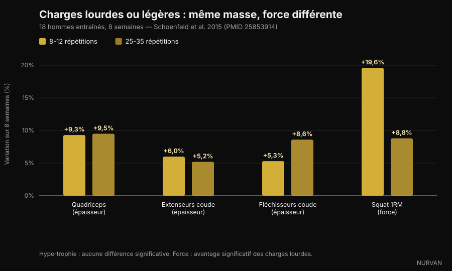
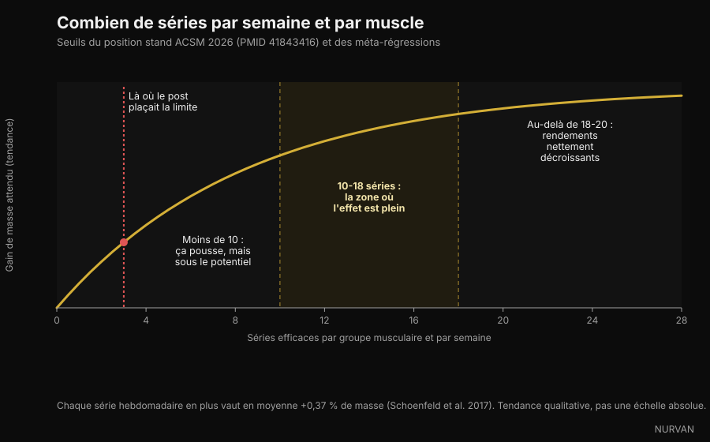

# Combien de répétitions faut-il vraiment pour prendre de la masse

Ces dernières semaines, quatre carrousels ont dit la même chose : la fourchette de 8-12 répétitions n'a rien de magique, et le muscle grossit aussi bien à 6 répétitions qu'à 30. Sur ce point, ils ont raison, et la littérature est massive. Le problème, c'est ce qu'ils ont empilé autour — séries, repos, volume — où au moins trois affirmations ne tiennent pas. On les reprend une par une.

Par [Giammaria Loi](/autore/giammaria-loi) · mis à jour le 5 octobre 2026

## L'essentiel

- **La fourchette de répétitions compte beaucoup moins qu'on ne le croit.** Le nouveau position stand de l'American College of Sports Medicine, publié en mars 2026 sur 137 revues systématiques et plus de 30 000 participants, ne trouve aucune différence d'hypertrophie entre 30 % et 100 % du maximum. Le muscle ne compte pas les répétitions : il lit l'effort.
- **Pour la force maximale, la charge compte, et beaucoup.** Dans l'étude qui a rendu le sujet célèbre, les séries de 25-35 répétitions ont produit autant de muscle que celles de 8-12, mais le squat maximal a progressé de 19,6 % avec les charges lourdes contre 8,8 % avec les légères.
- **« Au-delà de trois séries tu n'achètes que de la fatigue » est faux.** L'ACSM place les rendements décroissants de l'hypertrophie autour de 18-20 séries hebdomadaires par muscle, pas à trois. Une méta-régression de 2026 sur 67 études donne une probabilité de 100 % au lien entre plus de volume et plus de croissance.
- **Inutile d'aller jusqu'à l'échec réel.** Le position stand est net : mener les séries jusqu'à l'échec musculaire momentané n'augmente pas les gains de force, d'hypertrophie ni de puissance. Deux à trois répétitions en réserve suffisent.
- **Sur le repos, les posts ont simplifié.** Un essai chez des pratiquants entraînés favorise les 3 minutes sur une minute, mais la synthèse de l'ACSM ne trouve pas de différence de force entre des repos de moins et de plus d'une minute. Le « minimum de 90 secondes » ne vient d'aucune étude : c'est un chiffre inventé en légende.

*C'est l'effort, et non le nombre de répétitions, que le muscle reconnaît. Photo : Cpl. Kenneth Jasik, U.S. Marine Corps, domaine public.*

## D'où vient la règle du 8-12

Pendant trois décennies, les manuels ont enseigné le « continuum des répétitions » : lourd et peu de répétitions pour la force, moyen et 8-12 pour le volume, léger et beaucoup de répétitions pour l'endurance musculaire. Une théorie bien rangée, bâtie sur la logique plus que sur de la croissance mesurée.

Les ennuis ont commencé quand on a mesuré l'épaisseur musculaire à l'échographie : le milieu du continuum n'est pas apparu.

En 2015, l'équipe de Brad Schoenfeld a réparti 18 hommes expérimentés en deux groupes : l'un faisait 8-12 répétitions par série, l'autre 25-35, sur sept exercices, trois fois par semaine, pendant huit semaines. Toutes les séries jusqu'à l'échec.

Au bout de huit semaines, le gain d'épaisseur musculaire était quasi identique : quadriceps +9,3 % contre +9,5 %, extenseurs du coude +6,0 % contre +5,2 %, fléchisseurs du coude +5,3 % contre +8,6 %, sans différence statistiquement significative. La force, elle, raconte autre chose : le squat maximal a progressé de 19,6 % avec les charges lourdes et de 8,8 % avec les légères.

*Charge lourde (8-12 répétitions) contre charge légère (25-35 répétitions), 8 semaines — Données : Schoenfeld et al. 2015. Graphique Nurvan.*

Une méta-analyse ultérieure sur 21 études a confirmé le tableau : hypertrophie semblable sur tout le spectre de charges, force maximale nettement meilleure avec les charges lourdes. Et en mars 2026, le position stand de l'ACSM — synthèse de 137 revues systématiques — a tranché : l'hypertrophie n'a pas été affectée par des charges de 30 % à 100 % du maximum.

Donc oui : **le muscle ne sait pas compter**. Mais il reconnaît l'effort — et c'est là que les carrousels se trompent.

## L'effort compte, l'échec non

La distinction la plus utile du sujet, et celle qui voyage le plus mal.

Que l'effort doive être élevé ne fait aucun doute : charge légère et arrêt loin de ta limite, pas de stimulus. Une méta-régression de 2024 sur cette question a montré que l'hypertrophie augmente à mesure que les séries finissent plus près de l'échec, tandis que les gains de force restent semblables sur un large intervalle de répétitions en réserve.

Mais « proche de l'échec » n'est pas « jusqu'à l'échec ». Le position stand de l'ACSM est explicite : aller jusqu'à l'échec musculaire momentané **n'augmente pas** les gains de force, d'hypertrophie ou de puissance, et pour certains — pratiquants âgés, technique mal assurée — cela ajoute du risque. Le stimulus suffisant s'obtient près de l'échec, avec un objectif de 2-3 répétitions en réserve.

Le RIR (*repetitions in reserve*, répétitions en réserve) est le nombre de répétitions que tu aurais encore pu faire avant d'arrêter. RIR 2 : tu as reposé la barre avec deux en réserve.

*S'arrêter deux répétitions avant l'échec donne le même stimulus, avec beaucoup moins de fatigue accumulée. Photo : Senior Airman Haiden Morris, U.S. Air Force, domaine public.*

C'est le plus grand écart entre la version réseaux sociaux et la littérature : le carrousel dit « pousse jusqu'à la limite », la recherche dit « arrête-toi deux répétitions avant et garde le reste pour la série suivante ».

## « Au-delà de trois séries tu achètes de la fatigue » : la pire affirmation

L'un des quatre posts l'écrit ainsi : *une série dure fait déjà presque tout le travail, la deuxième double presque le résultat, au-delà de la troisième tu achètes surtout de la fatigue*.

La première moitié est vraie et connue : la deuxième série apporte plus que ne le suggère l'intuition, et l'ACSM recommande **au moins deux séries par exercice**. La seconde moitié est contredite par tout ce dont nous disposons.

Le position stand place les rendements décroissants de l'hypertrophie autour de **18-20 séries hebdomadaires** par groupe musculaire — pas à trois — et cite le volume parmi les rares variables qui pilotent vraiment la croissance, avec un effet positif dès **10 séries par muscle et par semaine**. La méta-régression publiée en 2026 par Pelland et ses collègues, sur 67 études et 2 058 participants, attribue une probabilité postérieure de 100 % au fait que plus de volume produit plus d'hypertrophie et plus de force, avec des rendements décroissants mais jamais nuls. Une méta-régression antérieure chiffrait le gain moyen à **+0,37 % de muscle par série hebdomadaire supplémentaire**.

*Séries hebdomadaires par groupe musculaire : seuils issus du position stand ACSM 2026 et des méta-régressions. Graphique Nurvan.*

Attention à ne pas inverser l'erreur : plus de volume n'est pas gratuit, les rendements diminuent et le temps en salle est limité. Mais le point où cela cesse de payer se situe autour de 18-20 séries hebdomadaires par muscle, pas à trois séries par séance.

## Le repos : là où les posts ont le plus simplifié

L'affirmation à vérifier : *les repos longs battent les repos courts pour le volume comme pour la force, et 90 secondes est le plancher*.

Il y a une base réelle. En 2016, une étude sur 21 hommes entraînés a comparé une minute à trois minutes de repos pendant huit semaines, tout le reste étant identique : le groupe trois minutes a gagné plus de force au squat et au développé couché, et plus d'épaisseur à la cuisse antérieure. Une revue de la même année, sur six études, conclut toutefois que **les deux approches fonctionnent**, avec un avantage possible pour les repos longs chez les pratiquants déjà entraînés.

La synthèse ACSM 2026, qui regarde l'ensemble des revues, est encore plus prudente : la force **n'a pas été** affectée par des repos de moins d'une minute comparés à plus d'une minute, et les données sur l'hypertrophie ont été jugées insuffisantes pour conclure.

Et le « plancher de 90 secondes » ? Il n'apparaît dans aucun des travaux cités. C'est un chiffre choisi en légende.

L'argument pratique pour se reposer plus reste solide et n'a besoin d'aucune étude sur l'hypertrophie : si tu récupères trop peu, la série suivante est plus légère ou plus courte, donc tu accumules moins de travail de qualité. Le repos n'est pas magique : c'est ce qui te permet d'exécuter correctement la série d'après.

## Ce que dit réellement la recherche

**« De 6 à 30 répétitions, on construit autant de muscle, si on s'entraîne près de l'échec. »** → **Confirmé.** Schoenfeld 2015 sur 25-35 contre 8-12 répétitions, la méta-analyse de 2017 sur 21 études et le position stand ACSM 2026 sur des charges de 30 % à 100 % du maximum.

**« C'est en dessous de 9 répétitions que vit la force. »** → **Confirmé.** La force maximale progresse davantage avec des charges lourdes, et l'ACSM décrit une relation dose-réponse avec la charge, dès 80 % du maximum.

**« Une série dure fait presque tout ; au-delà de trois, tu achètes de la fatigue. »** → **Démenti.** Deux séries par exercice sont le minimum recommandé, les rendements décroissants de l'hypertrophie arrivent autour de 18-20 séries hebdomadaires par muscle, et la probabilité que plus de volume produise plus de croissance est estimée à 100 % dans la méta-régression de 2026.

**« Les repos longs battent les repos courts pour le volume et la force ; 90 secondes est le plancher. »** → **À nuancer.** Un essai contrôlé chez des pratiquants entraînés favorise les 3 minutes, une revue conclut que les deux fonctionnent, et la synthèse de l'ACSM ne trouve pas de différence de force sous et au-delà d'une minute. Le seuil de 90 secondes n'a aucune source.

**« 10 à 20 séries dures par muscle et par semaine, c'est l'intervalle qui fait grossir. »** → **À nuancer.** La borne basse correspond à l'ACSM (effet positif dès 10 séries), mais 20 n'est pas un plafond : c'est là que les gains commencent à coûter beaucoup plus cher.

**« Proche de l'échec, voilà la clé. »** → **À nuancer.** L'hypertrophie s'améliore en approchant de l'échec, mais l'atteindre n'est pas nécessaire : 2-3 répétitions en réserve donnent le même résultat avec moins de fatigue et moins de risque.

**« La NSCA a mis à jour ses recommandations sur l'hypertrophie. »** → **Invérifiable.** Nous n'avons trouvé aucun document primaire de la NSCA confirmant les chiffres cités dans le post. La mise à jour vérifiable de 2026 est le position stand de l'ACSM, qui remplace celui de 2009.

**La citation « PMID 7928218 » présentée comme une étude de 2016 sur des séries de 4 répétitions.** → **Démenti.** Cet identifiant correspond à un travail de 1994 sur les produits de contraste au gadolinium, publié dans *Investigative Radiology*. Il n'a rien à voir avec la musculation. C'est le rappel le plus utile de cet article : un PMID en légende n'est pas une vérification tant que personne ne l'ouvre.

## Comment l'appliquer

Traduit en programme, ce que soutient la recherche est plus simple qu'il n'y paraît.

*La charge se choisit d'après l'effort produit, pas d'après le chiffre écrit sur le programme. Photo : Nenad Stojkovic, Wikimedia Commons, CC BY 2.0.*

1. **Choisis la fourchette selon l'exercice, pas selon le dogme.** Mouvements lourds à 5-10 répétitions (moins de risque technique, plus de force) ; isolation à 10-20 (moins de contrainte articulaire, limite plus facile à approcher en sécurité). C'est un choix d'efficacité, pas de physiologie.
2. **Vise 2-3 répétitions en réserve.** Pas l'échec. Si tu veux vider le réservoir, fais-le sur la dernière série d'un exercice, pas sur chaque série de la séance.
3. **Compte le volume par muscle, pas par exercice.** Commence à 10 séries hebdomadaires par groupe musculaire réparties sur au moins deux séances, puis monte progressivement vers 15-20 seulement si la récupération suit et que la progression continue. La réponse à un volume supplémentaire varie beaucoup d'une personne à l'autre : on en a parlé dans l'article sur les [faibles et forts répondeurs](/fr/blog/genetique-faibles-repondeurs).
4. **Repose-toi assez pour bien exécuter la série suivante.** Sur les mouvements lourds, en général 2-3 minutes ; sur l'isolation, 60-90 secondes suffisent souvent. Si la série suivante perd trois répétitions, tu t'es reposé trop peu.
5. **Progresse en double progression.** Reste dans ta fourchette, ajoute une répétition quand tu peux, et quand tu atteins le haut de la fourchette, augmente la charge et repars du bas. C'est le moteur, et sur ce point les posts avaient raison.
6. **Tiens un suivi.** Sans relevé des charges, des répétitions et du RIR, tu ne sais pas si tu progresses ou si tu répètes. Presque tout le monde surestime son volume hebdomadaire : compter les séries par groupe musculaire est souvent une surprise.

Ce sont des intervalles observés dans des études, pas une prescription individuelle. Si tu as une pathologie, une blessure en cours ou que tu suis un avis médical, parles-en à ton médecin ou à un professionnel qualifié avant de modifier ton programme.

> ### Nurvan — tes séries de la semaine, comptées par l'appli et pas par ta mémoire
>
> Nurvan enregistre la charge, les répétitions et le RIR de chaque série et affiche les séries dures réellement accumulées par groupe musculaire sur la semaine : tu sais si tu es sous 10 ou déjà au-delà de 20. Les séries d'échauffement sont proposées automatiquement et restent hors du décompte, et la progression des charges se lit dans le temps plutôt que de mémoire.
>
> **[Essaie Nurvan](https://nurvan.app)**

## Questions fréquentes

**Combien de répétitions faut-il faire pour prendre du muscle ?**
N'importe quel nombre entre environ 5 et 30, à condition que la série finisse près de ta limite. Le position stand ACSM 2026 ne trouve aucune différence d'hypertrophie entre 30 % et 100 % du maximum. Côté pratique : 5-10 répétitions sur les mouvements lourds, 10-20 sur l'isolation.

**Combien de séries par muscle et par semaine faut-il vraiment ?**
L'effet positif sur l'hypertrophie apparaît dès environ 10 séries hebdomadaires par groupe musculaire, avec des rendements qui baissent autour de 18-20. Un débutant obtient déjà beaucoup avec 4-6 séries hebdomadaires bien exécutées.

**Faut-il aller à l'échec à chaque série ?**
Non. Le position stand de l'ACSM est explicite : atteindre l'échec musculaire momentané n'augmente pas les gains de force, d'hypertrophie ou de puissance. S'arrêter à 2-3 répétitions en réserve suffit et coûte bien moins de fatigue.

**Combien de temps faut-il se reposer entre les séries ?**
Assez pour bien exécuter la série suivante : en général 2-3 minutes sur les polyarticulaires lourds, 60-90 secondes sur l'isolation. Les études ne montrent aucun minimum universel, et le « plancher de 90 secondes » qui circule sur les réseaux n'a pas de source.

**S'entraîner léger avec beaucoup de répétitions, c'est pareil que lourd ?**
Pour la prise de muscle, oui, si tu vas près de ta limite. Pour la force maximale, non : les charges lourdes gagnent nettement, et les séries de 25-35 répétitions sont aussi plus longues et nettement plus désagréables.

## À lire aussi

- [Protéines en sèche : combien en faut-il vraiment](/fr/blog/proteines-en-seche) — le levier nutritionnel qui protège le muscle quand tu coupes les calories.
- [Mr. Olympia 2026 : résultats et enseignements](/fr/blog/mr-olympia-2026-resultats-nick-walker) — ce que la plus grande scène du sport dit du volume et de la récupération.
- [Faible répondeur : le poids de la génétique dans le muscle](/fr/blog/genetique-faibles-repondeurs) — pourquoi le même volume donne des résultats différents selon les personnes.

## Sources

1. Currier BS, D'Souza AC, Fiatarone Singh MA, Lowisz CV, Rawson ES, Schoenfeld BJ, Smith-Ryan AE, Steen JP, Thomas GA, Triplett NT, Washington TA, Werner TJ, Phillips SM, 2026. *American College of Sports Medicine Position Stand. Resistance Training Prescription for Muscle Function, Hypertrophy, and Physical Performance in Healthy Adults: An Overview of Reviews.* Medicine & Science in Sports & Exercise 58(4):851-872. PMID 41843416 — [DOI](https://doi.org/10.1249/MSS.0000000000003897)
2. Pelland JC, Remmert JF, Robinson ZP, Hinson SR, Zourdos MC, 2026. *The Resistance Training Dose Response: Meta-Regressions Exploring the Effects of Weekly Volume and Frequency on Muscle Hypertrophy and Strength Gains.* Sports Medicine 56(2):481-505. PMID 41343037 — [DOI](https://doi.org/10.1007/s40279-025-02344-w)
3. Robinson ZP, Pelland JC, Remmert JF, Refalo MC, Jukic I, Steele J, Zourdos MC, 2024. *Exploring the Dose-Response Relationship Between Estimated Resistance Training Proximity to Failure, Strength Gain, and Muscle Hypertrophy: A Series of Meta-Regressions.* Sports Medicine 54(9):2209-2231. PMID 38970765 — [DOI](https://doi.org/10.1007/s40279-024-02069-2)
4. Schoenfeld BJ, Peterson MD, Ogborn D, Contreras B, Sonmez GT, 2015. *Effects of Low- vs. High-Load Resistance Training on Muscle Strength and Hypertrophy in Well-Trained Men.* Journal of Strength and Conditioning Research 29(10):2954-2963. PMID 25853914 — [DOI](https://doi.org/10.1519/JSC.0000000000000958)
5. Schoenfeld BJ, Grgic J, Ogborn D, Krieger JW, 2017. *Strength and Hypertrophy Adaptations Between Low- vs. High-Load Resistance Training: A Systematic Review and Meta-analysis.* Journal of Strength and Conditioning Research 31(12):3508-3523. PMID 28834797 — [DOI](https://doi.org/10.1519/JSC.0000000000002200)
6. Schoenfeld BJ, Ogborn D, Krieger JW, 2017. *Dose-response relationship between weekly resistance training volume and increases in muscle mass: A systematic review and meta-analysis.* Journal of Sports Sciences 35(11):1073-1082. PMID 27433992 — [DOI](https://doi.org/10.1080/02640414.2016.1210197)
7. Schoenfeld BJ, Pope ZK, Benik FM, Hester GM, Sellers J, Nooner JL, Schnaiter JA, Bond-Williams KE, Carter AS, Ross CL, Just BL, Henselmans M, Krieger JW, 2016. *Longer Interset Rest Periods Enhance Muscle Strength and Hypertrophy in Resistance-Trained Men.* Journal of Strength and Conditioning Research 30(7):1805-1812. PMID 26605807 — [DOI](https://doi.org/10.1519/JSC.0000000000001272)
8. Grgic J, Lazinica B, Mikulic P, Krieger JW, Schoenfeld BJ, 2017. *The effects of short versus long inter-set rest intervals in resistance training on measures of muscle hypertrophy: A systematic review.* European Journal of Sport Science 17(8):983-993. PMID 28641044 — [DOI](https://doi.org/10.1080/17461391.2017.1340524)
9. Schoenfeld BJ, Grgic J, Van Every DW, Plotkin DL, 2021. *Loading Recommendations for Muscle Strength, Hypertrophy, and Local Endurance: A Re-Examination of the Repetition Continuum.* Sports (Basel) 9(2):32. PMID 33671664 — [DOI](https://doi.org/10.3390/sports9020032)

Sources scientifiques récupérées sur PubMed et vérifiées le 5 octobre 2026.

Point de départ : les carrousels de [homebodyys](https://www.instagram.com/p/DdL7UjGG2wg/), [The Movement System](https://www.instagram.com/p/Ddon1AtEWJb/), [Christian Poulos](https://www.instagram.com/p/DdRXFzGkTrY/) et [iwannaburnfat](https://www.instagram.com/p/Dc6T7q5iJCr/), publiés entre le 5 et le 23 septembre 2026. Le texte, la structure, les vérifications et les graphiques de cet article sont originaux.

---

**Giammaria Loi** est le fondateur de Nurvan. Il s'entraîne avec des poids depuis 2012, travaille comme entraîneur personnel et coach certifié FIPE depuis 2013 et est compétiteur de powerlifting au niveau national depuis 2018. Chaque article qu'il signe part de la recherche et arrive à ce qui fonctionne vraiment en salle.

> Note : contenu informatif, qui ne remplace pas l'avis d'un médecin ou d'un professionnel qualifié. Les intervalles rapportés proviennent d'études sur des populations spécifiques et ne constituent pas un programme personnalisé.
