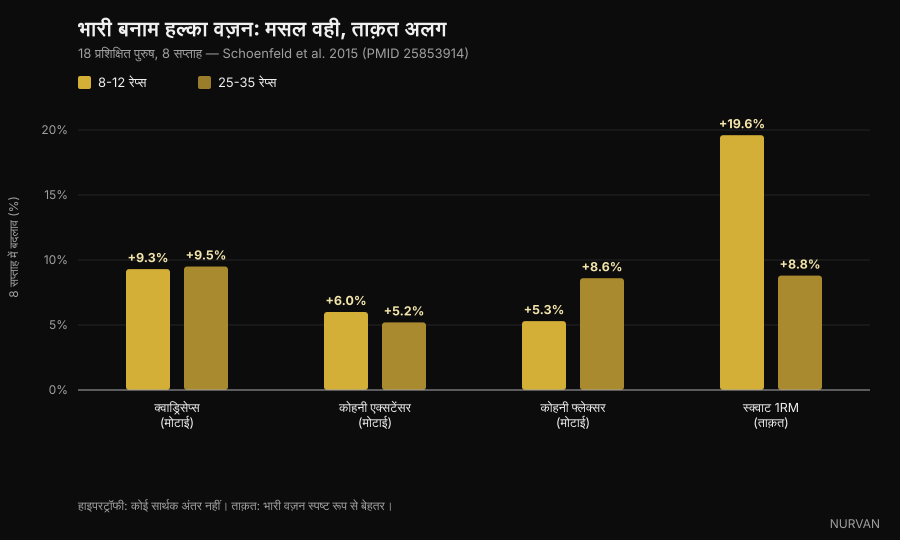
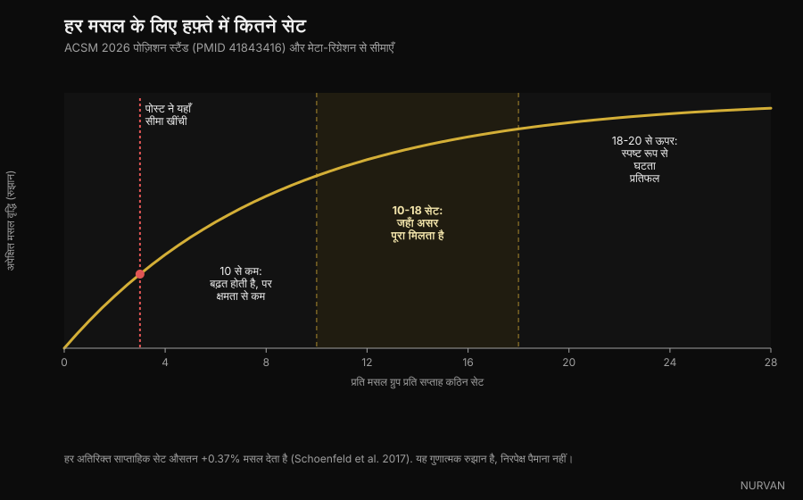

# मसल्स बनाने के लिए असल में कितने रेप्स चाहिए

पिछले कुछ हफ्तों में चार अलग-अलग कैरोसेल ने एक ही बात कही: 8-12 रेप रेंज जादुई नहीं है, मसल 6 रेप्स पर भी बढ़ती है और 30 पर भी। इस एक बात पर वे सही हैं, और इसके पीछे रिसर्च का बड़ा ढेर है। दिक्कत उस सब में है जो उन्होंने इसके आसपास जोड़ दिया — सेट, रेस्ट और वॉल्यूम पर — जहाँ कम से कम तीन दावे जाँच में टूट जाते हैं। उन्हें एक-एक करके देखते हैं।

लेखक: [Giammaria Loi](/autore/giammaria-loi) · 5 अक्टूबर 2026 को अपडेट किया गया

## एक नज़र में

- **रेप रेंज उतनी मायने नहीं रखती जितना लोग मानते हैं।** American College of Sports Medicine की नई पोज़िशन स्टैंड, जो मार्च 2026 में 137 सिस्टेमैटिक रिव्यू और 30,000 से ज़्यादा प्रतिभागियों पर आधारित छपी, 1RM के 30% से 100% तक के लोड में हाइपरट्रॉफी का कोई फ़र्क नहीं पाती। मसल रेप्स नहीं गिनती, वह मेहनत पढ़ती है।
- **मैक्सिमल स्ट्रेंथ के लिए लोड बहुत मायने रखता है।** जिस स्टडी ने इस बहस को मशहूर किया, उसमें प्रति सेट 25-35 रेप्स ने 8-12 जितनी ही मसल बनाई — लेकिन स्क्वाट 1RM भारी लोड के साथ 19.6% बढ़ा और हल्के लोड के साथ 8.8%।
- **"तीन सेट के बाद आप सिर्फ़ थकान खरीद रहे हैं" गलत है।** ACSM हाइपरट्रॉफी के लिए घटते रिटर्न को प्रति मसल हफ्ते के 18-20 सेट के आसपास रखती है, तीन पर नहीं। 67 स्टडी पर 2026 के एक मेटा-रिग्रेशन के मुताबिक़ ज़्यादा वॉल्यूम से ज़्यादा ग्रोथ होने की प्रोबेबिलिटी 100% है।
- **सच्चे फेलियर तक जाना ज़रूरी नहीं है।** पोज़िशन स्टैंड साफ़ कहती है: सेट को मोमेंटरी मस्कुलर फेलियर तक ले जाने से स्ट्रेंथ, हाइपरट्रॉफी या पावर में फ़ायदा नहीं बढ़ता। 2-3 रेप्स रिज़र्व में छोड़ना काफ़ी है।
- **रेस्ट वाला दावा ज़्यादा सरल कर दिया गया।** ट्रेंड लिफ़्टर्स पर एक ट्रायल एक मिनट के मुक़ाबले तीन मिनट को बेहतर बताता है, पर ACSM की समग्र समीक्षा एक मिनट से कम और एक मिनट से ज़्यादा रेस्ट के बीच स्ट्रेंथ में कोई व्यवस्थित फ़र्क नहीं पाती। और "कम से कम 90 सेकंड" किसी स्टडी से नहीं आया — वह कैप्शन में गढ़ा गया नंबर है।

*मसल जिस वेरिएबल पर प्रतिक्रिया देती है वह मेहनत है, रेप्स की गिनती नहीं। फ़ोटो: Cpl. Kenneth Jasik, U.S. Marine Corps, पब्लिक डोमेन।*

## 8-12 का नियम कहाँ से आया

तीन दशकों तक किताबें "रेपिटिशन कॉन्टिनम" पढ़ाती रहीं: स्ट्रेंथ के लिए भारी लोड और कम रेप्स, साइज़ के लिए मीडियम लोड और 8-12 रेप्स, मस्कुलर एंड्योरेंस के लिए हल्का लोड और ज़्यादा रेप्स। यह एक सुव्यवस्थित थ्योरी थी, जो मापी गई ग्रोथ से ज़्यादा तर्क पर बनी थी।

गड़बड़ तब शुरू हुई जब लोगों ने अल्ट्रासाउंड से मसल थिकनेस असल में नापी। इस कॉन्टिनम का बीच का हिस्सा डेटा में दिखा ही नहीं।

2015 में Brad Schoenfeld की अगुवाई वाली एक टीम ने ट्रेनिंग अनुभव वाले 18 पुरुषों को दो समूहों में बाँटा: एक समूह प्रति सेट 8-12 रेप्स करता था, दूसरा 25-35, सात एक्सरसाइज़ पर, हफ्ते में तीन बार, आठ हफ्तों तक। हर सेट फेलियर तक।

आठ हफ्तों के बाद मसल थिकनेस की बढ़त लगभग एक जैसी थी: क्वाड्रिसेप्स +9.3% बनाम +9.5%, एल्बो एक्सटेंसर +6.0% बनाम +5.2%, एल्बो फ्लेक्सर +5.3% बनाम +8.6%, और कोई सांख्यिकीय रूप से महत्वपूर्ण अंतर नहीं। स्ट्रेंथ की कहानी अलग थी: स्क्वाट 1RM भारी समूह में 19.6% और हल्के समूह में 8.8% बढ़ा।

*भारी लोड (8-12 रेप्स) बनाम हल्का लोड (25-35 रेप्स), 8 हफ्ते — डेटा: Schoenfeld et al. 2015. Nurvan चार्ट।*

बाद में 21 स्टडी के एक मेटा-एनालिसिस ने यही पैटर्न पक्का किया: लोड के पूरे दायरे में हाइपरट्रॉफी एक जैसी, और भारी लोड के साथ मैक्सिमल स्ट्रेंथ साफ़ तौर पर बेहतर। और मार्च 2026 में ACSM की पोज़िशन स्टैंड — 137 सिस्टेमैटिक रिव्यू का सार — ने मामला तय कर दिया: 1RM के 30% से 100% के बीच कहीं भी लोड से हाइपरट्रॉफी प्रभावित नहीं हुई।

तो हाँ: **मसल गिनती नहीं कर सकती**। लेकिन वह मेहनत पहचानती है, और यही हिस्सा कैरोसेल सबसे खराब तरीक़े से संभालते हैं।

## मेहनत मायने रखती है, फेलियर नहीं

पूरे विषय में यह सबसे काम का फ़र्क है, और सोशल मीडिया पर सबसे बुरी तरह सफ़र करता है।

मेहनत ऊँची होनी चाहिए, इसमें कोई शक नहीं: हल्का वज़न उठाइए और अपनी सीमा से बहुत पहले रुक जाइए, तो कोई स्टिमुलस नहीं मिलता। 2024 के एक मेटा-रिग्रेशन ने ठीक इसी सवाल पर पाया कि सेट जितना फेलियर के नज़दीक ख़त्म होता है, हाइपरट्रॉफी उतनी बढ़ती है, जबकि स्ट्रेंथ का फ़ायदा रिज़र्व रेप्स की एक बड़ी रेंज में लगभग बराबर रहता है।

लेकिन "फेलियर के नज़दीक" का मतलब "फेलियर तक" नहीं है। ACSM की पोज़िशन स्टैंड साफ़ है: सेट को मोमेंटरी मस्कुलर फेलियर तक ले जाने से स्ट्रेंथ, हाइपरट्रॉफी या पावर का फ़ायदा **नहीं** बढ़ता, और कुछ लोगों के लिए — बड़ी उम्र के ट्रेनी, या जिनकी टेक्नीक अभी पक्की नहीं है — यह जोखिम जोड़ता है। पर्याप्त स्टिमुलस फेलियर के नज़दीक काम करने से मिल जाता है, और लक्ष्य 2-3 रिज़र्व रेप्स रखना चाहिए।

RIR (reps in reserve) का मतलब सिर्फ़ इतना है कि रुकने से पहले आप कितने रेप्स और कर सकते थे। RIR 2 का मतलब है कि आपने सेट ख़त्म किया और टैंक में दो रेप्स बचे थे।

*दो रेप्स पहले रुकने से स्टिमुलस वही मिलता है, और जमा होने वाली थकान बहुत कम होती है। फ़ोटो: Senior Airman Haiden Morris, U.S. Air Force, पब्लिक डोमेन।*

सोशल वर्जन और रिसर्च के बीच यही सबसे बड़ा प्रैक्टिकल फ़ासला है: कैरोसेल कहता है सीमा तक धकेलो, रिसर्च कहती है सीमा से दो रेप्स पहले तक धकेलो और बाकी अगले सेट के लिए बचा लो।

## "तीन सेट के बाद आप थकान खरीद रहे हैं" — सबसे कमज़ोर दावा

चार पोस्ट में से एक इसे ऐसे कहता है: *एक हार्ड सेट ही ज़्यादातर काम कर देता है, दूसरा उसे लगभग दोगुना करता है, और तीन के बाद आप मुख्य रूप से थकान खरीद रहे हैं।*

पहला आधा हिस्सा सही और जाना-पहचाना है: दूसरा सेट अंदाज़े से ज़्यादा जोड़ता है, और ACSM वाक़ई **प्रति एक्सरसाइज़ कम से कम दो सेट** की सिफ़ारिश करती है। दूसरा आधा हिस्सा हमारे पास मौजूद हर सबूत के खिलाफ़ है।

पोज़िशन स्टैंड हाइपरट्रॉफी के घटते रिटर्न को प्रति मसल ग्रुप **हफ्ते के 18-20 सेट** के आसपास रखती है — तीन पर नहीं — और वॉल्यूम को उन गिने-चुने वेरिएबल्स में गिनती है जो ग्रोथ को असल में चलाते हैं, जिसमें **प्रति मसल हफ्ते के 10 सेट** से ऊपर सकारात्मक असर दिखता है। Pelland और सहयोगियों का 2026 में छपा मेटा-रिग्रेशन, जो 67 स्टडी और 2,058 प्रतिभागियों को कवर करता है, ज़्यादा वॉल्यूम से ज़्यादा हाइपरट्रॉफी और ज़्यादा स्ट्रेंथ दोनों होने को 100% पोस्टीरियर प्रोबेबिलिटी देता है — रिटर्न घटते हैं, पर अध्ययन की गई रेंज में कभी शून्य नहीं होते। एक पुराने मेटा-रिग्रेशन ने औसत बढ़त **हर अतिरिक्त साप्ताहिक सेट पर +0.37% मसल** आँकी थी।

*प्रति मसल ग्रुप साप्ताहिक सेट: ACSM 2026 पोज़िशन स्टैंड और मेटा-रिग्रेशन से थ्रेशहोल्ड। Nurvan चार्ट।*

पर गलती को उल्टी दिशा में मत पलटिए। ज़्यादा वॉल्यूम मुफ़्त नहीं है: रिटर्न सिकुड़ते हैं, थकान जमा होती है और जिम का समय सीमित है। लेकिन वह बिंदु जहाँ यह फ़ायदा देना बंद करता है प्रति मसल हफ्ते के 18-20 सेट के आसपास है, प्रति सेशन तीन सेट पर नहीं।

## रेस्ट: जहाँ पोस्ट ने सबसे ज़्यादा सरलीकरण किया

जाँच के लिए दावा: *साइज़ और स्ट्रेंथ दोनों के लिए लंबा रेस्ट छोटे रेस्ट से बेहतर है, और 90 सेकंड न्यूनतम सीमा है।*

इसका एक असली आधार है। 2016 में 21 ट्रेंड पुरुषों की एक स्टडी ने बाकी सब कुछ एक जैसा रखते हुए आठ हफ्तों तक एक मिनट बनाम तीन मिनट रेस्ट की तुलना की: तीन मिनट वाले समूह ने स्क्वाट और बेंच में ज़्यादा स्ट्रेंथ और जाँघ के अग्र भाग में ज़्यादा थिकनेस हासिल की। उसी साल छह स्टडी पर आए एक रिव्यू का निष्कर्ष था कि **दोनों तरीक़े काम करते हैं**, और पहले से ट्रेंड लिफ़्टर्स में लंबे रेस्ट का संभावित फ़ायदा है।

2026 की ACSM समीक्षा, जो रिव्यू के पूरे समूह को देखती है, इससे भी सतर्क है: एक मिनट से कम बनाम एक मिनट से ज़्यादा रेस्ट से स्ट्रेंथ प्रभावित **नहीं** हुई, और हाइपरट्रॉफी का डेटा निष्कर्ष निकालने के लिए अपर्याप्त माना गया।

और "90 सेकंड की न्यूनतम सीमा"? वह किसी भी उद्धृत काम में नहीं है। यह कैप्शन में चुना गया नंबर है।

लंबा रेस्ट लेने का प्रैक्टिकल तर्क फिर भी बना रहता है, और उसे किसी हाइपरट्रॉफी स्टडी की ज़रूरत नहीं: बहुत कम रेस्ट लेंगे तो अगला सेट हल्का या छोटा होगा, यानी कुल अच्छा काम कम जमा होगा। रेस्ट कोई जादुई सामग्री नहीं है। वह बस वही चीज़ है जो आपको अगला सेट ठीक से करने देती है।

## रिसर्च असल में क्या कहती है

**"अगर आप फेलियर के नज़दीक ट्रेन करते हैं तो 6 से 30 रेप्स बराबर मसल बनाते हैं।"** → **सही।** 25-35 बनाम 8-12 रेप्स पर Schoenfeld 2015, 21 स्टडी का 2017 का मेटा-एनालिसिस, और 1RM के 30% से 100% तक के लोड पर ACSM 2026 पोज़िशन स्टैंड।

**"9 रेप्स से नीचे स्ट्रेंथ रहती है।"** → **सही।** मैक्सिमल स्ट्रेंथ भारी लोड के साथ ज़्यादा सुधरती है, और ACSM लोड के साथ डोज़-रिस्पॉन्स रिपोर्ट करती है, जिसमें 1RM के 80% या उससे ऊपर के लोड का हवाला है।

**"एक हार्ड सेट ज़्यादातर काम कर देता है; तीन के बाद आप थकान खरीद रहे हैं।"** → **गलत।** प्रति एक्सरसाइज़ दो सेट सिफ़ारिश की गई न्यूनतम सीमा है, हाइपरट्रॉफी के घटते रिटर्न प्रति मसल हफ्ते के 18-20 सेट के आसपास आते हैं, और ज़्यादा वॉल्यूम से ज़्यादा ग्रोथ होने की प्रोबेबिलिटी 2026 के मेटा-रिग्रेशन में 100% आँकी गई है।

**"साइज़ और स्ट्रेंथ के लिए लंबा रेस्ट बेहतर है; 90 सेकंड न्यूनतम है।"** → **बारीकी चाहिए।** ट्रेंड लिफ़्टर्स पर एक RCT तीन मिनट के पक्ष में है, एक रिव्यू कहता है दोनों काम करते हैं, और ACSM की समीक्षा एक मिनट से कम और ज़्यादा के बीच स्ट्रेंथ का फ़र्क नहीं पाती। 90 सेकंड की सीमा का कोई स्रोत नहीं है।

**"हफ्ते में प्रति मसल 10 से 20 हार्ड सेट वही रेंज है जो आपको बढ़ाती है।"** → **बारीकी चाहिए।** निचली सीमा ACSM से मेल खाती है (10 सेट से ऊपर सकारात्मक असर), लेकिन 20 कोई छत नहीं है — वह वह बिंदु है जहाँ फ़ायदे की कीमत बहुत बढ़ने लगती है।

**"फेलियर के नज़दीक जाना ही कुंजी है।"** → **बारीकी चाहिए।** फेलियर के पास पहुँचने पर हाइपरट्रॉफी वाक़ई सुधरती है, पर वहाँ पहुँचना ज़रूरी नहीं: 2-3 रिज़र्व रेप्स वही नतीजा देते हैं, कम थकान और कम जोखिम के साथ।

**"NSCA ने अपनी हाइपरट्रॉफी गाइडलाइन अपडेट कर दी हैं।"** → **सत्यापित नहीं।** पोस्ट में दिए आँकड़ों की पुष्टि करने वाला कोई प्राथमिक NSCA दस्तावेज़ हमें नहीं मिला। 2026 का सत्यापन-योग्य अपडेट ACSM पोज़िशन स्टैंड है, जो 2009 वाली का स्थान लेती है।

**4-रेप सेट पर 2016 की स्टडी के तौर पर दिया गया "PMID 7928218" का हवाला।** → **गलत।** यह आइडेंटिफ़ायर *Investigative Radiology* में छपे 1994 के एक पेपर का है, जो गैडोलिनियम कॉन्ट्रास्ट एजेंट पर है। उसका रेज़िस्टेंस ट्रेनिंग से कोई लेना-देना नहीं। यह इस लेख की सबसे काम की याद दिलाने वाली बात है: कैप्शन में लिखा PMID तब तक जाँच नहीं है जब तक कोई उसे खोलकर न देखे।

## इसे कैसे लागू करें

प्रोग्राम में बदलने पर, रिसर्च जो समर्थन करती है वह सुनने से ज़्यादा आसान है।

*लोड उस मेहनत के हिसाब से चुनिए जो वह पैदा करता है, प्लान में लिखे नंबर के हिसाब से नहीं। फ़ोटो: Nenad Stojkovic, Wikimedia Commons, CC BY 2.0।*

1. **रेप रेंज एक्सरसाइज़ के हिसाब से चुनिए, किसी नियम के हिसाब से नहीं।** भारी कंपाउंड 5-10 रेप्स पर (टेक्निकल जोखिम कम, स्ट्रेंथ ज़्यादा); आइसोलेशन 10-20 पर (जोड़ों पर दबाव कम, अपनी सीमा तक सुरक्षित पहुँचना आसान)। यह कार्यक्षमता का चुनाव है, फ़िज़ियोलॉजी का नहीं।
2. **2-3 रिज़र्व रेप्स का लक्ष्य रखिए।** फेलियर का नहीं। किसी एक्सरसाइज़ के आख़िरी सेट में टैंक खाली करना चाहते हैं तो वहीं कीजिए — सेशन के हर सेट में नहीं।
3. **वॉल्यूम प्रति मसल गिनिए, प्रति एक्सरसाइज़ नहीं।** प्रति मसल ग्रुप हफ्ते के 10 सेट से शुरू कीजिए, कम से कम दो सेशन में बाँटकर, और 15-20 की तरफ़ धीरे-धीरे तभी बढ़िए जब रिकवरी टिकी रहे और प्रगति जारी रहे। जोड़े गए वॉल्यूम पर आप कितनी तेज़ी से रिस्पॉन्ड करते हैं, यह लोगों के बीच बहुत बदलता है — इस पर हमने [लो रेस्पॉन्डर वाले लेख](/hi/blog/genetics-muscle-low-responders) में बात की है।
4. **इतना रेस्ट लीजिए कि अगला सेट अच्छा हो।** भारी कंपाउंड पर इसका मतलब आम तौर पर 2-3 मिनट है; आइसोलेशन पर 60-90 सेकंड अक्सर काफ़ी हैं। अगर अगला सेट तीन रेप्स गिर जाता है, तो आपने कम रेस्ट लिया।
5. **डबल प्रोग्रेशन से आगे बढ़िए।** अपनी रेंज में रहिए, जब हो सके एक रेप जोड़िए, और जब रेंज की ऊपरी सीमा छू लें तो लोड बढ़ाकर नीचे से फिर शुरू कीजिए। यही इंजन है, और इस बात पर पोस्ट सही थीं।
6. **रिकॉर्ड रखिए।** लोड, रेप्स और RIR का लॉग न हो तो आपको पता नहीं चलता कि आप आगे बढ़ रहे हैं या वही दोहरा रहे हैं। लगभग हर कोई अपने साप्ताहिक वॉल्यूम को ज़्यादा आँकता है — प्रति मसल ग्रुप सेट गिनना आम तौर पर एक झटका होता है।

ये स्टडी में देखी गई रेंज हैं, किसी व्यक्ति के लिए प्रिस्क्रिप्शन नहीं। अगर आपको कोई मेडिकल कंडीशन है, कोई चालू चोट है, या आप किसी मेडिकल सलाह का पालन कर रहे हैं, तो प्रोग्राम बदलने से पहले अपने डॉक्टर या किसी योग्य प्रोफ़ेशनल से बात कीजिए।

> ### Nurvan — हफ्ते के सेट गिनने का काम ऐप को दीजिए, याद्दाश्त को नहीं
>
> Nurvan हर सेट का लोड, रेप्स और RIR रिकॉर्ड करता है और दिखाता है कि इस हफ्ते हर मसल ग्रुप के लिए असल में कितने हार्ड सेट जमा हुए — यानी आप 10 से नीचे हैं या 20 के पार। वॉर्म-अप सेट अपने आप सुझाए जाते हैं और वर्किंग सेट की गिनती से बाहर रहते हैं, और लोड की प्रगति याद्दाश्त के बजाय समय के साथ पढ़ी जा सकती है।
>
> **[Nurvan आज़माएँ](https://nurvan.app)**

## अक्सर पूछे जाने वाले सवाल

**मसल्स बनाने के लिए कितने रेप्स करने चाहिए?**
लगभग 5 से 30 के बीच कुछ भी, बस सेट आपकी सीमा के नज़दीक ख़त्म होना चाहिए। ACSM 2026 पोज़िशन स्टैंड 1RM के 30% से 100% तक के लोड में हाइपरट्रॉफी का कोई फ़र्क नहीं पाती। प्रैक्टिकल तौर पर: कंपाउंड पर 5-10 रेप्स, आइसोलेशन पर 10-20।

**हफ्ते में एक मसल के कितने सेट असल में चाहिए?**
हाइपरट्रॉफी पर सकारात्मक असर प्रति मसल ग्रुप हफ्ते के लगभग 10 सेट से ऊपर दिखने लगता है, और रिटर्न 18-20 के आसपास सिकुड़ने लगते हैं। शुरुआती लोगों को हफ्ते में 4-6 ठीक से किए गए सेट से भी बहुत कुछ मिल जाता है।

**क्या हर सेट फेलियर तक ले जाना ज़रूरी है?**
नहीं। ACSM पोज़िशन स्टैंड साफ़ कहती है कि मोमेंटरी मस्कुलर फेलियर तक पहुँचने से स्ट्रेंथ, हाइपरट्रॉफी या पावर का फ़ायदा नहीं बढ़ता। 2-3 रिज़र्व रेप्स पर रुकना काफ़ी है और थकान बहुत कम पड़ती है।

**सेट्स के बीच कितना रेस्ट लेना चाहिए?**
इतना कि अगला सेट अच्छा हो: भारी कंपाउंड पर आम तौर पर 2-3 मिनट, आइसोलेशन पर 60-90 सेकंड। उपलब्ध स्टडी कोई सार्वभौमिक न्यूनतम सीमा नहीं दिखाती, और सोशल मीडिया पर घूम रही "90 सेकंड" वाली सीमा का कोई स्रोत नहीं है।

**हल्के वज़न और ज़्यादा रेप्स वाली ट्रेनिंग भारी उठाने जैसी ही है?**
मसल ग्रोथ के लिए हाँ, अगर आप अपनी सीमा के नज़दीक जाते हैं। मैक्सिमल स्ट्रेंथ के लिए नहीं: वहाँ भारी लोड साफ़ जीतते हैं, और 25-35 रेप्स वाले सेट बहुत लंबे और कहीं ज़्यादा तकलीफ़देह भी होते हैं।

## यह भी पढ़ें

- [कटिंग में प्रोटीन: असल में कितना चाहिए](/hi/blog/protein-for-fat-loss-phase) — वह न्यूट्रिशन लीवर जो कैलोरी डेफ़िसिट में मसल बचाती है।
- [Mr. Olympia 2026: नतीजे और उनसे मिली सीख](/hi/blog/mr-olympia-2026-results-hindi) — वॉल्यूम और रिकवरी पर इस खेल का सबसे बड़ा मंच क्या कहता है।
- [लो रेस्पॉन्डर: मांसपेशियों के विकास में जेनेटिक्स की कितनी भूमिका है](/hi/blog/genetics-muscle-low-responders) — वही वॉल्यूम अलग-अलग लोगों में अलग नतीजे क्यों देता है।

## स्रोत

1. Currier BS, D'Souza AC, Fiatarone Singh MA, Lowisz CV, Rawson ES, Schoenfeld BJ, Smith-Ryan AE, Steen JP, Thomas GA, Triplett NT, Washington TA, Werner TJ, Phillips SM, 2026. *American College of Sports Medicine Position Stand. Resistance Training Prescription for Muscle Function, Hypertrophy, and Physical Performance in Healthy Adults: An Overview of Reviews.* Medicine & Science in Sports & Exercise 58(4):851-872. PMID 41843416 — [DOI](https://doi.org/10.1249/MSS.0000000000003897)
2. Pelland JC, Remmert JF, Robinson ZP, Hinson SR, Zourdos MC, 2026. *The Resistance Training Dose Response: Meta-Regressions Exploring the Effects of Weekly Volume and Frequency on Muscle Hypertrophy and Strength Gains.* Sports Medicine 56(2):481-505. PMID 41343037 — [DOI](https://doi.org/10.1007/s40279-025-02344-w)
3. Robinson ZP, Pelland JC, Remmert JF, Refalo MC, Jukic I, Steele J, Zourdos MC, 2024. *Exploring the Dose-Response Relationship Between Estimated Resistance Training Proximity to Failure, Strength Gain, and Muscle Hypertrophy: A Series of Meta-Regressions.* Sports Medicine 54(9):2209-2231. PMID 38970765 — [DOI](https://doi.org/10.1007/s40279-024-02069-2)
4. Schoenfeld BJ, Peterson MD, Ogborn D, Contreras B, Sonmez GT, 2015. *Effects of Low- vs. High-Load Resistance Training on Muscle Strength and Hypertrophy in Well-Trained Men.* Journal of Strength and Conditioning Research 29(10):2954-2963. PMID 25853914 — [DOI](https://doi.org/10.1519/JSC.0000000000000958)
5. Schoenfeld BJ, Grgic J, Ogborn D, Krieger JW, 2017. *Strength and Hypertrophy Adaptations Between Low- vs. High-Load Resistance Training: A Systematic Review and Meta-analysis.* Journal of Strength and Conditioning Research 31(12):3508-3523. PMID 28834797 — [DOI](https://doi.org/10.1519/JSC.0000000000002200)
6. Schoenfeld BJ, Ogborn D, Krieger JW, 2017. *Dose-response relationship between weekly resistance training volume and increases in muscle mass: A systematic review and meta-analysis.* Journal of Sports Sciences 35(11):1073-1082. PMID 27433992 — [DOI](https://doi.org/10.1080/02640414.2016.1210197)
7. Schoenfeld BJ, Pope ZK, Benik FM, Hester GM, Sellers J, Nooner JL, Schnaiter JA, Bond-Williams KE, Carter AS, Ross CL, Just BL, Henselmans M, Krieger JW, 2016. *Longer Interset Rest Periods Enhance Muscle Strength and Hypertrophy in Resistance-Trained Men.* Journal of Strength and Conditioning Research 30(7):1805-1812. PMID 26605807 — [DOI](https://doi.org/10.1519/JSC.0000000000001272)
8. Grgic J, Lazinica B, Mikulic P, Krieger JW, Schoenfeld BJ, 2017. *The effects of short versus long inter-set rest intervals in resistance training on measures of muscle hypertrophy: A systematic review.* European Journal of Sport Science 17(8):983-993. PMID 28641044 — [DOI](https://doi.org/10.1080/17461391.2017.1340524)
9. Schoenfeld BJ, Grgic J, Van Every DW, Plotkin DL, 2021. *Loading Recommendations for Muscle Strength, Hypertrophy, and Local Endurance: A Re-Examination of the Repetition Continuum.* Sports (Basel) 9(2):32. PMID 33671664 — [DOI](https://doi.org/10.3390/sports9020032)

वैज्ञानिक स्रोत PubMed से लिए गए और 5 अक्टूबर 2026 को सत्यापित किए गए।

शुरुआती बिंदु: [homebodyys](https://www.instagram.com/p/DdL7UjGG2wg/), [The Movement System](https://www.instagram.com/p/Ddon1AtEWJb/), [Christian Poulos](https://www.instagram.com/p/DdRXFzGkTrY/) और [iwannaburnfat](https://www.instagram.com/p/Dc6T7q5iJCr/) के कैरोसेल, जो 5 और 23 सितंबर 2026 के बीच छपे। इस लेख का टेक्स्ट, ढाँचा, फैक्ट-चेकिंग और चार्ट मौलिक हैं।

---

**Giammaria Loi** Nurvan के फ़ाउंडर हैं। वे 2012 से वेट ट्रेनिंग कर रहे हैं, 2013 से FIPE-सर्टिफ़ाइड पर्सनल ट्रेनर और कोच हैं, और 2018 से नैशनल लेवल पर पावरलिफ़्टिंग में हिस्सा लेते हैं।
उनका हर लेख रिसर्च से शुरू होता है और इस पर ख़त्म होता है कि जिम में असल में क्या काम करता है।

> नोट: यह जानकारी देने वाली सामग्री है, किसी डॉक्टर या योग्य प्रोफ़ेशनल की सलाह का विकल्प नहीं। बताई गई रेंज विशिष्ट समूहों पर हुई स्टडी से हैं और कोई व्यक्तिगत प्रोग्राम नहीं हैं।
