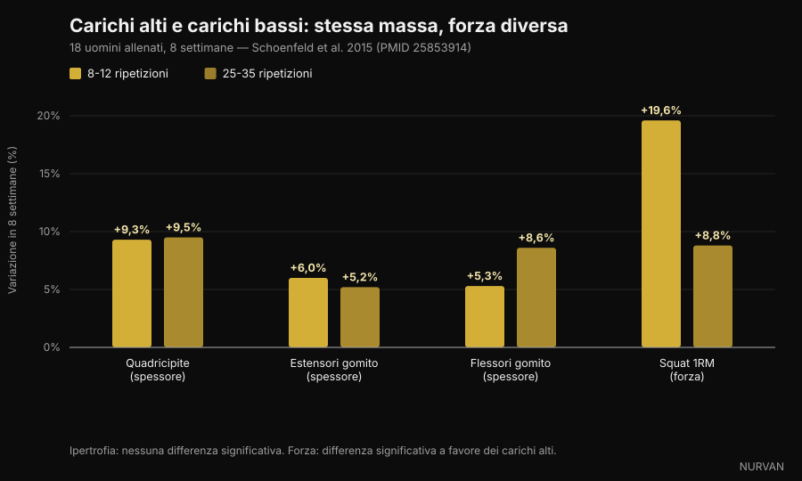
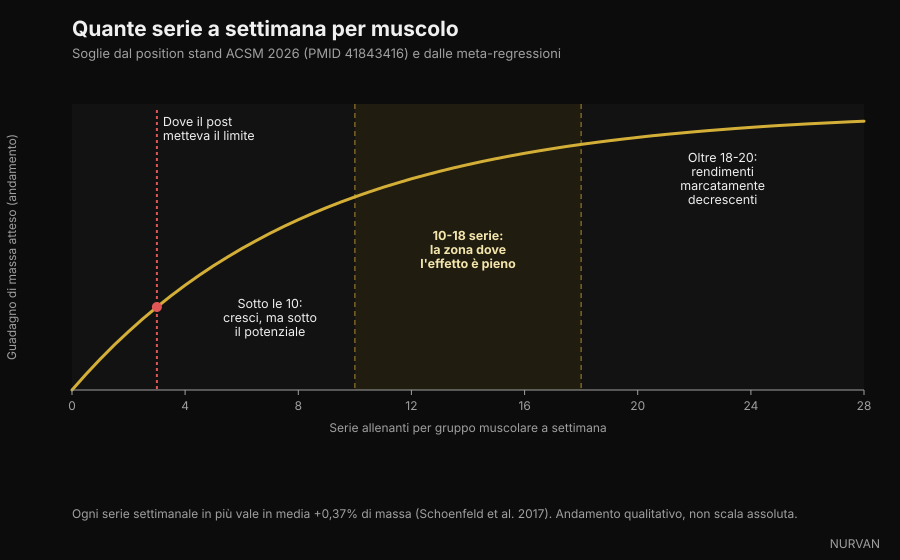

# Quante ripetizioni servono per la massa muscolare

Negli ultimi giorni quattro caroselli diversi hanno detto la stessa cosa: il range 8-12 ripetizioni non è magico, il muscolo cresce anche a 6 come a 30. Su quel punto hanno ragione, e c'è una montagna di studi a sostenerlo. Il problema è tutto il resto che hanno aggiunto intorno — su serie, recupero e volume — dove almeno tre affermazioni non reggono alla verifica. Qui le separiamo una per una.

Di [Giammaria Loi](/autore/giammaria-loi) · aggiornato il 5 ottobre 2026

## In breve

- **Il range di ripetizioni conta molto meno di quanto si creda.** Il nuovo position stand dell'American College of Sports Medicine, pubblicato a marzo 2026 su 137 revisioni sistematiche e oltre 30.000 partecipanti, non trova differenze di ipertrofia tra carichi dal 30% al 100% del massimale. Il muscolo non conta le ripetizioni: conta lo sforzo.
- **Per la forza massimale il carico invece conta, e molto.** Nello studio che ha reso popolare questo tema, con 25-35 ripetizioni per serie l'ipertrofia era la stessa dell'8-12, ma lo squat massimale saliva del 19,6% con i carichi alti contro l'8,8% con i carichi bassi.
- **"Oltre tre serie compri solo fatica" è falso.** L'ACSM colloca i rendimenti decrescenti dell'ipertrofia intorno alle 18-20 serie settimanali per muscolo, non a tre. Una meta-regressione del 2026 su 67 studi dà una probabilità del 100% che più volume significhi più crescita.
- **Non serve arrivare al cedimento vero.** Il position stand è esplicito: portare le serie al cedimento muscolare momentaneo non aumenta i guadagni di forza, ipertrofia e potenza. Bastano 2-3 ripetizioni di riserva.
- **Sul recupero i post hanno semplificato.** Un singolo studio su atleti allenati favorisce i 3 minuti sul minuto singolo, ma la sintesi ACSM non trova differenze sistematiche di forza tra recuperi sotto e sopra il minuto. Il "minimo 90 secondi" non viene da nessuno studio: è un numero inventato in didascalia.

*Lo sforzo, non il numero di ripetizioni, è la variabile che il muscolo riconosce. Foto: Cpl. Kenneth Jasik, U.S. Marine Corps, pubblico dominio.*

## Perché l'8-12 è diventato una regola

Per trent'anni i manuali hanno insegnato il "continuum delle ripetizioni": carichi alti e poche ripetizioni per la forza, carichi medi e 8-12 ripetizioni per l'ipertrofia, carichi bassi e tante ripetizioni per la resistenza muscolare. Era una teoria ordinata, costruita più sulla logica che sui dati di crescita misurati.

Il problema è che quando qualcuno è andato a misurare lo spessore muscolare con l'ecografia, la parte centrale del continuum non si è vista.

Nel 2015 un gruppo guidato da Brad Schoenfeld ha preso 18 uomini con esperienza di allenamento e li ha divisi in due: un gruppo faceva 8-12 ripetizioni per serie, l'altro 25-35, su sette esercizi, tre volte a settimana, per otto settimane. Tutte le serie a cedimento.

Dopo otto settimane l'aumento di spessore muscolare era praticamente identico nei due gruppi: quadricipite +9,3% contro +9,5%, estensori del gomito +6,0% contro +5,2%, flessori del gomito +5,3% contro +8,6%, senza differenze statisticamente significative. La forza, invece, no: lo squat massimale era salito del 19,6% nel gruppo a carico alto e dell'8,8% in quello a carico basso.

*Alto carico (8-12 ripetizioni) contro basso carico (25-35 ripetizioni), 8 settimane — Dati: Schoenfeld et al. 2015. Grafico Nurvan.*

Una meta-analisi successiva su 21 studi ha confermato il quadro: ipertrofia simile su tutto lo spettro di carichi, forza massimale decisamente migliore con i carichi alti. E a marzo 2026 il position stand dell'ACSM — una sintesi di 137 revisioni sistematiche — ha chiuso il discorso: l'ipertrofia non è risultata influenzata da carichi compresi tra il 30% e il 100% del massimale.

Quindi sì: **il muscolo non sa contare**. Ma sa riconoscere lo sforzo, e questo è il punto che i caroselli trattano male.

## Lo sforzo conta, il cedimento no

Qui arriva la distinzione più utile e meno comunicata.

Che lo sforzo debba essere alto è fuori discussione: se usi un carico leggero e ti fermi lontano dal limite, lo stimolo non c'è. Una meta-regressione del 2024 su questo tema ha trovato che l'ipertrofia aumenta man mano che le serie finiscono più vicine al cedimento, mentre i guadagni di forza restano simili su un intervallo ampio di ripetizioni di riserva.

Ma "vicino al cedimento" non vuol dire "al cedimento". Il position stand ACSM è netto su questo: portare le serie al cedimento muscolare momentaneo **non** aumenta i guadagni di forza, ipertrofia o potenza, e per alcune persone — anziani, chi ha una tecnica ancora incerta — può aumentare i rischi. Lo stimolo sufficiente si ottiene lavorando "vicino al cedimento", con un obiettivo di 2-3 ripetizioni di riserva.

Il RIR (*repetitions in reserve*, ripetizioni di riserva) è semplicemente quante ripetizioni avresti potuto fare ancora prima di fermarti. RIR 2 significa che ti sei fermato con due in canna.

*Fermarsi con due ripetizioni di riserva dà lo stesso stimolo del cedimento, con molta meno fatica accumulata. Foto: Senior Airman Haiden Morris, U.S. Air Force, pubblico dominio.*

Questa è la differenza pratica più grande tra il contenuto social e la letteratura: il carosello dice "spingi fino al limite", la ricerca dice "spingi fino a due ripetizioni dal limite e risparmia la fatica per le serie successive".

## "Oltre tre serie compri solo fatica": il punto più sbagliato

Uno dei quattro post lo scrive così: *una serie dura fa quasi tutto il lavoro, la seconda quasi lo raddoppia, oltre la terza stai comprando soprattutto fatica*.

La prima parte è vera e nota: la seconda serie aggiunge più di quanto suggerisca l'intuizione, e l'ACSM raccomanda infatti **almeno due serie per esercizio**. La seconda parte è smentita da tutto quello che abbiamo.

Il position stand colloca i rendimenti decrescenti per l'ipertrofia intorno alle **18-20 serie settimanali** per gruppo muscolare — non a tre — e indica il volume come una delle poche variabili che influenzano davvero la crescita, con un effetto positivo da **10 serie per muscolo a settimana in su**. La meta-regressione pubblicata nel 2026 da Pelland e colleghi, su 67 studi e 2.058 partecipanti, assegna una probabilità posteriore del 100% al fatto che aumentando il volume aumentino sia ipertrofia sia forza, con rendimenti decrescenti ma mai nulli nell'intervallo studiato. Una meta-regressione precedente aveva quantificato il guadagno medio in **+0,37% di massa per ogni serie settimanale aggiuntiva**.

*Serie settimanali per gruppo muscolare: soglie indicate dal position stand ACSM 2026 e dalle meta-regressioni. Grafico Nurvan.*

Attenzione a non ribaltare l'errore: più volume non è gratis. I rendimenti calano, la fatica si accumula e il tempo in palestra è finito. Ma la soglia dove smette di valere la pena sta attorno alle 18-20 serie settimanali per muscolo, non a tre serie per seduta.

## Recupero: dove i post hanno semplificato di più

L'affermazione sotto esame è: *recuperi lunghi battono quelli corti sia per la massa sia per la forza, e 90 secondi è il minimo*.

C'è una base reale. Nel 2016 uno studio su 21 uomini allenati ha confrontato un minuto contro tre minuti di recupero per otto settimane, con tutto il resto identico: il gruppo a tre minuti ha ottenuto più forza nello squat e nella panca e più spessore nella coscia anteriore. Una revisione dello stesso anno su sei studi conclude però che **entrambi gli approcci funzionano**, con un possibile vantaggio dei recuperi lunghi nei soggetti già allenati.

La sintesi ACSM 2026, che guarda l'insieme delle revisioni disponibili, è ancora più cauta: la forza **non** è risultata influenzata da recuperi sotto il minuto rispetto a recuperi sopra il minuto, e sull'ipertrofia i dati sono stati giudicati insufficienti per concludere.

E il "minimo 90 secondi"? Non viene da nessuno dei lavori citati. È un numero scelto in didascalia.

Il motivo pratico per riposare di più resta comunque solido e non ha bisogno di studi sull'ipertrofia: se recuperi poco, nella serie successiva sollevi meno o fai meno ripetizioni, e quindi accumuli meno lavoro di qualità. Il recupero non è un ingrediente magico, è ciò che ti permette di eseguire bene la serie dopo.

## Cosa dice davvero la ricerca

**"Da 6 a 30 ripetizioni si costruisce muscolo allo stesso modo, se si lavora vicino al cedimento."** → **Confermato.** Schoenfeld 2015 su 25-35 contro 8-12 ripetizioni, meta-analisi 2017 su 21 studi, position stand ACSM 2026 sul carico dal 30% al 100% del massimale.

**"Sotto le 9 ripetizioni vive la forza."** → **Confermato.** La forza massimale migliora di più con carichi alti, e l'ACSM indica una dose-risposta con il carico, con riferimento a carichi dall'80% del massimale in su.

**"Una serie dura fa quasi tutto; oltre tre si compra solo fatica."** → **Smentito.** Due serie per esercizio sono il minimo raccomandato, i rendimenti decrescenti per l'ipertrofia arrivano intorno alle 18-20 serie settimanali per muscolo, e la probabilità che più volume produca più crescita è stimata al 100% nella meta-regressione 2026.

**"Recuperi lunghi battono quelli corti per massa e forza; 90 secondi è il minimo."** → **Da precisare.** Un RCT su soggetti allenati favorisce i 3 minuti, una revisione dice che entrambi funzionano, la sintesi ACSM non trova differenze di forza tra sotto e sopra il minuto. La soglia dei 90 secondi non ha fonte.

**"10-20 serie dure per muscolo a settimana è l'intervallo che ti fa crescere."** → **Da precisare.** La soglia inferiore è coerente con l'ACSM (effetto positivo da 10 serie in su), ma 20 non è un tetto: è l'area dove i guadagni iniziano a costare molto di più.

**"Vicino al cedimento è la chiave."** → **Da precisare.** L'ipertrofia migliora avvicinandosi al cedimento, ma arrivarci davvero non serve: 2-3 ripetizioni di riserva danno lo stesso risultato con meno fatica e meno rischio.

**"L'NSCA ha aggiornato le linee guida per l'ipertrofia."** → **Non verificabile.** Non abbiamo trovato un documento primario NSCA che confermi i numeri citati nel post. L'aggiornamento verificabile del 2026 è il position stand dell'ACSM, che sostituisce quello del 2009.

**La citazione "PMID 7928218" come studio del 2016 su serie da 4 ripetizioni.** → **Smentito.** Quel codice corrisponde a un lavoro del 1994 sui mezzi di contrasto al gadolinio, pubblicato su *Investigative Radiology*. Non ha niente a che vedere con l'allenamento. È il promemoria più utile di tutto l'articolo: un PMID in didascalia non è una verifica, finché qualcuno non lo apre.

## Come applicarlo

Tradotto in un programma, quello che la ricerca sostiene davvero è più semplice di quanto sembri.

*Il carico va scelto in base allo sforzo che produce, non al numero scritto sulla scheda. Foto: Nenad Stojkovic, Wikimedia Commons, CC BY 2.0.*

1. **Scegli il range in base all'esercizio, non al dogma.** Sui fondamentali pesanti 5-10 ripetizioni (meno rischio tecnico, più forza); sugli isolamenti 10-20 (meno stress articolare, più facile arrivare vicino al limite in sicurezza). È una scelta di efficienza, non di fisiologia.
2. **Punta a 2-3 ripetizioni di riserva.** Non al cedimento. Se nell'ultima serie di un esercizio ti va di tirare fino in fondo, fallo lì e non su ogni serie della seduta.
3. **Costruisci il volume per muscolo, non per esercizio.** Parti da 10 serie settimanali per gruppo muscolare, distribuite su almeno due sedute, e sali gradualmente verso le 15-20 solo se recuperi bene e la progressione continua. Quanto rispondi all'aumento di volume varia parecchio da persona a persona: ne abbiamo parlato nell'articolo su [high e low responder](/blog/genetica-high-low-responder).
4. **Recupera abbastanza da eseguire bene la serie successiva.** Sui fondamentali pesanti questo in genere significa 2-3 minuti; sugli isolamenti spesso bastano 60-90 secondi. Se la serie dopo crolla di tre ripetizioni, hai recuperato poco.
5. **Progredisci in doppia progressione.** Resta nel range scelto, aggiungi una ripetizione quando puoi, e quando arrivi in cima al range aumenta il carico e riparti dal basso. È il motore, e su questo i post avevano ragione.
6. **Tieni traccia.** Senza un registro di carichi, ripetizioni e RIR non sai se stai progredendo o solo ripetendo. A occhio tutti sopravvalutano il proprio volume settimanale: contare le serie per gruppo muscolare è quasi sempre una sorpresa.

Questi sono intervalli osservati negli studi, non una prescrizione individuale. Se hai patologie, infortuni in corso o segui indicazioni mediche, parlane con il tuo medico o con un professionista prima di cambiare programma.

> ### Nurvan — il volume per muscolo lo conta l'app, non la memoria
>
> Nurvan registra carico, ripetizioni e RIR di ogni serie e ti mostra quante serie hai davvero accumulato per gruppo muscolare nella settimana, così sai se sei sotto le 10 o già oltre le 20. Le serie di riscaldamento vengono proposte in automatico e restano fuori dal conteggio delle serie allenanti, e la progressione dei carichi è leggibile nel tempo invece che a memoria.
>
> **[Prova Nurvan](https://nurvan.app)**

## Domande frequenti

**Quante ripetizioni devo fare per aumentare la massa muscolare?**
Qualsiasi numero tra circa 5 e 30, purché la serie finisca vicino al limite. Il position stand ACSM 2026 non trova differenze di ipertrofia tra carichi dal 30% al 100% del massimale. Per praticità: 5-10 ripetizioni sui fondamentali, 10-20 sugli isolamenti.

**Quante serie a settimana per muscolo servono davvero?**
L'effetto positivo sull'ipertrofia compare da circa 10 serie settimanali per gruppo muscolare in su, con rendimenti che iniziano a calare intorno alle 18-20. Chi parte da zero ottiene molto anche con 4-6 serie settimanali ben fatte.

**Devo arrivare al cedimento in ogni serie?**
No. Il position stand ACSM è esplicito: arrivare al cedimento muscolare momentaneo non aumenta i guadagni di forza, ipertrofia o potenza. Fermarsi con 2-3 ripetizioni di riserva è sufficiente e costa molto meno in fatica.

**Quanto devo recuperare tra una serie e l'altra?**
Abbastanza da eseguire bene la serie successiva: in genere 2-3 minuti sui multiarticolari pesanti, 60-90 secondi sugli isolamenti. Gli studi disponibili non mostrano una soglia minima universale, e il "minimo 90 secondi" che circola sui social non ha una fonte.

**Allenarsi con carichi leggeri e tante ripetizioni è uguale a usare carichi pesanti?**
Per la crescita muscolare sì, se arrivi vicino al limite. Per la forza massimale no: lì i carichi alti vincono nettamente, e le serie da 25-35 ripetizioni sono anche molto più lunghe e sgradevoli.

## Leggi anche

- [Low responder: quanto conta la genetica nei muscoli](/blog/genetica-high-low-responder) — perché lo stesso volume dà risultati diversi a persone diverse.
- [I migliori software e app per personal trainer in Italia](/blog/migliori-software-app-personal-trainer-italia) — come i coach gestiscono volume e progressione sui clienti.
- [Proteine in definizione: quante ne servono davvero](/blog/proteine-in-definizione) — la leva nutrizionale che protegge il muscolo quando tagli le calorie.

## Fonti

1. Currier BS, D'Souza AC, Fiatarone Singh MA, Lowisz CV, Rawson ES, Schoenfeld BJ, Smith-Ryan AE, Steen JP, Thomas GA, Triplett NT, Washington TA, Werner TJ, Phillips SM, 2026. *American College of Sports Medicine Position Stand. Resistance Training Prescription for Muscle Function, Hypertrophy, and Physical Performance in Healthy Adults: An Overview of Reviews.* Medicine & Science in Sports & Exercise 58(4):851-872. PMID 41843416 — [DOI](https://doi.org/10.1249/MSS.0000000000003897)
2. Pelland JC, Remmert JF, Robinson ZP, Hinson SR, Zourdos MC, 2026. *The Resistance Training Dose Response: Meta-Regressions Exploring the Effects of Weekly Volume and Frequency on Muscle Hypertrophy and Strength Gains.* Sports Medicine 56(2):481-505. PMID 41343037 — [DOI](https://doi.org/10.1007/s40279-025-02344-w)
3. Robinson ZP, Pelland JC, Remmert JF, Refalo MC, Jukic I, Steele J, Zourdos MC, 2024. *Exploring the Dose-Response Relationship Between Estimated Resistance Training Proximity to Failure, Strength Gain, and Muscle Hypertrophy: A Series of Meta-Regressions.* Sports Medicine 54(9):2209-2231. PMID 38970765 — [DOI](https://doi.org/10.1007/s40279-024-02069-2)
4. Schoenfeld BJ, Peterson MD, Ogborn D, Contreras B, Sonmez GT, 2015. *Effects of Low- vs. High-Load Resistance Training on Muscle Strength and Hypertrophy in Well-Trained Men.* Journal of Strength and Conditioning Research 29(10):2954-2963. PMID 25853914 — [DOI](https://doi.org/10.1519/JSC.0000000000000958)
5. Schoenfeld BJ, Grgic J, Ogborn D, Krieger JW, 2017. *Strength and Hypertrophy Adaptations Between Low- vs. High-Load Resistance Training: A Systematic Review and Meta-analysis.* Journal of Strength and Conditioning Research 31(12):3508-3523. PMID 28834797 — [DOI](https://doi.org/10.1519/JSC.0000000000002200)
6. Schoenfeld BJ, Ogborn D, Krieger JW, 2017. *Dose-response relationship between weekly resistance training volume and increases in muscle mass: A systematic review and meta-analysis.* Journal of Sports Sciences 35(11):1073-1082. PMID 27433992 — [DOI](https://doi.org/10.1080/02640414.2016.1210197)
7. Schoenfeld BJ, Pope ZK, Benik FM, Hester GM, Sellers J, Nooner JL, Schnaiter JA, Bond-Williams KE, Carter AS, Ross CL, Just BL, Henselmans M, Krieger JW, 2016. *Longer Interset Rest Periods Enhance Muscle Strength and Hypertrophy in Resistance-Trained Men.* Journal of Strength and Conditioning Research 30(7):1805-1812. PMID 26605807 — [DOI](https://doi.org/10.1519/JSC.0000000000001272)
8. Grgic J, Lazinica B, Mikulic P, Krieger JW, Schoenfeld BJ, 2017. *The effects of short versus long inter-set rest intervals in resistance training on measures of muscle hypertrophy: A systematic review.* European Journal of Sport Science 17(8):983-993. PMID 28641044 — [DOI](https://doi.org/10.1080/17461391.2017.1340524)
9. Schoenfeld BJ, Grgic J, Van Every DW, Plotkin DL, 2021. *Loading Recommendations for Muscle Strength, Hypertrophy, and Local Endurance: A Re-Examination of the Repetition Continuum.* Sports (Basel) 9(2):32. PMID 33671664 — [DOI](https://doi.org/10.3390/sports9020032)

Fonti scientifiche recuperate da PubMed e verificate il 5 ottobre 2026.

Spunto iniziale: i caroselli di [homebodyys](https://www.instagram.com/p/DdL7UjGG2wg/), [The Movement System](https://www.instagram.com/p/Ddon1AtEWJb/), [Christian Poulos](https://www.instagram.com/p/DdRXFzGkTrY/) e [iwannaburnfat](https://www.instagram.com/p/Dc6T7q5iJCr/), pubblicati tra il 5 e il 23 settembre 2026. Testo, struttura, verifiche e grafici di questo articolo sono originali.

---

**Giammaria Loi** è il fondatore di Nurvan. Si allena con i pesi dal 2012, lavora come personal trainer e coach certificato FIPE dal 2013 e gareggia nel powerlifting a livello nazionale dal 2018. Ogni articolo che firma parte dagli studi scientifici e arriva a ciò che funziona davvero in palestra.

> Nota: contenuto informativo, non sostituisce il parere di un medico o professionista. Gli intervalli riportati provengono da studi su popolazioni specifiche e non costituiscono un programma personalizzato.
