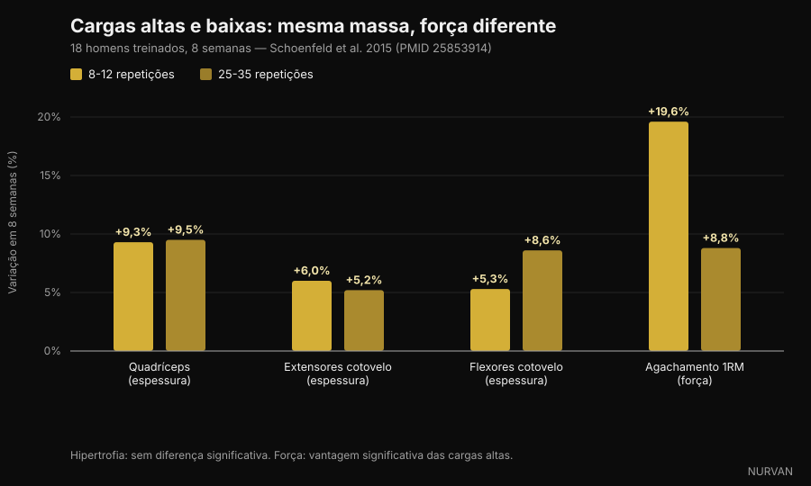
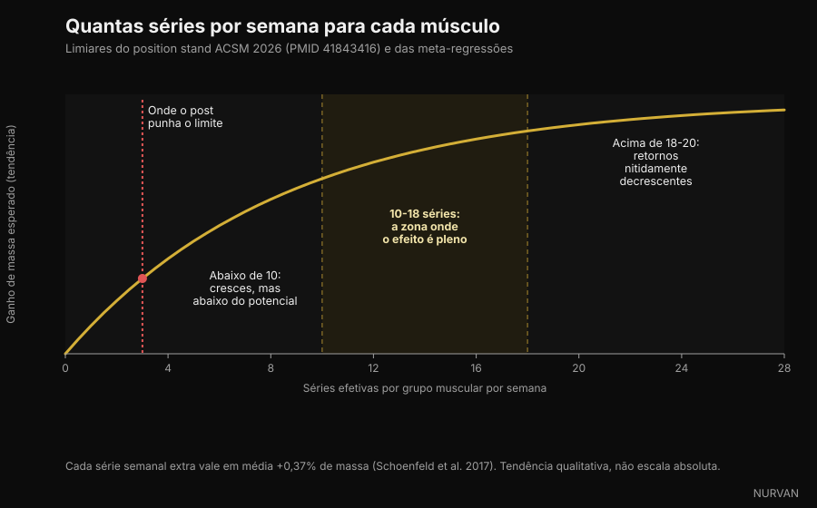

# Quantas repetições precisas realmente para ganhar massa muscular

Por [Giammaria Loi](/autore/giammaria-loi) · atualizado a 5 de outubro de 2026

Nas últimas semanas, quatro carrosséis diferentes disseram a mesma coisa: o intervalo de 8-12 repetições não é mágico, o músculo cresce a 6 repetições tanto como a 30. Nesse ponto têm razão, e há uma montanha de estudos a sustentá-lo. O problema é o resto que acrescentaram em volta — séries, descanso e volume. Aí, pelo menos três afirmações não resistem à verificação. Vamos separá-las uma a uma.

## Em resumo

- **O intervalo de repetições conta muito menos do que se pensa.** O novo position stand do American College of Sports Medicine, publicado em março de 2026 a partir de 137 revisões sistemáticas e mais de 30.000 participantes, não encontra diferenças de hipertrofia entre cargas de 30% a 100% do máximo. O músculo não conta repetições. Ele lê esforço.
- **Para a força máxima, a carga conta muito.** No estudo que tornou o tema popular, 25-35 repetições por série construíram tanto músculo como 8-12 — mas o agachamento máximo subiu 19,6% com cargas altas contra 8,8% com cargas baixas.
- **"Depois da terceira série só compras fadiga" é falso.** A ACSM coloca os retornos decrescentes da hipertrofia por volta das 18-20 séries semanais por músculo, não em três. Uma meta-regressão de 2026 sobre 67 estudos dá 100% de probabilidade de que mais volume signifique mais crescimento.
- **Não precisas de chegar à falha real.** O position stand é direto: levar as séries à falha muscular momentânea não aumenta os ganhos de força, hipertrofia ou potência. Duas a três repetições em reserva bastam.
- **No descanso, os posts simplificaram demasiado.** Um estudo em atletas treinados favorece os três minutos sobre um minuto, mas a síntese da ACSM não encontra diferenças sistemáticas de força entre descansos abaixo e acima de um minuto. O "mínimo de 90 segundos" não vem de nenhum estudo: é um número inventado numa legenda.

*O esforço, e não o número de repetições, é a variável a que o músculo responde. Foto: Cpl. Kenneth Jasik, U.S. Marine Corps, domínio público.*

## De onde veio a regra do 8-12

Durante três décadas, os manuais ensinaram o "continuum das repetições": cargas altas e poucas repetições para a força, cargas médias e 8-12 para o tamanho, cargas baixas e muitas para a resistência muscular. Era uma teoria arrumada, construída mais sobre lógica do que sobre crescimento medido.

Os problemas começaram quando alguém foi medir a espessura muscular com ecografia. O meio do continuum não apareceu.

Em 2015, um grupo liderado por Brad Schoenfeld dividiu 18 homens com experiência de treino em dois: um grupo fazia 8-12 repetições por série, o outro 25-35, em sete exercícios, três vezes por semana, durante oito semanas. Todas as séries até à falha.

Após oito semanas, o aumento de espessura muscular foi quase idêntico: quadríceps +9,3% contra +9,5%, extensores do cotovelo +6,0% contra +5,2%, flexores do cotovelo +5,3% contra +8,6%, sem diferenças estatisticamente significativas. Na força foi outra história: o agachamento máximo subiu 19,6% no grupo de carga alta e 8,8% no de carga baixa.

*Carga alta (8-12 repetições) contra carga baixa (25-35 repetições), 8 semanas — Dados: Schoenfeld et al. 2015. Gráfico Nurvan.*

Uma meta-análise posterior sobre 21 estudos confirmou o quadro: hipertrofia semelhante em todo o espectro de cargas, força máxima melhor com cargas altas. E em março de 2026 o position stand da ACSM — síntese de 137 revisões sistemáticas — fechou a questão: a hipertrofia não foi afetada por cargas entre 30% e 100% do máximo.

Então sim: **o músculo não sabe contar**. Mas reconhece o esforço, e é essa a parte que os carrosséis tratam mal.

## O esforço conta. A falha não

Esta é a distinção mais útil do tema, e a que viaja pior nas redes sociais.

Que o esforço tenha de ser alto está fora de discussão: se usas uma carga leve e paras longe do limite, não há estímulo. Uma meta-regressão de 2024 sobre esta questão encontrou que a hipertrofia aumenta à medida que as séries terminam mais perto da falha, enquanto os ganhos de força se mantêm semelhantes num intervalo amplo de repetições em reserva.

Mas "perto da falha" não é "até à falha". O position stand da ACSM é explícito: levar as séries à falha muscular momentânea **não** aumenta os ganhos de força, hipertrofia ou potência, e para algumas pessoas — praticantes mais velhos, quem ainda tem uma técnica instável — acrescenta risco. O estímulo suficiente vem de trabalhar perto da falha, com um objetivo de 2-3 repetições em reserva.

RIR (*reps in reserve*, repetições em reserva) é simplesmente quantas repetições ainda conseguirias ter feito antes de parar. RIR 2 significa que paraste com duas no depósito.

*Parar duas repetições antes do limite dá o mesmo estímulo que a falha, com muito menos fadiga acumulada. Foto: Senior Airman Haiden Morris, U.S. Air Force, domínio público.*

É aqui que está a maior diferença entre a versão social e a literatura: o carrossel diz "vai até ao limite", a investigação diz "vai até duas repetições do limite e guarda o resto para a série seguinte".

## "Depois da terceira série só compras fadiga": o ponto mais errado

Um dos quatro posts escreve assim: *uma série dura já faz quase todo o trabalho, uma segunda quase duplica, depois da terceira estás sobretudo a comprar fadiga.*

A primeira metade é verdadeira e conhecida: a segunda série acrescenta mais do que a intuição sugere, e a ACSM recomenda **pelo menos duas séries por exercício**. A segunda metade é contrariada por tudo o que temos.

O position stand coloca os retornos decrescentes para a hipertrofia por volta das **18-20 séries semanais** por grupo muscular — não em três — e aponta o volume como uma das poucas variáveis que realmente conduzem o crescimento, com efeito positivo a partir de **10 séries por músculo por semana**. A meta-regressão publicada em 2026 por Pelland e colegas, sobre 67 estudos e 2.058 participantes, atribui uma probabilidade posterior de 100% a que mais volume produza tanto mais hipertrofia como mais força, com retornos decrescentes mas nunca nulos no intervalo estudado. Uma meta-regressão anterior quantificou o ganho médio em **+0,37% de músculo por cada série semanal adicional**.

*Séries semanais por grupo muscular: limiares indicados pelo position stand da ACSM 2026 e pelas meta-regressões. Gráfico Nurvan.*

Atenção a não inverter o erro. Mais volume não é gratuito: os retornos diminuem, a fadiga acumula-se e o tempo de ginásio é limitado. Mas o ponto onde deixa de valer a pena fica nas 18-20 séries semanais por músculo, não em três séries por sessão.

## Descanso: onde os posts simplificaram mais

A afirmação em análise: *descansos longos batem os curtos tanto para o tamanho como para a força, e 90 segundos é o mínimo.*

Há uma base real para isso. Em 2016, um estudo com 21 homens treinados comparou um minuto contra três minutos de descanso durante oito semanas, com tudo o resto igual: o grupo dos três minutos ganhou mais força no agachamento e no supino e mais espessura na coxa. Uma revisão do mesmo ano, sobre seis estudos, concluiu porém que **as duas abordagens funcionam**, com uma possível vantagem dos descansos longos em quem já está treinado.

A síntese da ACSM de 2026, que olha para o conjunto das revisões, é ainda mais cautelosa: a força **não** foi afetada por descansos abaixo de um minuto em comparação com acima de um minuto, e os dados sobre hipertrofia foram considerados insuficientes para concluir.

E o "mínimo de 90 segundos"? Não aparece em nenhum dos trabalhos citados. É um número escolhido numa legenda.

A razão prática para descansar mais mantém-se, e não precisa de estudos de hipertrofia: se descansas pouco, a série seguinte sai mais leve ou mais curta, e acumulas menos trabalho de qualidade. O descanso não é um ingrediente mágico. É o que te permite executar bem a série seguinte.

## O que a investigação diz de facto

**"De 6 a 30 repetições constrói-se músculo da mesma forma, se treinares perto da falha."** → **Confirmado.** Schoenfeld 2015 sobre 25-35 contra 8-12 repetições, a meta-análise de 2017 sobre 21 estudos e o position stand da ACSM 2026 sobre cargas de 30% a 100% do máximo.

**"Abaixo das 9 repetições é onde vive a força."** → **Confirmado.** A força máxima melhora mais com cargas altas, e a ACSM reporta uma dose-resposta com a carga, referindo cargas iguais ou superiores a 80% do máximo.

**"Uma série dura faz quase todo o trabalho; depois da terceira compras fadiga."** → **Desmentido.** Duas séries por exercício são o mínimo recomendado, os retornos decrescentes para a hipertrofia chegam por volta das 18-20 séries semanais por músculo, e a probabilidade de mais volume produzir mais crescimento é estimada em 100% na meta-regressão de 2026.

**"Descansos longos batem os curtos para tamanho e força; 90 segundos é o mínimo."** → **A precisar.** Um ensaio em pessoas treinadas favorece os três minutos, uma revisão diz que ambos funcionam, e a síntese da ACSM não encontra diferenças de força entre abaixo e acima de um minuto. O limiar dos 90 segundos não tem fonte.

**"10 a 20 séries duras por músculo por semana é o intervalo que te faz crescer."** → **A precisar.** O limite inferior é coerente com a ACSM (efeito positivo a partir de 10 séries), mas 20 não é um teto: é onde os ganhos começam a custar muito mais.

**"Perto da falha é a chave."** → **A precisar.** A hipertrofia melhora à medida que te aproximas da falha, mas chegar lá não é necessário: 2-3 repetições em reserva dão o mesmo resultado com menos fadiga e menos risco.

**"A NSCA atualizou as suas diretrizes de hipertrofia."** → **Não verificável.** Não encontrámos nenhum documento primário da NSCA que confirme os números citados no post. A atualização verificável de 2026 é o position stand da ACSM, que substitui o de 2009.

**A citação "PMID 7928218" como estudo de 2016 sobre séries de 4 repetições.** → **Desmentido.** Esse identificador pertence a um trabalho de 1994 sobre agentes de contraste de gadolínio na *Investigative Radiology*. Não tem nada a ver com treino de força. É o lembrete mais útil de todo o artigo: um PMID numa legenda não é uma verificação até alguém o abrir.

## Como aplicar isto

Traduzido num programa, o que a investigação sustenta é mais simples do que parece.

*Escolhe a carga pelo esforço que produz, não pelo número escrito no plano. Foto: Nenad Stojkovic, Wikimedia Commons, CC BY 2.0.*

1. **Escolhe o intervalo de repetições pelo exercício, não pelo dogma.** Nos multiarticulares pesados, 5-10 repetições (menos risco técnico, mais força); no isolamento, 10-20 (menos stress articular, mais fácil chegar ao limite em segurança). É uma escolha de eficiência, não de fisiologia.
2. **Aponta a 2-3 repetições em reserva.** Não à falha. Se quiseres esvaziar o depósito na última série de um exercício, fá-lo aí — e não em todas as séries da sessão.
3. **Conta o volume por músculo, não por exercício.** Começa com 10 séries semanais por grupo muscular, distribuídas por pelo menos duas sessões, e sobe gradualmente para 15-20 só se a recuperação acompanhar e o progresso continuar. A velocidade com que respondes a mais volume varia muito de pessoa para pessoa — falámos disso no artigo sobre [high e low responders](/pt/blog/genetica-high-low-responder).
4. **Descansa o suficiente para executar bem a série seguinte.** Nos multiarticulares pesados isso significa normalmente 2-3 minutos; no isolamento, 60-90 segundos chegam muitas vezes. Se a série seguinte cair três repetições, descansaste pouco.
5. **Progride com dupla progressão.** Fica no teu intervalo, acrescenta uma repetição quando conseguires e, quando chegares ao topo do intervalo, aumenta a carga e recomeça por baixo. É o motor, e nisto os posts acertaram.
6. **Regista tudo.** Sem um registo de carga, repetições e RIR não sabes se estás a progredir ou apenas a repetir. Quase todos sobrestimam o seu volume semanal — contar as séries por grupo muscular é quase sempre uma surpresa.

Estes são intervalos observados em estudos, não uma prescrição individual. Se tens alguma patologia, uma lesão em curso ou segues indicações médicas, fala com o teu médico ou com um profissional qualificado antes de mudar o programa.

> ### Nurvan — as séries da semana conta-as a app, não a tua memória
>
> A Nurvan regista carga, repetições e RIR de cada série e mostra-te quantas séries duras acumulaste por grupo muscular nesta semana, para saberes se estás abaixo de 10 ou já acima de 20. As séries de aquecimento são propostas automaticamente e ficam fora da contagem das séries de trabalho, e a progressão de cargas fica legível ao longo do tempo.
>
> **[Experimenta a Nurvan](https://nurvan.app)**

## Perguntas frequentes

**Quantas repetições devo fazer para ganhar massa muscular?**
Qualquer número entre cerca de 5 e 30, desde que a série termine perto do teu limite. O position stand da ACSM 2026 não encontra diferenças de hipertrofia entre cargas de 30% a 100% do máximo. Na prática: 5-10 repetições nos multiarticulares, 10-20 no isolamento.

**Quantas séries por músculo por semana preciso realmente?**
O efeito positivo na hipertrofia aparece a partir de cerca de 10 séries semanais por grupo muscular, com retornos a começar a diminuir por volta das 18-20. Quem começa de zero ganha muito mesmo com 4-6 séries semanais bem executadas.

**Tenho de treinar até à falha em todas as séries?**
Não. O position stand da ACSM é explícito: chegar à falha muscular momentânea não aumenta os ganhos de força, hipertrofia ou potência. Parar com 2-3 repetições em reserva é suficiente e custa muito menos em fadiga.

**Quanto tempo devo descansar entre séries?**
O suficiente para executar bem a série seguinte: normalmente 2-3 minutos nos multiarticulares pesados e 60-90 segundos no isolamento. Os estudos disponíveis não mostram nenhum mínimo universal, e o "mínimo de 90 segundos" que circula nas redes sociais não tem fonte.

**Treinar com cargas leves e muitas repetições é igual a pegar pesado?**
Para o crescimento muscular sim, se chegares perto do teu limite. Para a força máxima não: aí as cargas altas ganham claramente, e as séries de 25-35 repetições são também muito mais longas e desagradáveis.

## Lê também

- [Proteína na definição: quanto você realmente precisa](/pt/blog/proteina-na-definicao) — a alavanca nutricional que protege o músculo em défice calórico.
- [Mr. Olympia 2026: resultados e o que nos ensinam](/pt/blog/mr-olympia-2026-resultados-nick-walker) — o que o maior palco do desporto diz sobre volume e recuperação.
- [Low responder: quanto a genética pesa nos músculos](/pt/blog/genetica-high-low-responder) — porque o mesmo volume dá resultados diferentes a pessoas diferentes.

## Fontes

1. Currier BS, D'Souza AC, Fiatarone Singh MA, Lowisz CV, Rawson ES, Schoenfeld BJ, Smith-Ryan AE, Steen JP, Thomas GA, Triplett NT, Washington TA, Werner TJ, Phillips SM, 2026. *American College of Sports Medicine Position Stand. Resistance Training Prescription for Muscle Function, Hypertrophy, and Physical Performance in Healthy Adults: An Overview of Reviews.* Medicine & Science in Sports & Exercise 58(4):851-872. PMID 41843416 — [DOI](https://doi.org/10.1249/MSS.0000000000003897)
2. Pelland JC, Remmert JF, Robinson ZP, Hinson SR, Zourdos MC, 2026. *The Resistance Training Dose Response: Meta-Regressions Exploring the Effects of Weekly Volume and Frequency on Muscle Hypertrophy and Strength Gains.* Sports Medicine 56(2):481-505. PMID 41343037 — [DOI](https://doi.org/10.1007/s40279-025-02344-w)
3. Robinson ZP, Pelland JC, Remmert JF, Refalo MC, Jukic I, Steele J, Zourdos MC, 2024. *Exploring the Dose-Response Relationship Between Estimated Resistance Training Proximity to Failure, Strength Gain, and Muscle Hypertrophy: A Series of Meta-Regressions.* Sports Medicine 54(9):2209-2231. PMID 38970765 — [DOI](https://doi.org/10.1007/s40279-024-02069-2)
4. Schoenfeld BJ, Peterson MD, Ogborn D, Contreras B, Sonmez GT, 2015. *Effects of Low- vs. High-Load Resistance Training on Muscle Strength and Hypertrophy in Well-Trained Men.* Journal of Strength and Conditioning Research 29(10):2954-2963. PMID 25853914 — [DOI](https://doi.org/10.1519/JSC.0000000000000958)
5. Schoenfeld BJ, Grgic J, Ogborn D, Krieger JW, 2017. *Strength and Hypertrophy Adaptations Between Low- vs. High-Load Resistance Training: A Systematic Review and Meta-analysis.* Journal of Strength and Conditioning Research 31(12):3508-3523. PMID 28834797 — [DOI](https://doi.org/10.1519/JSC.0000000000002200)
6. Schoenfeld BJ, Ogborn D, Krieger JW, 2017. *Dose-response relationship between weekly resistance training volume and increases in muscle mass: A systematic review and meta-analysis.* Journal of Sports Sciences 35(11):1073-1082. PMID 27433992 — [DOI](https://doi.org/10.1080/02640414.2016.1210197)
7. Schoenfeld BJ, Pope ZK, Benik FM, Hester GM, Sellers J, Nooner JL, Schnaiter JA, Bond-Williams KE, Carter AS, Ross CL, Just BL, Henselmans M, Krieger JW, 2016. *Longer Interset Rest Periods Enhance Muscle Strength and Hypertrophy in Resistance-Trained Men.* Journal of Strength and Conditioning Research 30(7):1805-1812. PMID 26605807 — [DOI](https://doi.org/10.1519/JSC.0000000000001272)
8. Grgic J, Lazinica B, Mikulic P, Krieger JW, Schoenfeld BJ, 2017. *The effects of short versus long inter-set rest intervals in resistance training on measures of muscle hypertrophy: A systematic review.* European Journal of Sport Science 17(8):983-993. PMID 28641044 — [DOI](https://doi.org/10.1080/17461391.2017.1340524)
9. Schoenfeld BJ, Grgic J, Van Every DW, Plotkin DL, 2021. *Loading Recommendations for Muscle Strength, Hypertrophy, and Local Endurance: A Re-Examination of the Repetition Continuum.* Sports (Basel) 9(2):32. PMID 33671664 — [DOI](https://doi.org/10.3390/sports9020032)

Fontes científicas recuperadas do PubMed e verificadas a 5 de outubro de 2026.

Ponto de partida: os carrosséis de [homebodyys](https://www.instagram.com/p/DdL7UjGG2wg/), [The Movement System](https://www.instagram.com/p/Ddon1AtEWJb/), [Christian Poulos](https://www.instagram.com/p/DdRXFzGkTrY/) e [iwannaburnfat](https://www.instagram.com/p/Dc6T7q5iJCr/), publicados entre 5 e 23 de setembro de 2026. O texto, a estrutura, a verificação de factos e os gráficos deste artigo são originais.

---

**Giammaria Loi** é o fundador da Nurvan. Treina com pesos desde 2012, trabalha como personal trainer e coach certificado pela FIPE desde 2013 e compete em powerlifting a nível nacional desde 2018.
Cada artigo que assina parte da investigação científica e chega ao que funciona de verdade no ginásio.

> Nota: conteúdo informativo, não substitui a opinião de um médico ou profissional qualificado. Os intervalos indicados vêm de estudos em populações específicas e não constituem um programa personalizado.
