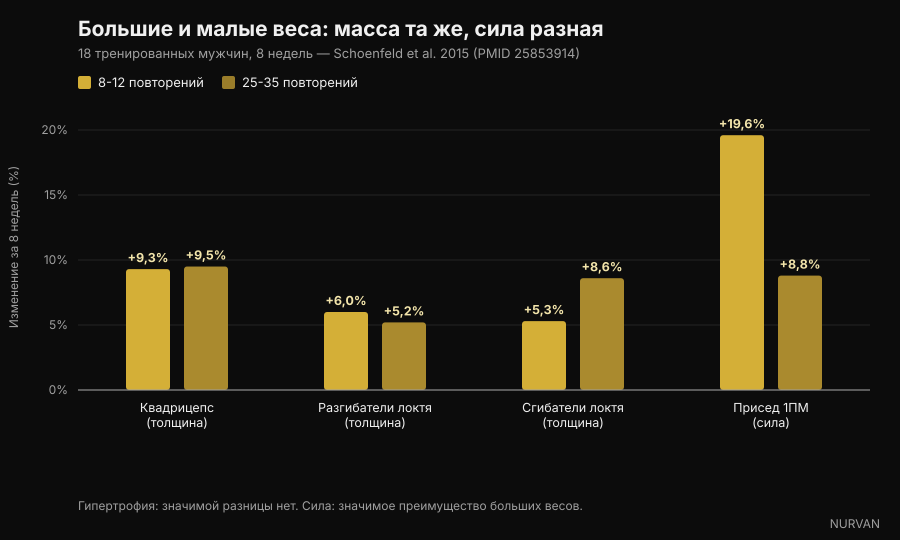
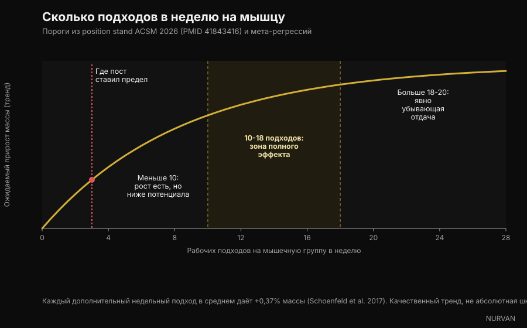

# Сколько повторений реально нужно для роста мышц

За последние недели четыре разные карусели сказали одно и то же: диапазон 8-12 повторений не волшебный, мышца растёт и на 6 повторениях, и на 30. В этом они правы, и за этим стоит гора исследований. Проблема во всём остальном, что они нагромоздили вокруг — про подходы, отдых и объём, — где минимум три утверждения не выдерживают проверки. Разберём их по порядку.

Автор: [Giammaria Loi](/autore/giammaria-loi) · обновлено 5 октября 2026

## Коротко

- **Диапазон повторений значит намного меньше, чем принято думать.** Новый position stand Американской коллегии спортивной медицины (ACSM), опубликованный в марте 2026 года на основе 137 систематических обзоров и более 30 000 участников, не нашёл различий в гипертрофии при нагрузках от 30% до 100% разового максимума. Мышца не умеет считать повторения. Она считывает усилие.
- **Для максимальной силы вес важен, и очень.** В исследовании, которое сделало эту тему популярной, 25-35 повторений в подходе дали столько же мышечной массы, сколько 8-12, но максимум в приседе вырос на 19,6% с большими весами против 8,8% с малыми.
- **«После третьего подхода покупаешь только усталость» — неправда.** ACSM помещает убывающую отдачу для гипертрофии в район 18-20 подходов в неделю на мышцу, а не трёх. Мета-регрессия 2026 года по 67 исследованиям даёт 100% вероятность того, что больше объёма означает больше роста.
- **До настоящего отказа доходить не нужно.** Position stand сформулирован прямо: доведение подходов до мгновенного мышечного отказа не увеличивает прирост силы, гипертрофии и мощности. Достаточно 2-3 повторений в запасе.
- **Про отдых посты упростили.** Одно исследование на тренированных атлетах говорит в пользу трёх минут против одной, но синтез ACSM не находит системных различий в силе между отдыхом меньше и больше минуты. «Минимум 90 секунд» не взят ни из одного исследования — это число придумали в подписи.

*Усилие, а не число повторений — вот переменная, на которую отвечает мышца. Фото: Cpl. Kenneth Jasik, U.S. Marine Corps, общественное достояние.*

## Откуда взялось правило 8-12

Тридцать лет учебники учили «континууму повторений»: большие веса и мало повторений — для силы, средние веса и 8-12 повторений — для объёма, малые веса и много повторений — для мышечной выносливости. Теория была стройной, но построенной скорее на логике, чем на измеренном росте.

Проблемы начались, когда толщину мышц стали реально измерять на УЗИ. Середина континуума не проявилась.

В 2015 году группа под руководством Брэда Шонфельда взяла 18 мужчин с тренировочным опытом и разделила их на две группы: одна делала 8-12 повторений в подходе, другая 25-35, на семи упражнениях, три раза в неделю, восемь недель. Все подходы до отказа.

Через восемь недель прирост толщины мышц оказался практически одинаковым: квадрицепс +9,3% против +9,5%, разгибатели локтя +6,0% против +5,2%, сгибатели локтя +5,3% против +8,6%, без статистически значимых различий. С силой история другая: максимум в приседе вырос на 19,6% в группе с большими весами и на 8,8% в группе с малыми.

*Большая нагрузка (8-12 повторений) против малой (25-35 повторений), 8 недель — данные: Schoenfeld et al. 2015. График Nurvan.*

Более поздний мета-анализ 21 исследования подтвердил картину: схожая гипертрофия по всему спектру нагрузок и заметно лучшая максимальная сила с большими весами. А в марте 2026 года position stand ACSM — синтез 137 систематических обзоров — закрыл вопрос: гипертрофия не зависела от нагрузок в диапазоне от 30% до 100% разового максимума.

Так что да: **мышца не умеет считать**. Но она различает усилие, и именно эту часть карусели передают плохо.

## Усилие важно. Отказ — нет

Это самое полезное различие во всей теме и хуже всего переносимое в соцсети.

Что усилие должно быть высоким — вне сомнений: возьмите лёгкий вес, остановитесь далеко от предела, и стимула не будет. Мета-регрессия 2024 года именно по этому вопросу показала, что гипертрофия растёт по мере того, как подходы заканчиваются ближе к отказу, тогда как прирост силы остаётся схожим в широком диапазоне повторений в запасе.

Но «близко к отказу» — это не «до отказа». Position stand ACSM говорит прямо: доведение подходов до мгновенного мышечного отказа **не** увеличивает прирост силы, гипертрофии или мощности, а некоторым — людям старшего возраста, всем, у кого техника ещё шаткая — добавляет риска. Достаточный стимул даёт работа рядом с отказом, с ориентиром 2-3 повторения в запасе.

RIR (repetitions in reserve, повторения в запасе) — это просто сколько повторений вы могли бы сделать ещё до остановки. RIR 2 значит, что вы поставили штангу, имея два в запасе.

*Остановка за два повторения до отказа даёт тот же стимул, что и отказ, но с куда меньшей накопленной усталостью. Фото: Senior Airman Haiden Morris, U.S. Air Force, общественное достояние.*

Это самый большой практический разрыв между версией из соцсетей и литературой: карусель говорит «жми до предела», исследования говорят «жми до двух повторений от предела, а остальное сохрани на следующий подход».

## «После третьего подхода — только усталость»: самое слабое утверждение

Один из четырёх постов формулирует это так: *один тяжёлый подход уже делает большую часть работы, второй почти удваивает её, а после третьего ты покупаешь в основном усталость.*

Первая половина верна и хорошо известна: второй подход добавляет больше, чем подсказывает интуиция, и ACSM действительно рекомендует **минимум два подхода на упражнение**. Вторая половина противоречит всему, что у нас есть.

Position stand помещает убывающую отдачу для гипертрофии в район **18-20 подходов в неделю** на мышечную группу — не трёх — и перечисляет объём среди немногих переменных, которые реально двигают рост, с положительным эффектом от **10 подходов на мышцу в неделю** и выше. Мета-регрессия, опубликованная в 2026 году Пелландом с коллегами по 67 исследованиям и 2058 участникам, присваивает 100% апостериорную вероятность тому, что больший объём даёт и больше гипертрофии, и больше силы, с убывающей, но никогда не нулевой отдачей на всём изученном диапазоне. Более ранняя мета-регрессия оценила средний прирост в **+0,37% мышечной массы на каждый дополнительный недельный подход**.

*Недельные подходы на мышечную группу: пороги из position stand ACSM 2026 и мета-регрессий. График Nurvan.*

Только не переворачивайте ошибку в другую сторону. Больший объём не бесплатен: отдача падает, усталость накапливается, а время в зале конечно. Но точка, где это перестаёт окупаться, лежит около 18-20 недельных подходов на мышцу, а не на трёх подходах за тренировку.

## Отдых: здесь посты упростили сильнее всего

Утверждение под проверкой: *долгий отдых лучше короткого и для массы, и для силы, а 90 секунд — это минимум.*

Основание реально есть. В 2016 году исследование на 21 тренированном мужчине сравнило одну минуту против трёх минут отдыха на протяжении восьми недель при прочих равных: группа трёх минут получила больше силы в приседе и жиме и больше толщины передней поверхности бедра. Обзор того же года по шести исследованиям, однако, заключил, что **работают оба подхода**, с возможным преимуществом долгого отдыха у уже тренированных.

Синтез ACSM 2026, который смотрит на весь массив обзоров, ещё осторожнее: сила **не** зависела от отдыха меньше минуты против больше минуты, а данных по гипертрофии признали недостаточными для вывода.

А «минимум 90 секунд»? Его нет ни в одной из цитируемых работ. Это число выбрали в подписи.

Практический довод в пользу более долгого отдыха всё равно остаётся, и ему не нужны исследования гипертрофии: отдохнёте мало — следующий подход будет легче или короче, и качественной работы наберётся меньше. Отдых не волшебный ингредиент. Это то, что позволяет нормально выполнить следующий подход.

## Что говорят исследования на самом деле

**«От 6 до 30 повторений мышца растёт одинаково, если работать близко к отказу».** → **Подтверждено.** Schoenfeld 2015 про 25-35 против 8-12 повторений, мета-анализ 2017 года по 21 исследованию и position stand ACSM 2026 про нагрузки от 30% до 100% разового максимума.

**«Сила живёт ниже 9 повторений».** → **Подтверждено.** Максимальная сила растёт больше с большими весами, и ACSM описывает зависимость «доза — ответ» от нагрузки, ссылаясь на веса от 80% разового максимума и выше.

**«Один тяжёлый подход делает почти всё; после третьего покупаешь усталость».** → **Опровергнуто.** Два подхода на упражнение — рекомендованный минимум, убывающая отдача для гипертрофии наступает около 18-20 недельных подходов на мышцу, а вероятность того, что больший объём даёт больший рост, в мета-регрессии 2026 года оценена в 100%.

**«Долгий отдых лучше короткого для массы и силы; 90 секунд — минимум».** → **Нужны уточнения.** Одно РКИ на тренированных говорит в пользу трёх минут, обзор говорит, что работают оба варианта, а синтез ACSM не находит различий в силе между отдыхом меньше и больше минуты. У порога 90 секунд нет источника.

**«10-20 тяжёлых подходов на мышцу в неделю — это диапазон роста».** → **Нужны уточнения.** Нижняя граница совпадает с ACSM (положительный эффект от 10 подходов и выше), но 20 — не потолок: это место, где прирост начинает стоить намного дороже.

**«Главное — близко к отказу».** → **Нужны уточнения.** Гипертрофия действительно улучшается по мере приближения к отказу, но доходить до него не обязательно: 2-3 повторения в запасе дают тот же результат с меньшей усталостью и меньшим риском.

**«NSCA обновила свои рекомендации по гипертрофии».** → **Не проверяется.** Мы не нашли первичного документа NSCA, который подтверждал бы цифры из поста. Проверяемое обновление 2026 года — это position stand ACSM, заменивший версию 2009 года.

**Ссылка «PMID 7928218» как на исследование 2016 года про подходы по 4 повторения.** → **Опровергнуто.** Этот идентификатор принадлежит работе 1994 года о гадолиниевых контрастных средствах в журнале *Investigative Radiology*. К силовым тренировкам она не имеет отношения. Это самое полезное напоминание во всей статье: PMID в подписи не является проверкой, пока его кто-нибудь не откроет.

## Как это применять

Переведённое в программу, то, что действительно поддерживают исследования, проще, чем кажется.

*Вес выбирают по усилию, которое он создаёт, а не по числу, написанному в плане. Фото: Nenad Stojkovic, Wikimedia Commons, CC BY 2.0.*

1. **Выбирайте диапазон повторений по упражнению, а не по догме.** Тяжёлые базовые — 5-10 повторений (меньше технического риска, больше силы); изоляция — 10-20 (меньше нагрузки на суставы, проще безопасно дойти до своего предела). Это выбор по эффективности, а не по физиологии.
2. **Ориентируйтесь на 2-3 повторения в запасе.** Не на отказ. Если хочется выложиться до конца, сделайте это в последнем подходе упражнения — а не в каждом подходе тренировки.
3. **Считайте объём на мышцу, а не на упражнение.** Начните с 10 недельных подходов на мышечную группу, распределённых минимум на две тренировки, и поднимайтесь к 15-20 только если восстановление держится и прогресс идёт. Скорость ответа на добавленный объём сильно различается между людьми — об этом мы писали в материале про [high и low responder](/ru/blog/genetika-high-low-responder).
4. **Отдыхайте столько, чтобы хорошо выполнить следующий подход.** На тяжёлой базе это обычно 2-3 минуты; на изоляции часто хватает 60-90 секунд. Если следующий подход просел на три повторения, вы отдохнули мало.
5. **Прогрессируйте двойной прогрессией.** Оставайтесь в своём диапазоне, добавляйте повторение, когда можете, а дойдя до верхней границы — добавьте вес и начните снизу. Это и есть двигатель, и здесь посты были правы.
6. **Ведите записи.** Без журнала весов, повторений и RIR вы не знаете, прогрессируете вы или повторяетесь. Почти все переоценивают свой недельный объём — подсчёт подходов по мышечным группам обычно оказывается неожиданностью.

Это диапазоны, наблюдавшиеся в исследованиях, а не индивидуальное назначение. Если у вас есть заболевание, текущая травма или вы следуете рекомендациям врача, обсудите изменения программы с врачом или квалифицированным специалистом.

> ### Nurvan — пусть подходы за неделю считает приложение, а не память
>
> Nurvan записывает вес, повторения и RIR каждого подхода и показывает, сколько рабочих подходов вы на самом деле набрали по каждой мышечной группе за неделю: меньше 10 или уже больше 20. Разминочные подходы предлагаются автоматически и не попадают в счёт рабочих, а прогресс по весам виден во времени, а не по памяти.
>
> **[Попробовать Nurvan](https://nurvan.app)**

## Частые вопросы

**Сколько повторений делать для роста мышц?**
Примерно от 5 до 30, если подход заканчивается близко к вашему пределу. Position stand ACSM 2026 не находит различий в гипертрофии при нагрузках от 30% до 100% разового максимума. Для практики: 5-10 повторений на базовых, 10-20 на изоляции.

**Сколько подходов в неделю на одну мышцу нужно на самом деле?**
Положительный эффект на гипертрофию появляется примерно от 10 недельных подходов на мышечную группу и выше, а отдача начинает падать около 18-20. Новички получают много даже с 4-6 хорошо выполненных подходов в неделю.

**Нужно ли доходить до отказа в каждом подходе?**
Нет. Position stand ACSM прямо говорит, что достижение мгновенного мышечного отказа не увеличивает прирост силы, гипертрофии или мощности. Остановки с 2-3 повторениями в запасе достаточно, и усталости она стоит гораздо меньше.

**Сколько отдыхать между подходами?**
Столько, чтобы хорошо выполнить следующий подход: обычно 2-3 минуты на тяжёлой базе и 60-90 секунд на изоляции. Доступные исследования не показывают универсального минимума, а у «минимума 90 секунд» из соцсетей нет источника.

**Лёгкий вес на много повторений — это то же самое, что тяжёлый?**
Для роста мышц да, если доходить близко до предела. Для максимальной силы нет: там большие веса выигрывают явно, а подходы по 25-35 повторений ещё и намного длиннее и неприятнее.

## Читайте также

- [Белок на сушке: сколько нужно на самом деле](/ru/blog/belok-na-sushke) — нутриционный рычаг, который защищает мышцы в дефиците.
- [Mr. Olympia 2026: результаты и выводы](/ru/blog/mr-olympia-2026-rezultaty-nick-walker) — что главная сцена этого спорта говорит про объём и восстановление.
- [Low responder: насколько генетика определяет рост мышц](/ru/blog/genetika-high-low-responder) — почему один и тот же объём даёт разным людям разные результаты.

## Источники

1. Currier BS, D'Souza AC, Fiatarone Singh MA, Lowisz CV, Rawson ES, Schoenfeld BJ, Smith-Ryan AE, Steen JP, Thomas GA, Triplett NT, Washington TA, Werner TJ, Phillips SM, 2026. *American College of Sports Medicine Position Stand. Resistance Training Prescription for Muscle Function, Hypertrophy, and Physical Performance in Healthy Adults: An Overview of Reviews.* Medicine & Science in Sports & Exercise 58(4):851-872. PMID 41843416 — [DOI](https://doi.org/10.1249/MSS.0000000000003897)
2. Pelland JC, Remmert JF, Robinson ZP, Hinson SR, Zourdos MC, 2026. *The Resistance Training Dose Response: Meta-Regressions Exploring the Effects of Weekly Volume and Frequency on Muscle Hypertrophy and Strength Gains.* Sports Medicine 56(2):481-505. PMID 41343037 — [DOI](https://doi.org/10.1007/s40279-025-02344-w)
3. Robinson ZP, Pelland JC, Remmert JF, Refalo MC, Jukic I, Steele J, Zourdos MC, 2024. *Exploring the Dose-Response Relationship Between Estimated Resistance Training Proximity to Failure, Strength Gain, and Muscle Hypertrophy: A Series of Meta-Regressions.* Sports Medicine 54(9):2209-2231. PMID 38970765 — [DOI](https://doi.org/10.1007/s40279-024-02069-2)
4. Schoenfeld BJ, Peterson MD, Ogborn D, Contreras B, Sonmez GT, 2015. *Effects of Low- vs. High-Load Resistance Training on Muscle Strength and Hypertrophy in Well-Trained Men.* Journal of Strength and Conditioning Research 29(10):2954-2963. PMID 25853914 — [DOI](https://doi.org/10.1519/JSC.0000000000000958)
5. Schoenfeld BJ, Grgic J, Ogborn D, Krieger JW, 2017. *Strength and Hypertrophy Adaptations Between Low- vs. High-Load Resistance Training: A Systematic Review and Meta-analysis.* Journal of Strength and Conditioning Research 31(12):3508-3523. PMID 28834797 — [DOI](https://doi.org/10.1519/JSC.0000000000002200)
6. Schoenfeld BJ, Ogborn D, Krieger JW, 2017. *Dose-response relationship between weekly resistance training volume and increases in muscle mass: A systematic review and meta-analysis.* Journal of Sports Sciences 35(11):1073-1082. PMID 27433992 — [DOI](https://doi.org/10.1080/02640414.2016.1210197)
7. Schoenfeld BJ, Pope ZK, Benik FM, Hester GM, Sellers J, Nooner JL, Schnaiter JA, Bond-Williams KE, Carter AS, Ross CL, Just BL, Henselmans M, Krieger JW, 2016. *Longer Interset Rest Periods Enhance Muscle Strength and Hypertrophy in Resistance-Trained Men.* Journal of Strength and Conditioning Research 30(7):1805-1812. PMID 26605807 — [DOI](https://doi.org/10.1519/JSC.0000000000001272)
8. Grgic J, Lazinica B, Mikulic P, Krieger JW, Schoenfeld BJ, 2017. *The effects of short versus long inter-set rest intervals in resistance training on measures of muscle hypertrophy: A systematic review.* European Journal of Sport Science 17(8):983-993. PMID 28641044 — [DOI](https://doi.org/10.1080/17461391.2017.1340524)
9. Schoenfeld BJ, Grgic J, Van Every DW, Plotkin DL, 2021. *Loading Recommendations for Muscle Strength, Hypertrophy, and Local Endurance: A Re-Examination of the Repetition Continuum.* Sports (Basel) 9(2):32. PMID 33671664 — [DOI](https://doi.org/10.3390/sports9020032)

Научные источники получены из PubMed и проверены 5 октября 2026 года.

Отправная точка: карусели [homebodyys](https://www.instagram.com/p/DdL7UjGG2wg/), [The Movement System](https://www.instagram.com/p/Ddon1AtEWJb/), [Christian Poulos](https://www.instagram.com/p/DdRXFzGkTrY/) и [iwannaburnfat](https://www.instagram.com/p/Dc6T7q5iJCr/), опубликованные между 5 и 23 сентября 2026 года. Текст, структура, проверка фактов и графики этой статьи оригинальны.

---

**Giammaria Loi** — основатель Nurvan. Тренируется с отягощениями с 2012 года, работает персональным тренером и коучем с сертификацией FIPE с 2013 года и выступает в пауэрлифтинге на национальном уровне с 2018 года.

> Примечание: информационный материал, он не заменяет консультацию врача или квалифицированного специалиста. Приведённые диапазоны взяты из исследований на конкретных группах людей и не являются персональной программой.
