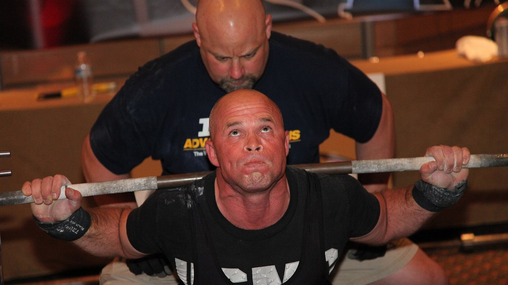
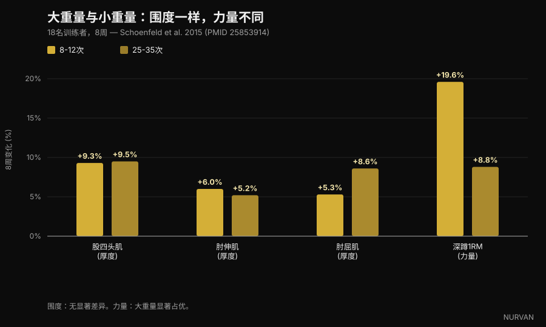
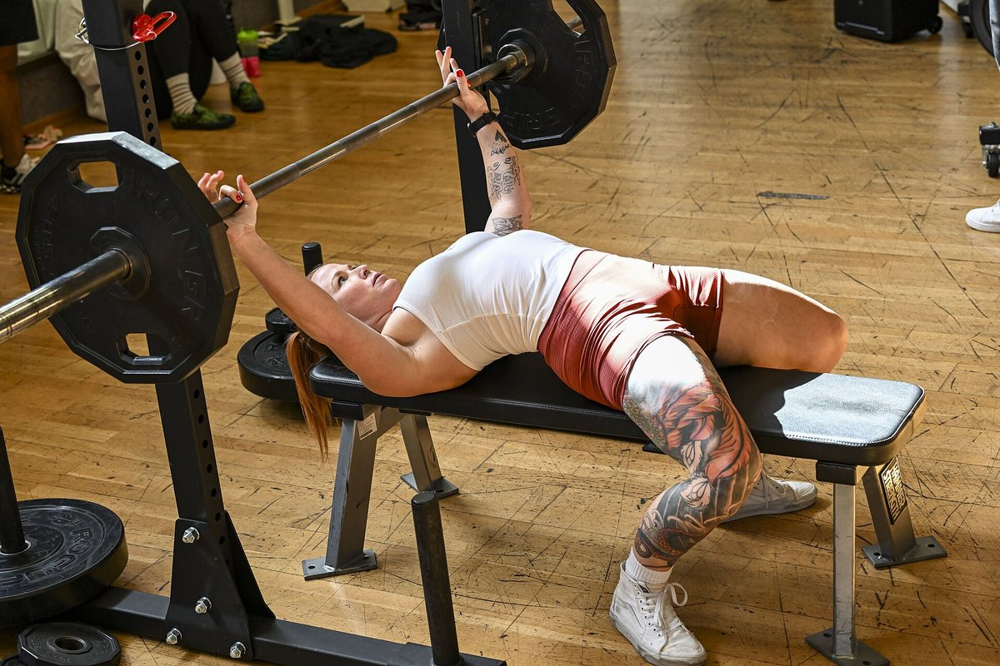
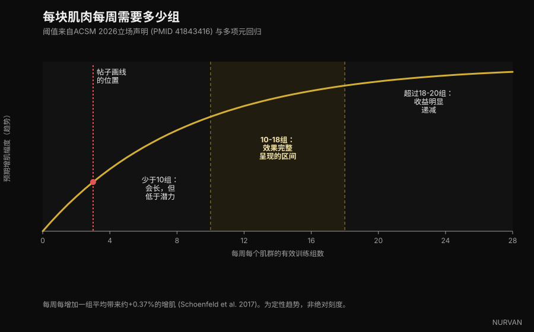
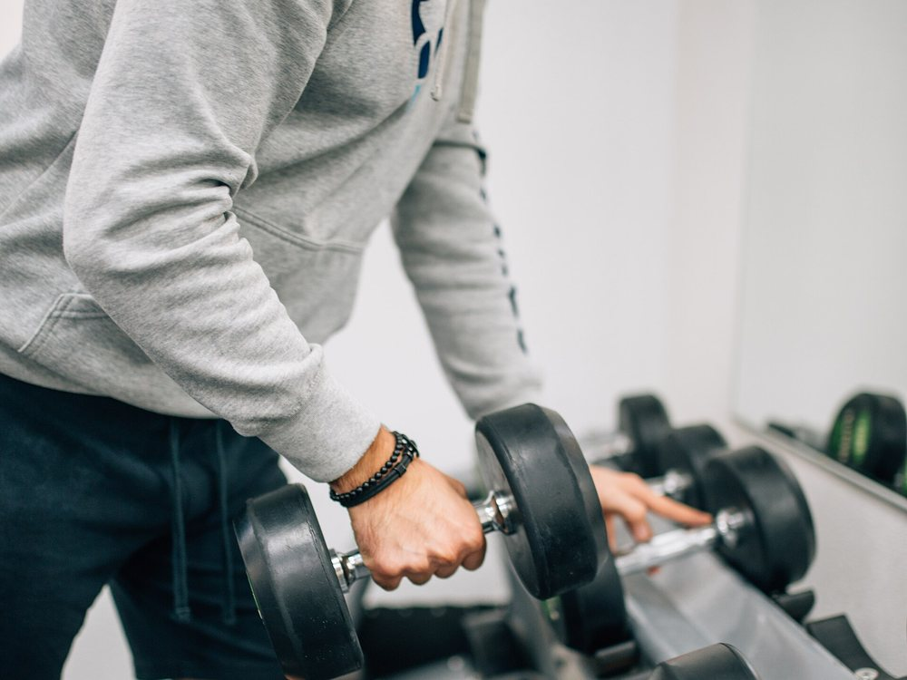

# 增肌到底每组需要做多少次

过去几周，四份不同的健身图文说了同一件事：8-12 次这个区间并不神奇，做 6 次能长肌肉，做 30 次也能。这一点他们说对了，背后有大量研究支持。问题出在他们围绕这一点堆上去的其他内容——关于组数、组间休息和训练量——其中至少三条说法经不起核查。下面逐条拆开看。

作者：[Giammaria Loi](/autore/giammaria-loi) · 更新于 2026 年 10 月 5 日

## 要点速览

- **次数区间的影响，比大多数训练者想象的小得多。** 美国运动医学会（ACSM）2026 年 3 月发布的新版立场声明，汇总了 137 篇系统综述、超过 30,000 名参与者，发现负荷从 1RM 的 30% 到 100% 之间，肌肉生长没有差异。肌肉不会数次数，它读取的是努力程度。
- **但对最大力量来说，负荷非常重要。** 在把这个话题带火的那项研究里，每组 25-35 次长出的肌肉和 8-12 次一样多，但深蹲 1RM 在大重量组上升了 19.6%，小重量组只有 8.8%。
- **「超过三组就只是在买疲劳」是错的。** ACSM 把增肌的收益递减点放在每个肌群每周约 18-20 组，而不是三组。2026 年一项涵盖 67 篇研究的元回归给出 100% 的概率：训练量更多，生长更多。
- **你不需要真的练到力竭。** 立场声明说得很直接：把组做到瞬时肌肉力竭，并不会让力量、肌肉量或爆发力的增益更好。保留 2-3 次就够了。
- **组间休息那条说法被过度简化了。** 一项针对训练有素者的试验支持 3 分钟优于 1 分钟，但 ACSM 的汇总没有发现休息低于一分钟与高于一分钟之间存在系统性的力量差异。而「至少 90 秒」这个门槛根本没有研究支撑——它是在配图文字里被编出来的。

*肌肉回应的变量是努力程度，不是次数。照片：Cpl. Kenneth Jasik, U.S. Marine Corps, 公共领域。*

## 8-12 次这条规则是怎么来的

三十年来，教科书一直在教「次数连续谱」：大重量、低次数练力量；中等重量、8-12 次练体积；小重量、高次数练肌肉耐力。这套理论很整齐，但它建立在逻辑之上，而不是建立在实际测到的肌肉生长上。

麻烦从有人真的用超声去测肌肉厚度开始。连续谱的中段并没有出现。

2015 年，由 Brad Schoenfeld 带领的一个团队招募了 18 名有训练经验的男性，把他们分成两组：一组每组做 8-12 次，另一组做 25-35 次，一共七个动作，每周三次，持续八周。所有组都做到力竭。

八周之后，两组肌肉厚度的增幅基本一致：股四头肌 +9.3% 对 +9.5%，肘关节伸肌 +6.0% 对 +5.2%，肘关节屈肌 +5.3% 对 +8.6%，没有统计学显著差异。力量则是另一回事：深蹲 1RM 在大重量组上升 19.6%，小重量组上升 8.8%。

*大重量（8-12 次）对小重量（25-35 次），为期 8 周——数据：Schoenfeld et al. 2015。Nurvan 制图。*

后来一项涵盖 21 篇研究的元分析确认了这个模式：整个负荷区间内肌肉生长相近，而大重量在最大力量上明显更好。到了 2026 年 3 月，ACSM 立场声明——137 篇系统综述的汇总——给出了结论：在 1RM 的 30% 到 100% 之间，负荷并不影响肌肉生长。

所以没错：**肌肉不会数数**。但它认得努力程度，而这正是那些图文处理得最差的部分。

## 努力程度重要，练到力竭并不重要

这是整个话题里最有用的一个区分，也是在社交平台上传播得最糟的一个。

努力程度必须高，这点没有争议：用一个很轻的重量、离极限还很远就停下，刺激就不存在。2024 年一项专门针对这个问题的元回归发现，组越接近力竭结束，肌肉生长越多；而力量增益在很宽的保留次数范围内保持相近。

但「接近力竭」不等于「做到力竭」。ACSM 立场声明写得很明确：把组做到瞬时肌肉力竭**不会**提高力量、肌肉量或爆发力的增益，而对一部分人——年长训练者、动作还不稳的人——还会增加风险。足够的刺激来自接近力竭的工作，目标是保留 2-3 次。

RIR（reps in reserve，保留次数）就是你停下之前还能再做几次。RIR 2 的意思是你放下杠铃时，还剩两次没做。

*提前两次停下，带来的刺激和力竭相同，但累积的疲劳少得多。照片：Senior Airman Haiden Morris, U.S. Air Force, 公共领域。*

这就是社交平台版本和文献之间最大的实际差距：图文说「推到极限」，研究说「推到距离极限两次的地方，把剩下的留给下一组」。

## 「超过三组就只是在买疲劳」：最站不住脚的一条

四份帖子中有一份这样写：*一个高质量组已经完成了大部分工作，第二组几乎能翻倍，超过第三组你买到的主要是疲劳。*

前半句是对的，也是公认的：第二组带来的收益比直觉估计的要多，ACSM 确实建议**每个动作至少两组**。后半句则与我们手上的所有证据相反。

立场声明把增肌的收益递减点放在每个肌群每周约 **18-20 组**——不是三组——并把训练量列为少数真正驱动生长的变量之一，从**每个肌群每周 10 组**往上开始出现正向效应。Pelland 等人 2026 年发表的元回归，覆盖 67 篇研究、2,058 名参与者，给出 100% 的后验概率：训练量更多，既带来更多肌肉生长，也带来更多力量增长；在研究涵盖的范围内收益递减，但从未归零。更早的一项元回归把平均收益量化为**每增加一个每周训练组，肌肉量多 +0.37%**。

*每个肌群的每周组数：阈值来自 ACSM 2026 立场声明与多项元回归。Nurvan 制图。*

不过，也不要把错误翻到另一边。更多训练量不是免费的：收益会缩小，疲劳会累积，而在健身房的时间是有限的。但真正不再划算的那个点，大约在每个肌群每周 18-20 组，而不是每次训练三组。

## 组间休息：被简化得最严重的一段

要核查的说法是：*长休息在增肌和力量上都优于短休息，而 90 秒是下限。*

这条说法有真实依据。2016 年一项针对 21 名训练有素男性的研究，在其他条件一致的前提下，把 1 分钟和 3 分钟休息对比了八周：3 分钟组获得了更多的深蹲和卧推力量，以及更多的大腿前侧厚度。但同年一篇涵盖六项研究的综述得出的结论是：**两种做法都有效**，长休息可能在已有训练经验的人身上略占优势。

2026 年 ACSM 的汇总看的是全部可用综述，口径更保守：力量**并未**受到休息低于一分钟与高于一分钟的影响，而关于肌肉生长的数据被判定为不足以得出结论。

那么「90 秒下限」呢？它没有出现在任何一篇被引用的研究里。这是在配图文字里挑出来的一个数字。

即便如此，多休息一会儿在实践上依然说得通，而且根本不需要增肌研究来支持：休息太短，下一组你就会用更轻的重量或做更少的次数，于是累积的高质量工作更少。休息不是什么神奇配方，它只是让你能把下一组做好的前提。

## 研究到底怎么说

**「只要接近力竭，6 到 30 次都能同样长肌肉。」** → **成立。** Schoenfeld 2015 比较 25-35 次与 8-12 次、2017 年涵盖 21 篇研究的元分析，以及 ACSM 2026 立场声明关于 1RM 的 30% 到 100% 负荷的结论。

**「9 次以下才是力量区间。」** → **成立。** 最大力量在大重量下提升更多，ACSM 也报告了负荷的剂量反应关系，并提到 1RM 80% 及以上的负荷。

**「一个高质量组完成大部分工作；超过三组就是在买疲劳。」** → **不成立。** 每个动作两组是建议的最低值，增肌的收益递减出现在每个肌群每周约 18-20 组，而 2026 年的元回归把「训练量更多带来更多生长」的概率估计为 100%。

**「长休息在增肌和力量上都优于短休息；90 秒是下限。」** → **需要补充条件。** 一项针对训练有素者的随机对照试验支持 3 分钟，一篇综述说两者都有效，而 ACSM 的汇总没有发现低于与高于一分钟之间的力量差异。90 秒这个门槛没有来源。

**「每个肌群每周 10 到 20 个高质量组，才是让你长的区间。」** → **需要补充条件。** 下限与 ACSM 一致（从 10 组往上出现正向效应），但 20 不是天花板——那只是收益开始变得昂贵得多的位置。

**「接近力竭是关键。」** → **需要补充条件。** 越接近力竭，肌肉生长确实越好，但真的练到力竭并非必要：保留 2-3 次就能得到同样的结果，疲劳更少，风险更低。

**「NSCA 更新了它的增肌指南。」** → **无法核实。** 我们没有找到任何 NSCA 的原始文件能证实帖子里引用的数字。2026 年可核实的更新是 ACSM 立场声明，它取代了 2009 年的版本。

**把「PMID 7928218」引用为 2016 年关于 4 次一组的研究。** → **不成立。** 这个编号对应的是 1994 年发表在 *Investigative Radiology* 上的一篇关于钆对比剂的论文，与抗阻训练毫无关系。这也是本文里最有用的提醒：配图文字里的一个 PMID，在有人真的打开它之前，都不算核查。

## 怎么落到训练里

翻译成一份训练计划，研究真正支持的内容比听起来更简单。

*重量要按它产生的努力程度来选，而不是按计划表上写的那个数字。照片：Nenad Stojkovic, Wikimedia Commons, CC BY 2.0。*

1. **按动作选次数区间，而不是按教条。** 大重量复合动作用 5-10 次（技术风险更小，力量收益更大）；孤立动作用 10-20 次（关节压力更小，更容易安全地接近极限）。这是效率上的选择，不是生理上的。
2. **目标是保留 2-3 次。** 不是力竭。如果你想在某个动作上把油箱榨干，就放在那个动作的最后一组——而不是整次训练的每一组。
3. **按肌群算训练量，而不是按动作。** 从每个肌群每周 10 组起步，分散到至少两次训练里，只有在恢复跟得上、进步还在继续时，才逐步往 15-20 组推。对增加训练量的反应速度，人和人之间差别很大——我们在[高反应者与低反应者](/zh/blog/genetics-high-low-responders-zh)那篇里谈过这件事。
4. **休息到足够把下一组做好。** 大重量复合动作通常意味着 2-3 分钟；孤立动作往往 60-90 秒就够。如果下一组掉了三次，说明你休息得太少。
5. **用双重渐进推进。** 停在你选定的区间里，能多做一次就多做一次；做到区间上限时加重量，再从区间下限重新开始。这就是引擎，而这一点那些帖子说对了。
6. **把它记下来。** 没有重量、次数和 RIR 的记录，你分不清自己是在进步还是在重复。几乎所有人都会高估自己的每周训练量——按肌群数一遍组数，通常都是个意外。

以上是研究中观察到的区间，不是个人化的处方。如果你有疾病、正在恢复的伤，或正在遵循医疗建议，请在改动训练计划前先和医生或合格的专业人士沟通。

> ### Nurvan — 每周的组数交给 App 数，别交给记忆
>
> Nurvan 会记录每一组的重量、次数和 RIR，并显示你本周在每个肌群上实际累积了多少个高质量组，让你知道自己是还不到 10 组，还是已经超过 20 组。热身组会自动给出建议，并且不计入正式组；负荷的进展是随时间可读的，而不是靠回忆。
>
> **[试用 Nurvan](https://nurvan.app)**

## 常见问题

**增肌每组应该做多少次？**
大致 5 到 30 次之间都可以，前提是这一组要结束在接近你极限的位置。ACSM 2026 立场声明发现，1RM 的 30% 到 100% 之间负荷对肌肉生长没有差异。实操上：复合动作 5-10 次，孤立动作 10-20 次。

**每个肌群每周到底需要多少组？**
对肌肉生长的正向效应大约从每个肌群每周 10 组往上开始出现，收益在 18-20 组附近开始缩小。新手即使每周只做 4-6 个执行质量好的组，也能得到很多。

**是不是每一组都要练到力竭？**
不是。ACSM 立场声明明确指出，达到瞬时肌肉力竭不会提高力量、肌肉量或爆发力的增益。保留 2-3 次就停下已经足够，而且疲劳代价小得多。

**组间休息应该多久？**
长到足以把下一组做好：大重量复合动作通常 2-3 分钟，孤立动作 60-90 秒。现有研究没有显示存在一个普适的最低值，社交平台上流传的「90 秒下限」也没有来源。

**小重量高次数和大重量练，效果一样吗？**
对肌肉生长来说，只要你练到接近极限，答案是一样。对最大力量来说不一样：那里大重量明显取胜，而且 25-35 次的组还要长得多、难受得多。

## 延伸阅读

- [减脂期的蛋白质：究竟需要多少](/zh/blog/protein-intake-cutting-zh) — 在热量缺口中保护肌肉的那个营养杠杆。
- [Mr. Olympia 2026：结果与启示](/zh/blog/mr-olympia-2026-results-zh) — 这项运动最大的舞台，关于训练量和恢复说明了什么。
- [低反应者：基因对肌肉生长究竟有多大影响](/zh/blog/genetics-high-low-responders-zh) — 为什么同样的训练量，在不同人身上给出不同结果。

## 参考文献

1. Currier BS, D'Souza AC, Fiatarone Singh MA, Lowisz CV, Rawson ES, Schoenfeld BJ, Smith-Ryan AE, Steen JP, Thomas GA, Triplett NT, Washington TA, Werner TJ, Phillips SM, 2026. *American College of Sports Medicine Position Stand. Resistance Training Prescription for Muscle Function, Hypertrophy, and Physical Performance in Healthy Adults: An Overview of Reviews.* Medicine & Science in Sports & Exercise 58(4):851-872. PMID 41843416 — [DOI](https://doi.org/10.1249/MSS.0000000000003897)
2. Pelland JC, Remmert JF, Robinson ZP, Hinson SR, Zourdos MC, 2026. *The Resistance Training Dose Response: Meta-Regressions Exploring the Effects of Weekly Volume and Frequency on Muscle Hypertrophy and Strength Gains.* Sports Medicine 56(2):481-505. PMID 41343037 — [DOI](https://doi.org/10.1007/s40279-025-02344-w)
3. Robinson ZP, Pelland JC, Remmert JF, Refalo MC, Jukic I, Steele J, Zourdos MC, 2024. *Exploring the Dose-Response Relationship Between Estimated Resistance Training Proximity to Failure, Strength Gain, and Muscle Hypertrophy: A Series of Meta-Regressions.* Sports Medicine 54(9):2209-2231. PMID 38970765 — [DOI](https://doi.org/10.1007/s40279-024-02069-2)
4. Schoenfeld BJ, Peterson MD, Ogborn D, Contreras B, Sonmez GT, 2015. *Effects of Low- vs. High-Load Resistance Training on Muscle Strength and Hypertrophy in Well-Trained Men.* Journal of Strength and Conditioning Research 29(10):2954-2963. PMID 25853914 — [DOI](https://doi.org/10.1519/JSC.0000000000000958)
5. Schoenfeld BJ, Grgic J, Ogborn D, Krieger JW, 2017. *Strength and Hypertrophy Adaptations Between Low- vs. High-Load Resistance Training: A Systematic Review and Meta-analysis.* Journal of Strength and Conditioning Research 31(12):3508-3523. PMID 28834797 — [DOI](https://doi.org/10.1519/JSC.0000000000002200)
6. Schoenfeld BJ, Ogborn D, Krieger JW, 2017. *Dose-response relationship between weekly resistance training volume and increases in muscle mass: A systematic review and meta-analysis.* Journal of Sports Sciences 35(11):1073-1082. PMID 27433992 — [DOI](https://doi.org/10.1080/02640414.2016.1210197)
7. Schoenfeld BJ, Pope ZK, Benik FM, Hester GM, Sellers J, Nooner JL, Schnaiter JA, Bond-Williams KE, Carter AS, Ross CL, Just BL, Henselmans M, Krieger JW, 2016. *Longer Interset Rest Periods Enhance Muscle Strength and Hypertrophy in Resistance-Trained Men.* Journal of Strength and Conditioning Research 30(7):1805-1812. PMID 26605807 — [DOI](https://doi.org/10.1519/JSC.0000000000001272)
8. Grgic J, Lazinica B, Mikulic P, Krieger JW, Schoenfeld BJ, 2017. *The effects of short versus long inter-set rest intervals in resistance training on measures of muscle hypertrophy: A systematic review.* European Journal of Sport Science 17(8):983-993. PMID 28641044 — [DOI](https://doi.org/10.1080/17461391.2017.1340524)
9. Schoenfeld BJ, Grgic J, Van Every DW, Plotkin DL, 2021. *Loading Recommendations for Muscle Strength, Hypertrophy, and Local Endurance: A Re-Examination of the Repetition Continuum.* Sports (Basel) 9(2):32. PMID 33671664 — [DOI](https://doi.org/10.3390/sports9020032)

科学文献来自 PubMed，并于 2026 年 10 月 5 日完成核对。

起点：[homebodyys](https://www.instagram.com/p/DdL7UjGG2wg/)、[The Movement System](https://www.instagram.com/p/Ddon1AtEWJb/)、[Christian Poulos](https://www.instagram.com/p/DdRXFzGkTrY/) 和 [iwannaburnfat](https://www.instagram.com/p/Dc6T7q5iJCr/) 在 2026 年 9 月 5 日至 23 日之间发布的图文。本文的文字、结构、事实核查与图表均为原创。

---

**Giammaria Loi** 是 Nurvan 的创始人。他从 2012 年开始进行负重训练，自 2013 年起担任 FIPE 认证的私人教练与教练，并从 2018 年起在全国级别的力量举比赛中参赛。

> 说明：本文为科普内容，不能替代医生或合格专业人士的意见。文中给出的区间来自针对特定人群的研究，不构成个人化的训练计划。
