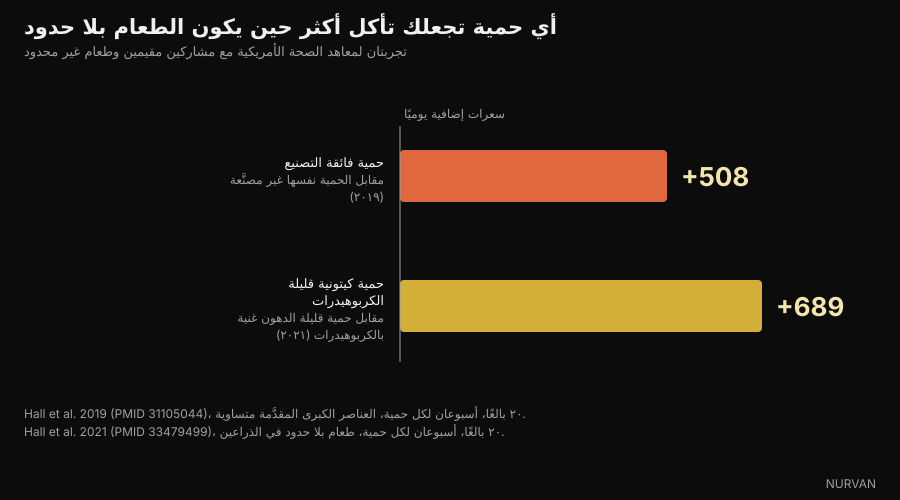

# هل الكربوهيدرات تزيد الوزن؟ أين تختبئ الدهون فعلًا

Di [Giammaria Loi](/autore/giammaria-loi) · حُدِّث في ٦ أكتوبر ٢٠٢٦

منشور واسع الانتشار للمُثقِّف الغذائي الإيطالي أندريا بياشي يقول إن الأطعمة التي نسميها «كربوهيدرات» مليئة في الغالب بالدهون، وإن من ينقص وزنه بحذف الكربوهيدرات إنما يحذف السعرات في الحقيقة. راجعنا الجزء الأول صنفًا صنفًا في جداول التركيب الرسمية، والجزء الثاني في تجارب أُجريت داخل المستشفى. معظم الكلام يصمد، لكن الأرقام تقول شيئًا أدق من «المشكلة ليست في الكربوهيدرات».

## باختصار

- **في اللازانيا ٤٩٪ من السعرات تأتي من الدهون و٢٧٪ فقط من الكربوهيدرات.** ليست طبقًا كربوهيدراتيًا، بل طبق دهون بداخله بعض العجين. بيانات CREA وحسابنا نحن.
- **رقائق البطاطس المعبأة ٥١٪ سعرات دهنية، ومقرمشات الجبن ٤٥٪، والويفر بالشوكولاتة ٤٧٪.** وكلها مُصنَّفة ذهنيًا تحت خانة «الكربوهيدرات».
- **لكن الخبز الأبيض ٢٪ فقط من سعراته من الدهون، والمعكرونة المسلوقة ٣٪.** هنا التفصيل الذي أغفله المنشور: المشكلة ليست فئة الكربوهيدرات، بل درجة تصنيع الطعام.
- **السكر يحجب بالفعل الإحساس بالدهن.** دراسة ١٩٩٠ التي استشهد بها المنشور موجودة وعنوانها *Invisible fats*: كلما زاد السكر قلّ الدهن الذي يشعر به الناس — مع بقاء الدهن الحقيقي كما هو.
- **حذف الكربوهيدرات لا يجعلك تأكل أقل.** في تجربة لمعاهد الصحة الأمريكية مع طعام غير محدود، أدت الحمية قليلة الدهون إلى تناول ٦٨٩ سعرة أقل يوميًا من الحمية الكيتونية. العجز في السعرات لا يصنعه العنصر الغذائي.

*اللازانيا هي المثال الأوضح: ١٩٦ سعرة لكل ١٠٠ غرام، منها ٤٩٪ من الدهون و٢٧٪ فقط من الكربوهيدرات. الصورة: Syced، ويكيميديا كومنز، CC0.*

## «الكربوهيدرات» فئة، لا طبق

في الكلام اليومي صارت «الكربوهيدرات» فئة من **الأطعمة**: المعكرونة والخبز والبسكويت والكيك والبيتزا ورقائق البطاطس. أما داخل تركيب هذه الأطعمة فالكربوهيدرات ليست سوى واحد من ثلاثة عناصر كبرى، وغالبًا ليست العنصر الذي يقدّم أكبر قدر من السعرات.

الالتباس يولد من خطوة تبدو بريئة: إذا كان الطعام مصنوعًا أساسًا من الدقيق فسعراته تأتي من الدقيق. الأمر لا يسير هكذا. غرام الدهن يعطي ٩ سعرات، أي أكثر من ضعف غرام الكربوهيدرات. تكفي بضعة غرامات من الزبدة أو الزيت أو الكريمة لقلب الميزان الحراري للحصة.

المنشور يقول ذلك جيدًا ويقترح أمرًا بسيطًا: افتح جداول التركيب الغذائي. وهذا ما فعلناه، باستخدام قاعدة بيانات موجودة أصلًا داخل التطبيق.

## أرقام الجداول الرسمية

أخذنا جداول تركيب الأطعمة من **CREA**، مركز البحوث الإيطالي للأغذية والتغذية، وحسبنا لكل صنف نسبة السعرات الآتية من كل عنصر كبير. الحساب بسيط: غرامات الكربوهيدرات × ٤، غرامات البروتين × ٤، غرامات الدهون × ٩، ثم ننظر إلى النِّسب.

*من أين تأتي السعرات في ١١ طعامًا يوميًا. البيانات: CREA، جداول التركيب الغذائي الإيطالية، تحديث ٢٠١٩. الحساب والرسم من Nurvan.*

النتيجة أوضح مما يوحي به المنشور. في **اللازانيا** تقدّم الكربوهيدرات ٢٧٪ من السعرات والدهون ٤٩٪: تسميتها طبقًا كربوهيدراتيًا خطأ ببساطة. **رقائق البطاطس المعبأة** تصل إلى ٥١٪ سعرات دهنية، و**كريمة البندق والكاكاو** إلى ٥٣٪، و**الويفر بالشوكولاتة** إلى ٤٧٪، و**مقرمشات الجبن** إلى ٤٥٪.

| الطعام (١٠٠ غرام) | سعرة | كربوهيدرات | دهون | ٪ السعرات من الدهون |
|---|---|---|---|---|
| كريمة بندق وكاكاو | 537 | 58.1 غ | 32.4 غ | **٥٣٪** |
| رقائق بطاطس معبأة | 512 | 58.0 غ | 29.6 غ | **٥١٪** |
| لازانيا | 196 | 13.4 غ | 10.8 غ | **٤٩٪** |
| ويفر بالشوكولاتة | 498 | 60.3 غ | 26.6 غ | **٤٧٪** |
| مقرمشات بالجبن | 498 | 59.2 غ | 25.5 غ | **٤٥٪** |
| كرواسان | 403 | 54.7 غ | 18.3 غ | **٤٠٪** |
| كيك محشو بالكاكاو | 410 | 65.5 غ | 15.1 غ | **٣٢٪** |
| أصابع خبز | 421 | 65.1 غ | 13.9 غ | **٢٩٪** |
| بسكويت زبدة | 426 | 71.7 غ | 13.8 غ | **٢٨٪** |
| معكرونة مسلوقة | 175 | 37.3 غ | 0.6 غ | **٣٪** |
| خبز أبيض | 268 | 59.5 غ | 0.5 غ | **٢٪** |

*القيم لكل ١٠٠ غرام من جداول CREA (تحديث ٢٠١٩)؛ نسبة السعرات من الدهون حساب خاص بنا على أساس 4/4/9 سعرة لكل غرام.*

السطران الأخيران هما ما يغيّر الخلاصة. **الخبز الأبيض يأخذ ٢٪ من سعراته من الدهون، والمعكرونة المسلوقة ٣٪.** أي إنهما خاليان من الدهون عمليًا. والأمر نفسه ينطبق على الأرز والبطاطس المسلوقة والبقوليات والفاكهة.

*الخبز الأبيض يأخذ ٢٪ من سعراته من الدهون، والمعكرونة المسلوقة ٣٪. مصادر الكربوهيدرات غير المصنَّعة ليست جزءًا من المشكلة. الصورة: FranHogan، ويكيميديا كومنز، CC BY-SA 4.0.*

إذن الصياغة الصحيحة ليست «الكربوهيدرات دهون أيضًا»، بل: **كلما كان الطعام أكثر تركيبًا وتصنيعًا حمل معه دهونًا أكثر، مهما كانت الفئة التي وضعناه فيها.** أصابع الخبز ليست خبزًا، والكيك ليس خبزًا، واللازانيا ليست معكرونة. ومن يزن المعكرونة ولا يزن الصلصة إنما يقيس أقل أجزاء الطبق سعرات.

## لماذا لا تنتبه: السكر يغطي الدهن

يستشهد المنشور بدراسة لدريفنوفسكي وشوارتز من عام ١٩٩٠. الدراسة موجودة وقد فتحناها: عنوانها *Invisible fats* — دهون غير مرئية — ونُشرت في مجلة *Appetite*.

تذوّقت خمسون طالبة ذوات وزن طبيعي خمس عشرة عيّنة تشبه كريمة تزيين الكيك، بسكر من ٢٠٪ إلى ٧٧٪ وزبدة من ١٥٪ إلى ٣٥٪، وقيّمن الحلاوة ومحتوى الدهون. تبعت الحلاوة المُدرَكة نسبة السكر بدقة، أما الدهن المُدرَك فلا: **كلما ارتفع السكر حُكم على العيّنات بأنها أقل دهنًا رغم احتوائها على القدر نفسه من الزبدة.**

ويخلص الباحثان إلى ما يهمنا تمامًا: قد يفسّر هذا لماذا تُعدّ كثير من الحلويات الغنية بالدهون أطعمة «كربوهيدراتية». إنها تجربة حسّية على عيّنة صغيرة: لا تثبت أنك تزداد وزنًا أكثر، بل تثبت أنك لا تنتبه.

*في الوجبات المالحة المعبأة تكون الدهون أكبر بند في السعرات، لكن النكهة التي تتعرف عليها هي نكهة الجزء المقرمش. الصورة: Toby Scratch Fanatic، ويكيميديا كومنز، CC0.*

أما الدراسة الأحدث فمن عام ٢٠١٨ في *Cell Metabolism*. باستخدام مزاد حقيقي والرنين المغناطيسي الوظيفي، كان المشاركون مستعدين **لدفع مبلغ أكبر** مقابل أطعمة تجمع الدهون والكربوهيدرات، مقارنة بأطعمة مألوفة ومحبوبة بالقدر نفسه ومتساوية السعرات مكوّنة من الدهون وحدها أو الكربوهيدرات وحدها. كما قدّروا الكثافة الحرارية للأطعمة الدهنية **بدقة أعلى**، وللأطعمة المختلطة **بدقة أقل**.

باختصار: التركيبة مرغوبة أكثر عند تساوي السعرات، وهي في الوقت نفسه الأسوأ تقديرًا في الدماغ. والمنتج الصناعي الذي يجمع السكر والدهن يقع تمامًا في النقطة العمياء.

## إذن لماذا ينقص الوزن عند حذف الكربوهيدرات؟

هنا يصل المنشور إلى الخلاصة الصحيحة — العِبرة بعجز السعرات لا بحذف الكربوهيدرات — لكن الطريق يستحق بعض الأرقام، لأن الأدبيات أقل إجماعًا مما تبدو.

أكبر التجارب وأفضلها ضبطًا هي **DIETFITS**، المنشورة في *JAMA* عام ٢٠١٨: ٦٠٩ بالغين يعانون زيادة الوزن، اثنا عشر شهرًا، ٢٢ جلسة جماعية، حمية قليلة الدهون مقابل حمية قليلة الكربوهيدرات، كلتاهما مبنية على أطعمة جيدة. النتيجة: −٥٫٣ كغ مقابل −٦٫٠ كغ. والفارق البالغ ٠٫٧ كغ غير دال إحصائيًا. ولم يتمكن النمط الجيني ولا إفراز الإنسولين من التنبؤ بمن تناسبه أي حمية.

أما التحليلات البعدية لدراسات الحياة الواقعية فأقل حيادًا: عند ٦ إلى ١٢ شهرًا تجد أفضلية صغيرة للحميات قليلة الكربوهيدرات، **١٫٣ كغ** في مراجعة ٢٠٢٠ شملت ٣٨ دراسة و٦٤٩٩ بالغًا، و**٢٫٢ كغ** في مراجعة ٢٠١٦. أفضلية حقيقية لكنها متواضعة، ويصحبها في كلتيهما ارتفاع كوليسترول LDL.

الرقم الذي يُغلق النقاش فعلًا شيء آخر، والمنشور لا يذكره. في ٢٠٢١ أدخل فريق كيفن هول عشرين بالغًا إلى المركز السريري لمعاهد الصحة الأمريكية، وقدّم لكلٍّ منهم أسبوعين من حمية كيتونية (١٠٪ كربوهيدرات) وأسبوعين من حمية قليلة الدهون (١٠٪ دهون و٧٥٪ كربوهيدرات)، **مع طعام غير محدود في الحالتين**.

*حين يُسمح بالأكل بلا حدود، ليس حذف الكربوهيدرات هو ما يخفض السعرات. البيانات: Hall et al. 2019 و2021. الرسم من Nurvan.*

لو كانت فرضية «الكربوهيدرات تجعلك تأكل أكثر» صحيحة لسجّلت المجموعة الكيتونية سعرات أقل. حدث العكس: مع الحمية قليلة الدهون تناول المشاركون **٦٨٩ سعرة أقل يوميًا** مقارنة بالكيتونية، و٥٤٤ أقل في الأسبوع الأخير.

والدليل المقابل دراسة الفريق نفسه عام ٢٠١٩: عشرون مقيمًا، أسبوعان من حمية فائقة التصنيع وأسبوعان من حمية غير مصنَّعة، مع تساوي السعرات المقدَّمة والكثافة الحرارية والعناصر الكبرى والسكر والصوديوم والألياف. مع الفائقة التصنيع تناولوا **٥٠٨ سعرات أكثر يوميًا** وزادوا ٠٫٩ كغ في أسبوعين؛ ومع الأخرى فقدوا ٠٫٩ كغ.

الرافعة ليست العنصر الغذائي، بل الصورة التي تأكله بها. ومن ينقص وزنه بالانتقال إلى حمية قليلة الكربوهيدرات يكون في أغلب الحالات قد توقّف عن أكل الكيك والمقرمشات ورقائق البطاطس والكريمات — أي حذف دهونًا وسعرات، كما يقول المنشور تمامًا، لا كربوهيدرات فقط.

## ماذا تقول الأبحاث حقًا

- **مؤكَّد** — «كثير من الأطعمة التي تُعدّ كربوهيدراتية تحتوي كميات معتبرة من الدهون.» — مؤكَّد في بيانات CREA: اللازانيا ٤٩٪ من السعرات من الدهون، ورقائق البطاطس ٥١٪، ومقرمشات الجبن ٤٥٪، والويفر بالشوكولاتة ٤٧٪.
- **يحتاج تدقيقًا** — «المشكلة ليست في الكربوهيدرات.» — صحيح، لكن ينبغي قوله بدقة أكبر: مصادر الكربوهيدرات غير المصنَّعة تكاد تخلو من الدهون (الخبز الأبيض ٢٪ من السعرات، والمعكرونة المسلوقة ٣٪). المتغيّر المهم ليس العنصر الغذائي بل درجة تركيب الطعام وتصنيعه.
- **مؤكَّد** — «الطعم الحلو يحجب الإحساس بالدهون (دريفنوفسكي وشوارتز، ١٩٩٠).» — الدراسة موجودة وعنوانها *Invisible fats*، والنتيجة كما ذُكرت: سكر أكثر، دهن مُدرَك أقل مع ثبات الدهن الحقيقي. خمسون مشاركة وكريمات تجريبية: نتيجة حسّية لا نتيجة تتعلق بالوزن.
- **مؤكَّد** — «الجمع بين السكر والدهون يرفع الاستساغة.» — مؤكَّد ومعزَّز: في دراسة ٢٠١٨ بمجلة *Cell Metabolism* يدفع الناس أكثر مقابل أطعمة تجمع الدهون والكربوهيدرات، عند تساوي السعرات والألفة ودرجة الاستحسان.
- **يحتاج تدقيقًا** — «الفائدة على الوزن تأتي من عجز الطاقة لا من حذف الكربوهيدرات.» — تجربة DIETFITS على ٦٠٩ أشخاص تؤيد المنشور (٠٫٧ كغ فرقًا عند ١٢ شهرًا، غير دال)، لكن تحليلات الحياة الواقعية ما زالت تجد أفضلية صغيرة للحميات قليلة الكربوهيدرات تتراوح بين ١٫٣ و٢٫٢ كغ عند ٦ إلى ١٢ شهرًا.
- **مردود** — «حذف الكربوهيدرات يجعلك تأكل تلقائيًا أقل.» — هذه الفكرة الضمنية خلف كثير من خطاب قلة الكربوهيدرات، وفي جناح المستشفى يحدث العكس: مع طعام بلا حدود أنتجت الحمية قليلة الدهون ٦٨٩ سعرة أقل يوميًا من الكيتونية.
- **يحتاج تدقيقًا** — «استخدام تطبيق لتتبع الطعام يساعد على فهم أي العناصر يقدّم السعرات.» — نعم، وهي أنفع نصيحة في المنشور. مع تحفظ واحد: التقدير بالعين يكون في أسوأ حالاته تحديدًا مع الأطعمة التي تجمع الدهون والكربوهيدرات، فالمطلوب رقم مكتوب لا انطباع.

## كيف تطبّق ذلك

1. **اقرأ سطر الدهون لا سطر الكربوهيدرات.** على الملصق اضرب غرامات الدهون في ٩ واقسم على سعرات الحصة نفسها: إذا تجاوز الناتج ٠٫٣٥ تقريبًا فالدهون هي البند الأكبر، مهما كان اسم المنتج.
2. **افصل بين المواد الأساسية والمنتجات.** الخبز والمعكرونة والأرز والبطاطس والبقوليات تكاد تخلو من الدهون. أما أصابع الخبز والمقرمشات والبسكويت والكيك والكرواسان والكريمات فشيء آخر: الرف نفسه والتركيب مختلف.
3. **زن الصلصة لا القاعدة وحدها.** في اللازانيا والمعكرونة بالبيستو والكاربونارا تكمن السعرات كلها تقريبًا هناك. هذا التدخل هو الأكثر تأثيرًا في مجموع اليوم، وهو أقل كلفة من حذف مجموعة غذائية كاملة.
4. **سجّل أسبوعين ثم توقّف إن شئت.** لا حاجة للتسجيل إلى الأبد، يكفي ما يسمح لك باكتشاف أين تذهب سعراتك فعلًا. ويجد معظم الناس المفاجأة في العمود نفسه.
5. **أبقِ البروتين مرتفعًا أثناء التخفيض.** هي الرافعة التي تحمي الكتلة العضلية حين تنخفض السعرات: تناولنا ذلك في مقال [كم بروتينًا تحتاج أثناء التجفيف](/ar/blog/protein-intake-cutting).
6. **اختر الحمية التي تستطيع الالتزام بها.** عند تساوي العجز تعطي قليلة الكربوهيدرات وقليلة الدهون نتائج متقاربة جدًا بعد اثني عشر شهرًا. الالتزام أهم من اسم البروتوكول.

هذه متوسطات سكانية لا خطة شخصية. إن كان لديك سكري أو اضطراب في دهون الدم أو اضطراب في الأكل أو تتناول علاجًا، فاستشر طبيبك أو أخصائي تغذية قبل تغيير نظامك الغذائي.

> **Nurvan — الدهون الخفية تراها في اليوميات لا على الملصق**
>
> تعتمد قاعدة بيانات الأطعمة في Nurvan على جداول CREA الرسمية: حين تسجّل حصة من اللازانيا أو من المقرمشات ترى فورًا كم سعرة جاءت من الدهون وكم من الكربوهيدرات، لا المجموع وحده. وتوزيع العناصر الكبرى اليومي يتحدّث تلقائيًا، فيتوقف العمود الذي ينمو بصمت عن كونه مفاجأة.
>
> [جرّب Nurvan](https://nurvan.app)

## أسئلة شائعة

**هل الكربوهيدرات تزيد الوزن؟**

ليس أكثر من أي مصدر آخر للسعرات. الوزن يزيد بفائض طاقة مستمر. وسبب ارتباط «أطعمة الكربوهيدرات» بزيادة الوزن أن كثيرًا منها — الكيك والمقرمشات ورقائق البطاطس والكريمات — يأخذ بين ٣٠٪ و٥٣٪ من سعراته من الدهون بحسب جداول CREA.

**كم من سعرات اللازانيا يأتي من الكربوهيدرات؟**

٢٧٪. وتقدّم الدهون ٤٩٪ والبروتين ٢٤٪، من أصل ١٩٦ سعرة لكل ١٠٠ غرام بحسب جداول CREA. لذلك فتسميتها طبقًا كربوهيدراتيًا مضلِّلة.

**كيف أعرف من الملصق أن الطعام دهني؟**

اضرب غرامات الدهون في ٩، واقسم على سعرات الحصة نفسها، ثم اقرأ النسبة. فوق ٣٥٪ تقريبًا تكون الدهون المساهم الأكبر، حتى لو بدا المنتج مصنوعًا من الدقيق أو السكر.

**هل الحمية قليلة الكربوهيدرات أفضل من قليلة الدهون؟**

في أكبر تجربة مضبوطة، DIETFITS على ٦٠٩ أشخاص، كان الفارق بعد اثني عشر شهرًا ٠٫٧ كغ وغير دال. وتجد تحليلات الحياة الواقعية أفضلية صغيرة لقليلة الكربوهيدرات (١٫٣ إلى ٢٫٢ كغ)، مع ارتفاع كوليسترول LDL. والأهم بكثير أيهما تستطيع الاستمرار عليه.

**هل يجب حذف الخبز والمعكرونة لإنقاص الوزن؟**

لا. الخبز والمعكرونة يأخذان ٢٪ و٣٪ من سعراتهما من الدهون على التوالي: ليسا المشكلة. وبالنسبة لمعظم الناس يقع أكبر هامش في الصلصات والمنتجات المعبأة.

## اقرأ أيضًا

- [البروتين أثناء التجفيف: كم تحتاج منه فعلًا؟](/ar/blog/protein-intake-cutting) — الرافعة الغذائية التي تحمي العضلة حين تنخفض السعرات.
- [الأرز المبرَّد: ما أهمية النشا المقاوم؟](/ar/blog/aruz-mubarrad-nasha-muqawim) — حالة أخرى تكون فيها الأرقام الحقيقية أصغر من العنوان.
- [CBL-514: دواء إذابة الدهون، ماذا تقول الدراسات](/ar/blog/cbl-514-dawa-duhun-taht-jild) — ماذا يحدث حين تُهاجَم الدهون من الجهة الأخرى.

## المصادر

1. Drewnowski A, Schwartz M, 1990. *Invisible fats: sensory assessment of sugar/fat mixtures.* Appetite 14(3):203-217. PMID 2369116 — [DOI](https://doi.org/10.1016/0195-6663(90)90088-p)
2. DiFeliceantonio AG, Coppin G, Rigoux L, Edwin Thanarajah S, Dagher A, Tittgemeyer M, Small DM, 2018. *Supra-Additive Effects of Combining Fat and Carbohydrate on Food Reward.* Cell Metabolism 28(1):33-44. PMID 29909968 — [DOI](https://doi.org/10.1016/j.cmet.2018.05.018)
3. Hall KD, Guo J, Courville AB et al., 2021. *Effect of a plant-based, low-fat diet versus an animal-based, ketogenic diet on ad libitum energy intake.* Nature Medicine 27(2):344-353. PMID 33479499 — [DOI](https://doi.org/10.1038/s41591-020-01209-1)
4. Hall KD, Ayuketah A, Brychta R et al., 2019. *Ultra-Processed Diets Cause Excess Calorie Intake and Weight Gain: An Inpatient Randomized Controlled Trial of Ad Libitum Food Intake.* Cell Metabolism 30(1):67-77. PMID 31105044 — [DOI](https://doi.org/10.1016/j.cmet.2019.05.008)
5. Gardner CD, Trepanowski JF, Del Gobbo LC et al., 2018. *Effect of Low-Fat vs Low-Carbohydrate Diet on 12-Month Weight Loss in Overweight Adults: The DIETFITS Randomized Clinical Trial.* JAMA 319(7):667-679. PMID 29466592 — [DOI](https://doi.org/10.1001/jama.2018.0245)
6. Chawla S, Tessarolo Silva F, Amaral Medeiros S, Mekary RA, Radenkovic D, 2020. *The Effect of Low-Fat and Low-Carbohydrate Diets on Weight Loss and Lipid Levels: A Systematic Review and Meta-Analysis.* Nutrients 12(12):3774. PMID 33317019 — [DOI](https://doi.org/10.3390/nu12123774)
7. Mansoor N, Vinknes KJ, Veierød MB, Retterstøl K, 2016. *Effects of low-carbohydrate diets v. low-fat diets on body weight and cardiovascular risk factors: a meta-analysis of randomised controlled trials.* British Journal of Nutrition 115(3):466-479. PMID 26768850 — [DOI](https://doi.org/10.1017/S0007114515004699)
8. CREA — مركز البحوث للأغذية والتغذية (إيطاليا). *جداول تركيب الأطعمة*، تحديث ٢٠١٩ — [alimentinutrizione.it](https://www.alimentinutrizione.it/tabelle-nutrizionali/ricerca-per-ordine-alfabetico). مصدر القيم لكل ١٠٠ غرام؛ ونسب السعرات بحسب العناصر الكبرى حساب خاص بـ Nurvan.

> المصادر العلمية مستخرجة من PubMed ومتحقَّق منها في ٦ أكتوبر ٢٠٢٦. وقيم التركيب مأخوذة من جداول CREA الرسمية المدمجة أصلًا في قاعدة بيانات الأطعمة لدى Nurvan.

> نقطة الانطلاق: منشور [أندريا بياشي](https://www.instagram.com/p/Dd_OSqQiFfi/) في ٣ أكتوبر ٢٠٢٦ عن الكربوهيدرات وزيادة الوزن. أما النص والبنية والحسابات على بيانات CREA وعمليات التحقق والرسوم في هذا المقال فأصلية.

**جاماريا لوي** هو مؤسس Nurvan. يتدرب بالأثقال منذ ٢٠١٢، ويعمل مدربًا شخصيًا ومدربًا معتمدًا من FIPE منذ ٢٠١٣، ويشارك في رفع الأثقال القوة على المستوى الوطني منذ ٢٠١٨. كل مقال يوقّعه ينطلق من الدراسات العلمية وينتهي إلى ما ينفع فعلًا في الصالة.

> ملاحظة: محتوى معلوماتي لا يغني عن رأي الطبيب أو المختص. القيم المذكورة متوسطات لتركيب الأطعمة ونتائج متوسطة لدراسات على فئات بعينها: وهي لا تشكّل خطة غذائية شخصية.
