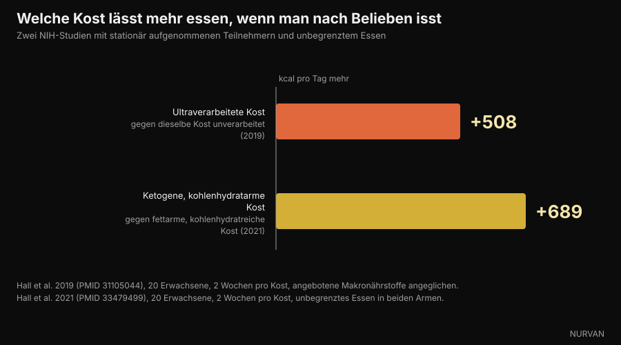

# Machen Kohlenhydrate dick? Wo sich das Fett wirklich versteckt

Di [Giammaria Loi](/autore/giammaria-loi) · aktualisiert am 6. Oktober 2026

Ein vielgeteilter Beitrag des italienischen Ernährungsdozenten Andrea Biasci behauptet, die Lebensmittel, die wir „Kohlenhydrate" nennen, steckten oft voller Fett — und wer durch Kohlenhydratverzicht abnimmt, streiche in Wahrheit Kalorien. Den ersten Punkt haben wir Lebensmittel für Lebensmittel in den offiziellen Nährwerttabellen geprüft, den zweiten in Studien unter stationären Bedingungen. Das meiste hält stand, aber die Zahlen sagen etwas Präziseres als „es sind nicht die Kohlenhydrate".

## Kurz gesagt

- **In der Lasagne stammen 49 % der Kalorien aus Fett und nur 27 % aus Kohlenhydraten.** Kein Kohlenhydratgericht, sondern ein Fettgericht mit etwas Nudelteig darin. CREA-Daten, eigene Berechnung.
- **Chips aus der Tüte liegen bei 51 % Fettkalorien, Käsecracker bei 45 %, die Schokowaffel bei 47 %.** Alle werden im Kopf unter „Kohlenhydrate" abgelegt.
- **Weißbrot liegt dagegen bei 2 % Fettkalorien, gekochte Nudeln bei 3 %.** Hier liegt die Differenzierung, die der Beitrag auslässt: Das Problem ist nicht die Kategorie Kohlenhydrate, sondern der Verarbeitungsgrad.
- **Zucker überdeckt die Fettwahrnehmung tatsächlich.** Die zitierte Studie von 1990 existiert und heißt *Invisible fats*: Je mehr Zucker, desto weniger Fett nahmen die Testpersonen wahr — bei gleichem tatsächlichem Fettgehalt.
- **Kohlenhydrate wegzulassen führt nicht dazu, weniger zu essen.** In einem NIH-Versuch mit unbegrenztem Essen führte die fettarme Kost zu 689 kcal pro Tag weniger als die ketogene. Das Defizit entsteht nicht durch den Makronährstoff.

*Die Lasagne ist das klarste Beispiel: 196 kcal pro 100 g, davon 49 % aus Fett und nur 27 % aus Kohlenhydraten. Foto: Syced, Wikimedia Commons, CC0.*

## „Kohlenhydrate" ist eine Kategorie, kein Gericht

Im Alltag sind „Kohlenhydrate" zu einer Kategorie von **Lebensmitteln** geworden: Nudeln, Brot, Kekse, Snacks, Pizza, Chips. In der Zusammensetzung dieser Lebensmittel sind Kohlenhydrate dagegen nur einer von drei Makronährstoffen — und oft nicht der mit den meisten Kalorien.

Die Verwirrung entsteht aus einem Schritt, der harmlos aussieht: Wenn ein Lebensmittel vor allem aus Mehl besteht, kommen seine Kalorien aus dem Mehl. So funktioniert es nicht. Ein Gramm Fett liefert 9 kcal, mehr als doppelt so viel wie ein Gramm Kohlenhydrate. Wenige Gramm Butter, Öl oder Creme kippen die Energiebilanz einer Portion.

Der Beitrag sagt das richtig und schlägt etwas Einfaches vor: die Nährwerttabellen öffnen. Genau das haben wir getan — mit einer Datenbank, die wir bereits in der App haben.

## Die Zahlen aus den offiziellen Tabellen

Wir haben die Lebensmitteltabellen des **CREA** genommen, des italienischen Forschungszentrums für Lebensmittel und Ernährung, und für jedes Lebensmittel berechnet, welcher Anteil der Kalorien aus welchem Makronährstoff stammt. Die Rechnung ist simpel: Gramm Kohlenhydrate × 4, Gramm Eiweiß × 4, Gramm Fett × 9 — dann sieht man die Verhältnisse.

*Woher die Kalorien in elf Alltagslebensmitteln kommen. Daten: CREA, italienische Lebensmittel-Nährwerttabellen, Stand 2019. Berechnung und Grafik von Nurvan.*

Das Ergebnis ist deutlicher, als der Beitrag andeutet. In der **Lasagne** liefern Kohlenhydrate 27 % der Kalorien und Fett 49 %: Sie ein Kohlenhydratgericht zu nennen, ist schlicht falsch. **Chips aus der Tüte** erreichen 51 % Fettkalorien, **Nuss-Nougat-Creme** 53 %, die **Schokowaffel** 47 %, **Käsecracker** 45 %.

| Lebensmittel (100 g) | kcal | Kohlenhydrate | Fett | % kcal aus Fett |
|---|---|---|---|---|
| Nuss-Nougat-Creme | 537 | 58,1 g | 32,4 g | **53 %** |
| Chips aus der Tüte | 512 | 58,0 g | 29,6 g | **51 %** |
| Lasagne | 196 | 13,4 g | 10,8 g | **49 %** |
| Schokowaffel | 498 | 60,3 g | 26,6 g | **47 %** |
| Käsecracker | 498 | 59,2 g | 25,5 g | **45 %** |
| Croissant | 403 | 54,7 g | 18,3 g | **40 %** |
| Gefüllter Kakao-Snack | 410 | 65,5 g | 15,1 g | **32 %** |
| Grissini | 421 | 65,1 g | 13,9 g | **29 %** |
| Mürbekekse | 426 | 71,7 g | 13,8 g | **28 %** |
| Nudeln, gekocht | 175 | 37,3 g | 0,6 g | **3 %** |
| Weißbrot | 268 | 59,5 g | 0,5 g | **2 %** |

*Werte pro 100 g aus den CREA-Tabellen (Stand 2019); der Anteil der Fettkalorien ist unsere eigene Berechnung mit 4/4/9 kcal pro Gramm.*

Die letzten beiden Zeilen ändern die Schlussfolgerung. **Weißbrot bezieht 2 % seiner Kalorien aus Fett, gekochte Nudeln 3 %.** Sie sind praktisch fettfrei. Dasselbe gilt für Reis, Salzkartoffeln, Hülsenfrüchte und Obst.

*Weißbrot bezieht 2 % seiner Kalorien aus Fett, gekochte Nudeln 3 %. Unverarbeitete Kohlenhydratquellen sind nicht das Problem. Foto: FranHogan, Wikimedia Commons, CC BY-SA 4.0.*

Der richtige Satz lautet also nicht „Kohlenhydrate sind auch Fett", sondern: **Je zusammengesetzter und verarbeiteter ein Lebensmittel ist, desto mehr Fett bringt es mit — egal, in welche Kategorie wir es gesteckt haben.** Grissini sind kein Brot, der Snack ist kein Brot, Lasagne ist keine Pasta. Wer die Nudeln wiegt, aber nicht die Sauce, misst den kalorienärmsten Teil des Tellers.

## Warum man es nicht merkt: Zucker verdeckt Fett

Der Beitrag zitiert eine Studie von Drewnowski und Schwartz aus dem Jahr 1990. Es gibt sie, wir haben sie geöffnet: Sie heißt *Invisible fats* — unsichtbare Fette — und erschien in *Appetite*.

Fünfzig normalgewichtige Studentinnen probierten fünfzehn Zubereitungen ähnlich Tortenglasuren, mit 20 bis 77 % Zucker und 15 bis 35 % Butter, und bewerteten Süße und Fettgehalt. Die wahrgenommene Süße folgte dem Zucker genau. Das wahrgenommene Fett nicht: **Mit steigendem Zucker wurden die Proben als fettärmer beurteilt, obwohl sie gleich viel Butter enthielten.**

Die Autoren schließen genau das, was uns interessiert: Dieser Mechanismus kann erklären, warum so viele fettreiche Süßspeisen als „kohlenhydratreiche" Lebensmittel gelten. Es ist ein sensorisches Experiment mit kleiner Stichprobe: Es beweist nicht, dass man mehr zunimmt, sondern dass man es nicht bemerkt.

*Bei abgepackten salzigen Snacks ist Fett der größte Posten, aber der Geschmack, den man wahrnimmt, ist der knusprige Teil. Foto: Toby Scratch Fanatic, Wikimedia Commons, CC0.*

Das jüngere Stück stammt von 2018 aus *Cell Metabolism*. Mit einer echten Auktion und funktioneller Magnetresonanztomographie waren die Teilnehmer bereit, **mehr zu zahlen** für Lebensmittel, die Fett und Kohlenhydrate verbinden, als für ebenso vertraute, ebenso beliebte und ebenso kalorienreiche Lebensmittel aus nur Fett oder nur Kohlenhydraten. Und sie schätzten die Energiedichte fettreicher Lebensmittel **besser** ein, die gemischter **schlechter**.

Kurz: Die Kombination wird bei gleichen Kalorien stärker begehrt und vom Gehirn zugleich am schlechtesten eingeschätzt. Das Industrieprodukt, das Zucker und Fett vereint, liegt genau im blinden Fleck.

## Warum nimmt man dann ohne Kohlenhydrate ab?

Hier landet der Beitrag bei der richtigen Schlussfolgerung — es ist das Kaloriendefizit, nicht der Verzicht auf Kohlenhydrate — aber der Weg dorthin verdient ein paar Zahlen, denn die Literatur ist weniger einhellig, als es scheint.

Die größte und am besten kontrollierte Studie ist **DIETFITS**, 2018 im *JAMA* erschienen: 609 Erwachsene mit Übergewicht, zwölf Monate, 22 Gruppensitzungen, fettarme gegen kohlenhydratarme Kost, beide aus hochwertigen Lebensmitteln aufgebaut. Ergebnis: −5,3 kg gegen −6,0 kg. Der Unterschied von 0,7 kg ist statistisch nicht signifikant. Weder Genotypmuster noch Insulinsekretion sagten vorher, wer auf welche Kost besser ansprach.

Meta-Analysen aus Alltagsstudien sind weniger neutral: Nach 6 bis 12 Monaten finden sie einen kleinen Vorteil für kohlenhydratarme Kost, **1,3 kg** in einer Übersichtsarbeit von 2020 über 38 Studien und 6.499 Erwachsene, **2,2 kg** in einer von 2016. Ein realer, aber bescheidener Vorteil — in beiden Fällen begleitet von einem Anstieg des LDL-Cholesterins.

Die Zahl, die die Debatte wirklich schließt, ist eine andere, und der Beitrag nennt sie nicht. 2021 nahm die Gruppe um Kevin Hall zwanzig Erwachsene im NIH Clinical Center stationär auf und gab ihnen jeweils zwei Wochen lang eine ketogene Kost (10 % Kohlenhydrate) und eine fettarme Kost (10 % Fett, 75 % Kohlenhydrate), **mit unbegrenztem Essen in beiden Fällen**.

*Wenn man essen darf, so viel man will, senkt nicht der Kohlenhydratverzicht die Kalorien. Daten: Hall et al. 2019 und 2021. Grafik von Nurvan.*

Wäre die These „Kohlenhydrate lassen mehr essen" richtig, hätte der ketogene Arm weniger Kalorien verzeichnen müssen. Es kam umgekehrt: Mit der fettarmen Kost aßen die Teilnehmer **689 kcal pro Tag weniger** als mit der ketogenen und 544 weniger in der letzten Woche.

Die Gegenprobe ist die Studie derselben Gruppe von 2019: zwanzig stationäre Teilnehmer, zwei Wochen ultraverarbeitete und zwei Wochen unverarbeitete Kost, mit angeglichenen angebotenen Kalorien, Energiedichte, Makronährstoffen, Zucker, Natrium und Ballaststoffen. Mit der ultraverarbeiteten Kost aßen sie **508 kcal pro Tag mehr** und nahmen in zwei Wochen 0,9 kg zu; mit der anderen verloren sie 0,9 kg.

Der Makronährstoff ist nicht der Hebel. Die Form, in der man ihn isst, schon. Wer mit einer kohlenhydratarmen Ernährung abnimmt, hat meist aufgehört, Snacks, Cracker, Chips und Brotaufstriche zu essen — also Fett und Kalorien gestrichen, genau wie der Beitrag schreibt, nicht nur Kohlenhydrate.

## Was die Forschung wirklich sagt

- **Bestätigt** — „Viele als Kohlenhydrate wahrgenommene Lebensmittel enthalten erhebliche Mengen Fett." — Bestätigt durch die CREA-Daten: Lasagne 49 % der Kalorien aus Fett, Chips 51 %, Käsecracker 45 %, Schokowaffel 47 %.
- **Zu präzisieren** — „Das Problem sind nicht die Kohlenhydrate." — Richtig, aber es gehört präziser gesagt: Unverarbeitete Kohlenhydratquellen enthalten fast kein Fett (Weißbrot 2 % der Kalorien, gekochte Nudeln 3 %). Entscheidend ist nicht der Makronährstoff, sondern wie zusammengesetzt und verarbeitet das Lebensmittel ist.
- **Bestätigt** — „Süßer Geschmack überdeckt die Fettwahrnehmung (Drewnowski und Schwartz, 1990)." — Die Studie existiert, heißt *Invisible fats*, und das Ergebnis ist wie berichtet: mehr Zucker, weniger wahrgenommenes Fett bei gleichem echtem Fettgehalt. Fünfzig Teilnehmerinnen, experimentelle Glasuren: ein sensorisches Ergebnis, kein Ergebnis zum Körpergewicht.
- **Bestätigt** — „Die Kombination aus Zucker und Fett erhöht die Schmackhaftigkeit." — Bestätigt und verstärkt: In der Studie von 2018 in *Cell Metabolism* zahlen Menschen mehr für Lebensmittel, die Fett und Kohlenhydrate verbinden, bei gleichen Kalorien, gleicher Vertrautheit und gleicher Beliebtheit.
- **Zu präzisieren** — „Der Gewichtsvorteil kommt vom Energiedefizit, nicht vom Weglassen der Kohlenhydrate." — DIETFITS mit 609 Personen gibt dem Beitrag recht (0,7 kg Unterschied nach 12 Monaten, nicht signifikant), doch Meta-Analysen aus Alltagsstudien finden weiterhin einen kleinen Low-Carb-Vorteil von 1,3 bis 2,2 kg nach 6 bis 12 Monaten.
- **Widerlegt** — „Ohne Kohlenhydrate isst man von selbst weniger." — Das ist die implizite Annahme hinter einem großen Teil der Low-Carb-Kommunikation, und auf Station passiert das Gegenteil: Bei freiem Essen ergab die fettarme Kost 689 kcal pro Tag weniger als die ketogene.
- **Zu präzisieren** — „Eine App zur Ernährungskontrolle hilft zu verstehen, welche Makronährstoffe die Kalorien liefern." — Ja, und das ist der nützlichste Rat des Beitrags. Mit einer Einschränkung: Gerade bei Lebensmitteln, die Fett und Kohlenhydrate verbinden, ist die Schätzung nach Augenmaß am schlechtesten. Es braucht die geschriebene Zahl, nicht das Gefühl.

## So setzt du es um

1. **Lies die Fettzeile, nicht die Kohlenhydratzeile.** Multipliziere auf dem Etikett die Gramm Fett mit 9 und teile durch die Kalorien derselben Portion: Kommt mehr als 0,35 heraus, ist Fett der Hauptposten — wie das Produkt auch heißt.
2. **Trenne Grundnahrungsmittel von Produkten.** Brot, Nudeln, Reis, Kartoffeln und Hülsenfrüchte enthalten fast kein Fett. Grissini, Cracker, Kekse, Snacks, Croissants und Aufstriche sind etwas anderes: gleiches Regal, andere Zusammensetzung.
3. **Wiege die Sauce, nicht nur die Basis.** In Lasagne, Pasta mit Pesto und Carbonara stecken fast alle Kalorien dort. Das ist der Eingriff, der die Tagesbilanz am stärksten verändert, und er kostet weniger Mühe, als eine ganze Lebensmittelgruppe zu streichen.
4. **Protokolliere zwei Wochen, dann hör auf, wenn du willst.** Du musst nicht ewig tracken — nur lange genug, um zu sehen, wohin deine Kalorien wirklich gehen. Fast alle finden die Überraschung in derselben Spalte.
5. **Halte das Eiweiß hoch, während du reduzierst.** Das ist der Hebel, der die Muskelmasse schützt, wenn die Kalorien sinken: Dazu gibt es den Artikel über [wie viel Protein du in der Diät brauchst](/de/blog/protein-in-der-diaet).
6. **Wähle die Ernährung, die du durchhältst.** Bei gleichem Defizit liefern kohlenhydratarm und fettarm nach zwölf Monaten sehr ähnliche Ergebnisse. Die Umsetzbarkeit zählt mehr als der Name des Protokolls.

Das sind Bevölkerungsmittelwerte, kein persönlicher Plan. Wenn du Diabetes, eine Fettstoffwechselstörung oder eine Essstörung hast oder Medikamente einnimmst, sprich mit deiner Ärztin oder einer Ernährungsfachkraft, bevor du deine Ernährung umstellst.

> **Nurvan — das versteckte Fett siehst du im Tagebuch, nicht auf dem Etikett**
>
> Die Lebensmitteldatenbank von Nurvan nutzt die offiziellen CREA-Tabellen: Trägst du eine Portion Lasagne oder Cracker ein, siehst du sofort, wie viele Kalorien aus Fett und wie viele aus Kohlenhydraten stammen — nicht nur die Summe. Die tägliche Makroverteilung aktualisiert sich von selbst, und die Spalte, die heimlich wächst, hört auf, eine Überraschung zu sein.
>
> [Nurvan testen](https://nurvan.app)

## Häufige Fragen

**Machen Kohlenhydrate dick?**

Nicht mehr als jede andere Kalorienquelle. Man nimmt durch einen anhaltenden Energieüberschuss zu. „Kohlenhydratlebensmittel" gelten deshalb als dickmachend, weil viele von ihnen — Snacks, Cracker, Chips, Aufstriche — laut CREA-Tabellen zwischen 30 % und 53 % ihrer Kalorien aus Fett beziehen.

**Wie viel der Kalorien einer Lasagne stammt aus Kohlenhydraten?**

27 %. Fett liefert 49 % und Eiweiß 24 %, bei 196 kcal pro 100 g laut CREA-Tabellen. Deshalb ist die Bezeichnung Kohlenhydratgericht irreführend.

**Wie erkenne ich am Etikett, ob ein Lebensmittel fettreich ist?**

Multipliziere die Gramm Fett mit 9, teile durch die Kalorien derselben Portion und lies den Prozentwert ab. Über etwa 35 % ist Fett der Hauptbeitrag, auch wenn das Produkt nach Mehl oder Zucker aussieht.

**Funktioniert Low Carb besser als fettarm?**

In der größten kontrollierten Studie, DIETFITS mit 609 Personen, betrug der Unterschied nach zwölf Monaten 0,7 kg und war nicht signifikant. Meta-Analysen aus dem Alltag finden einen kleinen Low-Carb-Vorteil (1,3 bis 2,2 kg), zugleich aber einen Anstieg des LDL-Cholesterins. Viel wichtiger ist, welche der beiden du durchhältst.

**Muss ich Brot und Nudeln weglassen, um abzunehmen?**

Nein. Brot und Nudeln beziehen 2 % beziehungsweise 3 % ihrer Kalorien aus Fett: Sie sind nicht das Problem. Der größte Spielraum liegt für die meisten bei Saucen und verpackten Produkten.

## Lies auch

- [Protein in der Diät: Wie viel du wirklich brauchst](/de/blog/protein-in-der-diaet) — der Ernährungshebel, der Muskeln schützt, wenn die Kalorien sinken.
- [Abgekühlter Reis: Wie viel bringt resistente Stärke?](/de/blog/abgekuehlter-reis-resistente-staerke) — ein weiterer Fall, in dem die echten Zahlen kleiner sind als die Schlagzeile.
- [CBL-514: das Fett-weg-Medikament, was die Studien sagen](/de/blog/cbl-514-medikament-unterhautfett) — was passiert, wenn man das Fett von der anderen Seite angeht.

## Quellen

1. Drewnowski A, Schwartz M, 1990. *Invisible fats: sensory assessment of sugar/fat mixtures.* Appetite 14(3):203-217. PMID 2369116 — [DOI](https://doi.org/10.1016/0195-6663(90)90088-p)
2. DiFeliceantonio AG, Coppin G, Rigoux L, Edwin Thanarajah S, Dagher A, Tittgemeyer M, Small DM, 2018. *Supra-Additive Effects of Combining Fat and Carbohydrate on Food Reward.* Cell Metabolism 28(1):33-44. PMID 29909968 — [DOI](https://doi.org/10.1016/j.cmet.2018.05.018)
3. Hall KD, Guo J, Courville AB et al., 2021. *Effect of a plant-based, low-fat diet versus an animal-based, ketogenic diet on ad libitum energy intake.* Nature Medicine 27(2):344-353. PMID 33479499 — [DOI](https://doi.org/10.1038/s41591-020-01209-1)
4. Hall KD, Ayuketah A, Brychta R et al., 2019. *Ultra-Processed Diets Cause Excess Calorie Intake and Weight Gain: An Inpatient Randomized Controlled Trial of Ad Libitum Food Intake.* Cell Metabolism 30(1):67-77. PMID 31105044 — [DOI](https://doi.org/10.1016/j.cmet.2019.05.008)
5. Gardner CD, Trepanowski JF, Del Gobbo LC et al., 2018. *Effect of Low-Fat vs Low-Carbohydrate Diet on 12-Month Weight Loss in Overweight Adults: The DIETFITS Randomized Clinical Trial.* JAMA 319(7):667-679. PMID 29466592 — [DOI](https://doi.org/10.1001/jama.2018.0245)
6. Chawla S, Tessarolo Silva F, Amaral Medeiros S, Mekary RA, Radenkovic D, 2020. *The Effect of Low-Fat and Low-Carbohydrate Diets on Weight Loss and Lipid Levels: A Systematic Review and Meta-Analysis.* Nutrients 12(12):3774. PMID 33317019 — [DOI](https://doi.org/10.3390/nu12123774)
7. Mansoor N, Vinknes KJ, Veierød MB, Retterstøl K, 2016. *Effects of low-carbohydrate diets v. low-fat diets on body weight and cardiovascular risk factors: a meta-analysis of randomised controlled trials.* British Journal of Nutrition 115(3):466-479. PMID 26768850 — [DOI](https://doi.org/10.1017/S0007114515004699)
8. CREA — Forschungszentrum für Lebensmittel und Ernährung (Italien). *Lebensmittel-Nährwerttabellen*, Stand 2019 — [alimentinutrizione.it](https://www.alimentinutrizione.it/tabelle-nutrizionali/ricerca-per-ordine-alfabetico). Quelle der Werte pro 100 g; die Kalorienanteile je Makronährstoff sind eine Berechnung von Nurvan.

> Wissenschaftliche Quellen über PubMed abgerufen und am 6. Oktober 2026 geprüft. Die Zusammensetzungswerte stammen aus den offiziellen CREA-Tabellen, die bereits in der Lebensmitteldatenbank von Nurvan hinterlegt sind.

> Ausgangspunkt: der Beitrag von [Andrea Biasci](https://www.instagram.com/p/Dd_OSqQiFfi/) vom 3. Oktober 2026 über Kohlenhydrate und Gewichtszunahme. Text, Aufbau, Berechnungen auf den CREA-Daten, Prüfungen und Grafiken dieses Artikels sind eigenständig.

**Giammaria Loi** ist der Gründer von Nurvan. Er trainiert seit 2012 mit Gewichten, arbeitet seit 2013 als FIPE-zertifizierter Personal Trainer und Coach und startet seit 2018 im Powerlifting auf nationaler Ebene. Jeder Artikel, den er zeichnet, geht von den Studien aus und endet bei dem, was im Gym tatsächlich funktioniert.

> Hinweis: informativer Inhalt, kein Ersatz für die Beratung durch eine Ärztin, einen Arzt oder eine qualifizierte Fachkraft. Die genannten Werte sind Durchschnittswerte der Lebensmittelzusammensetzung und Durchschnittsergebnisse aus Studien an bestimmten Populationen: Sie stellen keinen persönlichen Ernährungsplan dar.
