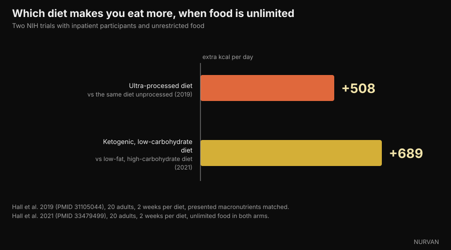

# Do carbs make you gain weight? Where the fat is actually hiding

Di [Giammaria Loi](/autore/giammaria-loi) · updated 6 October 2026

A widely shared post by Italian nutrition educator Andrea Biasci argues that the foods we call "carbs" are often loaded with fat, and that people who lose weight by cutting carbs are really just cutting calories. We checked the first claim food by food against the official Italian composition tables, and the second against inpatient feeding trials. Most of it holds up — but the numbers say something sharper than "it's not the carbs".

## The short version

- **In lasagne, 49% of the calories come from fat and only 27% from carbohydrate.** It is not a carb dish: it is a fat dish with some pasta in it. CREA data, our calculation.
- **Bagged crisps are 51% fat calories, cheese crackers 45%, a chocolate-coated wafer 47%.** All of them are mentally filed under "carbs".
- **But white bread is 2% fat calories and cooked pasta 3%.** This is the nuance the post skips: the problem is not the carbohydrate category, it is how processed and composite the food is.
- **Sugar really does mask the taste of fat.** The 1990 study the post cites is real, and it is titled *Invisible fats*: the sweeter the sample, the less fat people perceived — at identical fat content.
- **Cutting carbs does not make you eat less.** In an NIH inpatient trial with unlimited food, the low-fat diet led people to eat 689 kcal a day less than the ketogenic one. The macronutrient is not what creates the deficit.

*Lasagne is the clearest example: 196 kcal per 100 g, of which 49% comes from fat and only 27% from carbohydrate. Photo: Syced, Wikimedia Commons, CC0.*

## "Carbs" is a category, not a plate of food

In everyday language "carbs" has become a category of **foods**: pasta, bread, biscuits, snack cakes, pizza, crisps. Inside those foods, though, carbohydrate is only one of three macronutrients — and often not the one supplying most of the calories.

The confusion comes from a step that looks harmless: if a food is mostly flour, its calories must come from flour. It does not work that way. A gram of fat carries 9 kcal, more than double a gram of carbohydrate. A few grams of butter, oil or spread are enough to flip the energy balance of a portion.

The post makes that point well and suggests something simple: open the nutrition tables. So we did, using a database we already have inside the app.

## What the official food tables say

We took the food composition tables from **CREA**, Italy's national food and nutrition research centre, and worked out how much of each food's energy comes from each macronutrient. The arithmetic is trivial: grams of carbohydrate × 4, grams of protein × 4, grams of fat × 9, then look at the proportions.

*Where the calories come from in 11 everyday foods. Data: CREA, Italian food composition tables, 2019 update. Calculation and chart by Nurvan.*

The result is sharper than the post implies. In **lasagne**, carbohydrate supplies 27% of the calories and fat 49%: calling it a carb dish is simply wrong. **Bagged crisps** reach 51% fat calories, **chocolate hazelnut spread** 53%, a **chocolate-coated wafer** 47%, **cheese crackers** 45%.

| Food (100 g) | kcal | Carbohydrate | Fat | % kcal from fat |
|---|---|---|---|---|
| Chocolate hazelnut spread | 537 | 58.1 g | 32.4 g | **53%** |
| Bagged crisps | 512 | 58.0 g | 29.6 g | **51%** |
| Lasagne | 196 | 13.4 g | 10.8 g | **49%** |
| Chocolate-coated wafer | 498 | 60.3 g | 26.6 g | **47%** |
| Cheese crackers | 498 | 59.2 g | 25.5 g | **45%** |
| Croissant | 403 | 54.7 g | 18.3 g | **40%** |
| Cocoa-filled snack cake | 410 | 65.5 g | 15.1 g | **32%** |
| Breadsticks | 421 | 65.1 g | 13.9 g | **29%** |
| Shortbread biscuits | 426 | 71.7 g | 13.8 g | **28%** |
| Pasta, cooked | 175 | 37.3 g | 0.6 g | **3%** |
| White bread | 268 | 59.5 g | 0.5 g | **2%** |

*Values per 100 g from the CREA tables (2019 update); the share of calories from fat is our own calculation at 4/4/9 kcal per gram.*

The last two rows are what changes the conclusion. **White bread takes 2% of its calories from fat, cooked pasta 3%.** They are essentially fat-free. The same is true of rice, boiled potatoes, pulses and fruit.

*White bread takes 2% of its calories from fat, cooked pasta 3%. Unprocessed carbohydrate sources are not part of the problem. Photo: FranHogan, Wikimedia Commons, CC BY-SA 4.0.*

So the correct sentence is not "carbs are fat too", but: **the more composite and processed a food is, the more fat it carries, whatever category we filed it under.** A breadstick is not bread, a snack cake is not bread, lasagne is not pasta. Anyone weighing the pasta but not the sauce is measuring the least caloric part of the plate.

## Why you don't notice: sugar covers fat

The post cites a 1990 study by Drewnowski and Schwartz. It exists, and we opened it: the title is *Invisible fats*, published in *Appetite*.

Fifty normal-weight female students tasted fifteen cake-frosting-like preparations, with sucrose from 20% to 77% and butter from 15% to 35%, and rated sweetness and fat content. Perceived sweetness tracked sugar faithfully. Perceived fat did not: **as sugar went up, samples were judged lower in fat while containing the same butter.**

The authors conclude exactly what we need: this may explain why so many high-fat desserts are seen as "carbohydrate-rich" foods. It is a sensory experiment on a small sample — it does not prove you gain more weight, it proves you do not notice.

*In packaged savoury snacks fat is the biggest line item, but the flavour you notice is the crunchy part. Photo: Toby Scratch Fanatic, Wikimedia Commons, CC0.*

The more recent piece is from 2018, in *Cell Metabolism*. Using a real auction task and functional MRI, participants were willing to **pay more** for foods combining fat and carbohydrate than for equally familiar, equally liked, equally caloric foods made of fat alone or carbohydrate alone. And they estimated the energy density of fatty foods **better**, and of mixed foods **worse**.

In short: the combination is both liked more calorie for calorie and judged worse by the brain. Industrial products that marry sugar and fat sit exactly in the blind spot.

## So why do people lose weight cutting carbs?

Here the post lands on the right conclusion — it is the calorie deficit, not the removal of carbohydrate — but the route deserves some numbers, because the literature is less unanimous than it looks.

The largest and best-controlled trial is **DIETFITS**, published in *JAMA* in 2018: 609 adults with overweight, twelve months, 22 group sessions, a healthy low-fat diet against a healthy low-carbohydrate one. Result: −5.3 kg vs −6.0 kg. The 0.7 kg gap is not statistically significant. Neither genotype pattern nor insulin secretion predicted who did better on which diet.

Free-living meta-analyses are less neutral: at 6–12 months they find a small low-carb advantage, **1.3 kg** in a 2020 review of 38 trials and 6,499 adults, **2.2 kg** in a 2016 one. Real but modest — and in both, accompanied by a rise in LDL cholesterol.

The number that settles the argument is one the post does not cite. In 2021 Kevin Hall's group admitted twenty adults to the NIH Clinical Center and gave them, for two weeks each, a ketogenic diet (10% carbohydrate) and a low-fat diet (10% fat, 75% carbohydrate), **with unlimited food in both arms**.

*When people can eat as much as they like, cutting carbs is not what brings calories down. Data: Hall et al. 2019 and 2021. Chart by Nurvan.*

If "carbs make you eat more" were true, the ketogenic arm should have recorded fewer calories. The opposite happened: on the low-fat diet participants ate **689 kcal a day less** than on the ketogenic one, and 544 less in the final week.

The counter-check is the same group's 2019 trial: twenty inpatients, two weeks of an ultra-processed diet and two of an unprocessed one, with presented calories, energy density, macronutrients, sugar, sodium and fibre matched. On the ultra-processed menu they ate **508 kcal a day more** and gained 0.9 kg in two weeks; on the other they lost 0.9 kg.

The macronutrient is not the lever. The form you eat it in is. Most people who lose weight going low-carb have stopped eating snack cakes, crackers, crisps and spreads — that is, they removed fat and calories, exactly as the post says, not just carbohydrate.

## What the research actually says

- **Confirmed** — "Many foods perceived as carbohydrate contain substantial amounts of fat." — Confirmed in the CREA data: lasagne 49% of calories from fat, bagged crisps 51%, cheese crackers 45%, chocolate wafer 47%.
- **Needs nuance** — "Carbs are not the problem." — True, but it needs stating better: unprocessed carbohydrate sources carry almost no fat (white bread 2% of calories, cooked pasta 3%). The variable that matters is not the macronutrient but how composite and processed the food is.
- **Confirmed** — "Sweetness masks the perception of fat (Drewnowski and Schwartz, 1990)." — The study exists, is titled *Invisible fats*, and the finding is as reported: more sugar, less perceived fat at identical real fat. Fifty participants, experimental frostings: a sensory result, not a body-weight result.
- **Confirmed** — "Combining sugar and fat increases palatability." — Confirmed and strengthened: in the 2018 *Cell Metabolism* study people pay more for foods combining fat and carbohydrate, at matched calories, familiarity and liking.
- **Needs nuance** — "The benefit on body weight comes from the energy deficit, not from removing carbohydrate." — DIETFITS, on 609 people, backs the post (0.7 kg difference at 12 months, not significant), but free-living meta-analyses still find a small low-carb edge of 1.3–2.2 kg at 6–12 months.
- **Debunked** — "Cutting carbs makes you spontaneously eat less." — This is the implicit claim behind much low-carb messaging, and in a metabolic ward the opposite happens: with unlimited food, the low-fat diet produced 689 kcal a day less than the ketogenic one.
- **Needs nuance** — "Using an app to track food helps you see which macronutrients drive your calories." — Yes, and it is the most useful advice in the post. With one caveat: eyeballing is at its worst precisely on foods that combine fat and carbohydrate, so you need the written number, not the impression.

## How to use this

1. **Read the fat line, not the carbohydrate line.** On a label, multiply grams of fat by 9 and divide by the calories of that same portion: above about 0.35, fat is the main item, whatever the food is called.
2. **Separate staples from products.** Bread, pasta, rice, potatoes and pulses carry almost no fat. Breadsticks, crackers, biscuits, snack cakes, croissants and spreads are a different animal: same aisle, different composition.
3. **Weigh the sauce, not just the base.** In lasagne, pesto pasta and carbonara nearly all the calories live there. It is the single change that moves the daily total most, and it costs less effort than removing a whole food group.
4. **Track for two weeks, then stop if you want.** You do not need to log forever — just long enough to find out where your calories actually go. Almost everyone finds the surprise in the same column.
5. **Keep protein high while you cut.** It is the lever that protects muscle when calories come down: we covered it in the article on [how much protein you need when cutting](/en/blog/protein-intake-cutting).
6. **Pick the diet you can actually follow.** At matched deficits, low-carb and low-fat give very similar results at twelve months. Adherence beats the name of the protocol.

These are population averages, not a personal plan. If you have diabetes, a lipid disorder, an eating disorder or are on medication, talk to your doctor or a registered dietitian before changing your diet.

> **Nurvan — you see the hidden fat in your log, not on the label**
>
> Nurvan's food database runs on the official CREA tables: log a portion of lasagne or crackers and you immediately see how many calories come from fat and how many from carbohydrate, not just the total. The daily macronutrient split updates itself, so the column that quietly grows stops being a surprise.
>
> [Try Nurvan](https://nurvan.app)

## Frequently asked questions

**Do carbs make you gain weight?**

No more than any other source of calories. Weight gain comes from a sustained energy surplus. The reason "carb foods" are associated with weight gain is that many of them — snack cakes, crackers, crisps, spreads — take between 30% and 53% of their calories from fat, according to the CREA tables.

**How many of lasagne's calories come from carbohydrate?**

27%. Fat supplies 49% and protein 24%, out of 196 kcal per 100 g in the CREA tables. That is why calling it a carb dish is misleading.

**How do I tell from a label whether a food is fatty?**

Multiply grams of fat by 9, divide by the calories of that same portion, and read the percentage. Above roughly 35%, fat is the main contributor, even if the product looks like it is made of flour or sugar.

**Does low carb work better than low fat?**

In the largest controlled trial, DIETFITS on 609 people, the twelve-month difference was 0.7 kg and not significant. Free-living meta-analyses find a small low-carb advantage (1.3–2.2 kg) alongside a rise in LDL cholesterol. Which one you can sustain matters far more.

**Do I have to cut bread and pasta to lose weight?**

No. Bread and pasta take 2% and 3% of their calories from fat respectively: they are not the problem. For most people the biggest margin sits in sauces and packaged products.

## Read next

- [Protein intake when cutting: how much do you need?](/en/blog/protein-intake-cutting) — the nutritional lever that protects muscle while calories come down.
- [Cooled rice: how much does resistant starch matter?](/en/blog/cooled-rice-resistant-starch) — another case where the real numbers are smaller than the headline.
- [CBL-514: the fat-dissolving drug, what the studies say](/en/blog/cbl-514-fat-dissolving-injection) — what happens when you attack body fat from the other end.

## Sources

1. Drewnowski A, Schwartz M, 1990. *Invisible fats: sensory assessment of sugar/fat mixtures.* Appetite 14(3):203-217. PMID 2369116 — [DOI](https://doi.org/10.1016/0195-6663(90)90088-p)
2. DiFeliceantonio AG, Coppin G, Rigoux L, Edwin Thanarajah S, Dagher A, Tittgemeyer M, Small DM, 2018. *Supra-Additive Effects of Combining Fat and Carbohydrate on Food Reward.* Cell Metabolism 28(1):33-44. PMID 29909968 — [DOI](https://doi.org/10.1016/j.cmet.2018.05.018)
3. Hall KD, Guo J, Courville AB et al., 2021. *Effect of a plant-based, low-fat diet versus an animal-based, ketogenic diet on ad libitum energy intake.* Nature Medicine 27(2):344-353. PMID 33479499 — [DOI](https://doi.org/10.1038/s41591-020-01209-1)
4. Hall KD, Ayuketah A, Brychta R et al., 2019. *Ultra-Processed Diets Cause Excess Calorie Intake and Weight Gain: An Inpatient Randomized Controlled Trial of Ad Libitum Food Intake.* Cell Metabolism 30(1):67-77. PMID 31105044 — [DOI](https://doi.org/10.1016/j.cmet.2019.05.008)
5. Gardner CD, Trepanowski JF, Del Gobbo LC et al., 2018. *Effect of Low-Fat vs Low-Carbohydrate Diet on 12-Month Weight Loss in Overweight Adults: The DIETFITS Randomized Clinical Trial.* JAMA 319(7):667-679. PMID 29466592 — [DOI](https://doi.org/10.1001/jama.2018.0245)
6. Chawla S, Tessarolo Silva F, Amaral Medeiros S, Mekary RA, Radenkovic D, 2020. *The Effect of Low-Fat and Low-Carbohydrate Diets on Weight Loss and Lipid Levels: A Systematic Review and Meta-Analysis.* Nutrients 12(12):3774. PMID 33317019 — [DOI](https://doi.org/10.3390/nu12123774)
7. Mansoor N, Vinknes KJ, Veierød MB, Retterstøl K, 2016. *Effects of low-carbohydrate diets v. low-fat diets on body weight and cardiovascular risk factors: a meta-analysis of randomised controlled trials.* British Journal of Nutrition 115(3):466-479. PMID 26768850 — [DOI](https://doi.org/10.1017/S0007114515004699)
8. CREA — Council for Agricultural Research and Economics, Food and Nutrition Research Centre. *Italian food composition tables*, 2019 update — [alimentinutrizione.it](https://www.alimentinutrizione.it/tabelle-nutrizionali/ricerca-per-ordine-alfabetico). Source of the per-100 g values; the macronutrient calorie shares are a Nurvan calculation.

> Scientific sources retrieved from PubMed and verified on 6 October 2026. Composition values come from the official CREA tables already built into Nurvan's food database.

> Starting point: the post by [Andrea Biasci](https://www.instagram.com/p/Dd_OSqQiFfi/) of 3 October 2026 on carbohydrate and weight gain. The text, structure, CREA calculations, fact-checks and charts in this article are original.

**Giammaria Loi** is the founder of Nurvan. He has been lifting since 2012, has worked as a FIPE-certified personal trainer and coach since 2013, and has competed in powerlifting at national level since 2018. Every article he writes starts from the research and ends with what actually works in the gym.

> Note: informational content, not a substitute for advice from a doctor or qualified professional. The figures given are average food composition values and average results from studies in specific populations: they are not a personalised eating plan.
