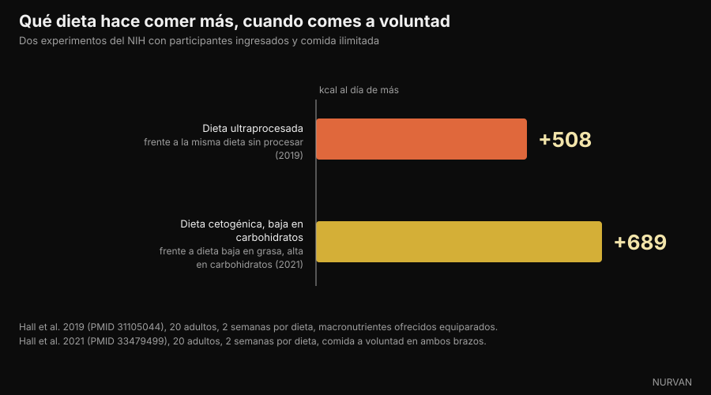

# ¿Los carbohidratos engordan? Dónde se esconde de verdad la grasa

Di [Giammaria Loi](/autore/giammaria-loi) · actualizado el 6 de octubre de 2026

Un post muy compartido del divulgador italiano Andrea Biasci sostiene que los alimentos que llamamos "carbohidratos" suelen estar cargados de grasa, y que quien adelgaza quitando carbohidratos en realidad está quitando calorías. Hemos comprobado lo primero alimento por alimento en las tablas oficiales de composición, y lo segundo en los ensayos con ingreso hospitalario. Casi todo se sostiene, pero los números dicen algo más preciso que "no son los carbohidratos".

## En resumen

- **En la lasaña el 49% de las calorías viene de la grasa y solo el 27% de los carbohidratos.** No es un plato de carbohidratos: es un plato de grasa con algo de pasta dentro. Datos CREA, cálculo nuestro.
- **Las patatas fritas de bolsa son 51% calorías de grasa, las galletas saladas de queso 45%, el barquillo de chocolate 47%.** Todos archivados mentalmente como "carbohidratos".
- **Pero el pan blanco está al 2% de calorías de grasa y la pasta cocida al 3%.** Aquí está el matiz que el post no hace: el problema no es la categoría carbohidratos, es el grado de transformación del alimento.
- **El azúcar sí enmascara la percepción de la grasa.** El estudio de 1990 que cita el post existe y se titula *Invisible fats*: cuanto más azúcar, menos grasa percibían las personas, con la misma grasa real.
- **Quitar los carbohidratos no hace comer menos.** En un ensayo del NIH con comida ilimitada, la dieta baja en grasa llevó a comer 689 kcal al día menos que la cetogénica. El déficit no lo crea el macronutriente.

*La lasaña es el ejemplo más claro: 196 kcal por 100 g, de las que el 49% viene de la grasa y solo el 27% de los carbohidratos. Foto: Syced, Wikimedia Commons, CC0.*

## "Carbohidratos" es una categoría, no un plato

En el lenguaje cotidiano "los carbohidratos" se han convertido en una categoría de **alimentos**: la pasta, el pan, las galletas, los bollos, la pizza, las patatas fritas. Dentro de esos alimentos, en cambio, los carbohidratos son solo uno de los tres macronutrientes, y a menudo no el que aporta más calorías.

La confusión nace de un paso que parece inofensivo: si un alimento está hecho sobre todo de harina, sus calorías vienen de la harina. No funciona así. Un gramo de grasa aporta 9 kcal, más del doble que un gramo de carbohidratos. Bastan unos pocos gramos de mantequilla, aceite o crema para dar la vuelta al balance energético de una ración.

El post lo dice bien y propone algo sencillo: abrir las tablas nutricionales. Lo hemos hecho, con una base de datos que ya tenemos dentro de la app.

## Los números de las tablas oficiales

Hemos tomado las tablas de composición de alimentos del **CREA**, el centro de investigación italiano de alimentos y nutrición, y hemos calculado para cada alimento cuánta parte de las calorías viene de cada macronutriente. La cuenta es elemental: gramos de carbohidratos × 4, gramos de proteína × 4, gramos de grasa × 9, y se mira la proporción.

*De dónde vienen las calorías en 11 alimentos cotidianos. Datos: CREA, tablas italianas de composición de alimentos, actualización 2019. Cálculo y gráfico de Nurvan.*

El resultado es más contundente de lo que sugiere el post. En la **lasaña** los carbohidratos aportan el 27% de las calorías y la grasa el 49%: llamarlo plato de carbohidratos es sencillamente falso. Las **patatas fritas de bolsa** llegan al 51% de calorías de grasa, la **crema de avellanas y cacao** al 53%, el **barquillo de chocolate** al 47%, las **galletas saladas de queso** al 45%.

| Alimento (100 g) | kcal | Carbohidratos | Grasas | % kcal de grasa |
|---|---|---|---|---|
| Crema de avellanas y cacao | 537 | 58,1 g | 32,4 g | **53%** |
| Patatas fritas de bolsa | 512 | 58,0 g | 29,6 g | **51%** |
| Lasaña | 196 | 13,4 g | 10,8 g | **49%** |
| Barquillo de chocolate | 498 | 60,3 g | 26,6 g | **47%** |
| Galletas saladas de queso | 498 | 59,2 g | 25,5 g | **45%** |
| Cruasán | 403 | 54,7 g | 18,3 g | **40%** |
| Bollo relleno de cacao | 410 | 65,5 g | 15,1 g | **32%** |
| Palitos de pan | 421 | 65,1 g | 13,9 g | **29%** |
| Galletas de mantequilla | 426 | 71,7 g | 13,8 g | **28%** |
| Pasta cocida | 175 | 37,3 g | 0,6 g | **3%** |
| Pan blanco | 268 | 59,5 g | 0,5 g | **2%** |

*Valores por 100 g de las tablas CREA (actualización 2019); el porcentaje de calorías de grasa es un cálculo nuestro sobre 4/4/9 kcal por gramo.*

Las dos últimas filas son las que cambian la conclusión. **El pan blanco toma el 2% de sus calorías de la grasa y la pasta cocida el 3%.** Son prácticamente libres de grasa. Lo mismo vale para el arroz, las patatas cocidas, las legumbres y la fruta.

*El pan blanco toma el 2% de sus calorías de la grasa, la pasta cocida el 3%. Las fuentes de carbohidratos sin procesar no son el problema. Foto: FranHogan, Wikimedia Commons, CC BY-SA 4.0.*

Así que la frase correcta no es "los carbohidratos también son grasa", sino: **cuanto más compuesto y transformado es un alimento, más grasa arrastra, sea cual sea la categoría donde lo hemos metido.** El palito de pan no es pan, el bollo no es pan, la lasaña no es pasta. Quien pesa la pasta pero no el sofrito está midiendo la parte menos calórica del plato.

## Por qué no te das cuenta: el azúcar tapa la grasa

El post cita un estudio de 1990 de Drewnowski y Schwartz. Existe, lo hemos abierto: se titula *Invisible fats* — grasas invisibles — y se publicó en *Appetite*.

Cincuenta estudiantes normopeso probaron quince preparaciones parecidas a glaseados de tarta, con azúcar del 20% al 77% y mantequilla del 15% al 35%, y puntuaron dulzor y contenido de grasa. El dulzor percibido seguía fielmente al azúcar. La grasa percibida, no: **al subir el azúcar, las muestras se juzgaban menos grasas conteniendo la misma mantequilla.**

Los autores concluyen justo lo que nos sirve: el mecanismo puede explicar por qué tantos dulces ricos en grasa se consideran alimentos "a base de carbohidratos". Es un experimento sensorial con una muestra pequeña: no demuestra que engordes más, demuestra que no te das cuenta.

*En los aperitivos salados envasados la grasa es la partida principal, pero el sabor que reconoces es el de la parte crujiente. Foto: Toby Scratch Fanatic, Wikimedia Commons, CC0.*

La pieza más reciente es de 2018, en *Cell Metabolism*. Con una subasta real y resonancia magnética funcional, los participantes estaban dispuestos a **pagar más** por alimentos que unían grasa y carbohidratos, frente a alimentos igual de familiares, igual de gustados y con las mismas calorías hechos solo de grasa o solo de carbohidratos. Y estimaban **mejor** la densidad energética de los alimentos grasos y **peor** la de los mixtos.

En resumen: la combinación gusta más a igualdad de calorías y además es la que el cerebro valora peor. El producto industrial que une azúcar y grasa cae exactamente en el punto ciego.

## Entonces, ¿por qué se adelgaza quitando carbohidratos?

Aquí el post llega a la conclusión correcta — es el déficit calórico, no la eliminación de glúcidos — pero el camino merece algún número más, porque la literatura no es tan unánime como parece.

El ensayo más grande y mejor controlado es **DIETFITS**, publicado en *JAMA* en 2018: 609 adultos con sobrepeso, doce meses, 22 sesiones grupales, dieta baja en grasa frente a dieta baja en carbohidratos, ambas construidas con comida de calidad. Resultado: −5,3 kg frente a −6,0 kg. La diferencia de 0,7 kg no es estadísticamente significativa. Ni el perfil genético ni la secreción de insulina permitieron predecir a quién le iba mejor cada dieta.

Los metaanálisis sobre estudios de vida real son menos neutrales: a 6-12 meses encuentran una pequeña ventaja baja en carbohidratos, **1,3 kg** en una revisión de 2020 sobre 38 estudios y 6.499 adultos, **2,2 kg** en una de 2016. Ventaja real pero modesta, y en ambas acompañada de un aumento del colesterol LDL.

El dato que cierra el debate es otro, y el post no lo cita. En 2021 el grupo de Kevin Hall ingresó a veinte adultos en el centro clínico del NIH y les dio, dos semanas cada una, una dieta cetogénica (10% carbohidratos) y una dieta baja en grasa (10% grasa, 75% carbohidratos), **con comida ilimitada en ambos casos**.

*Cuando se puede comer lo que se quiera, no es quitar los carbohidratos lo que baja las calorías. Datos: Hall et al. 2019 y 2021. Gráfico de Nurvan.*

Si la hipótesis "los carbohidratos hacen comer más" fuera cierta, el brazo cetogénico debería haber registrado menos calorías. Pasó lo contrario: con la dieta baja en grasa los participantes comieron **689 kcal al día menos** que con la cetogénica, y 544 menos en la última semana.

La contraprueba es el estudio de 2019 del mismo grupo: veinte ingresados, dos semanas de dieta ultraprocesada y dos de dieta no procesada, con calorías ofrecidas, densidad energética, macronutrientes, azúcares, sodio y fibra equiparados. Con la ultraprocesada comieron **508 kcal al día más** y ganaron 0,9 kg en dos semanas; con la otra perdieron 0,9.

El macronutriente no es la palanca. Lo es la forma en que lo comes. Quien adelgaza pasando a una dieta baja en carbohidratos, en la mayoría de los casos ha dejado de comer bollos, galletas saladas, patatas fritas y cremas de untar: es decir, ha quitado grasa y calorías, como dice el post, no solo glúcidos.

## Qué dice realmente la investigación

- **Confirmado** — "Muchos alimentos percibidos como glucídicos contienen cantidades relevantes de grasa." — Confirmado con los datos CREA: lasaña 49% de las calorías de grasa, patatas fritas de bolsa 51%, galletas saladas de queso 45%, barquillo de chocolate 47%.
- **Con matices** — "El problema no son los carbohidratos." — Cierto, pero hay que decirlo mejor: las fuentes de carbohidratos sin procesar casi no tienen grasa (pan blanco 2% de las calorías, pasta cocida 3%). La variable que cuenta no es el macronutriente, sino cuánto está compuesto y transformado el alimento.
- **Confirmado** — "El dulzor enmascara la percepción de la grasa (Drewnowski y Schwartz, 1990)." — El estudio existe, se titula *Invisible fats*, y el resultado es el descrito: más azúcar, menos grasa percibida con la misma grasa real. Cincuenta participantes y glaseados experimentales: es un dato sensorial, no un dato sobre el peso.
- **Confirmado** — "La combinación de azúcares y grasas aumenta la palatabilidad." — Confirmado y reforzado: en el estudio de 2018 en *Cell Metabolism* las personas pagan más por alimentos que unen grasa y carbohidratos, a igualdad de calorías, familiaridad y agrado.
- **Con matices** — "El beneficio sobre el peso viene del déficit energético, no de eliminar los carbohidratos." — DIETFITS, con 609 personas, da la razón al post (0,7 kg de diferencia a 12 meses, no significativa), pero los metaanálisis de vida real siguen encontrando una pequeña ventaja baja en carbohidratos, de 1,3 a 2,2 kg a 6-12 meses.
- **Desmentido** — "Quitar los carbohidratos hace comer espontáneamente menos." — Es la idea implícita en gran parte del discurso low carb, y en planta hospitalaria ocurre lo contrario: con comida a voluntad, la dieta baja en grasa produjo 689 kcal al día menos que la cetogénica.
- **Con matices** — "Usar una app para monitorizar la alimentación ayuda a entender qué macronutrientes aportan las calorías." — Sí, y es el consejo más útil del post. Con un matiz: justo en los alimentos que unen grasa y carbohidratos la estimación a ojo es la peor, así que hace falta el dato escrito, no la sensación.

## Cómo aplicarlo

1. **Mira la línea de las grasas, no la de los carbohidratos.** En una etiqueta, multiplica los gramos de grasa por 9 y divide entre las calorías de esa misma ración: si sale más de 0,35, la grasa es la partida principal, lo llames como lo llames.
2. **Separa las fuentes de los productos.** Pan, pasta, arroz, patatas y legumbres casi no tienen grasa. Palitos de pan, galletas saladas, galletas, bollos, cruasanes y cremas de untar son otra cosa: mismo pasillo, composición distinta.
3. **Pesa el aliño, no solo la base.** En la lasaña, la pasta al pesto y la carbonara las calorías están casi todas ahí. Es el cambio que más mueve el total diario y cuesta menos esfuerzo que eliminar un grupo de alimentos entero.
4. **Registra dos semanas y luego deja de hacerlo si quieres.** No hace falta registrar para siempre: basta con el tiempo suficiente para descubrir dónde acaban de verdad tus calorías. Casi todo el mundo encuentra la sorpresa en la misma columna.
5. **Mantén altas las proteínas mientras recortas.** Es la palanca que protege la masa muscular cuando bajan las calorías: lo tratamos en el artículo sobre [cuántas proteínas necesitas en definición](/es/blog/proteinas-en-definicion).
6. **Elige la dieta que puedas seguir.** A igualdad de déficit, baja en carbohidratos y baja en grasa dan resultados muy parecidos a doce meses. La adherencia vale más que el nombre del protocolo.

Estos son datos medios de población, no un plan personalizado. Si tienes diabetes, dislipemias, un trastorno de la conducta alimentaria o sigues un tratamiento, habla con tu médico o con un dietista-nutricionista antes de cambiar tu alimentación.

> **Nurvan — la grasa oculta la ves en el diario, no en la etiqueta**
>
> La base de datos de alimentos de Nurvan usa las tablas oficiales CREA: cuando registras una ración de lasaña o de galletas saladas ves enseguida cuántas calorías vienen de la grasa y cuántas de los carbohidratos, no solo el total. El reparto diario de macronutrientes se actualiza solo, así que la columna que crece a escondidas deja de ser una sorpresa.
>
> [Prueba Nurvan](https://nurvan.app)

## Preguntas frecuentes

**¿Los carbohidratos engordan?**

No más que cualquier otra fuente de calorías. Se engorda con un superávit energético prolongado. El motivo por el que los "alimentos de carbohidratos" se asocian al aumento de peso es que muchos de ellos — bollos, galletas saladas, patatas fritas, cremas de untar — toman entre el 30% y el 53% de sus calorías de la grasa, según las tablas CREA.

**¿Cuántas calorías de la lasaña vienen de los carbohidratos?**

El 27%. La grasa aporta el 49% y las proteínas el 24%, sobre 196 kcal por 100 g según las tablas CREA. Por eso llamarlo plato de carbohidratos es engañoso.

**¿Cómo sé si un alimento es graso leyendo la etiqueta?**

Multiplica los gramos de grasa por 9, divide entre las calorías de esa misma ración y lee el porcentaje. Por encima del 35% aproximadamente la grasa es la contribución principal, aunque el producto parezca hecho de harina o de azúcar.

**¿La dieta baja en carbohidratos funciona mejor que la baja en grasa?**

En el ensayo más grande y controlado, DIETFITS con 609 personas, la diferencia a doce meses fue de 0,7 kg y no significativa. Los metaanálisis de vida real encuentran una pequeña ventaja baja en carbohidratos (1,3-2,2 kg), pero también un aumento del colesterol LDL. Cuenta mucho más cuál de las dos puedes mantener.

**¿Tengo que eliminar el pan y la pasta para adelgazar?**

No. El pan y la pasta aportan el 2% y el 3% de sus calorías desde la grasa: no son el problema. Para la mayoría de las personas el mayor margen está en los aliños y en los productos envasados.

## Lee también

- [Proteínas en definición: cuántas necesitas de verdad](/es/blog/proteinas-en-definicion) — la palanca nutricional que protege el músculo cuando recortas calorías.
- [Arroz enfriado: cuánto importa el almidón resistente](/es/blog/arroz-enfriado-almidon-resistente) — otro caso en el que los números reales son más pequeños que el titular.
- [CBL-514: el fármaco contra la grasa, qué dicen los estudios](/es/blog/cbl-514-farmaco-grasa-subcutanea) — qué pasa cuando se intenta atacar la grasa desde el otro lado.

## Fuentes

1. Drewnowski A, Schwartz M, 1990. *Invisible fats: sensory assessment of sugar/fat mixtures.* Appetite 14(3):203-217. PMID 2369116 — [DOI](https://doi.org/10.1016/0195-6663(90)90088-p)
2. DiFeliceantonio AG, Coppin G, Rigoux L, Edwin Thanarajah S, Dagher A, Tittgemeyer M, Small DM, 2018. *Supra-Additive Effects of Combining Fat and Carbohydrate on Food Reward.* Cell Metabolism 28(1):33-44. PMID 29909968 — [DOI](https://doi.org/10.1016/j.cmet.2018.05.018)
3. Hall KD, Guo J, Courville AB et al., 2021. *Effect of a plant-based, low-fat diet versus an animal-based, ketogenic diet on ad libitum energy intake.* Nature Medicine 27(2):344-353. PMID 33479499 — [DOI](https://doi.org/10.1038/s41591-020-01209-1)
4. Hall KD, Ayuketah A, Brychta R et al., 2019. *Ultra-Processed Diets Cause Excess Calorie Intake and Weight Gain: An Inpatient Randomized Controlled Trial of Ad Libitum Food Intake.* Cell Metabolism 30(1):67-77. PMID 31105044 — [DOI](https://doi.org/10.1016/j.cmet.2019.05.008)
5. Gardner CD, Trepanowski JF, Del Gobbo LC et al., 2018. *Effect of Low-Fat vs Low-Carbohydrate Diet on 12-Month Weight Loss in Overweight Adults: The DIETFITS Randomized Clinical Trial.* JAMA 319(7):667-679. PMID 29466592 — [DOI](https://doi.org/10.1001/jama.2018.0245)
6. Chawla S, Tessarolo Silva F, Amaral Medeiros S, Mekary RA, Radenkovic D, 2020. *The Effect of Low-Fat and Low-Carbohydrate Diets on Weight Loss and Lipid Levels: A Systematic Review and Meta-Analysis.* Nutrients 12(12):3774. PMID 33317019 — [DOI](https://doi.org/10.3390/nu12123774)
7. Mansoor N, Vinknes KJ, Veierød MB, Retterstøl K, 2016. *Effects of low-carbohydrate diets v. low-fat diets on body weight and cardiovascular risk factors: a meta-analysis of randomised controlled trials.* British Journal of Nutrition 115(3):466-479. PMID 26768850 — [DOI](https://doi.org/10.1017/S0007114515004699)
8. CREA — Centro de investigación Alimentos y Nutrición (Italia). *Tablas de composición de los alimentos*, actualización 2019 — [alimentinutrizione.it](https://www.alimentinutrizione.it/tabelle-nutrizionali/ricerca-per-ordine-alfabetico). Fuente de los valores por 100 g; los porcentajes de calorías por macronutriente son un cálculo de Nurvan.

> Fuentes científicas recuperadas de PubMed y verificadas el 6 de octubre de 2026. Los valores de composición proceden de las tablas oficiales CREA ya integradas en la base de datos de alimentos de Nurvan.

> Punto de partida: el post de [Andrea Biasci](https://www.instagram.com/p/Dd_OSqQiFfi/) del 3 de octubre de 2026 sobre los carbohidratos y el aumento de peso. El texto, la estructura, los cálculos sobre los datos CREA, las verificaciones y los gráficos de este artículo son originales.

**Giammaria Loi** es el fundador de Nurvan. Entrena con pesas desde 2012, trabaja como entrenador personal y coach certificado FIPE desde 2013 y compite en powerlifting a nivel nacional desde 2018. Cada artículo que firma parte de los estudios científicos y llega a lo que funciona de verdad en el gimnasio.

> Nota: contenido informativo, no sustituye la opinión de un médico o profesional cualificado. Los valores indicados son medias de composición de los alimentos y resultados medios de estudios en poblaciones concretas: no constituyen un plan alimentario personalizado.
